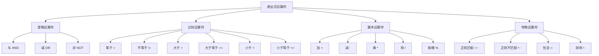
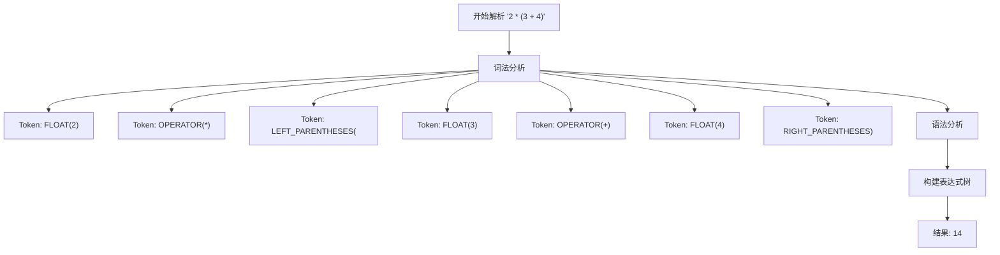
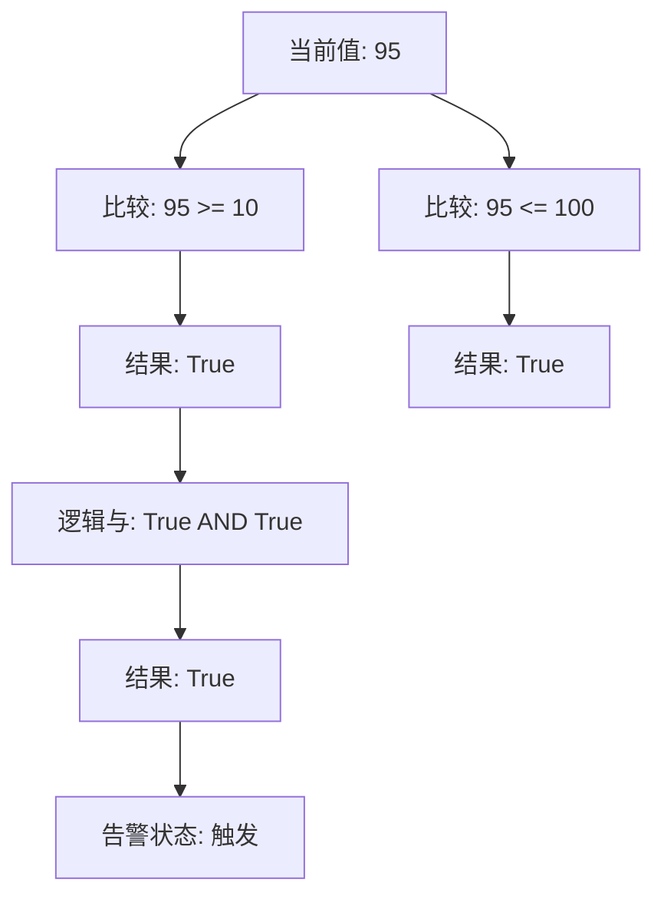
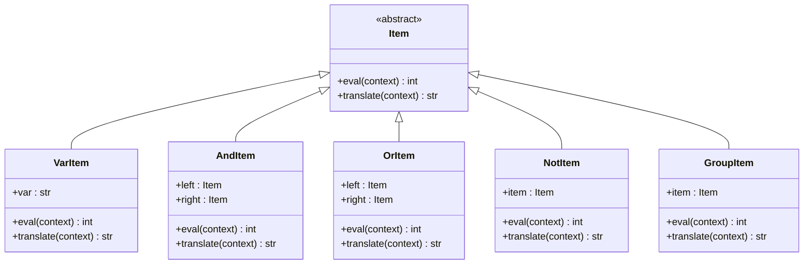
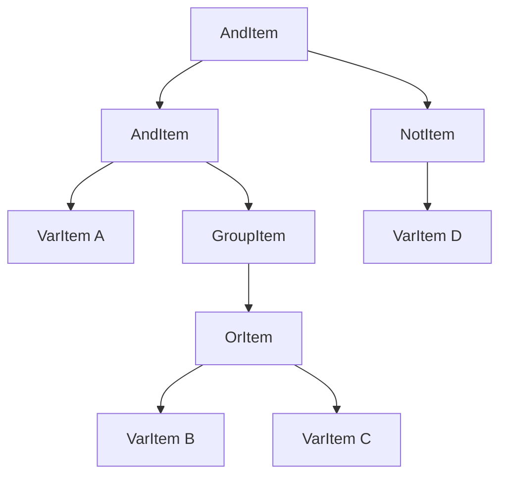

# 运算符

<cite>
**本文档中引用的文件**   
- [expression.py](file://bkmonitor/bkmonitor/strategy/expression.py)
- [threshold/__init__.py](file://bkmonitor/bkmonitor/as_code/ply/threshold/__init__.py)
- [conditions/__init__.py](file://bkmonitor/bkmonitor/as_code/ply/conditions/__init__.py)
- [expression/__init__.py](file://bkmonitor/bkmonitor/as_code/ply/expression/__init__.py)
- [detect/README.md](file://alarm_backends/service/detect/README.md)
- [parsetab.py](file://bkmonitor/bkmonitor/strategy/parsetab.py)
</cite>

## 目录
1. [简介](#简介)
2. [核心运算符类型](#核心运算符类型)
3. [算术运算符](#算术运算符)
4. [比较运算符](#比较运算符)
5. [逻辑运算符](#逻辑运算符)
6. [位运算符](#位运算符)
7. [运算符优先级与结合性](#运算符优先级与结合性)
8. [表达式树与执行机制](#表达式树与执行机制)
9. [实际应用示例](#实际应用示例)
10. [错误处理](#错误处理)

## 简介
本文档详细阐述了蓝鲸监控平台中表达式引擎所支持的各类运算符及其使用方法。系统通过PLY（Python Lex-Yacc）库实现了多个独立的表达式解析器，分别用于处理逻辑关联、阈值判断、条件筛选和算术计算等场景。这些解析器共同构成了一个强大的表达式处理框架，支持在告警策略、数据筛选和指标计算等多种监控场景中灵活应用。

**本文档中引用的文件**   
- [expression.py](file://bkmonitor/bkmonitor/strategy/expression.py)
- [detect/README.md](file://alarm_backends/service/detect/README.md)

## 核心运算符类型
蓝鲸监控平台的表达式系统根据应用场景的不同，支持四种主要的运算符类型：逻辑运算符、比较运算符、算术运算符和特殊运算符。每种类型都有其特定的语法和语义，由不同的解析器模块进行处理。



**图源**  
- [expression.py](file://bkmonitor/bkmonitor/strategy/expression.py)
- [threshold/__init__.py](file://bkmonitor/bkmonitor/as_code/ply/threshold/__init__.py)
- [conditions/__init__.py](file://bkmonitor/bkmonitor/as_code/ply/conditions/__init__.py)
- [expression/__init__.py](file://bkmonitor/bkmonitor/as_code/ply/expression/__init__.py)

## 算术运算符
算术运算符用于执行基本的数学计算，主要在指标转换和复杂计算场景中使用。该功能由 `as_code/ply/expression` 模块提供。

### 支持的算术运算符
| 运算符 | 描述 | 示例 |
| :--- | :--- | :--- |
| `+` | 加法 | `a + b` |
| `-` | 减法 | `a - b` |
| `*` | 乘法 | `a * b` |
| `/` | 除法 | `a / b` |
| `%` | 取模 | `a % b` |
| `()` | 括号（改变优先级） | `(a + b) * c` |

### 操作数与返回值类型
- **操作数类型**: 支持整数 (`int`)、浮点数 (`float`) 和变量引用。
- **返回值类型**: 运算结果为数值类型，遵循Python的数值运算规则。

### 实现细节
算术表达式解析器定义了 `OPERATOR` Token，其正则表达式为 `r"[-+*/%^]"`，涵盖了所有基本的算术操作。解析器能够正确处理包含括号的复杂表达式，确保运算顺序符合数学规范。



**图源**  
- [expression/__init__.py](file://bkmonitor/bkmonitor/as_code/ply/expression/__init__.py)
- [expression/parsetab.py](file://bkmonitor/bkmonitor/as_code/ply/expression/parsetab.py)

**本节源码**  
- [expression/__init__.py](file://bkmonitor/bkmonitor/as_code/ply/expression/__init__.py)

## 比较运算符
比较运算符用于判断两个值之间的关系，是告警策略中阈值判断的核心。该功能由 `as_code/ply/threshold` 和 `alarm_backends/service/detect` 模块实现。

### 支持的比较运算符
| 运算符 | 描述 | 示例 |
| :--- | :--- | :--- |
| `=` | 等于 | `value = 100` |
| `!=` | 不等于 | `value != 0` |
| `>` | 大于 | `value > 90` |
| `>=` | 大于等于 | `value >= 80` |
| `<` | 小于 | `value < 10` |
| `<=` | 小于等于 | `value <= 5` |

### 操作数与返回值类型
- **操作数类型**: 左侧操作数通常为监控指标的当前值 (`value`)，右侧操作数为阈值 (`threshold`)，均为数值类型。
- **返回值类型**: 布尔值 (`True` 或 `False`)，表示比较结果。

### 实现细节
比较运算符在静态阈值检测算法中被广泛使用。例如，表达式 `>= 10 and <= 100 or = 0` 表示当指标值在10到100之间，或者等于0时触发告警。解析器会将此表达式拆分为多个条件，并使用逻辑运算符连接。



**图源**  
- [threshold/__init__.py](file://bkmonitor/bkmonitor/as_code/ply/threshold/__init__.py)
- [detect/README.md](file://alarm_backends/service/detect/README.md)

**本节源码**  
- [threshold/__init__.py](file://bkmonitor/bkmonitor/as_code/ply/threshold/__init__.py)
- [detect/README.md](file://alarm_backends/service/detect/README.md)

## 逻辑运算符
逻辑运算符用于组合多个条件或告警事件，是多告警关联策略的基础。该功能由 `bkmonitor/strategy/expression.py` 模块实现。

### 支持的逻辑运算符
| 运算符 | 描述 | 示例 |
| :--- | :--- | :--- |
| `&&` | 与 (AND) | `A && B` |
| `||` | 或 (OR) | `A || B` |
| `!` | 非 (NOT) | `!A` |
| `()` | 括号（分组） | `(A || B) && C` |

### 操作数与返回值类型
- **操作数类型**: 操作数为布尔值或表示告警状态的变量（如 `A`, `B`, `C`）。
- **返回值类型**: 布尔值 (`True` 或 `False`)。

### 实现细节
逻辑运算符的实现基于面向对象的设计模式。每个运算符对应一个类：
- `AndItem`: 实现 `&&` 运算，返回其左右子表达式状态的最小值。
- `OrItem`: 实现 `||` 运算，返回其左右子表达式状态的最大值。
- `NotItem`: 实现 `!` 运算，将异常状态转为正常，正常转为异常，无数据保持不变。



**图源**  
- [expression.py](file://bkmonitor/bkmonitor/strategy/expression.py)

**本节源码**  
- [expression.py](file://bkmonitor/bkmonitor/strategy/expression.py)

## 位运算符
根据现有代码分析，蓝鲸监控平台的表达式系统目前**不支持**位运算符（如 `&`, `|`, `^`, `~`, `<<`, `>>`）。系统的 `OPERATOR` Token 定义中仅包含 `[-+*/%^]`，未包含位运算符。逻辑运算符 `&&` 和 `||` 用于布尔逻辑，而非按位操作。

## 运算符优先级与结合性
运算符的优先级和结合性决定了表达式中运算的执行顺序，这对于正确解析复杂表达式至关重要。

### 优先级规则
在 `bkmonitor/strategy/expression.py` 文件中，通过 `precedence` 元组明确定义了运算符的优先级：

```python
precedence = (
    ("left", "AND", "OR"),  # 优先级较低，从左到右结合
    ("right", "N_NOT"),     # 优先级较高，从右到左结合
)
```

这表明：
1. `NOT` 运算符 (`!`) 具有最高优先级。
2. `AND` 和 `OR` 运算符具有相同且较低的优先级。
3. `AND` 和 `OR` 是左结合的，`NOT` 是右结合的。

### 结合性规则
- **左结合 (Left-associative)**: 对于相同优先级的运算符，从左到右依次计算。例如，`A && B && C` 等价于 `(A && B) && C`。
- **右结合 (Right-associative)**: 对于相同优先级的运算符，从右到左依次计算。`NOT` 运算符是右结合的，但通常一元运算符的结合性影响较小。

### 使用括号改变顺序
可以使用括号 `()` 来显式地改变运算顺序，括号内的表达式将被优先计算。例如，在表达式 `A || (B && C)` 中，`B && C` 会先于 `A || ...` 被计算。

**本节源码**  
- [expression.py](file://bkmonitor/bkmonitor/strategy/expression.py#L190-L193)

## 表达式树与执行机制
表达式在内部被表示为一棵抽象语法树（AST），这棵树的结构直接反映了表达式的语法和运算顺序。

### 表达式树的构建
1. **词法分析 (Lexical Analysis)**: 使用 `ply.lex` 将输入的字符串分解成一系列Token（如 `VAR`, `AND`, `LPAREN`）。
2. **语法分析 (Syntax Analysis)**: 使用 `ply.yacc` 根据预定义的语法规则，将Token流构建成一棵表达式树。

例如，表达式 `A && (B || C) && !D` 的解析过程如下：
- 词法分析得到: `VAR(A)`, `AND`, `LPAREN`, `VAR(B)`, `OR`, `VAR(C)`, `RPAREN`, `AND`, `NOT`, `VAR(D)`
- 语法分析根据 `p_expression_and`, `p_expression_or`, `p_expression_not`, `p_expression_group` 等规则，构建出对应的树结构。

### 执行机制
表达式树的执行通过递归调用 `eval` 方法完成：
1. 从根节点开始调用 `eval` 方法。
2. 对于 `AndItem` 节点，递归计算左右子树的值，然后返回两者的最小值。
3. 对于 `OrItem` 节点，递归计算左右子树的值，然后返回两者的最大值。
4. 对于 `NotItem` 节点，递归计算子树的值，然后根据预定义的规则进行状态转换。
5. 对于 `VarItem` 节点，从上下文 `context` 字典中查找变量的实际值。



**图源**  
- [expression.py](file://bkmonitor/bkmonitor/strategy/expression.py)

**本节源码**  
- [expression.py](file://bkmonitor/bkmonitor/strategy/expression.py)

## 实际应用示例
以下是在不同监控场景下使用运算符的具体示例。

### 示例1：多告警关联
**场景**: 当主机CPU和内存同时出现异常，或者磁盘空间不足时，触发一个高级别告警。
**表达式**: `(CPU_ABNORMAL && MEM_ABNORMAL) || DISK_FULL`
**执行**:
```python
context = {"cpu_abnormal": 20, "mem_abnormal": 20, "disk_full": 10}
expr = parse_expression("(CPU_ABNORMAL && MEM_ABNORMAL) || DISK_FULL")
result = expr.eval(context) # 返回 20 (ABNORMAL)
```

### 示例2：复杂阈值判断
**场景**: 检测Web服务响应时间，要求响应时间在100ms到500ms之间，或者等于0（表示服务不可达）。
**表达式**: `(response_time >= 100 and response_time <= 500) or response_time = 0`
**执行**:
```python
# 使用 threshold 解析器
condition = threshold_parser.parse("(response_time >= 100 and response_time <= 500) or response_time = 0")
# 根据 condition 的配置进行数据检测
```

### 示例3：数据筛选条件
**场景**: 在查询日志时，筛选出错误级别为ERROR且包含特定关键字的日志。
**表达式**: `level = "ERROR" and message =~ "timeout"`
**执行**:
```python
# 使用 conditions 解析器
filter_rules = conditions_parser.parse('level = "ERROR" and message =~ "timeout"')
# 应用 filter_rules 到日志数据流
```

**本节源码**  
- [expression.py](file://bkmonitor/bkmonitor/strategy/expression.py)
- [threshold/__init__.py](file://bkmonitor/bkmonitor/as_code/ply/threshold/__init__.py)
- [conditions/__init__.py](file://bkmonitor/bkmonitor/as_code/ply/conditions/__init__.py)

## 错误处理
表达式解析和执行过程中可能遇到多种错误，系统提供了相应的错误处理机制。

### 常见错误类型
- **语法错误 (Syntax Error)**: 当表达式格式不正确时抛出。例如，`A && || B` 缺少操作数。
- **未定义变量 (Undefined Variable)**: 当表达式中引用了上下文中不存在的变量时抛出。
- **非法字符 (Illegal Character)**: 当输入包含无法识别的字符时抛出。

### 错误处理实现
- `t_error(t)` 函数处理词法分析阶段的非法字符。
- `p_error(p)` 函数处理语法分析阶段的语法错误。
- `VarItem.eval()` 方法在变量未定义时抛出 `ValueError`。

```python
def t_error(t):
    raise ValueError("Illegal character '%s' at position %d" % (t.value, t.lexpos))

def p_error(p):
    if p:
        raise ValueError("Syntax error at '%s' at position %d" % (p.value, p.lexpos))
    else:
        raise ValueError("Syntax error at EOF")
```

**本节源码**  
- [expression.py](file://bkmonitor/bkmonitor/strategy/expression.py#L54-L57)
- [expression.py](file://bkmonitor/bkmonitor/strategy/expression.py#L225-L230)
- [expression.py](file://bkmonitor/bkmonitor/strategy/expression.py#L85-L89)