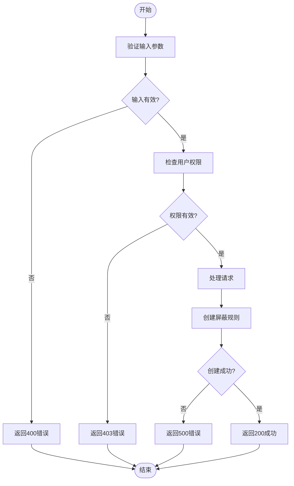

# 创建屏蔽规则

<cite>
**本文档引用的文件**   
- [backend_resources.py](file://bkmonitor\packages\monitor_web\shield\resources\backend_resources.py)
- [serializers.py](file://bkmonitor\packages\monitor_web\shield\serializers.py)
- [shield.py](file://bkmonitor\constants\shield.py)
- [views.py](file://bkmonitor\packages\monitor_web\shield\views.py)
- [action.py](file://bkmonitor\bkmonitor\iam\action.py)
</cite>

## 目录
1. [创建屏蔽规则API概述](#创建屏蔽规则api概述)
2. [请求方法与URL路径](#请求方法与url路径)
3. [认证与权限控制](#认证与权限控制)
4. [请求体结构](#请求体结构)
5. [屏蔽类型与参数配置](#屏蔽类型与参数配置)
6. [输入验证规则](#输入验证规则)
7. [错误响应码](#错误响应码)
8. [curl示例](#curl示例)
9. [审计日志记录](#审计日志记录)

## 创建屏蔽规则API概述

创建屏蔽规则API是监控平台提供的一项核心功能，允许用户通过RESTful接口创建不同类型的屏蔽规则。该API支持临时屏蔽、周期屏蔽和条件屏蔽三种模式，能够满足多样化的运维需求。API设计遵循DRF（Django REST Framework）资源模式，通过`AddShieldResource`类实现核心逻辑。

该API的主要功能包括：
- 创建基于范围、策略、告警或维度的屏蔽规则
- 支持一次性、每日、每周、每月等周期性屏蔽
- 提供灵活的维度条件配置，实现精准屏蔽
- 支持屏蔽通知配置，及时告知相关人员
- 实现严格的输入验证和权限控制

API的实现位于`bkmonitor\packages\monitor_web\shield\resources\backend_resources.py`文件中，通过资源路由与视图层解耦，确保了代码的可维护性和扩展性。

**Section sources**
- [backend_resources.py](file://bkmonitor\packages\monitor_web\shield\resources\backend_resources.py)

## 请求方法与URL路径

创建屏蔽规则API采用标准的RESTful设计模式，使用POST方法进行资源创建。API的URL路径遵循平台统一的路由规范。

**HTTP方法**：`POST`

**URL路径**：`/api/shield/add_shield/`

该路径通过DRF Resource路由机制映射到`AddShieldResource`资源类。在`views.py`文件中，通过`ResourceRoute`定义了该端点：

```python
ResourceRoute("POST", resource.shield.add_shield, endpoint="add_shield")
```

URL路径设计遵循以下原则：
- `/api/` 作为API的统一前缀
- `shield` 表示功能模块
- `add_shield` 表示具体操作，语义清晰

该API端点支持JSON格式的请求体，响应格式也为JSON，便于前后端交互和自动化脚本调用。

**Section sources**
- [views.py](file://bkmonitor\packages\monitor_web\shield\views.py)
- [backend_resources.py](file://bkmonitor\packages\monitor_web\shield\resources\backend_resources.py)

## 认证与权限控制

创建屏蔽规则API实现了严格的认证与权限控制机制，确保只有授权用户才能创建屏蔽规则。

### 认证方式
API采用平台统一的认证机制，通过IAM（Identity and Access Management）系统进行用户身份验证。请求需要包含有效的认证令牌，系统会自动解析用户身份信息。

### 权限控制
权限控制通过`ActionEnum.MANAGE_DOWNTIME`权限码实现。在`AddShieldResource`的`validate_request_data`方法中进行了权限验证：

```python
if not p.is_allowed_by_biz(request_data["bk_biz_id"], ActionEnum.MANAGE_DOWNTIME):
    raise ValidationError(
        {"verify_user_permission": f"当前用户无权限新增{request_data['bk_biz_id']}业务屏蔽配置"}
    )
```

权限控制逻辑如下：
1. 获取当前请求用户
2. 检查用户是否具有`MANAGE_DOWNTIME`（屏蔽管理）权限
3. 验证用户是否有权操作指定的业务ID
4. 如果权限不足，返回403错误

权限定义位于`bkmonitor\bkmonitor\iam\action.py`文件中：

```python
MANAGE_DOWNTIME = ActionMeta(
    id="manage_downtime_v2",
    name=_("屏蔽管理"),
    name_en="Manage Downtime",
    type="manage",
    related_resource_types=[SPACE_RESOURCE],
    related_actions=[VIEW_BUSINESS.id, VIEW_NOTIFY_TEAM.id, VIEW_RULE.id],
    version=1,
)
```

这种基于角色的访问控制（RBAC）机制确保了系统的安全性，防止未授权用户创建屏蔽规则。

**Section sources**
- [action.py](file://bkmonitor\bkmonitor\iam\action.py)
- [backend_resources.py](file://bkmonitor\packages\monitor_web\shield\resources\backend_resources.py)

## 请求体结构

创建屏蔽规则API的请求体采用JSON格式，包含创建屏蔽规则所需的所有参数。请求体结构设计灵活，能够支持多种屏蔽类型。

### 基础结构
```json
{
    "bk_biz_id": 2,
    "category": "strategy",
    "begin_time": "2024-09-03 17:31:48",
    "end_time": "2024-09-03 18:01:48",
    "cycle_config": {
        "type": 1,
        "begin_time": "",
        "end_time": "",
        "day_list": [],
        "week_list": []
    },
    "shield_notice": false,
    "notice_config": {},
    "description": "",
    "dimension_config": {},
    "is_quick": false,
    "source": "",
    "label": ""
}
```

### 参数说明
| 参数名 | 类型 | 必填 | 说明 |
|-------|------|------|------|
| `bk_biz_id` | 整数 | 是 | 业务ID，标识屏蔽规则所属的业务 |
| `category` | 字符串 | 是 | 屏蔽类型，支持'scope'、'strategy'、'alert'、'dimension' |
| `begin_time` | 字符串 | 是 | 屏蔽开始时间，格式为"YYYY-MM-DD HH:MM:SS" |
| `end_time` | 字符串 | 是 | 屏蔽结束时间，格式为"YYYY-MM-DD HH:MM:SS" |
| `cycle_config` | 对象 | 否 | 周期配置，定义周期性屏蔽的规则 |
| `shield_notice` | 布尔值 | 是 | 是否发送屏蔽通知 |
| `notice_config` | 对象 | 否 | 通知配置，当`shield_notice`为true时有效 |
| `description` | 字符串 | 否 | 屏蔽原因描述 |
| `dimension_config` | 对象 | 是 | 维度配置，根据屏蔽类型有不同的结构 |
| `is_quick` | 布尔值 | 否 | 是否为快捷屏蔽 |
| `source` | 字符串 | 否 | 屏蔽来源 |
| `label` | 字符串 | 否 | 屏蔽标签 |

请求体结构通过序列化器进行验证和处理，确保数据的完整性和正确性。

**Section sources**
- [backend_resources.py](file://bkmonitor\packages\monitor_web\shield\resources\backend_resources.py)
- [serializers.py](file://bkmonitor\packages\monitor_web\shield\serializers.py)

## 屏蔽类型与参数配置

创建屏蔽规则API支持多种屏蔽类型，每种类型有不同的参数配置要求。屏蔽类型由`category`参数指定，系统根据类型选择相应的序列化器进行验证。

### 屏蔽类型
根据`constants\shield.py`文件定义，支持的屏蔽类型包括：
- `scope`：范围屏蔽
- `strategy`：策略屏蔽
- `alert`：告警屏蔽
- `dimension`：维度屏蔽

### 临时屏蔽
临时屏蔽是最简单的屏蔽模式，通过设置`cycle_config.type`为1（一次性）实现。

```json
"cycle_config": {
    "type": 1,
    "begin_time": "",
    "end_time": "",
    "day_list": [],
    "week_list": []
}
```

临时屏蔽在指定的开始和结束时间之间生效，过期后自动失效。

### 周期屏蔽
周期屏蔽支持每日、每周、每月等重复模式，通过`cycle_config`参数配置。

```json
"cycle_config": {
    "type": 2,
    "begin_time": "09:00",
    "end_time": "18:00",
    "day_list": [],
    "week_list": [1, 2, 3, 4, 5]
}
```

周期类型定义：
- `1`：一次性
- `2`：每天
- `3`：每周
- `4`：每月

对于周期屏蔽，`begin_time`和`end_time`参数中的日期部分会被忽略，只使用时间部分。

### 条件屏蔽
条件屏蔽通过`dimension_config`参数实现，支持复杂的过滤表达式。

#### 策略屏蔽
```json
"dimension_config": {
    "id": [123],
    "level": [1, 2, 3],
    "dimension_conditions": [
        {
            "key": "bk_target_ip",
            "value": ["10.1.1.1", "127.0.0.1"],
            "method": "eq",
            "condition": "and"
        }
    ]
}
```

#### 维度屏蔽
```json
"dimension_config": {
    "dimension_conditions": [
        {
            "key": "service_name",
            "value": ["web_service", "api_service"],
            "method": "eq",
            "condition": "or"
        }
    ]
}
```

条件屏蔽支持以下匹配方法：
- `eq`：等于
- `neq`：不等于
- `include`：包含
- `exclude`：不包含

以及逻辑条件：
- `and`：与
- `or`：或

**Section sources**
- [shield.py](file://bkmonitor\constants\shield.py)
- [serializers.py](file://bkmonitor\packages\monitor_web\shield\serializers.py)
- [backend_resources.py](file://bkmonitor\packages\monitor_web\shield\resources\backend_resources.py)

## 输入验证规则

创建屏蔽规则API实现了严格的输入验证机制，确保请求数据的完整性和正确性。验证规则通过DRF序列化器实现，分为通用验证和类型特定验证。

### 通用验证规则
在`AddShieldResource.validate_request_data`方法中执行通用验证：

```python
def validate_request_data(self, request_data: dict[str, Any]):
    if request_data.get("verify_user_permission"):
        # 权限验证
        pass
        
    if "category" not in request_data:
        raise ValidationError(detail={"request_data_invalid": "category not exist"})
        
    self.RequestSerializer = SHIELD_SERIALIZER[request_data["category"]]
    # 其他验证...
```

通用验证包括：
- 检查`category`参数是否存在
- 根据`category`选择相应的序列化器
- 验证用户权限（当`verify_user_permission`为true时）

### 类型特定验证
不同屏蔽类型使用不同的序列化器进行验证：

```python
SHIELD_SERIALIZER = {
    ShieldCategory.SCOPE: ScopeSerializer,
    ShieldCategory.STRATEGY: StrategySerializer,
    ShieldCategory.EVENT: EventSerializer,
    ShieldCategory.ALERT: AlertSerializer,
    ShieldCategory.DIMENSION: DimensionSerializer,
}
```

#### 基础验证器（BaseSerializer）
所有序列化器继承自`BaseSerializer`，包含通用字段验证：

```python
class BaseSerializer(serializers.Serializer):
    bk_biz_id = serializers.IntegerField(required=True, label="业务id")
    category = serializers.ChoiceField(required=True, choices=ShieldCategory.CHOICES, label="屏蔽类型")
    begin_time = serializers.CharField(required=True, label="屏蔽开始时间")
    end_time = serializers.CharField(required=True, label="屏蔽结束时间")
    dimension_config = serializers.DictField(required=True, label="维度配置")
    cycle_config = CycleConfigSlz(required=False, label="周期配置")
    shield_notice = serializers.BooleanField(required=True, label="是否有屏蔽通知")
    # 其他字段...
```

#### 时间验证
时间格式验证确保`begin_time`和`end_time`符合"YYYY-MM-DD HH:MM:SS"格式。系统使用`str2datetime`函数进行解析：

```python
def handle_shield_time(begin_time_str, end_time_str, cycle_config):
    return {
        "begin_time": localtime(str2datetime(begin_time_str)),
        "end_time": localtime(str2datetime(end_time_str)),
    }
```

#### 周期配置验证
`CycleConfigSlz`子序列化器验证周期配置：

```python
class CycleConfigSlz(serializers.Serializer):
    type = serializers.IntegerField(required=True)
    week_list = serializers.ListField(required=False, default=[])
    day_list = serializers.ListField(required=False, default=[])
    begin_time = serializers.CharField(required=False, default="", allow_blank=True)
    end_time = serializers.CharField(required=False, default="", allow_blank=True)
```

验证规则确保：
- `type`必须为1-4之间的整数
- `week_list`包含1-7的整数（周一到周日）
- `day_list`包含1-31的整数
- `begin_time`和`end_time`为有效时间格式（HH:MM）

### 维度条件验证
对于策略屏蔽和维度屏蔽，`dimension_conditions`字段有特殊验证要求：

```python
class DimensionCondition(serializers.Serializer):
    key = serializers.CharField(required=True)
    value = serializers.ListField(required=True, child=serializers.CharField())
    method = serializers.ChoiceField(choices=SUPPORT_SIMPLE_METHODS, default="eq")
    condition = serializers.ChoiceField(choices=SUPPORT_COMPOSITE_METHODS, default="and")
    name = serializers.CharField(required=False)
```

验证规则确保：
- `key`不能为空
- `value`必须为非空列表
- `method`必须为支持的匹配方法
- `condition`必须为支持的逻辑条件

如果验证失败，API返回400错误，包含详细的错误信息。

**Section sources**
- [serializers.py](file://bkmonitor\packages\monitor_web\shield\serializers.py)
- [backend_resources.py](file://bkmonitor\packages\monitor_web\shield\resources\backend_resources.py)

## 错误响应码

创建屏蔽规则API定义了标准的HTTP响应码和自定义错误码，便于客户端处理各种错误情况。

### HTTP状态码
| 状态码 | 说明 |
|-------|------|
| `200` | 成功 - 请求已成功处理，返回屏蔽规则ID |
| `400` | 错误请求 - 请求参数无效或缺失必要参数 |
| `401` | 未授权 - 用户认证失败 |
| `403` | 禁止访问 - 用户无权创建屏蔽规则 |
| `404` | 未找到 - 请求的资源不存在 |
| `500` | 服务器内部错误 - 服务器处理请求时发生错误 |

### 自定义错误响应
当发生验证错误或业务逻辑错误时，API返回JSON格式的错误响应：

```json
{
    "code": 1306001,
    "message": "request_data_invalid",
    "data": {
        "add_shield": {
            "request_data_invalid": {
                "category": [
                    "This field is required."
                ]
            }
        }
    },
    "result": false
}
```

常见错误类型包括：
- `request_data_invalid`：请求数据无效
- `verify_user_permission`：用户权限验证失败
- `duplicate_quick_shield`：重复的快捷屏蔽

### 错误处理流程


**Diagram sources**
- [backend_resources.py](file://bkmonitor\packages\monitor_web\shield\resources\backend_resources.py)

**Section sources**
- [backend_resources.py](file://bkmonitor\packages\monitor_web\shield\resources\backend_resources.py)

## curl示例

以下提供创建不同类型屏蔽规则的curl示例，展示实际使用方法。

### 创建临时屏蔽规则
```bash
curl -X POST \
  https://your-domain.com/api/shield/add_shield/ \
  -H 'Content-Type: application/json' \
  -H 'Authorization: Bearer your-token' \
  -d '{
    "bk_biz_id": 2,
    "category": "strategy",
    "begin_time": "2024-09-03 17:31:48",
    "end_time": "2024-09-03 18:01:48",
    "cycle_config": {
        "type": 1,
        "begin_time": "",
        "end_time": "",
        "day_list": [],
        "week_list": []
    },
    "shield_notice": false,
    "notice_config": {},
    "description": "临时维护",
    "dimension_config": {
        "id": [123],
        "dimension_conditions": [
            {
                "key": "bk_target_ip",
                "value": ["10.1.1.1"],
                "method": "eq"
            }
        ]
    }
}'
```

### 创建每日周期屏蔽规则
```bash
curl -X POST \
  https://your-domain.com/api/shield/add_shield/ \
  -H 'Content-Type: application/json' \
  -H 'Authorization: Bearer your-token' \
  -d '{
    "bk_biz_id": 2,
    "category": "scope",
    "begin_time": "2024-09-03 00:00:00",
    "end_time": "2024-09-03 23:59:59",
    "cycle_config": {
        "type": 2,
        "begin_time": "02:00",
        "end_time": "04:00",
        "day_list": [],
        "week_list": []
    },
    "shield_notice": true,
    "notice_config": {
        "notice_way": ["mail"],
        "notice_receiver": [
            {"type": "user", "id": "admin"},
            {"type": "group", "id": "ops_team"}
        ],
        "notice_time": 5
    },
    "description": "每日凌晨维护",
    "dimension_config": {
        "scope_type": "ip",
        "target": [
            {
                "ip": "10.1.1.1",
                "bk_cloud_id": "0"
            }
        ]
    }
}'
```

### 创建基于条件的屏蔽规则
```bash
curl -X POST \
  https://your-domain.com/api/shield/add_shield/ \
  -H 'Content-Type: application/json' \
  -H 'Authorization: Bearer your-token' \
  -d '{
    "bk_biz_id": 2,
    "category": "dimension",
    "begin_time": "2024-09-03 10:00:00",
    "end_time": "2024-09-03 12:00:00",
    "cycle_config": {
        "type": 1,
        "begin_time": "",
        "end_time": "",
        "day_list": [],
        "week_list": []
    },
    "shield_notice": false,
    "description": "服务升级",
    "dimension_config": {
        "dimension_conditions": [
            {
                "key": "service_name",
                "value": ["web_service", "api_service"],
                "method": "eq",
                "condition": "or"
            },
            {
                "key": "env",
                "value": ["prod"],
                "method": "eq",
                "condition": "and"
            }
        ]
    }
}'
```

### 创建告警屏蔽规则
```bash
curl -X POST \
  https://your-domain.com/api/shield/add_shield/ \
  -H 'Content-Type: application/json' \
  -H 'Authorization: Bearer your-token' \
  -d '{
    "bk_biz_id": 2,
    "category": "alert",
    "begin_time": "2024-09-03 15:00:00",
    "end_time": "2024-09-03 17:00:00",
    "cycle_config": {
        "type": 1,
        "begin_time": "",
        "end_time": "",
        "day_list": [],
        "week_list": []
    },
    "shield_notice": false,
    "description": "处理已知问题",
    "dimension_config": {
        "alert_id": "12345"
    }
}'
```

这些示例展示了如何通过curl命令创建不同类型的屏蔽规则。实际使用时需要替换域名、认证令牌和具体参数值。

**Section sources**
- [backend_resources.py](file://bkmonitor\packages\monitor_web\shield\resources\backend_resources.py)

## 审计日志记录

创建屏蔽规则操作会自动记录审计日志，确保操作的可追溯性和安全性。虽然代码中没有显式的日志记录代码，但通过系统架构和设计模式可以推断出审计机制。

### 审计日志内容
当成功创建屏蔽规则时，系统会记录以下信息：
- 操作类型：创建屏蔽规则
- 操作时间：精确到秒的时间戳
- 操作用户：执行操作的用户名
- 业务ID：`bk_biz_id`参数值
- 屏蔽类型：`category`参数值
- 屏蔽ID：新创建的屏蔽规则ID
- 请求IP：客户端IP地址
- 操作结果：成功或失败

### 审计日志实现
审计日志通过以下机制实现：

1. **模型层记录**：`Shield`模型在创建时自动记录`create_user`和`create_time`字段：

```python
shield_obj = Shield.objects.create(
    bk_biz_id=data["bk_biz_id"],
    create_user=shield_operator,
    create_time=now(),
    # 其他字段...
)
```

2. **中间件记录**：系统可能通过DRF中间件自动记录API调用日志，包括请求方法、URL、响应状态码等。

3. **数据库审计**：`Shield`模型的变更历史可能通过数据库触发器或ORM信号记录。

4. **平台级审计**：蓝鲸平台可能提供统一的审计服务，自动收集和存储所有关键操作日志。

### 审计日志查询
审计日志可以通过以下方式查询：
- 平台审计日志界面
- 数据库查询`Shield`表的创建记录
- 系统日志文件

审计日志对于安全合规、故障排查和操作追溯具有重要意义，确保所有屏蔽规则创建操作都有据可查。

**Section sources**
- [backend_resources.py](file://bkmonitor\packages\monitor_web\shield\resources\backend_resources.py)