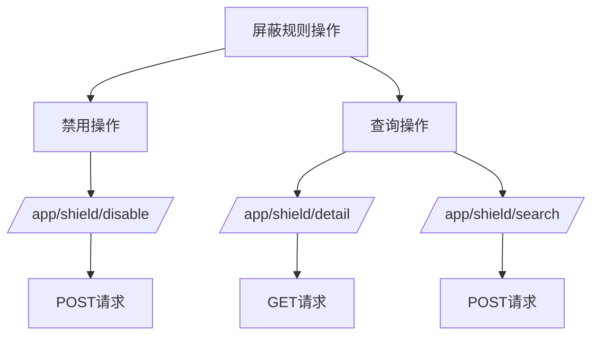
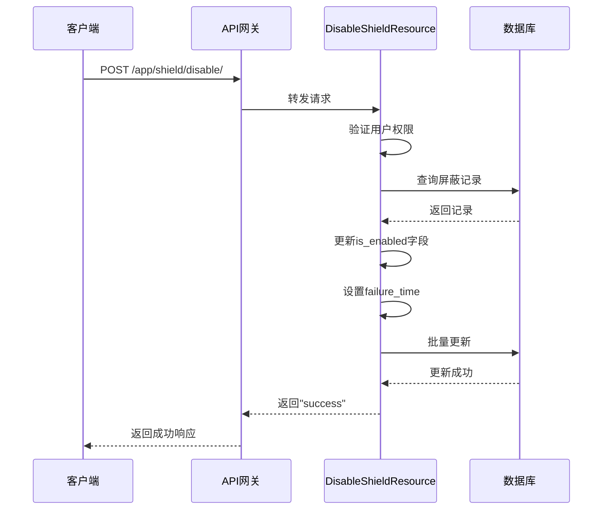
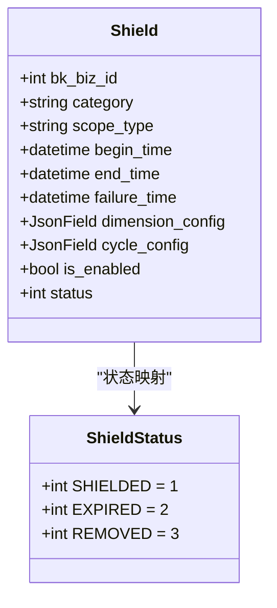
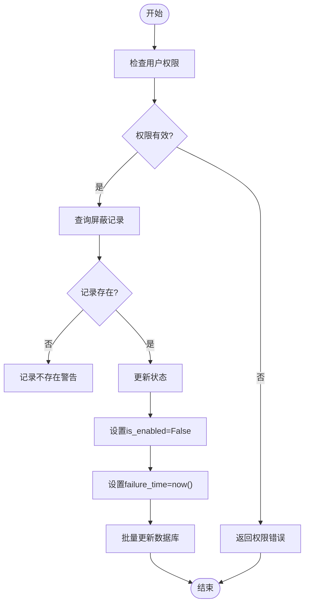
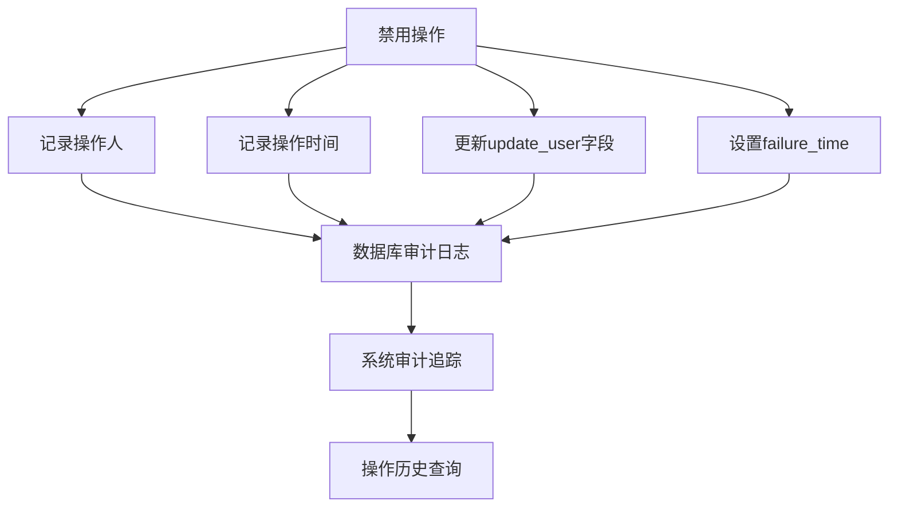

# 删除与禁用屏蔽规则

<cite>
**本文档引用的文件**   
- [backend_resources.py](file://bkmonitor/packages/monitor_web/shield/resources/backend_resources.py#L530-L611)
- [shield.py](file://bkmonitor/bkmonitor/models/base.py#L780-L979)
- [shield.yaml](file://bkmonitor/support-files/apigw/resources/external/app/shield.yaml#L0-L91)
- [frontend_resources.py](file://bkmonitor/packages/monitor_web/shield/resources/frontend_resources.py#L120-L319)
- [shield.py](file://bkmonitor/constants/shield.py#L30-L73)
</cite>

## 目录
1. [引言](#引言)
2. [API端点与操作类型](#api端点与操作类型)
3. [禁用操作实现](#禁用操作实现)
4. [数据模型与状态管理](#数据模型与状态管理)
5. [权限与安全验证](#权限与安全验证)
6. [响应示例](#响应示例)
7. [审计日志与通知](#审计日志与通知)

## 引言
本文档详细说明了屏蔽规则的删除与禁用操作。系统通过"禁用"操作实现软删除，保留数据但使其失效，而非物理删除。文档涵盖RESTful API端点、权限要求、状态转换、数据清理策略及审计机制，为用户提供完整的操作指南。

## API端点与操作类型



**图示来源**
- [shield.yaml](file://bkmonitor/support-files/apigw/resources/external/app/shield.yaml#L0-L91)

**本节来源**
- [shield.yaml](file://bkmonitor/support-files/apigw/resources/external/app/shield.yaml#L0-L91)

## 禁用操作实现



**图示来源**
- [backend_resources.py](file://bkmonitor/packages/monitor_web/shield/resources/backend_resources.py#L530-L611)

**本节来源**
- [backend_resources.py](file://bkmonitor/packages/monitor_web/shield/resources/backend_resources.py#L530-L611)

## 数据模型与状态管理



**图示来源**
- [shield.py](file://bkmonitor/bkmonitor/models/base.py#L780-L979)
- [shield.py](file://bkmonitor/constants/shield.py#L30-L73)

**本节来源**
- [shield.py](file://bkmonitor/bkmonitor/models/base.py#L780-L979)
- [shield.py](file://bkmonitor/constants/shield.py#L30-L73)

## 权限与安全验证



**图示来源**
- [backend_resources.py](file://bkmonitor/packages/monitor_web/shield/resources/backend_resources.py#L530-L611)

**本节来源**
- [backend_resources.py](file://bkmonitor/packages/monitor_web/shield/resources/backend_resources.py#L530-L611)

## 响应示例

### 成功响应
```json
{
    "result": true,
    "code": 200,
    "message": "OK",
    "data": "success"
}
```

### 失败响应
```json
{
    "result": false,
    "code": 403,
    "message": "当前用户无权限解除2业务屏蔽配置",
    "data": null
}
```

**本节来源**
- [backend_resources.py](file://bkmonitor/packages/monitor_web/shield/resources/backend_resources.py#L530-L611)

## 审计日志与通知



**图示来源**
- [backend_resources.py](file://bkmonitor/packages/monitor_web/shield/resources/backend_resources.py#L530-L611)

**本节来源**
- [backend_resources.py](file://bkmonitor/packages/monitor_web/shield/resources/backend_resources.py#L530-L611)