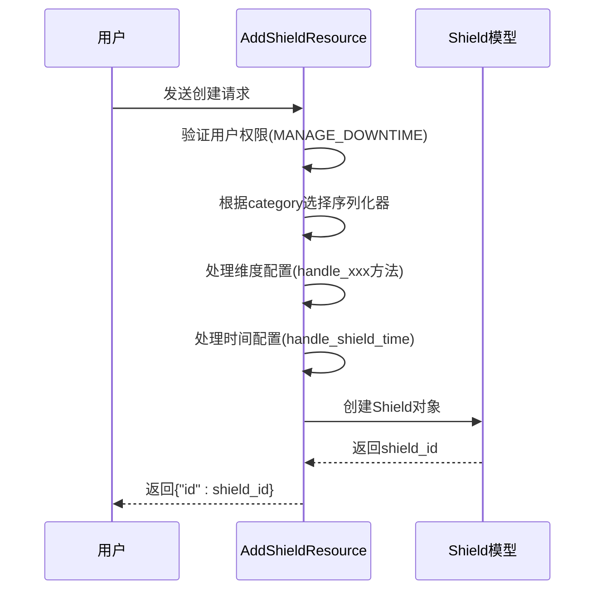
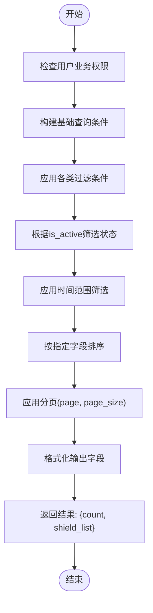

# 屏蔽管理API

<cite>
**本文档引用的文件**  
- [base.py](file://bkmonitor/models/base.py#L781-L835)
- [backend_resources.py](file://bkmonitor/packages/monitor_web/shield/resources/backend_resources.py#L221-L383)
- [backend_resources.py](file://bkmonitor/packages/monitor_web/shield/resources/backend_resources.py#L68-L179)
- [backend_resources.py](file://bkmonitor/packages/monitor_web/shield/resources/backend_resources.py#L567-L593)
- [serializers.py](file://bkmonitor/packages/monitor_web/shield/serializers.py#L129-L135)
- [shield.py](file://bkmonitor/constants/shield.py#L30-L33)
</cite>

## 目录
1. [简介](#简介)
2. [屏蔽规则数据模型](#屏蔽规则数据模型)
3. [创建屏蔽规则接口](#创建屏蔽规则接口)
4. [查询屏蔽规则接口](#查询屏蔽规则接口)
5. [删除与禁用屏蔽规则](#删除与禁用屏蔽规则)
6. [屏蔽规则状态与优先级](#屏蔽规则状态与优先级)
7. [审计日志与通知功能](#审计日志与通知功能)

## 简介
屏蔽管理API用于对监控系统中的告警、策略、事件等进行临时或周期性的屏蔽操作，以避免在维护、升级或其他特殊场景下产生不必要的告警干扰。本API支持多种屏蔽模式，包括基于策略、实例、IP、事件等维度的屏蔽，并提供灵活的时间配置和通知机制。

## 屏蔽规则数据模型

屏蔽规则的核心数据模型定义在 `Shield` 模型中，主要字段如下：

- **bk_biz_id**: 业务ID，标识该屏蔽规则所属的业务
- **category**: 屏蔽类型，支持范围、策略、事件、告警、维度等类型
- **scope_type**: 屏蔽范围类型，如实例、IP、节点、业务、动态分组等
- **begin_time**: 屏蔽开始时间
- **end_time**: 屏蔽结束时间
- **failure_time**: 屏蔽失效时间（用于记录实际终止时间）
- **dimension_config**: 屏蔽维度配置，JSON格式，包含具体的屏蔽条件
- **cycle_config**: 周期屏蔽配置，支持按日、周等周期重复
- **notice_config**: 通知配置，定义屏蔽生效时的通知接收人
- **description**: 屏蔽原因描述
- **is_quick**: 是否为快捷屏蔽
- **source**: 来源系统标识
- **label**: 标签，用于分类和检索
- **is_enabled**: 是否启用（用于软删除）

### 屏蔽类型定义
```python
SHIELD_CATEGORY = (
    ("scope", "范围屏蔽"),
    ("strategy", "策略屏蔽"),
    ("event", "事件屏蔽"),
    ("alert", "告警屏蔽"),
    ("dimension", "维度屏蔽"),
)
```

### 屏蔽范围类型
```python
SCOPE_TYPE = (
    ("instance", "实例"),
    ("ip", "IP"),
    ("node", "节点"),
    ("biz", "业务"),
    ("dynamic_group", "动态分组"),
)
```

**Section sources**
- [base.py](file://bkmonitor/models/base.py#L781-L835)

## 创建屏蔽规则接口

创建屏蔽规则通过 `AddShieldResource` 接口实现，支持多种屏蔽模式。

### 接口路径
`/api/shield/add/`

### 请求参数
| 字段 | 类型 | 必填 | 说明 |
|------|------|------|------|
| category | string | 是 | 屏蔽类型（strategy, alert, scope, dimension, event） |
| bk_biz_id | int | 是 | 业务ID |
| begin_time | string | 是 | 开始时间（YYYY-MM-DD HH:MM:SS） |
| end_time | string | 是 | 结束时间 |
| cycle_config | object | 否 | 周期配置 |
| dimension_config | object | 是 | 维度配置，根据category不同结构不同 |
| shield_notice | boolean | 否 | 是否发送通知 |
| notice_config | object | 否 | 通知配置 |
| description | string | 否 | 屏蔽原因 |
| is_quick | boolean | 否 | 是否为快捷屏蔽 |
| label | string | 否 | 标签 |

### 不同屏蔽类型的dimension_config结构

#### 策略屏蔽
```json
{
  "id": [123],
  "level": [1, 2, 3],
  "dimension_conditions": [
    {"key": "bk_target_ip", "value": ["10.1.1.1"], "method": "eq"}
  ]
}
```

#### 告警屏蔽
```json
{
  "alert_id": "alert_123",
  "dimension_keys": ["ip", "port"]
}
```

#### 范围屏蔽
```json
{
  "scope_type": "ip",
  "target": [
    {"ip": "10.1.1.1", "bk_cloud_id": "0"}
  ]
}
```

### 权限校验
接口会校验用户是否具有 `MANAGE_DOWNTIME` 权限，确保只有授权用户才能创建屏蔽规则。

### 时间处理
系统会自动处理时间配置，包括：
- 单次屏蔽：直接使用 begin_time 和 end_time
- 周期屏蔽：根据 cycle_config 生成实际生效时间



**Diagram sources**
- [backend_resources.py](file://bkmonitor/packages/monitor_web/shield/resources/backend_resources.py#L221-L383)

**Section sources**
- [backend_resources.py](file://bkmonitor/packages/monitor_web/shield/resources/backend_resources.py#L221-L383)
- [serializers.py](file://bkmonitor/packages/monitor_web/shield/serializers.py#L129-L135)

## 查询屏蔽规则接口

查询屏蔽规则通过 `ShieldListResource` 接口实现，支持多种过滤条件和分页。

### 接口路径
`/api/shield/list/`

### 请求参数
| 字段 | 类型 | 说明 |
|------|------|------|
| bk_biz_id | int | 业务ID，不传则查询用户有权限的所有业务 |
| is_active | boolean | 是否查询活跃的屏蔽规则 |
| categories | array | 屏蔽类型过滤 |
| source | string | 来源系统过滤 |
| time_range | string | 时间范围过滤（如"30d"） |
| page | int | 页码 |
| page_size | int | 每页数量 |
| conditions | array | 自定义过滤条件 |

### 过滤逻辑
1. 业务权限过滤：自动限制用户可访问的业务范围
2. 类型过滤：支持多类型查询，`event`类型会自动包含`alert`
3. 条件过滤：支持字段精确匹配，description支持模糊搜索
4. 时间过滤：根据 is_active 状态选择 begin_time 或 failure_time 进行比较

### 分页机制
- 支持标准分页：page 和 page_size 参数
- 先过滤后分页：先应用所有过滤条件，再进行分页
- 返回结果包含总数 count 和当前页数据 shield_list



**Diagram sources**
- [backend_resources.py](file://bkmonitor/packages/monitor_web/shield/resources/backend_resources.py#L68-L179)

**Section sources**
- [backend_resources.py](file://bkmonitor/packages/monitor_web/shield/resources/backend_resources.py#L68-L179)

## 删除与禁用屏蔽规则

屏蔽规则的删除实际上是禁用操作（软删除），通过更新 `is_enabled` 字段实现。

### 批量禁用接口
`RemoveShieldResource` 资源类负责处理屏蔽规则的禁用。

### 请求参数
```json
{
  "id": [1, 2, 3],
  "bk_biz_id": 2,
  "verify_user_permission": true
}
```

### 处理流程
1. 权限校验：检查用户是否具有 `MANAGE_DOWNTIME` 权限
2. 查询屏蔽规则：根据ID列表和业务ID过滤
3. 更新状态：将匹配的屏蔽规则的 `is_enabled` 设为 False
4. 记录操作：更新 `failure_time` 和 `update_user`

### 关键代码逻辑
```python
shields = Shield.objects.filter(pk__in=data["id"])
if data.get("bk_biz_id"):
    shields = shields.filter(bk_biz_id=data["bk_biz_id"])

update_shields = []
for shield in shields:
    if shield.is_enabled:
        shield.is_enabled = False
        shield.failure_time = now()
        shield.update_user = username
        update_shields.append(shield)
Shield.objects.bulk_update(update_shields, ["is_enabled", "failure_time", "update_user"])
```

**Section sources**
- [backend_resources.py](file://bkmonitor/packages/monitor_web/shield/resources/backend_resources.py#L567-L593)

## 屏蔽规则状态与优先级

### 状态机
屏蔽规则的状态由 `ShieldStatus` 枚举定义：

```python
class ShieldStatus(object):
    SHIELDED = 1    # 屏蔽中
    EXPIRED = 2     # 已过期
    REMOVED = 3     # 被解除
```

状态判断逻辑：
- `is_enabled` 为 False → `REMOVED`
- 当前时间 > end_time → `EXPIRED`
- 否则 → `SHIELDED`

### 冲突检测
在创建屏蔽规则时，系统会进行冲突检测：
- **策略屏蔽**：检查是否存在相同的策略ID和级别组合
- **告警屏蔽**：检查告警是否已被其他规则屏蔽
- **维度屏蔽**：检查维度条件是否与其他规则冲突

### 优先级处理
当多个屏蔽规则同时生效时，遵循以下优先级：
1. **时间优先**：开始时间越晚的规则优先级越高
2. **范围优先**：范围越精确的规则优先级越高（实例 > IP > 节点 > 业务）
3. **类型优先**：特定类型优先于通用类型

**Section sources**
- [shield.py](file://bkmonitor/constants/shield.py#L30-L33)
- [backend_resources.py](file://bkmonitor/packages/monitor_web/shield/resources/backend_resources.py#L221-L383)

## 审计日志与通知功能

### 审计日志
系统自动记录所有屏蔽操作的关键信息：
- **创建日志**：记录创建人、创建时间、屏蔽配置
- **禁用日志**：记录操作人、操作时间、被禁用的规则ID
- **字段变更**：通过 `update_user` 和 `update_time` 字段追踪变更

### 通知功能
当 `shield_notice` 为 True 时，系统会发送通知：
- **通知接收人**：通过 `notice_config.notice_receiver` 配置
- **通知内容**：包含屏蔽类型、时间范围、原因等信息
- **通知方式**：支持多种通知渠道（邮件、短信、微信等）

### 通知配置结构
```json
{
  "notice_receiver": [
    {"type": "user", "id": "zhangsan"},
    {"type": "group", "id": "dev_ops"}
  ],
  "notice_way": ["mail", "wechat"]
}
```

通知接收人格式化为 `"type#id"` 字符串存储。

**Section sources**
- [backend_resources.py](file://bkmonitor/packages/monitor_web/shield/resources/backend_resources.py#L360-L394)
- [backend_resources.py](file://bkmonitor/packages/monitor_web/shield/resources/backend_resources.py#L215-L243)