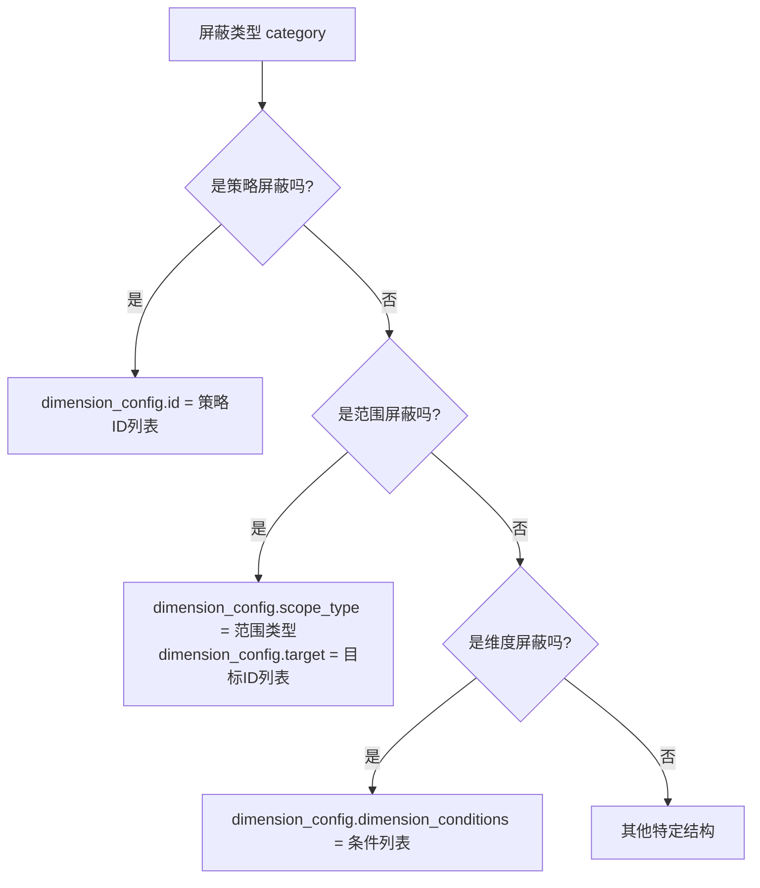
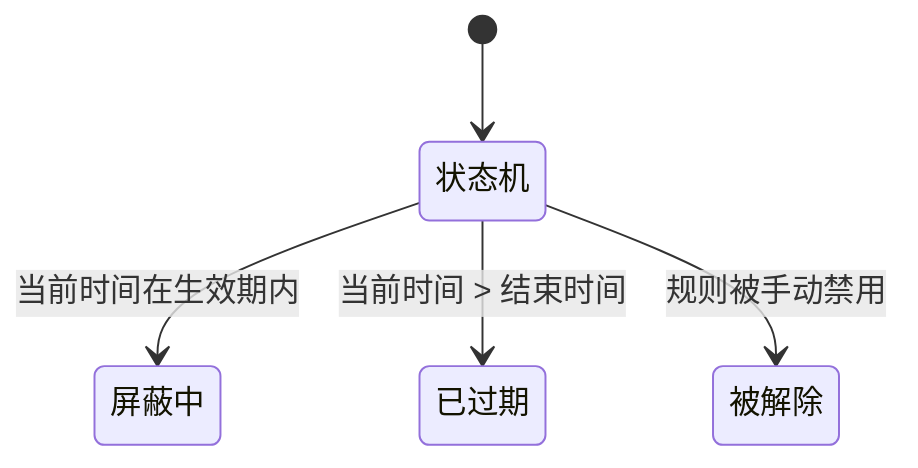

# 屏蔽规则模型

<cite>
**本文档引用的文件**  
- [shield.py](file://bkmonitor\constants\shield.py)
- [base.py](file://bkmonitor\bkmonitor\models\base.py)
- [serializers.py](file://bkmonitor\packages\monitor_web\shield\serializers.py)
- [0001_initial.py](file://bkmonitor\bkmonitor\migrations\0001_initial.py)
</cite>

## 目录
1. [简介](#简介)
2. [实体结构](#实体结构)
3. [屏蔽类型与范围](#屏蔽类型与范围)
4. [时间范围与周期配置](#时间范围与周期配置)
5. [屏蔽条件](#屏蔽条件)
6. [状态机](#状态机)
7. [数据库表结构](#数据库表结构)
8. [索引与查询优化](#索引与查询优化)
9. [与其他实体的关系](#与其他实体的关系)

## 简介
屏蔽规则是监控系统中用于临时抑制告警通知的核心功能，允许用户在特定时间范围内对特定监控对象（如策略、实例、告警等）进行告警屏蔽。本文档详细描述了屏蔽规则的数据模型，包括其核心实体结构、字段定义、状态流转、数据库设计以及与其他系统实体的关系。

## 实体结构
屏蔽规则的核心实体由 `Shield` 模型定义，该模型存储了所有与屏蔽配置相关的数据。

**Section sources**
- [base.py](file://bkmonitor\bkmonitor\models\base.py#L795-L822)

### 核心字段
屏蔽规则的实体结构包含以下核心字段：

| 字段名 | 类型 | 描述 |
| :--- | :--- | :--- |
| `id` | int | 屏蔽ID，主键 |
| `bk_biz_id` | int | 业务ID，标识屏蔽规则所属的业务 |
| `category` | string | 屏蔽类型，定义了屏蔽的粒度（如策略、范围等） |
| `scope_type` | string | 屏蔽范围类型，定义了屏蔽的具体对象类型（如实例、IP等） |
| `content` | text | 屏蔽内容快照，用于在前端展示屏蔽规则的可读描述 |
| `begin_time` | datetime | 屏蔽开始时间 |
| `end_time` | datetime | 屏蔽结束时间 |
| `failure_time` | datetime | 屏蔽失效时间，用于处理周期性屏蔽 |
| `dimension_config` | json | 屏蔽维度配置，一个JSON字段，存储具体的屏蔽条件 |
| `cycle_config` | json | 屏蔽周期配置，一个JSON字段，存储周期性屏蔽的规则 |
| `notice_config` | json | 通知配置，一个JSON字段，存储屏蔽通知的接收人和方式 |
| `description` | text | 屏蔽原因，用户填写的说明 |
| `is_quick` | bool | 是否为快捷屏蔽 |
| `source` | string | 来源系统，标识创建该屏蔽规则的应用 |
| `label` | string | 标签，用于对屏蔽规则进行分类 |

## 屏蔽类型与范围
屏蔽规则的类型和范围由常量类 `ShieldCategory` 和 `ScopeType` 定义。

**Section sources**
- [shield.py](file://bkmonitor\constants\shield.py#L43-L50)
- [shield.py](file://bkmonitor\constants\shield.py#L13-L18)

### 屏蔽类型 (Category)
屏蔽类型决定了屏蔽规则的作用对象。

```mermaid
erDiagram
SHIELD_CATEGORY ||--o{ SHIELD : "has"
class SHIELD_CATEGORY {
string SCOPE
string STRATEGY
string EVENT
string ALERT
string DIMENSION
}
```

**Diagram sources**
- [shield.py](file://bkmonitor\constants\shield.py#L43-L50)

| 值 | 描述 |
| :--- | :--- |
| `scope` | 范围屏蔽：对特定范围内的所有监控对象进行屏蔽 |
| `strategy` | 策略屏蔽：对指定的一个或多个策略进行屏蔽 |
| `event` | 事件屏蔽：对指定的事件进行屏蔽 |
| `alert` | 告警屏蔽：对指定的告警进行屏蔽 |
| `dimension` | 维度屏蔽：根据自定义的维度条件进行屏蔽 |

### 屏蔽范围 (Scope Type)
屏蔽范围类型定义了“范围屏蔽”和“维度屏蔽”等类型下，具体屏蔽对象的类别。

```mermaid
erDiagram
SCOPE_TYPE ||--o{ SHIELD : "has"
class SCOPE_TYPE {
string INSTANCE
string IP
string NODE
string BIZ
string DYNAMIC_GROUP
}
```

**Diagram sources**
- [shield.py](file://bkmonitor\constants\shield.py#L13-L18)

| 值 | 描述 |
| :--- | :--- |
| `instance` | 服务实例 |
| `ip` | 主机 |
| `node` | 节点 |
| `biz` | 业务 |
| `dynamic_group` | 动态分组 |

## 时间范围与周期配置
屏蔽规则支持一次性屏蔽和周期性屏蔽。

**Section sources**
- [base.py](file://bkmonitor\bkmonitor\models\base.py#L795-L822)
- [serializers.py](file://bkmonitor\packages\monitor_web\shield\serializers.py#L3-L22)

### 时间范围
- `begin_time` 和 `end_time` 字段定义了屏蔽规则生效的起止时间。
- `failure_time` 字段用于周期性屏蔽，表示下一次屏蔽失效的时间点。

### 周期配置 (cycle_config)
`cycle_config` 是一个JSON字段，其结构由 `CycleConfigSlz` 序列化器定义。

```json
{
  "type": 1, // 周期类型：1-一次，2-每天，3-每周，4-每月
  "week_list": [], // 当type=3时，指定星期几（1-7）
  "day_list": [], // 当type=4时，指定日期（1-31）
  "begin_time": "", // 每日开始时间（HH:mm:ss）
  "end_time": "" // 每日结束时间（HH:mm:ss）
}
```

## 屏蔽条件
屏蔽条件存储在 `dimension_config` JSON字段中，其结构根据 `category` 的不同而变化。

**Section sources**
- [serializers.py](file://bkmonitor\packages\monitor_web\shield\serializers.py#L48-L136)

### 不同类型的屏蔽条件
- **范围屏蔽 (scope)**: 包含 `scope_type` 和 `target`（目标ID列表）。
- **策略屏蔽 (strategy)**: 包含 `id`（策略ID列表）和可选的 `level`（告警级别列表）。
- **事件/告警屏蔽**: 包含 `id` 或 `alert_id` / `alert_ids`。
- **维度屏蔽 (dimension)**: 包含 `dimension_conditions` 列表，每个条件有 `key`、`value`、`method`（操作符）和 `condition`（逻辑连接符）。



**Diagram sources**
- [serializers.py](file://bkmonitor\packages\monitor_web\shield\serializers.py#L48-L136)

## 状态机
屏蔽规则的状态由 `status` 属性动态计算得出，不直接存储在数据库中。

**Section sources**
- [shield.py](file://bkmonitor\constants\shield.py#L30-L33)
- [base.py](file://bkmonitor\bkmonitor\models\base.py#L824-L830)

### 状态定义


**Diagram sources**
- [shield.py](file://bkmonitor\constants\shield.py#L30-L33)

| 状态值 | 描述 | 判断逻辑 |
| :--- | :--- | :--- |
| 1 (SHIELDED) | 屏蔽中 | 规则启用且当前时间在 `begin_time` 和 `end_time` 之间 |
| 2 (EXPIRED) | 已过期 | 当前时间大于 `end_time` |
| 3 (REMOVED) | 被解除 | 规则被手动禁用（`is_enabled` 为 False） |

## 数据库表结构
屏蔽规则的数据库表名为 `alarm_shield`。

**Section sources**
- [base.py](file://bkmonitor\bkmonitor\models\base.py#L824)
- [0001_initial.py](file://bkmonitor\bkmonitor\migrations\0001_initial.py#L840)

### 表结构与字段约束
```sql
CREATE TABLE `alarm_shield` (
  `id` int(11) NOT NULL AUTO_INCREMENT,
  `bk_biz_id` int(11) NOT NULL DEFAULT '0',
  `category` varchar(32) NOT NULL,
  `scope_type` varchar(32) NOT NULL,
  `content` longtext NOT NULL,
  `begin_time` datetime(6) NOT NULL,
  `end_time` datetime(6) NOT NULL,
  `failure_time` datetime(6) NOT NULL,
  `dimension_config` longtext NOT NULL,
  `cycle_config` longtext NOT NULL,
  `notice_config` longtext NOT NULL,
  `description` longtext NOT NULL,
  `is_quick` tinyint(1) NOT NULL DEFAULT '0',
  `source` varchar(32) NOT NULL,
  `label` varchar(255) NOT NULL DEFAULT '',
  PRIMARY KEY (`id`),
  KEY `bk_biz_id` (`bk_biz_id`),
  KEY `label` (`label`)
) ENGINE=InnoDB DEFAULT CHARSET=utf8mb4;
```

## 索引与查询优化
为了提高查询性能，数据库表上定义了复合索引。

**Section sources**
- [base.py](file://bkmonitor\bkmonitor\models\base.py#L824)

### 索引设计
在 `Meta` 类中通过 `index_together` 定义了两个复合索引：
- `("bk_biz_id", "source")`: 用于按业务和来源系统快速查询屏蔽规则。
- `("begin_time", "bk_biz_id")`: 用于查询在特定时间范围内生效的屏蔽规则，常用于判断当前告警是否应被屏蔽。

## 与其他实体的关系
屏蔽规则模型与系统中的多个核心实体存在关联。

```mermaid
erDiagram
SHIELD ||--o{ STRATEGY : "策略屏蔽"
SHIELD ||--o{ ALERT : "告警屏蔽"
SHIELD ||--o{ EVENT : "事件屏蔽"
SHIELD ||--o{ SERVICE_INSTANCE : "实例屏蔽"
SHIELD ||--o{ HOST : "主机屏蔽"
SHIELD ||--o{ TOPO_NODE : "节点屏蔽"
class SHIELD {
+int id
+string category
+datetime begin_time
+datetime end_time
}
class STRATEGY {
+int id
+string name
}
class ALERT {
+string alert_id
+int level
}
class EVENT {
+string event_id
}
class SERVICE_INSTANCE {
+int instance_id
}
class HOST {
+string ip
}
class TOPO_NODE {
+string node_path
}
```

**Diagram sources**
- [base.py](file://bkmonitor\bkmonitor\models\base.py#L795-L822)
- [serializers.py](file://bkmonitor\packages\monitor_web\shield\serializers.py#L48-L136)

- **策略 (Strategy)**: 当 `category` 为 `strategy` 时，`dimension_config` 中的 `id` 字段引用了策略ID。
- **告警 (Alert) 和 事件 (Event)**: 当 `category` 为 `alert` 或 `event` 时，`dimension_config` 中的 `alert_id` 或 `id` 字段引用了具体的告警或事件ID。
- **服务实例、主机、节点等**: 当 `category` 为 `scope` 且 `scope_type` 为 `instance`、`ip` 或 `node` 时，`dimension_config` 中的 `target` 字段引用了这些对象的ID。