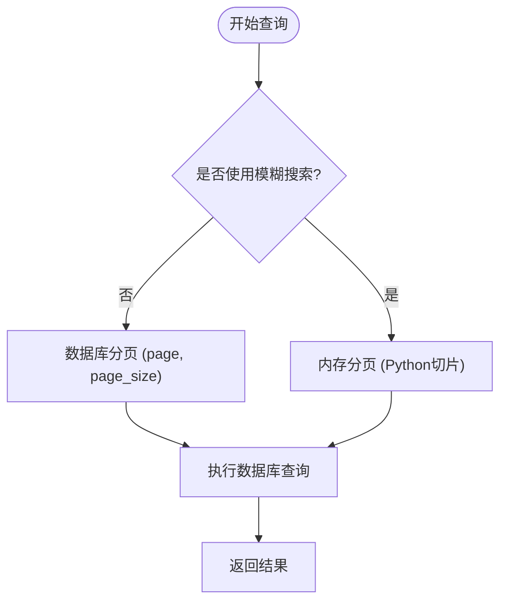
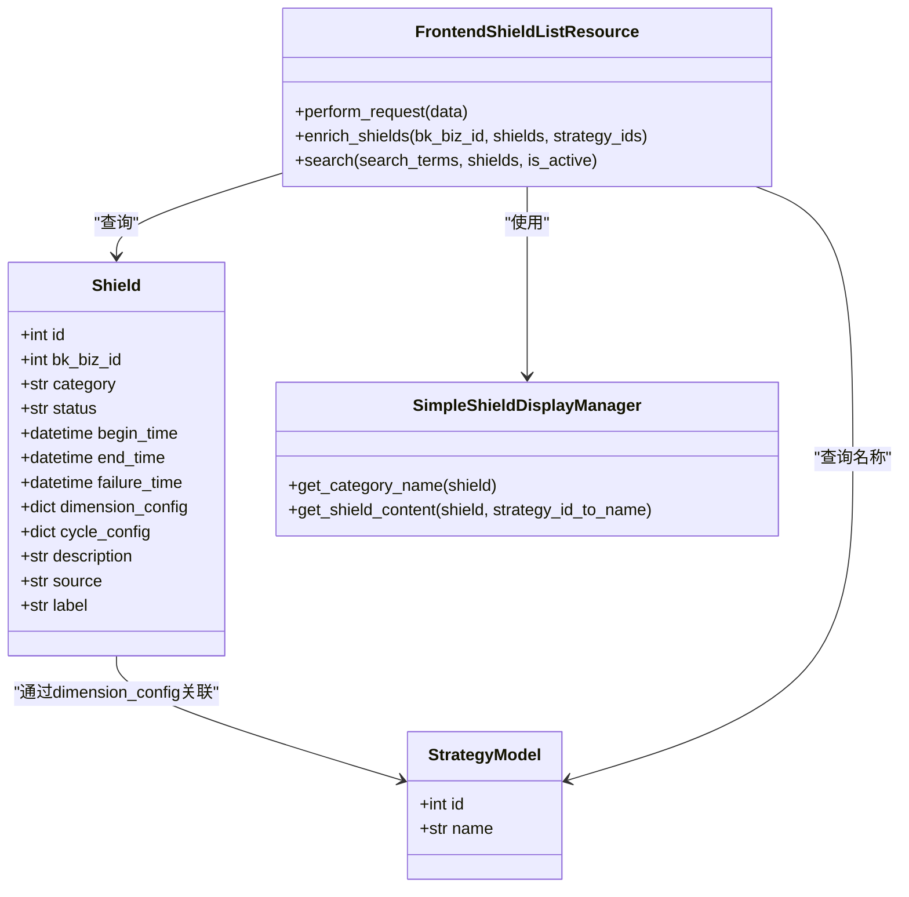

# 查询屏蔽规则

<cite>
**本文档引用的文件**  
- [backend_resources.py](file://bkmonitor/packages/monitor_web/shield/resources/backend_resources.py)
- [frontend_resources.py](file://bkmonitor/packages/monitor_web/shield/resources/frontend_resources.py)
- [shield.py](file://bkmonitor/kernel_api/views/v4/shield.py)
- [shield.yaml](file://bkmonitor/support-files/apigw/resources/external/app/shield.yaml)
</cite>

## 目录
1. [简介](#简介)
2. [API端点与路由](#api端点与路由)
3. [查询参数详解](#查询参数详解)
4. [分页与排序](#分页与排序)
5. [响应结构](#响应结构)
6. [示例请求](#示例请求)
7. [性能优化与缓存](#性能优化与缓存)

## 简介
本文档详细描述了蓝鲸监控平台中用于查询屏蔽规则的RESTful API接口。该接口允许用户根据多种条件（如业务范围、屏蔽类型、状态、时间范围等）筛选告警屏蔽记录，并支持分页、排序和模糊搜索功能。通过本接口，用户可以高效地获取和管理系统的屏蔽配置。

**Section sources**
- [backend_resources.py](file://bkmonitor/packages/monitor_web/shield/resources/backend_resources.py#L27-L58)

## API端点与路由
屏蔽规则查询功能通过API网关暴露给外部系统，其路由配置定义在YAML文件中。后端服务通过Django REST Framework的`ResourceViewSet`进行路由映射。

```mermaid
graph TB
Client[客户端] --> APIGateway[API网关]
APIGateway --> Backend[后端服务]
subgraph "API网关配置"
A[/app/shield/search/: POST]
end
subgraph "后端服务"
B[/api/v4/shield/search/: POST]
end
A --> B
```

**Diagram sources**
- [shield.yaml](file://bkmonitor/support-files/apigw/resources/external/app/shield.yaml#L70-L91)
- [shield.py](file://bkmonitor/kernel_api/views/v4/shield.py#L20)

## 查询参数详解
查询接口支持丰富的过滤条件，所有参数均通过POST请求体传递。

### 基础查询参数
以下参数定义在`ShieldListSerializer`中，用于控制查询的基本行为：

- **bk_biz_id**: 整数，可选，指定业务ID。若未提供，则返回用户有权限访问的所有业务的屏蔽规则。
- **is_active**: 布尔值，可选，默认为`true`，表示是否查询“正在屏蔽中”的规则。`true`表示屏蔽中，`false`表示已失效。
- **order**: 字符串，可选，默认为`-id`，指定排序字段。支持的值包括：`-id`, `id`, `begin_time`, `-begin_time`, `failure_time`, `-failure_time`。
- **categories**: 字符串列表，可选，指定屏蔽类型。支持的类型包括：`strategy`（策略）、`event`（事件）、`alert`（告警）、`scope`（范围）、`dimension`（维度）。

### 高级过滤条件
通过`conditions`字段可以实现复杂的组合查询：

- **conditions**: 对象列表，每个对象包含`key`、`value`和可选的`method`、`condition`字段。
  - `key=query`: 表示全局模糊搜索，将在多个字段中进行匹配。
  - `key=strategy_id`: 根据关联的策略ID进行过滤。
  - 其他`key`值对应数据库模型的字段，如`description`（支持模糊搜索）、`category`、`status`等。

### 时间范围过滤
- **time_range**: 字符串，格式为`"YYYY-MM-DD HH:mm:ss,YYYY-MM-DD HH:mm:ss"`，用于指定时间范围。系统会根据`is_active`的值分别与`begin_time`或`failure_time`进行比较。

**Section sources**
- [backend_resources.py](file://bkmonitor/packages/monitor_web/shield/resources/backend_resources.py#L27-L58)
- [backend_resources.py](file://bkmonitor/packages/monitor_web/shield/resources/backend_resources.py#L93-L129)

## 分页与排序
### 分页参数
- **page**: 整数，可选，页码，从1开始。
- **page_size**: 整数，可选，每页大小。

> **注意**：当使用模糊搜索（`search`或`strategy_id`条件）时，分页由前端资源类`FrontendShieldListResource`在内存中完成；否则，分页由后端数据库查询直接处理。

### 排序机制
排序由`order`参数控制，直接映射到数据库查询的`order_by`方法。例如，`-begin_time`表示按开始时间降序排列。



**Diagram sources**
- [frontend_resources.py](file://bkmonitor/packages/monitor_web/shield/resources/frontend_resources.py#L100-L126)

## 响应结构
查询接口返回一个包含总数和屏蔽规则列表的JSON对象。

### 响应体格式
```json
{
  "count": 10,
  "shield_list": [
    {
      "id": 1001,
      "bk_biz_id": 2,
      "category": "strategy",
      "category_name": "策略屏蔽",
      "status": "shielded",
      "status_name": "屏蔽中",
      "dimension_config": {
        "id": 2001
      },
      "content": "屏蔽策略：CPU使用率过高",
      "begin_time": "2024-09-03 17:31:48",
      "end_time": "2024-09-03 18:01:48",
      "cycle_duration": "30分钟",
      "description": "临时维护",
      "source": "user",
      "update_user": "admin",
      "label": "维护"
    }
  ]
}
```

### 字段说明
- **count**: 整数，满足查询条件的总记录数。
- **shield_list**: 屏蔽规则对象数组，每个对象包含：
  - `id`: 屏蔽规则的唯一标识。
  - `bk_biz_id`: 关联的业务ID。
  - `category`: 屏蔽类型。
  - `category_name`: 屏蔽类型的中文名称。
  - `status`: 当前状态（如`shielded`、`expired`）。
  - `status_name`: 状态的中文名称。
  - `dimension_config`: 维度配置，根据屏蔽类型不同而异。
  - `content`: 屏蔽内容的描述。
  - `begin_time`: 屏蔽开始时间（本地时区）。
  - `end_time`: 屏蔽结束时间（本地时区）。
  - `cycle_duration`: 周期持续时间（如“30分钟”）。
  - `description`: 屏蔽原因。
  - `source`: 屏蔽来源。
  - `update_user`: 最后修改用户。
  - `label`: 标签。

**Section sources**
- [frontend_resources.py](file://bkmonitor/packages/monitor_web/shield/resources/frontend_resources.py#L155-L183)
- [backend_resources.py](file://bkmonitor/packages/monitor_web/shield/resources/backend_resources.py#L127-L160)

## 示例请求
### 示例1：查询特定业务中所有正在屏蔽的规则
```json
{
  "bk_biz_id": 2,
  "is_active": true,
  "order": "-begin_time",
  "page": 1,
  "page_size": 10
}
```

### 示例2：按策略ID和关键词过滤
```json
{
  "bk_biz_id": 2,
  "is_active": true,
  "conditions": [
    {
      "key": "strategy_id",
      "value": [2001, 2002]
    }
  ],
  "search": "维护"
}
```
此请求将返回业务ID为2、与策略2001或2002关联、且内容或描述中包含“维护”关键词的所有屏蔽规则。

### 示例3：查询过去24小时内失效的屏蔽规则
```json
{
  "is_active": false,
  "time_range": "2024-09-02 17:31:48,2024-09-03 17:31:48",
  "categories": ["strategy", "event"]
}
```

**Section sources**
- [frontend_resources.py](file://bkmonitor/packages/monitor_web/shield/resources/frontend_resources.py#L94-L126)

## 性能优化与缓存
### 查询优化策略
1. **数据库索引**：`Shield`模型的关键字段（如`bk_biz_id`、`category`、`status`、`begin_time`、`failure_time`）应建立数据库索引以加速查询。
2. **条件过滤优化**：后端代码使用`Q`对象和`reduce(operator.and_, q_list)`来构建高效的数据库查询条件，避免在Python中进行不必要的循环过滤。
3. **字段选择优化**：在获取关联策略名称时，使用`only("name")`仅查询所需字段，减少数据库I/O。

### 缓存机制
当前代码中未显式实现缓存，但可通过以下方式优化：
- **API网关缓存**：可在API网关层配置对`GET`请求的缓存（尽管当前查询使用`POST`）。
- **应用层缓存**：对于频繁查询且不常变动的数据（如策略名称映射），可使用Redis等缓存系统存储`strategy_id_to_name`字典。
- **异步处理**：使用`ThreadPoolExecutor`并发处理数据丰富化（如`enrich_shields`方法），提高响应速度。



**Diagram sources**
- [frontend_resources.py](file://bkmonitor/packages/monitor_web/shield/resources/frontend_resources.py#L155-L183)
- [backend_resources.py](file://bkmonitor/packages/monitor_web/shield/resources/backend_resources.py#L127-L160)