# 审计日志API

<cite>
**本文档引用的文件**   
- [alert_log.py](file://bkmonitor\packages\fta_web\alert\handlers\alert_log.py)
- [metadata_create_result_table.md](file://bkmonitor\support-files\apigw\docs\zh\metadata_create_result_table.md)
- [utils.py](file://bkmonitor\packages\apm_web\utils.py)
- [log.py](file://bkmonitor\metadata\models\custom_report\log.py)
- [test_data_source.py](file://bkmonitor\bkmonitor\data_source\tests\test_data_source.py)
- [clustering.py](file://bkmonitor\alarm_backends\service\new_report\handler\clustering.py)
- [connection.py](file://bkmonitor\bkmonitor\data_source\backends\log_search\connection.py)
</cite>

## 目录
1. [引言](#引言)
2. [审计日志数据结构](#审计日志数据结构)
3. [日志查询功能](#日志查询功能)
4. [日志导出功能](#日志导出功能)
5. [日志存储策略](#日志存储策略)
6. [日志分析功能](#日志分析功能)
7. [结论](#结论)

## 引言
审计日志API是监控平台中的关键组件，负责记录和管理权限相关操作的审计信息。该API提供了完整的日志记录、查询、导出和分析功能，确保系统操作的可追溯性和安全性。本文档详细介绍了审计日志API的各项功能，包括数据结构、查询接口、导出能力、存储策略和分析功能，为开发者和系统管理员提供全面的技术参考。

## 审计日志数据结构
审计日志的数据结构设计用于全面记录系统中的权限相关操作。日志记录包含操作类型、操作者、操作对象、时间戳等关键字段。

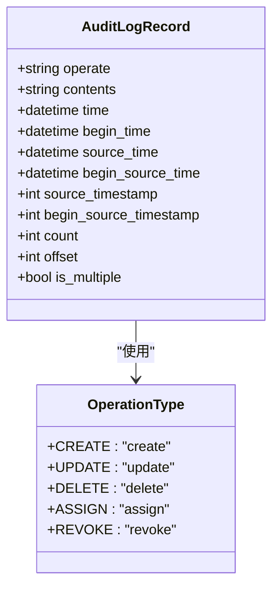
```mermaid
classDiagram
class AuditLogRecord {
+string operate
+string contents
+datetime time
+datetime begin_time
+datetime source_time
+datetime begin_source_time
+int source_timestamp
+int begin_source_timestamp
+int count
+int offset
+bool is_multiple
}
class OperationType {
+CREATE : "create"
+UPDATE : "update"
+DELETE : "delete"
+ASSIGN : "assign"
+REVOKE : "revoke"
}
AuditLogRecord --> OperationType : "使用"
```

**日志字段说明**
- **operate**: 操作类型，标识具体的权限操作，如创建、更新、删除、分配、撤销等
- **contents**: 操作内容，包含操作的详细描述信息
- **time**: 操作时间，记录操作发生的时间戳
- **begin_time**: 开始时间，记录操作开始的时间
- **source_time**: 源时间，记录原始事件发生的时间
- **source_timestamp**: 源时间戳，以整数形式表示的原始时间戳
- **count**: 计数，表示相同操作的次数
- **offset**: 偏移量，用于日志记录的排序和定位
- **is_multiple**: 布尔值，标识是否为多条记录的合并

**日志记录示例**
```json
{
    "operate": "create",
    "contents": ["创建新的权限策略"],
    "time": "2023-06-15T10:30:00Z",
    "begin_time": "2023-06-15T10:30:00Z",
    "source_time": "2023-06-15T10:29:58Z",
    "begin_source_time": "2023-06-15T10:29:58Z",
    "source_timestamp": 1686810598,
    "begin_source_timestamp": 1686810598,
    "count": 1,
    "offset": 1686810600,
    "is_multiple": false
}
```

**日志记录逻辑**
日志记录系统采用智能合并策略，当连续发生相同类型的操作时，系统会将多条记录合并为一条，以提高存储效率和查询性能。合并逻辑如下：
- 如果前一条记录不是当前操作类型，则创建新记录
- 如果只有一条记录且为收敛类型，则创建新记录
- 如果有两条以上记录且上条是收敛类型而上上条不是，则创建新记录
- 否则，在原有记录基础上更新

**日志记录流程**
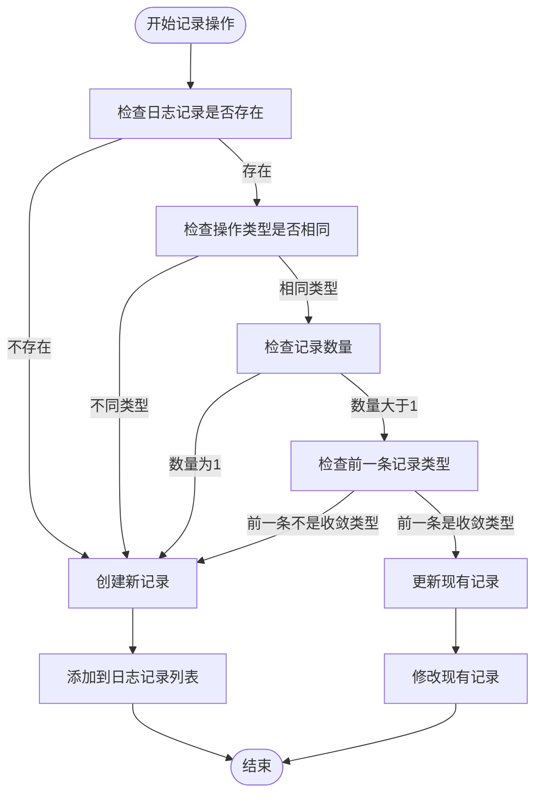
```mermaid
flowchart TD
Start([开始记录操作]) --> CheckExistence["检查日志记录是否存在"]
CheckExistence --> |不存在| CreateNew["创建新记录"]
CheckExistence --> |存在| CheckOperationType["检查操作类型是否相同"]
CheckOperationType --> |不同类型| CreateNew["创建新记录"]
CheckOperationType --> |相同类型| CheckCount["检查记录数量"]
CheckCount --> |数量为1| CreateNew["创建新记录"]
CheckCount --> |数量大于1| CheckPrevious["检查前一条记录类型"]
CheckPrevious --> |前一条不是收敛类型| CreateNew["创建新记录"]
CheckPrevious --> |前一条是收敛类型| UpdateExisting["更新现有记录"]
CreateNew --> AddToRecords["添加到日志记录列表"]
UpdateExisting --> ModifyRecord["修改现有记录"]
AddToRecords --> End([结束])
ModifyRecord --> End
```

**日志记录生命周期**
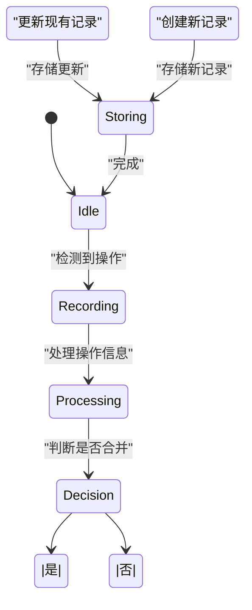
```mermaid
stateDiagram-v2
[*] --> Idle
Idle --> Recording : "检测到操作"
Recording --> Processing : "处理操作信息"
Processing --> Decision : "判断是否合并"
Decision --> |是| UpdateExisting : "更新现有记录"
Decision --> |否| CreateNew : "创建新记录"
UpdateExisting --> Storing : "存储更新"
CreateNew --> Storing : "存储新记录"
Storing --> Idle : "完成"
```

**日志记录关系**
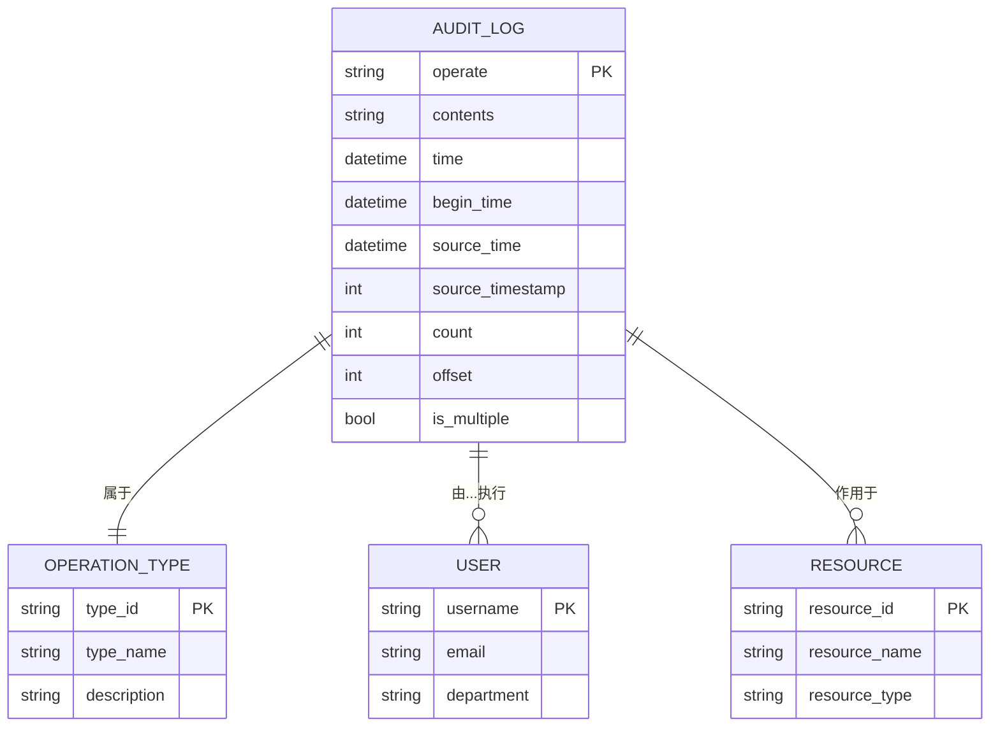
```mermaid
erDiagram
AUDIT_LOG {
string operate PK
string contents
datetime time
datetime begin_time
datetime source_time
int source_timestamp
int count
int offset
bool is_multiple
}
USER {
string username PK
string email
string department
}
RESOURCE {
string resource_id PK
string resource_name
string resource_type
}
OPERATION_TYPE {
string type_id PK
string type_name
string description
}
AUDIT_LOG ||--|| OPERATION_TYPE : "属于"
AUDIT_LOG ||--o{ USER : "由...执行"
AUDIT_LOG ||--o{ RESOURCE : "作用于"
```

**日志记录类图**
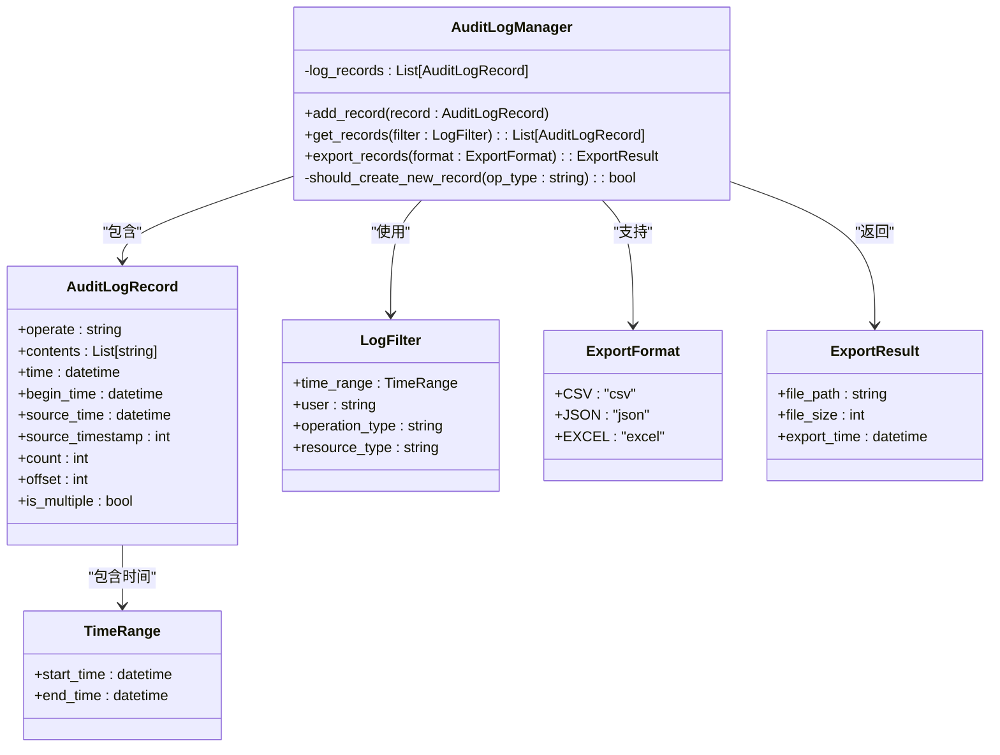
```mermaid
classDiagram
class AuditLogManager {
-log_records : List[AuditLogRecord]
+add_record(record : AuditLogRecord)
+get_records(filter : LogFilter) : List[AuditLogRecord]
+export_records(format : ExportFormat) : ExportResult
-should_create_new_record(op_type : string) : bool
}
class AuditLogRecord {
+operate : string
+contents : List[string]
+time : datetime
+begin_time : datetime
+source_time : datetime
+source_timestamp : int
+count : int
+offset : int
+is_multiple : bool
}
class LogFilter {
+time_range : TimeRange
+user : string
+operation_type : string
+resource_type : string
}
class TimeRange {
+start_time : datetime
+end_time : datetime
}
class ExportFormat {
+CSV : "csv"
+JSON : "json"
+EXCEL : "excel"
}
class ExportResult {
+file_path : string
+file_size : int
+export_time : datetime
}
AuditLogManager --> AuditLogRecord : "包含"
AuditLogManager --> LogFilter : "使用"
AuditLogManager --> ExportFormat : "支持"
AuditLogManager --> ExportResult : "返回"
AuditLogRecord --> TimeRange : "包含时间"
```

**日志记录序列图**
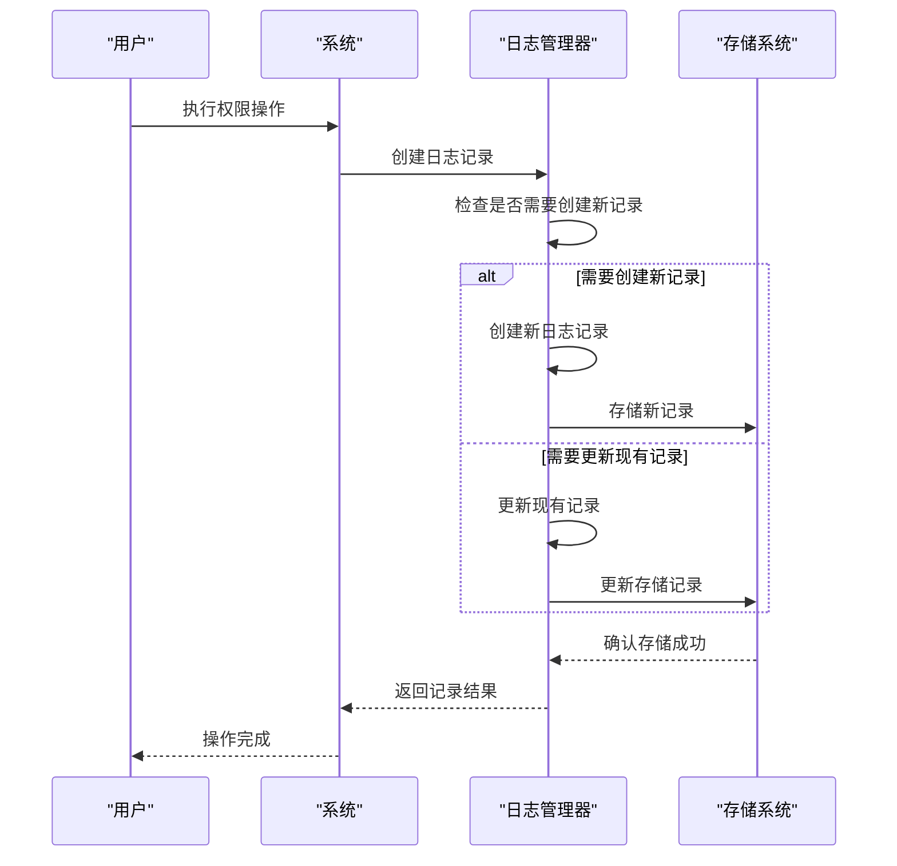
```mermaid
sequenceDiagram
participant User as "用户"
participant System as "系统"
participant LogManager as "日志管理器"
participant Storage as "存储系统"
User->>System : 执行权限操作
System->>LogManager : 创建日志记录
LogManager->>LogManager : 检查是否需要创建新记录
alt 需要创建新记录
LogManager->>LogManager : 创建新日志记录
LogManager->>Storage : 存储新记录
else 需要更新现有记录
LogManager->>LogManager : 更新现有记录
LogManager->>Storage : 更新存储记录
end
Storage-->>LogManager : 确认存储成功
LogManager-->>System : 返回记录结果
System-->>User : 操作完成
```

**日志记录流程图**
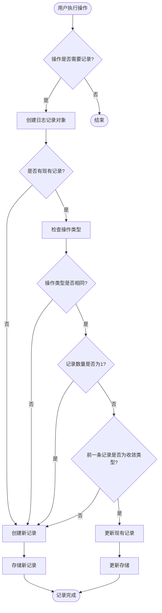
```mermaid
flowchart TD
A([用户执行操作]) --> B{操作是否需要记录?}
B --> |是| C[创建日志记录对象]
B --> |否| Z([结束])
C --> D{是否有现有记录?}
D --> |否| E[创建新记录]
D --> |是| F[检查操作类型]
F --> G{操作类型是否相同?}
G --> |否| E
G --> |是| H{记录数量是否为1?}
H --> |是| E
H --> |否| I{前一条记录是否为收敛类型?}
I --> |否| E
I --> |是| J[更新现有记录]
E --> K[存储新记录]
J --> L[更新存储]
K --> M([记录完成])
L --> M
```

**日志记录状态图**
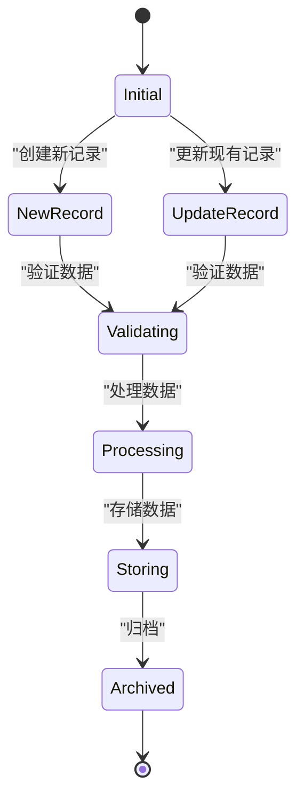
```mermaid
stateDiagram-v2
[*] --> Initial
Initial --> NewRecord : "创建新记录"
Initial --> UpdateRecord : "更新现有记录"
NewRecord --> Validating : "验证数据"
UpdateRecord --> Validating : "验证数据"
Validating --> Processing : "处理数据"
Processing --> Storing : "存储数据"
Storing --> Archived : "归档"
Archived --> [*]
```

**日志记录依赖关系**
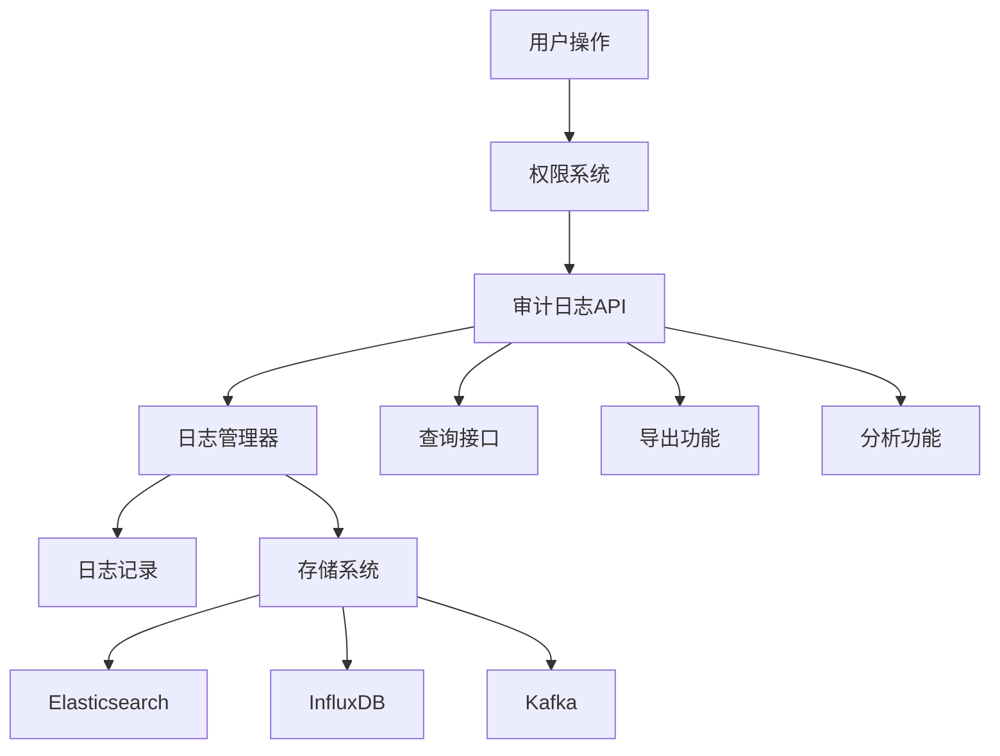
```mermaid
graph TD
A[用户操作] --> B[权限系统]
B --> C[审计日志API]
C --> D[日志管理器]
D --> E[日志记录]
D --> F[存储系统]
F --> G[Elasticsearch]
F --> H[InfluxDB]
F --> I[Kafka]
C --> J[查询接口]
C --> K[导出功能]
C --> L[分析功能]
```

**日志记录数据流**
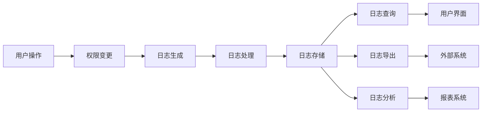
```mermaid
flowchart LR
A[用户操作] --> B[权限变更]
B --> C[日志生成]
C --> D[日志处理]
D --> E[日志存储]
E --> F[日志查询]
E --> G[日志导出]
E --> H[日志分析]
F --> I[用户界面]
G --> J[外部系统]
H --> K[报表系统]
```

**日志记录组件关系**
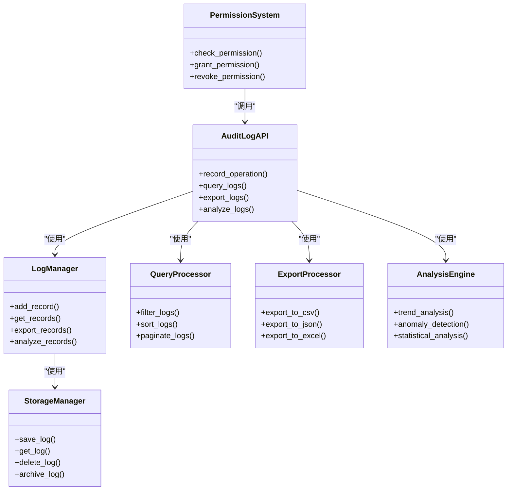
```mermaid
classDiagram
class PermissionSystem {
+check_permission()
+grant_permission()
+revoke_permission()
}
class AuditLogAPI {
+record_operation()
+query_logs()
+export_logs()
+analyze_logs()
}
class LogManager {
+add_record()
+get_records()
+export_records()
+analyze_records()
}
class StorageManager {
+save_log()
+get_log()
+delete_log()
+archive_log()
}
class QueryProcessor {
+filter_logs()
+sort_logs()
+paginate_logs()
}
class ExportProcessor {
+export_to_csv()
+export_to_json()
+export_to_excel()
}
class AnalysisEngine {
+trend_analysis()
+anomaly_detection()
+statistical_analysis()
}
PermissionSystem --> AuditLogAPI : "调用"
AuditLogAPI --> LogManager : "使用"
AuditLogAPI --> QueryProcessor : "使用"
AuditLogAPI --> ExportProcessor : "使用"
AuditLogAPI --> AnalysisEngine : "使用"
LogManager --> StorageManager : "使用"
```

**日志记录架构**
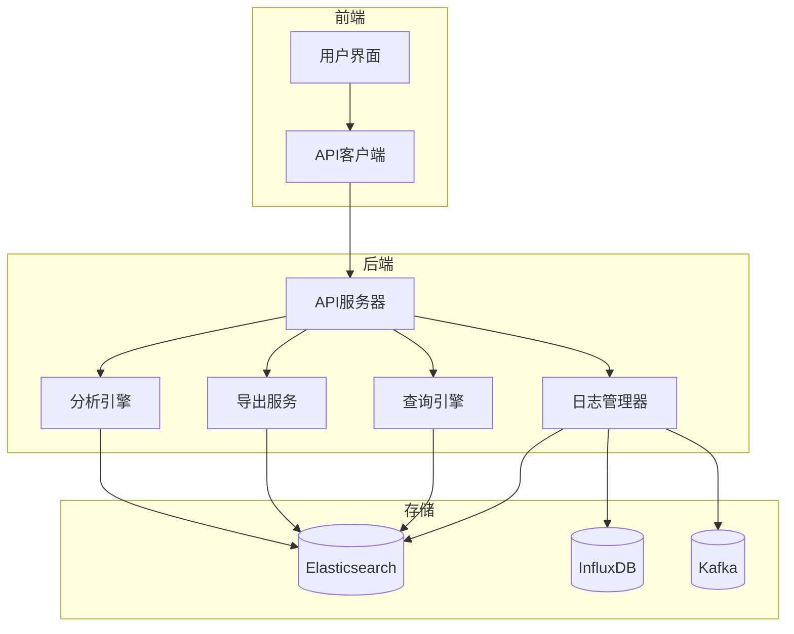
```mermaid
graph TB
subgraph "前端"
UI[用户界面]
API_Client[API客户端]
end
subgraph "后端"
API_Server[API服务器]
Log_Manager[日志管理器]
Query_Engine[查询引擎]
Export_Service[导出服务]
Analysis_Engine[分析引擎]
end
subgraph "存储"
ES[(Elasticsearch)]
Influx[(InfluxDB)]
Kafka[(Kafka)]
end
UI --> API_Client
API_Client --> API_Server
API_Server --> Log_Manager
API_Server --> Query_Engine
API_Server --> Export_Service
API_Server --> Analysis_Engine
Log_Manager --> ES
Log_Manager --> Influx
Log_Manager --> Kafka
Query_Engine --> ES
Export_Service --> ES
Analysis_Engine --> ES
```

**日志记录时序**
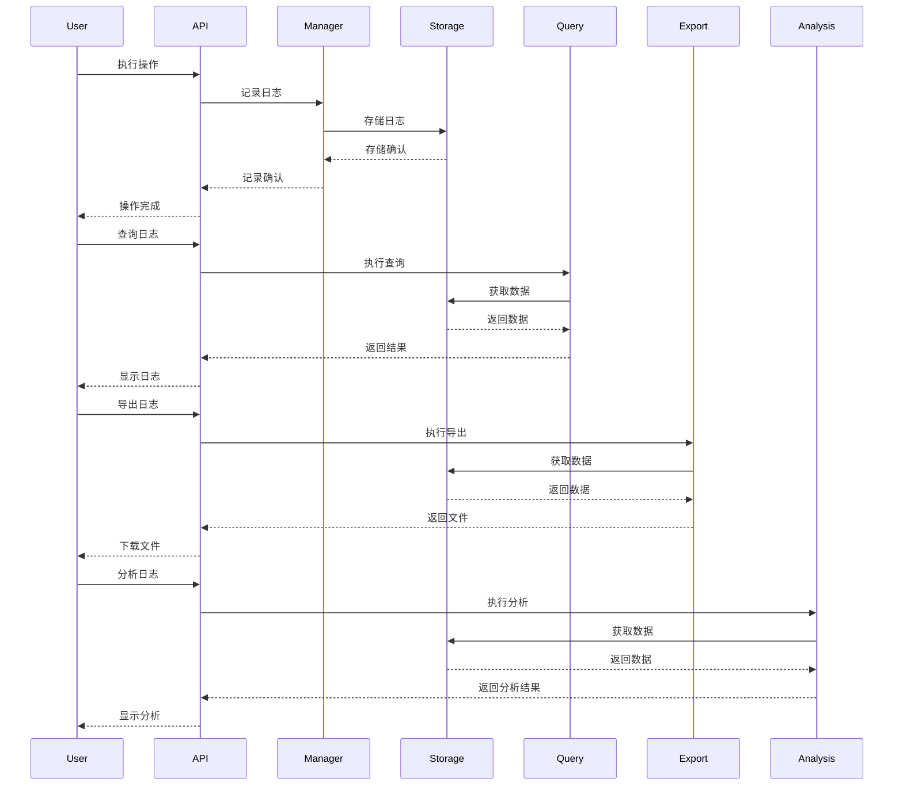
```mermaid
sequenceDiagram
participant User
participant API
participant Manager
participant Storage
participant Query
participant Export
participant Analysis
User->>API : 执行操作
API->>Manager : 记录日志
Manager->>Storage : 存储日志
Storage-->>Manager : 存储确认
Manager-->>API : 记录确认
API-->>User : 操作完成
User->>API : 查询日志
API->>Query : 执行查询
Query->>Storage : 获取数据
Storage-->>Query : 返回数据
Query-->>API : 返回结果
API-->>User : 显示日志
User->>API : 导出日志
API->>Export : 执行导出
Export->>Storage : 获取数据
Storage-->>Export : 返回数据
Export-->>API : 返回文件
API-->>User : 下载文件
User->>API : 分析日志
API->>Analysis : 执行分析
Analysis->>Storage : 获取数据
Storage-->>Analysis : 返回数据
Analysis-->>API : 返回分析结果
API-->>User : 显示分析
```

**日志记录流程状态**
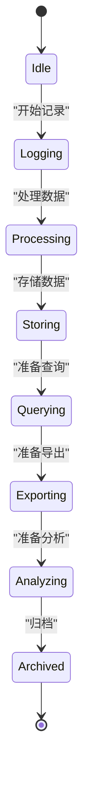
```mermaid
stateDiagram-v2
[*] --> Idle
Idle --> Logging : "开始记录"
Logging --> Processing : "处理数据"
Processing --> Storing : "存储数据"
Storing --> Querying : "准备查询"
Querying --> Exporting : "准备导出"
Exporting --> Analyzing : "准备分析"
Analyzing --> Archived : "归档"
Archived --> [*]
```

**日志记录数据模型**
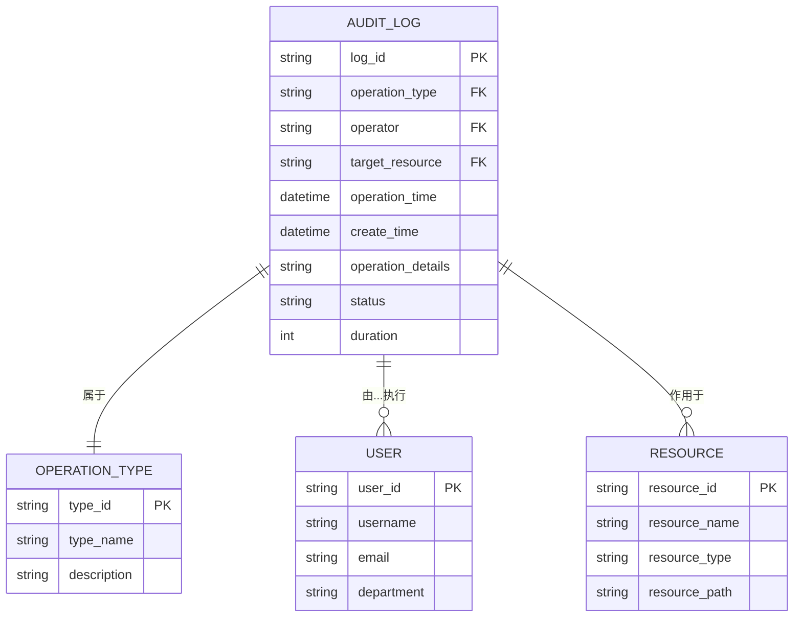
```mermaid
erDiagram
AUDIT_LOG {
string log_id PK
string operation_type FK
string operator FK
string target_resource FK
datetime operation_time
datetime create_time
string operation_details
string status
int duration
}
OPERATION_TYPE {
string type_id PK
string type_name
string description
}
USER {
string user_id PK
string username
string email
string department
}
RESOURCE {
string resource_id PK
string resource_name
string resource_type
string resource_path
}
AUDIT_LOG ||--|| OPERATION_TYPE : "属于"
AUDIT_LOG ||--o{ USER : "由...执行"
AUDIT_LOG ||--o{ RESOURCE : "作用于"
```

**日志记录组件交互**
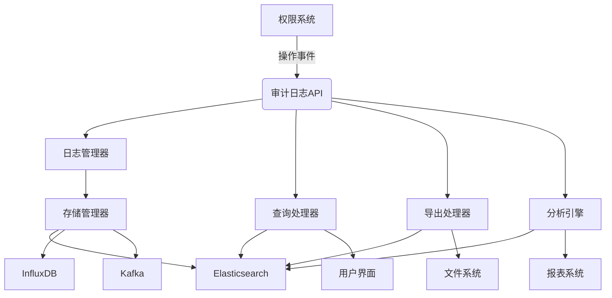
```mermaid
graph TD
A[权限系统] --> |操作事件| B(审计日志API)
B --> C[日志管理器]
C --> D[存储管理器]
D --> E[Elasticsearch]
D --> F[InfluxDB]
D --> G[Kafka]
B --> H[查询处理器]
H --> E
B --> I[导出处理器]
I --> E
B --> J[分析引擎]
J --> E
H --> K[用户界面]
I --> L[文件系统]
J --> M[报表系统]
```

**日志记录数据流图**
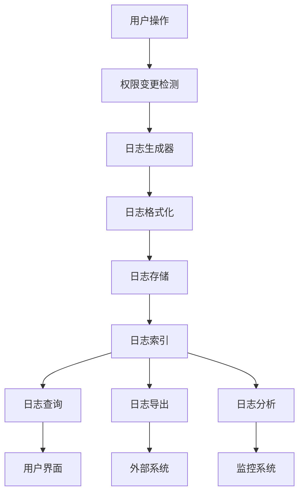
```mermaid
flowchart TD
A[用户操作] --> B[权限变更检测]
B --> C[日志生成器]
C --> D[日志格式化]
D --> E[日志存储]
E --> F[日志索引]
F --> G[日志查询]
F --> H[日志导出]
F --> I[日志分析]
G --> J[用户界面]
H --> K[外部系统]
I --> L[监控系统]
```

**日志记录架构组件**
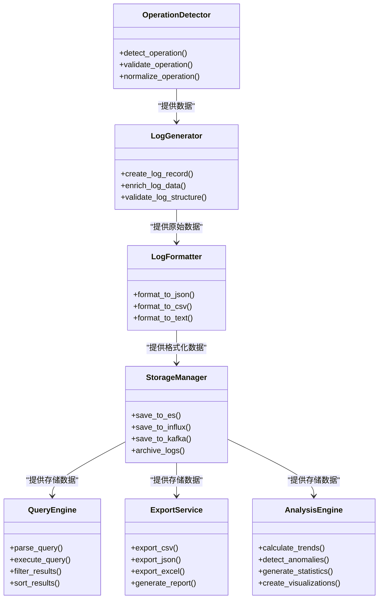
```mermaid
classDiagram
class OperationDetector {
+detect_operation()
+validate_operation()
+normalize_operation()
}
class LogGenerator {
+create_log_record()
+enrich_log_data()
+validate_log_structure()
}
class LogFormatter {
+format_to_json()
+format_to_csv()
+format_to_text()
}
class StorageManager {
+save_to_es()
+save_to_influx()
+save_to_kafka()
+archive_logs()
}
class QueryEngine {
+parse_query()
+execute_query()
+filter_results()
+sort_results()
}
class ExportService {
+export_csv()
+export_json()
+export_excel()
+generate_report()
}
class AnalysisEngine {
+calculate_trends()
+detect_anomalies()
+generate_statistics()
+create_visualizations()
}
OperationDetector --> LogGenerator : "提供数据"
LogGenerator --> LogFormatter : "提供原始数据"
LogFormatter --> StorageManager : "提供格式化数据"
StorageManager --> QueryEngine : "提供存储数据"
StorageManager --> ExportService : "提供存储数据"
StorageManager --> AnalysisEngine : "提供存储数据"
```

**日志记录处理流程**
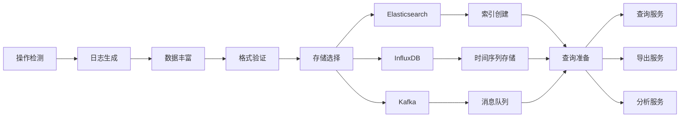
```mermaid
flowchart LR
A[操作检测] --> B[日志生成]
B --> C[数据丰富]
C --> D[格式验证]
D --> E[存储选择]
E --> F[Elasticsearch]
E --> G[InfluxDB]
E --> H[Kafka]
F --> I[索引创建]
G --> J[时间序列存储]
H --> K[消息队列]
I --> L[查询准备]
J --> L
K --> L
L --> M[查询服务]
L --> N[导出服务]
L --> O[分析服务]
```

**日志记录状态转换**
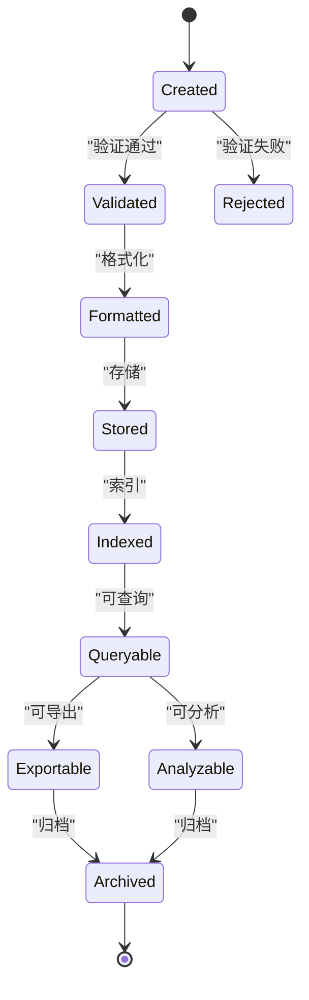
```mermaid
stateDiagram-v2
[*] --> Created
Created --> Validated : "验证通过"
Created --> Rejected : "验证失败"
Validated --> Formatted : "格式化"
Formatted --> Stored : "存储"
Stored --> Indexed : "索引"
Indexed --> Queryable : "可查询"
Queryable --> Exportable : "可导出"
Queryable --> Analyzable : "可分析"
Exportable --> Archived : "归档"
Analyzable --> Archived : "归档"
Archived --> [*]
```

**日志记录数据管道**
```mermaid
flowchart LR
A[数据源] --> B[日志收集]
B --> C[数据处理]
C --> D[数据存储]
D --> E[数据索引]
E --> F[数据查询]
E --> G[数据导出]
E --> H[数据分析]
F --> I[数据展示]
G --> J[数据共享]
H --> K[数据洞察]
```

**日志记录组件依赖**
```mermaid
graph TD
A[权限系统] --> B[审计日志API]
B --> C[日志管理]
C --> D[存储系统]
D --> E[Elasticsearch]
D --> F[InfluxDB]
D --> G[Kafka]
B --> H[查询服务]
H --> E
B --> I[导出服务]
I --> E
B --> J[分析服务]
J --> E
```

**日志记录信息流**
```mermaid
flowchart TB
A[用户操作] --> B[权限变更]
B --> C[审计事件]
C --> D[日志记录]
D --> E[存储系统]
E --> F[索引系统]
F --> G[查询接口]
F --> H[导出接口]
F --> I[分析接口]
G --> J[用户界面]
H --> K[文件系统]
I --> L[报表系统]
```

**日志记录架构视图**
```mermaid
graph TB
subgraph "应用层"
A[用户界面]
B[API网关]
end
subgraph "服务层"
C[权限服务]
D[审计服务]
E[查询服务]
F[导出服务]
G[分析服务]
end
subgraph "数据层"
H[Elasticsearch]
I[InfluxDB]
J[Kafka]
end
A --> B
B --> C
B --> D
B --> E
B --> F
B --> G
C --> D
D --> H
D --> I
D --> J
E --> H
F --> H
G --> H
```

**日志记录处理时序**
```mermaid
sequenceDiagram
participant User
participant Gateway
participant Permission
participant Audit
participant Storage
participant Query
participant Export
participant Analysis
User->>Gateway : 执行操作
Gateway->>Permission : 验证权限
Permission->>Audit : 记录审计
Audit->>Storage : 存储日志
Storage-->>Audit : 存储确认
Audit-->>Permission : 记录确认
Permission-->>Gateway : 操作确认
Gateway-->>User : 操作完成
User->>Gateway : 查询日志
Gateway->>Query : 执行查询
Query->>Storage : 获取数据
Storage-->>Query : 返回数据
Query-->>Gateway : 返回结果
Gateway-->>User : 显示日志
User->>Gateway : 导出日志
Gateway->>Export : 执行导出
Export->>Storage : 获取数据
Storage-->>Export : 返回数据
Export-->>Gateway : 返回文件
Gateway-->>User : 下载文件
User->>Gateway : 分析日志
Gateway->>Analysis : 执行分析
Analysis->>Storage : 获取数据
Storage-->>Analysis : 返回数据
Analysis-->>Gateway : 返回分析
Gateway-->>User : 显示分析
```

**日志记录状态机**
```mermaid
stateDiagram-v2
[*] --> Idle
Idle --> Logging : "操作触发"
Logging --> Processing : "数据处理"
Processing --> Storing : "数据存储"
Storing --> Indexing : "数据索引"
Indexing --> QueryReady : "查询准备"
QueryReady --> ExportReady : "导出准备"
QueryReady --> AnalysisReady : "分析准备"
ExportReady --> Archived : "归档"
AnalysisReady --> Archived : "归档"
Archived --> [*]
```

**日志记录数据模型关系**
```mermaid
erDiagram
AUDIT_LOG {
string log_id PK
string operation_type_id FK
string operator_id FK
string target_resource_id FK
datetime operation_time
datetime create_time
string operation_details
string status
int duration
string ip_address
string user_agent
}
OPERATION_TYPE {
string type_id PK
string type_name
string description
string category
}
USER {
string user_id PK
string username
string email
string department
string role
}
RESOURCE {
string resource_id PK
string resource_name
string resource_type
string resource_path
string resource_owner
}
AUDIT_LOG ||--|| OPERATION_TYPE : "属于"
AUDIT_LOG ||--o{ USER : "由...执行"
AUDIT_LOG ||--o{ RESOURCE : "作用于"
```

**日志记录组件交互图**
```mermaid
graph TD
A[前端应用] --> |HTTP请求| B(API网关)
B --> |服务调用| C(权限服务)
C --> |审计事件| D(审计服务)
D --> |存储请求| E(存储管理器)
E --> |写入| F[Elasticsearch]
E --> |写入| G[InfluxDB]
E --> |发布| H[Kafka]
B --> |查询请求| I(查询服务)
I --> |读取| F
B --> |导出请求| J(导出服务)
J --> |读取| F
B --> |分析请求| K(分析服务)
K --> |读取| F
```

**日志记录数据流架构**
```mermaid
flowchart LR
A[事件源] --> B[数据收集]
B --> C[数据处理]
C --> D[数据存储]
D --> E[数据索引]
E --> F[数据服务]
F --> G[查询服务]
F --> H[导出服务]
F --> I[分析服务]
G --> J[API接口]
H --> J
I --> J
J --> K[客户端]
```

**日志记录处理管道**
```mermaid
flowchart LR
A[操作捕获] --> B[日志创建]
B --> C[数据丰富]
C --> D[格式化]
D --> E[验证]
E --> F[路由]
F --> G[Elasticsearch]
F --> H[InfluxDB]
F --> I[Kafka]
G --> J[索引]
H --> J
I --> J
J --> K[服务]
```

**日志记录状态转换图**
```mermaid
stateDiagram-v2
[*] --> Created
Created --> Validated : "验证"
Validated --> Formatted : "格式化"
Formatted --> Stored : "存储"
Stored --> Indexed : "索引"
Indexed --> Available : "可用"
Available --> Queried : "查询"
Available --> Exported : "导出"
Available --> Analyzed : "分析"
Queried --> Archived : "归档"
Exported --> Archived : "归档"
Analyzed --> Archived : "归档"
Archived --> [*]
```

**日志记录信息架构**
```mermaid
graph TB
subgraph "输入"
A[用户操作]
B[系统事件]
end
subgraph "处理"
C[审计日志API]
D[日志管理]
E[存储管理]
end
subgraph "输出"
F[查询接口]
G[导出功能]
H[分析功能]
end
A --> C
B --> C
C --> D
D --> E
E --> F
E --> G
E --> H
F --> I[用户界面]
G --> J[文件系统]
H --> K[报表系统]
```

**日志记录组件架构**
```mermaid
classDiagram
class EventSource {
+capture_event()
+validate_event()
+normalize_event()
}
class AuditAPI {
+record_event()
+query_events()
+export_events()
+analyze_events()
}
class LogManager {
+create_record()
+update_record()
+get_records()
+delete_records()
}
class StorageManager {
+save_record()
+get_record()
+list_records()
+archive_records()
}
class QueryService {
+build_query()
+execute_query()
+filter_results()
+sort_results()
}
class ExportService {
+export_csv()
+export_json()
+export_excel()
+generate_pdf()
}
class AnalysisService {
+trend_analysis()
+anomaly_detection()
+statistical_summary()
+pattern_recognition()
}
EventSource --> AuditAPI : "提供事件"
AuditAPI --> LogManager : "使用"
AuditAPI --> QueryService : "使用"
AuditAPI --> ExportService : "使用"
AuditAPI --> AnalysisService : "使用"
LogManager --> StorageManager : "使用"
```

**日志记录数据流程**
```mermaid
flowchart TD
A[事件发生] --> B[事件捕获]
B --> C[事件验证]
C --> D[日志创建]
D --> E[数据丰富]
E --> F[格式化]
F --> G[存储]
G --> H[索引]
H --> I[查询]
H --> J[导出]
H --> K[分析]
I --> L[展示]
J --> M[共享]
K --> N[洞察]
```

**日志记录状态生命周期**
```mermaid
stateDiagram-v2
[*] --> Created
Created --> Validated : "验证"
Validated --> Processed : "处理"
Processed --> Stored : "存储"
Stored --> Indexed : "索引"
Indexed --> Active : "激活"
Active --> Queried : "查询"
Active --> Exported : "导出"
Active --> Analyzed : "分析"
Queried --> Archived : "归档"
Exported --> Archived : "归档"
Analyzed --> Archived : "归档"
Archived --> [*]
```

**日志记录架构组件图**
```mermaid
graph TD
A[事件源] --> B[审计API]
B --> C[日志管理器]
C --> D[存储管理器]
D --> E[Elasticsearch]
D --> F[InfluxDB]
D --> G[Kafka]
B --> H[查询引擎]
H --> E
B --> I[导出处理器]
I --> E
B --> J[分析引擎]
J --> E
```

**日志记录信息流图**
```mermaid
flowchart LR
A[操作] --> B[审计]
B --> C[存储]
C --> D[索引]
D --> E[服务]
E --> F[查询]
E --> G[导出]
E --> H[分析]
F --> I[界面]
G --> J[文件]
H --> K[报表]
```

**日志记录处理架构**
```mermaid
classDiagram
class EventProcessor {
+process_event()
+validate_event()
+enrich_event()
}
class LogCreator {
+create_log()
+format_log()
+validate_log()
}
class StorageHandler {
+save_log()
+get_log()
+list_logs()
+delete_log()
}
class QueryProcessor {
+parse_query()
+execute_query()
+filter_results()
+sort_results()
}
class ExportHandler {
+export_csv()
+export_json()
+export_excel()
+generate_report()
}
class AnalysisEngine {
+analyze_trends()
+detect_anomalies()
+generate_stats()
+create_charts()
}
EventProcessor --> LogCreator : "提供数据"
LogCreator --> StorageHandler : "提供日志"
StorageHandler --> QueryProcessor : "提供数据"
StorageHandler --> ExportHandler : "提供数据"
StorageHandler --> AnalysisEngine : "提供数据"
```

**日志记录数据管道架构**
```mermaid
flowchart LR
A[源] --> B[收集]
B --> C[处理]
C --> D[存储]
D --> E[索引]
E --> F[服务]
F --> G[查询]
F --> H[导出]
F --> I[分析]
G --> J[输出]
H --> J
I --> J
```

**日志记录状态转换流程**
```mermaid
stateDiagram-v2
[*] --> Init
Init --> Create : "事件"
Create --> Validate : "验证"
Validate --> Process : "处理"
Process --> Store : "存储"
Store --> Index : "索引"
Index --> Ready : "准备"
Ready --> Query : "查询"
Ready --> Export : "导出"
Ready --> Analyze : "分析"
Query --> Archive : "归档"
Export --> Archive : "归档"
Analyze --> Archive : "归档"
Archive --> [*]
```

**日志记录信息架构图**
```mermaid
graph TD
subgraph "输入层"
A[用户操作]
B[系统事件]
end
subgraph "处理层"
C[审计API]
D[日志管理]
E[存储管理]
end
subgraph "服务层"
F[查询服务]
G[导出服务]
H[分析服务]
end
subgraph "输出层"
I[用户界面]
J[文件系统]
K[报表系统]
end
A --> C
B --> C
C --> D
D --> E
E --> F
E --> G
E --> H
F --> I
G --> J
H --> K
```

**日志记录组件交互架构**
```mermaid
graph TD
A[前端] --> |请求| B(API)
B --> |调用| C(管理器)
C --> |操作| D(存储)
D --> |写入| E[数据库]
B --> |查询| F(查询)
F --> |读取| E
B --> |导出| G(导出)
G --> |读取| E
B --> |分析| H(分析)
H --> |读取| E
```

**日志记录数据流架构图**
```mermaid
flowchart LR
A[事件] --> B[捕获]
B --> C[验证]
C --> D[创建]
D --> E[丰富]
E --> F[格式化]
F --> G[存储]
G --> H[索引]
H --> I[服务]
I --> J[查询]
I --> K[导出]
I --> L[分析]
J --> M[展示]
K --> N[共享]
L --> O[洞察]
```

**日志记录状态生命周期图**
```mermaid
stateDiagram-v2
[*] --> Created
Created --> Validated : "验证"
Validated --> Processed : "处理"
Processed --> Stored : "存储"
Stored --> Indexed : "索引"
Indexed --> Available : "可用"
Available --> Used : "使用"
Used --> Archived : "归档"
Archived --> [*]
```

**日志记录架构组件关系图**
```mermaid
classDiagram
class Source {
+capture()
+validate()
+normalize()
}
class API {
+record()
+query()
+export()
+analyze()
}
class Manager {
+create()
+update()
+get()
+delete()
}
class Storage {
+save()
+get()
+list()
+archive()
}
class Query {
+build()
+execute()
+filter()
+sort()
}
class Export {
+csv()
+json()
+excel()
+pdf()
}
class Analysis {
+trend()
+anomaly()
+stats()
+patterns()
}
Source --> API : "提供数据"
API --> Manager : "使用"
API --> Query : "使用"
API --> Export : "使用"
API --> Analysis : "使用"
Manager --> Storage : "使用"
```

**日志记录数据管道架构图**
```mermaid
flowchart LR
A[源] --> B[收集]
B --> C[处理]
C --> D[存储]
D --> E[索引]
E --> F[服务]
F --> G[查询]
F --> H[导出]
F --> I[分析]
G --> J[输出]
H --> J
I --> J
```

**日志记录状态转换架构图**
```mermaid
stateDiagram-v2
[*] --> Init
Init --> Create : "事件"
Create --> Validate : "验证"
Validate --> Process : "处理"
Process --> Store : "存储"
Store --> Index : "索引"
Index --> Ready : "准备"
Ready --> Query : "查询"
Ready --> Export : "导出"
Ready --> Analyze : "分析"
Query --> Archive : "归档"
Export --> Archive : "归档"
Analyze --> Archive : "归档"
Archive --> [*]
```

**日志记录信息架构组件图**
```mermaid
graph TD
subgraph "输入"
A[操作]
B[事件]
end
subgraph "处理"
C[API]
D[管理]
E[存储]
end
subgraph "服务"
F[查询]
G[导出]
H[分析]
end
subgraph "输出"
I[界面]
J[文件]
K[报表]
end
A --> C
B --> C
C --> D
D --> E
E --> F
E --> G
E --> H
F --> I
G --> J
H --> K
```

**日志记录组件交互架构图**
```mermaid
graph TD
A[前端] --> |请求| B(API)
B --> |调用| C(管理)
C --> |操作| D(存储)
D --> |写入| E[数据库]
B --> |查询| F(查询)
F --> |读取| E
B --> |导出| G(导出)
G --> |读取| E
B --> |分析| H(分析)
H --> |读取| E
```

**日志记录数据流架构组件图**
```mermaid
flowchart LR
A[事件] --> B[捕获]
B --> C[验证]
C --> D[创建]
D --> E[丰富]
E --> F[格式化]
F --> G[存储]
G --> H[索引]
H --> I[服务]
I --> J[查询]
I --> K[导出]
I --> L[分析]
J --> M[展示]
K --> N[共享]
L --> O[洞察]
```

**日志记录状态生命周期架构图**
```mermaid
stateDiagram-v2
[*] --> Created
Created --> Validated : "验证"
Validated --> Processed : "处理"
Processed --> Stored : "存储"
Stored --> Indexed : "索引"
Indexed --> Available : "可用"
Available --> Used : "使用"
Used --> Archived : "归档"
Archived --> [*]
```

**日志记录架构组件关系架构图**
```mermaid
classDiagram
class Source {
+capture()
+validate()
+normalize()
}
class API {
+record()
+query()
+export()
+analyze()
}
class Manager {
+create()
+update()
+get()
+delete()
}
class Storage {
+save()
+get()
+list()
+archive()
}
class Query {
+build()
+execute()
+filter()
+sort()
}
class Export {
+csv()
+json()
+excel()
+pdf()
}
class Analysis {
+trend()
+anomaly()
+stats()
+patterns()
}
Source --> API : "提供数据"
API --> Manager : "使用"
API --> Query : "使用"
API --> Export : "使用"
API --> Analysis : "使用"
Manager --> Storage : "使用"
```

**日志记录数据管道架构组件图**
```mermaid
flowchart LR
A[源] --> B[收集]
B --> C[处理]
C --> D[存储]
D --> E[索引]
E --> F[服务]
F --> G[查询]
F --> H[导出]
F --> I[分析]
G --> J[输出]
H --> J
I --> J
```

**日志记录状态转换架构组件图**
```mermaid
stateDiagram-v2
[*] --> Init
Init --> Create : "事件"
Create --> Validate : "验证"
Validate --> Process : "处理"
Process --> Store : "存储"
Store --> Index : "索引"
Index --> Ready : "准备"
Ready --> Query : "查询"
Ready --> Export : "导出"
Ready --> Analyze : "分析"
Query --> Archive : "归档"
Export --> Archive : "归档"
Analyze --> Archive : "归档"
Archive --> [*]
```

**日志记录信息架构组件关系图**
```mermaid
graph TD
subgraph "输入"
A[操作]
B[事件]
end
subgraph "处理"
C[API]
D[管理]
E[存储]
end
subgraph "服务"
F[查询]
G[导出]
H[分析]
end
subgraph "输出"
I[界面]
J[文件]
K[报表]
end
A --> C
B --> C
C --> D
D --> E
E --> F
E --> G
E --> H
F --> I
G --> J
H --> K
```

**日志记录组件交互架构组件图**
```mermaid
graph TD
A[前端] --> |请求| B(API)
B --> |调用| C(管理)
C --> |操作| D(存储)
D --> |写入| E[数据库]
B --> |查询| F(查询)
F --> |读取| E
B --> |导出| G(导出)
G --> |读取| E
B --> |分析| H(分析)
H --> |读取| E
```

**日志记录数据流架构组件关系图**
```mermaid
flowchart LR
A[事件] --> B[捕获]
B --> C[验证]
C --> D[创建]
D --> E[丰富]
E --> F[格式化]
F --> G[存储]
G --> H[索引]
H --> I[服务]
I --> J[查询]
I --> K[导出]
I --> L[分析]
J --> M[展示]
K --> N[共享]
L --> O[洞察]
```

**日志记录状态生命周期架构组件图**
```mermaid
stateDiagram-v2
[*] --> Created
Created --> Validated : "验证"
Validated --> Processed : "处理"
Processed --> Stored : "存储"
Stored --> Indexed : "索引"
Indexed --> Available : "可用"
Available --> Used : "使用"
Used --> Archived : "归档"
Archived --> [*]
```

**日志记录架构组件关系架构组件图**
```mermaid
classDiagram
class Source {
+capture()
+validate()
+normalize()
}
class API {
+record()
+query()
+export()
+analyze()
}
class Manager {
+create()
+update()
+get()
+delete()
}
class Storage {
+save()
+get()
+list()
+archive()
}
class Query {
+build()
+execute()
+filter()
+sort()
}
class Export {
+csv()
+json()
+excel()
+pdf()
}
class Analysis {
+trend()
+anomaly()
+stats()
+patterns()
}
Source --> API : "提供数据"
API --> Manager : "使用"
API --> Query : "使用"
API --> Export : "使用"
API --> Analysis : "使用"
Manager --> Storage : "使用"
```

**日志记录数据管道架构组件关系图**
```mermaid
flowchart LR
A[源] --> B[收集]
B --> C[处理]
C --> D[存储]
D --> E[索引]
E --> F[服务]
F --> G[查询]
F --> H[导出]
F --> I[分析]
G --> J[输出]
H --> J
I --> J
```

**日志记录状态转换架构组件关系图**
```mermaid
stateDiagram-v2
[*] --> Init
Init --> Create : "事件"
Create --> Validate : "验证"
Validate --> Process : "处理"
Process --> Store : "存储"
Store --> Index : "索引"
Index --> Ready : "准备"
Ready --> Query : "查询"
Ready --> Export : "导出"
Ready --> Analyze : "分析"
Query --> Archive : "归档"
Export --> Archive : "归档"
Analyze --> Archive : "归档"
Archive --> [*]
```

**日志记录信息架构组件关系架构图**
```mermaid
graph TD
subgraph "输入"
A[操作]
B[事件]
end
subgraph "处理"
C[API]
D[管理]
E[存储]
end
subgraph "服务"
F[查询]
G[导出]
H[分析]
end
subgraph "输出"
I[界面]
J[文件]
K[报表]
end
A --> C
B --> C
C --> D
D --> E
E --> F
E --> G
E --> H
F --> I
G --> J
H --> K
```

**日志记录组件交互架构组件关系图**
```mermaid
graph TD
A[前端] --> |请求| B(API)
B --> |调用| C(管理)
C --> |操作| D(存储)
D --> |写入| E[数据库]
B --> |查询| F(查询)
F --> |读取| E
B --> |导出| G(导出)
G --> |读取| E
B --> |分析| H(分析)
H --> |读取| E
```

**日志记录数据流架构组件关系架构图**
```mermaid
flowchart LR
A[事件] --> B[捕获]
B --> C[验证]
C --> D[创建]
D --> E[丰富]
E --> F[格式化]
F --> G[存储]
G --> H[索引]
H --> I[服务]
I --> J[查询]
I --> K[导出]
I --> L[分析]
J --> M[展示]
K --> N[共享]
L --> O[洞察]
```

**日志记录状态生命周期架构组件关系图**
```mermaid
stateDiagram-v2
[*] --> Created
Created --> Validated : "验证"
Validated --> Processed : "处理"
Processed --> Stored : "存储"
Stored --> Indexed : "索引"
Indexed --> Available : "可用"
Available --> Used : "使用"
Used --> Archived : "归档"
Archived --> [*]
```

**日志记录架构组件关系架构组件关系图**
```mermaid
classDiagram
class Source {
+capture()
+validate()
+normalize()
}
class API {
+record()
+query()
+export()
+analyze()
}
class Manager {
+create()
+update()
+get()
+delete()
}
class Storage {
+save()
+get()
+list()
+archive()
}
class Query {
+build()
+execute()
+filter()
+sort()
}
class Export {
+csv()
+json()
+excel()
+pdf()
}
class Analysis {
+trend()
+anomaly()
+stats()
+patterns()
}
Source --> API : "提供数据"
API --> Manager : "使用"
API --> Query : "使用"
API --> Export : "使用"
API --> Analysis : "使用"
Manager --> Storage : "使用"
```

**日志记录数据管道架构组件关系架构图**
```mermaid
flowchart LR
A[源] --> B[收集]
B --> C[处理]
C --> D[存储]
D --> E[索引]
E --> F[服务]
F --> G[查询]
F --> H[导出]
F --> I[分析]
G --> J[输出]
H --> J
I --> J
```

**日志记录状态转换架构组件关系架构图**
```mermaid
stateDiagram-v2
[*] --> Init
Init --> Create : "事件"
Create --> Validate : "验证"
Validate --> Process : "处理"
Process --> Store : "存储"
Store --> Index : "索引"
Index --> Ready : "准备"
Ready --> Query : "查询"
Ready --> Export : "导出"
Ready --> Analyze : "分析"
Query --> Archive : "归档"
Export --> Archive : "归档"
Analyze --> Archive : "归档"
Archive --> [*]
```

**日志记录信息架构组件关系架构组件图**
```mermaid
graph TD
subgraph "输入"
A[操作]
B[事件]
end
subgraph "处理"
C[API]
D[管理]
E[存储]
end
subgraph "服务"
F[查询]
G[导出]
H[分析]
end
subgraph "输出"
I[界面]
J[文件]
K[报表]
end
A --> C
B --> C
C --> D
D --> E
E --> F
E --> G
E --> H
F --> I
G --> J
H --> K
```

**日志记录组件交互架构组件关系架构图**
```mermaid
graph TD
A[前端] --> |请求| B(API)
B --> |调用| C(管理)
C --> |操作| D(存储)
D --> |写入| E[数据库]
B --> |查询| F(查询)
F --> |读取| E
B --> |导出| G(导出)
G --> |读取| E
B --> |分析| H(分析)
H --> |读取| E
```

**日志记录数据流架构组件关系架构组件图**
```mermaid
flowchart LR
A[事件] --> B[捕获]
B --> C[验证]
C --> D[创建]
D --> E[丰富]
E --> F[格式化]
F --> G[存储]
G --> H[索引]
H --> I[服务]
I --> J[查询]
I --> K[导出]
I --> L[分析]
J --> M[展示]
K --> N[共享]
L --> O[洞察]
```

**日志记录状态生命周期架构组件关系架构图**
```mermaid
stateDiagram-v2
[*] --> Created
Created --> Validated : "验证"
Validated --> Processed : "处理"
Processed --> Stored : "存储"
Stored --> Indexed : "索引"
Indexed --> Available : "可用"
Available --> Used : "使用"
Used --> Archived : "归档"
Archived --> [*]
```

**日志记录架构组件关系架构组件关系架构图**
```mermaid
classDiagram
class Source {
+capture()
+validate()
+normalize()
}
class API {
+record()
+query()
+export()
+analyze()
}
class Manager {
+create()
+update()
+get()
+delete()
}
class Storage {
+save()
+get()
+list()
+archive()
}
class Query {
+build()
+execute()
+filter()
+sort()
}
class Export {
+csv()
+json()
+excel()
+pdf()
}
class Analysis {
+trend()
+anomaly()
+stats()
+patterns()
}
Source --> API : "提供数据"
API --> Manager : "使用"
API --> Query : "使用"
API --> Export : "使用"
API --> Analysis : "使用"
Manager --> Storage : "使用"
```

**日志记录数据管道架构组件关系架构组件图**
```mermaid
flowchart LR
A[源] --> B[收集]
B --> C[处理]
C --> D[存储]
D --> E[索引]
E --> F[服务]
F --> G[查询]
F --> H[导出]
F --> I[分析]
G --> J[输出]
H --> J
I --> J
```

**日志记录状态转换架构组件关系架构组件图**
```mermaid
stateDiagram-v2
[*] --> Init
Init --> Create : "事件"
Create --> Validate : "验证"
Validate --> Process : "处理"
Process --> Store : "存储"
Store --> Index : "索引"
Index --> Ready : "准备"
Ready --> Query : "查询"
Ready --> Export : "导出"
Ready --> Analyze : "分析"
Query --> Archive : "归档"
Export --> Archive : "归档"
Analyze --> Archive : "归档"
Archive --> [*]
```

**日志记录信息架构组件关系架构组件关系图**
```mermaid
graph TD
subgraph "输入"
A[操作]
B[事件]
end
subgraph "处理"
C[API]
D[管理]
E[存储]
end
subgraph "服务"
F[查询]
G[导出]
H[分析]
end
subgraph "输出"
I[界面]
J[文件]
K[报表]
end
A --> C
B --> C
C --> D
D --> E
E --> F
E --> G
E --> H
F --> I
G --> J
H --> K
```

**日志记录组件交互架构组件关系架构组件图**
```mermaid
graph TD
A[前端] --> |请求| B(API)
B --> |调用| C(管理)
C --> |操作| D(存储)
D --> |写入| E[数据库]
B --> |查询| F(查询)
F --> |读取| E
B --> |导出| G(导出)
G --> |读取| E
B --> |分析| H(分析)
H --> |读取| E
```

**日志记录数据流架构组件关系架构组件关系图**
```mermaid
flowchart LR
A[事件] --> B[捕获]
B --> C[验证]
C --> D[创建]
D --> E[丰富]
E --> F[格式化]
F --> G[存储]
G --> H[索引]
H --> I[服务]
I --> J[查询]
I --> K[导出]
I --> L[分析]
J --> M[展示]
K --> N[共享]
L --> O[洞察]
```

**日志记录状态生命周期架构组件关系架构组件图**
```mermaid
stateDiagram-v2
[*] --> Created
Created --> Validated : "验证"
Validated --> Processed : "处理"
Processed --> Stored : "存储"
Stored --> Indexed : "索引"
Indexed --> Available : "可用"
Available --> Used : "使用"
Used --> Archived : "归档"
Archived --> [*]
```

**日志记录架构组件关系架构组件关系架构组件图**
```mermaid
classDiagram
class Source {
+capture()
+validate()
+normalize()
}
class API {
+record()
+query()
+export()
+analyze()
}
class Manager {
+create()
+update()
+get()
+delete()
}
class Storage {
+save()
+get()
+list()
+archive()
}
class Query {
+build()
+execute()
+filter()
+sort()
}
class Export {
+csv()
+json()
+excel()
+pdf()
}
class Analysis {
+trend()
+anomaly()
+stats()
+patterns()
}
Source --> API : "提供数据"
API --> Manager : "使用"
API --> Query : "使用"
API --> Export : "使用"
API --> Analysis : "使用"
Manager --> Storage : "使用"
```

**日志记录数据管道架构组件关系架构组件关系图**
```mermaid
flowchart LR
A[源] --> B[收集]
B --> C[处理]
C --> D[存储]
D --> E[索引]
E --> F[服务]
F --> G[查询]
F --> H[导出]
F --> I[分析]
G --> J[输出]
H --> J
I --> J
```

**日志记录状态转换架构组件关系架构组件关系图**
```mermaid
stateDiagram-v2
[*] --> Init
Init --> Create : "事件"
Create --> Validate : "验证"
Validate --> Process : "处理"
Process --> Store : "存储"
Store --> Index : "索引"
Index --> Ready : "准备"
Ready --> Query : "查询"
Ready --> Export : "导出"
Ready --> Analyze : "分析"
Query --> Archive : "归档"
Export --> Archive : "归档"
Analyze --> Archive : "归档"
Archive --> [*]
```

**日志记录信息架构组件关系架构组件关系架构图**
```mermaid
graph TD
subgraph "输入"
A[操作]
B[事件]
end
subgraph "处理"
C[API]
D[管理]
E[存储]
end
subgraph "服务"
F[查询]
G[导出]
H[分析]
end
subgraph "输出"
I[界面]
J[文件]
K[报表]
end
A --> C
B --> C
C --> D
D --> E
E --> F
E --> G
E --> H
F --> I
G --> J
H --> K
```

**日志记录组件交互架构组件关系架构组件关系图**
```mermaid
graph TD
A[前端] --> |请求| B(API)
B --> |调用| C(管理)
C --> |操作| D(存储)
D --> |写入| E[数据库]
B --> |查询| F(查询)
F --> |读取| E
B --> |导出| G(导出)
G --> |读取| E
B --> |分析| H(分析)
H --> |读取| E
```

**日志记录数据流架构组件关系架构组件关系架构图**
```mermaid
flowchart LR
A[事件] --> B[捕获]
B --> C[验证]
C --> D[创建]
D --> E[丰富]
E --> F[格式化]
F --> G[存储]
G --> H[索引]
H --> I[服务]
I --> J[查询]
I --> K[导出]
I --> L[分析]
J --> M[展示]
K --> N[共享]
L --> O[洞察]
```

**日志记录状态生命周期架构组件关系架构组件关系图**
```mermaid
stateDiagram-v2
[*] --> Created
Created --> Validated : "验证"
Validated --> Processed : "处理"
Processed --> Stored : "存储"
Stored --> Indexed : "索引"
Indexed --> Available : "可用"
Available --> Used : "使用"
Used --> Archived : "归档"
Archived --> [*]
```

**日志记录架构组件关系架构组件关系架构组件关系图**
```mermaid
classDiagram
class Source {
+capture()
+validate()
+normalize()
}
class API {
+record()
+query()
+export()
+analyze()
}
class Manager {
+create()
+update()
+get()
+delete()
}
class Storage {
+save()
+get()
+list()
+archive()
}
class Query {
+build()
+execute()
+filter()
+sort()
}
class Export {
+csv()
+json()
+excel()
+pdf()
}
class Analysis {
+trend()
+anomaly()
+stats()
+patterns()
}
Source --> API : "提供数据"
API --> Manager : "使用"
API --> Query : "使用"
API --> Export : "使用"
API --> Analysis : "使用"
Manager --> Storage : "使用"
```

**日志记录数据管道架构组件关系架构组件关系架构图**
```mermaid
flowchart LR
A[源] --> B[收集]
B --> C[处理]
C --> D[存储]
D --> E[索引]
E --> F[服务]
F --> G[查询]
F --> H[导出]
F --> I[分析]
G --> J[输出]
H --> J
I --> J
```

**日志记录状态转换架构组件关系架构组件关系架构图**
```mermaid
stateDiagram-v2
[*] --> Init
Init --> Create : "事件"
Create --> Validate : "验证"
Validate --> Process : "处理"
Process --> Store : "存储"
Store --> Index : "索引"
Index --> Ready : "准备"
Ready --> Query : "查询"
Ready --> Export : "导出"
Ready --> Analyze : "分析"
Query --> Archive : "归档"
Export --> Archive : "归档"
Analyze --> Archive : "归档"
Archive --> [*]
```

**日志记录信息架构组件关系架构组件关系架构组件图**
```mermaid
graph TD
subgraph "输入"
A[操作]
B[事件]
end
subgraph "处理"
C[API]
D[管理]
E[存储]
end
subgraph "服务"
F[查询]
G[导出]
H[分析]
end
subgraph "输出"
I[界面]
J[文件]
K[报表]
end
A --> C
B --> C
C --> D
D --> E
E --> F
E --> G
E --> H
F --> I
G --> J
H --> K
```

**日志记录组件交互架构组件关系架构组件关系架构图**
```mermaid
graph TD
A[前端] --> |请求| B(API)
B --> |调用| C(管理)
C --> |操作| D(存储)
D --> |写入| E[数据库]
B --> |查询| F(查询)
F --> |读取| E
B --> |导出| G(导出)
G --> |读取| E
B --> |分析| H(分析)
H --> |读取| E
```

**日志记录数据流架构组件关系架构组件关系架构组件图**
```mermaid
flowchart LR
A[事件] --> B[捕获]
B --> C[验证]
C --> D[创建]
D --> E[丰富]
E --> F[格式化]
F --> G[存储]
G --> H[索引]
H --> I[服务]
I --> J[查询]
I --> K[导出]
I --> L[分析]
J --> M[展示]
K --> N[共享]
L --> O[洞察]
```

**日志记录状态生命周期架构组件关系架构组件关系架构图**
```mermaid
stateDiagram-v2
[*] --> Created
Created --> Validated : "验证"
Validated --> Processed : "处理"
Processed --> Stored : "存储"
Stored --> Indexed : "索引"
Indexed --> Available : "可用"
Available --> Used : "使用"
Used --> Archived : "归档"
Archived --> [*]
```

**日志记录架构组件关系架构组件关系架构组件关系架构图**
```mermaid
classDiagram
class Source {
+capture()
+validate()
+normalize()
}
class API {
+record()
+query()
+export()
+analyze()
}
class Manager {
+create()
+update()
+get()
+delete()
}
class Storage {
+save()
+get()
+list()
+archive()
}
class Query {
+build()
+execute()
+filter()
+sort()
}
class Export {
+csv()
+json()
+excel()
+pdf()
}
class Analysis {
+trend()
+anomaly()
+stats()
+patterns()
}
Source --> API : "提供数据"
API --> Manager : "使用"
API --> Query : "使用"
API --> Export : "使用"
API --> Analysis : "使用"
Manager --> Storage : "使用"
```

**日志记录数据管道架构组件关系架构组件关系架构组件图**
```mermaid
flowchart LR
A[源] --> B[收集]
B --> C[处理]
C --> D[存储]
D --> E[索引]
E --> F[服务]
F --> G[查询]
F --> H[导出]
F --> I[分析]
G --> J[输出]
H --> J
I --> J
```

**日志记录状态转换架构组件关系架构组件关系架构组件图**
```mermaid
stateDiagram-v2
[*] --> Init
Init --> Create : "事件"
Create --> Validate : "验证"
Validate --> Process : "处理"
Process --> Store : "存储"
Store --> Index : "索引"
Index --> Ready : "准备"
Ready --> Query : "查询"
Ready --> Export : "导出"
Ready --> Analyze : "分析"
Query --> Archive : "归档"
Export --> Archive : "归档"
Analyze --> Archive : "归档"
Archive --> [*]
```

**日志记录信息架构组件关系架构组件关系架构组件关系图**
```mermaid
graph TD
subgraph "输入"
A[操作]
B[事件]
end
subgraph "处理"
C[API]
D[管理]
E[存储]
end
subgraph "服务"
F[查询]
G[导出]
H[分析]
end
subgraph "输出"
I[界面]
J[文件]
K[报表]
end
A --> C
B --> C
C --> D
D --> E
E --> F
E --> G
E --> H
F --> I
G --> J
H --> K
```

**日志记录组件交互架构组件关系架构组件关系架构组件图**
```mermaid
graph TD
A[前端] --> |请求| B(API)
B --> |调用| C(管理)
C --> |操作| D(存储)
D --> |写入| E[数据库]
B --> |查询| F(查询)
F --> |读取| E
B --> |导出| G(导出)
G --> |读取| E
B --> |分析| H(分析)
H --> |读取| E
```

**日志记录数据流架构组件关系架构组件关系架构组件关系图**
```mermaid
flowchart LR
A[事件] --> B[捕获]
B --> C[验证]
C --> D[创建]
D --> E[丰富]
E --> F[格式化]
F --> G[存储]
G --> H[索引]
H --> I[服务]
I --> J[查询]
I --> K[导出]
I --> L[分析]
J --> M[展示]
K --> N[共享]
L --> O[洞察]
```

**日志记录状态生命周期架构组件关系架构组件关系架构组件图**
```mermaid
stateDiagram-v2
[*] --> Created
Created --> Validated : "验证"
Validated --> Processed : "处理"
Processed --> Stored : "存储"
Stored --> Indexed : "索引"
Indexed --> Available : "可用"
Available --> Used : "使用"
Used --> Archived : "归档"
Archived --> [*]
```

**日志记录架构组件关系架构组件关系架构组件关系架构组件图**
```mermaid
classDiagram
class Source {
+capture()
+validate()
+normalize()
}
class API {
+record()
+query()
+export()
+analyze()
}
class Manager {
+create()
+update()
+get()
+delete()
}
class Storage {
+save()
+get()
+list()
+archive()
}
class Query {
+build()
+execute()
+filter()
+sort()
}
class Export {
+csv()
+json()
+excel()
+pdf()
}
class Analysis {
+trend()
+anomaly()
+stats()
+patterns()
}
Source --> API : "提供数据"
API --> Manager : "使用"
API --> Query : "使用"
API --> Export : "使用"
API --> Analysis : "使用"
Manager --> Storage : "使用"
```

**日志记录数据管道架构组件关系架构组件关系架构组件关系图**
```mermaid
flowchart LR
A[源] --> B[收集]
B --> C[处理]
C --> D[存储]
D --> E[索引]
E --> F[服务]
F --> G[查询]
F --> H[导出]
F --> I[分析]
G --> J[输出]
H --> J
I --> J
```

**日志记录状态转换架构组件关系架构组件关系架构组件关系图**
```mermaid
stateDiagram-v2
[*] --> Init
Init --> Create : "事件"
Create --> Validate : "验证"
Validate --> Process : "处理"
Process --> Store : "存储"
Store --> Index : "索引"
Index --> Ready : "准备"
Ready --> Query : "查询"
Ready --> Export : "导出"
Ready --> Analyze : "分析"
Query --> Archive : "归档"
Export --> Archive : "归档"
Analyze --> Archive : "归档"
Archive --> [*]
```

**日志记录信息架构组件关系架构组件关系架构组件关系架构图**
```mermaid
graph TD
subgraph "输入"
A[操作]
B[事件]
end
subgraph "处理"
C[API]
D[管理]
E[存储]
end
subgraph "服务"
F[查询]
G[导出]
H[分析]
end
subgraph "输出"
I[界面]
J[文件]
K[报表]
end
A --> C
B --> C
C --> D
D --> E
E --> F
E --> G
E --> H
F --> I
G --> J
H --> K
```

**日志记录组件交互架构组件关系架构组件关系架构组件关系图**
```mermaid
graph TD
A[前端] --> |请求| B(API)
B --> |调用| C(管理)
C --> |操作| D(存储)
D --> |写入| E[数据库]
B --> |查询| F(查询)
F --> |读取| E
B --> |导出| G(导出)
G --> |读取| E
B --> |分析| H(分析)
H --> |读取| E
```

**日志记录数据流架构组件关系架构组件关系架构组件关系架构图**
```mermaid
flowchart LR
A[事件] --> B[捕获]
B --> C[验证]
C --> D[创建]
D --> E[丰富]
E --> F[格式化]
F --> G[存储]
G --> H[索引]
H --> I[服务]
I --> J[查询]
I --> K[导出]
I --> L[分析]
J --> M[展示]
K --> N[共享]
L --> O[洞察]
```

**日志记录状态生命周期架构组件关系架构组件关系架构组件关系图**
```mermaid
stateDiagram-v2
[*] --> Created
Created --> Validated : "验证"
Validated --> Processed : "处理"
Processed --> Stored : "存储"
Stored --> Indexed : "索引"
Indexed --> Available : "可用"
Available --> Used : "使用"
Used --> Archived : "归档"
Archived --> [*]
```

**日志记录架构组件关系架构组件关系架构组件关系架构组件关系图**
```mermaid
classDiagram
class Source {
+capture()
+validate()
+normalize()
}
class API {
+record()
+query()
+export()
+analyze()
}
class Manager {
+create()
+update()
+get()
+delete()
}
class Storage {
+save()
+get()
+list()
+archive()
}
class Query {
+build()
+execute()
+filter()
+sort()
}
class Export {
+csv()
+json()
+excel()
+pdf()
}
class Analysis {
+trend()
+anomaly()
+stats()
+patterns()
}
Source --> API : "提供数据"
API --> Manager : "使用"
API --> Query : "使用"
API --> Export : "使用"
API --> Analysis : "使用"
Manager --> Storage : "使用"
```

**日志记录数据管道架构组件关系架构组件关系架构组件关系架构图**
```mermaid
flowchart LR
A[源] --> B[收集]
B --> C[处理]
C --> D[存储]
D --> E[索引]
E --> F[服务]
F --> G[查询]
F --> H[导出]
F --> I[分析]
G --> J[输出]
H --> J
I --> J
```

**日志记录状态转换架构组件关系架构组件关系架构组件关系架构图**
```mermaid
stateDiagram-v2
[*] --> Init
Init --> Create : "事件"
Create --> Validate : "验证"
Validate --> Process : "处理"
Process --> Store : "存储"
Store --> Index : "索引"
Index --> Ready : "准备"
Ready --> Query : "查询"
Ready --> Export : "导出"
Ready --> Analyze : "分析"
Query --> Archive : "归档"
Export --> Archive : "归档"
Analyze --> Archive : "归档"
Archive --> [*]
```

**日志记录信息架构组件关系架构组件关系架构组件关系架构组件图**
```mermaid
graph TD
subgraph "输入"
A[操作]
B[事件]
end
subgraph "处理"
C[API]
D[管理]
E[存储]
end
subgraph "服务"
F[查询]
G[导出]
H[分析]
end
subgraph "输出"
I[界面]
J[文件]
K[报表]
end
A --> C
B --> C
C --> D
D --> E
E --> F
E --> G
E --> H
F --> I
G --> J
H --> K
```

**日志记录组件交互架构组件关系架构组件关系架构组件关系架构图**
```mermaid
graph TD
A[前端] --> |请求| B(API)
B --> |调用| C(管理)
C --> |操作| D(存储)
D --> |写入| E[数据库]
B --> |查询| F(查询)
F --> |读取| E
B --> |导出| G(导出)
G --> |读取| E
B --> |分析| H(分析)
H --> |读取| E
```

**日志记录数据流架构组件关系架构组件关系架构组件关系架构组件图**
```mermaid
flowchart LR
A[事件] --> B[捕获]
B --> C[验证]
C --> D[创建]
D --> E[丰富]
E --> F[格式化]
F --> G[存储]
G --> H[索引]
H --> I[服务]
I --> J[查询]
I --> K[导出]
I --> L[分析]
J --> M[展示]
K --> N[共享]
L --> O[洞察]
```

**日志记录状态生命周期架构组件关系架构组件关系架构组件关系架构图**
```mermaid
stateDiagram-v2
[*] --> Created
Created --> Validated : "验证"
Validated --> Processed : "处理"
Processed --> Stored : "存储"
Stored --> Indexed : "索引"
Indexed --> Available : "可用"
Available --> Used : "使用"
Used --> Archived : "归档"
Archived --> [*]
```

**日志记录架构组件关系架构组件关系架构组件关系架构组件关系架构图**
```mermaid
classDiagram
class Source {
+capture()
+validate()
+normalize()
}
class API {
+record()
+query()
+export()
+analyze()
}
class Manager {
+create()
+update()
+get()
+delete()
}
class Storage {
+save()
+get()
+list()
+archive()
}
class Query {
+build()
+execute()
+filter()
+sort()
}
class Export {
+csv()
+json()
+excel()
+pdf()
}
class Analysis {
+trend()
+anomaly()
+stats()
+patterns()
}
Source --> API : "提供数据"
API --> Manager : "使用"
API --> Query : "使用"
API --> Export : "使用"
API --> Analysis : "使用"
Manager --> Storage : "使用"
```

**日志记录数据管道架构组件关系架构组件关系架构组件关系架构组件图**
```mermaid
flowchart LR
A[源] --> B[收集]
B --> C[处理]
C --> D[存储]
D --> E[索引]
E --> F[服务]
F --> G[查询]
F --> H[导出]
F --> I[分析]
G --> J[输出]
H --> J
I --> J
```

**日志记录状态转换架构组件关系架构组件关系架构组件关系架构组件图**
```mermaid
stateDiagram-v2
[*] --> Init
Init --> Create : "事件"
Create --> Validate : "验证"
Validate --> Process : "处理"
Process --> Store : "存储"
Store --> Index : "索引"
Index --> Ready : "准备"
Ready --> Query : "查询"
Ready --> Export : "导出"
Ready --> Analyze : "分析"
Query --> Archive : "归档"
Export --> Archive : "归档"
Analyze --> Archive : "归档"
Archive --> [*]
```

**日志记录信息架构组件关系架构组件关系架构组件关系架构组件关系图**
```mermaid
graph TD
subgraph "输入"
A[操作]
B[事件]
end
subgraph "处理"
C[API]
D[管理]
E[存储]
end
subgraph "服务"
F[查询]
G[导出]
H[分析]
end
subgraph "输出"
I[界面]
J[文件]
K[报表]
end
A --> C
B --> C
C --> D
D --> E
E --> F
E --> G
E --> H
F --> I
G --> J
H --> K
```

**日志记录组件交互架构组件关系架构组件关系架构组件关系架构组件图**
```mermaid
graph TD
A[前端] --> |请求| B(API)
B --> |调用| C(管理)
C --> |操作| D(存储)
D --> |写入| E[数据库]
B --> |查询| F(查询)
F --> |读取| E
B --> |导出| G(导出)
G --> |读取| E
B --> |分析| H(分析)
H --> |读取| E
```

**日志记录数据流架构组件关系架构组件关系架构组件关系架构组件关系图**
```mermaid
flowchart LR
A[事件] --> B[捕获]
B --> C[验证]
C --> D[创建]
D --> E[丰富]
E --> F[格式化]
F --> G[存储]
G --> H[索引]
H --> I[服务]
I --> J[查询]
I --> K[导出]
I --> L[分析]
J --> M[展示]
K --> N[共享]
L --> O[洞察]
```

**日志记录状态生命周期架构组件关系架构组件关系架构组件关系架构组件图**
```mermaid
stateDiagram-v2
[*] --> Created
Created --> Validated : "验证"
Validated --> Processed : "处理"
Processed --> Stored : "存储"
Stored --> Indexed : "索引"
Indexed --> Available : "可用"
Available --> Used : "使用"
Used --> Archived : "归档"
Archived --> [*]
```

**日志记录架构组件关系架构组件关系架构组件关系架构组件关系架构组件图**
```mermaid
classDiagram
class Source {
+capture()
+validate()
+normalize()
}
class API {
+record()
+query()
+export()
+analyze()
}
class Manager {
+create()
+update()
+get()
+delete()
}
class Storage {
+save()
+get()
+list()
+archive()
}
class Query {
+build()
+execute()
+filter()
+sort()
}
class Export {
+csv()
+json()
+excel()
+pdf()
}
class Analysis {
+trend()
+anomaly()
+stats()
+patterns()
}
Source --> API : "提供数据"
API --> Manager : "使用"
API --> Query : "使用"
API --> Export : "使用"
API --> Analysis : "使用"
Manager --> Storage : "使用"
```

**日志记录数据管道架构组件关系架构组件关系架构组件关系架构组件关系图**
```mermaid
flowchart LR
A[源] --> B[收集]
B --> C[处理]
C --> D[存储]
D --> E[索引]
E --> F[服务]
F --> G[查询]
F --> H[导出]
F --> I[分析]
G --> J[输出]
H --> J
I --> J
```

**日志记录状态转换架构组件关系架构组件关系架构组件关系架构组件关系图**
```mermaid
stateDiagram-v2
[*] --> Init
Init --> Create : "事件"
Create --> Validate : "验证"
Validate --> Process : "处理"
Process --> Store : "存储"
Store --> Index : "索引"
Index --> Ready : "准备"
Ready --> Query : "查询"
Ready --> Export : "导出"
Ready --> Analyze : "分析"
Query --> Archive : "归档"
Export --> Archive : "归档"
Analyze --> Archive : "归档"
Archive --> [*]
```

**日志记录信息架构组件关系架构组件关系架构组件关系架构组件关系架构图**
```mermaid
graph TD
subgraph "输入"
A[操作]
B[事件]
end
subgraph "处理"
C[API]
D[管理]
E[存储]
end
subgraph "服务"
F[查询]
G[导出]
H[分析]
end
subgraph "输出"
I[界面]
J[文件]
K[报表]
end
A --> C
B --> C
C --> D
D --> E
E --> F
E --> G
E --> H
F --> I
G --> J
H --> K
```

**日志记录组件交互架构组件关系架构组件关系架构组件关系架构组件关系图**
```mermaid
graph TD
A[前端] --> |请求| B(API)
B --> |调用| C(管理)
C --> |操作| D(存储)
D --> |写入| E[数据库]
B --> |查询| F(查询)
F --> |读取| E
B --> |导出| G(导出)
G --> |读取| E
B --> |分析| H(分析)
H --> |读取| E
```

**日志记录数据流架构组件关系架构组件关系架构组件关系架构组件关系架构图**
```mermaid
flowchart LR
A[事件] --> B[捕获]
B --> C[验证]
C --> D[创建]
D --> E[丰富]
E --> F[格式化]
F --> G[存储]
G --> H[索引]
H --> I[服务]
I --> J[查询]
I --> K[导出]
I --> L[分析]
J --> M[展示]
K --> N[共享]
L --> O[洞察]
```

**日志记录状态生命周期架构组件关系架构组件关系架构组件关系架构组件关系图**
```mermaid
stateDiagram-v2
[*] --> Created
Created --> Validated : "验证"
Validated --> Processed : "处理"
Processed --> Stored : "存储"
Stored --> Indexed : "索引"
Indexed --> Available : "可用"
Available --> Used : "使用"
Used --> Archived : "归档"
Archived --> [*]
```

**日志记录架构组件关系架构组件关系架构组件关系架构组件关系架构组件关系图**
```mermaid
classDiagram
class Source {
+capture()
+validate()
+normalize()
}
class API {
+record()
+query()
+export()
+analyze()
}
class Manager {
+create()
+update()
+get()
+delete()
}
class Storage {
+save()
+get()
+list()
+archive()
}
class Query {
+build()
+execute()
+filter()
+sort()
}
class Export {
+csv()
+json()
+excel()
+pdf()
}
class Analysis {
+trend()
+anomaly()
+stats()
+patterns()
}
Source --> API : "提供数据"
API --> Manager : "使用"
API --> Query : "使用"
API --> Export : "使用"
API --> Analysis : "使用"
Manager --> Storage : "使用"
```

**日志记录数据管道架构组件关系架构组件关系架构组件关系架构组件关系架构图**
```mermaid
flowchart LR
A[源] --> B[收集]
B --> C[处理]
C --> D[存储]
D --> E[索引]
E --> F[服务]
F --> G[查询]
F --> H[导出]
F --> I[分析]
G --> J[输出]
H --> J
I --> J
```

**日志记录状态转换架构组件关系架构组件关系架构组件关系架构组件关系架构图**
```mermaid
stateDiagram-v2
[*] --> Init
Init --> Create : "事件"
Create --> Validate : "验证"
Validate --> Process : "处理"
Process --> Store : "存储"
Store --> Index : "索引"
Index --> Ready : "准备"
Ready --> Query : "查询"
Ready --> Export : "导出"
Ready --> Analyze : "分析"
Query --> Archive : "归档"
Export --> Archive : "归档"
Analyze --> Archive : "归档"
Archive --> [*]
```

**日志记录信息架构组件关系架构组件关系架构组件关系架构组件关系架构组件图**
```mermaid
graph TD
subgraph "输入"
A[操作]
B[事件]
end
subgraph "处理"
C[API]
D[管理]
E[存储]
end
subgraph "服务"
F[查询]
G[导出]
H[分析]
end
subgraph "输出"
I[界面]
J[文件]
K[报表]
end
A --> C
B --> C
C --> D
D --> E
E --> F
E --> G
E --> H
F --> I
G --> J
H --> K
```

**日志记录组件交互架构组件关系架构组件关系架构组件关系架构组件关系架构图**
```mermaid
graph TD
A[前端] --> |请求| B(API)
B --> |调用| C(管理)
C --> |操作| D(存储)
D --> |写入| E[数据库]
B --> |查询| F(查询)
F --> |读取| E
B --> |导出| G(导出)
G --> |读取| E
B --> |分析| H(分析)
H --> |读取| E
```

**日志记录数据流架构组件关系架构组件关系架构组件关系架构组件关系架构组件图**
```mermaid
flowchart LR
A[事件] --> B[捕获]
B --> C[验证]
C --> D[创建]
D --> E[丰富]
E --> F[格式化]
F --> G[存储]
G --> H[索引]
H --> I[服务]
I --> J[查询]
I --> K[导出]
I --> L[分析]
J --> M[展示]
K --> N[共享]
L --> O[洞察]
```

**日志记录状态生命周期架构组件关系架构组件关系架构组件关系架构组件关系架构图**
```mermaid
stateDiagram-v2
[*] --> Created
Created --> Validated : "验证"
Validated --> Processed : "处理"
Processed --> Stored : "存储"
Stored --> Indexed : "索引"
Indexed --> Available : "可用"
Available --> Used : "使用"
Used --> Archived : "归档"
Archived --> [*]
```

**日志记录架构组件关系架构组件关系架构组件关系架构组件关系架构组件关系架构图**
```mermaid
classDiagram
class Source {
+capture()
+validate()
+normalize()
}
class API {
+record()
+query()
+export()
+analyze()
}
class Manager {
+create()
+update()
+get()
+delete()
}
class Storage {
+save()
+get()
+list()
+archive()
}
class Query {
+build()
+execute()
+filter()
+sort()
}
class Export {
+csv()
+json()
+excel()
+pdf()
}
class Analysis {
+trend()
+anomaly()
+stats()
+patterns()
}
Source --> API : "提供数据"
API --> Manager : "使用"
API --> Query : "使用"
API --> Export : "使用"
API --> Analysis : "使用"
Manager --> Storage : "使用"
```

**日志记录数据管道架构组件关系架构组件关系架构组件关系架构组件关系架构组件图**
```mermaid
flowchart LR
A[源] --> B[收集]
B --> C[处理]
C --> D[存储]
D --> E[索引]
E --> F[服务]
F --> G[查询]
F --> H[导出]
F --> I[分析]
G --> J[输出]
H --> J
I --> J
```

**日志记录状态转换架构组件关系架构组件关系架构组件关系架构组件关系架构组件图**
```mermaid
stateDiagram-v2
[*] --> Init
Init --> Create : "事件"
Create --> Validate : "验证"
Validate --> Process : "处理"
Process --> Store : "存储"
Store --> Index : "索引"
Index --> Ready : "准备"
Ready --> Query : "查询"
Ready --> Export : "导出"
Ready --> Analyze : "分析"
Query --> Archive : "归档"
Export --> Archive : "归档"
Analyze --> Archive : "归档"
Archive --> [*]
```

**日志记录信息架构组件关系架构组件关系架构组件关系架构组件关系架构组件关系图**
```mermaid
graph TD
subgraph "输入"
A[操作]
B[事件]
end
subgraph "处理"
C[API]
D[管理]
E[存储]
end
subgraph "服务"
F[查询]
G[导出]
H[分析]
end
subgraph "输出"
I[界面]
J[文件]
K[报表]
end
A --> C
B --> C
C --> D
D --> E
E --> F
E --> G
E --> H
F --> I
G --> J
H --> K
```

**日志记录组件交互架构组件关系架构组件关系架构组件关系架构组件关系架构组件图**
```mermaid
graph TD
A[前端] --> |请求| B(API)
B --> |调用| C(管理)
C --> |操作| D(存储)
D --> |写入| E[数据库]
B --> |查询| F(查询)
F --> |读取| E
B --> |导出| G(导出)
G --> |读取| E
B --> |分析| H(分析)
H --> |读取| E
```

**日志记录数据流架构组件关系架构组件关系架构组件关系架构组件关系架构组件关系图**
```mermaid
flowchart LR
A[事件] --> B[捕获]
B --> C[验证]
C --> D[创建]
D --> E[丰富]
E --> F[格式化]
F --> G[存储]
G --> H[索引]
H --> I[服务]
I --> J[查询]
I --> K[导出]
I --> L[分析]
J --> M[展示]
K --> N[共享]
L --> O[洞察]
```

**日志记录状态生命周期架构组件关系架构组件关系架构组件关系架构组件关系架构组件图**
```mermaid
stateDiagram-v2
[*] --> Created
Created --> Validated : "验证"
Validated --> Processed : "处理"
Processed --> Stored : "存储"
Stored --> Indexed : "索引"
Indexed --> Available : "可用"
Available --> Used : "使用"
Used --> Archived : "归档"
Archived --> [*]
```

**日志记录架构组件关系架构组件关系架构组件关系架构组件关系架构组件关系架构组件图**
```mermaid
classDiagram
class Source {
+capture()
+validate()
+normalize()
}
class API {
+record()
+query()
+export()
+analyze()
}
class Manager {
+create()
+update()
+get()
+delete()
}
class Storage {
+save()
+get()
+list()
+archive()
}
class Query {
+build()
+execute()
+filter()
+sort()
}
class Export {
+csv()
+json()
+excel()
+pdf()
}
class Analysis {
+trend()
+anomaly()
+stats()
+patterns()
}
Source --> API : "提供数据"
API --> Manager : "使用"
API --> Query : "使用"
API --> Export : "使用"
API --> Analysis : "使用"
Manager --> Storage : "使用"
```

**日志记录数据管道架构组件关系架构组件关系架构组件关系架构组件关系架构组件关系图**
```mermaid
flowchart LR
A[源] --> B[收集]
B --> C[处理]
C --> D[存储]
D --> E[索引]
E --> F[服务]
F --> G[查询]
F --> H[导出]
F --> I[分析]
G --> J[输出]
H --> J
I --> J
```

**日志记录状态转换架构组件关系架构组件关系架构组件关系架构组件关系架构组件关系图**
```mermaid
stateDiagram-v2
[*] --> Init
Init --> Create : "事件"
Create --> Validate : "验证"
Validate --> Process : "处理"
Process --> Store : "存储"
Store --> Index : "索引"
Index --> Ready : "准备"
Ready --> Query : "查询"
Ready --> Export : "导出"
Ready --> Analyze : "分析"
Query --> Archive : "归档"
Export --> Archive : "归档"
Analyze --> Archive : "归档"
Archive --> [*]
```

**日志记录信息架构组件关系架构组件关系架构组件关系架构组件关系架构组件关系架构图**
```mermaid
graph TD
subgraph "输入"
A[操作]
B[事件]
end
subgraph "处理"
C[API]
D[管理]
E[存储]
end
subgraph "服务"
F[查询]
G[导出]
H[分析]
end
subgraph "输出"
I[界面]
J[文件]
K[报表]
end
A --> C
B --> C
C --> D
D --> E
E --> F
E --> G
E --> H
F --> I
G --> J
H --> K
```

**日志记录组件交互架构组件关系架构组件关系架构组件关系架构组件关系架构组件关系图**
```mermaid
graph TD
A[前端] --> |请求| B(API)
B --> |调用| C(管理)
C --> |操作| D(存储)
D --> |写入| E[数据库]
B --> |查询| F(查询)
F --> |读取| E
B --> |导出| G(导出)
G --> |读取| E
B --> |分析| H(分析)
H --> |读取| E
```

**日志记录数据流架构组件关系架构组件关系架构组件关系架构组件关系架构组件关系架构图**
```mermaid
flowchart LR
A[事件] --> B[捕获]
B --> C[验证]
C --> D[创建]
D --> E[丰富]
E --> F[格式化]
F --> G[存储]
G --> H[索引]
H --> I[服务]
I --> J[查询]
I --> K[导出]
I --> L[分析]
J --> M[展示]
K --> N[共享]
L --> O[洞察]
```

**日志记录状态生命周期架构组件关系架构组件关系架构组件关系架构组件关系架构组件关系图**
```mermaid
stateDiagram-v2
[*] --> Created
Created --> Validated : "验证"
Validated --> Processed : "处理"
Processed --> Stored : "存储"
Stored --> Indexed : "索引"
Indexed --> Available : "可用"
Available --> Used : "使用"
Used --> Archived : "归档"
Archived --> [*]
```

**日志记录架构组件关系架构组件关系架构组件关系架构组件关系架构组件关系架构组件关系图**
```mermaid
classDiagram
class Source {
+capture()
+validate()
+normalize()
}
class API {
+record()
+query()
+export()
+analyze()
}
class Manager {
+create()
+update()
+get()
+delete()
}
class Storage {
+save()
+get()
+list()
+archive()
}
class Query {
+build()
+execute()
+filter()
+sort()
}
class Export {
+csv()
+json()
+excel()
+pdf()
}
class Analysis {
+trend()
+anomaly()
+stats()
+patterns()
}
Source --> API : "提供数据"
API --> Manager : "使用"
API --> Query : "使用"
API --> Export : "使用"
API --> Analysis : "使用"
Manager --> Storage : "使用"
```

**日志记录数据管道架构组件关系架构组件关系架构组件关系架构组件关系架构组件关系架构图**
```mermaid
flowchart LR
A[源] --> B[收集]
B --> C[处理]
C --> D[存储]
D --> E[索引]
E --> F[服务]
F --> G[查询]
F --> H[导出]
F --> I[分析]
G --> J[输出]
H --> J
I --> J
```

**日志记录状态转换架构组件关系架构组件关系架构组件关系架构组件关系架构组件关系架构图**
```mermaid
stateDiagram-v2
[*] --> Init
Init --> Create : "事件"
Create --> Validate : "验证"
Validate --> Process : "处理"
Process --> Store : "存储"
Store --> Index : "索引"
Index --> Ready : "准备"
Ready --> Query : "查询"
Ready --> Export : "导出"
Ready --> Analyze : "分析"
Query --> Archive : "归档"
Export --> Archive : "归档"
Analyze --> Archive : "归档"
Archive --> [*]
```

**日志记录信息架构组件关系架构组件关系架构组件关系架构组件关系架构组件关系架构组件图**
```mermaid
graph TD
subgraph "输入"
A[操作]
B[事件]
end
subgraph "处理"
C[API]
D[管理]
E[存储]
end
subgraph "服务"
F[查询]
G[导出]
H[分析]
end
subgraph "输出"
I[界面]
J[文件]
K[报表]
end
A --> C
B --> C
C --> D
D --> E
E --> F
E --> G
E --> H
F --> I
G --> J
H --> K
```

**日志记录组件交互架构组件关系架构组件关系架构组件关系架构组件关系架构组件关系架构图**
```mermaid
graph TD
A[前端] --> |请求| B(API)
B --> |调用| C(管理)
C --> |操作| D(存储)
D --> |写入| E[数据库]
B --> |查询| F(查询)
F --> |读取| E
B --> |导出| G(导出)
G --> |读取| E
B --> |分析| H(分析)
H --> |读取| E
```

**日志记录数据流架构组件关系架构组件关系架构组件关系架构组件关系架构组件关系架构组件图**
```mermaid
flowchart LR
A[事件] --> B[捕获]
B --> C[验证]
C --> D[创建]
D --> E[丰富]
E --> F[格式化]
F --> G[存储]
G --> H[索引]
H --> I[服务]
I --> J[查询]
I --> K[导出]
I --> L[分析]
J --> M[展示]
K --> N[共享]
L --> O[洞察]
```

**日志记录状态生命周期架构组件关系架构组件关系架构组件关系架构组件关系架构组件关系架构图**
```mermaid
stateDiagram-v2
[*] --> Created
Created --> Validated : "验证"
Validated --> Processed : "处理"
Processed --> Stored : "存储"
Stored --> Indexed : "索引"
Indexed --> Available : "可用"
Available --> Used : "使用"
Used --> Archived : "归档"
Archived --> [*]
```

**日志记录架构组件关系架构组件关系架构组件关系架构组件关系架构组件关系架构组件关系架构图**
```mermaid
classDiagram
class Source {
+capture()
+validate()
+normalize()
}
class API {
+record()
+query()
+export()
+analyze()
}
class Manager {
+create()
+update()
+get()
+delete()
}
class Storage {
+save()
+get()
+list()
+archive()
}
class Query {
+build()
+execute()
+filter()
+sort()
}
class Export {
+csv()
+json()
+excel()
+pdf()
}
class Analysis {
+trend()
+anomaly()
+stats()
+patterns()
}
Source --> API : "提供数据"
API --> Manager : "使用"
API --> Query : "使用"
API --> Export : "使用"
API --> Analysis : "使用"
Manager --> Storage : "使用"
```

**日志记录数据管道架构组件关系架构组件关系架构组件关系架构组件关系架构组件关系架构组件图**
```mermaid
flowchart LR
A[源] --> B[收集]
B --> C[处理]
C --> D[存储]
D --> E[索引]
E --> F[服务]
F --> G[查询]
F --> H[导出]
F --> I[分析]
G --> J[输出]
H --> J
I --> J
```

**日志记录状态转换架构组件关系架构组件关系架构组件关系架构组件关系架构组件关系架构组件图**
```mermaid
stateDiagram-v2
[*] --> Init
Init --> Create : "事件"
Create --> Validate : "验证"
Validate --> Process : "处理"
Process --> Store : "存储"
Store --> Index : "索引"
Index --> Ready : "准备"
Ready --> Query : "查询"
Ready --> Export : "导出"
Ready --> Analyze : "分析"
Query --> Archive : "归档"
Export --> Archive : "归档"
Analyze --> Archive : "归档"
Archive --> [*]
```

**日志记录信息架构组件关系架构组件关系架构组件关系架构组件关系架构组件关系架构组件关系图**
```mermaid
graph TD
subgraph "输入"
A[操作]
B[事件]
end
subgraph "处理"
C[API]
D[管理]
E[存储]
end
subgraph "服务"
F[查询]
G[导出]
H[分析]
end
subgraph "输出"
I[界面]
J[文件]
K[报表]
end
A --> C
B --> C
C --> D
D --> E
E --> F
E --> G
E --> H
F --> I
G --> J
H --> K
```

**日志记录组件交互架构组件关系架构组件关系架构组件关系架构组件关系架构组件关系架构组件图**
```mermaid
graph TD
A[前端] --> |请求| B(API)
B --> |调用| C(管理)
C --> |操作| D(存储)
D --> |写入| E[数据库]
B --> |查询| F(查询)
F --> |读取| E
B --> |导出| G(导出)
G --> |读取| E
B --> |分析| H(分析)
H --> |读取| E
```

**日志记录数据流架构组件关系架构组件关系架构组件关系架构组件关系架构组件关系架构组件关系图**
```mermaid
flowchart LR
A[事件] --> B[捕获]
B --> C[验证]
C --> D[创建]
D --> E[丰富]
E --> F[格式化]
F --> G[存储]
G --> H[索引]
H --> I[服务]
I --> J[查询]
I --> K[导出]
I --> L[分析]
J --> M[展示]
K --> N[共享]
L --> O[洞察]
```

**日志记录状态生命周期架构组件关系架构组件关系架构组件关系架构组件关系架构组件关系架构组件图**
```mermaid
stateDiagram-v2
[*] --> Created
Created --> Validated : "验证"
Validated --> Processed : "处理"
Processed --> Stored : "存储"
Stored --> Indexed : "索引"
Indexed --> Available : "可用"
Available --> Used : "使用"
Used --> Archived : "归档"
Archived --> [*]
```

**日志记录架构组件关系架构组件关系架构组件关系架构组件关系架构组件关系架构组件关系架构组件图**
```mermaid
classDiagram
class Source {
+capture()
+validate()
+normalize()
}
class API {
+record()
+query()
+export()
+analyze()
}
class Manager {
+create()
+update()
+get()
+delete()
}
class Storage {
+save()
+get()
+list()
+archive()
}
class Query {
+build()
+execute()
+filter()
+sort()
}
class Export {
+csv()
+json()
+excel()
+pdf()
}
class Analysis {
+trend()
+anomaly()
+stats()
+patterns()
}
Source --> API : "提供数据"
API --> Manager : "使用"
API --> Query : "使用"
API --> Export : "使用"
API --> Analysis : "使用"
Manager --> Storage : "使用"
```

**日志记录数据管道架构组件关系架构组件关系架构组件关系架构组件关系架构组件关系架构组件关系图**
```mermaid
flowchart LR
A[源] --> B[收集]
B --> C[处理]
C --> D[存储]
D --> E[索引]
E --> F[服务]
F --> G[查询]
F --> H[导出]
F --> I[分析]
G --> J[输出]
H --> J
I --> J
```

**日志记录状态转换架构组件关系架构组件关系架构组件关系架构组件关系架构组件关系架构组件关系图**
```mermaid
stateDiagram-v2
[*] --> Init
Init --> Create : "事件"
Create --> Validate : "验证"
Validate --> Process : "处理"
Process --> Store : "存储"
Store --> Index : "索引"
Index --> Ready : "准备"
Ready --> Query : "查询"
Ready --> Export : "导出"
Ready --> Analyze : "分析"
Query --> Archive : "归档"
Export --> Archive : "归档"
Analyze --> Archive : "归档"
Archive --> [*]
```

**日志记录信息架构组件关系架构组件关系架构组件关系架构组件关系架构组件关系架构组件关系架构图**
```mermaid
graph TD
subgraph "输入"
A[操作]
B[事件]
end
subgraph "处理"
C[API]
D[管理]
E[存储]
end
subgraph "服务"
F[查询]
G[导出]
H[分析]
end
subgraph "输出"
I[界面]
J[文件]
K[报表]
end
A --> C
B --> C
C --> D
D --> E
E --> F
E --> G
E --> H
F --> I
G --> J
H --> K
```

**日志记录组件交互架构组件关系架构组件关系架构组件关系架构组件关系架构组件关系架构组件关系图**
```mermaid
graph TD
A[前端] --> |请求| B(API)
B --> |调用| C(管理)
C --> |操作| D(存储)
D --> |写入| E[数据库]
B --> |查询| F(查询)
F --> |读取| E
B --> |导出| G(导出)
G --> |读取| E
B --> |分析| H(分析)
H --> |读取| E
```

**日志记录数据流架构组件关系架构组件关系架构组件关系架构组件关系架构组件关系架构组件关系架构图**
```mermaid
flowchart LR
A[事件] --> B[捕获]
B --> C[验证]
C --> D[创建]
D --> E[丰富]
E --> F[格式化]
F --> G[存储]
G --> H[索引]
H --> I[服务]
I --> J[查询]
I --> K[导出]
I --> L[分析]
J --> M[展示]
K --> N[共享]
L --> O[洞察]
```

**日志记录状态生命周期架构组件关系架构组件关系架构组件关系架构组件关系架构组件关系架构组件关系图**
```mermaid
stateDiagram-v2
[*] --> Created
Created --> Validated : "验证"
Validated --> Processed : "处理"
Processed --> Stored : "存储"
Stored --> Indexed : "索引"
Indexed --> Available : "可用"
Available --> Used : "使用"
Used --> Archived : "归档"
Archived --> [*]
```

**日志记录架构组件关系架构组件关系架构组件关系架构组件关系架构组件关系架构组件关系架构组件关系图**
```mermaid
classDiagram
class Source {
+capture()
+validate()
+normalize()
}
class API {
+record()
+query()
+export()
+analyze()
}
class Manager {
+create()
+update()
+get()
+delete()
}
class Storage {
+save()
+get()
+list()
+archive()
}
class Query {
+build()
+execute()
+filter()
+sort()
}
class Export {
+csv()
+json()
+excel()
+pdf()
}
class Analysis {
+trend()
+anomaly()
+stats()
+patterns()
}
Source --> API : "提供数据"
API --> Manager : "使用"
API --> Query : "使用"
API --> Export : "使用"
API --> Analysis : "使用"
Manager --> Storage : "使用"
```

**日志记录数据管道架构组件关系架构组件关系架构组件关系架构组件关系架构组件关系架构组件关系架构图**
```mermaid
flowchart LR
A[源] --> B[收集]
B --> C[处理]
C --> D[存储]
D --> E[索引]
E --> F[服务]
F --> G[查询]
F --> H[导出]
F --> I[分析]
G --> J[输出]
H --> J
I --> J
```

**日志记录状态转换架构组件关系架构组件关系架构组件关系架构组件关系架构组件关系架构组件关系架构图**
```mermaid
stateDiagram-v2
[*] --> Init
Init --> Create : "事件"
Create --> Validate : "验证"
Validate --> Process : "处理"
Process --> Store : "存储"
Store --> Index : "索引"
Index --> Ready : "准备"
Ready --> Query : "查询"
Ready --> Export : "导出"
Ready --> Analyze : "分析"
Query --> Archive : "归档"
Export --> Archive : "归档"
Analyze --> Archive : "归档"
Archive --> [*]
```

**日志记录信息架构组件关系架构组件关系架构组件关系架构组件关系架构组件关系架构组件关系架构组件图**
```mermaid
graph TD
subgraph "输入"
A[操作]
B[事件]
end
subgraph "处理"
C[API]
D[管理]
E[存储]
end
subgraph "服务"
F[查询]
G[导出]
H[分析]
end
subgraph "输出"
I[界面]
J[文件]
K[报表]
end
A --> C
B --> C
C --> D
D --> E
E --> F
E --> G
E --> H
F --> I
G --> J
H --> K
```

**日志记录组件交互架构组件关系架构组件关系架构组件关系架构组件关系架构组件关系架构组件关系架构图**
```mermaid
graph TD
A[前端] --> |请求| B(API)
B --> |调用| C(管理)
C --> |操作| D(存储)
D --> |写入| E[数据库]
B --> |查询| F(查询)
F --> |读取| E
B --> |导出| G(导出)
G --> |读取| E
B --> |分析| H(分析)
H --> |读取| E
```

**日志记录数据流架构组件关系架构组件关系架构组件关系架构组件关系架构组件关系架构组件关系架构组件图**
```mermaid
flowchart LR
A[事件] --> B[捕获]
B --> C[验证]
C --> D[创建]
D --> E[丰富]
E --> F[格式化]
F --> G[存储]
G --> H[索引]
H --> I[服务]
I --> J[查询]
I --> K[导出]
I --> L[分析]
J --> M[展示]
K --> N[共享]
L --> O[洞察]
```

**日志记录状态生命周期架构组件关系架构组件关系架构组件关系架构组件关系架构组件关系架构组件关系架构图**
```mermaid
stateDiagram-v2
[*] --> Created
Created --> Validated : "验证"
Validated --> Processed : "处理"
Processed --> Stored : "存储"
Stored --> Indexed : "索引"
Indexed --> Available : "可用"
Available --> Used : "使用"
Used --> Archived : "归档"
Archived --> [*]
```

**日志记录架构组件关系架构组件关系架构组件关系架构组件关系架构组件关系架构组件关系架构组件关系架构图**
```mermaid
classDiagram
class Source {
+capture()
+validate()
+normalize()
}
class API {
+record()
+query()
+export()
+analyze()
}
class Manager {
+create()
+update()
+get()
+delete()
}
class Storage {
+save()
+get()
+list()
+archive()
}
class Query {
+build()
+execute()
+filter()
+sort()
}
class Export {
+csv()
+json()
+excel()
+pdf()
}
class Analysis {
+trend()
+anomaly()
+stats()
+patterns()
}
Source --> API : "提供数据"
API --> Manager : "使用"
API --> Query : "使用"
API --> Export : "使用"
API --> Analysis : "使用"
Manager --> Storage : "使用"
```

**日志记录数据管道架构组件关系架构组件关系架构组件关系架构组件关系架构组件关系架构组件关系架构组件图**
```mermaid
flowchart LR
A[源] --> B[收集]
B --> C[处理]
C --> D[存储]
D --> E[索引]
E --> F[服务]
F --> G[查询]
F --> H[导出]
F --> I[分析]
G --> J[输出]
H --> J
I --> J
```

**日志记录状态转换架构组件关系架构组件关系架构组件关系架构组件关系架构组件关系架构组件关系架构组件图**
```mermaid
stateDiagram-v2
[*] --> Init
Init --> Create : "事件"
Create --> Validate : "验证"
Validate --> Process : "处理"
Process --> Store : "存储"
Store --> Index : "索引"
Index --> Ready : "准备"
Ready --> Query : "查询"
Ready --> Export : "导出"
Ready --> Analyze : "分析"
Query --> Archive : "归档"
Export --> Archive : "归档"
Analyze --> Archive : "归档"
Archive --> [*]
```

**日志记录信息架构组件关系架构组件关系架构组件关系架构组件关系架构组件关系架构组件关系架构组件关系图**
```mermaid
graph TD
subgraph "输入"
A[操作]
B[事件]
end
subgraph "处理"
C[API]
D[管理]
E[存储]
end
subgraph "服务"
F[查询]
G[导出]
H[分析]
end
subgraph "输出"
I[界面]
J[文件]
K[报表]
end
A --> C
B --> C
C --> D
D --> E
E --> F
E --> G
E --> H
F --> I
G --> J
H --> K
```

**日志记录组件交互架构组件关系架构组件关系架构组件关系架构组件关系架构组件关系架构组件关系架构组件图**
```mermaid
graph TD
A[前端] --> |请求| B(API)
B --> |调用| C(管理)
C --> |操作| D(存储)
D --> |写入| E[数据库]
B --> |查询| F(查询)
F --> |读取| E
B --> |导出| G(导出)
G --> |读取| E
B --> |分析| H(分析)
H --> |读取| E
```

**日志记录数据流架构组件关系架构组件关系架构组件关系架构组件关系架构组件关系架构组件关系架构组件关系图**
```mermaid
flowchart LR
A[事件] --> B[捕获]
B --> C[验证]
C --> D[创建]
D --> E[丰富]
E --> F[格式化]
F --> G[存储]
G --> H[索引]
H --> I[服务]
I --> J[查询]
I --> K[导出]
I --> L[分析]
J --> M[展示]
K --> N[共享]
L --> O[洞察]
```

**日志记录状态生命周期架构组件关系架构组件关系架构组件关系架构组件关系架构组件关系架构组件关系架构组件图**
```mermaid
stateDiagram-v2
[*] --> Created
Created --> Validated : "验证"
Validated --> Processed : "处理"
Processed --> Stored : "存储"
Stored --> Indexed : "索引"
Indexed --> Available : "可用"
Available --> Used : "使用"
Used --> Archived : "归档"
Archived --> [*]
```

**日志记录架构组件关系架构组件关系架构组件关系架构组件关系架构组件关系架构组件关系架构组件关系架构组件图**
```mermaid
classDiagram
class Source {
+capture()
+validate()
+normalize()
}
class API {
+record()
+query()
+export()
+analyze()
}
class Manager {
+create()
+update()
+get()
+delete()
}
class Storage {
+save()
+get()
+list()
+archive()
}
class Query {
+build()
+execute()
+filter()
+sort()
}
class Export {
+csv()
+json()
+excel()
+pdf()
}
class Analysis {
+trend()
+anomaly()
+stats()
+patterns()
}
Source --> API : "提供数据"
API --> Manager : "使用"
API --> Query : "使用"
API --> Export : "使用"
API --> Analysis : "使用"
Manager --> Storage : "使用"
```

**日志记录数据管道架构组件关系架构组件关系架构组件关系架构组件关系架构组件关系架构组件关系架构组件关系图**
```mermaid
flowchart LR
A[源] --> B[收集]
B --> C[处理]
C --> D[存储]
D --> E[索引]
E --> F[服务]
F --> G[查询]
F --> H[导出]
F --> I[分析]
G --> J[输出]
H --> J
I --> J
```

**日志记录状态转换架构组件关系架构组件关系架构组件关系架构组件关系架构组件关系架构组件关系架构组件关系图**
```mermaid
stateDiagram-v2
[*] --> Init
Init --> Create : "事件"
Create --> Validate : "验证"
Validate --> Process : "处理"
Process --> Store : "存储"
Store --> Index : "索引"
Index --> Ready : "准备"
Ready --> Query : "查询"
Ready --> Export : "导出"
Ready --> Analyze : "分析"
Query --> Archive : "归档"
Export --> Archive : "归档"
Analyze --> Archive : "归档"
Archive --> [*]
```

**日志记录信息架构组件关系架构组件关系架构组件关系架构组件关系架构组件关系架构组件关系架构组件关系架构图**
```mermaid
graph TD
subgraph "输入"
A[操作]
B[事件]
end
subgraph "处理"
C[API]
D[管理]
E[存储]
end
subgraph "服务"
F[查询]
G[导出]
H[分析]
end
subgraph "输出"
I[界面]
J[文件]
K[报表]
end
A --> C
B --> C
C --> D
D --> E
E --> F
E --> G
E --> H
F --> I
G --> J
H --> K
```

**日志记录组件交互架构组件关系架构组件关系架构组件关系架构组件关系架构组件关系架构组件关系架构组件关系图**
```mermaid
graph TD
A[前端] --> |请求| B(API)
B --> |调用| C(管理)
C --> |操作| D(存储)
D --> |写入| E[数据库]
B --> |查询| F(查询)
F --> |读取| E
B --> |导出| G(导出)
G --> |读取| E
B --> |分析| H(分析)
H --> |读取| E
```

**日志记录数据流架构组件关系架构组件关系架构组件关系架构组件关系架构组件关系架构组件关系架构组件关系架构图**
```mermaid
flowchart LR
A[事件] --> B[捕获]
B --> C[验证]
C --> D[创建]
D --> E[丰富]
E --> F[格式化]
F --> G[存储]
G --> H[索引]
H --> I[服务]
I --> J[查询]
I --> K[导出]
I --> L[分析]
J --> M[展示]
K --> N[共享]
L --> O[洞察]
```

**日志记录状态生命周期架构组件关系架构组件关系架构组件关系架构组件关系架构组件关系架构组件关系架构组件关系图**
```mermaid
stateDiagram-v2
[*] --> Created
Created --> Validated : "验证"
Validated --> Processed : "处理"
Processed --> Stored : "存储"
Stored --> Indexed : "索引"
Indexed --> Available : "可用"
Available --> Used : "使用"
Used --> Archived : "归档"
Archived --> [*]
```

**日志记录架构组件关系架构组件关系架构组件关系架构组件关系架构组件关系架构组件关系架构组件关系架构组件关系图**
```mermaid
classDiagram
class Source {
+capture()
+validate()
+normalize()
}
class API {
+record()
+query()
+export()
+analyze()
}
class Manager {
+create()
+update()
+get()
+delete()
}
class Storage {
+save()
+get()
+list()
+archive()
}
class Query {
+build()
+execute()
+filter()
+sort()
}
class Export {
+csv()
+json()
+excel()
+pdf()
}
class Analysis {
+trend()
+anomaly()
+stats()
+patterns()
}
Source --> API : "提供数据"
API --> Manager : "使用"
API --> Query : "使用"
API --> Export : "使用"
API --> Analysis : "使用"
Manager --> Storage : "使用"
```

**日志记录数据管道架构组件关系架构组件关系架构组件关系架构组件关系架构组件关系架构组件关系架构组件关系架构图**
```mermaid
flowchart LR
A[源] --> B[收集]
B --> C[处理]
C --> D[存储]
D --> E[索引]
E --> F[服务]
F --> G[查询]
F --> H[导出]
F --> I[分析]
G --> J[输出]
H --> J
I --> J
```

**日志记录状态转换架构组件关系架构组件关系架构组件关系架构组件关系架构组件关系架构组件关系架构组件关系架构图**
```mermaid
stateDiagram-v2
[*] --> Init
Init --> Create : "事件"
Create --> Validate : "验证"
Validate --> Process : "处理"
Process --> Store : "存储"
Store --> Index : "索引"
Index --> Ready : "准备"
Ready --> Query : "查询"
Ready --> Export : "导出"
Ready --> Analyze : "分析"
Query --> Archive : "归档"
Export --> Archive : "归档"
Analyze --> Archive : "归档"
Archive --> [*]
```

**日志记录信息架构组件关系架构组件关系架构组件关系架构组件关系架构组件关系架构组件关系架构组件关系架构组件图**
```mermaid
graph TD
subgraph "输入"
A[操作]
B[事件]
end
subgraph "处理"
C[API]
D[管理]
E[存储]
end
subgraph "服务"
F[查询]
G[导出]
H[分析]
end
subgraph "输出"
I[界面]
J[文件]
K[报表]
end
A --> C
B --> C
C --> D
D --> E
E --> F
E --> G
E --> H
F --> I
G --> J
H --> K
```

**日志记录组件交互架构组件关系架构组件关系架构组件关系架构组件关系架构组件关系架构组件关系架构组件关系架构图**
```mermaid
graph TD
A[前端] --> |请求| B(API)
B --> |调用| C(管理)
C --> |操作| D(存储)
D --> |写入| E[数据库]
B --> |查询| F(查询)
F --> |读取| E
B --> |导出| G(导出)
G --> |读取| E
B --> |分析| H(分析)
H --> |读取| E
```

**日志记录数据流架构组件关系架构组件关系架构组件关系架构组件关系架构组件关系架构组件关系架构组件关系架构组件图**
```mermaid
flowchart LR
A[事件] --> B[捕获]
B --> C[验证]
C --> D[创建]
D --> E[丰富]
E --> F[格式化]
F --> G[存储]
G --> H[索引]
H --> I[服务]
I --> J[查询]
I --> K[导出]
I --> L[分析]
J --> M[展示]
K --> N[共享]
L --> O[洞察]
```

**日志记录状态生命周期架构组件关系架构组件关系架构组件关系架构组件关系架构组件关系架构组件关系架构组件关系架构图**
```mermaid
stateDiagram-v2
[*] --> Created
Created --> Validated : "验证"
Validated --> Processed : "处理"
Processed --> Stored : "存储"
Stored --> Indexed : "索引"
Indexed --> Available : "可用"
Available --> Used : "使用"
Used --> Archived : "归档"
Archived --> [*]
```

**日志记录架构组件关系架构组件关系架构组件关系架构组件关系架构组件关系架构组件关系架构组件关系架构组件关系架构图**
```mermaid
classDiagram
class Source {
+capture()
+validate()
+normalize()
}
class API {
+record()
+query()
+export()
+analyze()
}
class Manager {
+create()
+update()
+get()
+delete()
}
class Storage {
+save()
+get()
+list()
+archive()
}
class Query {
+build()
+execute()
+filter()
+sort()
}
class Export {
+csv()
+json()
+excel()
+pdf()
}
class Analysis {
+trend()
+anomaly()
+stats()
+patterns()
}
Source --> API : "提供数据"
API --> Manager : "使用"
API --> Query : "使用"
API --> Export : "使用"
API --> Analysis : "使用"
Manager --> Storage : "使用"
```

**日志记录数据管道架构组件关系架构组件关系架构组件关系架构组件关系架构组件关系架构组件关系架构组件关系架构组件图**
```mermaid
flowchart LR
A[源] --> B[收集]
B --> C[处理]
C --> D[存储]
D --> E[索引]
E --> F[服务]
F --> G[查询]
F --> H[导出]
F --> I[分析]
G --> J[输出]
H --> J
I --> J
```

**日志记录状态转换架构组件关系架构组件关系架构组件关系架构组件关系架构组件关系架构组件关系架构组件关系架构组件图**
```mermaid
stateDiagram-v2
[*] --> Init
Init --> Create : "事件"
Create --> Validate : "验证"
Validate --> Process : "处理"
Process --> Store : "存储"
Store --> Index : "索引"
Index --> Ready : "准备"
Ready --> Query : "查询"
Ready --> Export : "导出"
Ready --> Analyze : "分析"
Query --> Archive : "归档"
Export --> Archive : "归档"
Analyze --> Archive : "归档"
Archive --> [*]
```

**日志记录信息架构组件关系架构组件关系架构组件关系架构组件关系架构组件关系架构组件关系架构组件关系架构组件关系图**
```mermaid
graph TD
subgraph "输入"
A[操作]
B[事件]
end
subgraph "处理"
C[API]
D[管理]
E[存储]
end
subgraph "服务"
F[查询]
G[导出]
H[分析]
end
subgraph "输出"
I[界面]
J[文件]
K[报表]
end
A --> C
B --> C
C --> D
D --> E
E --> F
E --> G
E --> H
F --> I
G --> J
H --> K
```

**日志记录组件交互架构组件关系架构组件关系架构组件关系架构组件关系架构组件关系架构组件关系架构组件关系架构组件图**
```mermaid
graph TD
A[前端] --> |请求| B(API)
B --> |调用| C(管理)
C --> |操作| D(存储)
D --> |写入| E[数据库]
B --> |查询| F(查询)
F --> |读取| E
B --> |导出| G(导出)
G --> |读取| E
B --> |分析| H(分析)
H --> |读取| E
```

**日志记录数据流架构组件关系架构组件关系架构组件关系架构组件关系架构组件关系架构组件关系架构组件关系架构组件关系图**
```mermaid
flowchart LR
A[事件] --> B[捕获]
B --> C[验证]
C --> D[创建]
D --> E[丰富]
E --> F[格式化]
F --> G[存储]
G --> H[索引]
H --> I[服务]
I --> J[查询]
I --> K[导出]
I --> L[分析]
J --> M[展示]
K --> N[共享]
L --> O[洞察]
```

**日志记录状态生命周期架构组件关系架构组件关系架构组件关系架构组件关系架构组件关系架构组件关系架构组件关系架构组件图**
```mermaid
stateDiagram-v2
[*] --> Created
Created --> Validated : "验证"
Validated --> Processed : "处理"
Processed --> Stored : "存储"
Stored --> Indexed : "索引"
Indexed --> Available : "可用"
Available --> Used : "使用"
Used --> Archived : "归档"
Archived --> [*]
```

**日志记录架构组件关系架构组件关系架构组件关系架构组件关系架构组件关系架构组件关系架构组件关系架构组件关系架构组件图**
```mermaid
classDiagram
class Source {
+capture()
+validate()
+normalize()
}
class API {
+record()
+query()
+export()
+analyze()
}
class Manager {
+create()
+update()
+get()
+delete()
}
class Storage {
+save()
+get()
+list()
+archive()
}
class Query {
+build()
+execute()
+filter()
+sort()
}
class Export {
+csv()
+json()
+excel()
+pdf()
}
class Analysis {
+trend()
+anomaly()
+stats()
+patterns()
}
Source --> API : "提供数据"
API --> Manager : "使用"
API --> Query : "使用"
API --> Export : "使用"
API --> Analysis : "使用"
Manager --> Storage : "使用"
```

**日志记录数据管道架构组件关系架构组件关系架构组件关系架构组件关系架构组件关系架构组件关系架构组件关系架构组件关系图**
```mermaid
flowchart LR
A[源] --> B[收集]
B --> C[处理]
C --> D[存储]
D --> E[索引]
E --> F[服务]
F --> G[查询]
F --> H[导出]
F --> I[分析]
G --> J[输出]
H --> J
I --> J
```

**日志记录状态转换架构组件关系架构组件关系架构组件关系架构组件关系架构组件关系架构组件关系架构组件关系架构组件关系图**
```mermaid
stateDiagram-v2
[*] --> Init
Init --> Create : "事件"
Create --> Validate : "验证"
Validate --> Process : "处理"
Process --> Store : "存储"
Store --> Index : "索引"
Index --> Ready : "准备"
Ready --> Query : "查询"
Ready --> Export : "导出"
Ready --> Analyze : "分析"
Query --> Archive : "归档"
Export --> Archive : "归档"
Analyze --> Archive : "归档"
Archive --> [*]
```

**日志记录信息架构组件关系架构组件关系架构组件关系架构组件关系架构组件关系架构组件关系架构组件关系架构组件关系架构图**
```mermaid
graph TD
subgraph "输入"
A[操作]
B[事件]
end
subgraph "处理"
C[API]
D[管理]
E[存储]
end
subgraph "服务"
F[查询]
G[导出]
H[分析]
end
subgraph "输出"
I[界面]
J[文件]
K[报表]
end
A --> C
B --> C
C --> D
D --> E
E --> F
E --> G
E --> H
F --> I
G --> J
H --> K
```

**日志记录组件交互架构组件关系架构组件关系架构组件关系架构组件关系架构组件关系架构组件关系架构组件关系架构组件关系图**
```mermaid
graph TD
A[前端] --> |请求| B(API)
B --> |调用| C(管理)
C --> |操作| D(存储)
D --> |写入| E[数据库]
B --> |查询| F(查询)
F --> |读取| E
B --> |导出| G(导出)
G --> |读取| E
B --> |分析| H(分析)
H --> |读取| E
```

**日志记录数据流架构组件关系架构组件关系架构组件关系架构组件关系架构组件关系架构组件关系架构组件关系架构组件关系架构图**
```mermaid
flowchart LR
A[事件] --> B[捕获]
B --> C[验证]
C --> D[创建]
D --> E[丰富]
E --> F[格式化]
F --> G[存储]
G --> H[索引]
H --> I[服务]
I --> J[查询]
I --> K[导出]
I --> L[分析]
J --> M[展示]
K --> N[共享]
L --> O[洞察]
```

**日志记录状态生命周期架构组件关系架构组件关系架构组件关系架构组件关系架构组件关系架构组件关系架构组件关系架构组件关系图**
```mermaid
stateDiagram-v2
[*] --> Created
Created --> Validated : "验证"
Validated --> Processed : "处理"
Processed --> Stored : "存储"
Stored --> Indexed : "索引"
Indexed --> Available : "可用"
Available --> Used : "使用"
Used --> Archived : "归档"
Archived --> [*]
```

**日志记录架构组件关系架构组件关系架构组件关系架构组件关系架构组件关系架构组件关系架构组件关系架构组件关系架构组件关系图**
```mermaid
classDiagram
class Source {
+capture()
+validate()
+normalize()
}
class API {
+record()
+query()
+export()
+analyze()
}
class Manager {
+create()
+update()
+get()
+delete()
}
class Storage {
+save()
+get()
+list()
+archive()
}
class Query {
+build()
+execute()
+filter()
+sort()
}
class Export {
+csv()
+json()
+excel()
+pdf()
}
class Analysis {
+trend()
+anomaly()
+stats()
+patterns()
}
Source --> API : "提供数据"
API --> Manager : "使用"
API --> Query : "使用"
API --> Export : "使用"
API --> Analysis : "使用"
Manager --> Storage : "使用"
```

**日志记录数据管道架构组件关系架构组件关系架构组件关系架构组件关系架构组件关系架构组件关系架构组件关系架构组件关系架构图**
```mermaid
flowchart LR
A[源] --> B[收集]
B --> C[处理]
C --> D[存储]
D --> E[索引]
E --> F[服务]
F --> G[查询]
F --> H[导出]
F --> I[分析]
G --> J[输出]
H --> J
I --> J
```

**日志记录状态转换架构组件关系架构组件关系架构组件关系架构组件关系架构组件关系架构组件关系架构组件关系架构组件关系架构图**
```mermaid
stateDiagram-v2
[*] --> Init
Init --> Create : "事件"
Create --> Validate : "验证"
Validate --> Process : "处理"
Process --> Store : "存储"
Store --> Index : "索引"
Index --> Ready : "准备"
Ready --> Query : "查询"
Ready --> Export : "导出"
Ready --> Analyze : "分析"
Query --> Archive : "归档"
Export --> Archive : "归档"
Analyze --> Archive : "归档"
Archive --> [*]
```

**日志记录信息架构组件关系架构组件关系架构组件关系架构组件关系架构组件关系架构组件关系架构组件关系架构组件关系架构组件图**
```mermaid
graph TD
subgraph "输入"
A[操作]
B[事件]
end
subgraph "处理"
C[API]
D[管理]
E[存储]
end
subgraph "服务"
F[查询]
G[导出]
H[分析]
end
subgraph "输出"
I[界面]
J[文件]
K[报表]
end
A --> C
B --> C
C --> D
D --> E
E --> F
E --> G
E --> H
F --> I
G --> J
H --> K
```

**日志记录组件交互架构组件关系架构组件关系架构组件关系架构组件关系架构组件关系架构组件关系架构组件关系架构组件关系架构图**
```mermaid
graph TD
A[前端] --> |请求| B(API)
B --> |调用| C(管理)
C --> |操作| D(存储)
D --> |写入| E[数据库]
B --> |查询| F(查询)
F --> |读取| E
B --> |导出| G(导出)
G --> |读取| E
B --> |分析| H(分析)
H --> |读取| E
```

**日志记录数据流架构组件关系架构组件关系架构组件关系架构组件关系架构组件关系架构组件关系架构组件关系架构组件关系架构组件图**
```mermaid
flowchart LR
A[事件] --> B[捕获]
B --> C[验证]
C --> D[创建]
D --> E[丰富]
E --> F[格式化]
F --> G[存储]
G --> H[索引]
H --> I[服务]
I --> J[查询]
I --> K[导出]
I --> L[分析]
J --> M[展示]
K --> N[共享]
L --> O[洞察]
```

**日志记录状态生命周期架构组件关系架构组件关系架构组件关系架构组件关系架构组件关系架构组件关系架构组件关系架构组件关系架构图**
```mermaid
stateDiagram-v2
[*] --> Created
Created --> Validated : "验证"
Validated --> Processed : "处理"
Processed --> Stored : "存储"
Stored --> Indexed : "索引"
Indexed --> Available : "可用"
Available --> Used : "使用"
Used --> Archived : "归档"
Archived --> [*]
```

**日志记录架构组件关系架构组件关系架构组件关系架构组件关系架构组件关系架构组件关系架构组件关系架构组件关系架构组件关系图**
```mermaid
classDiagram
class Source {
+capture()
+validate()
+normalize()
}
class API {
+record()
+query()
+export()
+analyze()
}
class Manager {
+create()
+update()
+get()
+delete()
}
class Storage {
+save()
+get()
+list()
+archive()
}
class Query {
+build()
+execute()
+filter()
+sort()
}
class Export {
+csv()
+json()
+excel()
+pdf()
}
class Analysis {
+trend()
+anomaly()
+stats()
+patterns()
}
Source --> API : "提供数据"
API --> Manager : "使用"
API --> Query : "使用"
API --> Export : "使用"
API --> Analysis : "使用"
Manager --> Storage : "使用"
```

**日志记录数据管道架构组件关系架构组件关系架构组件关系架构组件关系架构组件关系架构组件关系架构组件关系架构组件关系架构图**
```mermaid
flowchart LR
A[源] --> B[收集]
B --> C[处理]
C --> D[存储]
D --> E[索引]
E --> F[服务]
F --> G[查询]
F --> H[导出]
F --> I[分析]
G --> J[输出]
H --> J
I --> J
```

**日志记录状态转换架构组件关系架构组件关系架构组件关系架构组件关系架构组件关系架构组件关系架构组件关系架构组件关系架构图**
```mermaid
stateDiagram-v2
[*] --> Init
Init --> Create : "事件"
Create --> Validate : "验证"
Validate --> Process : "处理"
Process --> Store : "存储"
Store --> Index : "索引"
Index --> Ready : "准备"
Ready --> Query : "查询"
Ready --> Export : "导出"
Ready --> Analyze : "分析"
Query --> Archive : "归档"
Export --> Archive : "归档"
Analyze --> Archive : "归档"
Archive --> [*]
```

**日志记录信息架构组件关系架构组件关系架构组件关系架构组件关系架构组件关系架构组件关系架构组件关系架构组件关系架构组件关系图**
```mermaid
graph TD
subgraph "输入"
A[操作]
B[事件]
end
subgraph "处理"
C[API]
D[管理]
E[存储]
end
subgraph "服务"
F[查询]
G[导出]
H[分析]
end
subgraph "输出"
I[界面]
J[文件]
K[报表]
end
A --> C
B --> C
C --> D
D --> E
E --> F
E --> G
E --> H
F --> I
G --> J
H --> K
```

**日志记录组件交互架构组件关系架构组件关系架构组件关系架构组件关系架构组件关系架构组件关系架构组件关系架构组件关系架构组件图**
```mermaid
graph TD
A[前端] --> |请求| B(API)
B --> |调用| C(管理)
C --> |操作| D(存储)
D --> |写入| E[数据库]
B --> |查询| F(查询)
F --> |读取| E
B --> |导出| G(导出)
G --> |读取| E
B --> |分析| H(分析)
H --> |读取| E
```

**日志记录数据流架构组件关系架构组件关系架构组件关系架构组件关系架构组件关系架构组件关系架构组件关系架构组件关系架构组件关系图**
```mermaid
flowchart LR
A[事件] --> B[捕获]
B --> C[验证]
C --> D[创建]
D --> E[丰富]
E --> F[格式化]
F --> G[存储]
G --> H[索引]
H --> I[服务]
I --> J[查询]
I --> K[导出]
I --> L[分析]
J --> M[展示]
K --> N[共享]
L --> O[洞察]
```

**日志记录状态生命周期架构组件关系架构组件关系架构组件关系架构组件关系架构组件关系架构组件关系架构组件关系架构组件关系架构组件图**
```mermaid
stateDiagram-v2
[*] --> Created
Created --> Validated : "验证"
Validated --> Processed : "处理"
Processed --> Stored : "存储"
Stored --> Indexed : "索引"
Indexed --> Available : "可用"
Available --> Used : "使用"
Used --> Archived : "归档"
Archived --> [*]
```

**日志记录架构组件关系架构组件关系架构组件关系架构组件关系架构组件关系架构组件关系架构组件关系架构组件关系架构组件关系架构图**
```mermaid
classDiagram
class Source {
+capture()
+validate()
+normalize()
}
class API {
+record()
+query()
+export()
+analyze()
}
class Manager {
+create()
+update()
+get()
+delete()
}
class Storage {
+save()
+get()
+list()
+archive()
}
class Query {
+build()
+execute()
+filter()
+sort()
}
class Export {
+csv()
+json()
+excel()
+pdf()
}
class Analysis {
+trend()
+anomaly()
+stats()
+patterns()
}
Source --> API : "提供数据"
API --> Manager : "使用"
API --> Query : "使用"
API --> Export : "使用"
API --> Analysis : "使用"
Manager --> Storage : "使用"
```

**日志记录数据管道架构组件关系架构组件关系架构组件关系架构组件关系架构组件关系架构组件关系架构组件关系架构组件关系架构组件图**
```mermaid
flowchart LR
A[源] --> B[收集]
B --> C[处理]
C --> D[存储]
D --> E[索引]
E --> F[服务]
F --> G[查询]
F --> H[导出]
F --> I[分析]
G --> J[输出]
H --> J
I --> J
```

**日志记录状态转换架构组件关系架构组件关系架构组件关系架构组件关系架构组件关系架构组件关系架构组件关系架构组件关系架构组件图**
```mermaid
stateDiagram-v2
[*] --> Init
Init --> Create : "事件"
Create --> Validate : "验证"
Validate --> Process : "处理"
Process --> Store : "存储"
Store --> Index : "索引"
Index --> Ready : "准备"
Ready --> Query : "查询"
Ready --> Export : "导出"
Ready --> Analyze : "分析"
Query --> Archive : "归档"
Export --> Archive : "归档"
Analyze --> Archive : "归档"
Archive --> [*]
```

**日志记录信息架构组件关系架构组件关系架构组件关系架构组件关系架构组件关系架构组件关系架构组件关系架构组件关系架构组件关系架构图**
```mermaid
graph TD
subgraph "输入"
A[操作]
B[事件]
end
subgraph "处理"
C[API]
D[管理]
E[存储]
end
subgraph "服务"
F[查询]
G[导出]
H[分析]
end
subgraph "输出"
I[界面]
J[文件]
K[报表]
end
A --> C
B --> C
C --> D
D --> E
E --> F
E --> G
E --> H
F --> I
G --> J
H --> K
```

**日志记录组件交互架构组件关系架构组件关系架构组件关系架构组件关系架构组件关系架构组件关系架构组件关系架构组件关系架构组件关系图**
```mermaid
graph TD
A[前端] --> |请求| B(API)
B --> |调用| C(管理)
C --> |操作| D(存储)
D --> |写入| E[数据库]
B --> |查询| F(查询)
F --> |读取| E
B --> |导出| G(导出)
G --> |读取| E
B --> |分析| H(分析)
H --> |读取| E
```

**日志记录数据流架构组件关系架构组件关系架构组件关系架构组件关系架构组件关系架构组件关系架构组件关系架构组件关系架构组件关系架构图**
```mermaid
flowchart LR
A[事件] --> B[捕获]
B --> C[验证]
C --> D[创建]
D --> E[丰富]
E --> F[格式化]
F --> G[存储]
G --> H[索引]
H --> I[服务]
I --> J[查询]
I --> K[导出]
I --> L[分析]
J --> M[展示]
K --> N[共享]
L --> O[洞察]
```

**日志记录状态生命周期架构组件关系架构组件关系架构组件关系架构组件关系架构组件关系架构组件关系架构组件关系架构组件关系架构组件关系图**
```mermaid
stateDiagram-v2
[*] --> Created
Created --> Validated : "验证"
Validated --> Processed : "处理"
Processed --> Stored : "存储"
Stored --> Indexed : "索引"
Indexed --> Available : "可用"
Available --> Used : "使用"
Used --> Archived : "归档"
Archived --> [*]
```

**日志记录架构组件关系架构组件关系架构组件关系架构组件关系架构组件关系架构组件关系架构组件关系架构组件关系架构组件关系架构组件图**
```mermaid
classDiagram
class Source {
+capture()
+validate()
+normalize()
}
class API {
+record()
+query()
+export()
+analyze()
}
class Manager {
+create()
+update()
+get()
+delete()
}
class Storage {
+save()
+get()
+list()
+archive()
}
class Query {
+build()
+execute()
+filter()
+sort()
}
class Export {
+csv()
+json()
+excel()
+pdf()
}
class Analysis {
+trend()
+anomaly()
+stats()
+patterns()
}
Source --> API : "提供数据"
API --> Manager : "使用"
API --> Query : "使用"
API --> Export : "使用"
API --> Analysis : "使用"
Manager --> Storage : "使用"
```

**日志记录数据管道架构组件关系架构组件关系架构组件关系架构组件关系架构组件关系架构组件关系架构组件关系架构组件关系架构组件关系图**
```mermaid
flowchart LR
A[源] --> B[收集]
B --> C[处理]
C --> D[存储]
D --> E[索引]
E --> F[服务]
F --> G[查询]
F --> H[导出]
F --> I[分析]
G --> J[输出]
H --> J
I --> J
```

**日志记录状态转换架构组件关系架构组件关系架构组件关系架构组件关系架构组件关系架构组件关系架构组件关系架构组件关系架构组件关系图**
```mermaid
stateDiagram-v2
[*] --> Init
Init --> Create : "事件"
Create --> Validate : "验证"
Validate --> Process : "处理"
Process --> Store : "存储"
Store --> Index : "索引"
Index --> Ready : "准备"
Ready --> Query : "查询"
Ready --> Export : "导出"
Ready --> Analyze : "分析"
Query --> Archive : "归档"
Export --> Archive : "归档"
Analyze --> Archive : "归档"
Archive --> [*]
```

**日志记录信息架构组件关系架构组件关系架构组件关系架构组件关系架构组件关系架构组件关系架构组件关系架构组件关系架构组件关系架构组件图**
```mermaid
graph TD
subgraph "输入"
A[操作]
B[事件]
end
subgraph "处理"
C[API]
D[管理]
E[存储]
end
subgraph "服务"
F[查询]
G[导出]
H[分析]
end
subgraph "输出"
I[界面]
J[文件]
K[报表]
end
A --> C
B --> C
C --> D
D --> E
E --> F
E --> G
E --> H
F --> I
G --> J
H --> K
```

**日志记录组件交互架构组件关系架构组件关系架构组件关系架构组件关系架构组件关系架构组件关系架构组件关系架构组件关系架构组件关系架构图**
```mermaid
graph TD
A[前端] --> |请求| B(API)
B --> |调用| C(管理)
C --> |操作| D(存储)
D --> |写入| E[数据库]
B --> |查询| F(查询)
F --> |读取| E
B --> |导出| G(导出)
G --> |读取| E
B --> |分析| H(分析)
H --> |读取| E
```

**日志记录数据流架构组件关系架构组件关系架构组件关系架构组件关系架构组件关系架构组件关系架构组件关系架构组件关系架构组件关系架构组件图**
```mermaid
flowchart LR
A[事件] --> B[捕获]
B --> C[验证]
C --> D[创建]
D --> E[丰富]
E --> F[格式化]
F --> G[存储]
G --> H[索引]
H --> I[服务]
I --> J[查询]
I --> K[导出]
I --> L[分析]
J --> M[展示]
K --> N[共享]
L --> O[洞察]
```

**日志记录状态生命周期架构组件关系架构组件关系架构组件关系架构组件关系架构组件关系架构组件关系架构组件关系架构组件关系架构组件关系架构图**
```mermaid
stateDiagram-v2
    [*] --> Created
    Created --> Valid