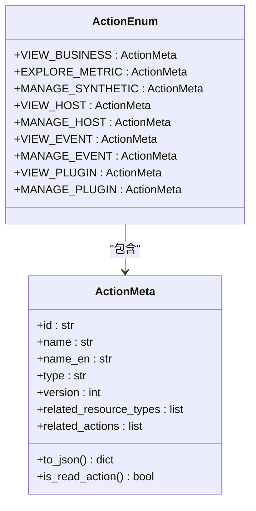
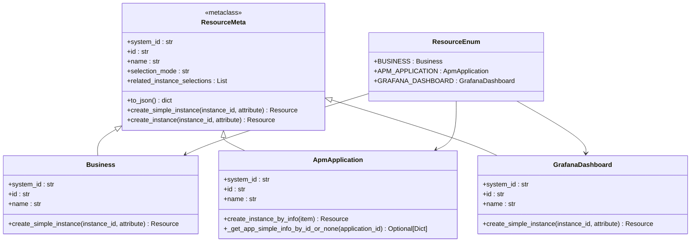
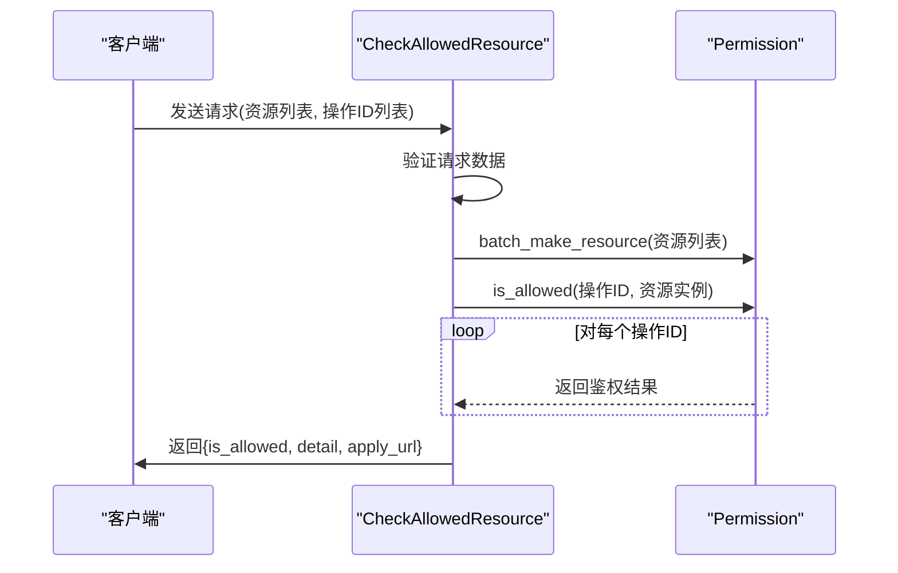
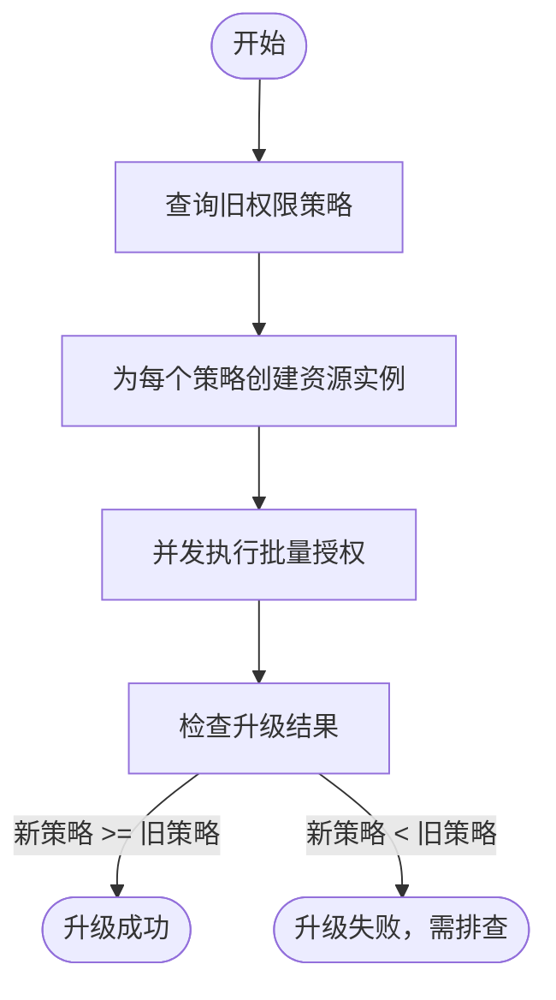
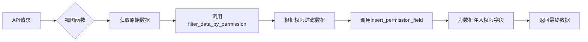

# 权限分配API

<cite>
**本文档引用的文件**   
- [action.py](file://bkmonitor/bkmonitor/iam/action.py)
- [resource.py](file://bkmonitor/bkmonitor/iam/resource.py)
- [iam_upgrade_action_v2.py](file://bkmonitor/bkmonitor/management/commands/iam_upgrade_action_v2.py)
- [resources.py](file://packages/monitor_web/iam/resources.py)
- [drf.py](file://bkmonitor/bkmonitor/iam/drf.py)
- [migrate.py](file://bkmonitor/bkmonitor/iam/migrate.py)
- [permission.py](file://bkmonitor/bkmonitor/iam/permission.py)
</cite>

## 目录
1. [简介](#简介)
2. [权限模型](#权限模型)
3. [权限分配模式](#权限分配模式)
4. [资源实例级权限分配](#资源实例级权限分配)
5. [批量权限分配与事务处理](#批量权限分配与事务处理)
6. [权限预览与冲突解决](#权限预览与冲突解决)
7. [权限有效期设置](#权限有效期设置)
8. [API集成与过滤机制](#api集成与过滤机制)
9. [总结](#总结)

## 简介
本文档详细介绍了蓝鲸监控平台的权限分配API，涵盖权限的授予、回收、查询等核心操作。文档深入解析了权限分配的三种模式：直接授权、角色授权和继承授权。同时，文档还阐述了资源实例级权限控制、批量分配的事务机制、权限冲突解决策略、权限预览功能以及权限有效期设置等高级特性，为开发者和系统管理员提供全面的技术参考。

## 权限模型
权限模型是整个权限系统的基础，由**操作（Action）**和**资源（Resource）**两个核心概念构成。操作定义了用户可以执行的具体行为，而资源则定义了这些行为所作用的对象。

### 操作定义
操作在`action.py`文件中通过`ActionEnum`类进行枚举定义。每个操作都包含一个唯一的ID、名称、类型（如"view"查看或"manage"管理）以及相关的资源类型。



**图例来源**
- [action.py](file://bkmonitor/bkmonitor/iam/action.py#L25-L199)

**本节来源**
- [action.py](file://bkmonitor/bkmonitor/iam/action.py#L25-L199)

### 资源定义
资源在`resource.py`文件中通过`ResourceEnum`类进行枚举定义。每个资源类型都关联一个具体的资源元类（如`Business`, `ApmApplication`），这些元类定义了资源的系统ID、唯一标识符以及如何创建资源实例。



**图例来源**
- [resource.py](file://bkmonitor/bkmonitor/iam/resource.py#L25-L199)

**本节来源**
- [resource.py](file://bkmonitor/bkmonitor/iam/resource.py#L25-L199)

## 权限分配模式
系统支持三种主要的权限分配模式，以满足不同场景下的需求。

### 直接授权
直接授权是最基础的模式，管理员直接将特定操作（Action）的权限授予给用户或用户组。例如，将`VIEW_HOST`（查看主机）权限直接分配给某个用户。

### 角色授权
角色授权通过引入“角色”概念来简化权限管理。首先定义一个角色（如“运维人员”），并为该角色配置一组权限（如`VIEW_HOST`, `MANAGE_HOST`, `VIEW_EVENT`）。然后，只需将用户添加到该角色中，用户便自动获得角色所包含的所有权限。这种方式极大地提高了权限管理的效率和可维护性。

### 继承授权
继承授权基于资源的层级结构实现。例如，一个用户对“业务”（Business）拥有`VIEW_BUSINESS`权限，那么他通常也自动拥有查看该业务下所有“APM应用”（ApmApplication）的权限。这种权限的传递关系在`ActionMeta`的`related_actions`字段中定义，例如`EXPLORE_METRIC`操作的`related_actions`包含了`VIEW_BUSINESS.id`，表明执行指标检索的前提是拥有业务访问权限。

## 资源实例级权限分配
系统支持精确到具体资源实例的权限控制，允许管理员为不同的用户分配对不同监控对象的访问权限。

### 接口设计
`resources.py`文件中的`CheckAllowedResource`类提供了核心的权限检查接口。该接口接收一个资源列表（包含资源类型和实例ID）和一个操作ID列表，返回用户对这些资源是否拥有相应权限的详细结果。



**图例来源**
- [resources.py](file://packages/monitor_web/iam/resources.py#L100-L199)

**本节来源**
- [resources.py](file://packages/monitor_web/iam/resources.py#L100-L199)

### 实现原理
当调用`CheckAllowedResource`时，系统会：
1.  **解析资源**：根据请求中的资源类型（如`apm_application`）和实例ID（如`app_123`），调用`ResourceEnum`中对应资源元类的`create_instance`方法，创建出具体的资源实例对象。
2.  **批量鉴权**：使用`Permission`类的`is_allowed`或`batch_is_allowed`方法，向底层的IAM（身份与访问管理）服务发起鉴权请求。
3.  **返回结果**：将鉴权结果结构化返回，包括总体是否允许、每个操作的具体结果以及申请权限的链接。

## 批量权限分配与事务处理
系统提供了高效的批量权限分配功能，并通过命令行工具确保操作的原子性和一致性。

### 批量分配接口
`iam_upgrade_action_v2.py`文件中的`Command`类实现了批量授权的核心逻辑。它通过`ThreadPool`（线程池）并发处理大量的授权请求，显著提升了处理效率。

### 事务处理机制
虽然底层IAM服务的`batch_path_authorization` API本身可能不保证跨多个请求的事务性，但该脚本通过以下方式实现了准事务性的效果：
1.  **全量查询**：在执行批量授权前，脚本会先通过`query_polices`方法查询出所有旧版本的权限策略。
2.  **分批处理**：使用`grant_resource_chunked`方法将大批次的授权请求拆分成小批次（每批最多1000个路径），以避免单个请求过大。
3.  **结果验证**：在所有授权操作完成后，通过`check_upgrade_polices`方法再次查询新版本的权限策略数量，并与旧版本进行对比。如果新策略数量少于旧策略，则认为升级失败，需要人工介入排查。



**图例来源**
- [iam_upgrade_action_v2.py](file://bkmonitor/bkmonitor/management/commands/iam_upgrade_action_v2.py#L0-L437)

**本节来源**
- [iam_upgrade_action_v2.py](file://bkmonitor/bkmonitor/management/commands/iam_upgrade_action_v2.py#L0-L437)

## 权限预览与冲突解决
系统提供了权限预览功能，并定义了清晰的权限冲突解决规则。

### 权限预览
`resources.py`中的`GetAuthorityApplyInfoResource`接口允许用户在正式申请权限前，预览申请这些权限后所能访问的资源范围。该接口调用`Permission`类的`get_apply_data`方法，生成一个包含权限信息和申请链接的结构化数据。

### 权限冲突解决
当用户通过多种途径（如直接授权、多个角色）获得权限时，系统采用**累加模式**解决冲突。即，用户最终拥有的权限是所有途径所授予权限的并集。例如，用户A通过角色1获得了`VIEW_HOST`权限，又通过直接授权获得了`MANAGE_HOST`权限，那么用户A最终同时拥有查看和管理主机的权限。这种模式确保了权限的最小化原则，即用户只能获得明确授予的权限。

## 权限有效期设置
系统支持为权限设置有效期，实现临时权限和定时生效/失效的功能。

### 有效期字段
在权限策略的定义中，存在`expired_at`字段，它是一个时间戳，表示权限的过期时间。当`expired_at`小于当前时间时，该权限自动失效。

### 定时生效
虽然代码中没有直接体现“定时生效”的字段，但可以通过在未来的某个时间点创建权限策略来实现此功能。例如，为一个用户创建一个`expired_at`为2024年12月31日的权限，该权限从创建之时起即刻生效，直到年底自动失效。

### 临时权限
临时权限的实现正是基于`expired_at`字段。管理员在授予权限时，可以指定一个较短的有效期，从而实现临时访问的目的。`ApiBatchAuthRequest`类明确支持`expired_at`参数，确保了该功能的可编程性。

**本节来源**
- [iam_upgrade_action_v2.py](file://bkmonitor/bkmonitor/management/commands/iam_upgrade_action_v2.py#L250-L255)
- [migrate.py](file://bkmonitor/bkmonitor/iam/migrate.py#L25-L30)

## API集成与过滤机制
为了将权限控制无缝集成到RESTful API中，系统提供了基于Django REST framework的装饰器和工具函数。

### DRF权限装饰器
`drf.py`文件定义了一系列权限类，如`IAMPermission`、`BusinessActionPermission`等。这些类继承自`rest_framework.permissions.BasePermission`，可以作为装饰器直接应用在API视图上。

```python
class MyView(APIView):
    permission_classes = [ViewBusinessPermission] # 检查用户是否有业务访问权限
```

### 数据过滤与权限注入
`drf.py`还提供了`insert_permission_field`和`filter_data_by_permission`两个关键函数：
-   **`insert_permission_field`**：在API返回数据后，自动为每个数据项注入一个`permission`字段，该字段是一个字典，标明了当前用户对该数据项的各项操作权限（True/False）。
-   **`filter_data_by_permission`**：根据用户的权限，对返回的数据列表进行过滤，只返回用户有权访问的数据项。



**图例来源**
- [drf.py](file://bkmonitor/bkmonitor/iam/drf.py#L0-L338)

**本节来源**
- [drf.py](file://bkmonitor/bkmonitor/iam/drf.py#L0-L338)

## 总结
蓝鲸监控平台的权限分配API设计精巧，功能全面。它基于操作和资源的模型，支持直接、角色和继承三种授权模式，实现了细粒度的资源实例级控制。通过批量处理和结果验证机制，保证了大规模权限变更的可靠性和一致性。同时，系统还提供了权限预览、有效期设置和API集成等高级功能，为构建一个安全、灵活、易用的监控系统提供了坚实的权限基础。