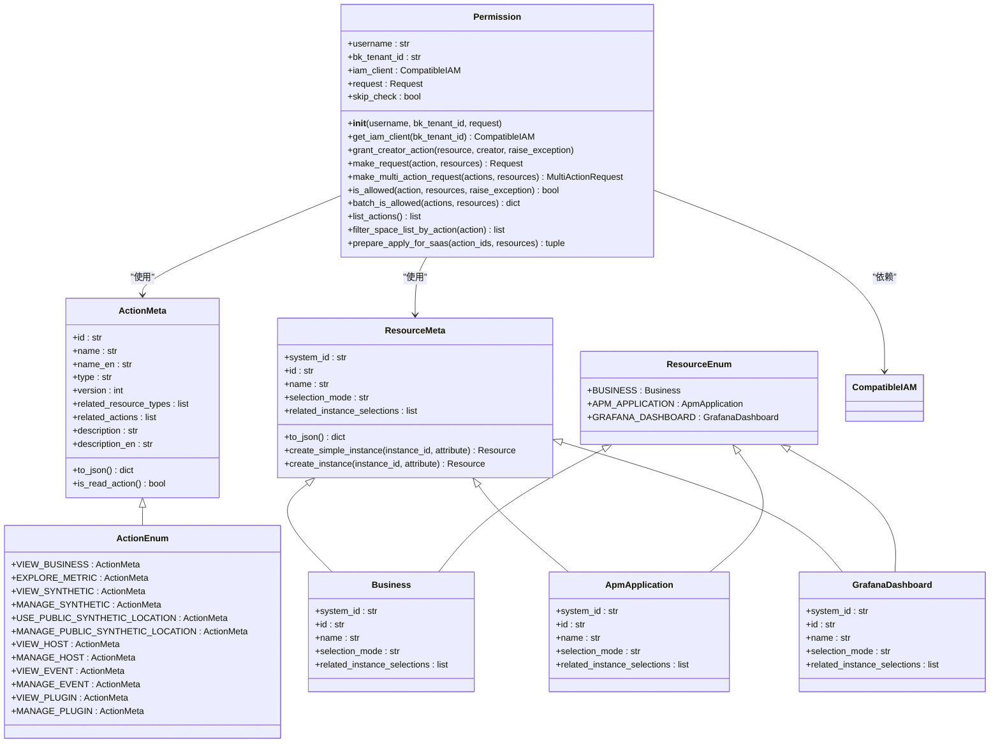
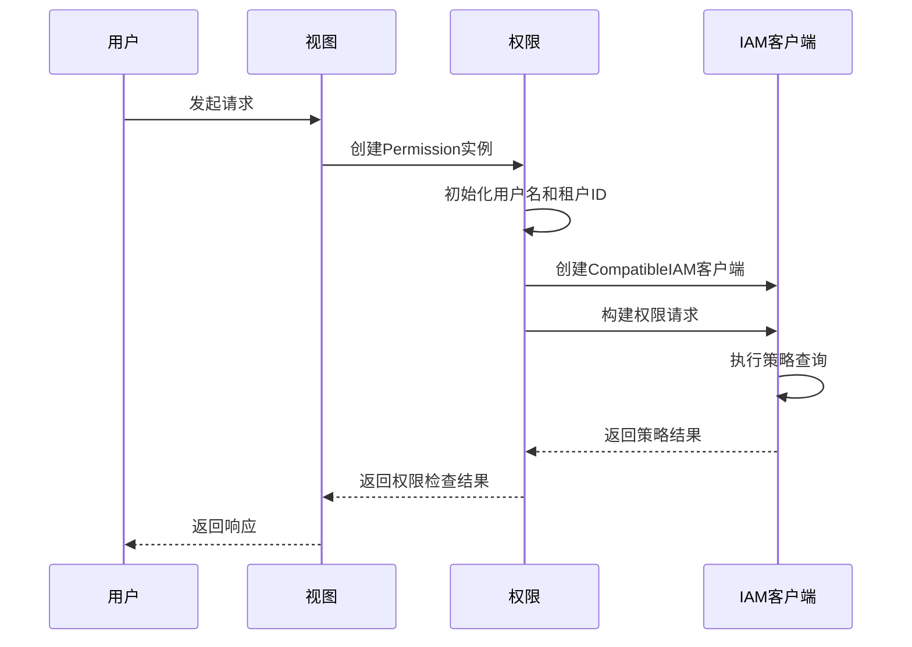
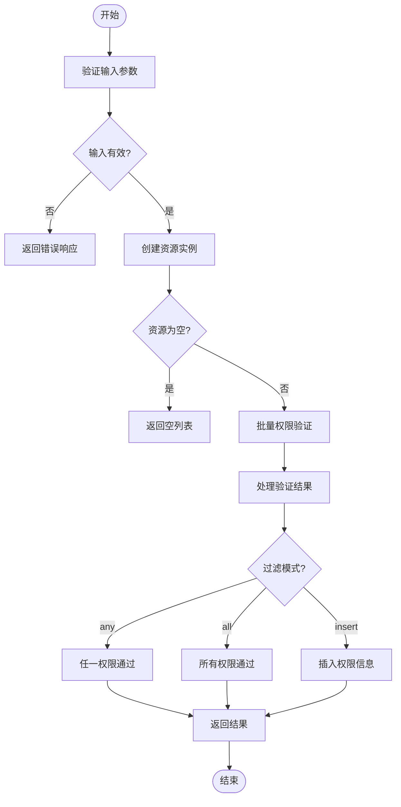
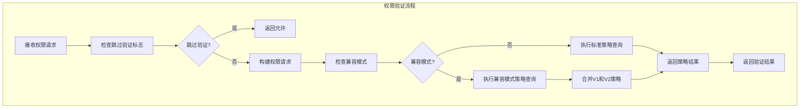
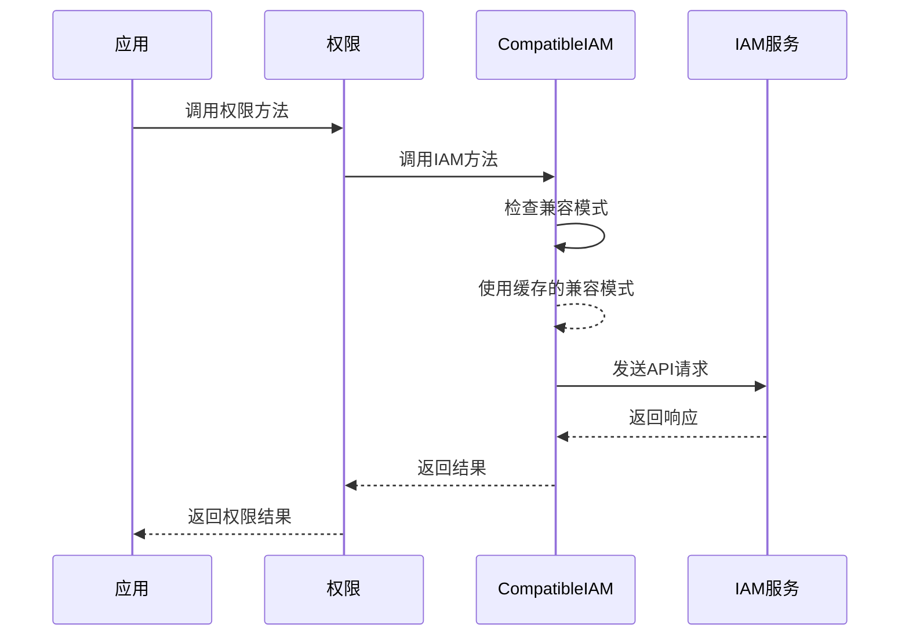

# 权限管理API

<cite>
**本文档引用的文件**   
- [permission.py](file://bkmonitor/bkmonitor/iam/permission.py)
- [action.py](file://bkmonitor/bkmonitor/iam/action.py)
- [resource.py](file://bkmonitor/bkmonitor/iam/resource.py)
- [drf.py](file://bkmonitor/bkmonitor/iam/drf.py)
- [compatible.py](file://bkmonitor/bkmonitor/iam/compatible.py)
- [__init__.py](file://bkmonitor/bkmonitor/iam/__init__.py)
</cite>

## 目录
1. [简介](#简介)
2. [权限模型设计](#权限模型设计)
3. [用户角色分配接口](#用户角色分配接口)
4. [权限查询接口](#权限查询接口)
5. [权限验证接口](#权限验证接口)
6. [权限审计功能](#权限审计功能)
7. [外部IAM系统集成](#外部iam系统集成)

## 简介
权限管理API是蓝鲸监控平台的核心安全组件，负责管理用户、角色和权限的访问控制。该系统基于IAM（身份与访问管理）框架构建，实现了细粒度的资源访问控制。API提供了完整的权限管理功能，包括权限模型定义、用户角色分配、权限查询、权限验证和审计功能。系统通过与外部IAM服务集成，实现了企业级的身份认证和授权管理。

## 权限模型设计

权限模型是权限管理API的核心，它定义了系统中的资源类型、操作类型和访问控制策略。模型采用基于角色的访问控制（RBAC）机制，并支持资源实例级别的细粒度权限控制。

**图示来源**
- [action.py](file://bkmonitor/bkmonitor/iam/action.py#L25-L200)
- [resource.py](file://bkmonitor/bkmonitor/iam/resource.py#L25-L200)
- [permission.py](file://bkmonitor/bkmonitor/iam/permission.py#L25-L100)

**本节来源**
- [action.py](file://bkmonitor/bkmonitor/iam/action.py#L1-L621)
- [resource.py](file://bkmonitor/bkmonitor/iam/resource.py#L1-L214)
- [permission.py](file://bkmonitor/bkmonitor/iam/permission.py#L1-L518)

### 资源类型
系统定义了多种资源类型，每种资源类型代表一个可被保护的实体。主要资源类型包括：

- **业务（Business）**：代表监控平台中的业务空间，是其他资源的容器。
- **APM应用（ApmApplication）**：代表应用性能监控中的应用实例。
- **Grafana仪表盘（GrafanaDashboard）**：代表可视化仪表盘资源。

资源类型通过`ResourceMeta`基类定义，包含系统ID、资源ID、名称和选择模式等属性。子类通过重写`create_instance`方法来实现特定资源实例的创建逻辑。

### 操作类型
操作类型定义了用户可以在资源上执行的动作。每个操作都有唯一的ID、名称、类型（查看或管理）和版本。操作类型通过`ActionMeta`类定义，主要特性包括：

- **操作继承**：操作可以定义相关操作（`related_actions`），形成权限继承关系。例如，拥有"管理"权限的用户自动拥有"查看"权限。
- **资源关联**：操作可以关联一个或多个资源类型（`related_resource_types`），定义该操作适用的资源。
- **操作分类**：操作分为"view"（查看）和"manage"（管理）两种类型，通过`is_read_action`方法判断。

### 访问控制策略
访问控制策略基于"主体-操作-资源"模型实现。系统通过`Permission`类封装了完整的权限验证逻辑：

1. **权限检查**：`is_allowed`方法检查用户是否具有执行特定操作的权限。
2. **批量权限检查**：`batch_is_allowed`方法支持对多个资源进行批量权限验证。
3. **权限申请**：当用户缺少权限时，系统可以生成权限申请链接，引导用户申请所需权限。

## 用户角色分配接口

用户角色分配接口支持将用户分配到特定角色，并支持批量操作和继承机制。系统通过`IAMPermission`类和相关的DRF权限装饰器实现角色分配功能。

**图示来源**
- [permission.py](file://bkmonitor/bkmonitor/iam/permission.py#L100-L200)
- [drf.py](file://bkmonitor/bkmonitor/iam/drf.py#L25-L100)

**本节来源**
- [drf.py](file://bkmonitor/bkmonitor/iam/drf.py#L1-L339)
- [permission.py](file://bkmonitor/bkmonitor/iam/permission.py#L1-L518)

### 角色分配实现
系统通过Django REST Framework的权限系统实现角色分配。核心类包括：

- **IAMPermission**：基础权限类，检查用户是否具有执行特定操作的权限。
- **BusinessActionPermission**：业务动作权限类，自动将请求中的业务ID转换为资源实例。
- **InstanceActionPermission**：实例动作权限类，检查用户对特定资源实例的权限。
- **InstanceActionForDataPermission**：数据权限类，从请求数据中提取实例ID进行权限检查。

### 批量操作支持
系统支持批量用户角色分配操作，通过以下机制实现：

1. **批量资源创建**：`batch_make_resource`方法支持从资源定义列表批量创建资源实例。
2. **批量权限检查**：`batch_is_allowed`方法支持对多个资源进行批量权限验证。
3. **并发处理**：在权限升级命令中使用线程池（`ThreadPool`）实现并发授权，提高批量操作性能。

### 继承机制
权限系统实现了多层次的继承机制：

- **操作继承**：通过`related_actions`属性实现操作间的权限继承。
- **角色继承**：通过权限装饰器的组合使用实现角色间的权限继承。
- **资源继承**：通过资源路径（`_bk_iam_path_`）实现资源层级的权限继承。

## 权限查询接口

权限查询接口提供了多维度的过滤能力，支持按用户、按角色、按资源等多种查询方式。系统通过灵活的查询参数和过滤模式实现复杂的权限查询需求。

**图示来源**
- [drf.py](file://bkmonitor/bkmonitor/iam/drf.py#L282-L337)
- [permission.py](file://bkmonitor/bkmonitor/iam/permission.py#L300-L400)

**本节来源**
- [drf.py](file://bkmonitor/bkmonitor/iam/drf.py#L282-L337)
- [permission.py](file://bkmonitor/bkmonitor/iam/permission.py#L300-L400)

### 多维度过滤能力
权限查询接口支持以下查询方式：

- **按用户查询**：指定用户名进行权限检查，用于检查特定用户的权限。
- **按角色查询**：通过角色关联的权限进行查询，用于检查角色的权限范围。
- **按资源查询**：指定资源列表进行权限检查，用于检查用户对特定资源的访问权限。

### 查询模式
系统提供了三种查询模式：

- **any模式**：只要有一个权限通过就返回该数据项。
- **all模式**：所有权限都通过才返回该数据项。
- **insert模式**：在返回数据中插入权限信息，但不进行数据过滤。

### 查询实现
权限查询通过`filter_data_by_permission`函数实现，主要步骤包括：

1. **参数验证**：验证输入数据和查询参数的有效性。
2. **资源创建**：根据资源元数据批量创建资源实例。
3. **批量验证**：调用`batch_is_allowed`方法进行批量权限验证。
4. **结果处理**：根据查询模式处理验证结果，返回过滤后的数据或插入权限信息。

## 权限验证接口

权限验证接口是系统性能的关键，通过多种优化策略和缓存机制确保高效的权限检查。系统在保证安全性的同时，最大限度地提高了验证性能。

**图示来源**
- [compatible.py](file://bkmonitor/bkmonitor/iam/compatible.py#L65-L97)
- [permission.py](file://bkmonitor/bkmonitor/iam/permission.py#L200-L300)

**本节来源**
- [compatible.py](file://bkmonitor/bkmonitor/iam/compatible.py#L1-L158)
- [permission.py](file://bkmonitor/bkmonitor/iam/permission.py#L200-L300)

### 性能优化策略
权限验证接口采用了多种性能优化策略：

- **批量验证**：`batch_is_allowed`方法支持批量资源的权限验证，减少网络请求次数。
- **并发处理**：在权限升级等批量操作中使用线程池实现并发处理，提高执行效率。
- **请求优化**：在批量鉴权时，不向服务端传递资源信息，获取所有策略后在客户端进行计算。

### 缓存机制
系统实现了多层次的缓存机制：

- **内存缓存**：`ApmApplication`资源类使用`lru_cache_with_ttl`装饰器对应用概要信息进行内存缓存，缓存时间为60分钟。
- **类级缓存**：`CompatibleIAM`类使用类属性`__compatibility_mode`缓存兼容模式状态，避免重复查询数据库。
- **连接复用**：IAM客户端实例在`Permission`类中被复用，避免重复创建连接。

### 兼容性处理
系统通过`CompatibleIAM`类实现V1和V2版本的兼容：

- **策略合并**：在兼容模式下，同时查询V1和V2版本的策略，并将结果合并。
- **字段转换**：自动将V1版本的"biz"字段转换为V2版本的"space"字段。
- **路径替换**：在策略表达式中将"biz"路径替换为"space"路径。

## 权限审计功能

权限审计功能记录了权限变更历史和访问日志，为系统安全提供了重要的审计支持。系统通过多种机制确保权限操作的可追溯性和安全性。

**本节来源**
- [permission.py](file://bkmonitor/bkmonitor/iam/permission.py#L400-L500)
- [drf.py](file://bkmonitor/bkmonitor/iam/drf.py#L300-L337)

### 权限变更历史
系统通过以下方式记录权限变更：

- **权限申请记录**：当用户缺少权限时，系统生成权限申请链接，记录申请的权限和资源。
- **权限授予记录**：`grant_creator_action`方法在授予创建者权限时记录操作日志。
- **批量操作日志**：在批量权限升级命令中，详细记录每个资源的授权进度和结果。

### 访问日志
系统通过多种方式记录访问日志：

- **操作日志**：在权限检查失败时记录异常日志，包含请求的详细信息。
- **调试日志**：在兼容模式下记录详细的请求和响应信息，便于问题排查。
- **进度日志**：在长时间运行的权限操作中定期输出进度信息。

### 审计实现
权限审计功能主要通过以下机制实现：

- **日志记录**：使用Python标准日志模块记录各种操作和异常。
- **配置管理**：通过`GlobalConfig`模型管理审计相关的配置，如兼容模式开关。
- **异常处理**：在权限检查失败时抛出特定异常，并记录详细的错误信息。

## 外部IAM系统集成

权限管理API与外部IAM系统深度集成，通过兼容性封装和同步机制实现无缝的身份认证和授权管理。系统支持与蓝鲸平台的IAM服务进行双向同步。

**图示来源**
- [compatible.py](file://bkmonitor/bkmonitor/iam/compatible.py#L34-L67)
- [permission.py](file://bkmonitor/bkmonitor/iam/permission.py#L50-L100)

**本节来源**
- [compatible.py](file://bkmonitor/bkmonitor/iam/compatible.py#L1-L158)
- [permission.py](file://bkmonitor/bkmonitor/iam/permission.py#L1-L518)

### 集成方式
系统通过`CompatibleIAM`类与外部IAM系统集成：

- **客户端封装**：`CompatibleIAM`继承自IAM SDK的`IAM`类，重写关键方法实现兼容性处理。
- **API代理**：所有IAM API调用都通过`CompatibleIAM`客户端进行，实现统一的兼容性处理。
- **配置驱动**：通过`GlobalConfig`模型中的"IAM_V1_COMPATIBLE"配置项控制兼容模式的开启和关闭。

### 同步机制
系统实现了与外部IAM系统的同步机制：

- **模型同步**：通过`setup_meta`方法初始化权限中心的系统、资源和动作元数据。
- **策略同步**：在兼容模式下，同时查询V1和V2版本的策略，确保权限的一致性。
- **自动升级**：提供`iam_upgrade_action_v2`管理命令，用于将V1版本的权限策略升级到V2版本。

### 集成优势
与外部IAM系统的集成带来了以下优势：

- **无缝迁移**：支持从V1版本平滑迁移到V2版本，不影响现有用户的权限。
- **统一管理**：与蓝鲸平台的其他系统共享同一套权限管理体系。
- **高可用性**：依赖企业级IAM服务，确保权限系统的高可用性和可靠性。