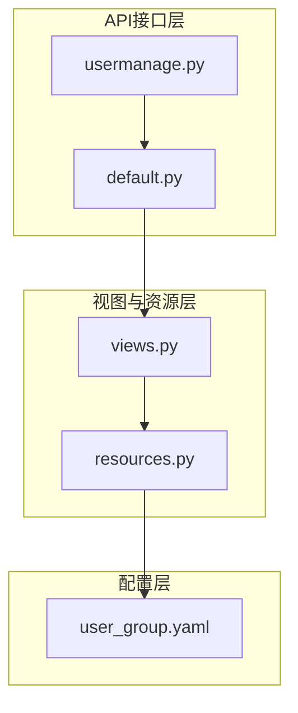
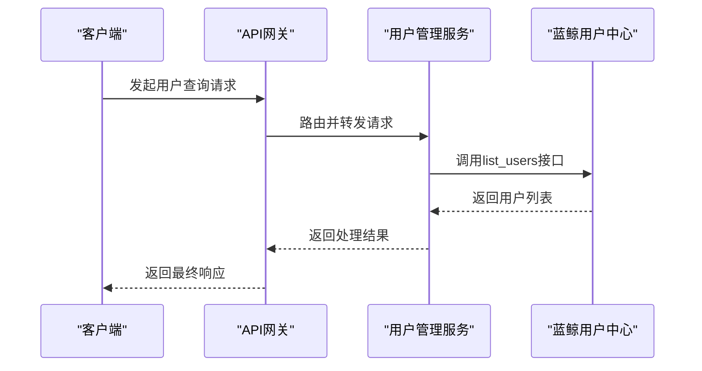
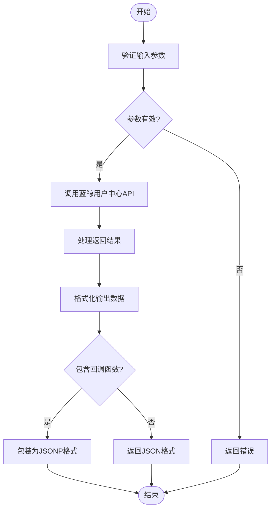
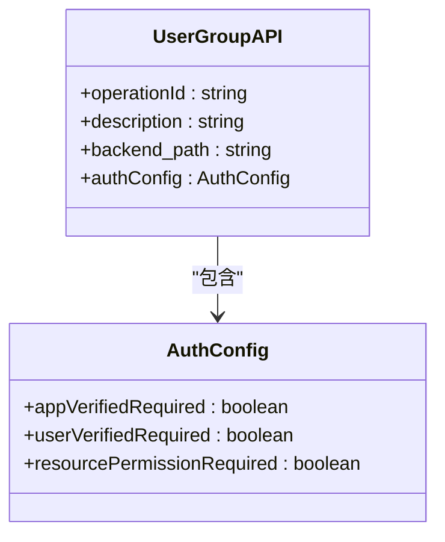
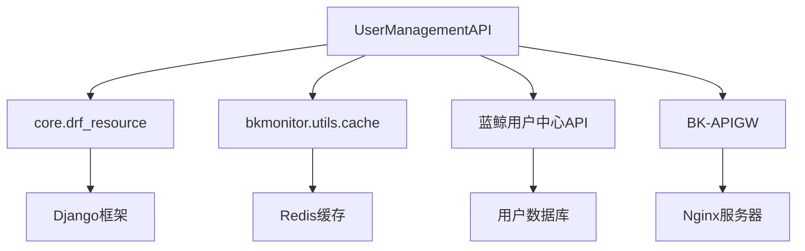

# 用户管理API

<cite>
**本文档引用的文件**
- [usermanage.py](file://bkmonitor/blueking/component/apis/usermanage.py)
- [collections.py](file://bkmonitor/blueking/component/collections.py)
- [default.py](file://bkmonitor/api/bk_login/default.py)
- [views.py](file://bkmonitor/packages/monitor_web/commons/user/views.py)
- [resources.py](file://bkmonitor/packages/monitor_web/commons/user/resources.py)
- [user_group.yaml](file://bkmonitor/support-files/apigw/resources/external/app/user_group.yaml)
</cite>

## 目录
1. [简介](#简介)
2. [项目结构](#项目结构)
3. [核心组件](#核心组件)
4. [架构概览](#架构概览)
5. [详细组件分析](#详细组件分析)
6. [依赖分析](#依赖分析)
7. [性能考虑](#性能考虑)
8. [故障排除指南](#故障排除指南)
9. [结论](#结论)

## 简介
本文档详细描述了蓝鲸监控平台中的用户管理API，涵盖用户生命周期管理、用户搜索、批量操作、状态管理以及用户组管理等核心功能。API通过蓝鲸组件网关（BK-APIGW）对外提供服务，实现了与外部用户系统的集成和数据同步。系统设计注重性能优化和数据一致性，支持大规模用户数据的高效处理。

## 项目结构
用户管理功能分散在多个模块中，主要涉及`blueking`、`api`和`packages`三个顶级目录。`blueking`目录下的`component/apis/usermanage.py`文件定义了用户管理API的客户端接口，而`api/bk_login/default.py`则实现了具体的API逻辑。前端视图和资源定义位于`packages/monitor_web/commons/user/`目录下。

**图示来源**
- [usermanage.py](file://bkmonitor/blueking/component/apis/usermanage.py)
- [default.py](file://bkmonitor/api/bk_login/default.py)
- [views.py](file://bkmonitor/packages/monitor_web/commons/user/views.py)

## 核心组件
用户管理API的核心组件包括用户查询、用户组管理和外部系统集成。`CollectionsUSERMANAGE`类封装了所有用户管理API的调用接口，通过`ComponentAPI`对象定义了如`list_users`、`retrieve_user`等具体操作。`GetAllUserResource`和`ListDepartmentsResource`类则实现了与蓝鲸用户中心的通信逻辑，负责获取用户和部门的详细信息。

**组件来源**
- [usermanage.py](file://bkmonitor/blueking/component/apis/usermanage.py#L32-L51)
- [default.py](file://bkmonitor/api/bk_login/default.py#L77-L199)

## 架构概览
用户管理API采用分层架构，从上至下分为API网关层、业务逻辑层和数据访问层。API网关层负责请求的路由和认证，业务逻辑层处理具体的用户管理操作，数据访问层则通过调用蓝鲸用户中心的API获取用户数据。整个流程通过`api.bk_login`模块进行封装，确保了与外部系统的解耦。

**图示来源**
- [usermanage.py](file://bkmonitor/blueking/component/apis/usermanage.py)
- [default.py](file://bkmonitor/api/bk_login/default.py)

## 详细组件分析

### 用户查询组件分析
用户查询功能通过`UserViewSet`类实现，支持按关键字、分页和字段过滤等条件进行查询。`RequestSerializer`定义了查询参数的结构，包括`fuzzy_lookups`（模糊查询）、`page`（页码）和`fields`（返回字段）等。实际的数据获取通过调用`api.bk_login.get_all_user`方法完成，该方法封装了与蓝鲸用户中心的HTTP通信。

**图示来源**
- [views.py](file://bkmonitor/packages/monitor_web/commons/user/views.py#L28-L62)
- [default.py](file://bkmonitor/api/bk_login/default.py#L77-L85)

### 用户组管理组件分析
用户组管理API通过YAML配置文件定义，支持搜索、详情查询、保存和删除等操作。每个操作都映射到后端的特定路径，如`/api/v4/user_group/search/`用于搜索用户组。API网关配置了详细的认证和权限控制策略，确保只有经过验证的应用和用户才能访问这些接口。

**图示来源**
- [user_group.yaml](file://bkmonitor/support-files/apigw/resources/external/app/user_group.yaml)
- [collections.py](file://bkmonitor/blueking/component/collections.py)

## 依赖分析
用户管理API依赖于多个内部和外部系统。内部依赖包括`core.drf_resource`模块提供的资源框架和`bkmonitor.utils.cache`模块提供的缓存功能。外部依赖主要是蓝鲸用户中心（BK-User），通过HTTP API进行用户数据的同步。此外，系统还依赖于API网关进行请求的路由和安全控制。

**图示来源**
- [collections.py](file://bkmonitor/blueking/component/collections.py)
- [default.py](file://bkmonitor/api/bk_login/default.py)

## 性能考虑
为了提高大规模用户数据查询的性能，系统采用了多种优化策略。首先，通过`batch_request`工具函数实现分批请求，避免单次请求数据量过大。其次，利用Redis缓存频繁访问的用户和部门数据，减少对后端API的调用次数。最后，API网关层也配置了缓存策略，进一步提升了响应速度。

**性能来源**
- [default.py](file://bkmonitor/api/bk_login/default.py#L112-L148)
- [resources.py](file://bkmonitor/packages/monitor_web/commons/user/resources.py)

## 故障排除指南
当用户管理API出现故障时，应首先检查API网关的日志，确认请求是否成功路由到后端服务。其次，查看后端服务的日志，确认与蓝鲸用户中心的通信是否正常。常见的问题包括认证失败、网络超时和数据格式错误。对于缓存相关的问题，可以尝试清除Redis缓存后重试。

**故障排除来源**
- [default.py](file://bkmonitor/api/bk_login/default.py)
- [usermanage.py](file://bkmonitor/blueking/component/apis/usermanage.py)

## 结论
用户管理API是蓝鲸监控平台的重要组成部分，提供了完整的用户生命周期管理功能。通过与蓝鲸用户中心的深度集成，实现了用户数据的统一管理和高效查询。系统的分层架构和性能优化策略确保了在高并发场景下的稳定性和响应速度。未来可以考虑增加更多的用户属性和更灵活的搜索条件，以满足更复杂的业务需求。