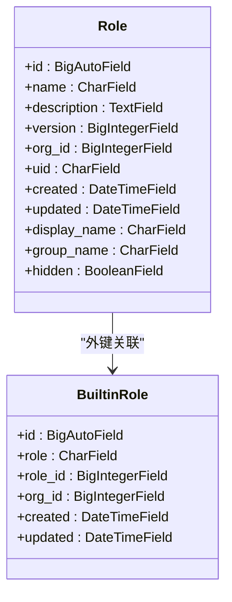
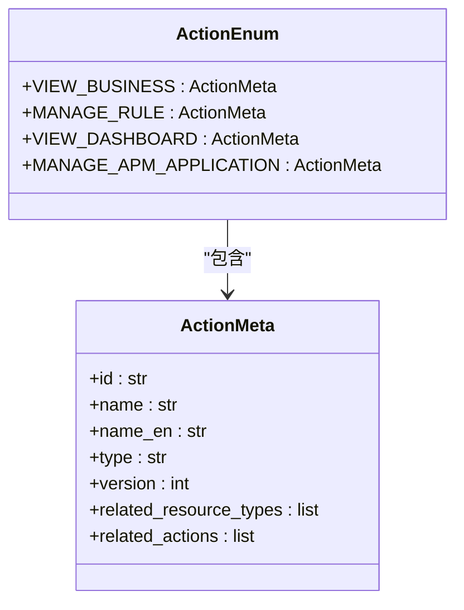
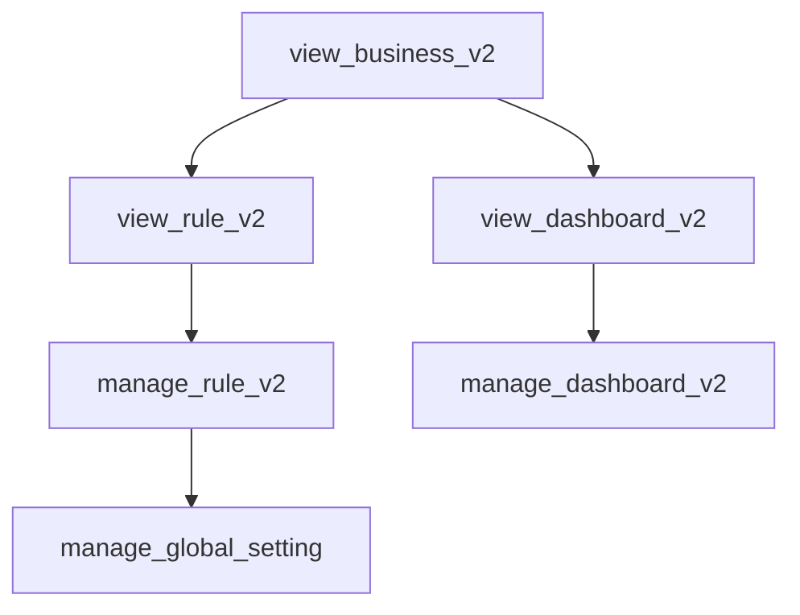
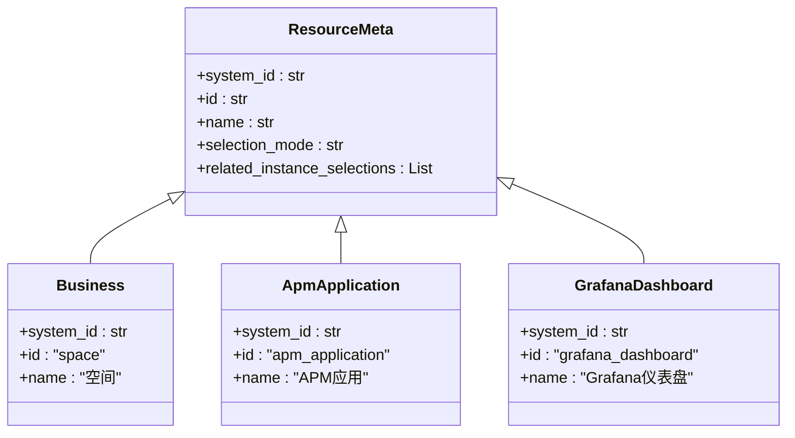
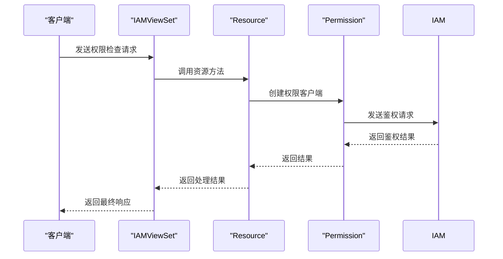
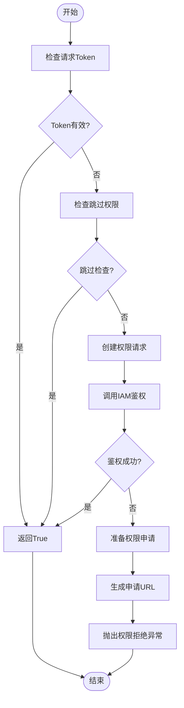
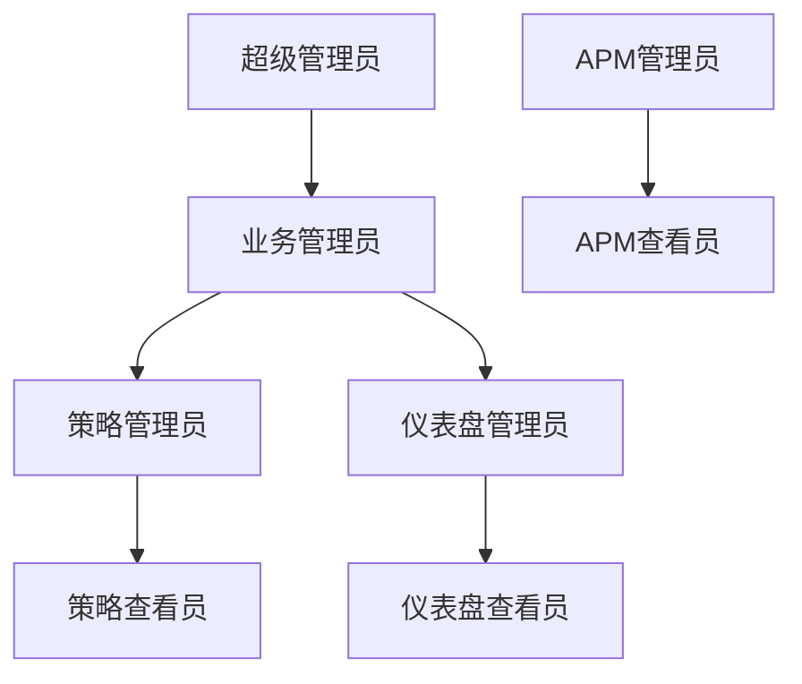
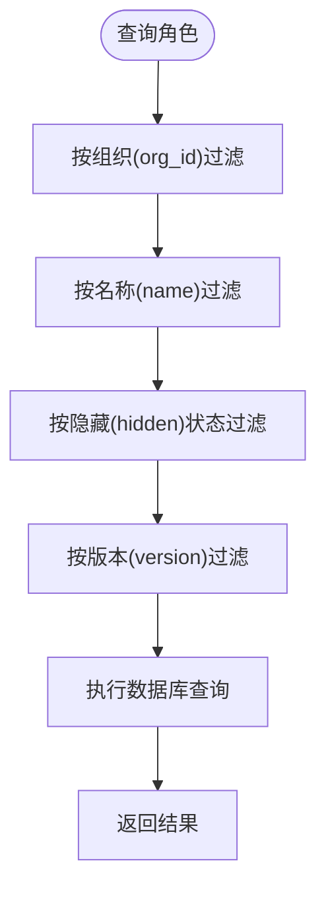
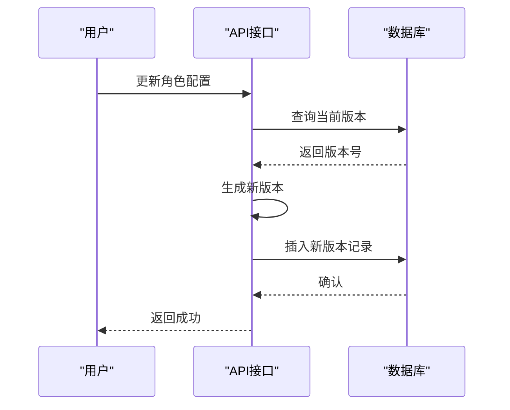
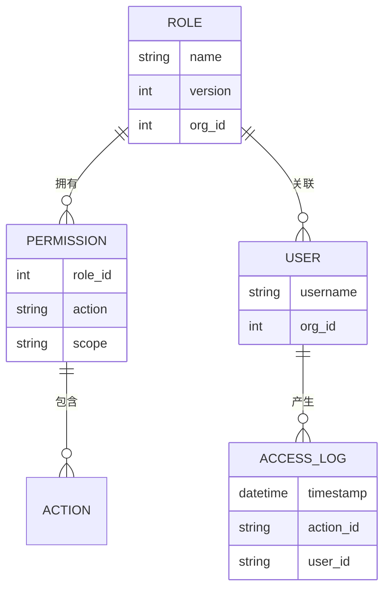

# 角色管理API

<cite>
**本文档引用的文件**   
- [models.py](file://bkmonitor/bk_dataview/models.py#L282-L304)
- [permission.py](file://bkmonitor/bkmonitor/iam/permission.py#L199-L517)
- [action.py](file://bkmonitor/bkmonitor/iam/action.py#L0-L620)
- [resource.py](file://bkmonitor/bkmonitor/iam/resource.py#L0-L213)
- [views.py](file://bkmonitor/packages/monitor_web/iam/views.py#L0-L377)
- [resources.py](file://bkmonitor/packages/monitor_web/iam/resources.py#L0-L620)
</cite>

## 目录
1. [简介](#简介)
2. [核心数据模型](#核心数据模型)
3. [权限与动作管理](#权限与动作管理)
4. [资源定义与管理](#资源定义与管理)
5. [API接口与视图实现](#api接口与视图实现)
6. [权限检查流程](#权限检查流程)
7. [角色继承与层级结构](#角色继承与层级结构)
8. [角色模板与预定义角色](#角色模板与预定义角色)
9. [角色查询与多维度过滤](#角色查询与多维度过滤)
10. [角色版本管理](#角色版本管理)
11. [角色使用统计](#角色使用统计)

## 简介
本文档详细描述了蓝鲸监控平台中的角色管理API，涵盖角色的创建、配置、查询和删除功能。系统通过IAM（身份与访问管理）框架实现细粒度的权限控制，支持角色继承、权限分配、版本追踪和使用统计。角色与业务（空间）关联，通过权限中心进行统一鉴权，确保系统安全性和灵活性。

## 核心数据模型
角色管理的核心数据模型定义在`bk_dataview/models.py`中，主要包括`Role`和`BuiltinRole`两个模型。



**图示来源**
- [models.py](file://bkmonitor/bk_dataview/models.py#L282-L304)

**本节来源**
- [models.py](file://bkmonitor/bk_dataview/models.py#L282-L304)

### 模型字段说明
- **id**: 主键，自增
- **name**: 角色名称，唯一索引
- **description**: 角色描述
- **version**: 版本号，用于变更追踪
- **org_id**: 组织ID，关联业务
- **uid**: 唯一标识符
- **created/updated**: 创建和更新时间戳
- **display_name**: 显示名称
- **group_name**: 组名称，用于分类
- **hidden**: 是否隐藏

## 权限与动作管理
权限与动作管理由`iam/action.py`文件定义，通过`ActionMeta`类和`ActionEnum`枚举实现。



**图示来源**
- [action.py](file://bkmonitor/bkmonitor/iam/action.py#L0-L620)

**本节来源**
- [action.py](file://bkmonitor/bkmonitor/iam/action.py#L0-L620)

### 动作类型
系统定义了多种动作类型，主要分为查看(view)和管理(manage)两类：
- **业务访问**: `view_business_v2`
- **策略管理**: `manage_rule_v2`
- **仪表盘管理**: `manage_dashboard_v2`
- **APM应用管理**: `manage_apm_application_v2`
- **全局配置**: `manage_global_setting`

### 动作继承关系
动作之间存在继承关系，例如管理权限通常包含查看权限：


**图示来源**
- [action.py](file://bkmonitor/bkmonitor/iam/action.py#L0-L620)

## 资源定义与管理
资源定义在`iam/resource.py`文件中，通过`ResourceMeta`基类和具体资源类实现。



**图示来源**
- [resource.py](file://bkmonitor/bkmonitor/iam/resource.py#L0-L213)

**本节来源**
- [resource.py](file://bkmonitor/bkmonitor/iam/resource.py#L0-L213)

### 资源类型
- **Business (空间)**: 代表CMDB业务，是权限的基本单元
- **ApmApplication (APM应用)**: 代表APM监控应用
- **GrafanaDashboard (仪表盘)**: 代表Grafana仪表盘实例

## API接口与视图实现
API接口在`packages/monitor_web/iam/views.py`和`resources.py`中定义，使用DRF Resource框架。



**图示来源**
- [views.py](file://bkmonitor/packages/monitor_web/iam/views.py#L0-L377)
- [resources.py](file://bkmonitor/packages/monitor_web/iam/resources.py#L0-L620)

**本节来源**
- [views.py](file://bkmonitor/packages/monitor_web/iam/views.py#L0-L377)
- [resources.py](file://bkmonitor/packages/monitor_web/iam/resources.py#L0-L620)

### 主要API端点
| 端点 | 方法 | 功能 |
|------|------|------|
| get_authority_meta | GET | 获取权限元数据 |
| check_allowed_by_action_ids | POST | 检查动作权限 |
| get_authority_detail | POST | 获取权限详情 |
| get_authority_apply_info | POST | 获取权限申请信息 |

## 权限检查流程
权限检查流程由`Permission`类实现，包含缓存、异常处理和申请URL生成。



**图示来源**
- [permission.py](file://bkmonitor/bkmonitor/iam/permission.py#L199-L517)

**本节来源**
- [permission.py](file://bkmonitor/bkmonitor/iam/permission.py#L199-L517)

## 角色继承与层级结构
系统通过动作的`related_actions`字段实现角色继承机制。当一个角色拥有管理权限时，自动继承相应的查看权限。



**图示来源**
- [action.py](file://bkmonitor/bkmonitor/iam/action.py#L0-L620)

**本节来源**
- [action.py](file://bkmonitor/bkmonitor/iam/action.py#L0-L620)

## 角色模板与预定义角色
系统提供预定义的角色模板，通过`MINI_ACTION_IDS`、`ADMIN_ACTION_IDS`等常量定义。

```python
# 默认最小监控功能权限
MINI_ACTION_IDS = [
    ActionEnum.VIEW_BUSINESS.id,
    ActionEnum.EXPLORE_METRIC.id,
    # ... 其他权限
]

# 管理权限
ADMIN_ACTION_IDS = [
    ActionEnum.MANAGE_CALENDAR.id,
    ActionEnum.MANAGE_REPORT.id,
    # ... 其他权限
]
```

**本节来源**
- [action.py](file://bkmonitor/bkmonitor/iam/action.py#L0-L620)

## 角色查询与多维度过滤
角色查询支持按业务、按用户、按系统等多种维度进行过滤。



**本节来源**
- [models.py](file://bkmonitor/bk_dataview/models.py#L282-L304)

## 角色版本管理
角色配置通过`version`字段实现版本管理，支持变更追踪和回滚。



**本节来源**
- [models.py](file://bkmonitor/bk_dataview/models.py#L282-L304)

## 角色使用统计
系统通过关联表记录角色的使用情况，包括关联用户数和权限使用频率。



**本节来源**
- [models.py](file://bkmonitor/bk_dataview/models.py#L282-L304)
- [permission.py](file://bkmonitor/bkmonitor/iam/permission.py#L199-L517)