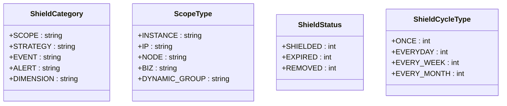
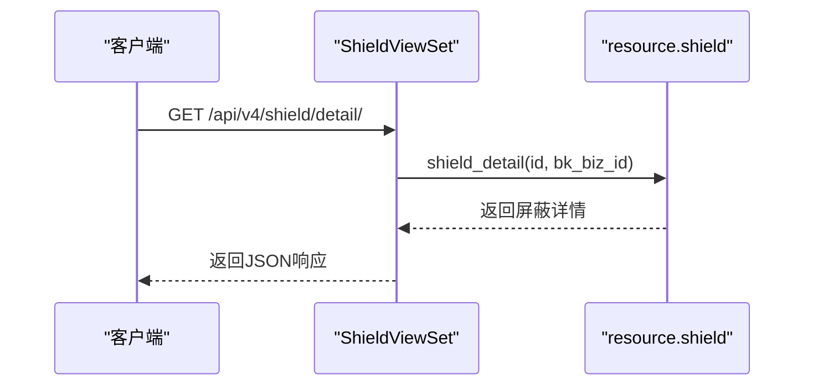
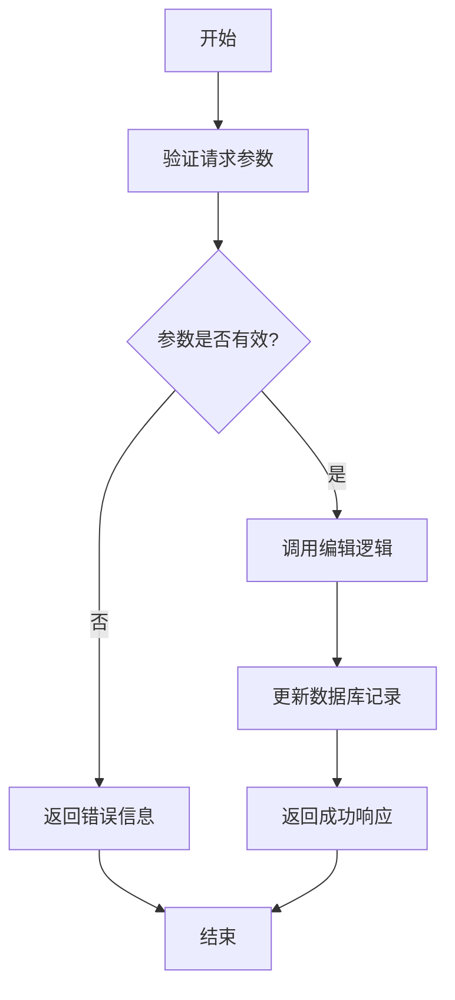
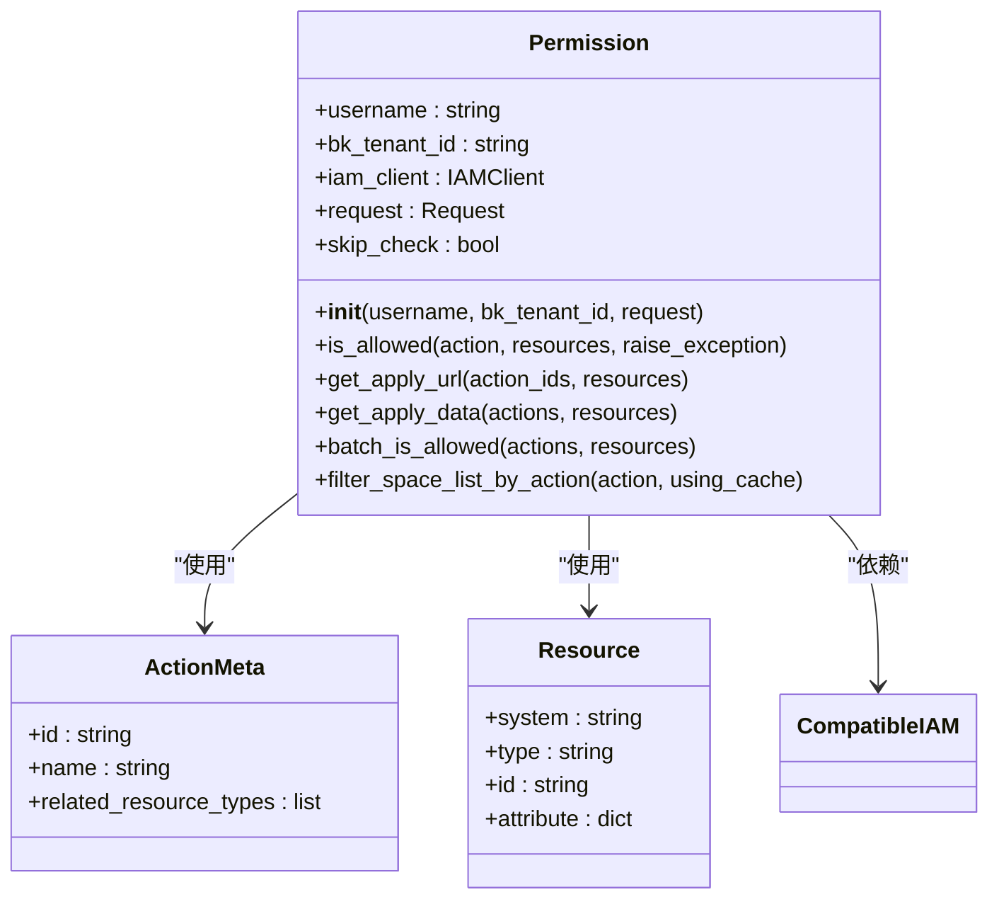
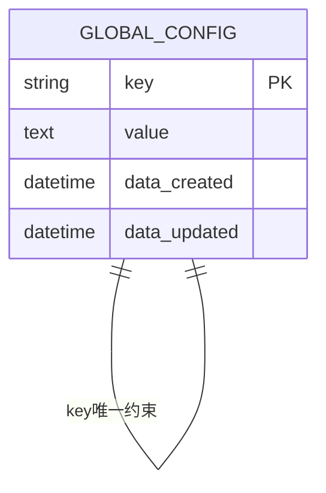

# 系统管理API

<cite>
**本文档引用的文件**  
- [shield.py](file://bkmonitor\constants\shield.py)
- [shield.py](file://bkmonitor\kernel_api\views\v4\shield.py)
- [shield.py](file://bkmonitor\bkmonitor\utils\shield.py)
- [permission.py](file://bkmonitor\bkmonitor\iam\permission.py)
- [models.py](file://bkmonitor\packages\monitor\models\models.py)
- [frontend_resources.py](file://bkmonitor\packages\monitor_web\shield\resources\frontend_resources.py)
- [edit_shield.md](file://bkmonitor\docs\api\apidocs\zh_hans\edit_shield.md)
- [get_shield.md](file://bkmonitor\docs\api\apidocs\zh_hans\get_shield.md)
</cite>

## 目录
1. [系统管理API](#系统管理api)
2. [屏蔽规则管理](#屏蔽规则管理)
3. [用户权限管理](#用户权限管理)
4. [系统全局配置](#系统全局配置)

## 屏蔽规则管理

屏蔽规则用于临时抑制告警通知，支持按策略、范围、事件等维度进行配置。系统提供了创建、查询、修改和删除屏蔽规则的完整API接口。

### 屏蔽规则类型与状态

根据 `bkmonitor\constants\shield.py` 文件定义，屏蔽规则包含多种类型和状态：

**屏蔽范围类型（ScopeType）**
- `instance`: 服务实例
- `ip`: 主机
- `node`: 节点
- `biz`: 业务
- `dynamic_group`: 动态分组

**屏蔽类别（ShieldCategory）**
- `scope`: 范围屏蔽
- `strategy`: 策略屏蔽
- `event`: 事件屏蔽
- `alert`: 告警事件屏蔽
- `dimension`: 维度屏蔽

**屏蔽状态（ShieldStatus）**
- `1`: 屏蔽中
- `2`: 已过期
- `3`: 被解除



**图示来源**
- [shield.py](file://bkmonitor\constants\shield.py)

**本节来源**
- [shield.py](file://bkmonitor\constants\shield.py)

### 查询屏蔽规则详情

通过 `get_shield` 接口可查询指定屏蔽规则的详细信息。

**请求参数**
| 字段 | 类型 | 必选 | 描述 |
| ---- | ---- | ---- | ---- |
| id | int | 是 | 屏蔽ID |
| bk_biz_id | int | 是 | 业务ID |

**响应参数**
| 字段 | 类型 | 描述 |
| ---- | ---- | ---- |
| result | bool | 请求是否成功 |
| code | int | 返回的状态码 |
| message | string | 描述信息 |
| data | dict | 数据 |

**data字段说明**
| 字段 | 类型 | 描述 |
| ---- | ---- | ---- |
| bk_biz_id | int | 业务ID |
| category | string | 屏蔽类型 |
| description | string | 说明 |
| begin_time | string | 开始时间 |
| end_time | string | 结束时间 |
| cycle_config | dict | 屏蔽配置 |
| shield_notice | bool | 是否发送屏蔽通知 |
| notice_config | dict | 通知配置 |
| dimension_config | dict | 屏蔽维度 |
| id | int | 屏蔽ID |
| scope_type | string | 范围类型 |
| status | int | 当前状态 |



**图示来源**
- [shield.py](file://bkmonitor\kernel_api\views\v4\shield.py)
- [get_shield.md](file://bkmonitor\docs\api\apidocs\zh_hans\get_shield.md)

**本节来源**
- [get_shield.md](file://bkmonitor\docs\api\apidocs\zh_hans\get_shield.md)

### 编辑屏蔽规则

通过 `edit_shield` 接口可修改现有屏蔽规则。

**请求参数**
| 字段 | 类型 | 必选 | 描述 |
| ---- | ---- | ---- | ---- |
| bk_biz_id | int | 是 | 业务ID |
| description | string | 是 | 说明 |
| begin_time | string | 是 | 开始时间 |
| end_time | string | 是 | 结束时间 |
| cycle_config | dict | 是 | 屏蔽配置 |
| shield_notice | bool | 是 | 是否发送屏蔽通知 |
| notice_config | dict | 否 | 通知配置 |
| id | int | 是 | 屏蔽配置ID |
| level | int | 否 | 屏蔽策略等级（策略屏蔽时需传入） |

**响应参数**
| 字段 | 类型 | 描述 |
| ---- | ---- | ---- |
| result | bool | 请求是否成功 |
| code | int | 返回的状态码 |
| message | string | 描述信息 |
| data | dict | 修改的屏蔽策略ID |



**图示来源**
- [edit_shield.md](file://bkmonitor\docs\api\apidocs\zh_hans\edit_shield.md)

**本节来源**
- [edit_shield.md](file://bkmonitor\docs\api\apidocs\zh_hans\edit_shield.md)

## 用户权限管理

系统基于IAM（身份与访问管理）实现细粒度的权限控制，支持对用户、角色和资源的权限分配与查询。

### 权限校验核心类

`Permission` 类是权限管理的核心，封装了与IAM系统的交互逻辑。

```python
class Permission:
    def __init__(self, username: str = "", bk_tenant_id: str = "", request=None):
        # 初始化用户身份和IAM客户端
        pass
        
    def is_allowed(self, action: ActionMeta | str, resources: list[Resource] = None, raise_exception: bool = False):
        # 校验用户是否有指定动作的权限
        pass
        
    def get_apply_url(self, action_ids: list[str], resources: list[Resource] = None):
        # 生成权限申请链接
        pass
        
    def get_apply_data(self, actions: list[ActionMeta | str], resources: list[Resource] = None):
        # 生成权限申请数据
        pass
        
    def batch_is_allowed(self, actions: list[ActionMeta], resources: list[list[Resource]]):
        # 批量校验权限
        pass
```

**关键方法说明**
- `is_allowed`: 判断用户是否具有某项操作权限
- `get_apply_url`: 获取权限申请URL，用于跳转至IAM系统申请权限
- `get_apply_data`: 生成权限申请所需的数据结构
- `batch_is_allowed`: 批量校验多个资源的多个操作权限



**图示来源**
- [permission.py](file://bkmonitor\bkmonitor\iam\permission.py)

**本节来源**
- [permission.py](file://bkmonitor\bkmonitor\iam\permission.py)

## 系统全局配置

系统提供全局配置管理功能，支持对系统级参数的读取和修改。

### 全局配置数据模型

根据 `models.py` 文件定义，全局配置通过 `GlobalConfig` 模型进行管理。

```python
class GlobalConfig(models.Model):
    """全局配置信息"""
    key = models.CharField("key", max_length=255, unique=True)
    value = ConfigDataField("配置信息")
    data_created = models.DateTimeField("创建时间", auto_now_add=True)
    data_updated = models.DateTimeField("更新时间", auto_now=True)
    
    class Meta:
        verbose_name = _("全局配置信息")
```

**字段说明**
- `key`: 配置项键名，全局唯一
- `value`: 配置项值，支持复杂数据结构
- `data_created`: 创建时间
- `data_updated`: 更新时间

该模型确保了配置项的唯一性，并自动维护时间戳。



**图示来源**
- [models.py](file://bkmonitor\packages\monitor\models\models.py)

**本节来源**
- [models.py](file://bkmonitor\packages\monitor\models\models.py)