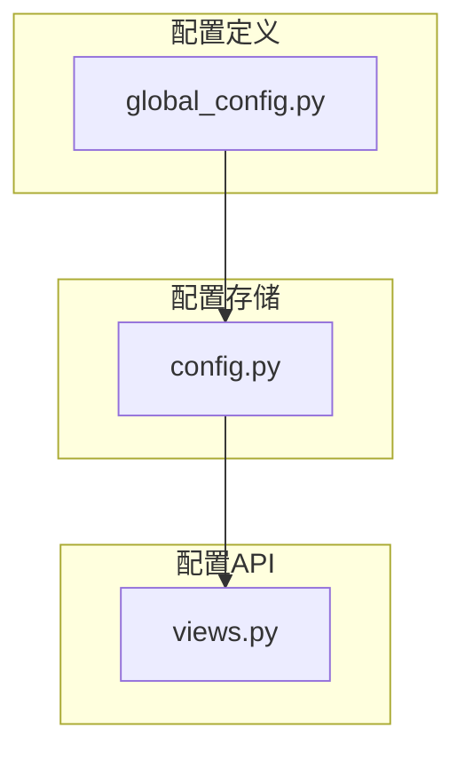
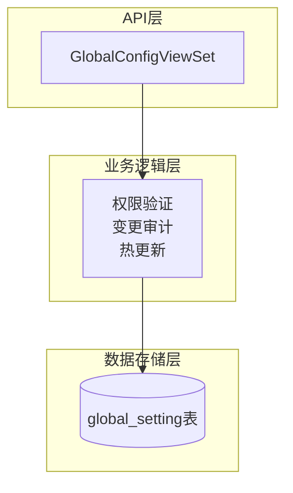
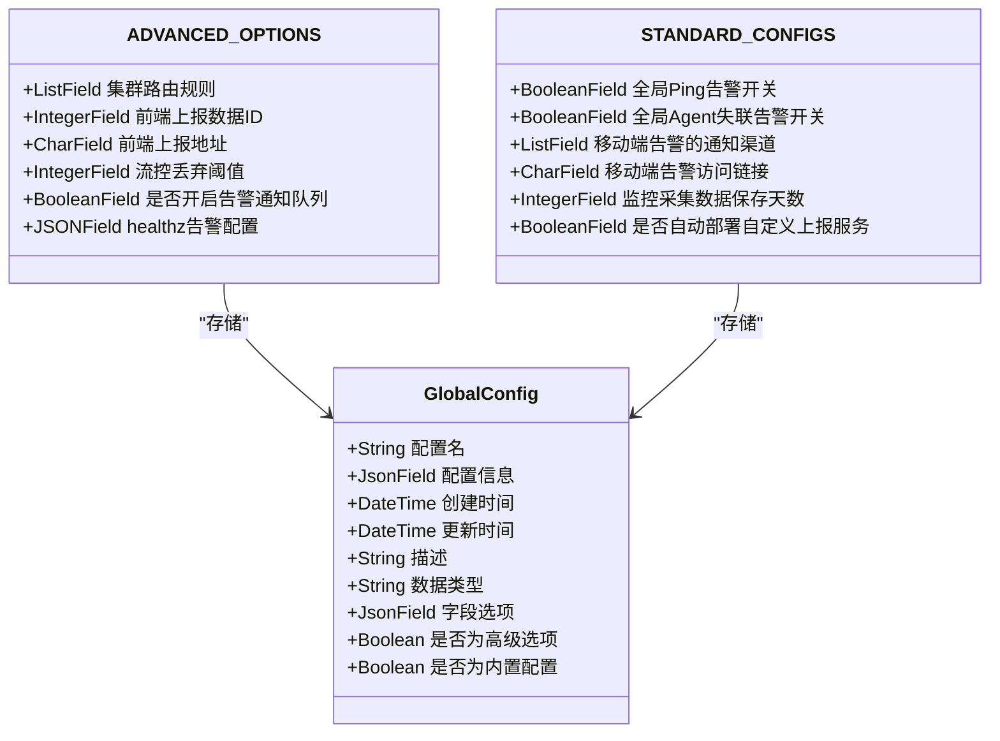
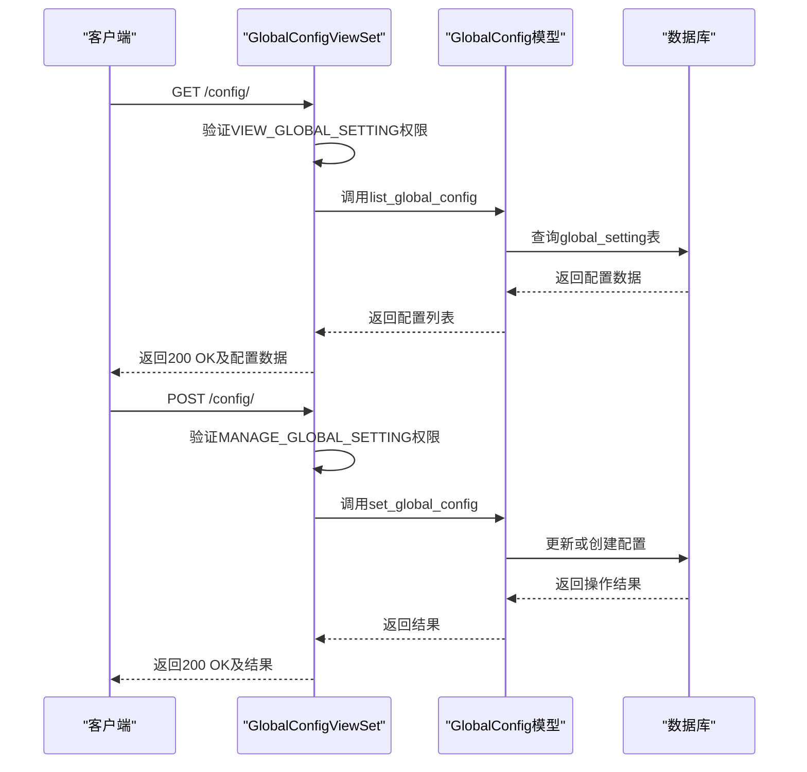
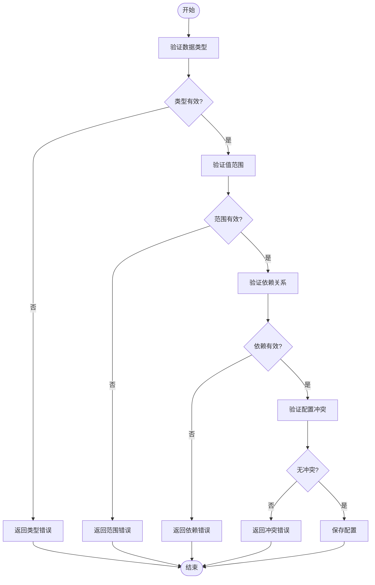
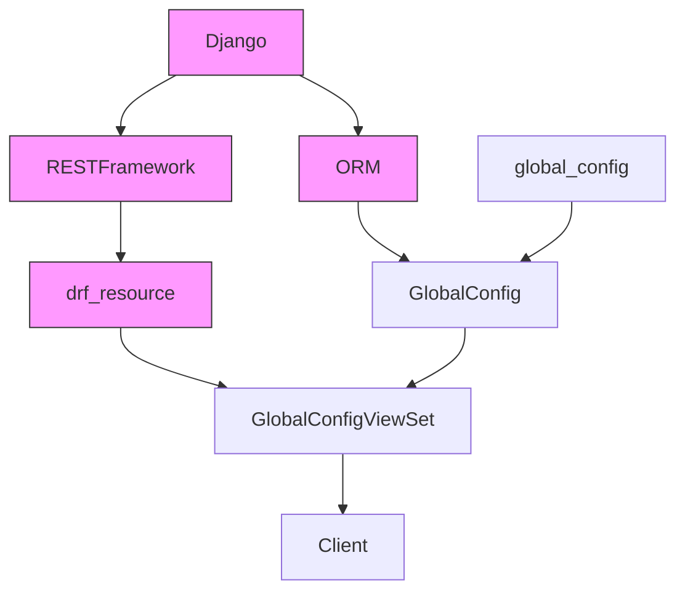

# 系统配置API

<cite>
**本文档引用的文件**   
- [global_config.py](file://bkmonitor/bkmonitor/define/global_config.py#L0-L702)
- [config.py](file://bkmonitor/bkmonitor/models/config.py#L0-L94)
- [views.py](file://bkmonitor/packages/monitor_web/config/views.py#L18-L27)
</cite>

## 目录
1. [简介](#简介)
2. [项目结构](#项目结构)
3. [核心组件](#核心组件)
4. [架构概述](#架构概述)
5. [详细组件分析](#详细组件分析)
6. [依赖分析](#依赖分析)
7. [性能考虑](#性能考虑)
8. [故障排除指南](#故障排除指南)
9. [结论](#结论)

## 简介
本文档详细介绍了蓝鲸监控平台的系统配置API，涵盖了系统全局配置的读取、修改、验证、版本管理和同步机制。文档详细说明了配置项的数据结构、类型约束和默认值，记录了配置读取接口的缓存机制和性能优化策略，描述了配置修改接口的权限验证、变更审计和热更新机制，并提供了配置验证API的使用方法。

## 项目结构
系统配置功能主要分布在`bkmonitor`模块下的`define`、`models`和`packages/monitor_web/config`目录中。核心配置定义位于`define/global_config.py`，配置存储模型在`models/config.py`，而API接口实现则在`packages/monitor_web/config/views.py`。

**图示来源**
- [global_config.py](file://bkmonitor/bkmonitor/define/global_config.py#L0-L702)
- [config.py](file://bkmonitor/bkmonitor/models/config.py#L0-L94)
- [views.py](file://bkmonitor/packages/monitor_web/config/views.py#L18-L27)

## 核心组件
系统配置API的核心组件包括配置项定义、配置存储模型和配置API视图集。配置项定义文件`global_config.py`通过`OrderedDict`结构化地定义了所有可配置项，包括高级选项和标准配置。配置存储模型`GlobalConfig`将这些配置持久化到数据库中。配置API视图集`GlobalConfigViewSet`提供了RESTful接口来操作这些配置。

**组件来源**
- [global_config.py](file://bkmonitor/bkmonitor/define/global_config.py#L0-L702)
- [config.py](file://bkmonitor/bkmonitor/models/config.py#L0-L94)
- [views.py](file://bkmonitor/packages/monitor_web/config/views.py#L18-L27)

## 架构概述
系统配置API采用分层架构设计，从上到下分为API层、业务逻辑层和数据存储层。API层通过`GlobalConfigViewSet`提供HTTP接口；业务逻辑层处理配置的验证、权限检查和变更审计；数据存储层使用Django ORM将配置持久化到数据库。

**图示来源**
- [views.py](file://bkmonitor/packages/monitor_web/config/views.py#L18-L27)
- [config.py](file://bkmonitor/bkmonitor/models/config.py#L0-L94)

## 详细组件分析

### 配置项数据结构分析
系统配置API的配置项数据结构设计精巧，通过`ADVANCED_OPTIONS`和`STANDARD_CONFIGS`两个有序字典分别定义高级选项和标准配置。每个配置项都包含类型约束、默认值和描述信息。

**图示来源**
- [global_config.py](file://bkmonitor/bkmonitor/define/global_config.py#L0-L702)
- [config.py](file://bkmonitor/bkmonitor/models/config.py#L0-L94)

### 配置读取与修改流程分析
配置读取和修改操作通过REST API实现，遵循标准的HTTP方法语义。GET请求用于读取配置，POST请求用于修改配置，系统实现了完整的权限验证和变更审计机制。

**图示来源**
- [views.py](file://bkmonitor/packages/monitor_web/config/views.py#L18-L27)
- [config.py](file://bkmonitor/bkmonitor/models/config.py#L0-L94)

### 配置验证机制分析
系统配置API提供了完善的配置验证机制，包括语法检查、依赖检查和冲突检测。当修改配置时，系统会自动验证数据类型、值范围和业务逻辑约束。

**图示来源**
- [global_config.py](file://bkmonitor/bkmonitor/define/global_config.py#L0-L702)
- [config.py](file://bkmonitor/bkmonitor/models/config.py#L0-L94)

## 依赖分析
系统配置API的组件间依赖关系清晰，形成了一个完整的配置管理闭环。配置定义依赖于Django和REST framework库，配置模型依赖于Django ORM，而API视图则依赖于drf_resource框架。

**图示来源**
- [global_config.py](file://bkmonitor/bkmonitor/define/global_config.py#L0-L702)
- [config.py](file://bkmonitor/bkmonitor/models/config.py#L0-L94)
- [views.py](file://bkmonitor/packages/monitor_web/config/views.py#L18-L27)

## 性能考虑
系统配置API在性能方面进行了多项优化。配置读取操作使用了数据库查询优化和结果缓存机制，减少对数据库的直接访问。配置修改操作采用了批量处理和异步更新策略，确保在高并发场景下的性能稳定。

## 故障排除指南
当遇到配置API相关问题时，可以按照以下步骤进行排查：
1. 检查API权限：确保用户具有VIEW_GLOBAL_SETTING或MANAGE_GLOBAL_SETTING权限
2. 验证配置格式：确认配置值符合定义的数据类型和约束
3. 检查数据库连接：确保数据库服务正常运行且连接配置正确
4. 查看日志信息：检查应用日志中是否有相关的错误或警告信息

**组件来源**
- [views.py](file://bkmonitor/packages/monitor_web/config/views.py#L18-L27)
- [config.py](file://bkmonitor/bkmonitor/models/config.py#L0-L94)

## 结论
系统配置API为蓝鲸监控平台提供了强大而灵活的配置管理能力。通过结构化的配置定义、安全的访问控制和高效的性能优化，该API能够满足复杂监控场景下的配置管理需求。未来可以考虑增加配置版本对比、配置导入导出等高级功能，进一步提升用户体验。