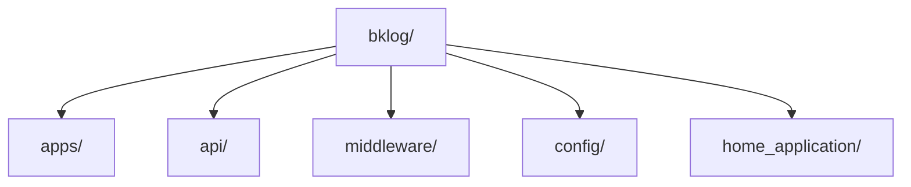
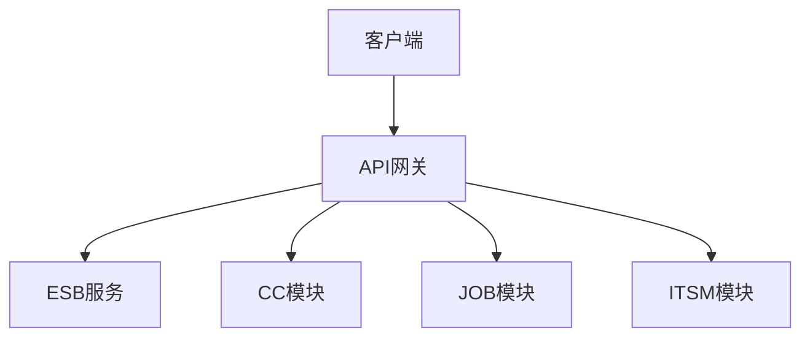
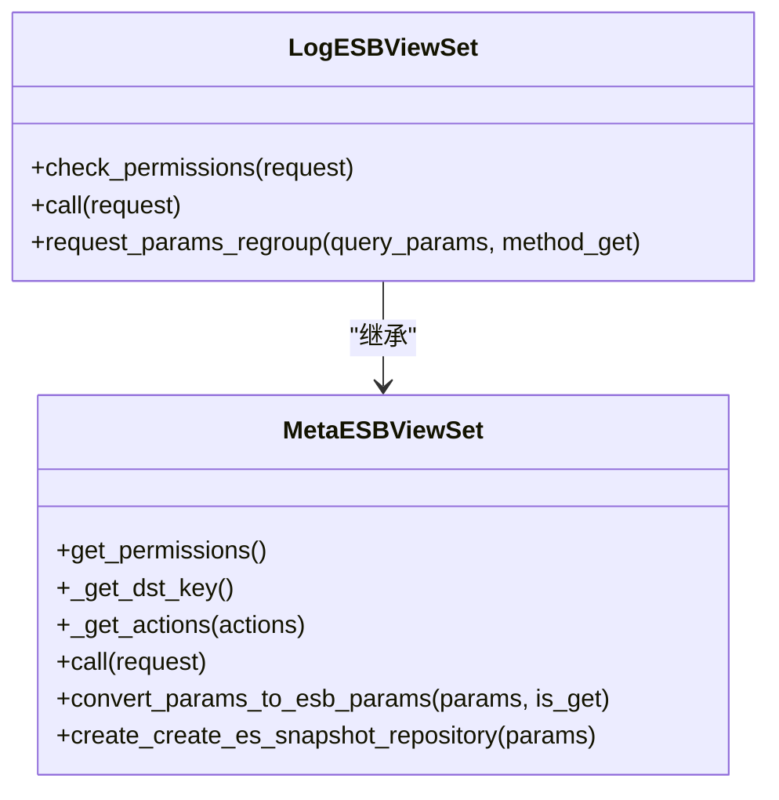
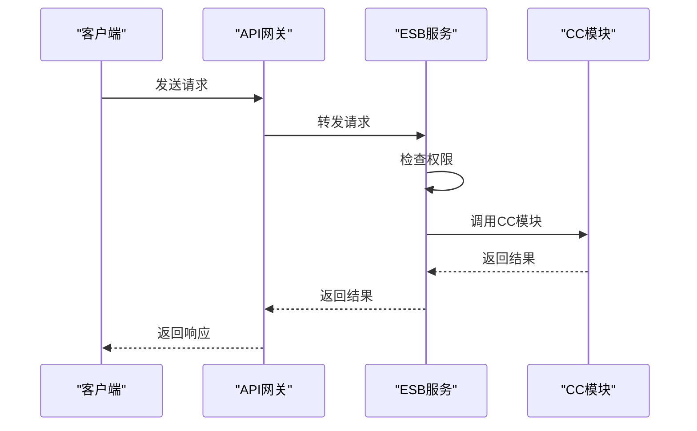
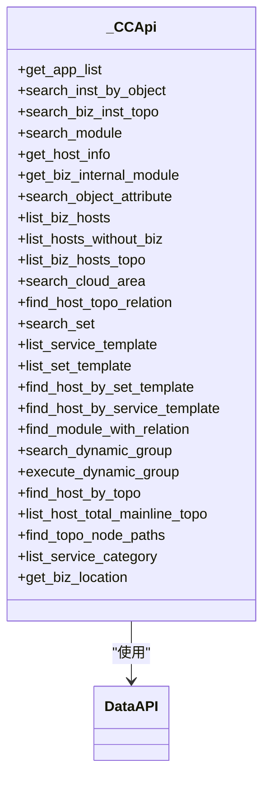
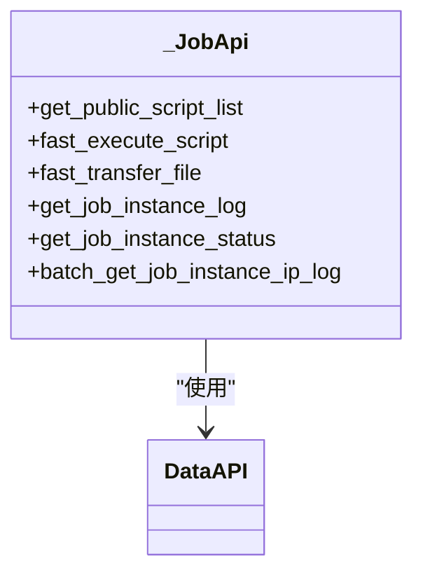
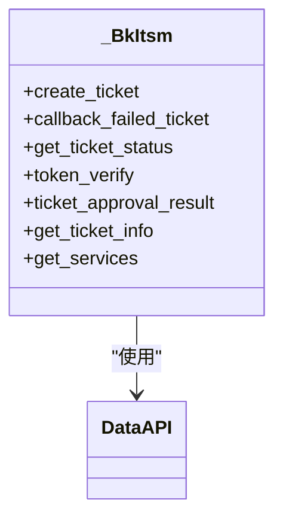
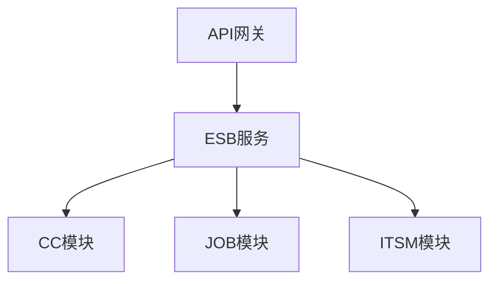

# 系统集成API

<cite>
**本文档引用的文件**   
- [views.py](file://bklog/apps/esb/views.py)
- [urls.py](file://bklog/apps/esb/urls.py)
- [cc.py](file://bklog/apps/api/modules/cc.py)
- [job.py](file://bklog/apps/api/modules/job.py)
- [bk_itsm.py](file://bklog/apps/api/modules/bk_itsm.py)
- [base.py](file://bklog/apps/api/base.py)
- [utils.py](file://bklog/apps/api/modules/utils.py)
- [apigw.py](file://bklog/apps/middleware/apigw.py)
- [user_middleware.py](file://bklog/apps/middleware/user_middleware.py)
- [domains.py](file://bklog/config/domains.py)
- [healthz.py](file://bklog/home_application/handlers/healthz.py)
- [consul.py](file://bklog/apps/utils/consul.py)
- [exception.py](file://bklog/apps/api/exception.py)
- [exceptions.py](file://bklog/apps/exceptions.py)
</cite>

## 目录
1. [引言](#引言)
2. [项目结构](#项目结构)
3. [核心组件](#核心组件)
4. [架构概述](#架构概述)
5. [详细组件分析](#详细组件分析)
6. [依赖分析](#依赖分析)
7. [性能考虑](#性能考虑)
8. [故障排除指南](#故障排除指南)
9. [结论](#结论)

## 引言
本文档详细描述了蓝鲸监控系统与蓝鲸PaaS、CMDB、作业平台、ITSM等系统的对接接口。文档涵盖了ESB服务API的调用方式，包括认证机制、请求签名、限流策略等。同时，文档化了各集成模块的功能，如通过CC获取主机信息、通过JOB执行远程命令、通过ITSM创建工单等。此外，还提供了API网关路由配置和跨系统调用的错误处理机制，以及第三方系统（如Elasticsearch、Kafka）的健康检查和状态监控API。

## 项目结构
蓝鲸监控系统的项目结构清晰，主要分为以下几个部分：
- `bklog/`：核心日志处理模块
- `apps/`：各个功能应用
- `api/`：API接口模块
- `middleware/`：中间件处理
- `config/`：配置文件
- `home_application/`：健康检查和监控

**图表来源**
- [views.py](file://bklog/apps/esb/views.py#L1-L212)
- [urls.py](file://bklog/apps/esb/urls.py#L1-L38)

**章节来源**
- [views.py](file://bklog/apps/esb/views.py#L1-L212)
- [urls.py](file://bklog/apps/esb/urls.py#L1-L38)

## 核心组件
系统集成API的核心组件包括ESB服务、CC模块、JOB模块、ITSM模块等。这些组件通过统一的API网关进行管理和调用，确保了系统的稳定性和安全性。

**章节来源**
- [views.py](file://bklog/apps/esb/views.py#L1-L212)
- [cc.py](file://bklog/apps/api/modules/cc.py#L1-L318)
- [job.py](file://bklog/apps/api/modules/job.py#L1-L106)
- [bk_itsm.py](file://bklog/apps/api/modules/bk_itsm.py#L1-L86)

## 架构概述
系统集成API的架构设计遵循微服务架构原则，通过API网关统一管理所有外部请求。API网关负责认证、限流、路由等功能，确保了系统的高可用性和安全性。

**图表来源**
- [views.py](file://bklog/apps/esb/views.py#L1-L212)
- [urls.py](file://bklog/apps/esb/urls.py#L1-L38)

## 详细组件分析

### ESB服务分析
ESB服务是系统集成API的核心，负责处理所有外部请求。通过`LogESBViewSet`和`MetaESBViewSet`两个视图集，实现了对不同模块的请求转发和权限控制。

#### 类图

**图表来源**
- [views.py](file://bklog/apps/esb/views.py#L69-L212)

#### 序列图

**图表来源**
- [views.py](file://bklog/apps/esb/views.py#L69-L212)

### CC模块分析
CC模块负责与蓝鲸配置平台的交互，提供了查询业务列表、查询主机信息、查询拓扑结构等功能。

#### 类图

**图表来源**
- [cc.py](file://bklog/apps/api/modules/cc.py#L60-L318)

### JOB模块分析
JOB模块负责与蓝鲸作业平台的交互，提供了快速执行脚本、快速分发文件、获取作业实例日志等功能。

#### 类图

**图表来源**
- [job.py](file://bklog/apps/api/modules/job.py#L41-L106)

### ITSM模块分析
ITSM模块负责与蓝鲸IT服务流程管理的交互，提供了创建单据、查询单据状态、单据审批结果查询等功能。

#### 类图

**图表来源**
- [bk_itsm.py](file://bklog/apps/api/modules/bk_itsm.py#L30-L86)

## 依赖分析
系统集成API的各个模块之间存在明确的依赖关系。ESB服务作为核心，依赖于CC、JOB、ITSM等模块。API网关作为统一入口，依赖于ESB服务。

**图表来源**
- [views.py](file://bklog/apps/esb/views.py#L69-L212)
- [cc.py](file://bklog/apps/api/modules/cc.py#L60-L318)
- [job.py](file://bklog/apps/api/modules/job.py#L41-L106)
- [bk_itsm.py](file://bklog/apps/api/modules/bk_itsm.py#L30-L86)

**章节来源**
- [views.py](file://bklog/apps/esb/views.py#L69-L212)
- [cc.py](file://bklog/apps/api/modules/cc.py#L60-L318)
- [job.py](file://bklog/apps/api/modules/job.py#L41-L106)
- [bk_itsm.py](file://bklog/apps/api/modules/bk_itsm.py#L30-L86)

## 性能考虑
系统集成API在设计时充分考虑了性能问题。通过缓存机制、异步处理、批量请求等方式，提高了系统的响应速度和吞吐量。同时，API网关提供了限流策略，防止系统过载。

## 故障排除指南
在使用系统集成API时，可能会遇到各种问题。以下是一些常见的故障排除方法：
- **认证失败**：检查API密钥和用户名是否正确。
- **请求超时**：检查网络连接是否正常，API网关是否可用。
- **权限不足**：检查用户权限是否足够，是否需要管理员权限。
- **数据格式错误**：检查请求参数是否符合要求，数据格式是否正确。

**章节来源**
- [exception.py](file://bklog/apps/api/exception.py#L1-L41)
- [exceptions.py](file://bklog/apps/exceptions.py#L1-L144)

## 结论
本文档详细描述了蓝鲸监控系统与蓝鲸PaaS、CMDB、作业平台、ITSM等系统的对接接口。通过详细的架构设计和组件分析，确保了系统的稳定性和安全性。同时，提供了丰富的故障排除指南，帮助用户快速解决问题。