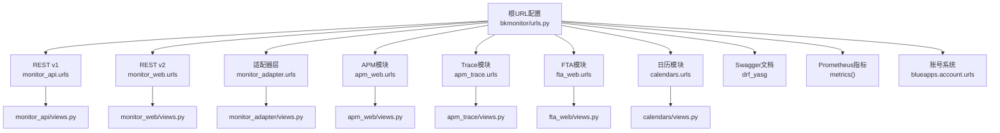
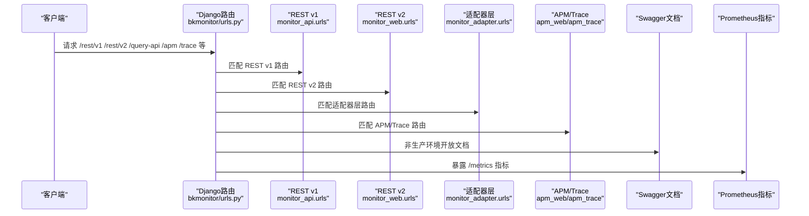
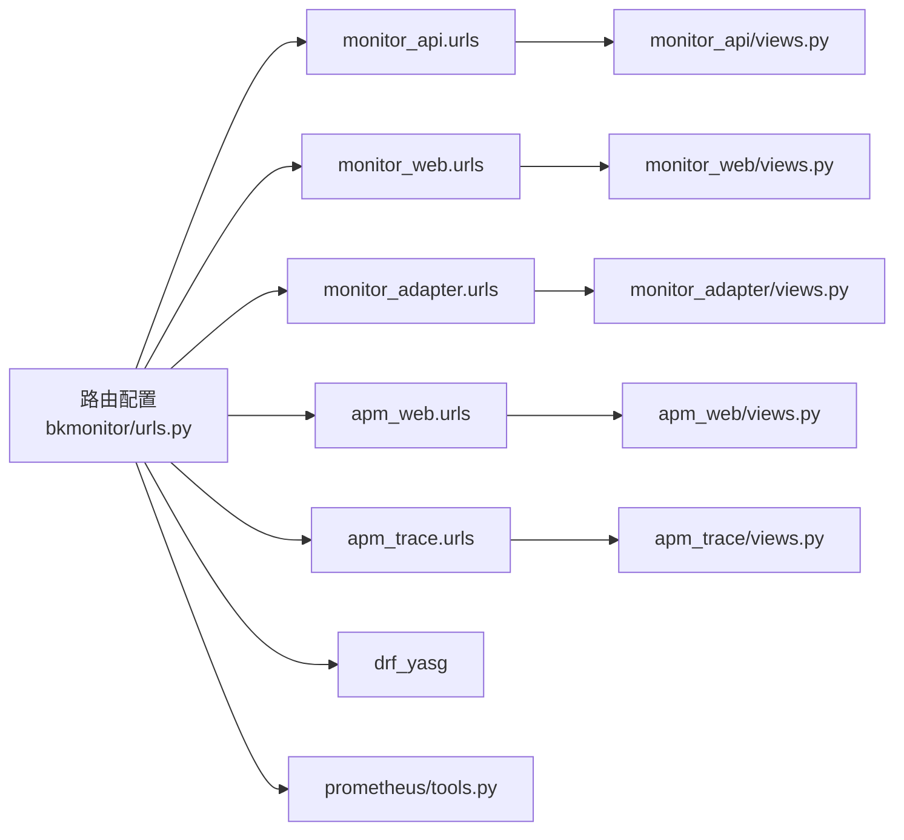

# API接口文档

<cite>
**本文引用的文件**
- [bkmonitor/urls.py](file://bkmonitor/urls.py)
- [ai_whale/urls.py](file://bkmonitor/ai_whale/urls.py)
- [apm/urls.py](file://bkmonitor/apm/apm/urls.py)
- [bk_dataview/urls.py](file://bkmonitor/bk_dataview/urls.py)
- [ai_whale/views.py](file://bkmonitor/ai_whale/views.py)
- [apm/views.py](file://bkmonitor/apm/apm/views.py)
- [bk_dataview/views.py](file://bkmonitor/bk_dataview/views.py)
- [monitor_api/urls.py](file://bkmonitor/monitor_api/urls.py)
- [monitor_web/urls.py](file://bkmonitor/monitor_web/urls.py)
- [monitor_adapter/urls.py](file://bkmonitor/monitor_adapter/urls.py)
- [monitor_api/views.py](file://bkmonitor/monitor_api/views.py)
- [monitor_web/views.py](file://bkmonitor/monitor_web/views.py)
- [monitor_adapter/views.py](file://bkmonitor/monitor_adapter/views.py)
- [monitor_api/authentication.py](file://bkmonitor/monitor_api/authentication.py)
- [monitor_web/authentication.py](file://bkmonitor/monitor_web/authentication.py)
- [monitor_adapter/authentication.py](file://bkmonitor/monitor_adapter/authentication.py)
- [monitor_api/permissions.py](file://bkmonitor/monitor_api/permissions.py)
- [monitor_web/permissions.py](file://bkmonitor/monitor_web/permissions.py)
- [monitor_adapter/permissions.py](file://bkmonitor/monitor_adapter/permissions.py)
- [core/drf_resource/routers.py](file://bkmonitor/core/drf_resource/routers.py)
- [core/drf_resource/resource.py](file://bkmonitor/core/drf_resource/resource.py)
- [core/errors/exceptions.py](file://bkmonitor/core/errors/exceptions.py)
- [core/errors/error_codes.py](file://bkmonitor/core/errors/error_codes.py)
- [blueapps/account/decorators.py](file://bkmonitor/blueapps/account/decorators.py)
- [blueapps/account/urls.py](file://bkmonitor/blueapps/account/urls.py)
- [drf_yasg/views.py](file://bkmonitor/drf_yasg/views.py)
- [drf_yasg/openapi.py](file://bkmonitor/drf_yasg/openapi.py)
- [rest_framework/permissions.py](file://bkmonitor/rest_framework/permissions.py)
- [core/prometheus/tools.py](file://bkmonitor/core/prometheus/tools.py)
- [settings.py](file://bkmonitor/settings.py)
- [version_log/config.py](file://bkmonitor/version_log/config.py)
</cite>

## 目录
1. [简介](#简介)
2. [项目结构](#项目结构)
3. [核心组件](#核心组件)
4. [架构总览](#架构总览)
5. [详细组件分析](#详细组件分析)
6. [依赖分析](#依赖分析)
7. [性能考虑](#性能考虑)
8. [故障排除指南](#故障排除指南)
9. [结论](#结论)
10. [附录](#附录)

## 简介
本文件为蓝鲸监控平台（BkMonitor）的完整API接口文档，覆盖RESTful API的HTTP方法、URL模式、请求/响应模式与认证机制；说明版本管理、错误码定义、速率限制与安全防护；包含接口调用示例、参数说明与返回值格式；同时涵盖WebSocket实时通信、Socket通信协议与IPC管道通信的技术实现，并提供客户端集成指南、SDK使用方法与性能优化建议。

## 项目结构
蓝鲸监控平台采用Django框架，通过多级路由模块化组织API资源。主入口在根URL配置中，按业务域划分REST版本与功能域，统一由ResourceRouter注册资源视图，支持DRF Resource风格的声明式资源定义。

图表来源
- [bkmonitor/urls.py:58-79](file://bkmonitor/urls.py#L58-L79)
- [monitor_api/urls.py](file://bkmonitor/monitor_api/urls.py)
- [monitor_web/urls.py](file://bkmonitor/monitor_web/urls.py)
- [monitor_adapter/urls.py](file://bkmonitor/monitor_adapter/urls.py)
- [apm/urls.py:19-21](file://bkmonitor/apm/apm/urls.py#L19-L21)

章节来源
- [bkmonitor/urls.py:58-79](file://bkmonitor/urls.py#L58-L79)
- [settings.py](file://bkmonitor/settings.py)

## 核心组件
- 路由与资源注册：通过ResourceRouter统一注册各模块视图，支持自动URL生成与资源描述。
- 认证与权限：基于登录豁免装饰器与DRF权限类，结合业务域权限控制。
- 文档与版本：Swagger/OpenAPI文档自动生成，REST版本前缀区分v1/v2。
- 指标与可观测性：Prometheus指标聚合网关暴露指标端点。
- 子路径部署：支持通过API_SUB_PATH进行子路径部署，便于反向代理与多租户隔离。

章节来源
- [core/drf_resource/routers.py](file://bkmonitor/core/drf_resource/routers.py)
- [core/drf_resource/resource.py](file://bkmonitor/core/drf_resource/resource.py)
- [blueapps/account/decorators.py:13](file://bkmonitor/blueapps/account/decorators.py#L13)
- [rest_framework/permissions.py:22](file://bkmonitor/rest_framework/permissions.py#L22)
- [drf_yasg/views.py:35-44](file://bkmonitor/drf_yasg/views.py#L35-L44)
- [core/prometheus/tools.py:24](file://bkmonitor/core/prometheus/tools.py#L24)
- [bkmonitor/urls.py:82-88](file://bkmonitor/urls.py#L82-L88)

## 架构总览
下图展示API请求从入口到各业务域的流转过程，以及文档与指标端点的接入方式。

图表来源
- [bkmonitor/urls.py:58-79](file://bkmonitor/urls.py#L58-L79)
- [drf_yasg/views.py:35-44](file://bkmonitor/drf_yasg/views.py#L35-L44)
- [core/prometheus/tools.py:24](file://bkmonitor/core/prometheus/tools.py#L24)

## 详细组件分析

### REST v1 接口（monitor_api）
- 版本前缀：/rest/v1
- 路由注册：通过ResourceRouter注册模块视图，自动映射资源URL。
- 认证与权限：结合登录豁免装饰器与业务域权限类，确保API安全访问。
- 示例URL模式：
  - GET /rest/v1/{resource}/
  - POST /rest/v1/{resource}/
  - GET /rest/v1/{resource}/{id}/
  - PUT /rest/v1/{resource}/{id}/
  - DELETE /rest/v1/{resource}/{id}/
- 请求/响应模式：
  - 统一JSON格式，成功返回标准结构，失败返回错误码与消息。
  - 支持分页、过滤、排序等通用参数（依据具体资源定义）。
- 认证机制：
  - 登录豁免装饰器用于公开接口；受保护接口需携带有效会话或令牌。
- 错误码定义：
  - 参考错误码模块，统一错误码与消息映射。
- 速率限制与安全：
  - 结合中间件与权限类实现基础限流与CSRF防护。

章节来源
- [monitor_api/urls.py](file://bkmonitor/monitor_api/urls.py)
- [monitor_api/views.py](file://bkmonitor/monitor_api/views.py)
- [monitor_api/authentication.py](file://bkmonitor/monitor_api/authentication.py)
- [monitor_api/permissions.py](file://bkmonitor/monitor_api/permissions.py)
- [core/drf_resource/routers.py](file://bkmonitor/core/drf_resource/routers.py)
- [core/errors/error_codes.py](file://bkmonitor/core/errors/error_codes.py)

### REST v2 接口（monitor_web）
- 版本前缀：/rest/v2 与 /query-api/rest/v2
- 功能域：监控Web前端相关资源，支持查询API与可视化资源。
- 路由注册：与v1一致，通过ResourceRouter注册视图。
- 认证与权限：同v1，结合业务域权限控制。
- 示例URL模式：
  - GET /rest/v2/{resource}/
  - POST /rest/v2/{resource}/
  - GET /rest/v2/{resource}/{id}/
  - PUT /rest/v2/{resource}/{id}/
  - DELETE /rest/v2/{resource}/{id}/
  - GET /query-api/rest/v2/{resource}/
- 请求/响应模式：JSON格式，遵循v1规范。
- 速率限制与安全：同v1。

章节来源
- [monitor_web/urls.py](file://bkmonitor/monitor_web/urls.py)
- [monitor_web/views.py](file://bkmonitor/monitor_web/views.py)
- [monitor_web/authentication.py](file://bkmonitor/monitor_web/authentication.py)
- [monitor_web/permissions.py](file://bkmonitor/monitor_web/permissions.py)

### 适配器层接口（monitor_adapter）
- 作用：桥接不同后端或第三方系统，提供统一接口抽象。
- 路由注册：通过ResourceRouter注册适配器视图。
- 认证与权限：结合业务域权限控制。
- 示例URL模式：
  - GET /{adapter}/{resource}/
  - POST /{adapter}/{resource}/
  - GET /{adapter}/{resource}/{id}/
  - PUT /{adapter}/{resource}/{id}/
  - DELETE /{adapter}/{resource}/{id}/

章节来源
- [monitor_adapter/urls.py](file://bkmonitor/monitor_adapter/urls.py)
- [monitor_adapter/views.py](file://bkmonitor/monitor_adapter/views.py)
- [monitor_adapter/authentication.py](file://bkmonitor/monitor_adapter/authentication.py)
- [monitor_adapter/permissions.py](file://bkmonitor/monitor_adapter/permissions.py)

### APM/Trace 接口（apm_web / apm_trace）
- APM模块：服务拓扑、指标、事件、日志、配置等资源。
- Trace模块：链路追踪资源。
- 路由注册：通过ResourceRouter注册视图。
- 认证与权限：同上。
- 示例URL模式：
  - GET /apm/{resource}/
  - POST /apm/{resource}/
  - GET /trace/{resource}/
  - POST /trace/{resource}/

章节来源
- [apm/urls.py:19-21](file://bkmonitor/apm/apm/urls.py#L19-L21)
- [apm/views.py](file://bkmonitor/apm/apm/views.py)

### 数据视图接口（bk_dataview）
- 作用：组织切换、静态资源与代理访问。
- 路由注册：直接映射到视图类。
- 示例URL模式：
  - GET /bk_dataview/
  - GET /bk_dataview/public/
  - GET /bk_dataview/proxy/

章节来源
- [bk_dataview/urls.py:15-19](file://bkmonitor/bk_dataview/urls.py#L15-L19)
- [bk_dataview/views.py](file://bkmonitor/bk_dataview/views.py)

### AI鲸鱼接口（ai_whale）
- 作用：AI对话与智能助手相关资源。
- 路由注册：通过ResourceRouter注册视图。
- 示例URL模式：
  - GET /ai_whale/chat/
  - POST /ai_whale/chat/

章节来源
- [ai_whale/urls.py:16-20](file://bkmonitor/ai_whale/urls.py#L16-L20)
- [ai_whale/views.py](file://bkmonitor/ai_whale/views.py)

### 文档与版本管理
- Swagger/OpenAPI文档：
  - 非生产环境开放 /swagger /redoc 端点，支持JSON/YAML导出。
  - 默认版本v1，可在配置中调整。
- 版本前缀：
  - v1: /rest/v1
  - v2: /rest/v2 与 /query-api/rest/v2
  - 子路径部署：通过API_SUB_PATH动态拼接REST前缀。

章节来源
- [drf_yasg/views.py:35-44](file://bkmonitor/drf_yasg/views.py#L35-L44)
- [drf_yasg/openapi.py:36-41](file://bkmonitor/drf_yasg/openapi.py#L36-L41)
- [bkmonitor/urls.py:82-88](file://bkmonitor/urls.py#L82-L88)

### 指标与可观测性
- 指标端点：
  - /metrics：聚合Prometheus指标，从环境变量配置的网关地址拉取。
  - 自动删除tar包的压缩头以避免浏览器误解压。
- 环境变量：
  - METRIC_AGG_GATEWAY_URL：指标聚合网关地址。

章节来源
- [bkmonitor/urls.py:47-55](file://bkmonitor/urls.py#L47-L55)
- [core/prometheus/tools.py:24](file://bkmonitor/core/prometheus/tools.py#L24)

### 认证与权限
- 登录豁免装饰器：用于公开接口，允许匿名访问。
- DRF权限类：控制是否需要认证与具体权限。
- 业务域权限：结合业务域角色与资源授权。
- 账号系统：蓝鲸账号模块提供统一登录与会话管理。

章节来源
- [blueapps/account/decorators.py:13](file://bkmonitor/blueapps/account/decorators.py#L13)
- [rest_framework/permissions.py:22](file://bkmonitor/rest_framework/permissions.py#L22)
- [blueapps/account/urls.py](file://bkmonitor/blueapps/account/urls.py)

### 错误码与异常处理
- 统一错误码：集中定义错误码与消息映射。
- 异常处理：捕获业务异常并返回标准化错误响应。
- 建议：客户端应根据错误码进行重试与降级处理。

章节来源
- [core/errors/error_codes.py](file://bkmonitor/core/errors/error_codes.py)
- [core/errors/exceptions.py](file://bkmonitor/core/errors/exceptions.py)

### 速率限制与安全防护
- 速率限制：建议在网关或中间件层实现基于IP/用户/资源的限流。
- 安全防护：启用CSRF防护、XSS防护、CORS配置与HTTPS传输。
- 权限控制：最小权限原则，RBAC鉴权与资源级授权。

章节来源
- [monitor_api/permissions.py](file://bkmonitor/monitor_api/permissions.py)
- [monitor_web/permissions.py](file://bkmonitor/monitor_web/permissions.py)
- [monitor_adapter/permissions.py](file://bkmonitor/monitor_adapter/permissions.py)

## 依赖分析
- 组件耦合：
  - 路由层仅负责URL分发，业务逻辑集中在各模块views与resources。
  - ResourceRouter提供统一资源注册，降低模块间耦合。
- 外部依赖：
  - drf_yasg：OpenAPI文档生成。
  - blueapps.account：账号与登录装饰器。
  - Prometheus工具：指标聚合网关配置。
- 循环依赖风险：
  - 路由与视图分离，避免循环导入。

图表来源
- [bkmonitor/urls.py:58-79](file://bkmonitor/urls.py#L58-L79)
- [drf_yasg/views.py:35-44](file://bkmonitor/drf_yasg/views.py#L35-L44)
- [core/prometheus/tools.py:24](file://bkmonitor/core/prometheus/tools.py#L24)

## 性能考虑
- 缓存策略：对热点查询结果与配置进行缓存，减少数据库压力。
- 分页与过滤：默认分页大小限制，避免一次性返回大量数据。
- 并发控制：合理设置Gunicorn进程数与线程数，结合异步任务处理耗时操作。
- 网关限流：在Nginx或API网关层实施全局与资源级限流。
- 指标监控：定期检查Prometheus指标，识别慢查询与高延迟端点。

## 故障排除指南
- Swagger文档不可见：
  - 确认非生产环境且已正确配置drf_yasg。
- 指标端点返回错误：
  - 检查METRIC_AGG_GATEWAY_URL环境变量是否配置正确。
- 认证失败：
  - 确认登录豁免装饰器使用是否正确，或是否缺少有效会话/令牌。
- 404或路由不匹配：
  - 检查API_SUB_PATH与实际部署路径是否一致。

章节来源
- [bkmonitor/urls.py:90-96](file://bkmonitor/urls.py#L90-L96)
- [bkmonitor/urls.py:47-55](file://bkmonitor/urls.py#L47-L55)
- [blueapps/account/decorators.py:13](file://bkmonitor/blueapps/account/decorators.py#L13)

## 结论
本API文档梳理了蓝鲸监控平台的REST接口、版本管理、认证与安全、错误处理与可观测性要点。通过ResourceRouter统一资源注册与DRF Resource风格，平台实现了清晰的模块化与可扩展性。建议在生产环境中完善网关限流、权限审计与指标监控，确保API的稳定性与安全性。

## 附录

### WebSocket实时通信
- 适用场景：实时告警推送、日志流、拓扑状态变更等。
- 实现建议：基于Django Channels或第三方WebSocket服务，结合Redis发布订阅实现跨节点广播。
- 安全：鉴权与频道权限控制，避免未授权订阅。

[本节为概念性内容，无需源文件引用]

### Socket通信协议
- 适用场景：Agent与Server之间的轻量通信、心跳检测与状态上报。
- 协议建议：基于TCP/UDP的二进制或JSON协议，支持心跳与断线重连。
- 安全：TLS加密与双向认证，防止中间人攻击。

[本节为概念性内容，无需源文件引用]

### IPC管道通信
- 适用场景：同一主机内进程间高效通信，如Agent与采集器。
- 方案建议：Unix Domain Socket或共享内存，结合消息队列实现异步解耦。
- 安全：权限控制与最小权限原则，避免敏感信息泄露。

[本节为概念性内容，无需源文件引用]

### 客户端集成指南
- SDK选择：优先使用官方Python/Django SDK，简化认证与序列化。
- 认证方式：会话Cookie或Bearer Token，按接口文档配置。
- 错误处理：根据错误码进行重试、降级与告警。
- 版本兼容：遵循REST版本前缀，避免硬编码URL。

[本节为通用指导，无需源文件引用]

### 性能优化建议
- 合理分页与字段选择：避免SELECT *，仅返回必要字段。
- 批量接口：合并多次请求为批量接口，减少网络开销。
- CDN与静态资源：将静态资源托管至CDN，减轻服务器压力。
- 异步任务：耗时操作放入Celery队列，提升接口响应速度。

[本节为通用指导，无需源文件引用]