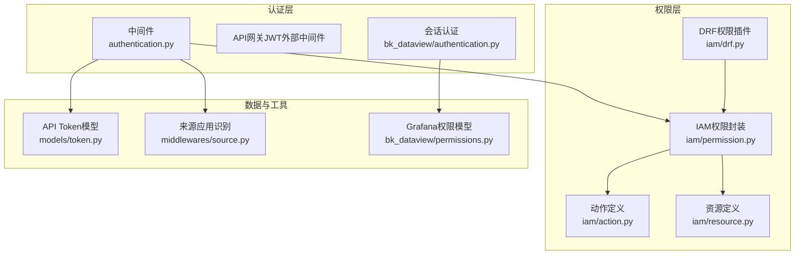
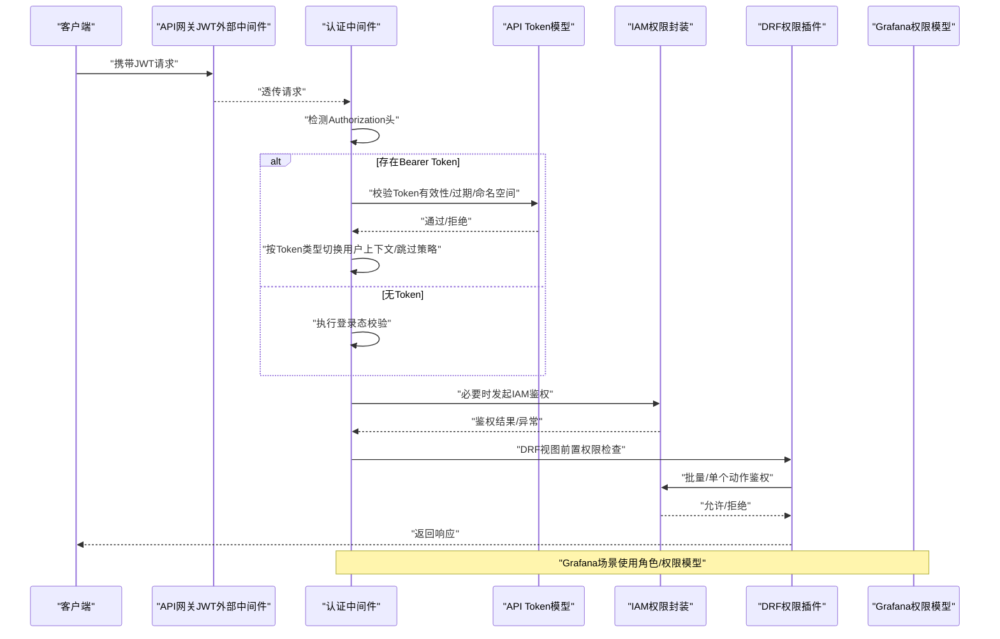
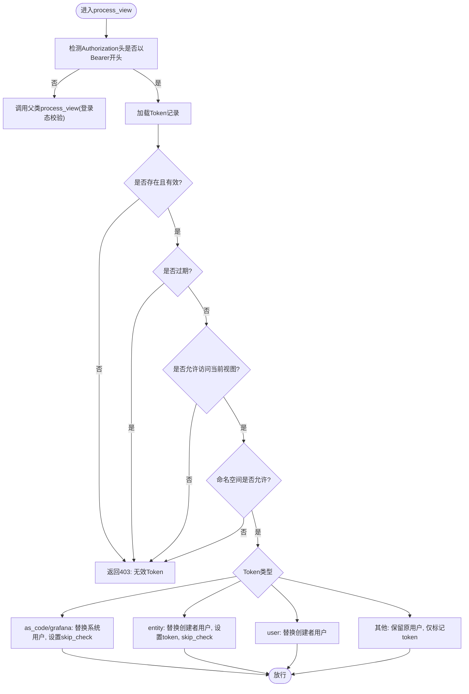
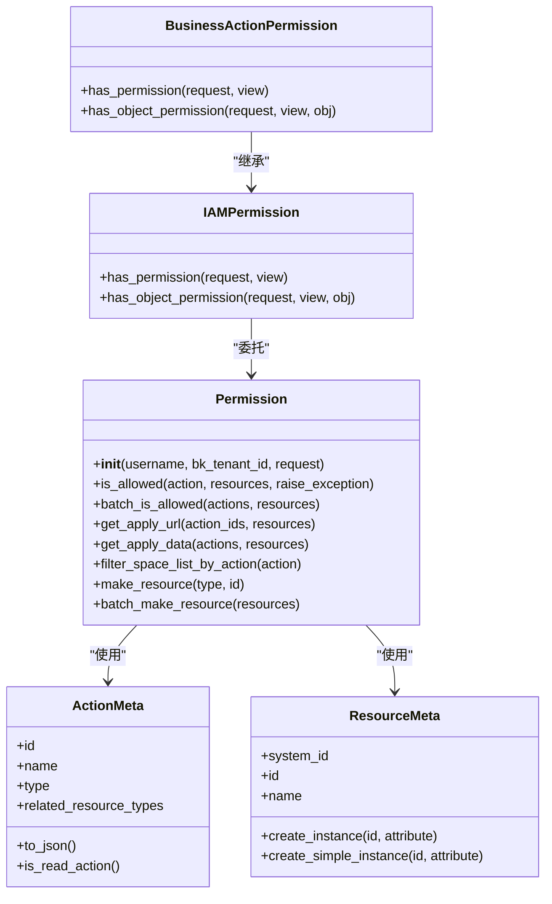
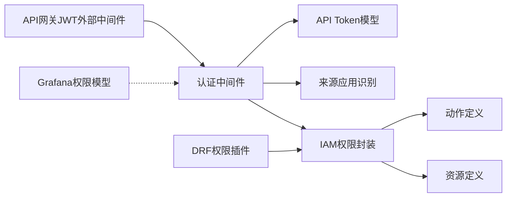

# API认证与授权

<cite>
**本文引用的文件**
- [bkmonitor\bkmonitor\middlewares\authentication.py](file://bkmonitor/bkmonitor/middlewares/authentication.py)
- [bkmonitor\bkmonitor\iam\permission.py](file://bkmonitor/bkmonitor/iam/permission.py)
- [bkmonitor\bkmonitor\iam\action.py](file://bkmonitor/bkmonitor/iam/action.py)
- [bkmonitor\bkmonitor\iam\resource.py](file://bkmonitor/bkmonitor/iam/resource.py)
- [bkmonitor\bkmonitor\iam\drf.py](file://bkmonitor/bkmonitor/iam/drf.py)
- [bkmonitor\bk_dataview\authentication.py](file://bkmonitor/bk_dataview/authentication.py)
- [bkmonitor\bk_dataview\permissions.py](file://bkmonitor/bk_dataview/permissions.py)
- [bkmonitor\bkmonitor\models\token.py](file://bkmonitor/bkmonitor/models/token.py)
- [bkmonitor\bkmonitor\middlewares\source.py](file://bkmonitor/bkmonitor/middlewares/source.py)
</cite>

## 目录
1. [简介](#简介)
2. [项目结构](#项目结构)
3. [核心组件](#核心组件)
4. [架构总览](#架构总览)
5. [详细组件分析](#详细组件分析)
6. [依赖分析](#依赖分析)
7. [性能考虑](#性能考虑)
8. [故障排查指南](#故障排查指南)
9. [结论](#结论)
10. [附录](#附录)

## 简介
本文件系统化梳理蓝鲸监控平台的API认证与授权体系，覆盖统一认证机制、Token管理、权限校验流程、IAM权限中心集成、资源授权与操作审计、多租户权限控制、API网关鉴权以及访问控制列表等安全机制。文档同时提供认证配置要点、权限申请流程与安全最佳实践，帮助开发者与运维人员快速理解并正确实施安全策略。

## 项目结构
围绕认证与授权的关键模块分布如下：
- 认证中间件与会话：负责登录态校验、API网关JWT校验、API Token鉴权与租户ID一致性维护
- 权限中心封装：封装IAM客户端、动作与资源定义、批量鉴权、权限申请与审计
- DRF权限插件：基于Django REST Framework的权限类，统一接入IAM鉴权
- Grafana权限模型：面向可视化场景的角色与权限等级
- Token模型：API Token的持久化与校验规则
- 来源应用识别：用于审计与策略下发

图表来源
- [bkmonitor\bkmonitor\middlewares\authentication.py:1-140](file://bkmonitor/bkmonitor/middlewares/authentication.py#L1-L140)
- [bkmonitor\bkmonitor\iam\permission.py:1-519](file://bkmonitor/bkmonitor/iam/permission.py#L1-L519)
- [bkmonitor\bkmonitor\iam\action.py:1-681](file://bkmonitor/bkmonitor/iam/action.py#L1-L681)
- [bkmonitor\bkmonitor\iam\resource.py:1-214](file://bkmonitor/bkmonitor/iam/resource.py#L1-L214)
- [bkmonitor\bkmonitor\iam\drf.py:1-363](file://bkmonitor/bkmonitor/iam/drf.py#L1-L363)
- [bkmonitor\bk_dataview\authentication.py:1-41](file://bkmonitor/bk_dataview/authentication.py#L1-L41)
- [bkmonitor\bk_dataview\permissions.py:1-96](file://bkmonitor/bk_dataview/permissions.py#L1-L96)
- [bkmonitor\bkmonitor\models\token.py](file://bkmonitor/bkmonitor/models/token.py)
- [bkmonitor\bkmonitor\middlewares\source.py:1-31](file://bkmonitor/bkmonitor/middlewares/source.py#L1-L31)

章节来源
- [bkmonitor\bkmonitor\middlewares\authentication.py:1-140](file://bkmonitor/bkmonitor/middlewares/authentication.py#L1-L140)
- [bkmonitor\bkmonitor\iam\permission.py:1-519](file://bkmonitor/bkmonitor/iam/permission.py#L1-L519)
- [bkmonitor\bkmonitor\iam\action.py:1-681](file://bkmonitor/bkmonitor/iam/action.py#L1-L681)
- [bkmonitor\bkmonitor\iam\resource.py:1-214](file://bkmonitor/bkmonitor/iam/resource.py#L1-L214)
- [bkmonitor\bkmonitor\iam\drf.py:1-363](file://bkmonitor/bkmonitor/iam/drf.py#L1-L363)
- [bkmonitor\bk_dataview\authentication.py:1-41](file://bkmonitor/bk_dataview/authentication.py#L1-L41)
- [bkmonitor\bk_dataview\permissions.py:1-96](file://bkmonitor/bk_dataview/permissions.py#L1-L96)
- [bkmonitor\bkmonitor\models\token.py](file://bkmonitor/bkmonitor/models/token.py)
- [bkmonitor\bkmonitor\middlewares\source.py:1-31](file://bkmonitor/bkmonitor/middlewares/source.py#L1-L31)

## 核心组件
- 统一认证中间件
  - 登录态强制校验、CSRF豁免、API网关JWT外部校验
  - API Token鉴权：校验有效期、允许接口、命名空间与租户匹配；按Token类型切换用户上下文与跳过策略
- IAM权限中心封装
  - 动作与资源元数据、批量鉴权、权限申请URL生成、SaaS空间批量申请支持
  - 读权限缓存、异常兜底、租户隔离与多场景豁免
- DRF权限插件
  - 业务动作权限、实例动作权限、MCP动态权限、批量注入权限字段
- Grafana权限模型
  - 角色与权限等级枚举，面向可视化场景的权限判定
- Token模型
  - API Token持久化、过期校验、命名空间与类型控制
- 来源应用识别
  - 从请求推断调用方APP_CODE，用于审计与策略下发

章节来源
- [bkmonitor\bkmonitor\middlewares\authentication.py:25-140](file://bkmonitor/bkmonitor/middlewares/authentication.py#L25-L140)
- [bkmonitor\bkmonitor\iam\permission.py:83-519](file://bkmonitor/bkmonitor/iam/permission.py#L83-L519)
- [bkmonitor\bkmonitor\iam\drf.py:34-363](file://bkmonitor/bkmonitor/iam/drf.py#L34-L363)
- [bkmonitor\bk_dataview\permissions.py:16-96](file://bkmonitor/bk_dataview/permissions.py#L16-L96)
- [bkmonitor\bkmonitor\models\token.py](file://bkmonitor/bkmonitor/models/token.py)
- [bkmonitor\bkmonitor\middlewares\source.py:17-31](file://bkmonitor/bkmonitor/middlewares/source.py#L17-L31)

## 架构总览
下图展示从请求进入系统到完成鉴权与权限校验的整体流程，涵盖API网关、中间件、IAM与Token校验、DRF权限插件及Grafana权限模型。

图表来源
- [bkmonitor\bkmonitor\middlewares\authentication.py:49-124](file://bkmonitor/bkmonitor/middlewares/authentication.py#L49-L124)
- [bkmonitor\bkmonitor\iam\permission.py:293-360](file://bkmonitor/bkmonitor/iam/permission.py#L293-L360)
- [bkmonitor\bkmonitor\iam\drf.py:34-68](file://bkmonitor/bkmonitor/iam/drf.py#L34-L68)
- [bkmonitor\bk_dataview\permissions.py:75-96](file://bkmonitor/bk_dataview/permissions.py#L75-L96)

## 详细组件分析

### 统一认证与API网关鉴权
- 登录态强制校验与CSRF豁免：避免跨站请求伪造，保证会话安全
- API网关JWT外部中间件：从配置读取公钥，验证外部API网关签发的JWT
- API Token鉴权中间件：
  - 解析Authorization头，校验Token存在性、过期时间、允许接口范围、命名空间与租户匹配
  - 按Token类型切换用户上下文：
    - as_code/grafana：替换为系统用户，跳过IAM校验
    - entity：替换为创建者用户，携带token，跳过IAM校验
    - user：替换为创建者用户
    - 其他：保留原用户，仅在特定场景下豁免
  - 租户ID一致性维护：确保用户存储的租户ID与实际一致，不启用多租户时统一为系统租户

图表来源
- [bkmonitor\bkmonitor\middlewares\authentication.py:49-124](file://bkmonitor/bkmonitor/middlewares/authentication.py#L49-L124)

章节来源
- [bkmonitor\bkmonitor\middlewares\authentication.py:11-140](file://bkmonitor/bkmonitor/middlewares/authentication.py#L11-L140)

### IAM权限中心集成与权限校验
- 动作与资源定义
  - 动作：包含读/写类型、关联资源类型、依赖动作、版本等元信息
  - 资源：业务空间、APM应用、Grafana仪表盘等，支持实例属性与路径构建
- 权限封装
  - 初始化：根据租户ID选择IAM客户端，支持后台API模式下的SaaS身份
  - 鉴权：支持单动作、多动作、批量资源多动作；读权限使用缓存提升性能
  - 权限申请：生成申请URL与申请数据，支持SaaS空间批量申请
  - 豁免策略：开发环境开关、Token场景豁免、特定API路径豁免
- DRF权限插件
  - 业务动作权限：自动绑定请求biz_id或对象bk_biz_id
  - 实例动作权限：从URL参数或请求数据提取实例ID
  - MCP动态权限：依据请求头动态选择动作
  - 批量注入权限字段：对列表数据批量查询权限并注入响应

图表来源
- [bkmonitor\bkmonitor\iam\permission.py:83-519](file://bkmonitor/bkmonitor/iam/permission.py#L83-L519)
- [bkmonitor\bkmonitor\iam\action.py:18-681](file://bkmonitor/bkmonitor/iam/action.py#L18-L681)
- [bkmonitor\bkmonitor\iam\resource.py:27-214](file://bkmonitor/bkmonitor/iam/resource.py#L27-L214)
- [bkmonitor\bkmonitor\iam\drf.py:34-181](file://bkmonitor/bkmonitor/iam/drf.py#L34-L181)

章节来源
- [bkmonitor\bkmonitor\iam\permission.py:83-519](file://bkmonitor/bkmonitor/iam/permission.py#L83-L519)
- [bkmonitor\bkmonitor\iam\action.py:88-681](file://bkmonitor/bkmonitor/iam/action.py#L88-L681)
- [bkmonitor\bkmonitor\iam\resource.py:66-214](file://bkmonitor/bkmonitor/iam/resource.py#L66-L214)
- [bkmonitor\bkmonitor\iam\drf.py:34-363](file://bkmonitor/bkmonitor/iam/drf.py#L34-L363)

### Grafana权限模型与可视化场景
- 角色与权限等级：支持匿名、查看者、编辑者、管理员等角色，以及视图、编辑、管理等权限等级
- 权限判定：面向Grafana组织与仪表盘的权限判定，结合默认角色与认证状态决定访问能力

章节来源
- [bkmonitor\bk_dataview\permissions.py:16-96](file://bkmonitor/bk_dataview/permissions.py#L16-L96)
- [bkmonitor\bk_dataview\authentication.py:16-41](file://bkmonitor/bk_dataview/authentication.py#L16-L41)

### Token管理与多租户控制
- Token模型
  - 持久化API Token，支持过期时间、命名空间、类型与创建者等字段
  - 与租户ID强绑定，确保不同租户的Token隔离
- 多租户控制
  - 租户ID一致性校验与修复
  - 不启用多租户时统一为系统租户，保证逻辑一致性
  - IAM鉴权按租户隔离，避免越权

章节来源
- [bkmonitor\bkmonitor\models\token.py](file://bkmonitor/bkmonitor/models/token.py)
- [bkmonitor\bkmonitor\middlewares\authentication.py:104-123](file://bkmonitor/bkmonitor/middlewares/authentication.py#L104-L123)
- [bkmonitor\bkmonitor\iam\permission.py:88-108](file://bkmonitor/bkmonitor/iam/permission.py#L88-L108)

### 来源应用识别与审计
- 从请求上下文中解析调用方APP_CODE，作为审计与策略下发的依据
- 当无法解析时回退到配置中的APP_CODE

章节来源
- [bkmonitor\bkmonitor\middlewares\source.py:17-31](file://bkmonitor/bkmonitor/middlewares/source.py#L17-L31)

## 依赖分析
- 组件耦合
  - 认证中间件依赖Token模型与来源识别，间接依赖IAM权限封装
  - DRF权限插件依赖IAM权限封装与资源/动作定义
  - Grafana权限模型独立于IAM，服务于可视化场景
- 外部依赖
  - API网关JWT中间件依赖外部公钥配置
  - IAM客户端依赖权限中心API与系统/资源/动作元数据注册

图表来源
- [bkmonitor\bkmonitor\middlewares\authentication.py:11-140](file://bkmonitor/bkmonitor/middlewares/authentication.py#L11-L140)
- [bkmonitor\bkmonitor\iam\permission.py:119-127](file://bkmonitor/bkmonitor/iam/permission.py#L119-L127)
- [bkmonitor\bkmonitor\iam\drf.py:27-31](file://bkmonitor/bkmonitor/iam/drf.py#L27-L31)
- [bkmonitor\bk_dataview\permissions.py:75-96](file://bkmonitor/bk_dataview/permissions.py#L75-L96)

章节来源
- [bkmonitor\bkmonitor\middlewares\authentication.py:1-140](file://bkmonitor/bkmonitor/middlewares/authentication.py#L1-L140)
- [bkmonitor\bkmonitor\iam\permission.py:1-519](file://bkmonitor/bkmonitor/iam/permission.py#L1-L519)
- [bkmonitor\bkmonitor\iam\drf.py:1-363](file://bkmonitor/bkmonitor/iam/drf.py#L1-L363)
- [bkmonitor\bk_dataview\permissions.py:1-96](file://bkmonitor/bk_dataview/permissions.py#L1-L96)

## 性能考虑
- 读权限缓存：对只读动作使用缓存减少IAM调用次数
- 批量鉴权：对列表数据使用批量接口一次性查询权限，降低网络往返
- 异步批创建：对资源实例创建采用线程池异步化，提升大列表渲染效率
- 豁免策略：在开发环境与特定场景下跳过鉴权，减少不必要的调用

章节来源
- [bkmonitor\bkmonitor\iam\permission.py:330-340](file://bkmonitor/bkmonitor/iam/permission.py#L330-L340)
- [bkmonitor\bkmonitor\iam\drf.py:233-253](file://bkmonitor/bkmonitor/iam/drf.py#L233-L253)
- [bkmonitor\bkmonitor\iam\drf.py:270-290](file://bkmonitor/bkmonitor/iam/drf.py#L270-L290)

## 故障排查指南
- Token相关
  - 403无效Token：确认Authorization头格式与Token存在性
  - Token过期：刷新或重新发放Token
  - 命名空间不匹配：核对Token命名空间与请求业务ID
- IAM鉴权
  - 鉴权失败：检查动作ID、资源实例ID与租户ID是否正确
  - 缓存异常：确认读权限缓存是否命中，必要时清理缓存
  - SaaS空间批量申请：确认业务空间UID与动作集合
- 中间件
  - 登录态失效：检查会话与CSRF配置
  - JWT校验失败：确认外部公钥配置与签名算法
- Grafana权限
  - 角色/权限不足：确认用户角色与默认角色配置

章节来源
- [bkmonitor\bkmonitor\middlewares\authentication.py:49-124](file://bkmonitor/bkmonitor/middlewares/authentication.py#L49-L124)
- [bkmonitor\bkmonitor\iam\permission.py:293-360](file://bkmonitor/bkmonitor/iam/permission.py#L293-L360)
- [bkmonitor\bk_dataview\permissions.py:75-96](file://bkmonitor/bk_dataview/permissions.py#L75-L96)

## 结论
本体系通过“认证中间件 + IAM权限封装 + DRF权限插件”的分层设计，实现了统一认证、细粒度权限控制、多租户隔离与可观测的权限申请流程。配合API网关JWT校验与Token管理，满足生产级安全要求。建议在部署时完善公钥配置、严格管理Token生命周期，并结合审计与告警机制持续监控权限滥用风险。

## 附录

### 认证配置示例（要点）
- API网关外部公钥配置：确保外部JWT可被正确验证
- 多租户模式：启用/禁用多租户时的行为差异与租户ID一致性维护
- 开发环境豁免：谨慎使用SKIP_IAM_PERMISSION_CHECK开关

章节来源
- [bkmonitor\bkmonitor\middlewares\authentication.py:126-140](file://bkmonitor/bkmonitor/middlewares/authentication.py#L126-L140)
- [bkmonitor\bkmonitor\middlewares\authentication.py:115-123](file://bkmonitor/bkmonitor/middlewares/authentication.py#L115-L123)
- [bkmonitor\bkmonitor\iam\permission.py:113-118](file://bkmonitor/bkmonitor/iam/permission.py#L113-L118)

### 权限申请流程
- 无权限触发：在DRF视图中抛出权限异常
- 生成申请数据：封装动作与资源，生成申请URL
- SaaS空间批量申请：针对业务空间与最小权限集合的一并申请

章节来源
- [bkmonitor\bkmonitor\iam\permission.py:256-291](file://bkmonitor/bkmonitor/iam/permission.py#L256-L291)
- [bkmonitor\bkmonitor\iam\permission.py:361-374](file://bkmonitor/bkmonitor/iam/permission.py#L361-L374)

### 安全最佳实践
- 使用短期Token并定期轮换
- 严格限制Token命名空间与允许接口
- 对敏感操作启用写权限缓存与审计
- 定期审查动作与资源定义，保持与业务一致
- 在开发环境谨慎开启豁免开关

章节来源
- [bkmonitor\bkmonitor\iam\permission.py:330-340](file://bkmonitor/bkmonitor/iam/permission.py#L330-L340)
- [bkmonitor\bkmonitor\iam\drf.py:233-253](file://bkmonitor/bkmonitor/iam/drf.py#L233-L253)