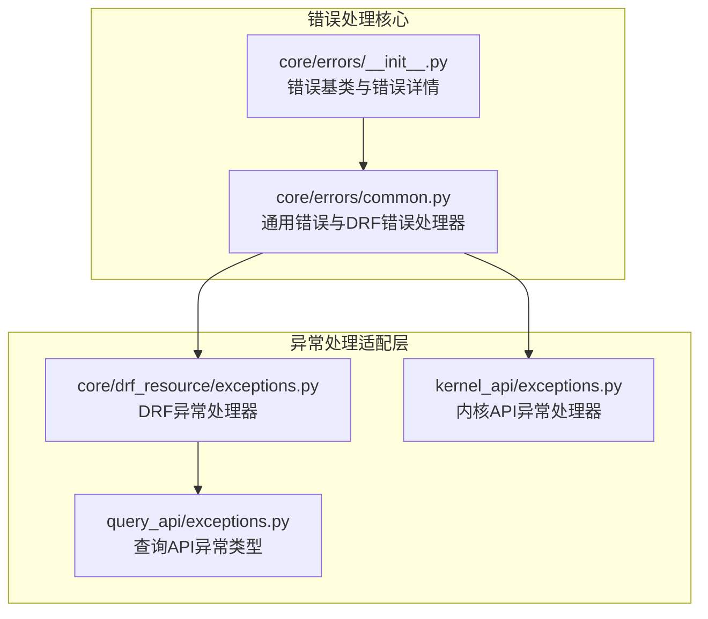
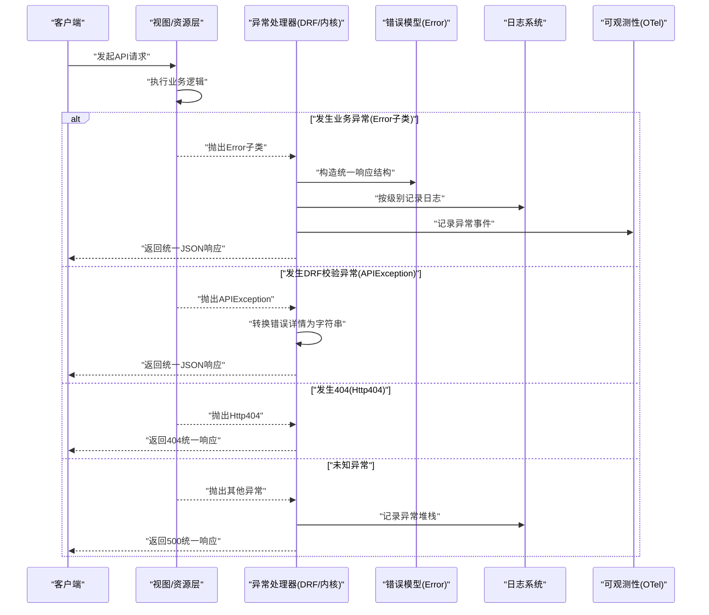
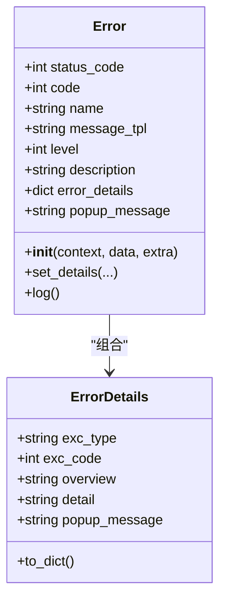
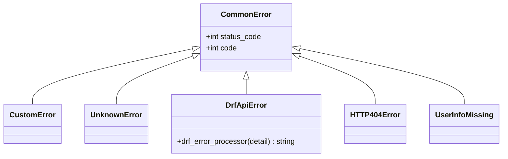
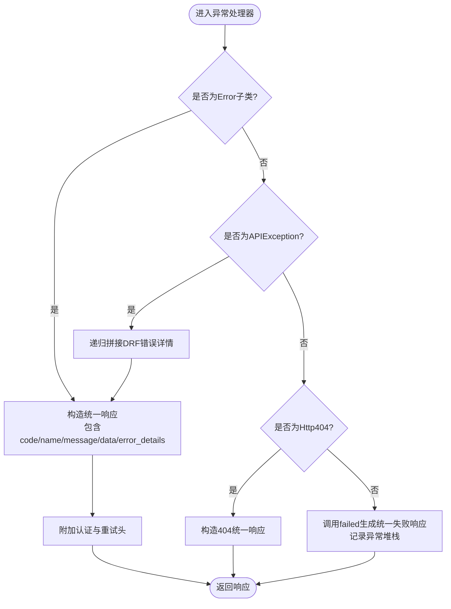
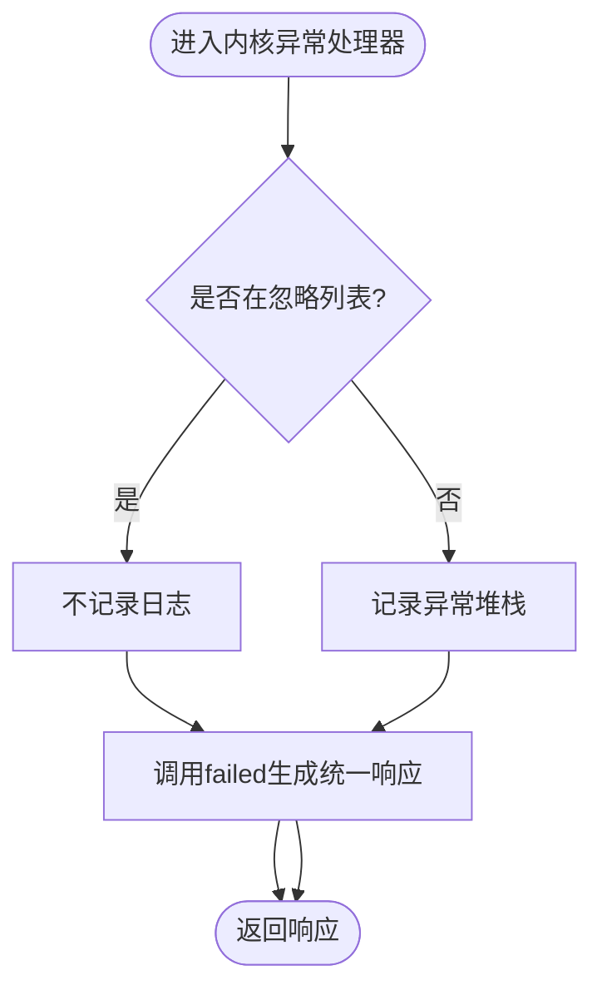
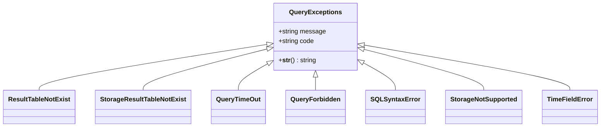
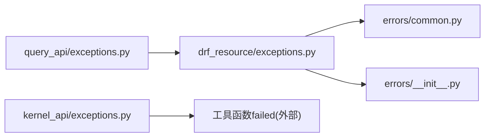

# API错误处理与状态码

<cite>
**本文引用的文件**
- [bkmonitor/core/errors/__init__.py](file://bkmonitor/core/errors/__init__.py)
- [bkmonitor/core/errors/common.py](file://bkmonitor/core/errors/common.py)
- [bkmonitor/core/drf_resource/exceptions.py](file://bkmonitor/core/drf_resource/exceptions.py)
- [bkmonitor/kernel_api/exceptions.py](file://bkmonitor/kernel_api/exceptions.py)
- [bkmonitor/query_api/exceptions.py](file://bkmonitor/query_api/exceptions.py)
</cite>

## 目录
1. [简介](#简介)
2. [项目结构](#项目结构)
3. [核心组件](#核心组件)
4. [架构总览](#架构总览)
5. [详细组件分析](#详细组件分析)
6. [依赖分析](#依赖分析)
7. [性能考虑](#性能考虑)
8. [故障排查指南](#故障排查指南)
9. [结论](#结论)
10. [附录](#附录)

## 简介
本文件聚焦于蓝鲸监控平台的API错误处理与状态码体系，系统性梳理统一错误码定义、异常类型分类、错误信息格式与处理流程；并结合现有实现，给出常见错误场景、恢复策略与降级机制建议，覆盖客户端错误处理、服务端异常捕获、日志记录与监控告警的落地方法，最后提供排查指南、调试技巧与性能优化建议。

## 项目结构
围绕API错误处理的关键目录与文件如下：
- 核心错误模型与通用错误类：bkmonitor/core/errors
- DRF资源层异常处理与响应封装：bkmonitor/core/drf_resource/exceptions.py
- 内核API异常处理适配器：bkmonitor/kernel_api/exceptions.py
- 查询API专用异常类型：bkmonitor/query_api/exceptions.py

图表来源
- [bkmonitor/core/errors/__init__.py:1-112](file://bkmonitor/core/errors/__init__.py#L1-L112)
- [bkmonitor/core/errors/common.py:1-84](file://bkmonitor/core/errors/common.py#L1-L84)
- [bkmonitor/core/drf_resource/exceptions.py:1-175](file://bkmonitor/core/drf_resource/exceptions.py#L1-L175)
- [bkmonitor/kernel_api/exceptions.py:1-45](file://bkmonitor/kernel_api/exceptions.py#L1-L45)
- [bkmonitor/query_api/exceptions.py:1-66](file://bkmonitor/query_api/exceptions.py#L1-L66)

章节来源
- [bkmonitor/core/errors/__init__.py:1-112](file://bkmonitor/core/errors/__init__.py#L1-L112)
- [bkmonitor/core/errors/common.py:1-84](file://bkmonitor/core/errors/common.py#L1-L84)
- [bkmonitor/core/drf_resource/exceptions.py:1-175](file://bkmonitor/core/drf_resource/exceptions.py#L1-L175)
- [bkmonitor/kernel_api/exceptions.py:1-45](file://bkmonitor/kernel_api/exceptions.py#L1-L45)
- [bkmonitor/query_api/exceptions.py:1-66](file://bkmonitor/query_api/exceptions.py#L1-L66)

## 核心组件
- 错误基类与错误详情
  - 错误基类提供统一的状态码、错误码、消息模板、日志级别、错误详情等字段，并内置日志输出方法。
  - 错误详情类用于向前端传递结构化错误信息（类型、错误码、概要、详情、弹框颜色）。
- 通用错误类
  - 提供“自定义异常”“未知错误”“REST API返回错误”“HTTP 404”“缺少用户信息”等常见错误类型，统一错误码与消息模板。
  - 包含DRF错误详情的递归拼接处理逻辑，便于将序列化器校验错误转为可读字符串。
- DRF异常处理器
  - 统一拦截业务侧Error子类、DRF APIException、Http404，构造一致的JSON响应结构（result、code、name、message、data、error_details），并支持WWW-Authenticate与Retry-After头。
  - 对未知异常调用工具函数failed生成统一失败响应，并记录异常堆栈。
- 内核API异常处理器
  - 针对内核接口的异常适配，支持忽略某些预期异常（如序列化校验）不记录日志，其余异常记录异常日志并返回统一JSON结构。
- 查询API异常类型
  - 定义查询相关异常类别（结果表不存在、存储结果表不存在、查询超时、无权限、SQL语法错误、存储不支持、时间字段错误等），每个异常携带固定错误码。

章节来源
- [bkmonitor/core/errors/__init__.py:19-112](file://bkmonitor/core/errors/__init__.py#L19-L112)
- [bkmonitor/core/errors/common.py:23-84](file://bkmonitor/core/errors/common.py#L23-L84)
- [bkmonitor/core/drf_resource/exceptions.py:31-128](file://bkmonitor/core/drf_resource/exceptions.py#L31-L128)
- [bkmonitor/kernel_api/exceptions.py:26-44](file://bkmonitor/kernel_api/exceptions.py#L26-L44)
- [bkmonitor/query_api/exceptions.py:16-66](file://bkmonitor/query_api/exceptions.py#L16-L66)

## 架构总览
下图展示从请求进入，到异常捕获、统一响应与可观测性记录的完整链路。

图表来源
- [bkmonitor/core/drf_resource/exceptions.py:51-128](file://bkmonitor/core/drf_resource/exceptions.py#L51-L128)
- [bkmonitor/kernel_api/exceptions.py:26-44](file://bkmonitor/kernel_api/exceptions.py#L26-L44)
- [bkmonitor/core/errors/__init__.py:96-112](file://bkmonitor/core/errors/__init__.py#L96-L112)

## 详细组件分析

### 统一错误模型与错误详情
- 错误基类提供：
  - 状态码、错误码、名称、消息模板、日志级别、描述、错误详情、弹框颜色等字段。
  - 支持通过上下文参数格式化消息模板，具备容错处理避免二次异常。
  - 提供日志输出方法，根据错误级别选择对应日志方法，并对未知级别进行兜底。
- 错误详情类提供：
  - 将错误类型、错误码、概要、详情、弹框颜色打包为字典，便于前端渲染与提示。

图表来源
- [bkmonitor/core/errors/__init__.py:39-112](file://bkmonitor/core/errors/__init__.py#L39-L112)

章节来源
- [bkmonitor/core/errors/__init__.py:19-112](file://bkmonitor/core/errors/__init__.py#L19-L112)

### 通用错误类型与DRF错误处理
- 通用错误类型：
  - 自定义异常、未知错误、REST API返回错误、HTTP 404、缺少用户信息等，均继承统一错误基类，具备明确错误码与消息模板。
- DRF错误处理：
  - 将DRF序列化器校验错误递归拼接为字符串，支持字典与列表两种结构。
  - 对APIException与Http404分别构造统一响应，包含错误详情与弹框颜色。

图表来源
- [bkmonitor/core/errors/common.py:23-84](file://bkmonitor/core/errors/common.py#L23-L84)

章节来源
- [bkmonitor/core/errors/common.py:23-84](file://bkmonitor/core/errors/common.py#L23-L84)

### DRF异常处理器
- 处理流程：
  - 捕获业务侧Error子类：构造统一响应，支持WWW-Authenticate与Retry-After头，合并extra字段。
  - 捕获APIException：转换错误详情为字符串，构造统一响应。
  - 捕获Http404：构造404统一响应，弹框颜色为红色。
  - 其他异常：调用工具函数failed生成统一失败响应，记录异常堆栈，返回500。
- 可观测性：
  - 提供record_exception函数，将异常堆栈与属性写入Span事件，便于追踪。

图表来源
- [bkmonitor/core/drf_resource/exceptions.py:51-128](file://bkmonitor/core/drf_resource/exceptions.py#L51-L128)
- [bkmonitor/core/drf_resource/exceptions.py:131-175](file://bkmonitor/core/drf_resource/exceptions.py#L131-L175)

章节来源
- [bkmonitor/core/drf_resource/exceptions.py:51-128](file://bkmonitor/core/drf_resource/exceptions.py#L51-L128)
- [bkmonitor/core/drf_resource/exceptions.py:131-175](file://bkmonitor/core/drf_resource/exceptions.py#L131-L175)

### 内核API异常处理器
- 处理策略：
  - 可配置忽略的异常类型（如序列化校验），不记录日志。
  - 其余异常统一调用工具函数failed生成JSON响应，设置状态码与错误码，保留detail字段以承载DRF错误详情。
- 适用场景：
  - 作为内核接口的统一异常适配层，确保对外响应格式一致。

图表来源
- [bkmonitor/kernel_api/exceptions.py:26-44](file://bkmonitor/kernel_api/exceptions.py#L26-L44)

章节来源
- [bkmonitor/kernel_api/exceptions.py:23-44](file://bkmonitor/kernel_api/exceptions.py#L23-L44)

### 查询API异常类型
- 异常类别：
  - 结果表不存在、存储结果表不存在、查询超时、无权限、SQL语法错误、存储不支持、时间字段错误等。
- 设计要点：
  - 每个异常携带固定错误码，便于前端与网关侧识别与路由。

图表来源
- [bkmonitor/query_api/exceptions.py:16-66](file://bkmonitor/query_api/exceptions.py#L16-L66)

章节来源
- [bkmonitor/query_api/exceptions.py:16-66](file://bkmonitor/query_api/exceptions.py#L16-L66)

## 依赖分析
- 组件耦合关系：
  - DRF异常处理器依赖通用错误类与错误详情类，用于构造统一响应。
  - 内核API异常处理器依赖工具函数failed与异常类型，用于生成统一JSON响应。
  - 查询API异常类型独立于DRF层，但可被上层业务捕获后交由统一处理器处理。
- 外部依赖：
  - DRF异常处理器依赖REST Framework的APIException与Response。
  - 记录异常事件依赖OpenTelemetry的Span与Attributes。

图表来源
- [bkmonitor/core/drf_resource/exceptions.py:24-26](file://bkmonitor/core/drf_resource/exceptions.py#L24-L26)
- [bkmonitor/kernel_api/exceptions.py:18](file://bkmonitor/kernel_api/exceptions.py#L18)
- [bkmonitor/query_api/exceptions.py:16-25](file://bkmonitor/query_api/exceptions.py#L16-L25)

章节来源
- [bkmonitor/core/drf_resource/exceptions.py:24-26](file://bkmonitor/core/drf_resource/exceptions.py#L24-L26)
- [bkmonitor/kernel_api/exceptions.py:18](file://bkmonitor/kernel_api/exceptions.py#L18)
- [bkmonitor/query_api/exceptions.py:16-25](file://bkmonitor/query_api/exceptions.py#L16-L25)

## 性能考虑
- 异常处理开销控制
  - 在DRF层尽量减少不必要的字符串拼接与深拷贝，优先复用错误详情对象。
  - 对频繁发生的已知异常（如序列化校验）采用快速通道，避免重复格式化。
- 日志与可观测性
  - 控制异常堆栈记录频率，避免在高并发场景中产生大量I/O。
  - 使用采样或阈值控制记录异常事件，降低对Span存储的压力。
- 响应头与缓存
  - 合理设置Retry-After与缓存控制头，避免客户端频繁重试导致雪崩。
- 资源释放
  - 在异常处理器中确保资源清理与连接回收，防止连接池耗尽。

## 故障排查指南
- 常见错误场景与定位
  - 序列化校验失败：查看error_details中的字段名与具体错误内容，确认请求体与序列化器定义是否一致。
  - 权限不足：检查用户信息缺失或鉴权头缺失，确认认证流程与权限矩阵。
  - 查询超时/存储不支持：结合查询API异常类型，定位具体存储后端与SQL语法问题。
- 客户端处理建议
  - 根据错误码与弹框颜色区分严重程度，对可重试错误设置指数退避与上限重试。
  - 对404错误进行降级显示或引导用户检查URL与参数。
- 服务端捕获与记录
  - 对未知异常统一走failed路径并记录异常堆栈，便于后续根因分析。
  - 使用record_exception将异常事件写入Span，结合追踪ID快速定位调用链。
- 监控告警
  - 建议对高频错误码设置阈值告警，对未知错误与5xx错误进行实时告警。
  - 对Retry-After头指示的重试行为进行统计，评估系统压力与稳定性。

章节来源
- [bkmonitor/core/drf_resource/exceptions.py:51-128](file://bkmonitor/core/drf_resource/exceptions.py#L51-L128)
- [bkmonitor/core/drf_resource/exceptions.py:131-175](file://bkmonitor/core/drf_resource/exceptions.py#L131-L175)
- [bkmonitor/kernel_api/exceptions.py:26-44](file://bkmonitor/kernel_api/exceptions.py#L26-L44)
- [bkmonitor/query_api/exceptions.py:16-66](file://bkmonitor/query_api/exceptions.py#L16-L66)

## 结论
本项目通过统一的错误基类、通用错误类型与异常处理器，实现了跨模块的一致错误表达与响应格式。DRF与内核API两套异常适配器分别覆盖了REST与内部接口的错误处理需求，并通过日志与可观测性记录为排障提供了坚实支撑。建议在实际部署中结合业务场景完善错误码映射、告警阈值与降级策略，持续优化异常处理性能与用户体验。

## 附录
- 错误信息格式规范（示例）
  - 字段：result、code、name、message、data、error_details、extra（可选）
  - 弹框颜色：warning（黄色）、error（红色）
  - 响应头：WWW-Authenticate（认证失败）、Retry-After（重试等待秒数）
- 常用错误码范围建议
  - 业务异常：3300000+
  - DRF校验：3300004
  - 404：3300005
  - 未知错误：3300003
  - 自定义异常：3300002
  - 用户信息缺失：3300007
- 查询API错误码（示例）
  - 结果表不存在：01
  - 存储结果表不存在：02
  - 查询超时：03
  - 无权限：04
  - SQL语法错误：06
  - 存储不支持：07
  - 时间字段错误：08