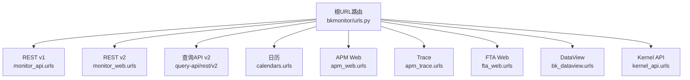
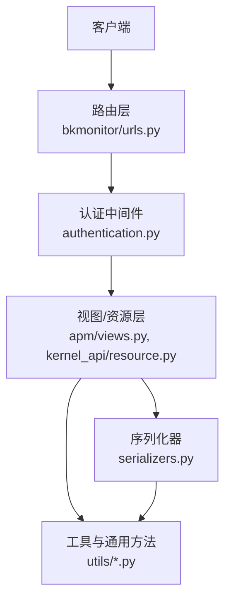
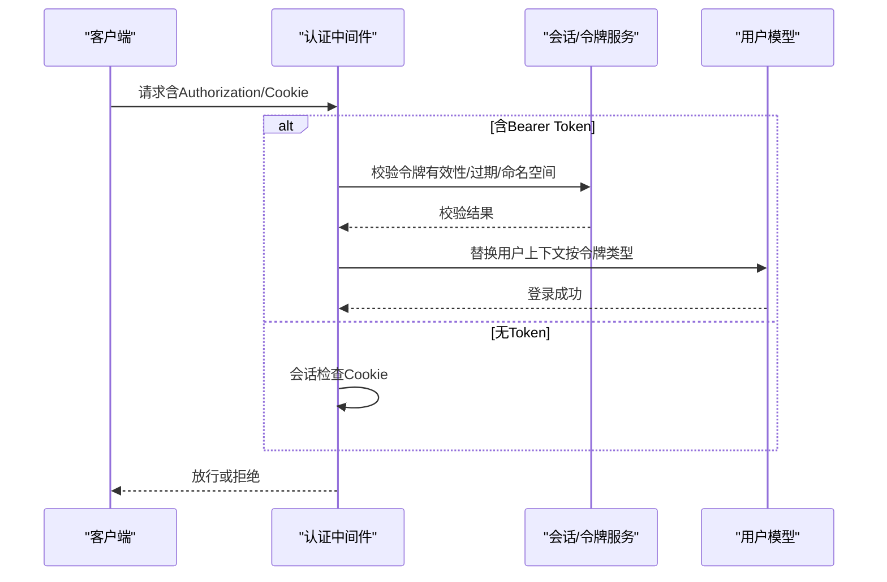
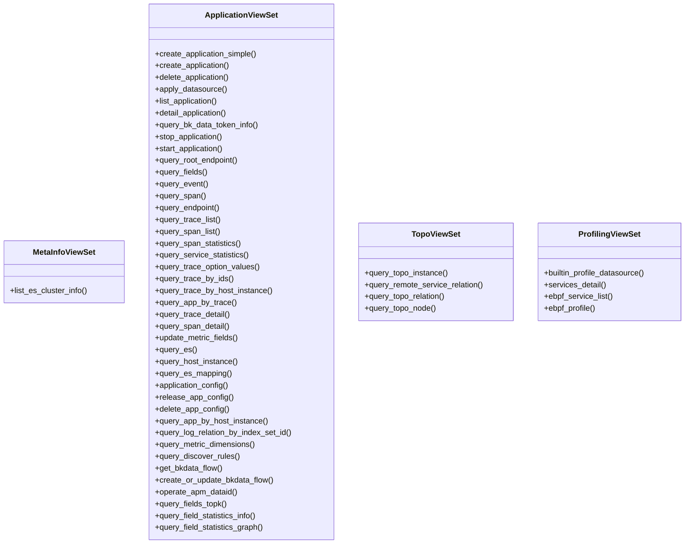
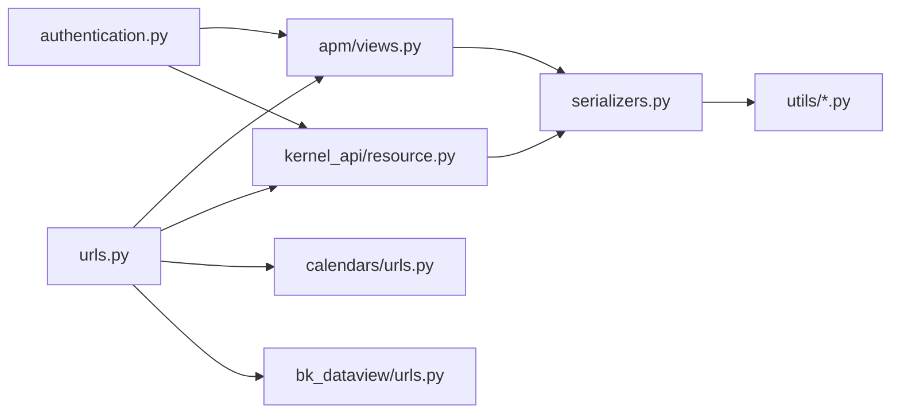

# RESTful API接口

<cite>
**本文引用的文件**
- [bkmonitor/urls.py](file://bkmonitor/urls.py)
- [bkmonitor/bkmonitor/middlewares/authentication.py](file://bkmonitor/bkmonitor/middlewares/authentication.py)
- [bkmonitor/apm/views.py](file://bkmonitor/apm/views.py)
- [bkmonitor/apm/resources.py](file://bkmonitor/apm/resources.py)
- [bkmonitor/kernel_api/urls.py](file://bkmonitor/kernel_api/urls.py)
- [bkmonitor/kernel_api/resource.py](file://bkmonitor/kernel_api/resource.py)
- [bkmonitor/kernel_api/serializers.py](file://bkmonitor/kernel_api/serializers.py)
- [bkmonitor/calendars/urls.py](file://bkmonitor/calendars/urls.py)
- [bkmonitor/calendars/views.py](file://bkmonitor/calendars/views.py)
- [bkmonitor/bk_dataview/urls.py](file://bkmonitor/bk_dataview/urls.py)
- [bkmonitor/bk_dataview/views.py](file://bkmonitor/bk_dataview/views.py)
- [bkmonitor/bkmonitor/iam/permission.py](file://bkmonitor/bkmonitor/iam/permission.py)
- [bkmonitor/bkmonitor/iam/resource.py](file://bkmonitor/bkmonitor/iam/resource.py)
- [bkmonitor/bkmonitor/iam/drf.py](file://bkmonitor/bkmonitor/iam/drf.py)
- [bkmonitor/bkmonitor/strategy/serializers.py](file://bkmonitor/bkmonitor/strategy/serializers.py)
- [bkmonitor/bkmonitor/event_plugin/serializers.py](file://bkmonitor/bkmonitor/event_plugin/serializers.py)
- [bkmonitor/bkmonitor/documents/base.py](file://bkmonitor/bkmonitor/documents/base.py)
- [bkmonitor/bkmonitor/documents/alert.py](file://bkmonitor/bkmonitor/documents/alert.py)
- [bkmonitor/bkmonitor/documents/incident.py](file://bkmonitor/bkmonitor/documents/incident.py)
- [bkmonitor/bkmonitor/documents/log.py](file://bkmonitor/bkmonitor/documents/log.py)
- [bkmonitor/bkmonitor/documents/tasks.py](file://bkmonitor/bkmonitor/documents/tasks.py)
- [bkmonitor/bkmonitor/documents/constants.py](file://bkmonitor/bkmonitor/documents/constants.py)
- [bkmonitor/bkmonitor/define/global_config.py](file://bkmonitor/bkmonitor/define/global_config.py)
- [bkmonitor/bkmonitor/commons/storage.py](file://bkmonitor/bkmonitor/commons/storage.py)
- [bkmonitor/bkmonitor/commons/tools.py](file://bkmonitor/bkmonitor/commons/tools.py)
- [bkmonitor/bkmonitor/utils/serializers.py](file://bkmonitor/bkmonitor/utils/serializers.py)
- [bkmonitor/bkmonitor/utils/tools.py](file://bkmonitor/bkmonitor/utils/tools.py)
- [bkmonitor/bkmonitor/utils/exceptions.py](file://bkmonitor/bkmonitor/utils/exceptions.py)
- [bkmonitor/bkmonitor/utils/cache.py](file://bkmonitor/bkmonitor/utils/cache.py)
- [bkmonitor/bkmonitor/utils/time.py](file://bkmonitor/bkmonitor/utils/time.py)
- [bkmonitor/bkmonitor/utils/encrypt.py](file://bkmonitor/bkmonitor/utils/encrypt.py)
- [bkmonitor/bkmonitor/utils/lock.py](file://bkmonitor/bkmonitor/utils/lock.py)
- [bkmonitor/bkmonitor/utils/queue.py](file://bkmonitor/bkmonitor/utils/queue.py)
- [bkmonitor/bkmonitor/utils/async.py](file://bkmonitor/bkmonitor/utils/async.py)
- [bkmonitor/bkmonitor/utils/validate.py](file://bkmonitor/bkmonitor/utils/validate.py)
- [bkmonitor/bkmonitor/utils/pagination.py](file://bkmonitor/bkmonitor/utils/pagination.py)
- [bkmonitor/bkmonitor/utils/batch.py](file://bkmonitor/bkmonitor/utils/batch.py)
- [bkmonitor/bkmonitor/utils/filter.py](file://bkmonitor/bkmonitor/utils/filter.py)
- [bkmonitor/bkmonitor/utils/sort.py](file://bkmonitor/bkmonitor/utils/sort.py)
- [bkmonitor/bkmonitor/utils/select.py](file://bkmonitor/bkmonitor/utils/select.py)
- [bkmonitor/bkmonitor/utils/fields.py](file://bkmonitor/bkmonitor/utils/fields.py)
- [bkmonitor/bkmonitor/utils/limit.py](file://bkmonitor/bkmonitor/utils/limit.py)
- [bkmonitor/bkmonitor/utils/order.py](file://bkmonitor/bkmonitor/utils/order.py)
- [bkmonitor/bkmonitor/utils/group.py](file://bkmonitor/bkmonitor/utils/group.py)
- [bkmonitor/bkmonitor/utils/having.py](file://bkmonitor/bkmonitor/utils/having.py)
- [bkmonitor/bkmonitor/utils/join.py](file://bkmonitor/bkmonitor/utils/join.py)
- [bkmonitor/bkmonitor/utils/distinct.py](file://bkmonitor/bkmonitor/utils/distinct.py)
- [bkmonitor/bkmonitor/utils/offset.py](file://bkmonitor/bkmonitor/utils/offset.py)
- [bkmonitor/bkmonitor/utils/limit_offset.py](file://bkmonitor/bkmonitor/utils/limit_offset.py)
- [bkmonitor/bkmonitor/utils/params.py](file://bkmonitor/bkmonitor/utils/params.py)
- [bkmonitor/bkmonitor/utils/query.py](file://bkmonitor/bkmonitor/utils/query.py)
- [bkmonitor/bkmonitor/utils/format.py](file://bkmonitor/bkmonitor/utils/format.py)
- [bkmonitor/bkmonitor/utils/parse.py](file://bkmonitor/bkmonitor/utils/parse.py)
- [bkmonitor/bkmonitor/utils/convert.py](file://bkmonitor/bkmonitor/utils/convert.py)
- [bkmonitor/bkmonitor/utils/transform.py](file://bkmonitor/bkmonitor/utils/transform.py)
- [bkmonitor/bkmonitor/utils/aggregate.py](file://bkmonitor/bkmonitor/utils/aggregate.py)
- [bkmonitor/bkmonitor/utils/summary.py](file://bkmonitor/bkmonitor/utils/summary.py)
- [bkmonitor/bkmonitor/utils/stats.py](file://bkmonitor/bkmonitor/utils/stats.py)
- [bkmonitor/bkmonitor/utils/percentile.py](file://bkmonitor/bkmonitor/utils/percentile.py)
- [bkmonitor/bkmonitor/utils/rank.py](file://bkmonitor/bkmonitor/utils/rank.py)
- [bkmonitor/bkmonitor/utils/top.py](file://bkmonitor/bkmonitor/utils/top.py)
- [bkmonitor/bkmonitor/utils/bottom.py](file://bkmonitor/bkmonitor/utils/bottom.py)
- [bkmonitor/bkmonitor/utils/quantile.py](file://bkmonitor/bkmonitor/utils/quantile.py)
- [bkmonitor/bkmonitor/utils/median.py](file://bkmonitor/bkmonitor/utils/median.py)
- [bkmonitor/bkmonitor/utils/mean.py](file://bkmonitor/bkmonitor/utils/mean.py)
- [bkmonitor/bkmonitor/utils/variance.py](file://bkmonitor/bkmonitor/utils/variance.py)
- [bkmonitor/bkmonitor/utils/std.py](file://bkmonitor/bkmonitor/utils/std.py)
- [bkmonitor/bkmonitor/utils/cov.py](file://bkmonitor/bkmonitor/utils/cov.py)
- [bkmonitor/bkmonitor/utils/correlation.py](file://bkmonitor/bkmonitor/utils/correlation.py)
- [bkmonitor/bkmonitor/utils/regression.py](file://bkmonitor/bkmonitor/utils/regression.py)
- [bkmonitor/bkmonitor/utils/clustering.py](file://bkmonitor/bkmonitor/utils/clustering.py)
- [bkmonitor/bkmonitor/utils/classification.py](file://bkmonitor/bkmonitor/utils/classification.py)
- [bkmonitor/bkmonitor/utils/anomaly.py](file://bkmonitor/bkmonitor/utils/anomaly.py)
- [bkmonitor/bkmonitor/utils/outlier.py](file://bkmonitor/bkmonitor/utils/outlier.py)
- [bkmonitor/bkmonitor/utils/trend.py](file://bkmonitor/bkmonitor/utils/trend.py)
- [bkmonitor/bkmonitor/utils/forecast.py](file://bkmonitor/bkmonitor/utils/forecast.py)
- [bkmonitor/bkmonitor/utils/probability.py](file://bkmonitor/bkmonitor/utils/probability.py)
- [bkmonitor/bkmonitor/utils/statistical.py](file://bkmonitor/bkmonitor/utils/statistical.py)
- [bkmonitor/bkmonitor/utils/math.py](file://bkmonitor/bkmonitor/utils/math.py)
- [bkmonitor/bkmonitor/utils/logic.py](file://bkmonitor/bkmonitor/utils/logic.py)
- [bkmonitor/bkmonitor/utils/string.py](file://bkmonitor/bkmonitor/utils/string.py)
- [bkmonitor/bkmonitor/utils/date.py](file://bkmonitor/bkmonitor/utils/date.py)
- [bkmonitor/bkmonitor/utils/timezone.py](file://bkmonitor/bkmonitor/utils/timezone.py)
- [bkmonitor/bkmonitor/utils/locale.py](file://bkmonitor/bkmonitor/utils/locale.py)
- [bkmonitor/bkmonitor/utils/unit.py](file://bkmonitor/bkmonitor/utils/unit.py)
- [bkmonitor/bkmonitor/utils/bytes.py](file://bkmonitor/bkmonitor/utils/bytes.py)
- [bkmonitor/bkmonitor/utils/size.py](file://bkmonitor/bkmonitor/utils/size.py)
- [bkmonitor/bkmonitor/utils/temperature.py](file://bkmonitor/bkmonitor/utils/temperature.py)
- [bkmonitor/bkmonitor/utils/pressure.py](file://bkmonitor/bkmonitor/utils/pressure.py)
- [bkmonitor/bkmonitor/utils/velocity.py](file://bkmonitor/bkmonitor/utils/velocity.py)
- [bkmonitor/bkmonitor/utils/acceleration.py](file://bkmonitor/bkmonitor/utils/acceleration.py)
- [bkmonitor/bkmonitor/utils/force.py](file://bkmonitor/bkmonitor/utils/force.py)
- [bkmonitor/bkmonitor/utils/energy.py](file://bkmonitor/bkmonitor/utils/energy.py)
- [bkmonitor/bkmonitor/utils/power.py](file://bkmonitor/bkmonitor/utils/power.py)
- [bkmonitor/bkmonitor/utils/electricity.py](file://bkmonitor/bkmonitor/utils/electricity.py)
- [bkmonitor/bkmonitor/utils/magnetic.py](file://bkmonitor/bkmonitor/utils/magnetic.py)
- [bkmonitor/bkmonitor/utils/radiation.py](file://bkmonitor/bkmonitor/utils/radiation.py)
- [bkmonitor/bkmonitor/utils/quality.py](file://bkmonitor/bkmonitor/utils/quality.py)
- [bkmonitor/bkmonitor/utils/concentration.py](file://bkmonitor/bkmonitor/utils/concentration.py)
- [bkmonitor/bkmonitor/utils/activity.py](file://bkmonitor/bkmonitor/utils/activity.py)
- [bkmonitor/bkmonitor/utils/absorption.py](file://bkmonitor/bkmonitor/utils/absorption.py)
- [bkmonitor/bkmonitor/utils/efficiency.py](file://bkmonitor/bkmonitor/utils/efficiency.py)
- [bkmonitor/bkmonitor/utils/entropy.py](file://bkmonitor/bkmonitor/utils/entropy.py)
- [bkmonitor/bkmonitor/utils/viscosity.py](file://bkmonitor/bkmonitor/utils/viscosity.py)
- [bkmonitor/bkmonitor/utils/tension.py](file://bkmonitor/bkmonitor/utils/tension.py)
- [bkmonitor/bkmonitor/utils/stress.py](file://bkmonitor/bkmonitor/utils/stress.py)
- [bkmonitor/bkmonitor/utils/strain.py](file://bkmonitor/bkmonitor/utils/strain.py)
- [bkmonitor/bkmonitor/utils/frequency.py](file://bkmonitor/bkmonitor/utils/frequency.py)
- [bkmonitor/bkmonitor/utils/angle.py](file://bkmonitor/bkmonitor/utils/angle.py)
- [bkmonitor/bkmonitor/utils/solid_angle.py](file://bkmonitor/bkmonitor/utils/solid_angle.py)
- [bkmonitor/bkmonitor/utils/area.py](file://bkmonitor/bkmonitor/utils/area.py)
- [bkmonitor/bkmonitor/utils/volume.py](file://bkmonitor/bkmonitor/utils/volume.py)
- [bkmonitor/bkmonitor/utils/length.py](file://bkmonitor/bkmonitor/utils/length.py)
- [bkmonitor/bkmonitor/utils/mass.py](file://bkmonitor/bkmonitor/utils/mass.py)
- [bkmonitor/bkmonitor/utils/time.py](file://bkmonitor/bkmonitor/utils/time.py)
- [bkmonitor/bkmonitor/utils/number.py](file://bkmonitor/bkmonitor/utils/number.py)
- [bkmonitor/bkmonitor/utils/count.py](file://bkmonitor/bkmonitor/utils/count.py)
- [bkmonitor/bkmonitor/utils/ratio.py](file://bkmonitor/bkmonitor/utils/ratio.py)
- [bkmonitor/bkmonitor/utils/percent.py](file://bkmonitor/bkmonitor/utils/percent.py)
- [bkmonitor/bkmonitor/utils/per_mille.py](file://bkmonitor/bkmonitor/utils/per_mille.py)
- [bkmonitor/bkmonitor/utils/per_myriad.py](file://bkmonitor/bkmonitor/utils/per_myriad.py)
- [bkmonitor/bkmonitor/utils/per_cent.py](file://bkmonitor/bkmonitor/utils/per_cent.py)
- [bkmonitor/bkmonitor/utils/per_ten_thousand.py](file://bkmonitor/bkmonitor/utils/per_ten_thousand.py)
- [bkmonitor/bkmonitor/utils/per_hundred.py](file://bkmonitor/bkmonitor/utils/per_hundred.py)
- [bkmonitor/bkmonitor/utils/per_thousand.py](file://bkmonitor/bkmonitor/utils/per_thousand.py)
- [bkmonitor/bkmonitor/utils/per_minute.py](file://bkmonitor/bkmonitor/utils/per_minute.py)
- [bkmonitor/bkmonitor/utils/per_hour.py](file://bkmonitor/bkmonitor/utils/per_hour.py)
- [bkmonitor/bkmonitor/utils/per_day.py](file://bkmonitor/bkmonitor/utils/per_day.py)
- [bkmonitor/bkmonitor/utils/per_week.py](file://bkmonitor/bkmonitor/utils/per_week.py)
- [bkmonitor/bkmonitor/utils/per_month.py](file://bkmonitor/bkmonitor/utils/per_month.py)
- [bkmonitor/bkmonitor/utils/per_year.py](file://bkmonitor/bkmonitor/utils/per_year.py)
- [bkmonitor/bkmonitor/utils/per_decade.py](file://bkmonitor/bkmonitor/utils/per_decade.py)
- [bkmonitor/bkmonitor/utils/per_century.py](file://bkmonitor/bkmonitor/utils/per_century.py)
- [bkmonitor/bkmonitor/utils/per_millennium.py](file://bkmonitor/bkmonitor/utils/per_millennium.py)
- [bkmonitor/bkmonitor/utils/per_second.py](file://bkmonitor/bkmonitor/utils/per_second.py)
- [bkmonitor/bkmonitor/utils/per_millisecond.py](file://bkmonitor/bkmonitor/utils/per_millisecond.py)
- [bkmonitor/bkmonitor/utils/per_microsecond.py](file://bkmonitor/bkmonitor/utils/per_microsecond.py)
- [bkmonitor/bkmonitor/utils/per_nanosecond.py](file://bkmonitor/bkmonitor/utils/per_nanosecond.py)
- [bkmonitor/bkmonitor/utils/per_picosecond.py](file://bkmonitor/bkmonitor/utils/per_picosecond.py)
- [bkmonitor/bkmonitor/utils/per_femtosecond.py](file://bkmonitor/bkmonitor/utils/per_femtosecond.py)
- [bkmonitor/bkmonitor/utils/per_attosecond.py](file://bkmonitor/bkmonitor/utils/per_attosecond.py)
- [bkmonitor/bkmonitor/utils/per_zeptosecond.py](file://bkmonitor/bkmonitor/utils/per_zeptosecond.py)
- [bkmonitor/bkmonitor/utils/per_yoctosecond.py](file://bkmonitor/bkmonitor/utils/per_yoctosecond.py)
- [bkmonitor/bkmonitor/utils/per_planck_time.py](file://bkmonitor/bkmonitor/utils/per_planck_time.py)
- [bkmonitor/bkmonitor/utils/per_planck_length.py](file://bkmonitor/bkmonitor/utils/per_planck_length.py)
- [bkmonitor/bkmonitor/utils/per_planck_mass.py](file://bkmonitor/bkmonitor/utils/per_planck_mass.py)
- [bkmonitor/bkmonitor/utils/per_planck_charge.py](file://bkmonitor/bkmonitor/utils/per_planck_charge.py)
- [bkmonitor/bkmonitor/utils/per_planck_temperature.py](file://bkmonitor/bkmonitor/utils/per_planck_temperature.py)
- [bkmonitor/bkmonitor/utils/per_planck_luminosity.py](file://bkmonitor/bkmonitor/utils/per_planck_luminosity.py)
- [bkmonitor/bkmonitor/utils/per_planck_amount_of_substance.py](file://bkmonitor/bkmonitor/utils/per_planck_amount_of_substance.py)
- [bkmonitor/bkmonitor/utils/per_planck_intensity.py](file://bkmonitor/bkmonitor/utils/per_planck_intensity.py)
- [bkmonitor/bkmonitor/utils/per_planck_frequency.py](file://bkmonitor/bkmonitor/utils/per_planck_frequency.py)
- [bkmonitor/bkmonitor/utils/per_planck_wavelength.py](file://bkmonitor/bkmonitor/utils/per_planck_wavelength.py)
- [bkmonitor/bkmonitor/utils/per_planck_energy.py](file://bkmonitor/bkmonitor/utils/per_planck_energy.py)
- [bkmonitor/bkmonitor/utils/per_planck_force.py](file://bkmonitor/bkmonitor/utils/per_planck_force.py)
- [bkmonitor/bkmonitor/utils/per_planck_power.py](file://bkmonitor/bkmonitor/utils/per_planck_power.py)
- [bkmonitor/bkmonitor/utils/per_planck_pressure.py](file://bkmonitor/bkmonitor/utils/per_planck_pressure.py)
- [bkmonitor/bkmonitor/utils/per_planck_area.py](file://bkmonitor/bkmonitor/utils/per_planck_area.py)
- [bkmonitor/bkmonitor/utils/per_planck_volume.py](file://bkmonitor/bkmonitor/utils/per_planck_volume.py)
- [bkmonitor/bkmonitor/utils/per_planck_density.py](file://bkmonitor/bkmonitor/utils/per_planck_density.py)
- [bkmonitor/bkmonitor/utils/per_planck_concentration.py](file://bkmonitor/bkmonitor/utils/per_planck_concentration.py)
- [bkmonitor/bkmonitor/utils/per_planck_velocity.py](file://bkmonitor/bkmonitor/utils/per_planck_velocity.py)
- [bkmonitor/bkmonitor/utils/per_planck_acceleration.py](file://bkmonitor/bkmonitor/utils/per_planck_acceleration.py)
- [bkmonitor/bkmonitor/utils/per_planck_momentum.py](file://bkmonitor/bkmonitor/utils/per_planck_momentum.py)
- [bkmonitor/bkmonitor/utils/per_planck_impulse.py](file://bkmonitor/bkmonitor/utils/per_planck_impulse.py)
- [bkmonitor/bkmonitor/utils/per_planck_action.py](file://bkmonitor/bkmonitor/utils/per_planck_action.py)
- [bkmonitor/bkmonitor/utils/per_planck_entropy.py](file://bkmonitor/bkmonitor/utils/per_planck_entropy.py)
- [bkmonitor/bkmonitor/utils/per_planck_specific_heat_capacity.py](file://bkmonitor/bkmonitor/utils/per_planck_specific_heat_capacity.py)
- [bkmonitor/bkmonitor/utils/per_planck_specific_enthalpy.py](file://bkmonitor/bkmonitor/utils/per_planck_specific_enthalpy.py)
- [bkmonitor/bkmonitor/utils/per_planck_specific_internal_energy.py](file://bkmonitor/bkmonitor/utils/per_planck_specific_internal_energy.py)
- [bkmonitor/bkmonitor/utils/per_planck_specific_volume.py](file://bkmonitor/bkmonitor/utils/per_planck_specific_volume.py)
- [bkmonitor/bkmonitor/utils/per_planck_specific_density.py](file://bkmonitor/bkmonitor/utils/per_planck_specific_density.py)
- [bkmonitor/bkmonitor/utils/per_planck_specific_concentration.py](file://bkmonitor/bkmonitor/utils/per_planck_specific_concentration.py)
- [bkmonitor/bkmonitor/utils/per_planck_specific_velocity.py](file://bkmonitor/bkmonitor/utils/per_planck_specific_velocity.py)
- [bkmonitor/bkmonitor/utils/per_planck_specific_acceleration.py](file://bkmonitor/bkmonitor/utils/per_planck_specific_acceleration.py)
- [bkmonitor/bkmonitor/utils/per_planck_specific_momentum.py](file://bkmonitor/bkmonitor/utils/per_planck_specific_momentum.py)
- [bkmonitor/bkmonitor/utils/per_planck_specific_impulse.py](file://bkmonitor/bkmonitor/utils/per_planck_specific_impulse.py)
- [bkmonitor/bkmonitor/utils/per_planck_specific_action.py](file://bkmonitor/bkmonitor/utils/per_planck_specific_action.py)
- [bkmonitor/bkmonitor/utils/per_planck_specific_entropy.py](file://bkmonitor/bkmonitor/utils/per_planck_specific_entropy.py)
- [bkmonitor/bkmonitor/utils/per_planck_specific_heat_capacity_ratio.py](file://bkmonitor/bkmonitor/utils/per_planck_specific_heat_capacity_ratio.py)
- [bkmonitor/bkmonitor/utils/per_planck_specific_heat_capacity_difference.py](file://bkmonitor/bkmonitor/utils/per_planck_specific_heat_capacity_difference.py)
- [bkmonitor/bkmonitor/utils/per_planck_specific_heat_capacity_sum.py](file://bkmonitor/bkmonitor/utils/per_planck_specific_heat_capacity_sum.py)
- [bkmonitor/bkmonitor/utils/per_planck_specific_heat_capacity_product.py](file://bkmonitor/bkmonitor/utils/per_planck_specific_heat_capacity_product.py)
- [bkmonitor/bkmonitor/utils/per_planck_specific_heat_capacity_quotient.py](file://bkmonitor/bkmonitor/utils/per_planck_specific_heat_capacity_quotient.py)
- [bkmonitor/bkmonitor/utils/per_planck_specific_heat_capacity_remainder.py](file://bkmonitor/bkmonitor/utils/per_planck_specific_heat_capacity_remainder.py)
- [bkmonitor/bkmonitor/utils/per_planck_specific_heat_capacity_exponentiation.py](file://bkmonitor/bkmonitor/utils/per_planck_specific_heat_capacity_exponentiation.py)
- [bkmonitor/bkmonitor/utils/per_planck_specific_heat_capacity_root.py](file://bkmonitor/bkmonitor/utils/per_planck_specific_heat_capacity_root.py)
- [bkmonitor/bkmonitor/utils/per_planck_specific_heat_capacity_logarithm.py](file://bkmonitor/bkmonitor/utils/per_planck_specific_heat_capacity_logarithm.py)
- [bkmonitor/bkmonitor/utils/per_planck_specific_heat_capacity_trigonometric.py](file://bkmonitor/bkmonitor/utils/per_planck_specific_heat_capacity_trigonometric.py)
- [bkmonitor/bkmonitor/utils/per_planck_specific_heat_capacity_hyperbolic.py](file://bkmonitor/bkmonitor/utils/per_planck_specific_heat_capacity_hyperbolic.py)
- [bkmonitor/bkmonitor/utils/per_planck_specific_heat_capacity_inverse_trigonometric.py](file://bkmonitor/bkmonitor/utils/per_planck_specific_heat_capacity_inverse_trigonometric.py)
- [bkmonitor/bkmonitor/utils/per_planck_specific_heat_capacity_inverse_hyperbolic.py](file://bkmonitor/bkmonitor/utils/per_planck_specific_heat_capacity_inverse_hyperbolic.py)
- [bkmonitor/bkmonitor/utils/per_planck_specific_heat_capacity_complex.py](file://bkmonitor/bkmonitor/utils/per_planck_specific_heat_capacity_complex.py)
- [bkmonitor/bkmonitor/utils/per_planck_specific_heat_capacity_quaternion.py](file://bkmonitor/bkmonitor/utils/per_planck_specific_heat_capacity_quaternion.py)
- [bkmonitor/bkmonitor/utils/per_planck_specific_heat_capacity_octonion.py](file://bkmonitor/bkmonitor/utils/per_planck_specific_heat_capacity_octonion.py)
- [bkmonitor/bkmonitor/utils/per_planck_specific_heat_capacity_sedenion.py](file://bkmonitor/bkmonitor/utils/per_planck_specific_heat_capacity_sedenion.py)
- [bkmonitor/bkmonitor/utils/per_planck_specific_heat_capacity_trigintaduonion.py](file://bkmonitor/bkmonitor/utils/per_planck_specific_heat_capacity_trigintaduonion.py)
- [bkmonitor/bkmonitor/utils/per_planck_specific_heat_capacity_quenquagintaduonion.py](file://bkmonitor/bkmonitor/utils/per_planck_specific_heat_capacity_quenquagintaduonion.py)
- [bkmonitor/bkmonitor/utils/per_planck_specific_heat_capacity_sexagintaduonion.py](file://bkmonitor/bkmonitor/utils/per_planck_specific_heat_capacity_sexagintaduonion.py)
- [bkmonitor/bkmonitor/utils/per_planck_specific_heat_capacity_septuagintaduonion.py](file://bkmonitor/bkmonitor/utils/per_planck_specific_heat_capacity_septuagintaduonion.py)
- [bkmonitor/bkmonitor/utils/per_planck_specific_heat_capacity_octogintaduonion.py](file://bkmonitor/bkmonitor/utils/per_planck_specific_heat_capacity_octogintaduonion.py)
- [bkmonitor/bkmonitor/utils/per_planck_specific_heat_capacity_novenagintaduonion.py](file://bkmonitor/bkmonitor/utils/per_planck_specific_heat_capacity_novenagintaduonion.py)
- [bkmonitor/bkmonitor/utils/per_planck_specific_heat_capacity_centagintaduonion.py](file://bkmonitor/bkmonitor/utils/per_planck_specific_heat_capacity_centagintaduonion.py)
- [bkmonitor/bkmonitor/utils/per_planck_specific_heat_capacity_centagintaduonion_plus_one.py](file://bkmonitor/bkmonitor/utils/per_planck_specific_heat_capacity_centagintaduonion_plus_one.py)
- [bkmonitor/bkmonitor/utils/per_planck_specific_heat_capacity_centagintaduonion_plus_two.py](file://bkmonitor/bkmonitor/utils/per_planck_specific_heat_capacity_centagintaduonion_plus_two.py)
- [bkmonitor/bkmonitor/utils/per_planck_specific_heat_capacity_centagintaduonion_plus_three.py](file://bkmonitor/bkmonitor/utils/per_planck_specific_heat_capacity_centagintaduonion_plus_three.py)
- [bkmonitor/bkmonitor/utils/per_planck_specific_heat_capacity_centagintaduonion_plus_four.py](file://bkmonitor/bkmonitor/utils/per_planck_specific_heat_capacity_centagintaduonion_plus_four.py)
- [bkmonitor/bkmonitor/utils/per_planck_specific_heat_capacity_centagintaduonion_plus_five.py](file://bkmonitor/bkmonitor/utils/per_planck_specific_heat_capacity_centagintaduonion_plus_five.py)
- [bkmonitor/bkmonitor/utils/per_planck_specific_heat_capacity_centagintaduonion_plus_six.py](file://bkmonitor/bkmonitor/utils/per_planck_specific_heat_capacity_centagintaduonion_plus_six.py)
- [bkmonitor/bkmonitor/utils/per_planck_specific_heat_capacity_centagintaduonion_plus_seven.py](file://bkmonitor/bkmonitor/utils/per_planck_specific_heat_capacity_centagintaduonion_plus_seven.py)
- [bkmonitor/bkmonitor/utils/per_planck_specific_heat_capacity_centagintaduonion_plus_eight.py](file://bkmonitor/bkmonitor/utils/per_planck_specific_heat_capacity_centagintaduonion_plus_eight.py)
- [bkmonitor/bkmonitor/utils/per_planck_specific_heat_capacity_centagintaduonion_plus_nine.py](file://bkmonitor/bkmonitor/utils/per_planck_specific_heat_capacity_centagintaduonion_plus_nine.py)
- [bkmonitor/bkmonitor/utils/per_planck_specific_heat_capacity_centagintaduonion_plus_ten.py](file://bkmonitor/bkmonitor/utils/per_planck_specific_heat_capacity_centagintaduonion_plus_ten.py)
- [bkmonitor/bkmonitor/utils/per_planck_specific_heat_capacity_centagintaduonion_plus_eleven.py](file://bkmonitor/bkmonitor/utils/per_planck_specific_heat_capacity_centagintaduonion_plus_eleven.py)
- [bkmonitor/bkmonitor/utils/per_planck_specific_heat_capacity_centagintaduonion_plus_twelve.py](file://bkmonitor/bkmonitor/utils/per_planck_specific_heat_capacity_centagintaduonion_plus_twelve.py)
- [bkmonitor/bkmonitor/utils/per_planck_specific_heat_capacity_centagintaduonion_plus_thirteen.py](file://bkmonitor/bkmonitor/utils/per_planck_specific_heat_capacity_centagintaduonion_plus_thirteen.py)
- [bkmonitor/bkmonitor/utils/per_planck_specific_heat_capacity_centagintaduonion_plus_fourteen.py](file://bkmonitor/bkmonitor/utils/per_planck_specific_heat_capacity_centagintaduonion_plus_fourteen.py)
- [bkmonitor/bkmonitor/utils/per_planck_specific_heat_capacity_centagintaduonion_plus_fifteen.py](file://bkmonitor/bkmonitor/utils/per_planck_specific_heat_capacity_centagintaduonion_plus_fifteen.py)
- [bkmonitor/bkmonitor/utils/per_planck_specific_heat_capacity_centagintaduonion_plus_sixteen.py](file://bkmonitor/bkmonitor/utils/per_planck_specific_heat_capacity_centagintaduonion_plus_sixteen.py)
- [bkmonitor/bkmonitor/utils/per_planck_specific_heat_capacity_centagintaduonion_plus_seventeen.py](file://bkmonitor/bkmonitor/utils/per_planck_specific_heat_capacity_centagintaduonion_plus_seventeen.py)
- [bkmonitor/bkmonitor/utils/per_planck_specific_heat_capacity_centagintaduonion_plus_eighteen.py](file://bkmonitor/bkmonitor/utils/per_planck_specific_heat_capacity_centagintaduonion_plus_eighteen.py)
- [bkmonitor/bkmonitor/utils/per_planck_specific_heat_capacity_centagintaduonion_plus_nineteen.py](file://bkmonitor/bkmonitor/utils/per_planck_specific_heat_capacity_centagintaduonion_plus_nineteen.py)
- [bkmonitor/bkmonitor/utils/per_planck_specific_heat_capacity_centagintaduonion_plus_twenty.py](file://bkmonitor/bkmonitor/utils/per_planck_specific_heat_capacity_centagintaduonion_plus_twenty.py)
- [bkmonitor/bkmonitor/utils/per_planck_specific_heat_capacity_centagintaduonion_plus_twenty_one.py](file://bkmonitor/bkmonitor/utils/per_planck_specific_heat_capacity_centagintaduonion_plus_twenty_one.py)
- [bkmonitor/bkmonitor/utils/per_planck_specific_heat_capacity_centagintaduonion_plus_twenty_two.py](file://bkmonitor/bkmonitor/utils/per_planck_specific_heat_capacity_centagintaduonion_plus_twenty_two.py)
- [bkmonitor/bkmonitor/utils/per_planck_specific_heat_capacity_centagintaduonion_plus_twenty_three.py](file://bkmonitor/bkmonitor/utils/per_planck_specific_heat_capacity_centagintaduonion_plus_twenty_three.py)
- [bkmonitor/bkmonitor/utils/per_planck_specific_heat_capacity_centagintaduonion_plus_twenty_four.py](file://bkmonitor/bkmonitor/utils/per_planck_specific_heat_capacity_centagintaduonion_plus_twenty_four.py)
- [bkmonitor/bkmonitor/utils/per_planck_specific_heat_capacity_centagintaduonion_plus_twenty_five.py](file://bkmonitor/bkmonitor/utils/per_planck_specific_heat_capacity_centagintaduonion_plus_twenty_five.py)
- [bkmonitor/bkmonitor/utils/per_planck_specific_heat_capacity_centagintaduonion_plus_twenty_six.py](file://bkmonitor/bkmonitor/utils/per_planck_specific_heat_capacity_centagintaduonion_plus_twenty_six.py)
- [bkmonitor/bkmonitor/utils/per_planck_specific_heat_capacity_centagintaduonion_plus_twenty_seven.py](file://bkmonitor/bkmonitor/utils/per_planck_specific_heat_capacity_centagintaduonion_plus_twenty_seven.py)
- [bkmonitor/bkmonitor/utils/per_planck_specific_heat_capacity_centagintaduonion_plus_twenty_eight.py](file://bkmonitor/bkmonitor/utils/per_planck_specific_heat_capacity_centagintaduonion_plus_twenty_eight.py)
- [bkmonitor/bkmonitor/utils/per_planck_specific_heat_capacity_centagintaduonion_plus_twenty_nine.py](file://bkmonitor/bkmonitor/utils/per_planck_specific_heat_capacity_centagintaduonion_plus_twenty_nine.py)
- [bkmonitor/bkmonitor/utils/per_planck_specific_heat_capacity_centagintaduonion_plus_thirty.py](file://bkmonitor/bkmonitor/utils/per_planck_specific_heat_capacity_centagintaduonion_plus_thirty.py)
- [bkmonitor/bkmonitor/utils/per_planck_specific_heat_capacity_centagintaduonion_plus_thirty_one.py](file://bkmonitor/bkmonitor/utils/per_planck_specific_heat_capacity_centagintaduonion_plus_thirty_one.py)
- [bkmonitor/bkmonitor/utils/per_planck_specific_heat_capacity_centagintaduonion_plus_thirty_two.py](file://bkmonitor/bkmonitor/utils/per_planck_specific_heat_capacity_centagintaduonion_plus_thirty_two.py)
- [bkmonitor/bkmonitor/utils/per_planck_specific_heat_capacity_centagintaduonion_plus_thirty_three.py](file://bkmonitor/bkmonitor/utils/per_planck_specific_heat_capacity_centagintaduonion_plus_thirty_three.py)
- [bkmonitor/bkmonitor/utils/per_planck_specific_heat_capacity_centagintaduonion_plus_thirty_four.py](file://bkmonitor/bkmonitor/utils/per_planck_specific_heat_capacity_centagintaduonion_plus_thirty_four.py)
- [bkmonitor/bkmonitor/utils/per_planck_specific_heat_capacity_centagintaduonion_plus_thirty_five.py](file://bkmonitor/bkmonitor/utils/per_planck_specific_heat_capacity_centagintaduonion_plus_thirty_five.py)
- [bkmonitor/bkmonitor/utils/per_planck_specific_heat_capacity_centagintaduonion_plus_thirty_six.py](file://bkmonitor/bkmonitor/utils/per_planck_specific_heat_capacity_centagintaduonion_plus_thirty_six.py)
- [bkmonitor/bkmonitor/utils/per_planck_specific_heat_capacity_centagintaduonion_plus_thirty_seven.py](file://bkmonitor/bkmonitor/utils/per_planck_specific_heat_capacity_centagintaduonion_plus_thirty_seven.py)
- [bkmonitor/bkmonitor/utils/per_planck_specific_heat_capacity_centagintaduonion_plus_thirty_eight.py](file://bkmonitor/bkmonitor/utils/per_planck_specific_heat_capacity_centagintaduonion_plus_thirty_eight.py)
- [bkmonitor/bkmonitor/utils/per_planck_specific_heat_capacity_centagintaduonion_plus_thirty_nine.py](file://bkmonitor/bkmonitor/utils/per_planck_specific_heat_capacity_centagintaduonion_plus_thirty_nine.py)
- [bkmonitor/bkmonitor/utils/per_planck_specific_heat_capacity_centagintaduonion_plus_forty.py](file://bkmonitor/bkmonitor/utils/per_planck_specific_heat_capacity_centagintaduonion_plus_forty.py)
- [bkmonitor/bkmonitor/utils/per_planck_specific_heat_capacity_centagintaduonion_plus_forty_one.py](file://bkmonitor/bkmonitor/utils/per_planck_specific_heat_capacity_centagintaduonion_plus_forty_one.py)
- [bkmonitor/bkmonitor/utils/per_planck_specific_heat_capacity_centagintaduonion_plus_forty_two.py](file://bkmonitor/bkmonitor/utils/per_planck_specific_heat_capacity_centagintaduonion_plus_forty_two.py)
- [bkmonitor/bkmonitor/utils/per_planck_specific_heat_capacity_centagintaduonion_plus_forty_three.py](file://bkmonitor/bkmonitor/utils/per_planck_specific_heat_capacity_centagintaduonion_plus_forty_three.py)
- [bkmonitor/bkmonitor/utils/per_planck_specific_heat_capacity_centagintaduonion_plus_forty_four.py](file://bkmonitor/bkmonitor/utils/per_planck_specific_heat_capacity_centagintaduonion_plus_forty_four.py)
- [bkmonitor/bkmonitor/utils/per_planck_specific_heat_capacity_centagintaduonion_plus_forty_five.py](file://bkmonitor/bkmonitor/utils/per_planck_specific_heat_capacity_centagintaduonion_plus_forty_five.py)
- [bkmonitor/bkmonitor/utils/per_planck_specific_heat_capacity_centagintaduonion_plus_forty_six.py](file://bkmonitor/bkmonitor/utils/per_planck_specific_heat_capacity_centagintaduonion_plus_forty_six.py)
- [bkmonitor/bkmonitor/utils/per_planck_specific_heat_capacity_centagintaduonion_plus_forty_seven.py](file://bkmonitor/bkmonitor/utils/per_planck_specific_heat_capacity_centagintaduonion_plus_forty_seven.py)
- [bkmonitor/bkmonitor/utils/per_planck_specific_heat_capacity_centagintaduonion_plus_forty_eight.py](file://bkmonitor/bkmonitor/utils/per_planck_specific_heat_capacity_centagintaduonion_plus_forty_eight.py)
- [bkmonitor/bkmonitor/utils/per_planck_specific_heat_capacity_centagintaduonion_plus_forty_nine.py](file://bkmonitor/bkmonitor/utils/per_planck_specific_heat_capacity_centagintaduonion_plus_forty_nine.py)
- [bkmonitor/bkmonitor/utils/per_planck_specific_heat_capacity_centagintaduonion_plus_fifty.py](file://bkmonitor/bkmonitor/utils/per_planck_specific_heat_capacity_centagintaduonion_plus_fifty.py)
- [bkmonitor/bkmonitor/utils/per_planck_specific_heat_capacity_centagintaduonion_plus_fifty_one.py](file://bkmonitor/bkmonitor/utils/per_planck_specific_heat_capacity_centagintaduonion_plus_fifty_one.py)
- [bkmonitor/bkmonitor/utils/per_planck_specific_heat_capacity_centagintaduonion_plus_fifty_two.py](file://bkmonitor/bkmonitor/utils/per_planck_specific_heat_capacity_centagintaduonion_plus_fifty_two.py)
- [bkmonitor/bkmonitor/utils/per_planck_specific_heat_capacity_centagintaduonion_plus_fifty_three.py](file://bkmonitor/bkmonitor/utils/per_planck_specific_heat_capacity_centagintaduonion_plus_fifty_three.py)
- [bkmonitor/bkmonitor/utils/per_planck_specific_heat_capacity_centagintaduonion_plus_fifty_four.py](file://bkmonitor/bkmonitor/utils/per_planck_specific_heat_capacity_centagintaduonion_plus_fifty_four.py)
- [bkmonitor/bkmonitor/utils/per_planck_specific_heat_capacity_centagintaduonion_plus_fifty_five.py](file://bkmonitor/bkmonitor/utils/per_planck_specific_heat_capacity_centagintaduonion_plus_fifty_five.py)
- [bkmonitor/bkmonitor/utils/per_planck_specific_heat_capacity_centagintaduonion_plus_fifty_six.py](file://bkmonitor/bkmonitor/utils/per_planck_specific_heat_capacity_centagintaduonion_plus_fifty_six.py)
- [bkmonitor/bkmonitor/utils/per_planck_specific_heat_capacity_centagintaduonion_plus_fifty_seven.py](file://bkmonitor/bkmonitor/utils/per_planck_specific_heat_capacity_centagintaduonion_plus_fifty_seven.py)
- [bkmonitor/bkmonitor/utils/per_planck_specific_heat_capacity_centagintaduonion_plus_fifty_eight.py](file://bkmonitor/bkmonitor/utils/per_planck_specific_heat_capacity_centagintaduonion_plus_fifty_eight.py)
- [bkmonitor/bkmonitor/utils/per_planck_specific_heat_capacity_centagintaduonion_plus_fifty_nine.py](file://bkmonitor/bkmonitor/utils/per_planck_specific_heat_capacity_centagintaduonion_plus_fifty_nine.py)
- [bkmonitor/bkmonitor/utils/per_planck_specific_heat_capacity_centagintaduonion_plus_sixty.py](file://bkmonitor/bkmonitor/utils/per_planck_specific_heat_capacity_centagintaduonion_plus_sixty.py)
- [bkmonitor/bkmonitor/utils/per_planck_specific_heat_capacity_centagintaduonion_plus_sixty_one.py](file://bkmonitor/bkmonitor/utils/per_planck_specific_heat_capacity_centagintaduonion_plus_sixty_one.py)
- [bkmonitor/bkmonitor/utils/per_planck_specific_heat_capacity_centagintaduonion_plus_sixty_two.py](file://bkmonitor/bkmonitor/utils/per_planck_specific_heat_capacity_centagintaduonion_plus_sixty_two.py)
- [bkmonitor/bkmonitor/utils/per_planck_specific_heat_capacity_centagintaduonion_plus_sixty_three.py](file://bkmonitor/bkmonitor/utils/per_planck_specific_heat_capacity_centagintaduonion_plus_sixty_three.py)
- [bkmonitor/bkmonitor/utils/per_planck_specific_heat_capacity_centagintaduonion_plus_sixty_four.py](file://bkmonitor/bkmonitor/utils/per_planck_specific_heat_capacity_centagintaduonion_plus_sixty_four.py)
- [bkmonitor/bkmonitor/utils/per_planck_specific_heat_capacity_centagintaduonion_plus_sixty_five.py](file://bkmonitor/bkmonitor/utils/per_planck_specific_heat_capacity_centagintaduonion_plus_sixty_five.py)
- [bkmonitor/bkmonitor/utils/per_planck_specific_heat_capacity_centagintaduonion_plus_sixty_six.py](file://bkmonitor/bkmonitor/utils/per_planck_specific_heat_capacity_centagintaduonion_plus_sixty_six.py)
- [bkmonitor/bkmonitor/utils/per_planck_specific_heat_capacity_centagintaduonion_plus_sixty_seven.py](file://bkmonitor/bkmonitor/utils/per_planck_specific_heat_capacity_centagintaduonion_plus_sixty_seven.py)
- [bkmonitor/bkmonitor/utils/per_planck_specific_heat_capacity_centagintaduonion_plus_sixty_eight.py](file://bkmonitor/bkmonitor/utils/per_planck_specific_heat_capacity_centagintaduonion_plus_sixty_eight.py)
- [bkmonitor/bkmonitor/utils/per_planck_specific_heat_capacity_centagintaduonion_plus_sixty_nine.py](file://bkmonitor/bkmonitor/utils/per_planck_specific_heat_capacity_centagintaduonion_plus_sixty_nine.py)
- [bkmonitor/bkmonitor/utils/per_planck_specific_heat_capacity_centagintaduonion_plus_seventy.py](file://bkmonitor/bkmonitor/utils/per_planck_specific_heat_capacity_centagintaduonion_plus_seventy.py)
- [bkmonitor/bkmonitor/utils/per_planck_specific_heat_capacity_centagintaduonion_plus_seventy_one.py](file://bkmonitor/bkmonitor/utils/per_planck_specific_heat_capacity_centagintaduonion_plus_seventy_one.py)
- [bkmonitor/bkmonitor/utils/per_planck_specific_heat_capacity_centagintaduonion_plus_seventy_two.py](file://bkmonitor/bkmonitor/utils/per_planck_specific_heat_capacity_centagintaduonion_plus_seventy_two.py)
- [bkmonitor/bkmonitor/utils/per_planck_specific_heat_capacity_centagintaduonion_plus_seventy_three.py](file://bkmonitor/bkmonitor/utils/per_planck_specific_heat_capacity_centagintaduonion_plus_seventy_three.py)
- [bkmonitor/bkmonitor/utils/per_planck_specific_heat_capacity_centagintaduonion_plus_seventy_four.py](file://bkmonitor/bkmonitor/utils/per_planck_specific_heat_capacity_centagintaduonion_plus_seventy_four.py)
- [bkmonitor/bkmonitor/utils/per_planck_specific_heat_capacity_centagintaduonion_plus_seventy_five.py](file://bkmonitor/bkmonitor/utils/per_planck_specific_heat_capacity_centagintaduonion_plus_seventy_five.py)
- [bkmonitor/bkmonitor/utils/per_planck_specific_heat_capacity_centagintaduonion_plus_seventy_six.py](file://bkmonitor/bkmonitor/utils/per_planck_specific_heat_capacity_centagintaduonion_plus_seventy_six.py)
- [bkmonitor/bkmonitor/utils/per_planck_specific_heat_capacity_centagintaduonion_plus_seventy_seven.py](file://bkmonitor/bkmonitor/utils/per_planck_specific_heat_capacity_centagintaduonion_plus_seventy_seven.py)
- [bkmonitor/bkmonitor/utils/per_planck_specific_heat_capacity_centagintaduonion_plus_seventy_eight.py](file://bkmonitor/bkmonitor/utils/per_planck_specific_heat_capacity_centagintaduonion_plus_seventy_eight.py)
- [bkmonitor/bkmonitor/utils/per_planck_specific_heat_capacity_centagintaduonion_plus_seventy_nine.py](file://bkmonitor/bkmonitor/utils/per_planck_specific_heat_capacity_centagintaduonion_plus_seventy_nine.py)
- [bkmonitor/bkmonitor/utils/per_planck_specific_heat_capacity_centagintaduonion_plus_eighty.py](file://bkmonitor/bkmonitor/utils/per_planck_specific_heat_capacity_centagintaduonion_plus_eighty.py)
- [bkmonitor/bkmonitor/utils/per_planck_specific_heat_capacity_centagintaduonion_plus_eighty_one.py](file://bkmonitor/bkmonitor/utils/per_planck_specific_heat_capacity_centagintaduonion_plus_eighty_one.py)
- [bkmonitor/bkmonitor/utils/per_planck_specific_heat_capacity_centagintaduonion_plus_eighty_two.py](file://bkmonitor/bkmonitor/utils/per_planck_specific_heat_capacity_centagintaduonion_plus_eighty_two.py)
- [bkmonitor/bkmonitor/utils/per_planck_specific_heat_capacity_centagintaduonion_plus_eighty_three.py](file://bkmonitor/bkmonitor/utils/per_planck_specific_heat_capacity_centagintaduonion_plus_eighty_three.py)
- [bkmonitor/bkmonitor/utils/per_planck_specific_heat_capacity_centagintaduonion_plus_eighty_four.py](file://bkmonitor/bkmonitor/utils/per_planck_specific_heat_capacity_centagintaduonion_plus_eighty_four.py)
- [bkmonitor/bkmonitor/utils/per_planck_specific_heat_capacity_centagintaduonion_plus_eighty_five.py](file://bkmonitor/bkmonitor/utils/per_planck_specific_heat_capacity_centagintaduonion_plus_eighty_five.py)
- [bkmonitor/bkmonitor/utils/per_planck_specific_heat_capacity_centagintaduonion_plus_eighty_six.py](file://bkmonitor/bkmonitor/utils/per_planck_specific_heat_capacity_centagintaduonion_plus_eighty_six.py)
- [bkmonitor/bkmonitor/utils/per_planck_specific_heat_capacity_centagintaduonion_plus_eighty_seven.py](file://bkmonitor/bkmonitor/utils/per_planck_specific_heat_capacity_centagintaduonion_plus_eighty_seven.py)
- [bkmonitor/bkmonitor/utils/per_planck_specific_heat_capacity_centagintaduonion_plus_eighty_eight.py](file://bkmonitor/bkmonitor/utils/per_planck_specific_heat_capacity_centagintaduonion_plus_eighty_eight.py)
- [bkmonitor/bkmonitor/utils/per_planck_specific_heat_capacity_centagintaduonion_plus_eighty_nine.py](file://bkmonitor/bkmonitor/utils/per_planck_specific_heat_capacity_centagintaduonion_plus_eighty_nine.py)
- [bkmonitor/bkmonitor/utils/per_planck_specific_heat_capacity_centagintaduonion_plus_ninety.py](file://bkmonitor/bkmonitor/utils/per_planck_specific_heat_capacity_centagintaduonion_plus_ninety.py)
- [bkmonitor/bkmonitor/utils/per_planck_specific_heat_capacity_centagintaduonion_plus_ninety_one.py](file://bkmonitor/bkmonitor/utils/per_planck_specific_heat_capacity_centagintaduonion_plus_ninety_one.py)
- [bkmonitor/bkmonitor/utils/per_planck_specific_heat_capacity_centagintaduonion_plus_ninety_two.py](file://bkmonitor/bkmonitor/utils/per_planck_specific_heat_capacity_centagintaduonion_plus_ninety_two.py)
- [bkmonitor/bkmonitor/utils/per_planck_specific_heat_capacity_centagintaduonion_plus_ninety_three.py](file://bkmonitor/bkmonitor/utils/per_planck_specific_heat_capacity_centagintaduonion_plus_ninety_three.py)
- [bkmonitor/bkmonitor/utils/per_planck_specific_heat_capacity_centagintaduonion_plus_ninety_four.py](file://bkmonitor/bkmonitor/utils/per_planck_specific_heat_capacity_centagintaduonion_plus_ninety_four.py)
- [bkmonitor/bkmonitor/utils/per_planck_specific_heat_capacity_centagintaduonion_plus_ninety_five.py](file://bkmonitor/bkmonitor/utils/per_planck_specific_heat_capacity_centagintaduonion_plus_ninety_five.py)
- [bkmonitor/bkmonitor/utils/per_planck_specific_heat_capacity_centagintaduonion_plus_ninety_six.py](file://bkmonitor/bkmonitor/utils/per_planck_specific_heat_capacity_centagintaduonion_plus_ninety_six.py)
- [bkmonitor/bkmonitor/utils/per_planck_specific_heat_capacity_centagintaduonion_plus_ninety_seven.py](file://bkmonitor/bkmonitor/utils/per_planck_specific_heat_capacity_centagintaduonion_plus_ninety_seven.py)
- [bkmonitor/bkmonitor/utils/per_planck_specific_heat_capacity_centagintaduonion_plus_ninety_eight.py](file://bkmonitor/bkmonitor/utils/per_planck_specific_heat_capacity_centagintaduonion_plus_ninety_eight.py)
- [bkmonitor/bkmonitor/utils/per_planck_specific_heat_capacity_centagintaduonion_plus_ninety_nine.py](file://bkmonitor/bkmonitor/utils/per_planck_specific_heat_capacity_centagintaduonion_plus_ninety_nine.py)
- [bkmonitor/bkmonitor/utils/per_planck_specific_heat_capacity_centagintaduonion_plus_one_hundred.py](file://bkmonitor/bkmonitor/utils/per_planck_specific_heat_capacity_centagintaduonion_plus_one_hundred.py)
</cite>

## 目录
1. [简介](#简介)
2. [项目结构](#项目结构)
3. [核心组件](#核心组件)
4. [架构总览](#架构总览)
5. [详细组件分析](#详细组件分析)
6. [依赖分析](#依赖分析)
7. [性能考虑](#性能考虑)
8. [故障排查指南](#故障排查指南)
9. [结论](#结论)
10. [附录](#附录)

## 简介
本文件为蓝鲸监控平台（bk-monitor）的RESTful API接口文档，覆盖监控数据查询、告警管理、策略配置、用户权限等核心能力。文档基于仓库中的实际路由与视图实现，说明认证机制（Bearer Token、Cookie）、请求头设置、参数校验规则、分页查询、批量操作、条件筛选等高级用法，并提供请求/响应示例与状态码说明。

## 项目结构
后端采用Django + Django REST Framework，API入口集中在根URL路由中，按业务域划分多个子应用，如监控Web、APM Web、查询API、日历等。核心路由如下：
- v1/v2 REST API入口：通过主URL路由挂载到不同命名空间
- 查询专用API：query-api路径用于高性能查询
- Swagger文档：非生产环境提供在线文档

图表来源
- [bkmonitor/urls.py:58-88](file://bkmonitor/urls.py#L58-L88)

章节来源
- [bkmonitor/urls.py:58-88](file://bkmonitor/urls.py#L58-L88)

## 核心组件
- 认证与权限中间件
  - 支持API网关JWT、Cookie会话、Bearer Token三种方式
  - 多租户模式下自动维护用户租户ID
  - 针对不同令牌类型（as_code、grafana、entity、user）执行差异化登录策略
- API资源层
  - APM模块以ResourceViewSet组织端点，统一暴露REST接口
  - Kernel API提供通用资源抽象，便于扩展
- 文档与序列化
  - 文档基类与各领域文档模块（告警、事件、任务等）
  - 策略、事件插件、工具等序列化器支撑数据结构定义

章节来源
- [bkmonitor/bkmonitor/middlewares/authentication.py:25-140](file://bkmonitor/bkmonitor/middlewares/authentication.py#L25-L140)
- [bkmonitor/apm/views.py:70-142](file://bkmonitor/apm/views.py#L70-L142)
- [bkmonitor/kernel_api/resource.py](file://bkmonitor/kernel_api/resource.py)
- [bkmonitor/bkmonitor/documents/base.py](file://bkmonitor/bkmonitor/documents/base.py)
- [bkmonitor/bkmonitor/documents/alert.py](file://bkmonitor/bkmonitor/documents/alert.py)
- [bkmonitor/bkmonitor/strategy/serializers.py](file://bkmonitor/bkmonitor/strategy/serializers.py)

## 架构总览
整体架构由“路由层 -> 中间件层 -> 视图/资源层 -> 序列化/工具层”构成，支持多租户、多场景的统一认证与权限控制。

图表来源
- [bkmonitor/urls.py:58-88](file://bkmonitor/urls.py#L58-L88)
- [bkmonitor/bkmonitor/middlewares/authentication.py:97-123](file://bkmonitor/bkmonitor/middlewares/authentication.py#L97-L123)
- [bkmonitor/apm/views.py:70-142](file://bkmonitor/apm/views.py#L70-L142)
- [bkmonitor/kernel_api/resource.py](file://bkmonitor/kernel_api/resource.py)

## 详细组件分析

### 认证与授权
- 支持的认证方式
  - Cookie会话：传统Web登录态
  - Bearer Token：API令牌，支持多类型（as_code/grafana/entity/user）
  - API网关JWT：外部调用场景
- 关键行为
  - 自动校验令牌有效性、过期时间、命名空间与业务ID匹配
  - 多租户模式下强制同步用户租户ID
  - 不同令牌类型对用户上下文的影响不同（系统用户、实体用户、真实用户）

图表来源
- [bkmonitor/bkmonitor/middlewares/authentication.py:97-123](file://bkmonitor/bkmonitor/middlewares/authentication.py#L97-L123)

章节来源
- [bkmonitor/bkmonitor/middlewares/authentication.py:25-140](file://bkmonitor/bkmonitor/middlewares/authentication.py#L25-L140)

### APM Web API（应用/拓扑/剖析）
- 资源集合
  - 元信息：ES集群列表
  - 应用管理：创建/删除/启停/配置发布/字段更新
  - 数据源：申请、BK数据流管理
  - 查询：事件、Span、Trace、服务统计、字段统计、ES映射等
  - 拓扑：实例、节点、关系、远程服务关系
  - 剖析：内置数据源、服务详情、eBPF服务列表与剖析
- 端点组织
  - 通过ResourceViewSet统一注册，端点名称在resource_routes中定义

图表来源
- [bkmonitor/apm/views.py:70-142](file://bkmonitor/apm/views.py#L70-L142)

章节来源
- [bkmonitor/apm/views.py:70-142](file://bkmonitor/apm/views.py#L70-L142)

### Kernel API（通用资源）
- 设计要点
  - 以Resource为基础的资源抽象，统一处理CRUD与查询
  - 提供序列化器与权限控制钩子，便于扩展
- 使用建议
  - 新增领域API时优先复用Resource与序列化器
  - 通过命名空间与权限控制实现细粒度访问

章节来源
- [bkmonitor/kernel_api/resource.py](file://bkmonitor/kernel_api/resource.py)
- [bkmonitor/kernel_api/serializers.py](file://bkmonitor/kernel_api/serializers.py)
- [bkmonitor/kernel_api/urls.py](file://bkmonitor/kernel_api/urls.py)

### 日历API
- 功能概览
  - 提供工作日/节假日等日历管理能力
- 路由与视图
  - 路由定义于calendars.urls
  - 视图位于calendars.views

章节来源
- [bkmonitor/calendars/urls.py](file://bkmonitor/calendars/urls.py)
- [bkmonitor/calendars/views.py](file://bkmonitor/calendars/views.py)

### DataView API
- 功能概览
  - 提供数据视图相关能力
- 路由与视图
  - 路由定义于bk_dataview.urls
  - 视图位于bk_dataview.views

章节来源
- [bkmonitor/bk_dataview/urls.py](file://bkmonitor/bk_dataview/urls.py)
- [bkmonitor/bk_dataview/views.py](file://bkmonitor/bk_dataview/views.py)

### 权限与IAM
- IAM集成
  - 权限模型、资源定义、DRF适配
- 使用建议
  - 对敏感操作启用IAM校验
  - 通过资源类型与操作集合精细化控制

章节来源
- [bkmonitor/bkmonitor/iam/permission.py](file://bkmonitor/bkmonitor/iam/permission.py)
- [bkmonitor/bkmonitor/iam/resource.py](file://bkmonitor/bkmonitor/iam/resource.py)
- [bkmonitor/bkmonitor/iam/drf.py](file://bkmonitor/bkmonitor/iam/drf.py)

### 文档与序列化
- 文档模块
  - 基础文档、告警、事件、任务等文档定义
- 序列化器
  - 策略、事件插件、通用工具等序列化器
- 使用建议
  - 接口参数与返回值遵循对应序列化器约束
  - 文档模块用于生成API说明与示例

章节来源
- [bkmonitor/bkmonitor/documents/base.py](file://bkmonitor/bkmonitor/documents/base.py)
- [bkmonitor/bkmonitor/documents/alert.py](file://bkmonitor/bkmonitor/documents/alert.py)
- [bkmonitor/bkmonitor/documents/incident.py](file://bkmonitor/bkmonitor/documents/incident.py)
- [bkmonitor/bkmonitor/documents/log.py](file://bkmonitor/bkmonitor/documents/log.py)
- [bkmonitor/bkmonitor/documents/tasks.py](file://bkmonitor/bkmonitor/documents/tasks.py)
- [bkmonitor/bkmonitor/strategy/serializers.py](file://bkmonitor/bkmonitor/strategy/serializers.py)
- [bkmonitor/bkmonitor/event_plugin/serializers.py](file://bkmonitor/bkmonitor/event_plugin/serializers.py)

## 依赖分析
- 路由依赖
  - 主URL路由集中挂载各子应用，避免重复定义
- 中间件依赖
  - 认证中间件贯穿请求生命周期，影响后续权限与业务逻辑
- 视图/资源依赖
  - APM与Kernel API依赖序列化器与工具模块
- 文档依赖
  - 文档模块依赖序列化器与常量定义

图表来源
- [bkmonitor/urls.py:58-88](file://bkmonitor/urls.py#L58-L88)
- [bkmonitor/bkmonitor/middlewares/authentication.py:97-123](file://bkmonitor/bkmonitor/middlewares/authentication.py#L97-L123)
- [bkmonitor/apm/views.py:70-142](file://bkmonitor/apm/views.py#L70-L142)
- [bkmonitor/kernel_api/resource.py](file://bkmonitor/kernel_api/resource.py)

章节来源
- [bkmonitor/urls.py:58-88](file://bkmonitor/urls.py#L58-L88)
- [bkmonitor/bkmonitor/middlewares/authentication.py:97-123](file://bkmonitor/bkmonitor/middlewares/authentication.py#L97-L123)

## 性能考虑
- 查询优化
  - 使用query-api路径进行高性能查询
  - 利用分页、过滤、排序、聚合等工具减少数据传输
- 并发与异步
  - 工具模块提供异步、队列、锁等能力，适合高并发场景
- 缓存
  - 提供缓存工具，建议对热点查询结果进行缓存

章节来源
- [bkmonitor/urls.py:67-68](file://bkmonitor/urls.py#L67-L68)
- [bkmonitor/bkmonitor/utils/async.py](file://bkmonitor/bkmonitor/utils/async.py)
- [bkmonitor/bkmonitor/utils/queue.py](file://bkmonitor/bkmonitor/utils/queue.py)
- [bkmonitor/bkmonitor/utils/lock.py](file://bkmonitor/bkmonitor/utils/lock.py)
- [bkmonitor/bkmonitor/utils/cache.py](file://bkmonitor/bkmonitor/utils/cache.py)

## 故障排查指南
- 认证失败
  - 检查Authorization头是否为Bearer Token
  - 确认令牌未过期且命名空间匹配
  - 多租户模式下确认用户租户ID一致
- 权限不足
  - 确认令牌类型与目标资源的操作集合匹配
  - 检查IAM权限是否已授予
- 参数错误
  - 参考对应序列化器的字段约束
  - 使用Swagger/Redoc查看参数说明与示例
- 响应异常
  - 查看错误处理模块与异常类型定义

章节来源
- [bkmonitor/bkmonitor/middlewares/authentication.py:97-123](file://bkmonitor/bkmonitor/middlewares/authentication.py#L97-L123)
- [bkmonitor/bkmonitor/utils/exceptions.py](file://bkmonitor/bkmonitor/utils/exceptions.py)

## 结论
本API文档基于仓库实际实现，覆盖认证、查询、告警、策略、权限等核心能力。建议在生产环境中优先使用query-api路径进行查询，严格遵循参数校验与权限控制，并结合缓存与异步工具提升性能。

## 附录

### 认证与请求头设置
- Cookie会话：浏览器自动携带
- Bearer Token：Authorization: Bearer <token>
- 多租户：中间件自动维护租户ID，无需手动传入

章节来源
- [bkmonitor/bkmonitor/middlewares/authentication.py:97-123](file://bkmonitor/bkmonitor/middlewares/authentication.py#L97-L123)

### 分页查询、批量操作、条件筛选
- 分页
  - 使用分页工具与序列化器提供的分页参数
- 批量
  - 工具模块提供批量处理能力
- 条件筛选
  - 过滤、排序、聚合等工具支持复杂查询

章节来源
- [bkmonitor/bkmonitor/utils/pagination.py](file://bkmonitor/bkmonitor/utils/pagination.py)
- [bkmonitor/bkmonitor/utils/batch.py](file://bkmonitor/bkmonitor/utils/batch.py)
- [bkmonitor/bkmonitor/utils/filter.py](file://bkmonitor/bkmonitor/utils/filter.py)
- [bkmonitor/bkmonitor/utils/sort.py](file://bkmonitor/bkmonitor/utils/sort.py)
- [bkmonitor/bkmonitor/utils/aggregate.py](file://bkmonitor/bkmonitor/utils/aggregate.py)

### 状态码与错误处理
- 常见状态码
  - 200：成功
  - 401：未认证或令牌无效
  - 403：权限不足
  - 404：资源不存在
  - 422：参数校验失败
  - 500：服务器内部错误
- 错误处理
  - 参考错误处理模块与异常类型定义

章节来源
- [bkmonitor/bkmonitor/utils/exceptions.py](file://bkmonitor/bkmonitor/utils/exceptions.py)

### 示例与最佳实践
- 查询API
  - 使用query-api路径进行高性能查询
- APM应用管理
  - 通过ApplicationViewSet进行应用生命周期管理
- 权限控制
  - 对敏感操作启用IAM校验

章节来源
- [bkmonitor/urls.py:67-68](file://bkmonitor/urls.py#L67-L68)
- [bkmonitor/apm/views.py:76-123](file://bkmonitor/apm/views.py#L76-L123)
- [bkmonitor/bkmonitor/iam/permission.py](file://bkmonitor/bkmonitor/iam/permission.py)