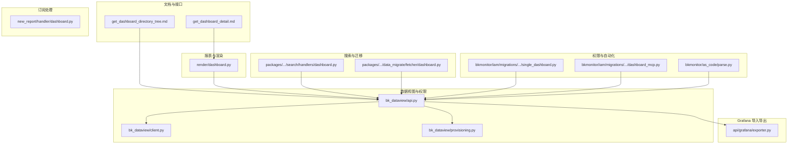
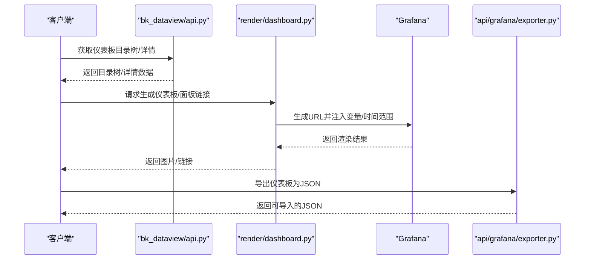
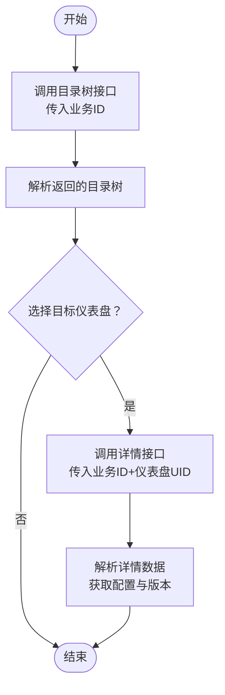
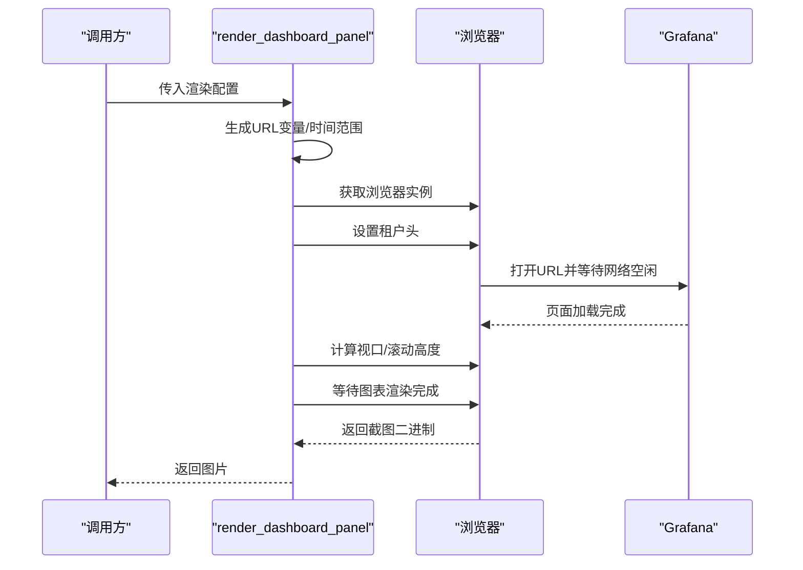
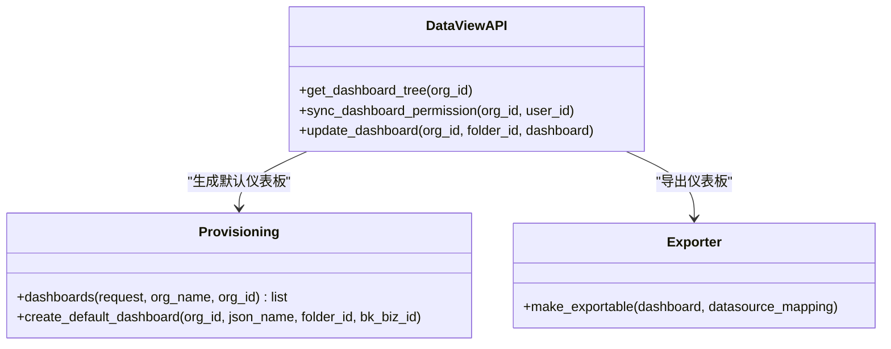
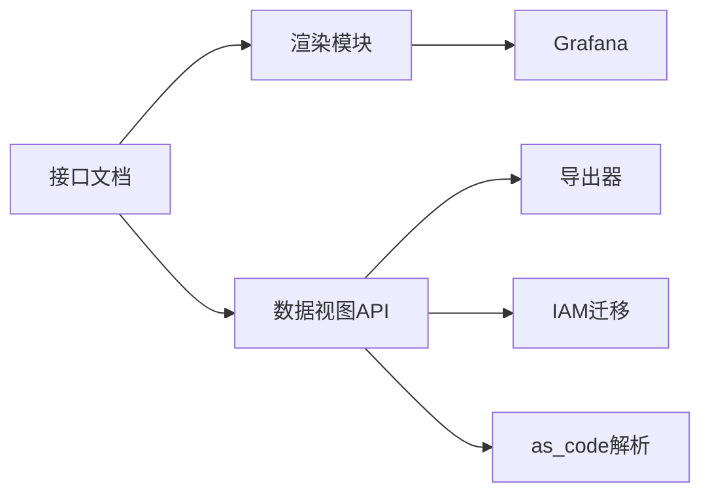

# 仪表板配置API

<cite>
**本文档引用的文件**
- [get_dashboard_detail.md](file://bkmonitor/docs/api/apidocs/zh_hans/get_dashboard_detail.md)
- [get_dashboard_directory_tree.md](file://bkmonitor/docs/api/apidocs/zh_hans/get_dashboard_directory_tree.md)
- [dashboard.py](file://bkmonitor/alarm_backends/service/report/render/dashboard.py)
- [dashboard.py](file://bkmonitor/alarm_backends/service/new_report/handler/dashboard.py)
- [api.py](file://bkmonitor/bk_dataview/api.py)
- [client.py](file://bkmonitor/bk_dataview/client.py)
- [provisioning.py](file://bkmonitor/bk_dataview/provisioning.py)
- [exporter.py](file://bkmonitor/api/grafana/exporter.py)
- [dashboard.py](file://bkmonitor/packages/monitor_web/search/handlers/dashboard.py)
- [dashboard.py](file://bkmonitor/packages/monitor_web/data_migrate/fetcher/dashboard.py)
- [dashboard.py](file://bkmonitor/bkmonitor/iam/migrations/0002_single_dashboard.py)
- [dashboard.py](file://bkmonitor/bkmonitor/iam/migrations/0005_dashboard_mcp.py)
- [dashboard.py](file://bkmonitor/bkmonitor/as_code/parse.py)
</cite>

## 目录
1. [简介](#简介)
2. [项目结构](#项目结构)
3. [核心组件](#核心组件)
4. [架构总览](#架构总览)
5. [详细组件分析](#详细组件分析)
6. [依赖分析](#依赖分析)
7. [性能考虑](#性能考虑)
8. [故障排查指南](#故障排查指南)
9. [结论](#结论)
10. [附录](#附录)

## 简介
本文件面向仪表板配置API的使用者与维护者，系统性梳理仪表板创建、布局配置、组件管理、分享设置、版本管理、批量更新、嵌入分享、跨空间访问、导入导出、组件库管理、主题定制等能力的接口实现与使用方法。文档基于仓库中的实际API定义与实现进行归纳，配合可视化图示帮助快速理解调用流程与数据结构。

## 项目结构
围绕仪表板能力，相关代码主要分布在以下模块：
- 文档与API说明：bkmonitor/docs/api/apidocs/zh_hans 下的仪表板接口文档
- 报表渲染与嵌入分享：alarm_backends/service/report/render/dashboard.py
- 仪表板订阅处理：alarm_backends/service/new_report/handler/dashboard.py
- 数据视图与权限：bk_dataview/api.py、client.py、provisioning.py
- Grafana 导出与导入：api/grafana/exporter.py
- 搜索与迁移：packages/monitor_web/search/handlers/dashboard.py、data_migrate/fetcher/dashboard.py
- 权限迁移与IAM：bkmonitor/bkmonitor/iam/migrations 下的仪表板权限迁移
- as_code 自动化：bkmonitor/bkmonitor/as_code/parse.py

**图表来源**
- [get_dashboard_detail.md:1-53](file://bkmonitor/docs/api/apidocs/zh_hans/get_dashboard_detail.md#L1-L53)
- [get_dashboard_directory_tree.md:1-72](file://bkmonitor/docs/api/apidocs/zh_hans/get_dashboard_directory_tree.md#L1-L72)
- [dashboard.py:1-180](file://bkmonitor/alarm_backends/service/report/render/dashboard.py#L1-L180)
- [dashboard.py:166-366](file://bkmonitor/bk_dataview/api.py#L166-L366)
- [client.py:113-113](file://bkmonitor/bk_dataview/client.py#L113-L113)
- [provisioning.py:70-166](file://bkmonitor/bk_dataview/provisioning.py#L70-L166)
- [exporter.py:87-87](file://bkmonitor/api/grafana/exporter.py#L87-L87)
- [dashboard.py](file://bkmonitor/packages/monitor_web/search/handlers/dashboard.py)
- [dashboard.py](file://bkmonitor/packages/monitor_web/data_migrate/fetcher/dashboard.py)
- [dashboard.py:21-21](file://bkmonitor/bkmonitor/iam/migrations/0002_single_dashboard.py#L21-L21)
- [dashboard.py:4-4](file://bkmonitor/bkmonitor/iam/migrations/0005_dashboard_mcp.py#L4-L4)
- [dashboard.py:310-310](file://bkmonitor/bkmonitor/as_code/parse.py#L310-L310)

**章节来源**
- [get_dashboard_detail.md:1-53](file://bkmonitor/docs/api/apidocs/zh_hans/get_dashboard_detail.md#L1-L53)
- [get_dashboard_directory_tree.md:1-72](file://bkmonitor/docs/api/apidocs/zh_hans/get_dashboard_directory_tree.md#L1-L72)

## 核心组件
- 仪表板详情与目录树接口：提供获取仪表板详情、目录树、以及基础字段说明
- 报表渲染与嵌入分享：支持生成仪表板/面板链接、截图渲染、变量注入、时间范围控制
- 数据视图与权限：提供仪表板树读取、权限同步、数据源映射
- Grafana 导入导出：支持将仪表板转换为可导入的JSON结构
- 权限与迁移：IAM迁移脚本负责仪表板权限初始化与升级
- as_code 自动化：支持从配置解析并同步Grafana仪表板

**章节来源**
- [get_dashboard_detail.md:1-53](file://bkmonitor/docs/api/apidocs/zh_hans/get_dashboard_detail.md#L1-L53)
- [get_dashboard_directory_tree.md:1-72](file://bkmonitor/docs/api/apidocs/zh_hans/get_dashboard_directory_tree.md#L1-L72)
- [dashboard.py:1-180](file://bkmonitor/alarm_backends/service/report/render/dashboard.py#L1-L180)
- [api.py:166-366](file://bkmonitor/bk_dataview/api.py#L166-L366)
- [exporter.py:87-87](file://bkmonitor/api/grafana/exporter.py#L87-L87)
- [dashboard.py:21-21](file://bkmonitor/bkmonitor/iam/migrations/0002_single_dashboard.py#L21-L21)
- [dashboard.py:4-4](file://bkmonitor/bkmonitor/iam/migrations/0005_dashboard_mcp.py#L4-L4)
- [dashboard.py:310-310](file://bkmonitor/bkmonitor/as_code/parse.py#L310-L310)

## 架构总览
仪表板配置API围绕“文档定义—渲染生成—数据视图—导入导出—权限治理—自动化同步”形成闭环。下图展示了关键交互：

**图表来源**
- [api.py:166-366](file://bkmonitor/bk_dataview/api.py#L166-L366)
- [dashboard.py:44-86](file://bkmonitor/alarm_backends/service/report/render/dashboard.py#L44-L86)
- [exporter.py:87-87](file://bkmonitor/api/grafana/exporter.py#L87-L87)

## 详细组件分析

### 仪表板详情与目录树接口
- 接口目标：获取指定业务下的仪表板目录树与单个仪表板详情
- 关键字段
  - 目录树：包含分类标题、仪表盘列表（含ID、UID、标题、URI、URL、slug、标签、收藏与可编辑状态）
  - 详情：包含ID、UID、标题、配置数据、版本、slug等
- 认证与权限：目录树接口要求在请求头中携带用户身份信息以校验权限
- 使用建议：先拉取目录树进行导航，再按UID获取详情进行配置读取

**图表来源**
- [get_dashboard_directory_tree.md:1-72](file://bkmonitor/docs/api/apidocs/zh_hans/get_dashboard_directory_tree.md#L1-L72)
- [get_dashboard_detail.md:1-53](file://bkmonitor/docs/api/apidocs/zh_hans/get_dashboard_detail.md#L1-L53)

**章节来源**
- [get_dashboard_directory_tree.md:1-72](file://bkmonitor/docs/api/apidocs/zh_hans/get_dashboard_directory_tree.md#L1-L72)
- [get_dashboard_detail.md:1-53](file://bkmonitor/docs/api/apidocs/zh_hans/get_dashboard_detail.md#L1-L53)

### 报表渲染与嵌入分享
- 能力概览：生成仪表板/面板链接、注入变量与时间范围、按需截图、支持透明背景与质量控制
- 关键配置项
  - 租户ID、业务ID、仪表盘UID、面板ID（可选）、宽高、缩放比例、图片格式与质量、透明背景、变量字典、起止时间
- 渲染流程
  - 生成URL（支持外部/内部路径、单面板/全屏模式、变量拼接、时间戳拼接）
  - 获取浏览器实例，设置额外HTTP头（如租户ID），打开URL并等待网络空闲
  - 计算滚动高度以适配全屏截图；单面板模式按指定选择器定位
  - 等待图表渲染完成，截图并返回二进制图片

**图表来源**
- [dashboard.py:44-86](file://bkmonitor/alarm_backends/service/report/render/dashboard.py#L44-L86)
- [dashboard.py:89-159](file://bkmonitor/alarm_backends/service/report/render/dashboard.py#L89-L159)
- [dashboard.py:162-179](file://bkmonitor/alarm_backends/service/report/render/dashboard.py#L162-L179)

**章节来源**
- [dashboard.py:1-180](file://bkmonitor/alarm_backends/service/report/render/dashboard.py#L1-L180)

### 数据视图与权限
- 目录树与权限
  - 提供获取仪表板树的方法，支持权限同步与用户动作集合计算
  - 支持将数据源映射到仪表板，便于后续导入导出
- 权限同步
  - 通过权限同步函数将用户对仪表板的操作权限写入系统
- 数据源映射
  - 在导出时将数据源名称映射为可导入的标识，确保导入后可用

**图表来源**
- [api.py:166-366](file://bkmonitor/bk_dataview/api.py#L166-L366)
- [client.py:113-113](file://bkmonitor/bk_dataview/client.py#L113-L113)
- [provisioning.py:70-166](file://bkmonitor/bk_dataview/provisioning.py#L70-L166)
- [exporter.py:87-87](file://bkmonitor/api/grafana/exporter.py#L87-L87)

**章节来源**
- [api.py:166-366](file://bkmonitor/bk_dataview/api.py#L166-L366)
- [client.py:113-113](file://bkmonitor/bk_dataview/client.py#L113-L113)
- [provisioning.py:70-166](file://bkmonitor/bk_dataview/provisioning.py#L70-L166)
- [exporter.py:87-87](file://bkmonitor/api/grafana/exporter.py#L87-L87)

### 权限迁移与IAM
- 迁移脚本负责仪表板权限的初始化与升级，确保不同版本间权限模型一致
- 单仪表板权限与多租户/跨空间权限的迁移逻辑分别在对应迁移文件中实现

**章节来源**
- [dashboard.py:21-21](file://bkmonitor/bkmonitor/iam/migrations/0002_single_dashboard.py#L21-L21)
- [dashboard.py:4-4](file://bkmonitor/bkmonitor/iam/migrations/0005_dashboard_mcp.py#L4-L4)

### as_code 自动化与仪表板同步
- 通过解析配置，将仪表板同步到Grafana，支持批量更新与版本管理
- 适用于CI/CD流水线中的自动化部署

**章节来源**
- [dashboard.py:310-310](file://bkmonitor/bkmonitor/as_code/parse.py#L310-L310)

## 依赖分析
- 文档层：接口定义位于文档目录，作为API契约指导前后端对接
- 渲染层：渲染模块依赖浏览器环境与Grafana前端，输出图片或链接
- 视图层：数据视图模块负责目录树、权限与数据源映射
- 导出层：Grafana导出器负责将仪表板结构转换为可导入格式
- 权限层：IAM迁移脚本保障权限模型演进
- 自动化层：as_code解析器驱动仪表板的自动化同步

**图表来源**
- [get_dashboard_detail.md:1-53](file://bkmonitor/docs/api/apidocs/zh_hans/get_dashboard_detail.md#L1-L53)
- [get_dashboard_directory_tree.md:1-72](file://bkmonitor/docs/api/apidocs/zh_hans/get_dashboard_directory_tree.md#L1-L72)
- [dashboard.py:1-180](file://bkmonitor/alarm_backends/service/report/render/dashboard.py#L1-L180)
- [api.py:166-366](file://bkmonitor/bk_dataview/api.py#L166-L366)
- [exporter.py:87-87](file://bkmonitor/api/grafana/exporter.py#L87-L87)
- [dashboard.py:21-21](file://bkmonitor/bkmonitor/iam/migrations/0002_single_dashboard.py#L21-L21)
- [dashboard.py:310-310](file://bkmonitor/bkmonitor/as_code/parse.py#L310-L310)

## 性能考虑
- 渲染性能
  - 缩放比例与图片质量成正比，建议在满足清晰度的前提下降低scale与quality以减少体积
  - 单面板渲染时可避免全屏滚动高度计算，提升响应速度
- 网络与超时
  - 渲染超时可按图表复杂度调整，避免过短导致截图为部分渲染
- 导出与导入
  - 大量仪表板导入时建议分批处理，避免一次性请求过大导致内存压力

## 故障排查指南
- 渲染失败
  - 现象：等待渲染超时或截图目标不存在
  - 排查：检查URL生成是否正确、变量与时间范围是否合法、浏览器实例是否可用
- 权限不足
  - 现象：目录树或详情接口返回无权限
  - 排查：确认请求头中用户身份信息是否正确、IAM迁移是否完成
- 导出异常
  - 现象：导出后的仪表板无法导入
  - 排查：核对数据源映射是否正确、导出结构是否符合Grafana规范

**章节来源**
- [dashboard.py:100-159](file://bkmonitor/alarm_backends/service/report/render/dashboard.py#L100-L159)
- [api.py:166-366](file://bkmonitor/bk_dataview/api.py#L166-L366)
- [exporter.py:87-87](file://bkmonitor/api/grafana/exporter.py#L87-L87)

## 结论
本API体系覆盖了仪表板从“创建—布局—组件—分享—版本—导入导出—权限—自动化”的全链路能力。通过接口文档、渲染模块、数据视图与导出器的协同，能够满足企业级仪表板的日常运维与自动化需求。建议在生产环境中结合权限迁移与as_code自动化，确保配置的一致性与可追溯性。

## 附录
- 常用接口清单
  - 获取仪表板目录树：传入业务ID，返回目录树与仪表盘列表
  - 获取仪表板详情：传入业务ID与仪表盘UID，返回配置与版本
  - 生成仪表板/面板链接：传入渲染配置，返回可访问URL
  - 导出仪表板：传入仪表板与数据源映射，返回可导入JSON
- 最佳实践
  - 先目录树导航，再详情读取，最后按需渲染或导出
  - 对复杂图表适当提高渲染超时与缩放比例
  - 使用as_code统一管理仪表板变更，配合IAM迁移保证权限一致