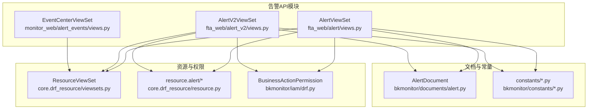
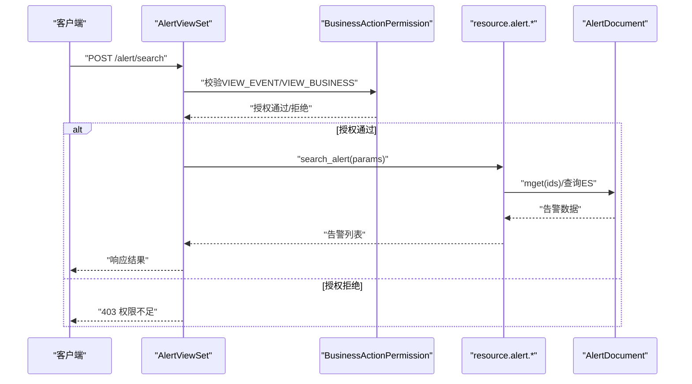
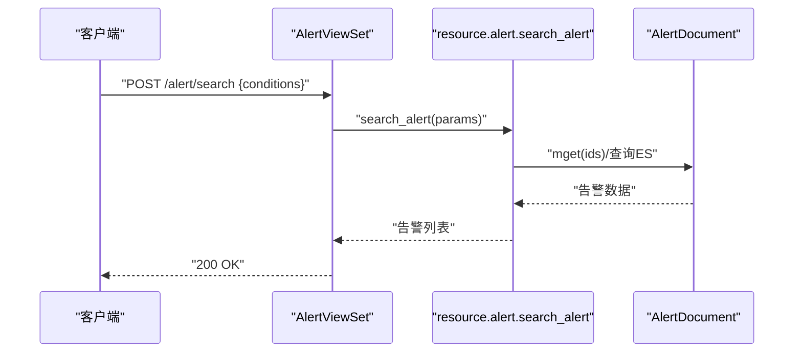
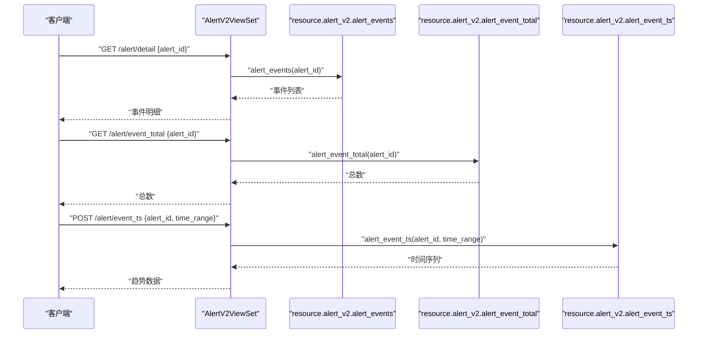
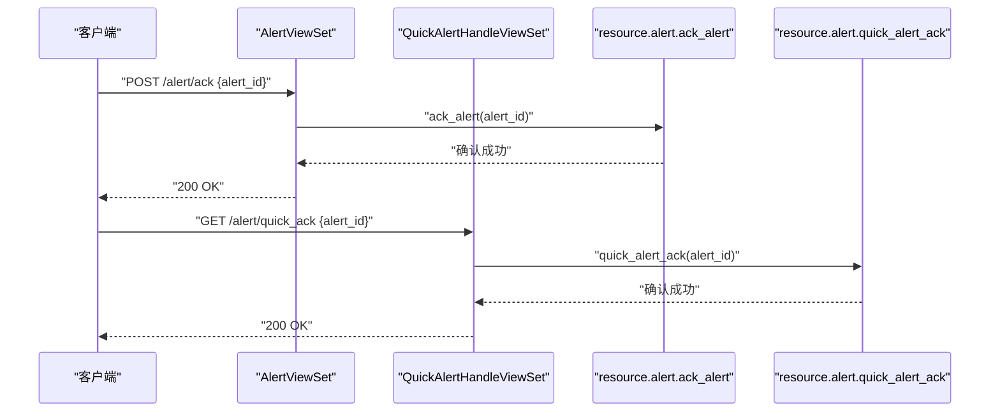
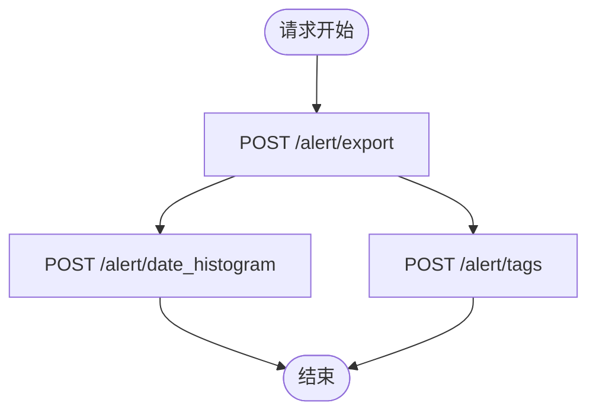
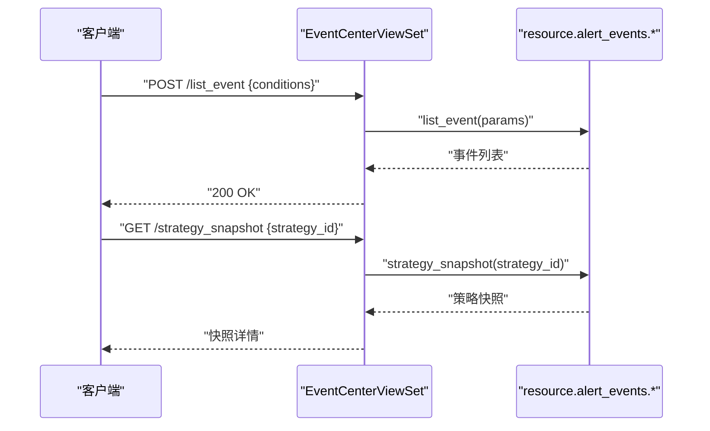
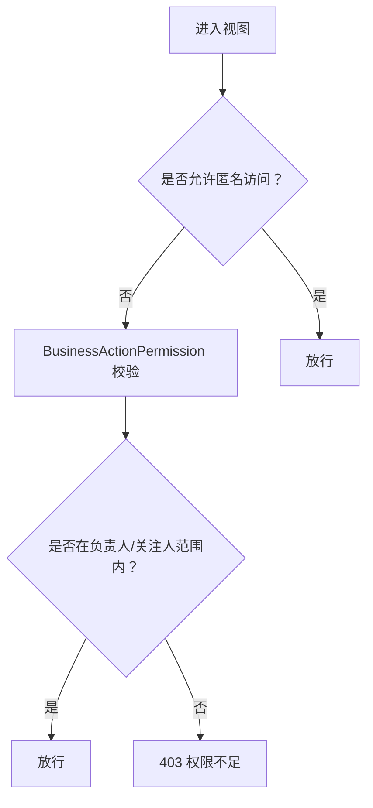
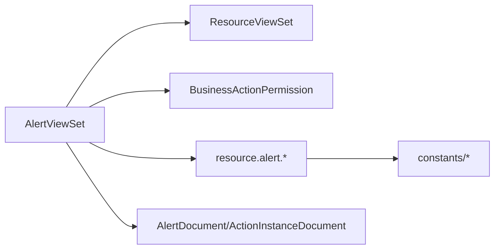

# 告警管理API

<cite>
**本文引用的文件**
- [fta_web/alert/views.py](file://bkmonitor/packages/fta_web/alert/views.py)
- [fta_web/alert_v2/views.py](file://bkmonitor/packages/fta_web/alert_v2/views.py)
- [fta_web/alert/events/views.py](file://bkmonitor/packages/monitor_web/alert_events/views.py)
- [core.drf_resource/viewsets.py](file://bkmonitor/core/drf_resource/viewsets.py)
- [core.drf_resource/resource.py](file://bkmonitor/core/drf_resource/resource.py)
- [bkmonitor/iam/drf.py](file://bkmonitor/bkmonitor/iam/drf.py)
- [bkmonitor/documents/alert.py](file://bkmonitor/bkmonitor/documents/alert.py)
- [bkmonitor/constants/alert.py](file://bkmonitor/bkmonitor/constants/alert.py)
- [bkmonitor/constants/action.py](file://bkmonitor/bkmonitor/constants/action.py)
- [bkmonitor/constants/strategy.py](file://bkmonitor/bkmonitor/constants/strategy.py)
- [bkmonitor/constants/common.py](file://bkmonitor/bkmonitor/constants/common.py)
- [bkmonitor/constants/event.py](file://bkmonitor/bkmonitor/constants/event.py)
- [bkmonitor/constants/incident.py](file://bkmonitor/bkmonitor/constants/incident.py)
- [bkmonitor/constants/issue.py](file://bkmonitor/bkmonitor/constants/issue.py)
- [bkmonitor/constants/report.py](file://bkmonitor/bkmonitor/constants/report.py)
- [bkmonitor/constants/shield.py](file://bkmonitor/bkmonitor/constants/shield.py)
- [bkmonitor/constants/view.py](file://bkmonitor/bkmonitor/constants/view.py)
- [bkmonitor/constants/query_template.py](file://bkmonitor/bkmonitor/constants/query_template.py)
- [bkmonitor/constants/new_report.py](file://bkmonitor/bkmonitor/constants/new_report.py)
- [bkmonitor/constants/data_source.py](file://bkmonitor/bkmonitor/constants/data_source.py)
- [bkmonitor/constants/elasticsearch.py](file://bkmonitor/bkmonitor/constants/elasticsearch.py)
- [bkmonitor/constants/result_table.py](file://bkmonitor/bkmonitor/constants/result_table.py)
- [bkmonitor/constants/mcp.py](file://bkmonitor/bkmonitor/constants/mcp.py)
- [bkmonitor/constants/aiops.py](file://bkmonitor/bkmonitor/constants/aiops.py)
- [bkmonitor/constants/apm.py](file://bkmonitor/bkmonitor/constants/apm.py)
- [bkmonitor/constants/bk_collector.py](file://bkmonitor/bkmonitor/constants/bk_collector.py)
- [bkmonitor/constants/cmdb.py](file://bkmonitor/bkmonitor/constants/cmdb.py)
- [bkmonitor/constants/dataflow.py](file://bkmonitor/bkmonitor/constants/dataflow.py)
- [bkmonitor/constants/monitor.py](file://bkmonitor/bkmonitor/constants/monitor.py)
- [bkmonitor/constants/plan.py](file://bkmonitor/bkmonitor/constants/plan.py)
- [bkmonitor/constants/space.py](file://bkmonitor/bkmonitor/constants/space.py)
- [bkmonitor/constants/template.py](file://bkmonitor/bkmonitor/constants/template.py)
- [bkmonitor/constants/unit.py](file://bkmonitor/bkmonitor/constants/unit.py)
- [bkmonitor/constants/view.py](file://bkmonitor/bkmonitor/constants/view.py)
- [bkmonitor/constants/zone.py](file://bkmonitor/bkmonitor/constants/zone.py)
- [bkmonitor/constants/zone.py](file://bkmonitor/bkmonitor/constants/zone.py)
</cite>

## 目录
1. [简介](#简介)
2. [项目结构](#项目结构)
3. [核心组件](#核心组件)
4. [架构总览](#架构总览)
5. [详细组件分析](#详细组件分析)
6. [依赖分析](#依赖分析)
7. [性能考虑](#性能考虑)
8. [故障排查指南](#故障排查指南)
9. [结论](#结论)
10. [附录](#附录)

## 简介
本文件面向告警管理API的使用者与维护者，系统性梳理告警查询、告警处理、告警策略配置、告警收敛与通知等能力的接口定义与调用流程。重点覆盖：
- 告警列表查询：支持按状态、时间、级别等条件筛选
- 告警详情获取与事件明细
- 告警确认/关闭、快捷处理
- 批量处理与导出
- 告警状态流转、处理人分配、收敛规则
- 告警规则配置与策略快照
- 历史告警查询与趋势分析

## 项目结构
告警相关API主要由以下模块构成：
- 视图层：fta_web.alert.views、fta_web.alert_v2.views、monitor_web.alert_events.views
- 资源路由：core.drf_resource.viewsets.ResourceViewSet 与 ResourceRoute
- 权限控制：bkmonitor.iam.drf.BusinessActionPermission
- 文档模型：bkmonitor.documents.AlertDocument、ActionInstanceDocument
- 常量与领域模型：bkmonitor.constants 下各模块

**图表来源**
- [fta_web/alert/views.py:174-225](file://bkmonitor/packages/fta_web/alert/views.py#L174-L225)
- [fta_web/alert_v2/views.py:22-40](file://bkmonitor/packages/fta_web/alert_v2/views.py#L22-L40)
- [monitor_web/alert_events/views.py:18-55](file://bkmonitor/packages/monitor_web/alert_events/views.py#L18-L55)
- [core.drf_resource/viewsets.py](file://bkmonitor/core/drf_resource/viewsets.py)
- [core.drf_resource/resource.py](file://bkmonitor/core/drf_resource/resource.py)
- [bkmonitor/iam/drf.py](file://bkmonitor/bkmonitor/iam/drf.py)
- [bkmonitor/documents/alert.py](file://bkmonitor/bkmonitor/documents/alert.py)

**章节来源**
- [fta_web/alert/views.py:174-225](file://bkmonitor/packages/fta_web/alert/views.py#L174-L225)
- [fta_web/alert_v2/views.py:22-40](file://bkmonitor/packages/fta_web/alert_v2/views.py#L22-L40)
- [monitor_web/alert_events/views.py:18-55](file://bkmonitor/packages/monitor_web/alert_events/views.py#L18-L55)

## 核心组件
- AlertViewSet：提供告警查询、详情、确认、导出、标签、时间序列、事件关联、快捷屏蔽/确认、反馈、维度下钻、指标推荐等接口
- AlertV2ViewSet：在V1基础上扩展事件明细、时序、标签详情、K8s/主机目标、链路追踪、日志关联等接口
- EventCenterViewSet：提供事件中心接口，包含事件列表、策略快照、通知详情、收敛日志、趋势图、屏蔽快照、主机索引查询等

**章节来源**
- [fta_web/alert/views.py:29-225](file://bkmonitor/packages/fta_web/alert/views.py#L29-L225)
- [fta_web/alert_v2/views.py:22-57](file://bkmonitor/packages/fta_web/alert_v2/views.py#L22-L57)
- [monitor_web/alert_events/views.py:18-55](file://bkmonitor/packages/monitor_web/alert_events/views.py#L18-L55)

## 架构总览
告警API采用“视图集 + 资源路由 + 权限校验”的分层设计：
- 视图集定义资源端点与权限
- ResourceRoute 将HTTP端点映射到资源层方法
- 权限通过 BusinessActionPermission 控制业务操作
- 文档模型用于快速检索与权限判定

**图表来源**
- [fta_web/alert/views.py:132-173](file://bkmonitor/packages/fta_web/alert/views.py#L132-L173)
- [fta_web/alert/views.py:174-225](file://bkmonitor/packages/fta_web/alert/views.py#L174-L225)
- [bkmonitor/iam/drf.py](file://bkmonitor/bkmonitor/iam/drf.py)
- [bkmonitor/documents/alert.py](file://bkmonitor/bkmonitor/documents/alert.py)

## 详细组件分析

### 告警查询与筛选
- 端点：POST /alert/search
- 功能：支持按状态、时间范围、级别、标签等条件查询告警列表
- 权限：VIEW_EVENT 或 VIEW_BUSINESS
- 返回：告警列表、分页信息、聚合统计

**图表来源**
- [fta_web/alert/views.py:177](file://bkmonitor/packages/fta_web/alert/views.py#L177)
- [core.drf_resource/resource.py](file://bkmonitor/core/drf_resource/resource.py)

**章节来源**
- [fta_web/alert/views.py:174-225](file://bkmonitor/packages/fta_web/alert/views.py#L174-L225)

### 告警详情与事件明细
- 端点：GET /alert/detail
- 功能：获取单条告警详情
- 端点：POST /alert/events
- 功能：获取告警事件明细列表
- 端点：GET /alert/event_total
- 功能：获取事件总数
- 端点：POST /alert/event_ts
- 功能：事件时间序列

**图表来源**
- [fta_web/alert_v2/views.py:28-40](file://bkmonitor/packages/fta_web/alert_v2/views.py#L28-L40)
- [core.drf_resource/resource.py](file://bkmonitor/core/drf_resource/resource.py)

**章节来源**
- [fta_web/alert_v2/views.py:22-40](file://bkmonitor/packages/fta_web/alert_v2/views.py#L22-L40)

### 告警确认/关闭与快捷处理
- 端点：POST /alert/ack
- 功能：告警确认
- 端点：GET /alert/quick_ack
- 功能：快捷确认
- 端点：GET /alert/quick_shield
- 功能：快捷屏蔽

**图表来源**
- [fta_web/alert/views.py:190](file://bkmonitor/packages/fta_web/alert/views.py#L190)
- [fta_web/alert/views.py:231-234](file://bkmonitor/packages/fta_web/alert/views.py#L231-L234)
- [core.drf_resource/resource.py](file://bkmonitor/core/drf_resource/resource.py)

**章节来源**
- [fta_web/alert/views.py:174-225](file://bkmonitor/packages/fta_web/alert/views.py#L174-L225)
- [fta_web/alert/views.py:228-234](file://bkmonitor/packages/fta_web/alert/views.py#L228-L234)

### 导出、标签与时间序列
- 端点：POST /alert/export
- 功能：导出告警列表
- 端点：POST /alert/tags
- 功能：获取告警标签
- 端点：POST /alert/date_histogram
- 功能：告警时间分布直方图

**图表来源**
- [fta_web/alert/views.py:177-180](file://bkmonitor/packages/fta_web/alert/views.py#L177-L180)
- [fta_web/alert/views.py:181-183](file://bkmonitor/packages/fta_web/alert/views.py#L181-L183)

**章节来源**
- [fta_web/alert/views.py:174-225](file://bkmonitor/packages/fta_web/alert/views.py#L174-L225)

### 事件中心与收敛
- 端点：POST /list_event
- 功能：事件列表
- 端点：GET /strategy_snapshot
- 功能：策略配置快照
- 端点：GET /list_converge_log
- 功能：收敛日志
- 端点：GET /shield_snapshot
- 功能：屏蔽快照

**图表来源**
- [monitor_web/alert_events/views.py:24-48](file://bkmonitor/packages/monitor_web/alert_events/views.py#L24-L48)
- [core.drf_resource/resource.py](file://bkmonitor/core/drf_resource/resource.py)

**章节来源**
- [monitor_web/alert_events/views.py:18-55](file://bkmonitor/packages/monitor_web/alert_events/views.py#L18-L55)

### 权限与处理人分配
- 权限控制：通过 BusinessActionPermission 校验 VIEW_EVENT/VIEW_BUSINESS
- 处理人判定：基于 AlertDocument 中的 assignee、appointee、supervisor、follower 字段进行细粒度授权
- 快捷处理：支持 quick_ack、quick_shield

**图表来源**
- [fta_web/alert/views.py:132-173](file://bkmonitor/packages/fta_web/alert/views.py#L132-L173)
- [fta_web/alert/views.py:29-100](file://bkmonitor/packages/fta_web/alert/views.py#L29-L100)
- [bkmonitor/iam/drf.py](file://bkmonitor/bkmonitor/iam/drf.py)
- [bkmonitor/documents/alert.py](file://bkmonitor/bkmonitor/documents/alert.py)

**章节来源**
- [fta_web/alert/views.py:29-100](file://bkmonitor/packages/fta_web/alert/views.py#L29-L100)
- [fta_web/alert/views.py:132-173](file://bkmonitor/packages/fta_web/alert/views.py#L132-L173)

## 依赖分析
- 视图集依赖 ResourceViewSet 与 ResourceRoute 进行端点注册
- 权限依赖 IAM 模块进行业务动作授权
- 数据依赖 AlertDocument、ActionInstanceDocument 进行快速检索与权限判定
- 常量模块提供告警、事件、策略、动作等领域的枚举与默认值

**图表来源**
- [fta_web/alert/views.py:174-225](file://bkmonitor/packages/fta_web/alert/views.py#L174-L225)
- [core.drf_resource/viewsets.py](file://bkmonitor/core/drf_resource/viewsets.py)
- [bkmonitor/iam/drf.py](file://bkmonitor/bkmonitor/iam/drf.py)
- [bkmonitor/documents/alert.py](file://bkmonitor/bkmonitor/documents/alert.py)
- [bkmonitor/constants/alert.py](file://bkmonitor/bkmonitor/constants/alert.py)

**章节来源**
- [fta_web/alert/views.py:174-225](file://bkmonitor/packages/fta_web/alert/views.py#L174-L225)

## 性能考虑
- 使用 ResourceViewSet 的批量查询与分页策略，避免一次性加载过多数据
- 对高并发场景下的权限校验与文档检索进行缓存优化
- 时间序列与直方图类接口建议限制时间窗口，防止超大数据量查询
- 导出接口建议异步化，避免阻塞主请求线程

## 故障排查指南
- 权限错误：检查用户是否具备 VIEW_EVENT/VIEW_BUSINESS 权限；确认是否在负责人/关注人范围内
- 查询无结果：核对时间范围、状态、级别等筛选条件；确认索引与数据是否正常
- 导出失败：检查导出任务队列与存储空间；确认查询条件是否过于宽泛
- 快捷处理失败：确认 alert_id 是否有效；检查 quick_ack/quick_shield 的可用性

**章节来源**
- [fta_web/alert/views.py:132-173](file://bkmonitor/packages/fta_web/alert/views.py#L132-L173)
- [fta_web/alert/views.py:174-225](file://bkmonitor/packages/fta_web/alert/views.py#L174-L225)

## 结论
告警管理API通过清晰的视图集与资源路由设计，结合严格的权限控制与文档检索机制，提供了完整的告警查询、处理、收敛与配置能力。建议在生产环境中配合缓存、异步导出与合理的查询窗口，确保高并发下的稳定性与性能。

## 附录
- 常用端点一览
  - 查询告警：POST /alert/search
  - 导出告警：POST /alert/export
  - 告警详情：GET /alert/detail
  - 告警确认：POST /alert/ack
  - 快捷确认：GET /alert/quick_ack
  - 快捷屏蔽：GET /alert/quick_shield
  - 事件列表：POST /list_event
  - 策略快照：GET /strategy_snapshot
  - 收敛日志：GET /list_converge_log
  - 屏蔽快照：GET /shield_snapshot
  - 事件明细：POST /alert/events
  - 事件总数：GET /alert/event_total
  - 事件时序：POST /alert/event_ts