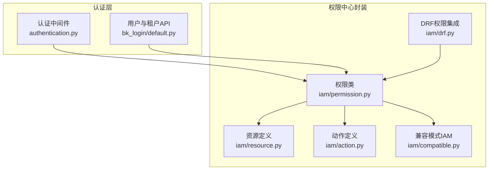
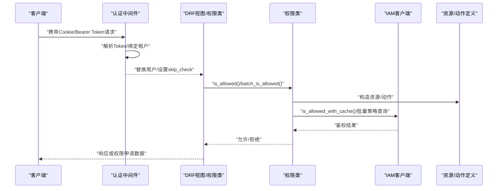
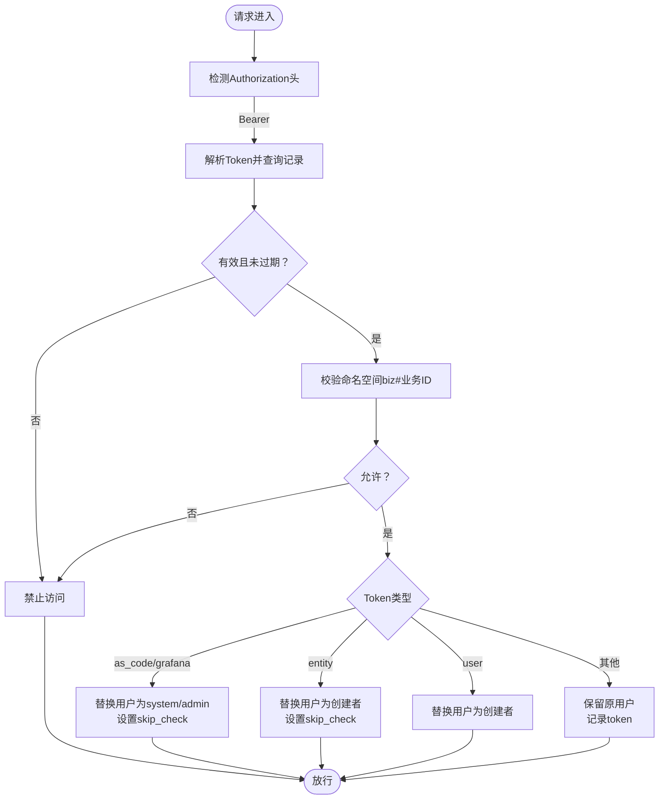
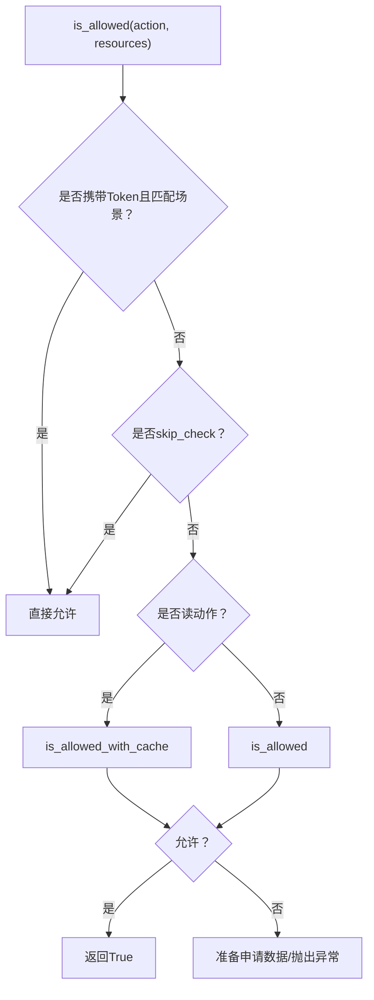
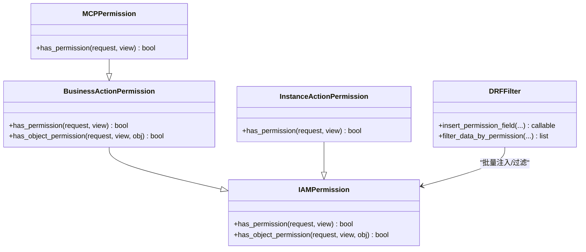
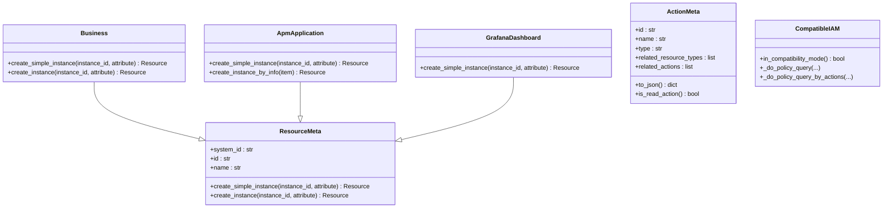
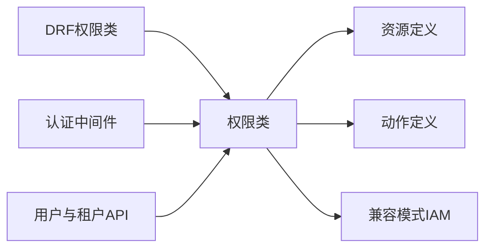

# 用户权限API

<cite>
**本文引用的文件**
- [bkmonitor\bkmonitor\iam\permission.py](file://bkmonitor\bkmonitor\iam\permission.py)
- [bkmonitor\bkmonitor\iam\drf.py](file://bkmonitor\bkmonitor\iam\drf.py)
- [bkmonitor\bkmonitor\iam\resource.py](file://bkmonitor\bkmonitor\iam\resource.py)
- [bkmonitor\bkmonitor\iam\action.py](file://bkmonitor\bkmonitor\iam\action.py)
- [bkmonitor\bkmonitor\iam\compatible.py](file://bkmonitor\bkmonitor\iam\compatible.py)
- [bkmonitor\bkmonitor\middlewares\authentication.py](file://bkmonitor\bkmonitor\middlewares\authentication.py)
- [bkmonitor\api\bk_login\default.py](file://bkmonitor\api\bk_login\default.py)
</cite>

## 目录
1. [简介](#简介)
2. [项目结构](#项目结构)
3. [核心组件](#核心组件)
4. [架构总览](#架构总览)
5. [详细组件分析](#详细组件分析)
6. [依赖分析](#依赖分析)
7. [性能考虑](#性能考虑)
8. [故障排查指南](#故障排查指南)
9. [结论](#结论)
10. [附录](#附录)

## 简介
本文件面向用户权限API接口，聚焦于认证、权限校验、角色与资源授权、审计与缓存策略等安全能力。文档覆盖以下主题：
- 登录认证：支持 Cookie 会话与 Bearer Token 两种模式；支持多租户场景下的租户绑定与隔离。
- 权限校验：基于 IAM 的细粒度动作与资源授权，支持读写分离、批量鉴权、权限豁免与动态权限配置。
- 资源授权：业务空间、仪表盘、APM 应用等资源实例的权限表达与路径构建。
- 审计与缓存：读权限缓存、兼容模式策略合并、权限申请与跳转。
- 多租户隔离：租户 ID 绑定、API Token 租户校验、空间与业务映射。
- 动态权限配置：MCP 权限检查、按请求头动态选择动作、批量注入权限字段。
- 用户组与模板：权限申请数据生成、SaaS 空间批量申请、最小权限集合。

## 项目结构
围绕用户权限的核心代码主要分布在以下模块：
- 认证中间件：处理 Cookie 会话与 Bearer Token 的登录与租户绑定。
- 权限中心封装：统一 IAM 客户端、权限校验、批量鉴权、权限申请与缓存。
- DRF 集成：权限类、资源权限装饰器、批量注入权限字段与数据过滤。
- 资源与动作：资源类型定义、动作枚举与依赖关系、兼容模式适配。
- 用户与租户：用户信息查询、租户列表、部门与显示信息。

**图表来源**
- [bkmonitor\bkmonitor\middlewares\authentication.py:1-140](file://bkmonitor\bkmonitor\middlewares\authentication.py#L1-L140)
- [bkmonitor\api\bk_login\default.py:1-334](file://bkmonitor\api\bk_login\default.py#L1-L334)
- [bkmonitor\bkmonitor\iam\permission.py:1-519](file://bkmonitor\bkmonitor\iam\permission.py#L1-L519)
- [bkmonitor\bkmonitor\iam\drf.py:1-363](file://bkmonitor\bkmonitor\iam\drf.py#L1-L363)
- [bkmonitor\bkmonitor\iam\resource.py:1-214](file://bkmonitor\bkmonitor\iam\resource.py#L1-L214)
- [bkmonitor\bkmonitor\iam\action.py:1-681](file://bkmonitor\bkmonitor\iam\action.py#L1-L681)
- [bkmonitor\bkmonitor\iam\compatible.py:1-158](file://bkmonitor\bkmonitor\iam\compatible.py#L1-L158)

**章节来源**
- [bkmonitor\bkmonitor\middlewares\authentication.py:1-140](file://bkmonitor\bkmonitor\middlewares\authentication.py#L1-L140)
- [bkmonitor\api\bk_login\default.py:1-334](file://bkmonitor\api\bk_login\default.py#L1-L334)
- [bkmonitor\bkmonitor\iam\permission.py:1-519](file://bkmonitor\bkmonitor\iam\permission.py#L1-L519)
- [bkmonitor\bkmonitor\iam\drf.py:1-363](file://bkmonitor\bkmonitor\iam\drf.py#L1-L363)
- [bkmonitor\bkmonitor\iam\resource.py:1-214](file://bkmonitor\bkmonitor\iam\resource.py#L1-L214)
- [bkmonitor\bkmonitor\iam\action.py:1-681](file://bkmonitor\bkmonitor\iam\action.py#L1-L681)
- [bkmonitor\bkmonitor\iam\compatible.py:1-158](file://bkmonitor\bkmonitor\iam\compatible.py#L1-L158)

## 核心组件
- 权限类 Permission：封装 IAM 客户端、动作与资源请求构造、批量鉴权、权限申请、读权限缓存、SaaS 空间批量申请、空间权限过滤等。
- DRF 权限类：IAMPermission、BusinessActionPermission、MCPPermission、InstanceActionPermission 及批量注入与过滤工具。
- 资源定义 ResourceMeta：业务空间、仪表盘、APM 应用等资源实例创建与属性填充。
- 动作定义 ActionMeta：动作枚举、动作依赖、兼容模式动作映射。
- 兼容模式 IAM：IAM_V1/V2 兼容、策略表达式转换、批量策略查询合并。
- 认证中间件：Bearer Token 校验、租户绑定、用户替换、权限豁免标记。
- 用户与租户 API：租户列表、用户信息、部门与显示信息查询。

**章节来源**
- [bkmonitor\bkmonitor\iam\permission.py:83-519](file://bkmonitor\bkmonitor\iam\permission.py#L83-L519)
- [bkmonitor\bkmonitor\iam\drf.py:34-363](file://bkmonitor\bkmonitor\iam\drf.py#L34-L363)
- [bkmonitor\bkmonitor\iam\resource.py:27-214](file://bkmonitor\bkmonitor\iam\resource.py#L27-L214)
- [bkmonitor\bkmonitor\iam\action.py:18-681](file://bkmonitor\bkmonitor\iam\action.py#L18-L681)
- [bkmonitor\bkmonitor\iam\compatible.py:20-158](file://bkmonitor\bkmonitor\iam\compatible.py#L20-L158)
- [bkmonitor\bkmonitor\middlewares\authentication.py:30-140](file://bkmonitor\bkmonitor\middlewares\authentication.py#L30-L140)
- [bkmonitor\api\bk_login\default.py:48-334](file://bkmonitor\api\bk_login\default.py#L48-L334)

## 架构总览
用户权限API的整体流程如下：
- 请求进入后，认证中间件根据请求头判断是否为 Bearer Token，并完成租户绑定与用户替换。
- 视图层通过 DRF 权限类或 Permission 类进行权限校验；读权限走缓存，写权限直连 IAM。
- 资源与动作通过 ResourceMeta 与 ActionMeta 统一构造，兼容模式处理 V1/V2 差异。
- 无权限时生成权限申请数据与链接，或抛出统一错误。

**图表来源**
- [bkmonitor\bkmonitor\middlewares\authentication.py:49-123](file://bkmonitor\bkmonitor\middlewares\authentication.py#L49-L123)
- [bkmonitor\bkmonitor\iam\drf.py:34-130](file://bkmonitor\bkmonitor\iam\drf.py#L34-L130)
- [bkmonitor\bkmonitor\iam\permission.py:293-421](file://bkmonitor\bkmonitor\iam\permission.py#L293-L421)
- [bkmonitor\bkmonitor\iam\resource.py:47-109](file://bkmonitor\bkmonitor\iam\resource.py#L47-L109)
- [bkmonitor\bkmonitor\iam\action.py:578-617](file://bkmonitor\bkmonitor\iam\action.py#L578-L617)

## 详细组件分析

### 认证中间件与登录
- Bearer Token 认证：从 Authorization 头提取 Token，查询 ApiAuthToken，校验有效期与命名空间，按类型替换用户并设置 skip_check 或保留原用户。
- Cookie 会话：继承 LoginRequiredMiddleware，结合 SessionAuthentication 与 CSRF 放行。
- 租户绑定：确保 request.user.tenant_id 与配置一致，非多租户模式下统一为默认租户 ID。

**图表来源**
- [bkmonitor\bkmonitor\middlewares\authentication.py:49-96](file://bkmonitor\bkmonitor\middlewares\authentication.py#L49-L96)

**章节来源**
- [bkmonitor\bkmonitor\middlewares\authentication.py:25-140](file://bkmonitor\bkmonitor\middlewares\authentication.py#L25-L140)

### 权限校验与缓存
- 读权限缓存：is_allowed 对读动作使用 is_allowed_with_cache，显著降低 IAM 查询压力。
- 批量鉴权：batch_is_allowed 支持多资源多动作的批量校验，提升接口性能。
- 权限豁免：开发环境 SKIP_IAM_PERMISSION_CHECK、Token 类型为特定场景时 skip_check。
- SaaS 空间批量申请：prepare_apply_for_saas 为业务空间批量生成最小权限申请数据。

**图表来源**
- [bkmonitor\bkmonitor\iam\permission.py:293-359](file://bkmonitor\bkmonitor\iam\permission.py#L293-L359)
- [bkmonitor\bkmonitor\iam\permission.py:386-421](file://bkmonitor\bkmonitor\iam\permission.py#L386-L421)

**章节来源**
- [bkmonitor\bkmonitor\iam\permission.py:293-421](file://bkmonitor\bkmonitor\iam\permission.py#L293-L421)

### DRF 权限集成与动态权限
- IAMPermission：对多个动作依次尝试，任一通过即放行。
- BusinessActionPermission：自动注入业务资源实例，支持对象级权限。
- MCPPermission：根据请求头动态选择动作（如 USING_DASHBOARD_MCP），并强制业务上下文。
- InstanceActionPermission：从 URL 参数或请求数据中提取实例 ID，注入资源实例。
- 批量注入权限字段：insert_permission_field 在响应中批量注入 permission 字段。
- 数据过滤：filter_data_by_permission 支持 any/all/insert 三种模式。

**图表来源**
- [bkmonitor\bkmonitor\iam\drf.py:34-181](file://bkmonitor\bkmonitor\iam\drf.py#L34-L181)
- [bkmonitor\bkmonitor\iam\drf.py:183-363](file://bkmonitor\bkmonitor\iam\drf.py#L183-L363)

**章节来源**
- [bkmonitor\bkmonitor\iam\drf.py:34-363](file://bkmonitor\bkmonitor\iam\drf.py#L34-L363)

### 资源与动作模型
- 资源定义：Business、ApmApplication、GrafanaDashboard 提供 create_simple_instance/create_instance，自动填充属性与路径。
- 动作定义：ActionEnum 定义大量动作，含 related_resource_types 与 related_actions，支持递归依赖收集。
- 兼容模式：CompatibleIAM 在 V1/V2 兼容模式下转换策略表达式与资源类型，合并策略结果。

**图表来源**
- [bkmonitor\bkmonitor\iam\resource.py:27-214](file://bkmonitor\bkmonitor\iam\resource.py#L27-L214)
- [bkmonitor\bkmonitor\iam\action.py:18-137](file://bkmonitor\bkmonitor\iam\action.py#L18-L137)
- [bkmonitor\bkmonitor\iam\compatible.py:20-158](file://bkmonitor\bkmonitor\iam\compatible.py#L20-L158)

**章节来源**
- [bkmonitor\bkmonitor\iam\resource.py:27-214](file://bkmonitor\bkmonitor\iam\resource.py#L27-L214)
- [bkmonitor\bkmonitor\iam\action.py:18-681](file://bkmonitor\bkmonitor\iam\action.py#L18-L681)
- [bkmonitor\bkmonitor\iam\compatible.py:20-158](file://bkmonitor\bkmonitor\iam\compatible.py#L20-L158)

### 多租户与空间映射
- 租户 ID 绑定：认证中间件确保 request.user.tenant_id 与配置一致；非多租户模式统一为默认租户。
- 空间与业务映射：Business.create_simple_instance 支持传入 bk_biz_id 或 space_uid，统一转换为业务 ID 与名称。
- 命名空间校验：Token 校验时检查命名空间 biz#业务 ID 是否在允许范围内。

**章节来源**
- [bkmonitor\bkmonitor\middlewares\authentication.py:104-123](file://bkmonitor\bkmonitor\middlewares\authentication.py#L104-L123)
- [bkmonitor\bkmonitor\iam\resource.py:77-109](file://bkmonitor\bkmonitor\iam\resource.py#L77-L109)

### 用户与租户API
- 租户列表：ListTenantResource 返回初始化租户列表，支持多租户模式与 APIS 网关。
- 用户信息：GetUserInfo、BatchQueryUserDisplayInfoResource 提供用户查询与显示信息。
- 部门信息：ListDepartmentsResource、ListProfileDepartmentsResource 支持部门树与祖先链。
- 虚拟用户与变量：BatchLookupVirtualUserResource、ListTenantVariablesResource 支持虚拟用户与租户变量查询。

**章节来源**
- [bkmonitor\api\bk_login\default.py:48-334](file://bkmonitor\api\bk_login\default.py#L48-L334)

## 依赖分析
- 组件耦合：DRF 权限类依赖 Permission；Permission 依赖 ResourceMeta、ActionMeta、CompatibleIAM；认证中间件贯穿请求生命周期。
- 外部依赖：IAM SDK、APIS 网关 JWT、用户管理组件、空间与业务映射服务。
- 循环依赖：未见循环导入；权限类与 DRF 集成通过函数式包装避免强耦合。

**图表来源**
- [bkmonitor\bkmonitor\iam\drf.py:34-130](file://bkmonitor\bkmonitor\iam\drf.py#L34-L130)
- [bkmonitor\bkmonitor\iam\permission.py:83-126](file://bkmonitor\bkmonitor\iam\permission.py#L83-L126)
- [bkmonitor\bkmonitor\middlewares\authentication.py:49-96](file://bkmonitor\bkmonitor\middlewares\authentication.py#L49-L96)
- [bkmonitor\api\bk_login\default.py:48-92](file://bkmonitor\api\bk_login\default.py#L48-L92)

**章节来源**
- [bkmonitor\bkmonitor\iam\drf.py:34-130](file://bkmonitor\bkmonitor\iam\drf.py#L34-L130)
- [bkmonitor\bkmonitor\iam\permission.py:83-126](file://bkmonitor\bkmonitor\iam\permission.py#L83-L126)
- [bkmonitor\bkmonitor\middlewares\authentication.py:49-96](file://bkmonitor\bkmonitor\middlewares\authentication.py#L49-L96)
- [bkmonitor\api\bk_login\default.py:48-92](file://bkmonitor\api\bk_login\default.py#L48-L92)

## 性能考虑
- 读权限缓存：对读动作使用 is_allowed_with_cache，显著降低 IAM 查询次数。
- 批量鉴权：batch_is_allowed 减少多次往返，适合列表页与批量操作。
- 线程池优化：批量创建资源实例使用线程池，减少阻塞。
- 缓存策略：APM 应用资源信息使用 LRU 缓存，降低数据库查询压力。
- 兼容模式：策略合并与表达式转换在服务端完成，客户端无需重复计算。

**章节来源**
- [bkmonitor\bkmonitor\iam\permission.py:330-339](file://bkmonitor\bkmonitor\iam\permission.py#L330-L339)
- [bkmonitor\bkmonitor\iam\drf.py:256-289](file://bkmonitor\bkmonitor\iam\drf.py#L256-L289)
- [bkmonitor\bkmonitor\iam\resource.py:135-148](file://bkmonitor\bkmonitor\iam\resource.py#L135-L148)

## 故障排查指南
- 无权限错误：is_allowed 抛出 PermissionDeniedError，包含 apply_url 与权限申请数据，前端引导用户跳转申请。
- AuthAPIError：IAM 接口异常时降级为 False 并记录日志，便于快速定位。
- Token 校验失败：认证中间件返回 403，检查 Token 是否存在、是否过期、命名空间是否匹配。
- SaaS 空间批量申请：prepare_apply_for_saas 仅在业务空间且为 SaaS 空间时生效。
- 兼容模式：若出现 V1/V2 动作差异导致的权限异常，确认兼容模式开关与策略表达式转换。

**章节来源**
- [bkmonitor\bkmonitor\iam\permission.py:336-358](file://bkmonitor\bkmonitor\iam\permission.py#L336-L358)
- [bkmonitor\bkmonitor\middlewares\authentication.py:49-96](file://bkmonitor\bkmonitor\middlewares\authentication.py#L49-L96)
- [bkmonitor\bkmonitor\iam\compatible.py:34-48](file://bkmonitor\bkmonitor\iam\compatible.py#L34-L48)

## 结论
本权限体系以 IAM 为核心，结合认证中间件、DRF 集成与资源/动作模型，实现了多租户隔离、读权限缓存、动态权限配置与批量注入等能力。通过兼容模式与策略合并，保障了新旧版本动作的平滑过渡；通过权限申请与批量注入，提升了用户体验与接口性能。

## 附录
- 使用建议
  - 列表接口优先使用批量注入权限字段，减少二次请求。
  - 读操作尽量复用缓存，避免频繁调用 IAM。
  - 动态权限场景使用 MCPPermission，确保业务上下文正确。
  - 多租户部署时，严格校验 Token 命名空间与租户 ID 映射。
- 常见问题
  - 无权限跳转：前端根据 apply_url 引导用户到权限中心申请。
  - 读写差异：读动作启用缓存，写动作直连 IAM，避免误判。
  - 兼容模式：升级动作版本后，确认策略表达式转换与合并逻辑。