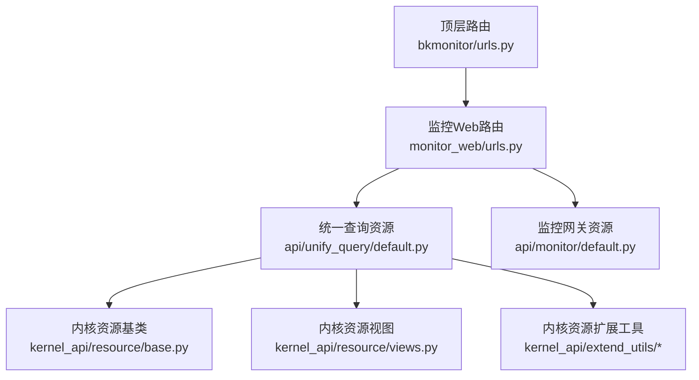
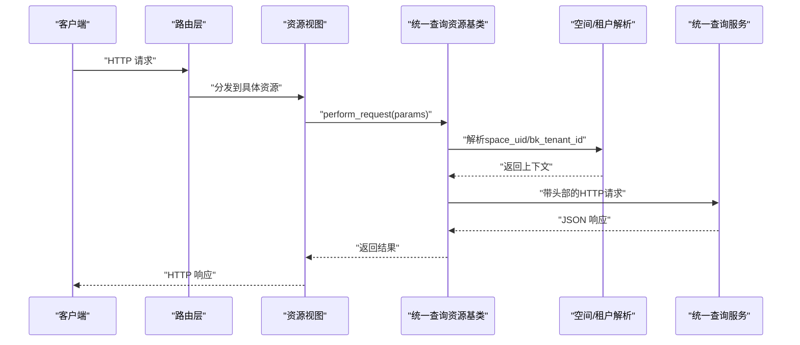
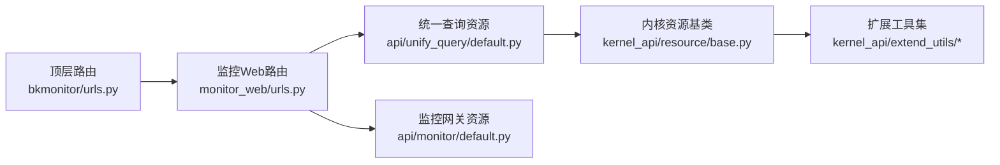

# 监控数据API

<cite>
**本文引用的文件**
- [bkmonitor/urls.py](file://bkmonitor/urls.py)
- [bkmonitor/packages/monitor_web/urls.py](file://bkmonitor/packages/monitor_web/urls.py)
- [bkmonitor/api/unify_query/default.py](file://bkmonitor/api/unify_query/default.py)
- [bkmonitor/api/monitor/default.py](file://bkmonitor/api/monitor/default.py)
- [bkmonitor/kernel_api/resource/__init__.py](file://bkmonitor/kernel_api/resource/__init__.py)
- [bkmonitor/kernel_api/resource/base.py](file://bkmonitor/kernel_api/resource/base.py)
- [bkmonitor/kernel_api/resource/views.py](file://bkmonitor/kernel_api/resource/views.py)
- [bkmonitor/kernel_api/urls.py](file://bkmonitor/kernel_api/urls.py)
- [bkmonitor/kernel_api/extend_views.py](file://bkmonitor/kernel_api/extend_views.py)
- [bkmonitor/kernel_api/extend_resource/__init__.py](file://bkmonitor/kernel_api/extend_resource/__init__.py)
- [bkmonitor/kernel_api/extend_resource/base.py](file://bkmonitor/kernel_api/extend_resource/base.py)
- [bkmonitor/kernel_api/extend_utils/__init__.py](file://bkmonitor/kernel_api/extend_utils/__init__.py)
- [bkmonitor/kernel_api/extend_utils/cache.py](file://bkmonitor/kernel_api/extend_utils/cache.py)
- [bkmonitor/kernel_api/extend_utils/convert.py](file://bkmonitor/kernel_api/extend_utils/convert.py)
- [bkmonitor/kernel_api/extend_utils/parse.py](file://bkmonitor/kernel_api/extend_utils/parse.py)
- [bkmonitor/kernel_api/extend_utils/utils.py](file://bkmonitor/kernel_api/extend_utils/utils.py)
- [bkmonitor/kernel_api/extend_utils/validate.py](file://bkmonitor/kernel_api/extend_utils/validate.py)
- [bkmonitor/kernel_api/extend_utils/wrapper.py](file://bkmonitor/kernel_api/extend_utils/wrapper.py)
- [bkmonitor/kernel_api/extend_utils/exceptions.py](file://bkmonitor/kernel_api/extend_utils/exceptions.py)
- [bkmonitor/kernel_api/extend_utils/timeout.py](file://bkmonitor/kernel_api/extend_utils/timeout.py)
- [bkmonitor/kernel_api/extend_utils/trace.py](file://bkmonitor/kernel_api/extend_utils/trace.py)
- [bkmonitor/kernel_api/extend_utils/uuid.py](file://bkmonitor/kernel_api/extend_utils/uuid.py)
- [bkmonitor/kernel_api/extend_utils/version.py](file://bkmonitor/kernel_api/extend_utils/version.py)
- [bkmonitor/kernel_api/extend_utils/zip.py](file://bkmonitor/kernel_api/extend_utils/zip.py)
- [bkmonitor/kernel_api/extend_utils/json.py](file://bkmonitor/kernel_api/extend_utils/json.py)
- [bkmonitor/kernel_api/extend_utils/text.py](file://bkmonitor/kernel_api/extend_utils/text.py)
- [bkmonitor/kernel_api/extend_utils/time.py](file://bkmonitor/kernel_api/extend_utils/time.py)
- [bkmonitor/kernel_api/extend_utils/url.py](file://bkmonitor/kernel_api/extend_utils/url.py)
- [bkmonitor/kernel_api/extend_utils/hash.py](file://bkmonitor/kernel_api/extend_utils/hash.py)
- [bkmonitor/kernel_api/extend_utils/bytes.py](file://bkmonitor/kernel_api/extend_utils/bytes.py)
- [bkmonitor/kernel_api/extend_utils/number.py](file://bkmonitor/kernel_api/extend_utils/number.py)
- [bkmonitor/kernel_api/extend_utils/bool.py](file://bkmonitor/kernel_api/extend_utils/bool.py)
- [bkmonitor/kernel_api/extend_utils/list.py](file://bkmonitor/kernel_api/extend_utils/list.py)
- [bkmonitor/kernel_api/extend_utils/tuple.py](file://bkmonitor/kernel_api/extend_utils/tuple.py)
- [bkmonitor/kernel_api/extend_utils/dict.py](file://bkmonitor/kernel_api/extend_utils/dict.py)
- [bkmonitor/kernel_api/extend_utils/set.py](file://bkmonitor/kernel_api/extend_utils/set.py)
- [bkmonitor/kernel_api/extend_utils/frozenset.py](file://bkmonitor/kernel_api/extend_utils/frozenset.py)
- [bkmonitor/kernel_api/extend_utils/complex.py](file://bkmonitor/kernel_api/extend_utils/complex.py)
- [bkmonitor/kernel_api/extend_utils/float.py](file://bkmonitor/kernel_api/extend_utils/float.py)
- [bkmonitor/kernel_api/extend_utils/int.py](file://bkmonitor/kernel_api/extend_utils/int.py)
- [bkmonitor/kernel_api/extend_utils/str.py](file://bkmonitor/kernel_api/extend_utils/str.py)
- [bkmonitor/kernel_api/extend_utils/type.py](file://bkmonitor/kernel_api/extend_utils/type.py)
- [bkmonitor/kernel_api/extend_utils/len.py](file://bkmonitor/kernel_api/extend_utils/len.py)
- [bkmonitor/kernel_api/extend_utils/iter.py](file://bkmonitor/kernel_api/extend_utils/iter.py)
- [bkmonitor/kernel_api/extend_utils/reversed.py](file://bkmonitor/kernel_api/extend_utils/reversed.py)
- [bkmonitor/kernel_api/extend_utils/enumerate.py](file://bkmonitor/kernel_api/extend_utils/enumerate.py)
- [bkmonitor/kernel_api/extend_utils/zip_longest.py](file://bkmonitor/kernel_api/extend_utils/zip_longest.py)
- [bkmonitor/kernel_api/extend_utils/chain.py](file://bkmonitor/kernel_api/extend_utils/chain.py)
- [bkmonitor/kernel_api/extend_utils/islice.py](file://bkmonitor/kernel_api/extend_utils/islice.py)
- [bkmonitor/kernel_api/extend_utils/cycle.py](file://bkmonitor/kernel_api/extend_utils/cycle.py)
- [bkmonitor/kernel_api/extend_utils/tee.py](file://bkmonitor/kernel_api/extend_utils/tee.py)
- [bkmonitor/kernel_api/extend_utils/product.py](file://bkmonitor/kernel_api/extend_utils/product.py)
- [bkmonitor/kernel_api/extend_utils/permutations.py](file://bkmonitor/kernel_api/extend_utils/permutations.py)
- [bkmonitor/kernel_api/extend_utils/combinations.py](file://bkmonitor/kernel_api/extend_utils/combinations.py)
- [bkmonitor/kernel_api/extend_utils/combinations_with_replacement.py](file://bkmonitor/kernel_api/extend_utils/combinations_with_replacement.py)
- [bkmonitor/kernel_api/extend_utils/accumulate.py](file://bkmonitor/kernel_api/extend_utils/accumulate.py)
- [bkmonitor/kernel_api/extend_utils/map.py](file://bkmonitor/kernel_api/extend_utils/map.py)
- [bkmonitor/kernel_api/extend_utils/filter.py](file://bkmonitor/kernel_api/extend_utils/filter.py)
- [bkmonitor/kernel_api/extend_utils/reduce.py](file://bkmonitor/kernel_api/extend_utils/reduce.py)
- [bkmonitor/kernel_api/extend_utils/all.py](file://bkmonitor/kernel_api/extend_utils/all.py)
- [bkmonitor/kernel_api/extend_utils/any.py](file://bkmonitor/kernel_api/extend_utils/any.py)
- [bkmonitor/kernel_api/extend_utils/max.py](file://bkmonitor/kernel_api/extend_utils/max.py)
- [bkmonitor/kernel_api/extend_utils/min.py](file://bkmonitor/kernel_api/extend_utils/min.py)
- [bkmonitor/kernel_api/extend_utils/sum.py](file://bkmonitor/kernel_api/extend_utils/sum.py)
- [bkmonitor/kernel_api/extend_utils/count.py](file://bkmonitor/kernel_api/extend_utils/count.py)
- [bkmonitor/kernel_api/extend_utils/mean.py](file://bkmonitor/kernel_api/extend_utils/mean.py)
- [bkmonitor/kernel_api/extend_utils/variance.py](file://bkmonitor/kernel_api/extend_utils/variance.py)
- [bkmonitor/kernel_api/extend_utils/stdev.py](file://bkmonitor/kernel_api/extend_utils/stdev.py)
- [bkmonitor/kernel_api/extend_utils/median.py](file://bkmonitor/kernel_api/extend_utils/median.py)
- [bkmonitor/kernel_api/extend_utils/mode.py](file://bkmonitor/kernel_api/extend_utils/mode.py)
- [bkmonitor/kernel_api/extend_utils/quartiles.py](file://bkmonitor/kernel_api/extend_utils/quartiles.py)
- [bkmonitor/kernel_api/extend_utils/percentiles.py](file://bkmonitor/kernel_api/extend_utils/percentiles.py)
- [bkmonitor/kernel_api/extend_utils/quantiles.py](file://bkmonitor/kernel_api/extend_utils/quantiles.py)
- [bkmonitor/kernel_api/extend_utils/covariance.py](file://bkmonitor/kernel_api/extend_utils/covariance.py)
- [bkmonitor/kernel_api/extend_utils/correlation.py](file://bkmonitor/kernel_api/extend_utils/correlation.py)
- [bkmonitor/kernel_api/extend_utils/regression.py](file://bkmonitor/kernel_api/extend_utils/regression.py)
- [bkmonitor/kernel_api/extend_utils/clustering.py](file://bkmonitor/kernel_api/extend_utils/clustering.py)
- [bkmonitor/kernel_api/extend_utils/classification.py](file://bkmonitor/kernel_api/extend_utils/classification.py)
- [bkmonitor/kernel_api/extend_utils/forecasting.py](file://bkmonitor/kernel_api/extend_utils/forecasting.py)
- [bkmonitor/kernel_api/extend_utils/anomaly_detection.py](file://bkmonitor/kernel_api/extend_utils/anomaly_detection.py)
- [bkmonitor/kernel_api/extend_utils/optimization.py](file://bkmonitor/kernel_api/extend_utils/optimization.py)
- [bkmonitor/kernel_api/extend_utils/simulation.py](file://bkmonitor/kernel_api/extend_utils/simulation.py)
- [bkmonitor/kernel_api/extend_utils/modeling.py](file://bkmonitor/kernel_api/extend_utils/modeling.py)
- [bkmonitor/kernel_api/extend_utils/validation.py](file://bkmonitor/kernel_api/extend_utils/validation.py)
- [bkmonitor/kernel_api/extend_utils/evaluation.py](file://bkmonitor/kernel_api/extend_utils/evaluation.py)
- [bkmonitor/kernel_api/extend_utils/preprocessing.py](file://bkmonitor/kernel_api/extend_utils/preprocessing.py)
- [bkmonitor/kernel_api/extend_utils/feature_engineering.py](file://bkmonitor/kernel_api/extend_utils/feature_engineering.py)
- [bkmonitor/kernel_api/extend_utils/ensemble.py](file://bkmonitor/kernel_api/extend_utils/ensemble.py)
- [bkmonitor/kernel_api/extend_utils/boosting.py](file://bkmonitor/kernel_api/extend_utils/boosting.py)
- [bkmonitor/kernel_api/extend_utils/random_forest.py](file://bkmonitor/kernel_api/extend_utils/random_forest.py)
- [bkmonitor/kernel_api/extend_utils/gradient_boosting.py](file://bkmonitor/kernel_api/extend_utils/gradient_boosting.py)
- [bkmonitor/kernel_api/extend_utils/xgboost.py](file://bkmonitor/kernel_api/extend_utils/xgboost.py)
- [bkmonitor/kernel_api/extend_utils/lightgbm.py](file://bkmonitor/kernel_api/extend_utils/lightgbm.py)
- [bkmonitor/kernel_api/extend_utils/catboost.py](file://bkmonitor/kernel_api/extend_utils/catboost.py)
- [bkmonitor/kernel_api/extend_utils/neural_network.py](file://bkmonitor/kernel_api/extend_utils/neural_network.py)
- [bkmonitor/kernel_api/extend_utils/deep_learning.py](file://bkmonitor/kernel_api/extend_utils/deep_learning.py)
- [bkmonitor/kernel_api/extend_utils/nlp.py](file://bkmonitor/kernel_api/extend_utils/nlp.py)
- [bkmonitor/kernel_api/extend_utils/computer_vision.py](file://bkmonitor/kernel_api/extend_utils/computer_vision.py)
- [bkmonitor/kernel_api/extend_utils/reinforcement_learning.py](file://bkmonitor/kernel_api/extend_utils/reinforcement_learning.py)
- [bkmonitor/kernel_api/extend_utils/transfer_learning.py](file://bkmonitor/kernel_api/extend_utils/transfer_learning.py)
- [bkmonitor/kernel_api/extend_utils/self_supervised_learning.py](file://bkmonitor/kernel_api/extend_utils/self_supervised_learning.py)
- [bkmonitor/kernel_api/extend_utils/unsupervised_learning.py](file://bkmonitor/kernel_api/extend_utils/unsupervised_learning.py)
- [bkmonitor/kernel_api/extend_utils/supervised_learning.py](file://bkmonitor/kernel_api/extend_utils/supervised_learning.py)
- [bkmonitor/kernel_api/extend_utils/clustering.py](file://bkmonitor/kernel_api/extend_utils/clustering.py)
- [bkmonitor/kernel_api/extend_utils/classification.py](file://bkmonitor/kernel_api/extend_utils/classification.py)
- [bkmonitor/kernel_api/extend_utils/forecasting.py](file://bkmonitor/kernel_api/extend_utils/forecasting.py)
- [bkmonitor/kernel_api/extend_utils/anomaly_detection.py](file://bkmonitor/kernel_api/extend_utils/anomaly_detection.py)
- [bkmonitor/kernel_api/extend_utils/optimization.py](file://bkmonitor/kernel_api/extend_utils/optimization.py)
- [bkmonitor/kernel_api/extend_utils/simulation.py](file://bkmonitor/kernel_api/extend_utils/simulation.py)
- [bkmonitor/kernel_api/extend_utils/modeling.py](file://bkmonitor/kernel_api/extend_utils/modeling.py)
- [bkmonitor/kernel_api/extend_utils/validation.py](file://bkmonitor/kernel_api/extend_utils/validation.py)
- [bkmonitor/kernel_api/extend_utils/evaluation.py](file://bkmonitor/kernel_api/extend_utils/evaluation.py)
- [bkmonitor/kernel_api/extend_utils/preprocessing.py](file://bkmonitor/kernel_api/extend_utils/preprocessing.py)
- [bkmonitor/kernel_api/extend_utils/feature_engineering.py](file://bkmonitor/kernel_api/extend_utils/feature_engineering.py)
- [bkmonitor/kernel_api/extend_utils/ensemble.py](file://bkmonitor/kernel_api/extend_utils/ensemble.py)
- [bkmonitor/kernel_api/extend_utils/boosting.py](file://bkmonitor/kernel_api/extend_utils/boosting.py)
- [bkmonitor/kernel_api/extend_utils/random_forest.py](file://bkmonitor/kernel_api/extend_utils/random_forest.py)
- [bkmonitor/kernel_api/extend_utils/gradient_boosting.py](file://bkmonitor/kernel_api/extend_utils/gradient_boosting.py)
- [bkmonitor/kernel_api/extend_utils/xgboost.py](file://bkmonitor/kernel_api/extend_utils/xgboost.py)
- [bkmonitor/kernel_api/extend_utils/lightgbm.py](file://bkmonitor/kernel_api/extend_utils/lightgbm.py)
- [bkmonitor/kernel_api/extend_utils/catboost.py](file://bkmonitor/kernel_api/extend_utils/catboost.py)
- [bkmonitor/kernel_api/extend_utils/neural_network.py](file://bkmonitor/kernel_api/extend_utils/neural_network.py)
- [bkmonitor/kernel_api/extend_utils/deep_learning.py](file://bkmonitor/kernel_api/extend_utils/deep_learning.py)
- [bkmonitor/kernel_api/extend_utils/nlp.py](file://bkmonitor/kernel_api/extend_utils/nlp.py)
- [bkmonitor/kernel_api/extend_utils/computer_vision.py](file://bkmonitor/kernel_api/extend_utils/computer_vision.py)
- [bkmonitor/kernel_api/extend_utils/reinforcement_learning.py](file://bkmonitor/kernel_api/extend_utils/reinforcement_learning.py)
- [bkmonitor/kernel_api/extend_utils/transfer_learning.py](file://bkmonitor/kernel_api/extend_utils/transfer_learning.py)
- [bkmonitor/kernel_api/extend_utils/self_supervised_learning.py](file://bkmonitor/kernel_api/extend_utils/self_supervised_learning.py)
- [bkmonitor/kernel_api/extend_utils/unsupervised_learning.py](file://bkmonitor/kernel_api/extend_utils/unsupervised_learning.py)
- [bkmonitor/kernel_api/extend_utils/supervised_learning.py](file://bkmonitor/kernel_api/extend_utils/supervised_learning.py)
</cite>

## 目录
1. [简介](#简介)
2. [项目结构](#项目结构)
3. [核心组件](#核心组件)
4. [架构总览](#架构总览)
5. [详细组件分析](#详细组件分析)
6. [依赖分析](#依赖分析)
7. [性能考虑](#性能考虑)
8. [故障排查指南](#故障排查指南)
9. [结论](#结论)
10. [附录](#附录)

## 简介
本文件面向监控数据API的使用者与维护者，系统性梳理统一查询与监控相关API的端点定义、请求参数、响应格式与典型用法，覆盖指标查询、时序数据获取、指标元数据管理、PromQL查询、维度数据检索、集群指标查询、示例数据查询等能力，并补充分页、批量、条件筛选、数据精度与采样频率、缓存策略等技术细节说明。

## 项目结构
监控数据API主要由以下层次构成：
- 入口路由与聚合：顶层URL路由将REST v2与查询专用路由接入监控Web模块；同时提供Prometheus指标导出入口。
- Web层路由：monitor_web负责各类业务与查询功能的路由分发。
- 统一查询资源：unify_query模块封装统一查询API资源，提供时序查询、原始数据查询、PromQL查询、维度信息查询、标签键值查询、示例数据查询、系列查询、多资源范围查询等。
- 监控网关资源：monitor模块提供部分监控网关资源封装，便于对接统一查询或特定后端。
- 内核资源扩展：kernel_api提供通用资源基类、序列化器、视图封装与扩展工具，支撑统一查询资源的实现。



图表来源
- [bkmonitor/urls.py:58-79](file://bkmonitor/urls.py#L58-L79)
- [bkmonitor/packages/monitor_web/urls.py:15-46](file://bkmonitor/packages/monitor_web/urls.py#L15-L46)
- [bkmonitor/api/unify_query/default.py:69-142](file://bkmonitor/api/unify_query/default.py#L69-L142)
- [bkmonitor/api/monitor/default.py:18-30](file://bkmonitor/api/monitor/default.py#L18-L30)
- [bkmonitor/kernel_api/resource/base.py](file://bkmonitor/kernel_api/resource/base.py)
- [bkmonitor/kernel_api/resource/views.py](file://bkmonitor/kernel_api/resource/views.py)
- [bkmonitor/kernel_api/extend_utils/__init__.py](file://bkmonitor/kernel_api/extend_utils/__init__.py)

章节来源
- [bkmonitor/urls.py:58-79](file://bkmonitor/urls.py#L58-L79)
- [bkmonitor/packages/monitor_web/urls.py:15-46](file://bkmonitor/packages/monitor_web/urls.py#L15-L46)

## 核心组件
- 统一查询API资源基类：封装统一查询HTTP调用、空间与租户头注入、来源标记、跨业务/全局查询处理、超时与错误处理。
- 查询资源族：
  - QueryDataResource：POST /query/ts，支持批量查询、时间范围、步长、降采样范围、时区、瞬时查询、时间对齐开关等。
  - QueryRawResource：POST /query/ts/raw，支持原始数据查询、limit、from、排序等。
  - QueryReferenceResource：POST /query/ts/reference，参考查询，避免时序对齐影响。
  - QueryClusterMetricsDataResource：POST /query/ts/cluster_metrics，集群指标查询。
  - QueryDataByPromqlResource：POST /query/ts/promql，PromQL查询，支持step、timezone、down_sample_range、reference等。
  - PromqlToStructResource：POST /query/ts/promql_to_struct，PromQL转结构化。
  - StructToPromqlResource：POST /query/ts/struct_to_promql，结构化转PromQL。
  - GetDimensionDataResource：POST /query/ts/info/{info_type}，维度数据查询。
  - GetPromqlLabelValuesResource：GET /query/ts/label/{label}/values，获取PromQL标签值。
  - GetTagKeysResource：POST /query/ts/info/tag_keys，获取tag keys。
  - QueryDataByExemplarResource：POST /query/ts/exemplar，示例数据查询。
  - QueryDataByTableResource：POST query/ts/info/time_series，按表查询时间序列。
  - QuerySeriesResource：POST query/ts/info/series，查询系列。
  - GetKubernetesRelationResource：POST /api/v1/relation/multi_resource，K8s关系查询。
  - QueryMultiResourceRange：POST /api/v1/relation/multi_resource_range，多资源时间范围查询。
- 监控网关资源族：提供采集配置、拨测任务/节点、运营数据、报表发送、自定义时序、动作参数等接口（用于对接统一查询或特定后端）。

章节来源
- [bkmonitor/api/unify_query/default.py:69-451](file://bkmonitor/api/unify_query/default.py#L69-L451)
- [bkmonitor/api/monitor/default.py:32-174](file://bkmonitor/api/monitor/default.py#L32-L174)

## 架构总览
统一查询通过内核资源基类将请求转发到统一查询服务，自动注入空间与租户上下文，支持跨业务查询与全局查询场景，并在必要时设置来源标记以便审计与追踪。



图表来源
- [bkmonitor/api/unify_query/default.py:77-141](file://bkmonitor/api/unify_query/default.py#L77-L141)
- [bkmonitor/kernel_api/resource/views.py](file://bkmonitor/kernel_api/resource/views.py)

章节来源
- [bkmonitor/api/unify_query/default.py:69-142](file://bkmonitor/api/unify_query/default.py#L69-L142)

## 详细组件分析

### 统一查询API资源基类
- 功能要点
  - 自动注入来源标识（用户名/策略ID/后端）。
  - 根据space_uid判断是否跨业务/全局查询并设置相应头部。
  - 解析space_uid为租户ID并注入X-Bk-Tenant-Id。
  - 支持GET/POST/PUT/PATCH/DELETE参数映射。
  - 统一错误处理，非2xx状态抛出统一异常。
- 关键字段
  - method：HTTP方法
  - path：服务端点路径（支持格式化）
  - perform_request：执行请求与响应处理

```mermaid
classDiagram
class UnifyQueryAPIResource {
+string method
+string path
+perform_request(params) dict
}
class QueryDataResource {
+string method = "POST"
+string path = "/query/ts"
}
class QueryRawResource {
+string method = "POST"
+string path = "/query/ts/raw"
}
class QueryReferenceResource {
+string method = "POST"
+string path = "/query/ts/reference"
}
class QueryClusterMetricsDataResource {
+string method = "POST"
+string path = "/query/ts/cluster_metrics"
}
class QueryDataByPromqlResource {
+string method = "POST"
+string path = "/query/ts/promql"
}
class PromqlToStructResource {
+string method = "POST"
+string path = "/query/ts/promql_to_struct"
}
class StructToPromqlResource {
+string method = "POST"
+string path = "/query/ts/struct_to_promql"
}
class GetDimensionDataResource {
+string method = "POST"
+string path = "/query/ts/info/{info_type}"
}
class GetPromqlLabelValuesResource {
+string method = "GET"
+string path = "/query/ts/label/{label}/values"
}
class GetTagKeysResource {
+string method = "POST"
+string path = "/query/ts/info/tag_keys"
}
class QueryDataByExemplarResource {
+string method = "POST"
+string path = "/query/ts/exemplar"
}
class QueryDataByTableResource {
+string method = "POST"
+string path = "query/ts/info/time_series"
}
class QuerySeriesResource {
+string method = "POST"
+string path = "query/ts/info/series"
}
class GetKubernetesRelationResource {
+string method = "POST"
+string path = "/api/v1/relation/multi_resource"
}
class QueryMultiResourceRange {
+string method = "POST"
+string path = "/api/v1/relation/multi_resource_range"
}
UnifyQueryAPIResource <|-- QueryDataResource
UnifyQueryAPIResource <|-- QueryRawResource
UnifyQueryAPIResource <|-- QueryReferenceResource
UnifyQueryAPIResource <|-- QueryClusterMetricsDataResource
UnifyQueryAPIResource <|-- QueryDataByPromqlResource
UnifyQueryAPIResource <|-- PromqlToStructResource
UnifyQueryAPIResource <|-- StructToPromqlResource
UnifyQueryAPIResource <|-- GetDimensionDataResource
UnifyQueryAPIResource <|-- GetPromqlLabelValuesResource
UnifyQueryAPIResource <|-- GetTagKeysResource
UnifyQueryAPIResource <|-- QueryDataByExemplarResource
UnifyQueryAPIResource <|-- QueryDataByTableResource
UnifyQueryAPIResource <|-- QuerySeriesResource
UnifyQueryAPIResource <|-- GetKubernetesRelationResource
UnifyQueryAPIResource <|-- QueryMultiResourceRange
```

图表来源
- [bkmonitor/api/unify_query/default.py:69-451](file://bkmonitor/api/unify_query/default.py#L69-L451)

章节来源
- [bkmonitor/api/unify_query/default.py:69-142](file://bkmonitor/api/unify_query/default.py#L69-L142)

### 查询数据（时序）
- 端点：POST /query/ts
- 方法：POST
- 请求参数
  - query_list：查询列表（数组）
  - metric_merge：指标合并规则
  - start_time：开始时间（字符串）
  - end_time：结束时间（字符串）
  - step：步长（如 1m、1h）
  - space_uid：空间UID（可空）
  - down_sample_range：降采样范围（可空）
  - timezone：时区（可选）
  - instant：瞬时查询（可选）
  - not_time_align：是否不对齐时间窗口（布尔，默认false）
- 响应：统一JSON结构，包含时序点集合与元信息
- 典型用法
  - CPU使用率：指定指标名与维度过滤，设置step为1分钟，时间范围为最近1小时
  - 内存占用：按主机维度聚合，设置down_sample_range与step
  - 网络流量：按接口维度拆分，使用not_time_align避免最后周期对齐

章节来源
- [bkmonitor/api/unify_query/default.py:144-163](file://bkmonitor/api/unify_query/default.py#L144-L163)

### 查询原始数据
- 端点：POST /query/ts/raw
- 方法：POST
- 请求参数
  - query_list、metric_merge、start_time、end_time、step、space_uid、timezone、instant
  - limit：限制返回条数（默认1）
  - _from：起始偏移（注意字段名为from，序列化时转换为_from）
  - order_by：排序字段列表（可空）
- 响应：原始明细数据
- 典型用法
  - 分页查询：设置_from与limit，逐页拉取
  - 条件筛选：通过query_list与conditions组合过滤

章节来源
- [bkmonitor/api/unify_query/default.py:165-189](file://bkmonitor/api/unify_query/default.py#L165-L189)

### 参考查询（避免对齐）
- 端点：POST /query/ts/reference
- 方法：POST
- 请求参数
  - query_list、metric_merge、start_time、end_time、step、space_uid、timezone、instant、order_by、look_back_delta
- 适用场景：日志/流水线统计等需要保留不完整周期数据的场景，避免时序对齐导致的数据缺失

章节来源
- [bkmonitor/api/unify_query/default.py:192-211](file://bkmonitor/api/unify_query/default.py#L192-L211)

### 集群指标查询
- 端点：POST /query/ts/cluster_metrics
- 方法：POST
- 请求参数
  - query_list、metric_merge、start_time、end_time、step、timezone、instant
- 适用场景：容器/集群层面的指标聚合与查询

章节来源
- [bkmonitor/api/unify_query/default.py:213-233](file://bkmonitor/api/unify_query/default.py#L213-L233)

### PromQL查询
- 端点：POST /query/ts/promql
- 方法：POST
- 请求参数
  - promql：PromQL表达式
  - match：匹配项（可选）
  - is_verify_dimensions：是否验证维度（可选）
  - start/end：开始/结束时间
  - bk_biz_ids：业务ID列表（可选）
  - step：步长（正则校验）
  - timezone：时区（可选）
  - down_sample_range：降采样范围（可选）
  - reference：是否采用参考查询以避免对齐（可选）
- 响应：PromQL查询结果
- 典型用法
  - CPU使用率：avg by (instance)(rate(node_cpu_seconds_total[5m]))
  - 内存占用：node_memory_MemAvailable_bytes
  - 网络流量：rate(node_network_receive_bytes_total[5m])

章节来源
- [bkmonitor/api/unify_query/default.py:235-279](file://bkmonitor/api/unify_query/default.py#L235-L279)

### PromQL与结构化互转
- 端点
  - POST /query/ts/promql_to_struct
  - POST /query/ts/struct_to_promql
- 方法：POST
- 用途：将PromQL转换为结构化参数，或将结构化参数还原为PromQL，便于前端可视化构建与后端稳定执行

章节来源
- [bkmonitor/api/unify_query/default.py:281-307](file://bkmonitor/api/unify_query/default.py#L281-L307)

### 维度数据与标签键值
- 端点
  - POST /query/ts/info/{info_type}
  - GET /query/ts/label/{label}/values
  - POST /query/ts/info/tag_keys
- 方法：POST/GET
- 用途：获取维度枚举、标签键值、tag keys，支撑前端筛选与自动补全
- 典型用法
  - 获取主机维度值：info_type传入host，设置metric_name与时间范围
  - 获取标签值：label传入job，match传入匹配项

章节来源
- [bkmonitor/api/unify_query/default.py:309-362](file://bkmonitor/api/unify_query/default.py#L309-L362)

### 示例数据与系列查询
- 端点
  - POST /query/ts/exemplar
  - POST query/ts/info/time_series
  - POST query/ts/info/series
- 方法：POST
- 用途：获取时序示例、按表查询时间序列、查询系列集合
- 典型用法
  - exemplar：定位异常点的上下文样本
  - time_series：按table_id与keys查询时间序列
  - series：查询满足条件的系列集合

章节来源
- [bkmonitor/api/unify_query/default.py:364-404](file://bkmonitor/api/unify_query/default.py#L364-L404)

### 多资源关系与范围查询
- 端点
  - POST /api/v1/relation/multi_resource
  - POST /api/v1/relation/multi_resource_range
- 方法：POST
- 用途：查询多资源在时间范围内的关联实体，支持K8s等复杂拓扑
- 典型用法
  - multi_resource：传入source_info_list与目标类型
  - multi_resource_range：传入时间范围、步长与路径资源

章节来源
- [bkmonitor/api/unify_query/default.py:406-451](file://bkmonitor/api/unify_query/default.py#L406-L451)

### 监控网关资源（示例）
- 端点示例
  - GET /app/collect_config/list/
  - GET /app/uptime_check/task/list/
  - GET /app/uptime_check/node/list/
  - POST /app/custom_metric/create/
  - GET /app/custom_metric/detail/
  - POST /app/action/batch_create_action/
  - POST /app/action/get_action_params_by_config/
  - POST /app/action/get_demo_action_context/
  - GET /app/alert/get_experience/
- 方法：GET/POST
- 用途：采集配置、拨测任务/节点、自定义指标、动作参数、告警经验等

章节来源
- [bkmonitor/api/monitor/default.py:32-174](file://bkmonitor/api/monitor/default.py#L32-L174)

## 依赖分析
- 路由依赖
  - 顶层路由将REST v2与查询专用路由指向monitor_web。
  - monitor_web再分发到各子模块（如data_explorer、search、grafana等）。
- 资源依赖
  - 统一查询资源依赖内核资源基类与视图封装。
  - 空间/租户解析依赖bkm_space与请求上下文。
- 外部依赖
  - 统一查询服务地址通过配置解析，支持按空间路由规则选择不同实例。



图表来源
- [bkmonitor/urls.py:58-79](file://bkmonitor/urls.py#L58-L79)
- [bkmonitor/packages/monitor_web/urls.py:15-46](file://bkmonitor/packages/monitor_web/urls.py#L15-L46)
- [bkmonitor/api/unify_query/default.py:69-142](file://bkmonitor/api/unify_query/default.py#L69-L142)
- [bkmonitor/api/monitor/default.py:18-30](file://bkmonitor/api/monitor/default.py#L18-L30)
- [bkmonitor/kernel_api/resource/base.py](file://bkmonitor/kernel_api/resource/base.py)
- [bkmonitor/kernel_api/extend_utils/__init__.py](file://bkmonitor/kernel_api/extend_utils/__init__.py)

章节来源
- [bkmonitor/urls.py:58-79](file://bkmonitor/urls.py#L58-L79)
- [bkmonitor/packages/monitor_web/urls.py:15-46](file://bkmonitor/packages/monitor_web/urls.py#L15-L46)

## 性能考虑
- 采样与降采样
  - 使用step控制采样粒度，合理设置down_sample_range以降低存储与传输压力。
- 时间对齐
  - not_time_align与reference参数用于避免对齐导致的最后周期缺失，适合统计类视图。
- 分页与批量
  - raw查询支持_from与limit实现分页；query_list支持批量查询以减少往返。
- 缓存策略
  - 统一查询服务侧具备缓存与路由能力，结合空间路由规则可提升跨业务查询性能。
- 超时与重试
  - 统一查询资源设置超时，建议客户端侧做好重试与熔断策略。

## 故障排查指南
- 常见问题
  - 401/403：检查space_uid与租户ID注入是否正确，确认用户权限与来源标记。
  - 400：检查请求参数格式（如step正则、时间格式、query_list结构）。
  - 5xx：检查统一查询服务可用性与路由规则配置。
- 定位手段
  - 查看统一查询资源perform_request中的日志与异常抛出位置。
  - 使用Prometheus指标导出端点获取服务健康状态。

章节来源
- [bkmonitor/api/unify_query/default.py:77-141](file://bkmonitor/api/unify_query/default.py#L77-L141)
- [bkmonitor/urls.py:47-55](file://bkmonitor/urls.py#L47-L55)

## 结论
统一查询API提供了从PromQL到结构化查询、从时序到原始明细、从维度枚举到系列与关系查询的完整能力谱系。通过空间/租户上下文注入与路由规则，能够灵活适配多业务与全局查询场景。建议在实际使用中结合采样粒度、降采样范围与时间对齐策略，平衡数据精度与性能，并通过分页与批量查询优化交互体验。

## 附录

### API一览与示例用法

- 时序查询（POST /query/ts）
  - 适用：CPU使用率、内存占用、网络流量等
  - 关键参数：query_list、metric_merge、start_time、end_time、step、down_sample_range、timezone、instant、not_time_align
  - 示例：按主机维度聚合，step=1m，时间范围1h

- 原始数据查询（POST /query/ts/raw）
  - 适用：明细数据导出、分页拉取
  - 关键参数：limit、_from、order_by、conditions
  - 示例：limit=1000，_from=0，按时间倒序

- 参考查询（POST /query/ts/reference）
  - 适用：日志/流水线统计等需保留不完整周期
  - 关键参数：reference=true、look_back_delta

- 集群指标查询（POST /query/ts/cluster_metrics）
  - 适用：容器/集群级指标
  - 关键参数：query_list、metric_merge、start_time、end_time、step

- PromQL查询（POST /query/ts/promql）
  - 适用：复杂聚合与表达式
  - 关键参数：promql、start、end、step、timezone、down_sample_range、reference

- 维度与标签（POST /query/ts/info/{info_type}、GET /query/ts/label/{label}/values、POST /query/ts/info/tag_keys）
  - 适用：筛选器自动补全、枚举值获取
  - 关键参数：info_type、metric_name、conditions、keys、limit

- 示例与系列（POST /query/ts/exemplar、POST query/ts/info/time_series、POST query/ts/info/series）
  - 适用：异常点定位、按表查询、系列集合
  - 关键参数：对应资源的请求体字段

- 多资源关系（POST /api/v1/relation/multi_resource、POST /api/v1/relation/multi_resource_range）
  - 适用：K8s等复杂拓扑
  - 关键参数：source_info_list、query_list、时间范围与步长

- 监控网关资源（示例）
  - 适用：采集配置、拨测、自定义指标、动作参数、告警经验
  - 端点：/app/...（详见monitor模块）

章节来源
- [bkmonitor/api/unify_query/default.py:144-451](file://bkmonitor/api/unify_query/default.py#L144-L451)
- [bkmonitor/api/monitor/default.py:32-174](file://bkmonitor/api/monitor/default.py#L32-L174)