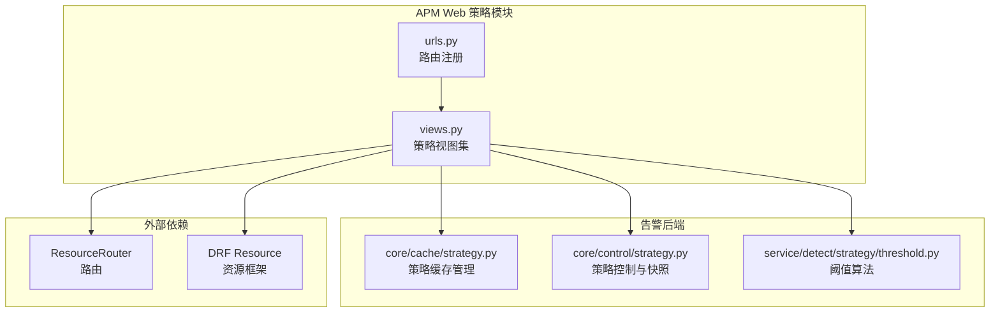
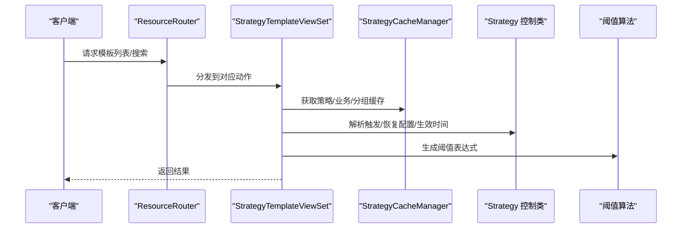
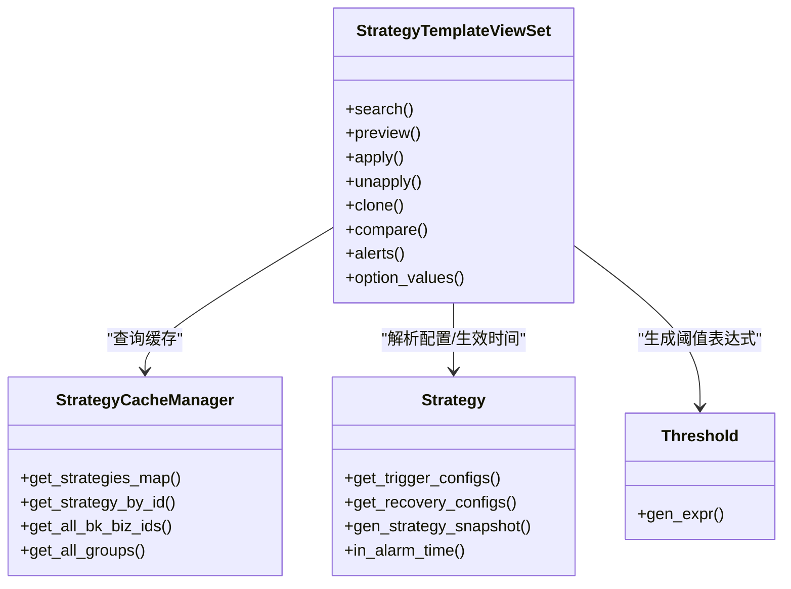
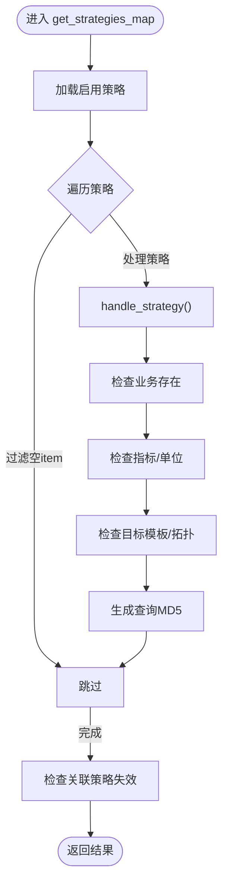
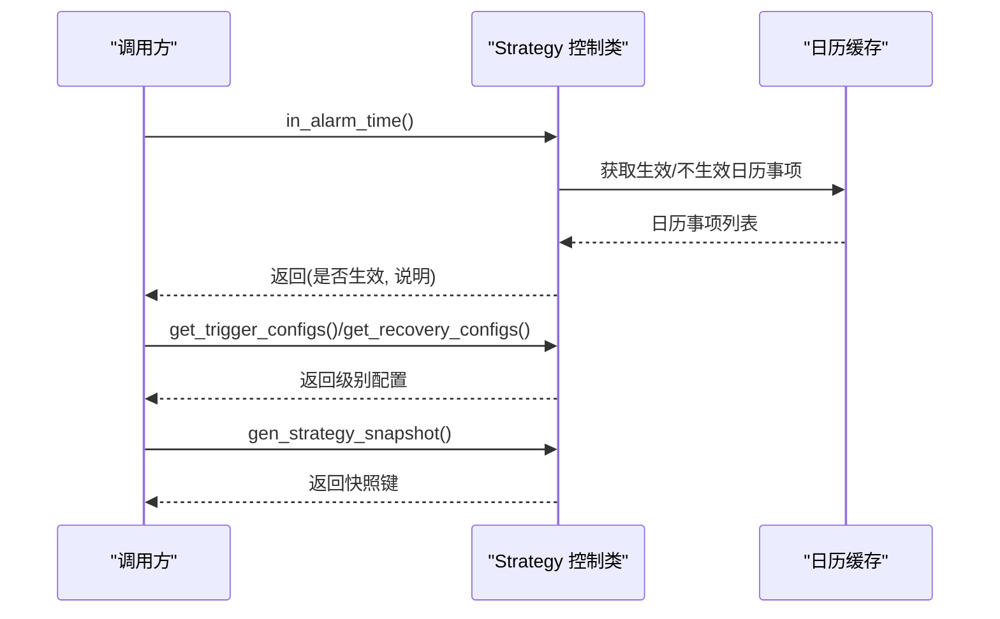
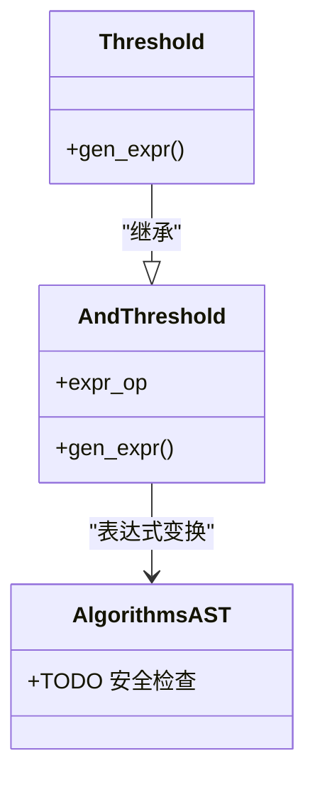
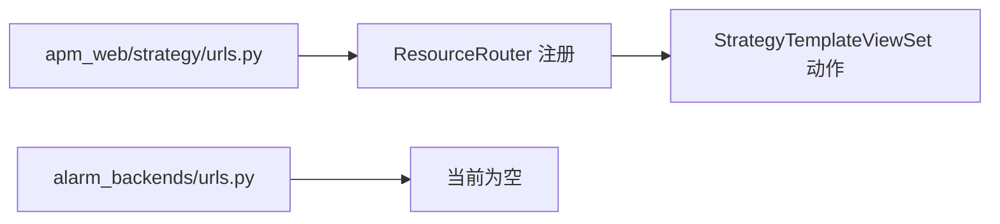
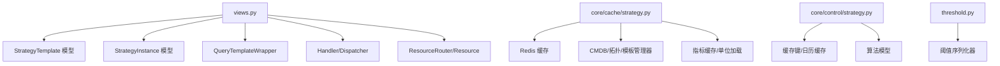

# 策略配置API

<cite>
**本文档引用的文件**
- [strategy.py](file://bkmonitor/alarm_backends/core/cache/strategy.py)
- [strategy.py](file://bkmonitor/alarm_backends/core/control/strategy.py)
- [threshold.py](file://bkmonitor/alarm_backends/service/detect/strategy/threshold.py)
- [views.py](file://bkmonitor/packages/apm_web/strategy/views.py)
- [urls.py](file://bkmonitor/packages/apm_web/strategy/urls.py)
- [urls.py](file://bkmonitor/alarm_backends/urls.py)
</cite>

## 目录
1. [简介](#简介)
2. [项目结构](#项目结构)
3. [核心组件](#核心组件)
4. [架构概览](#架构概览)
5. [详细组件分析](#详细组件分析)
6. [依赖分析](#依赖分析)
7. [性能考虑](#性能考虑)
8. [故障排除指南](#故障排除指南)
9. [结论](#结论)
10. [附录](#附录)

## 简介
本文件面向蓝鲸监控平台的策略配置API，聚焦告警策略的创建、修改、删除、查询等管理接口。内容涵盖策略规则定义（阈值、表达式、算法）、策略生效范围（业务、主机、集群）、策略执行计划等配置项的API操作；说明策略继承关系、优先级设置、灰度发布等功能的接口实现；并提供策略模板、批量导入导出、策略版本管理的API使用示例。

## 项目结构
策略配置API位于APM Web包的strategy子模块中，采用DRF Resource Router进行路由注册，配合ResourceViewSet实现REST风格的资源访问。策略缓存与控制逻辑分别由alarm_backends模块提供，支撑策略的预处理、校验、分组与快照生成。

**图表来源**
- [views.py:1-629](file://bkmonitor/packages/apm_web/strategy/views.py#L1-L629)
- [urls.py:1-22](file://bkmonitor/packages/apm_web/strategy/urls.py#L1-L22)
- [strategy.py:1-800](file://bkmonitor/alarm_backends/core/cache/strategy.py#L1-L800)
- [strategy.py:1-384](file://bkmonitor/alarm_backends/core/control/strategy.py#L1-L384)
- [threshold.py:1-69](file://bkmonitor/alarm_backends/service/detect/strategy/threshold.py#L1-L69)

**章节来源**
- [views.py:1-629](file://bkmonitor/packages/apm_web/strategy/views.py#L1-L629)
- [urls.py:1-22](file://bkmonitor/packages/apm_web/strategy/urls.py#L1-L22)

## 核心组件
- 策略模板视图集：提供策略模板的检索、预览、应用、取消应用、克隆、批量更新、差异对比、告警统计、选项值查询等能力。
- 策略实例与模板：模板用于定义策略的通用配置，实例用于绑定到具体服务并下发策略。
- 策略缓存管理：负责策略ID列表、业务ID列表、实时数据策略、无数据策略、AIOPS SDK策略、自愈关联策略、策略分组等缓存的维护与查询。
- 策略控制与快照：提供策略配置读取、生效时间判断、触发/恢复配置解析、策略快照生成与查询等能力。
- 阈值算法：提供阈值表达式的生成与校验，支持AND/OR连接的多阈值组合。

**章节来源**
- [strategy.py:60-800](file://bkmonitor/alarm_backends/core/cache/strategy.py#L60-L800)
- [strategy.py:33-384](file://bkmonitor/alarm_backends/core/control/strategy.py#L33-L384)
- [threshold.py:28-69](file://bkmonitor/alarm_backends/service/detect/strategy/threshold.py#L28-L69)

## 架构概览
策略配置API通过ResourceRouter注册路由，StrategyTemplateViewSet提供策略模板的完整生命周期管理。视图集内部依赖策略缓存管理器与控制类，结合阈值算法生成表达式，最终通过资源框架完成请求处理与响应。

**图表来源**
- [views.py:145-174](file://bkmonitor/packages/apm_web/strategy/views.py#L145-L174)
- [strategy.py:362-448](file://bkmonitor/alarm_backends/core/cache/strategy.py#L362-L448)
- [strategy.py:310-362](file://bkmonitor/alarm_backends/core/control/strategy.py#L310-L362)
- [threshold.py:42-69](file://bkmonitor/alarm_backends/service/detect/strategy/threshold.py#L42-L69)

## 详细组件分析

### 策略模板视图集（StrategyTemplateViewSet）
- 搜索与过滤：支持按名称模糊匹配、类型精确匹配、启用状态、自动应用等条件过滤，支持简单/详细两种返回模式。
- 预览与应用：支持模板预览，展示针对特定服务的策略配置；支持批量应用到多个服务，支持复用已下发配置。
- 取消应用：根据模板ID与服务名定位策略实例，调用资源接口删除策略后再清理实例。
- 克隆与差异对比：支持克隆模板并校验克隆配置与源模板不一致；支持对比当前模板与已下发实例的差异。
- 告警统计：统计模板关联的策略在异常状态下的告警数量。
- 选项值查询：支持查询模板与实例的可选项值集合。

**图表来源**
- [views.py:42-629](file://bkmonitor/packages/apm_web/strategy/views.py#L42-L629)
- [strategy.py:362-448](file://bkmonitor/alarm_backends/core/cache/strategy.py#L362-L448)
- [strategy.py:310-384](file://bkmonitor/alarm_backends/core/control/strategy.py#L310-L384)
- [threshold.py:42-69](file://bkmonitor/alarm_backends/service/detect/strategy/threshold.py#L42-L69)

**章节来源**
- [views.py:42-629](file://bkmonitor/packages/apm_web/strategy/views.py#L42-L629)

### 策略缓存管理（StrategyCacheManager）
- 缓存键管理：维护策略详情、策略ID列表、业务ID列表、实时数据策略、无数据策略、AIOPS SDK策略、GSE事件、自愈关联策略、策略分组等缓存键。
- 策略预处理：转换目标字段、处理特殊查询配置（如事件型策略）、生成查询MD5、补充算法扩展字段等。
- 失效检测：检测业务是否存在、指标是否失效、单位是否匹配、目标模板/拓扑节点是否有效、关联策略是否失效等。
- 分组与查询：按查询MD5对策略进行分组，支持按业务ID、策略类型等维度查询。

**图表来源**
- [strategy.py:362-581](file://bkmonitor/alarm_backends/core/cache/strategy.py#L362-L581)

**章节来源**
- [strategy.py:60-800](file://bkmonitor/alarm_backends/core/cache/strategy.py#L60-L800)

### 策略控制与快照（Strategy 控制类）
- 配置读取：从缓存获取策略配置，支持属性懒加载与缓存命中。
- 生效时间判断：解析触发配置中的生效时间段与日历，判断策略当前是否在生效期内。
- 触发/恢复配置：解析不同级别的触发窗口大小与触发次数，以及恢复配置。
- 快照生成：基于策略更新时间生成快照键并缓存，支持按快照键查询历史策略配置。

**图表来源**
- [strategy.py:156-237](file://bkmonitor/alarm_backends/core/control/strategy.py#L156-L237)
- [strategy.py:310-362](file://bkmonitor/alarm_backends/core/control/strategy.py#L310-L362)
- [strategy.py:261-284](file://bkmonitor/alarm_backends/core/control/strategy.py#L261-L284)

**章节来源**
- [strategy.py:33-384](file://bkmonitor/alarm_backends/core/control/strategy.py#L33-L384)

### 阈值算法（Threshold）
- AND/OR连接：支持多阈值AND/OR连接，生成表达式与描述模板。
- 表达式生成：将阈值配置转换为可执行的表达式，支持单位转换与比较运算符映射。
- 错误处理：当配置无效时抛出阈值配置错误。

**图表来源**
- [threshold.py:28-69](file://bkmonitor/alarm_backends/service/detect/strategy/threshold.py#L28-L69)

**章节来源**
- [threshold.py:1-69](file://bkmonitor/alarm_backends/service/detect/strategy/threshold.py#L1-L69)

### API端点与路由
- 路由注册：通过ResourceRouter将策略视图集的动作注册为URL端点。
- alarm_backends路由：当前alarm_backends的urls.py为空，策略API集中在apm_web策略模块。

**图表来源**
- [urls.py:16-21](file://bkmonitor/packages/apm_web/strategy/urls.py#L16-L21)
- [urls.py:1-4](file://bkmonitor/alarm_backends/urls.py#L1-L4)

**章节来源**
- [urls.py:1-22](file://bkmonitor/packages/apm_web/strategy/urls.py#L1-L22)
- [urls.py:1-4](file://bkmonitor/alarm_backends/urls.py#L1-L4)

## 依赖分析
- 视图集依赖：策略模板模型、策略实例模型、查询模板包装器、调度器、处理器、常量与资源框架。
- 缓存依赖：策略缓存管理器依赖Redis缓存、业务/拓扑/模板管理器、指标缓存与单位加载工具。
- 控制依赖：策略控制类依赖缓存键、日历缓存、策略项模型、算法模型与国际化工具。
- 算法依赖：阈值算法依赖序列化器、表达式检测算法与错误处理。

**图表来源**
- [views.py:37-39](file://bkmonitor/packages/apm_web/strategy/views.py#L37-L39)
- [strategy.py:23-55](file://bkmonitor/alarm_backends/core/cache/strategy.py#L23-L55)
- [strategy.py:19-28](file://bkmonitor/alarm_backends/core/control/strategy.py#L19-L28)
- [threshold.py:19-23](file://bkmonitor/alarm_backends/service/detect/strategy/threshold.py#L19-L23)

**章节来源**
- [views.py:1-629](file://bkmonitor/packages/apm_web/strategy/views.py#L1-L629)
- [strategy.py:1-800](file://bkmonitor/alarm_backends/core/cache/strategy.py#L1-L800)
- [strategy.py:1-384](file://bkmonitor/alarm_backends/core/control/strategy.py#L1-L384)
- [threshold.py:1-69](file://bkmonitor/alarm_backends/service/detect/strategy/threshold.py#L1-L69)

## 性能考虑
- 缓存分层：策略详情、ID列表、业务ID列表、策略分组等均采用Redis缓存，减少数据库压力。
- 批量查询：策略ID列表与策略详情采用批量mget，降低网络往返开销。
- 增量更新：策略ID列表与业务ID列表支持增量更新，避免全量刷新带来的抖动。
- 并发处理：模板检查与应用过程使用线程池并发执行，提升批量操作效率。
- 查询MD5：通过查询MD5对策略进行分组，减少重复查询与计算。

## 故障排除指南
- 业务ID无效：当策略所属业务不存在时，策略会被标记为无效并跳过处理。
- 指标失效：指标不存在或单位不匹配时，策略被标记为无效。
- 目标失效：模板或拓扑节点不存在时，策略被标记为无效。
- 关联策略失效：关联的策略被删除或失效时，当前策略也会被标记为无效。
- 阈值配置错误：当阈值配置无效时，抛出阈值配置错误，需检查阈值表达式与比较方法。

**章节来源**
- [strategy.py:137-246](file://bkmonitor/alarm_backends/core/cache/strategy.py#L137-L246)
- [threshold.py:56-56](file://bkmonitor/alarm_backends/service/detect/strategy/threshold.py#L56-L56)

## 结论
策略配置API围绕模板与实例两条主线，提供从模板定义、预览、应用到取消应用、克隆、差异对比、告警统计与选项值查询的完整能力。通过策略缓存与控制类，确保策略的高效加载、校验与执行；通过阈值算法与表达式生成，保障策略规则的正确性与可维护性。建议在生产环境中充分利用缓存与批量操作，结合失效检测与日志监控，确保策略配置的稳定性与可观测性。

## 附录

### API使用示例（概念性说明）
- 创建策略模板：通过模板视图集的创建接口提交模板配置，包含检测算法、触发条件、通知方式等。
- 应用模板到服务：调用应用接口，选择服务列表与额外配置，系统将模板下发为策略实例。
- 预览模板效果：调用预览接口，输入服务名，查看针对该服务的策略配置与上下文。
- 取消应用：根据模板ID与服务名调用取消应用接口，删除策略实例并清理相关数据。
- 克隆模板：调用克隆接口，比较源模板与编辑数据，确保克隆配置与源模板不一致。
- 批量更新：调用批量部分更新接口，设置可编辑字段与自动应用时间，系统批量更新模板。
- 差异对比：调用差异对比接口，比较当前模板与已下发实例的差异，返回字段级差异。
- 告警统计：调用告警统计接口，查询模板关联策略在异常状态下的告警数量。
- 选项值查询：调用选项值查询接口，获取模板与实例的可选项值集合。

[本节为概念性说明，不直接分析具体文件，故无“章节来源”]