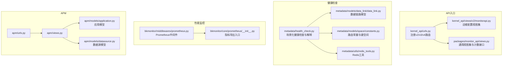
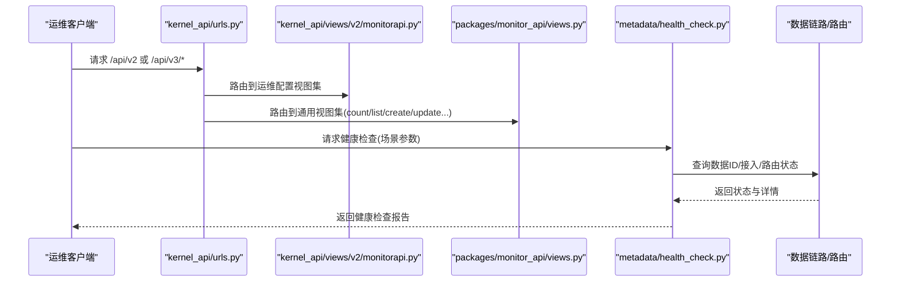
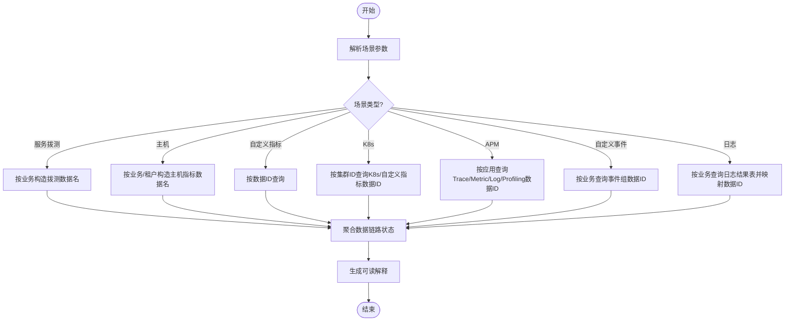
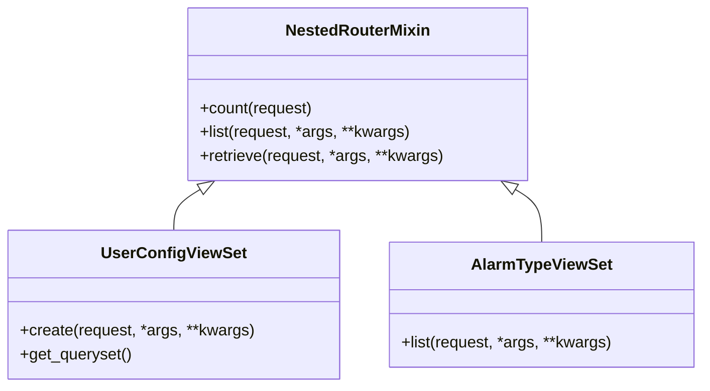
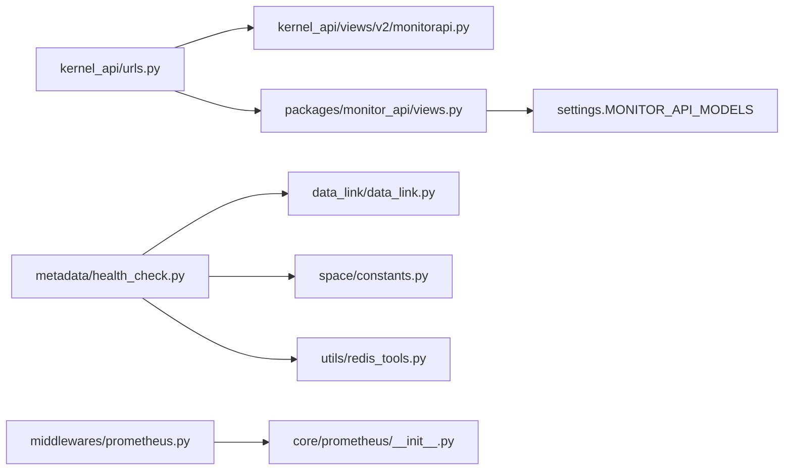

# 系统运维API

<cite>
**本文引用的文件**
- [kernel_api/urls.py](file://bkmonitor/kernel_api/urls.py)
- [kernel_api/views/v2/monitorapi.py](file://bkmonitor/kernel_api/views/v2/monitorapi.py)
- [packages/monitor_api/views.py](file://bkmonitor/packages/monitor_api/views.py)
- [metadata/health_check.py](file://bkmonitor/metadata/health_check.py)
- [bkmonitor/middlewares/prometheus.py](file://bkmonitor/middlewares/prometheus.py)
- [bkmonitor/core/prometheus/__init__.py](file://bkmonitor/core/prometheus/__init__.py)
- [bkmonitor/apm/views.py](file://bkmonitor/apm/views.py)
- [bkmonitor/apm/urls.py](file://bkmonitor/apm/urls.py)
- [bkmonitor/apm/models/application.py](file://bkmonitor/apm/models/application.py)
- [bkmonitor/apm/models/datasource.py](file://bkmonitor/apm/models/datasource.py)
- [bkmonitor/metadata/models/data_link/data_link.py](file://bkmonitor/metadata/models/data_link/data_link.py)
- [bkmonitor/metadata/models/data_link/utils.py](file://bkmonitor/metadata/models/data_link/utils.py)
- [bkmonitor/metadata/models/space/constants.py](file://bkmonitor/metadata/models/space/constants.py)
- [bkmonitor/metadata/utils/redis_tools.py](file://bkmonitor/metadata/utils/redis_tools.py)
- [bkmonitor/middleware/authentication.py](file://bkmonitor/middlewares/authentication.py)
- [bkmonitor/middlewares/request_middlewares.py](file://bkmonitor/middlewares/request_middlewares.py)
- [bkmonitor/migrations/0001_initial.py](file://bkmonitor/migrations/0001_initial.py)
- [bkmonitor/migrations/0002_appsnapshothostindexdata.py](file://bkmonitor/migrations/0002_appsnapshothostindexdata.py)
- [bkmonitor/migrations/0003_basealarm_data.py](file://bkmonitor/migrations/0003_basealarm_data.py)
- [bkmonitor/migrations/0004_alertcollect_extend_info.py](file://bkmonitor/migrations/0004_alertcollect_extend_info.py)
- [bkmonitor/migrations/0005_event_shield_type.py](file://bkmonitor/migrations/0005_event_shield_type.py)
- [bkmonitor/migrations/0005_item_target.py](file://bkmonitor/migrations/0005_item_target.py)
- [bkmonitor/migrations/0006_auto_20200316_1527.py](file://bkmonitor/migrations/0006_auto_20200316_1527.py)
- [bkmonitor/migrations/0006_merge.py](file://bkmonitor/migrations/0006_merge.py)
- [bkmonitor/migrations/0007_merge.py](file://bkmonitor/migrations/0007_merge.py)
- [bkmonitor/migrations/0008_merge.py](file://bkmonitor/migrations/0008_merge.py)
- [bkmonitor/migrations/0009_auto_20200323_1535.py](file://bkmonitor/migrations/0009_auto_20200323_1535.py)
- [bkmonitor/migrations/0010_alertcollect_extend_info.py](file://bkmonitor/migrations/0010_alertcollect_extend_info.py)
- [bkmonitor/migrations/0011_anomalyrecord_count.py](file://bkmonitor/migrations/0011_anomalyrecord_count.py)
- [bkmonitor/migrations/0011_snapshothostindex_rebuild.py](file://bkmonitor/migrations/0011_snapshothostindex_rebuild.py)
- [bkmonitor/migrations/0012_merge_20200525_2109.py](file://bkmonitor/migrations/0012_merge_20200525_2109.py)
- [bkmonitor/migrations/0013_snapshothostindex_append.py](file://bkmonitor/migrations/0013_snapshothostindex_append.py)
- [bkmonitor/migrations/0014_auto_20200616_1143.py](file://bkmonitor/migrations/0014_auto_20200616_1143.py)
- [bkmonitor/migrations/0015_change_gse_ping_metric.py](file://bkmonitor/migrations/0015_change_gse_ping_metric.py)
- [bkmonitor/migrations/0015_fix_metric_unit.py](file://bkmonitor/migrations/0015_fix_metric_unit.py)
- [bkmonitor/migrations/0015_noticegroup_wechat_work_group.py](file://bkmonitor/migrations/0015_noticegroup_wechat_work_group.py)
- [bkmonitor/migrations/0016_auto_20200825_1206.py](file://bkmonitor/migrations/0016_auto_20200825_1206.py)
- [bkmonitor/migrations/0017_merge_20200827_1513.py](file://bkmonitor/migrations/0017_merge_20200827_1513.py)
</cite>

## 目录
1. [简介](#简介)
2. [项目结构](#项目结构)
3. [核心组件](#核心组件)
4. [架构总览](#架构总览)
5. [详细组件分析](#详细组件分析)
6. [依赖分析](#依赖分析)
7. [性能考虑](#性能考虑)
8. [故障排查指南](#故障排查指南)
9. [结论](#结论)
10. [附录](#附录)

## 简介
本文件面向系统运维工程师与平台开发者，系统性梳理监控平台的运维API能力，覆盖系统健康检查、性能监控、配置管理、运维操作等。重点包括：
- 服务状态查询与健康检查：支持按场景（服务拨测、主机、自定义指标、K8s、APM、自定义事件、日志）聚合数据链路健康状态
- 性能指标上报：基于Prometheus中间件与指标导出，支撑系统级与业务级性能观测
- 配置管理：用户配置、业务配置、全局配置的增删改查与过滤
- 运维操作：批量运维、配置热更新、查询路由校验、数据链路状态解释
- 运维自动化与告警：结合健康检查输出与查询路由状态，形成自动化巡检与告警触发依据
- 最佳实践：统一入口、版本化API、鉴权与安全、可观测性与日志追踪

## 项目结构
监控平台采用Django + Django REST Framework，API以版本化路由组织，核心入口位于kernel_api/urls.py，v2/v3/v4多版本并行，配合资源路由自动注册与扩展模块加载。健康检查逻辑集中在metadata/health_check.py，提供按场景聚合的数据链路健康视图；性能监控通过中间件与core/prometheus模块导出指标。

**图表来源**
- [kernel_api/urls.py:79-120](file://bkmonitor/kernel_api/urls.py#L79-L120)
- [kernel_api/views/v2/monitorapi.py:1-110](file://bkmonitor/kernel_api/views/v2/monitorapi.py#L1-L110)
- [packages/monitor_api/views.py:1-214](file://bkmonitor/packages/monitor_api/views.py#L1-L214)
- [metadata/health_check.py:1-787](file://bkmonitor/metadata/health_check.py#L1-L787)
- [metadata/models/data_link/data_link.py](file://bkmonitor/metadata/models/data_link/data_link.py)
- [metadata/models/space/constants.py](file://bkmonitor/metadata/models/space/constants.py)
- [metadata/utils/redis_tools.py](file://bkmonitor/metadata/utils/redis_tools.py)
- [bkmonitor/middlewares/prometheus.py](file://bkmonitor/middlewares/prometheus.py)
- [bkmonitor/core/prometheus/__init__.py](file://bkmonitor/core/prometheus/__init__.py)
- [bkmonitor/apm/urls.py](file://bkmonitor/apm/urls.py)
- [bkmonitor/apm/views.py](file://bkmonitor/apm/views.py)
- [apm/models/application.py](file://bkmonitor/apm/models/application.py)
- [apm/models/datasource.py](file://bkmonitor/apm/models/datasource.py)

**章节来源**
- [kernel_api/urls.py:79-120](file://bkmonitor/kernel_api/urls.py#L79-L120)
- [kernel_api/views/v2/monitorapi.py:1-110](file://bkmonitor/kernel_api/views/v2/monitorapi.py#L1-L110)
- [packages/monitor_api/views.py:1-214](file://bkmonitor/packages/monitor_api/views.py#L1-L214)
- [metadata/health_check.py:1-787](file://bkmonitor/metadata/health_check.py#L1-L787)

## 核心组件
- API路由与版本化
  - v2/v3/v4多版本并行，支持动态模块注册与扩展
  - 提供REST文档入口与Grafana代理入口
- 健康检查引擎
  - 按场景聚合数据链路健康：服务拨测、主机、自定义指标、K8s、APM、自定义事件、日志
  - 输出数据ID状态、数据平台接入状态、查询路由状态，并可生成可读解释
- 性能监控中间件
  - Prometheus指标埋点与导出，支持系统与业务维度的性能观测
- 配置管理视图集
  - 用户配置、业务配置、全局配置、快照主机指标等的增删改查与过滤
- APM数据链路
  - 应用模型与多种数据源模型（Trace/Metric/Log/Profiling）联动，支持按应用聚合健康状态

**章节来源**
- [kernel_api/urls.py:79-120](file://bkmonitor/kernel_api/urls.py#L79-L120)
- [metadata/health_check.py:551-787](file://bkmonitor/metadata/health_check.py#L551-L787)
- [bkmonitor/middlewares/prometheus.py](file://bkmonitor/middlewares/prometheus.py)
- [packages/monitor_api/views.py:91-214](file://bkmonitor/packages/monitor_api/views.py#L91-L214)
- [apm/models/application.py](file://bkmonitor/apm/models/application.py)
- [apm/models/datasource.py](file://bkmonitor/apm/models/datasource.py)

## 架构总览
系统运维API围绕“统一入口 + 多版本路由 + 场景化健康检查 + 性能监控 + 配置管理”展开，形成闭环的运维观测与处置能力。

**图表来源**
- [kernel_api/urls.py:79-120](file://bkmonitor/kernel_api/urls.py#L79-L120)
- [kernel_api/views/v2/monitorapi.py:1-110](file://bkmonitor/kernel_api/views/v2/monitorapi.py#L1-L110)
- [packages/monitor_api/views.py:42-80](file://bkmonitor/packages/monitor_api/views.py#L42-L80)
- [metadata/health_check.py:551-787](file://bkmonitor/metadata/health_check.py#L551-L787)

## 详细组件分析

### 健康检查组件
- 功能要点
  - 场景化检查：服务拨测、主机、自定义指标、K8s、APM、自定义事件、日志
  - 数据链路聚合：数据ID状态、数据平台接入状态、查询路由状态
  - 可解释输出：将复杂状态转换为可读报告，便于自动化巡检与告警
- 关键流程
  - 输入场景参数与上下文（租户、业务、集群、应用）
  - 聚合数据源ID，查询Kafka最新数据时间
  - 校验数据平台接入组件状态与配置
  - 校验查询路由：结果表存在性、数据标签映射、空间路由映射
  - 生成解释文本，汇总异常与正常项

**图表来源**
- [metadata/health_check.py:551-787](file://bkmonitor/metadata/health_check.py#L551-L787)

**章节来源**
- [metadata/health_check.py:59-787](file://bkmonitor/metadata/health_check.py#L59-L787)

### 性能监控组件
- 功能要点
  - 中间件埋点：对请求进行计数、耗时、状态码统计
  - 指标导出：统一暴露Prometheus指标，支持系统与业务维度
- 使用建议
  - 在生产环境启用中间件，确保指标采集连续性
  - 结合Grafana仪表盘进行可视化与阈值告警

**章节来源**
- [bkmonitor/middlewares/prometheus.py](file://bkmonitor/middlewares/prometheus.py)
- [bkmonitor/core/prometheus/__init__.py](file://bkmonitor/core/prometheus/__init__.py)

### 配置管理组件
- 视图集能力
  - 计数接口：统一提供/count
  - 列表/检索/创建/更新/删除：基于settings.MONITOR_API_MODELS动态注册
  - 用户配置：按当前用户过滤，创建时注入用户名
- 适用对象
  - 用户配置、业务配置、全局配置、快照主机指标等

**图表来源**
- [packages/monitor_api/views.py:33-214](file://bkmonitor/packages/monitor_api/views.py#L33-L214)

**章节来源**
- [packages/monitor_api/views.py:42-214](file://bkmonitor/packages/monitor_api/views.py#L42-L214)
- [kernel_api/views/v2/monitorapi.py:40-110](file://bkmonitor/kernel_api/views/v2/monitorapi.py#L40-L110)

### APM健康检查组件
- 功能要点
  - 基于应用模型与数据源模型，按应用聚合Trace/Metric/Log/Profiling数据ID
  - 与健康检查引擎协同，支持按场景查询APM数据链路健康
- 关键模型
  - 应用模型：应用启停与标识
  - 数据源模型：各类型数据源的bk_data_id与启用状态

**章节来源**
- [apm/models/application.py](file://bkmonitor/apm/models/application.py)
- [apm/models/datasource.py](file://bkmonitor/apm/models/datasource.py)
- [metadata/health_check.py:625-665](file://bkmonitor/metadata/health_check.py#L625-L665)

## 依赖分析
- 路由与视图
  - kernel_api/urls.py动态注册v2/v3/v4视图模块，支持扩展模块
  - packages/monitor_api/views.py通过settings.MONITOR_API_MODELS动态生成视图集
- 健康检查依赖
  - metadata/models/data_link/data_link.py：数据链路组件与策略
  - metadata/models/space/constants.py：结果表键空间与映射
  - metadata/utils/redis_tools.py：路由状态缓存读取
- 性能监控
  - middlewares/prometheus.py：中间件埋点
  - core/prometheus/__init__.py：指标导出入口

**图表来源**
- [kernel_api/urls.py:79-120](file://bkmonitor/kernel_api/urls.py#L79-L120)
- [packages/monitor_api/views.py:83-89](file://bkmonitor/packages/monitor_api/views.py#L83-L89)
- [metadata/health_check.py:216-274](file://bkmonitor/metadata/health_check.py#L216-L274)
- [metadata/models/data_link/data_link.py](file://bkmonitor/metadata/models/data_link/data_link.py)
- [metadata/models/space/constants.py](file://bkmonitor/metadata/models/space/constants.py)
- [metadata/utils/redis_tools.py](file://bkmonitor/metadata/utils/redis_tools.py)
- [bkmonitor/middlewares/prometheus.py](file://bkmonitor/middlewares/prometheus.py)
- [bkmonitor/core/prometheus/__init__.py](file://bkmonitor/core/prometheus/__init__.py)

**章节来源**
- [kernel_api/urls.py:79-120](file://bkmonitor/kernel_api/urls.py#L79-L120)
- [packages/monitor_api/views.py:83-89](file://bkmonitor/packages/monitor_api/views.py#L83-L89)
- [metadata/health_check.py:216-274](file://bkmonitor/metadata/health_check.py#L216-L274)

## 性能考虑
- 中间件开销
  - Prometheus中间件对每个请求进行指标统计，建议在高并发场景下评估采样率与指标维度
- 路由查询
  - 健康检查涉及Redis键空间与结果表映射，建议缓存热点键，避免频繁跨模块查询
- 批量操作
  - 建议在运维自动化中合并请求，减少往返次数；对大范围场景（如日志全业务）分批执行

[本节为通用指导，无需具体文件分析]

## 故障排查指南
- 健康检查异常
  - 数据源不存在：确认数据源创建与租户绑定
  - Kafka无数据：检查采集链路与目标集群连通性
  - 数据平台接入异常：核对组件配置与状态
  - 查询路由异常：检查结果表详情、数据标签映射、空间路由映射
- 配置管理问题
  - 用户配置无法写入：确认当前登录用户与只读字段
  - 计数接口异常：检查filterset与queryset过滤条件
- 性能监控缺失
  - 指标未导出：确认中间件已启用且Grafana可访问导出端点
- APM健康检查
  - 应用不存在或未启用：确认应用模型与数据源启用状态

**章节来源**
- [metadata/health_check.py:490-548](file://bkmonitor/metadata/health_check.py#L490-L548)
- [packages/monitor_api/views.py:91-108](file://bkmonitor/packages/monitor_api/views.py#L91-L108)
- [bkmonitor/middlewares/prometheus.py](file://bkmonitor/middlewares/prometheus.py)

## 结论
本运维API以版本化路由为核心，结合场景化健康检查与性能监控中间件，形成“可观测—诊断—处置”的闭环能力。通过统一的配置管理与可解释的健康报告，能够支撑自动化巡检、批量运维与告警联动，满足大规模监控系统的运维需求。

[本节为总结，无需具体文件分析]

## 附录

### API清单与最佳实践
- 统一入口
  - v2：运维配置视图集（用户/业务/全局配置、快照主机指标）
  - v3：按模块细分（collector/meta/models/query等），支持INSTALLED_APIS动态装配
  - v4：扩展模块入口（受ALLOW_EXTEND_API控制）
- 健康检查
  - 推荐按场景调用，结合with_detail获取详细状态，用于自动化巡检
  - 将解释文本纳入告警通知，提升可读性
- 性能监控
  - 启用Prometheus中间件，建立Grafana仪表盘与阈值告警
  - 对高基数指标进行降采样或聚合
- 配置管理
  - 使用/count快速统计资源规模
  - 用户配置按用户隔离，避免越权修改
- 安全与鉴权
  - 建议在网关层统一鉴权与限流
  - 对敏感场景（如配置变更）增加审计日志

**章节来源**
- [kernel_api/urls.py:79-120](file://bkmonitor/kernel_api/urls.py#L79-L120)
- [kernel_api/views/v2/monitorapi.py:1-110](file://bkmonitor/kernel_api/views/v2/monitorapi.py#L1-L110)
- [packages/monitor_api/views.py:42-80](file://bkmonitor/packages/monitor_api/views.py#L42-L80)
- [metadata/health_check.py:721-787](file://bkmonitor/metadata/health_check.py#L721-L787)

### 运维自动化参考
- 巡检流程
  - 按业务/集群/应用枚举场景，批量调用健康检查
  - 解析异常项并触发告警或工单
- 配置热更新
  - 通过配置视图集进行增量更新，结合版本号与回滚策略
- 日志查询
  - 结合Grafana代理入口与查询API，统一日志检索与分析

**章节来源**
- [kernel_api/urls.py:101-114](file://bkmonitor/kernel_api/urls.py#L101-L114)
- [packages/monitor_api/views.py:42-80](file://bkmonitor/packages/monitor_api/views.py#L42-L80)