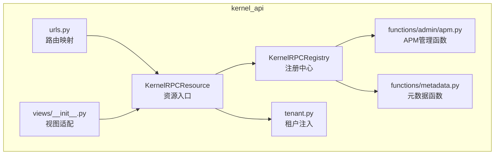
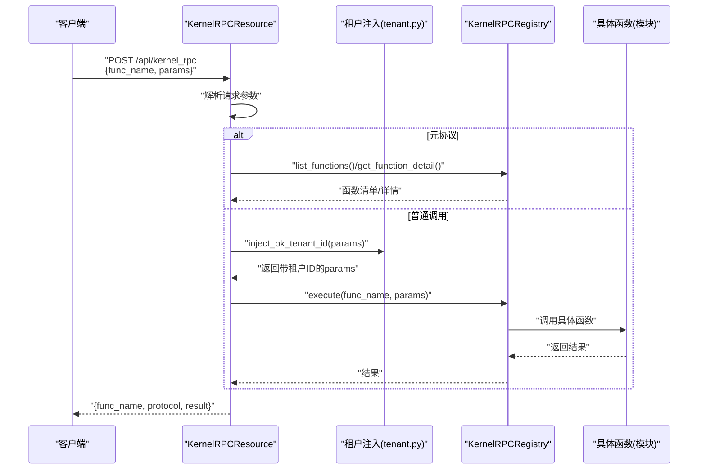
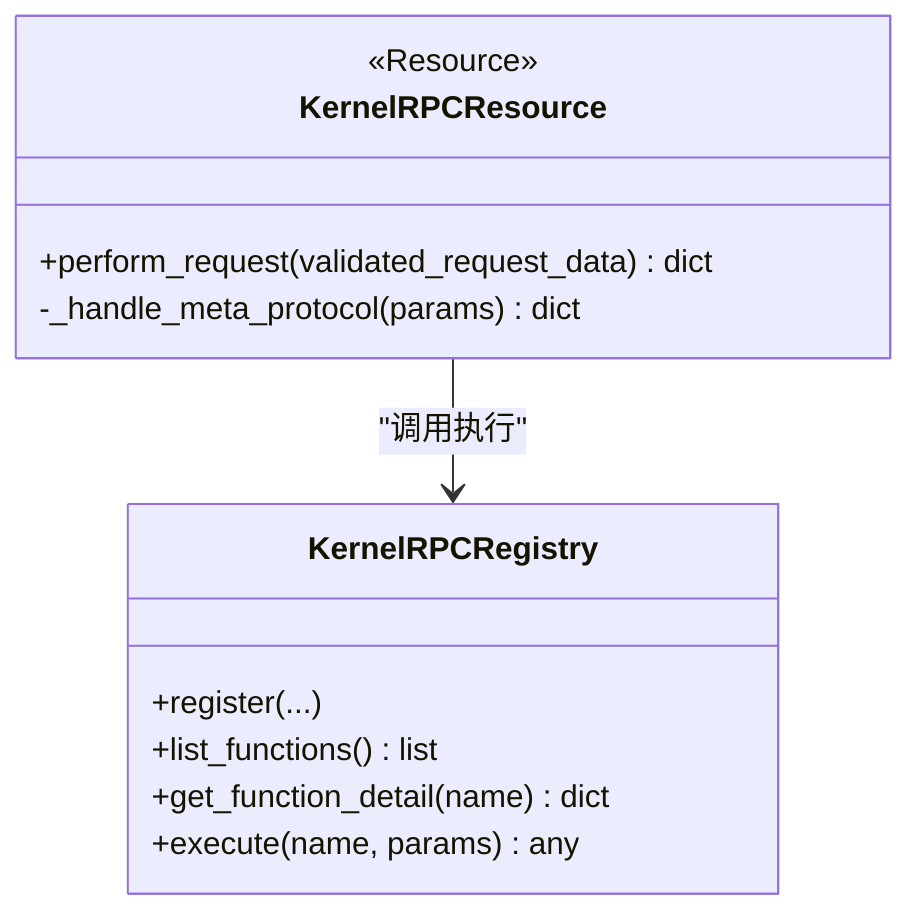
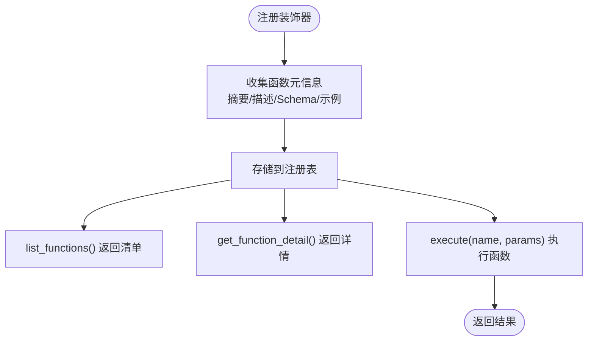
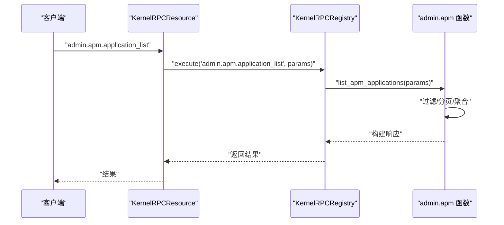
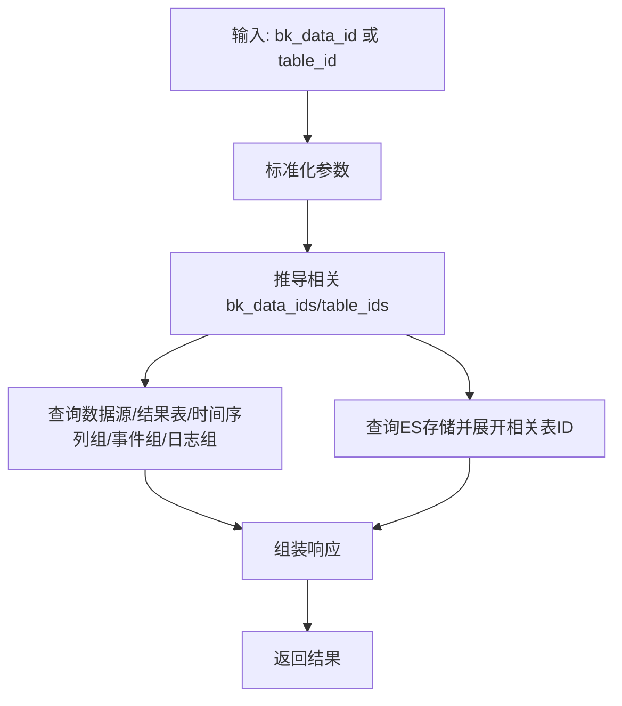
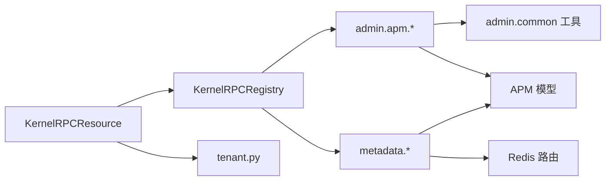

# RPC远程过程调用

<cite>
**本文档引用的文件**
- [kernel_rpc.py](file://bkmonitor/kernel_api/resource/kernel_rpc.py)
- [__init__.py](file://bkmonitor/kernel_api/rpc/__init__.py)
- [registry.py](file://bkmonitor/kernel_api/rpc/registry.py)
- [apm.py](file://bkmonitor/kernel_api/rpc/functions/admin/apm.py)
- [metadata.py](file://bkmonitor/kernel_api/rpc/functions/metadata.py)
- [urls.py](file://bkmonitor/kernel_api/urls.py)
- [views.py](file://bkmonitor/kernel_api/views/__init__.py)
- [tenant.py](file://bkmonitor/kernel_api/rpc/tenant.py)
- [common.py](file://bkmonitor/kernel_api/rpc/functions/admin/common.py)
- [apm/constants.py](file://bkmonitor/apm/constants.py)
- [alarm.py](file://bkmonitor/alarm_backends/core/context/alarm.py)
</cite>

## 目录
1. [简介](#简介)
2. [项目结构](#项目结构)
3. [核心组件](#核心组件)
4. [架构总览](#架构总览)
5. [详细组件分析](#详细组件分析)
6. [依赖分析](#依赖分析)
7. [性能考虑](#性能考虑)
8. [故障排查指南](#故障排查指南)
9. [结论](#结论)
10. [附录](#附录)

## 简介
本文件面向蓝鲸监控平台的RPC远程过程调用能力，系统性说明服务注册、函数调用、参数传递与结果返回机制，记录内核API的服务发现、负载均衡与故障转移策略，覆盖跨进程通信、分布式调用链路与性能监控方法，并提供RPC客户端使用示例、服务端实现指南与调试工具说明。

## 项目结构
RPC能力主要位于kernel_api模块的rpc子系统，核心入口为资源类KernelRPCResource，通过KernelRPCRegistry集中注册与执行函数；配套的admin与metadata等函数模块提供具体业务能力。

**图表来源**
- [kernel_rpc.py:21-99](file://bkmonitor/kernel_api/resource/kernel_rpc.py#L21-L99)
- [__init__.py:11-13](file://bkmonitor/kernel_api/rpc/__init__.py#L11-L13)
- [apm.py:307-352](file://bkmonitor/kernel_api/rpc/functions/admin/apm.py#L307-L352)
- [metadata.py:217-231](file://bkmonitor/kernel_api/rpc/functions/metadata.py#L217-L231)
- [urls.py](file://bkmonitor/kernel_api/urls.py)
- [views.py](file://bkmonitor/kernel_api/views/__init__.py)

**章节来源**
- [kernel_rpc.py:21-99](file://bkmonitor/kernel_api/resource/kernel_rpc.py#L21-L99)
- [__init__.py:11-13](file://bkmonitor/kernel_api/rpc/__init__.py#L11-L13)

## 核心组件
- KernelRPCResource：统一RPC入口资源，负责请求参数解析、元协议处理、租户ID注入与函数执行调度。
- KernelRPCRegistry：函数注册中心，提供注册、列表查询、详情查询与执行能力。
- 租户管理：在调用前自动注入租户ID，确保多租户隔离。
- 函数模块：admin与metadata等模块通过装饰器注册具体业务函数，如APM应用查询、元数据关联信息查询等。

**章节来源**
- [kernel_rpc.py:21-99](file://bkmonitor/kernel_api/resource/kernel_rpc.py#L21-L99)
- [__init__.py:11-13](file://bkmonitor/kernel_api/rpc/__init__.py#L11-L13)

## 架构总览
RPC调用链路从HTTP资源入口进入，经序列化与校验后，根据func_name路由到注册中心，再由注册中心执行对应函数并返回结果。元协议用于查询可用函数与函数详情。

**图表来源**
- [kernel_rpc.py:49-98](file://bkmonitor/kernel_api/resource/kernel_rpc.py#L49-L98)
- [apm.py:307-352](file://bkmonitor/kernel_api/rpc/functions/admin/apm.py#L307-L352)
- [metadata.py:217-231](file://bkmonitor/kernel_api/rpc/functions/metadata.py#L217-L231)
- [tenant.py](file://bkmonitor/kernel_api/rpc/tenant.py)

## 详细组件分析

### 组件A：KernelRPCResource（资源入口）
- 功能职责
  - 定义请求参数：func_name与params。
  - 元协议支持：列出所有可调用函数与查询指定函数详情。
  - 普通调用：注入租户ID后交由注册中心执行。
- 参数与返回
  - 请求：func_name（字符串）、params（字典）。
  - 返回：func_name、protocol（元协议或普通调用）、result（任意JSON）。
- 错误处理
  - 元协议action非法时抛出异常。
  - 未找到目标函数详情时抛出异常。

**图表来源**
- [kernel_rpc.py:21-99](file://bkmonitor/kernel_api/resource/kernel_rpc.py#L21-L99)
- [__init__.py:11-13](file://bkmonitor/kernel_api/rpc/__init__.py#L11-L13)

**章节来源**
- [kernel_rpc.py:21-99](file://bkmonitor/kernel_api/resource/kernel_rpc.py#L21-L99)

### 组件B：KernelRPCRegistry（注册中心）
- 功能职责
  - 注册函数：通过装饰器注册函数，附带摘要、描述、参数Schema与示例。
  - 列表与详情：提供函数清单与单个函数的详细说明。
  - 执行：根据函数名执行对应函数并返回结果。
- 设计要点
  - 使用装饰器统一收集函数元信息，便于元协议查询。
  - 执行时对参数进行标准化与校验（如分页、ID格式等）。

**图表来源**
- [apm.py:307-352](file://bkmonitor/kernel_api/rpc/functions/admin/apm.py#L307-L352)
- [metadata.py:217-231](file://bkmonitor/kernel_api/rpc/functions/metadata.py#L217-L231)

**章节来源**
- [apm.py:307-352](file://bkmonitor/kernel_api/rpc/functions/admin/apm.py#L307-L352)
- [metadata.py:217-231](file://bkmonitor/kernel_api/rpc/functions/metadata.py#L217-L231)

### 组件C：APM管理函数（admin.apm.*）
- 能力概览
  - 应用列表与详情：分页查询APM应用、数据源、结果表、自定义上报与拓扑摘要。
  - 服务列表：TopoNode服务视图分页查询。
  - 拓扑摘要：轻量拓扑节点与关系查询。
- 复杂度与优化
  - 多模型联查与聚合统计，采用批量加载与预计算（如服务数量、实例数量）以降低查询成本。
  - 分页参数标准化，限制最大页大小防止超大结果集。

**图表来源**
- [apm.py:323-351](file://bkmonitor/kernel_api/rpc/functions/admin/apm.py#L323-L351)

**章节来源**
- [apm.py:323-351](file://bkmonitor/kernel_api/rpc/functions/admin/apm.py#L323-L351)

### 组件D：元数据函数（metadata.*）
- 能力概览
  - 元数据关联信息查询：基于bk_data_id或table_id关联查询数据源、结果表、时间序列组、事件组、日志组、ES存储、访问VM记录等。
  - Kafka数据探测：基于租户与数据源ID探测Kafka是否有数据。
  - unify-query Redis路由查询与刷新：支持data_label路由、结果表详情路由与空间路由的状态检查与主动刷新。
- 复杂度与优化
  - ES存储的origin_table_id展开，自动补全相关表ID，减少多次查询。
  - Redis键规则区分单租户与多租户模式，提升路由查询效率。

**图表来源**
- [metadata.py:232-450](file://bkmonitor/kernel_api/rpc/functions/metadata.py#L232-L450)

**章节来源**
- [metadata.py:232-450](file://bkmonitor/kernel_api/rpc/functions/metadata.py#L232-L450)

### 组件E：租户管理（tenant.py）
- 职责
  - 在未显式传入bk_tenant_id时，基于多种标识（如业务ID、空间UID、数据ID等）反查唯一租户ID。
  - 未唯一确定时由具体函数自行处理默认逻辑，保证调用兼容性。
- 与RPC的关系
  - 在KernelRPCResource.perform_request中统一注入，确保所有函数在多租户环境下正确运行。

**章节来源**
- [kernel_rpc.py:60-66](file://bkmonitor/kernel_api/resource/kernel_rpc.py#L60-L66)
- [tenant.py](file://bkmonitor/kernel_api/rpc/tenant.py)

### 组件F：路由与视图（urls.py、views/__init__.py）
- 路由映射
  - 将KernelRPCResource挂载到统一URL，供外部调用。
- 视图适配
  - 提供统一的DRF Resource适配层，屏蔽底层执行细节。

**章节来源**
- [urls.py](file://bkmonitor/kernel_api/urls.py)
- [views.py](file://bkmonitor/kernel_api/views/__init__.py)

## 依赖分析
- 组件耦合
  - KernelRPCResource依赖KernelRPCRegistry与租户注入模块。
  - 具体函数模块依赖注册中心的装饰器与公共工具（如分页、序列化、租户解析）。
- 外部依赖
  - APM与元数据模块依赖各自的数据模型与Redis路由缓存。
  - 统一响应构建依赖公共工具函数。

**图表来源**
- [kernel_rpc.py:17-18](file://bkmonitor/kernel_api/resource/kernel_rpc.py#L17-L18)
- [apm.py:21-27](file://bkmonitor/kernel_api/rpc/functions/admin/apm.py#L21-L27)
- [metadata.py:20-24](file://bkmonitor/kernel_api/rpc/functions/metadata.py#L20-L24)

**章节来源**
- [apm.py:21-27](file://bkmonitor/kernel_api/rpc/functions/admin/apm.py#L21-L27)
- [metadata.py:20-24](file://bkmonitor/kernel_api/rpc/functions/metadata.py#L20-L24)

## 性能考虑
- 查询优化
  - 批量加载与预计算：如服务数量、实例数量通过聚合查询一次性获取，减少多次查询。
  - 分页限制：最大页大小限制，避免超大数据集返回。
- 缓存与路由
  - Redis路由缓存：unify-query路由状态查询直接命中Redis，显著降低数据库压力。
  - ES存储展开：一次查询展开相关表ID，减少后续多次查询。
- 多租户隔离
  - 通过租户ID注入与查询过滤，避免跨租户数据扫描，提升查询效率。

[本节为通用性能建议，无需特定文件来源]

## 故障排查指南
- 常见问题
  - 元协议action非法：检查params.action是否为列表或详情。
  - 未找到函数详情：确认函数名拼写与注册是否一致。
  - 租户ID缺失：确认请求上下文或参数中是否包含唯一租户标识。
  - 参数类型错误：如整数/字符串转换失败，检查bk_data_id、page、page_size等。
- 调试步骤
  - 使用元协议查询函数清单与详情，定位目标函数。
  - 对照函数参数Schema与示例参数，逐步缩小问题范围。
  - 检查Redis路由状态（unify-query），确认data_label与结果表路由是否正确。
  - 查看APM拓扑与服务列表，确认数据是否已入库。

**章节来源**
- [kernel_rpc.py:82-98](file://bkmonitor/kernel_api/resource/kernel_rpc.py#L82-L98)
- [metadata.py:514-693](file://bkmonitor/kernel_api/rpc/functions/metadata.py#L514-L693)

## 结论
本RPC子系统通过统一资源入口与注册中心，实现了函数级的服务注册与调用，结合租户管理与元协议，提供了清晰的服务发现与调试能力。配合APM与元数据函数模块，满足监控平台内核API的多样化需求。建议在生产环境中充分利用Redis路由缓存与分页限制，确保高并发场景下的稳定性与性能。

[本节为总结性内容，无需特定文件来源]

## 附录

### RPC客户端使用示例
- 元协议查询
  - 请求：func_name为元协议常量，params.action为“list”或“detail”，当为“detail”时需提供target_func_name。
  - 返回：函数清单或指定函数的摘要与Schema。
- 普通调用
  - 请求：func_name为目标函数名，params为函数期望的参数字典。
  - 返回：函数执行结果，包含operation、func_name、bk_tenant_id与data等字段。

**章节来源**
- [kernel_rpc.py:28-38](file://bkmonitor/kernel_api/resource/kernel_rpc.py#L28-L38)
- [kernel_rpc.py:68-98](file://bkmonitor/kernel_api/resource/kernel_rpc.py#L68-L98)

### 服务端实现指南
- 注册函数
  - 使用注册中心装饰器注册函数，提供摘要、描述、参数Schema与示例参数。
  - 在函数内部完成参数标准化、分页处理与数据聚合。
- 数据访问
  - 优先使用批量查询与聚合统计，减少数据库压力。
  - 对于Redis路由查询，遵循单租户/多租户的键规则。
- 错误处理
  - 明确抛出自定义异常，便于前端展示与定位问题。

**章节来源**
- [apm.py:307-352](file://bkmonitor/kernel_api/rpc/functions/admin/apm.py#L307-L352)
- [metadata.py:217-231](file://bkmonitor/kernel_api/rpc/functions/metadata.py#L217-L231)

### 跨进程通信与分布式调用链路
- 跨进程通信
  - RPC通过HTTP资源入口统一接入，内部通过注册中心与函数模块解耦，适合多进程部署。
- 分布式调用链路
  - APM侧通过rpc_method、rpc_service、rpc_system等字段记录RPC调用信息，便于追踪与分析。
  - 报警后跳转到APM RPC页面，辅助定位RPC相关告警。

**章节来源**
- [apm/constants.py:159-182](file://bkmonitor/apm/constants.py#L159-L182)
- [apm/constants.py:332-338](file://bkmonitor/apm/constants.py#L332-L338)
- [apm/constants.py:467-475](file://bkmonitor/apm/constants.py#L467-L475)
- [alarm.py:957-1026](file://bkmonitor/alarm_backends/core/context/alarm.py#L957-L1026)

### 内核API的服务发现、负载均衡与故障转移
- 服务发现
  - 通过元协议查询函数清单，实现动态服务发现。
- 负载均衡与故障转移
  - 本仓库未提供具体的LB与FT实现细节；建议在网关层或服务编排层实现LB与FT策略，RPC侧保持无状态与幂等。

**章节来源**
- [kernel_rpc.py:68-80](file://bkmonitor/kernel_api/resource/kernel_rpc.py#L68-L80)