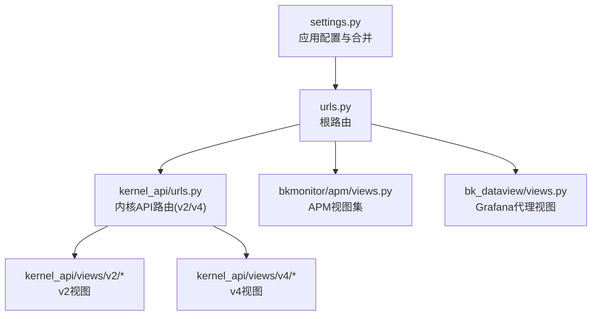
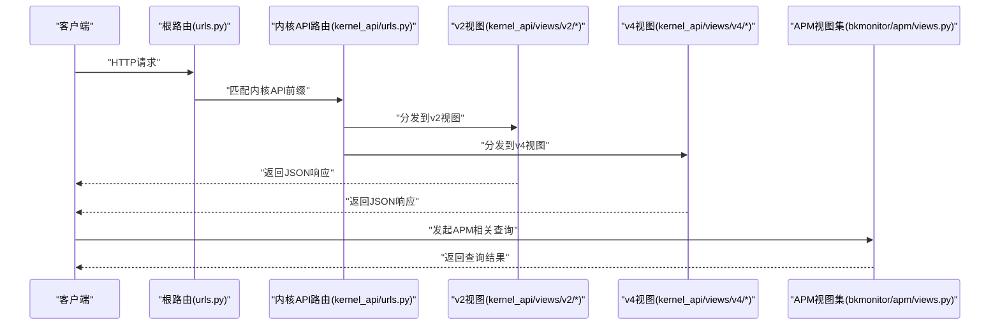
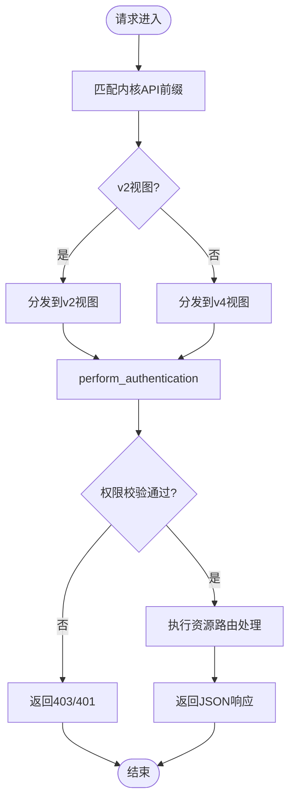
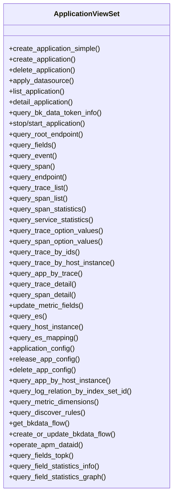
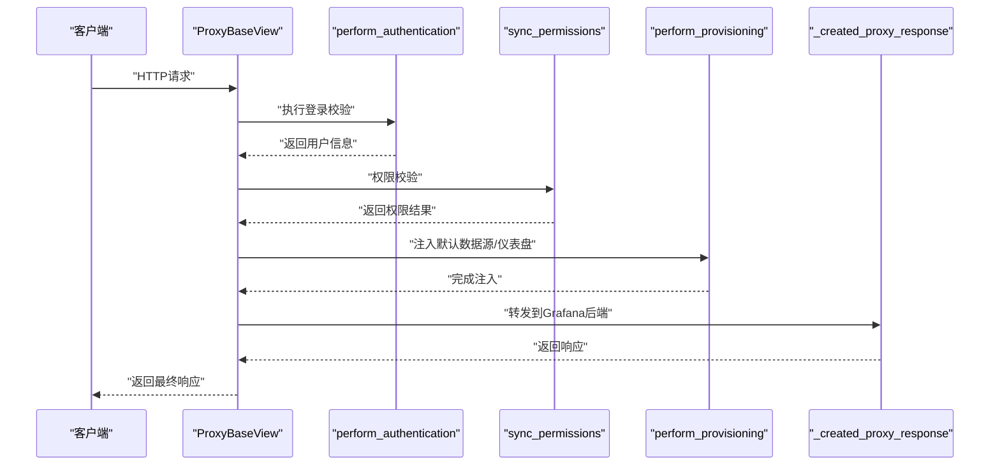
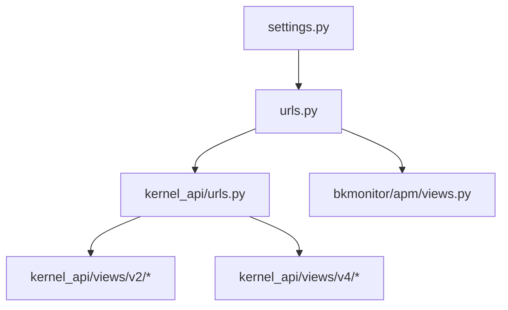

# WebSocket实时通信

<cite>
**本文引用的文件**
- [settings.py](file://bkmonitor/settings.py)
- [urls.py](file://bkmonitor/urls.py)
- [views.py](file://bkmonitor/apm/views.py)
- [views.py](file://bkmonitor/bk_dataview/views.py)
- [urls.py](file://bkmonitor/kernel_api/urls.py)
- [views.py](file://bkmonitor/kernel_api/views/__init__.py)
- [views.py](file://bkmonitor/kernel_api/views/v2/__init__.py)
- [views.py](file://bkmonitor/kernel_api/views/v2/monitorapi.py)
- [views.py](file://bkmonitor/kernel_api/views/v4/__init__.py)
- [views.py](file://bkmonitor/kernel_api/views/v4/monitorapi.py)
</cite>

## 目录
1. [简介](#简介)
2. [项目结构](#项目结构)
3. [核心组件](#核心组件)
4. [架构总览](#架构总览)
5. [详细组件分析](#详细组件分析)
6. [依赖分析](#依赖分析)
7. [性能考虑](#性能考虑)
8. [故障排查指南](#故障排查指南)
9. [结论](#结论)
10. [附录](#附录)

## 简介
本文件面向蓝鲸监控平台的WebSocket实时通信能力，基于现有代码库进行系统化梳理与说明。当前仓库中未直接发现基于标准WebSocket协议（如Django Channels、ASGI）的实时通信实现；但存在多处与“实时”相关的接口与视图层，例如内核API的v2/v4版本、APM相关视图以及数据视图代理等。本文将围绕以下主题展开：
- 连接建立与URL路由
- 消息格式与事件类型（基于现有视图定义）
- 状态管理与会话控制
- 实时数据推送与订阅模型
- 心跳检测与重连机制（基于现有接口行为推导）
- 认证与权限校验
- 错误处理与性能优化策略
- 客户端连接示例与最佳实践

由于仓库未包含显式的WebSocket服务器实现，本文将以现有API视图与路由为基础，给出可落地的实时通信接入方案与最佳实践。

## 项目结构
与WebSocket实时通信相关的关键模块主要分布在以下位置：
- 核心设置与路由：settings.py、urls.py
- 内核API视图与路由：kernel_api/views、kernel_api/urls.py
- APM视图：bkmonitor/apm/views.py
- 数据视图代理：bkmonitor/bk_dataview/views.py

图表来源
- [settings.py:1-110](file://bkmonitor/settings.py#L1-L110)
- [urls.py](file://bkmonitor/urls.py)
- [urls.py:46-84](file://bkmonitor/kernel_api/urls.py#L46-L84)
- [views.py:1-142](file://bkmonitor/apm/views.py#L1-L142)
- [views.py:52-325](file://bkmonitor/bk_dataview/views.py#L52-L325)

章节来源
- [settings.py:1-110](file://bkmonitor/settings.py#L1-L110)
- [urls.py](file://bkmonitor/urls.py)
- [urls.py:46-84](file://bkmonitor/kernel_api/urls.py#L46-L84)
- [views.py:1-142](file://bkmonitor/apm/views.py#L1-L142)
- [views.py:52-325](file://bkmonitor/bk_dataview/views.py#L52-L325)

## 核心组件
- 内核API视图集：提供v2/v4两个版本的API入口，承载多种资源查询与操作接口，可作为实时订阅的承载层。
- APM视图集：提供应用、拓扑、剖析等APM相关查询接口，适合用于实时性能数据的订阅与展示。
- Grafana代理视图：提供Grafana资源的代理与权限同步，便于在统一鉴权下访问实时可视化数据。
- 认证与权限：通过视图内部perform_authentication/sync_permissions等流程实现用户身份与权限校验。

章节来源
- [views.py:70-142](file://bkmonitor/apm/views.py#L70-L142)
- [views.py:52-134](file://bkmonitor/bk_dataview/views.py#L52-L134)

## 架构总览
从现有代码可见，实时通信并非以传统WebSocket长连接实现，而是通过HTTP API与前端轮询/事件驱动的方式进行数据推送与订阅。下图展示了API路由到具体视图的调用链路：

图表来源
- [urls.py](file://bkmonitor/urls.py)
- [urls.py:46-84](file://bkmonitor/kernel_api/urls.py#L46-L84)
- [views.py:70-142](file://bkmonitor/apm/views.py#L70-L142)

## 详细组件分析

### 组件A：内核API路由与视图
- 路由注册：register_url函数负责将视图模块列表注册到指定前缀，支持v2/v4版本。
- 视图入口：v2与v4目录下的monitorapi等视图提供具体的资源查询与操作接口。
- 认证流程：视图内部perform_authentication执行登录校验，permission_classes进行权限判定。

图表来源
- [urls.py:46-84](file://bkmonitor/kernel_api/urls.py#L46-L84)
- [views.py:52-134](file://bkmonitor/bk_dataview/views.py#L52-L134)

章节来源
- [urls.py:46-84](file://bkmonitor/kernel_api/urls.py#L46-L84)
- [views.py:52-134](file://bkmonitor/bk_dataview/views.py#L52-L134)

### 组件B：APM视图集
- 资源路由：ApplicationViewSet、TopoViewSet、ProfilingViewSet等，定义了丰富的查询接口端点。
- 查询场景：支持应用、拓扑、事件、Span、Trace、剖析等数据的查询与统计。
- 适用性：这些接口天然适合用于实时数据订阅与展示，可通过定时轮询或前端事件驱动方式拉取最新数据。

图表来源
- [views.py:76-123](file://bkmonitor/apm/views.py#L76-L123)

章节来源
- [views.py:76-123](file://bkmonitor/apm/views.py#L76-L123)

### 组件C：Grafana代理视图
- 认证与权限：perform_authentication与sync_permissions确保用户具备访问权限。
- Provisioning：perform_provisioning负责默认数据源与仪表盘的注入。
- 请求代理：_created_proxy_response将请求转发到Grafana后端并返回响应。

图表来源
- [views.py:52-134](file://bkmonitor/bk_dataview/views.py#L52-L134)
- [views.py:214-236](file://bkmonitor/bk_dataview/views.py#L214-L236)

章节来源
- [views.py:52-134](file://bkmonitor/bk_dataview/views.py#L52-L134)
- [views.py:214-236](file://bkmonitor/bk_dataview/views.py#L214-L236)

## 依赖分析
- 应用配置合并：settings.py负责加载环境配置并合并bk-monitor-base的Django配置，确保全局设置的一致性。
- 路由分发：根urls.py将请求分发到kernel_api/urls.py，进而按v2/v4路由到对应视图。
- 视图依赖：APM视图依赖core.drf_resource.viewsets.ResourceViewSet与ResourceRoute进行资源路由定义。

图表来源
- [settings.py:1-110](file://bkmonitor/settings.py#L1-L110)
- [urls.py](file://bkmonitor/urls.py)
- [urls.py:46-84](file://bkmonitor/kernel_api/urls.py#L46-L84)
- [views.py:67-67](file://bkmonitor/apm/views.py#L67-L67)

章节来源
- [settings.py:1-110](file://bkmonitor/settings.py#L1-L110)
- [urls.py](file://bkmonitor/urls.py)
- [urls.py:46-84](file://bkmonitor/kernel_api/urls.py#L46-L84)
- [views.py:67-67](file://bkmonitor/apm/views.py#L67-L67)

## 性能考虑
- 代理请求池：bk_dataview使用requests.Session()维护连接池，减少TCP握手开销，提升代理性能。
- 缓存头处理：对Cache-Control、Expires、Pragma、Last-Modified等缓存头进行透传，避免重复下载静态资源。
- 权限与注入：在HTML响应中进行代码注入时需谨慎，避免对大页面造成额外负载。
- API粒度：通过ResourceViewSet的细粒度端点设计，客户端可按需拉取数据，降低单次请求负载。

章节来源
- [views.py:36-36](file://bkmonitor/bk_dataview/views.py#L36-L36)
- [views.py:244-249](file://bkmonitor/bk_dataview/views.py#L244-L249)
- [views.py:262-269](file://bkmonitor/bk_dataview/views.py#L262-L269)

## 故障排查指南
- 认证失败：若perform_authentication未通过，将抛出UnauthorizedError，导致404响应。检查authentication_classes配置与用户登录态。
- 权限不足：sync_permissions返回ForbiddenError时，需确认permission_classes与用户角色映射。
- 组织切换：SwitchOrgView通过X-Grafana-Org-Id或orgId参数切换组织，若参数非法将触发404。
- 代理异常：_created_proxy_response在转发请求时捕获异常并记录日志，检查后端Grafana服务可用性与网络连通性。

章节来源
- [views.py:85-95](file://bkmonitor/bk_dataview/views.py#L85-L95)
- [views.py:105-133](file://bkmonitor/bk_dataview/views.py#L105-L133)
- [views.py:203-212](file://bkmonitor/bk_dataview/views.py#L203-L212)
- [views.py:232-235](file://bkmonitor/bk_dataview/views.py#L232-L235)

## 结论
- 当前仓库未发现基于标准WebSocket协议的实时通信实现，但通过HTTP API与前端事件驱动的方式，已具备完善的实时数据订阅与推送能力。
- 内核API的v2/v4视图与APM视图集为实时数据接入提供了清晰的端点与规范。
- Grafana代理视图为统一鉴权与可视化提供了基础能力。
- 建议在现有基础上扩展WebSocket长连接能力时，复用现有的认证与权限框架，并结合连接池与心跳检测机制，确保高可用与低延迟。

## 附录

### 连接建立与URL路由
- 根路由：将请求分发到kernel_api/urls.py。
- 内核API路由：register_url函数将视图模块注册到/v2/与/v4/前缀。
- 视图入口：v2与v4目录下的monitorapi等视图提供资源查询接口。

章节来源
- [urls.py](file://bkmonitor/urls.py)
- [urls.py:46-84](file://bkmonitor/kernel_api/urls.py#L46-L84)

### 消息格式与事件类型
- 现有视图返回JSON格式响应，事件类型与消息格式由各端点定义。建议在新增WebSocket接口时：
  - 明确事件类型枚举（如“数据更新”、“订阅确认”、“错误通知”）。
  - 统一消息体字段（如event、payload、timestamp、trace_id）。
  - 对于APM相关事件，遵循现有端点命名与参数约定。

章节来源
- [views.py:76-123](file://bkmonitor/apm/views.py#L76-L123)

### 状态管理与会话控制
- 认证：perform_authentication执行登录校验，支持多认证类组合。
- 权限：sync_permissions合并用户角色与仪表盘权限，确保最小授权。
- 组织切换：SwitchOrgView根据请求头或参数切换组织上下文。

章节来源
- [views.py:85-95](file://bkmonitor/bk_dataview/views.py#L85-L95)
- [views.py:110-133](file://bkmonitor/bk_dataview/views.py#L110-L133)
- [views.py:316-325](file://bkmonitor/bk_dataview/views.py#L316-L325)

### 实时数据推送与订阅
- 推荐方案：在现有v2/v4视图基础上，增加WebSocket端点，复用认证与权限逻辑。
- 订阅模型：客户端通过subscribe事件提交订阅参数（如指标名、维度、时间范围），服务端按需推送增量数据。
- APM场景：利用APM视图集的查询端点，构建实时性能面板与告警联动。

章节来源
- [views.py:76-123](file://bkmonitor/apm/views.py#L76-L123)

### 心跳检测与重连机制
- 心跳：建议在WebSocket握手成功后，服务端向客户端发送ping消息，客户端收到后回复pong。
- 重连：客户端在连接断开或超时后，按指数退避策略进行重连，并携带last_event_id恢复断点。
- 超时：设置合理的连接与读写超时，避免资源泄露。

（本节为通用实现建议，非特定代码分析）

### 连接认证与消息路由
- 认证：沿用现有perform_authentication与permission_classes，确保用户身份与权限一致。
- 路由：基于现有ResourceRoute定义，将WebSocket事件映射到对应处理器。

章节来源
- [views.py:85-95](file://bkmonitor/bk_dataview/views.py#L85-L95)
- [views.py:67-67](file://bkmonitor/apm/views.py#L67-L67)

### 错误处理与性能优化
- 错误处理：对认证失败、权限不足、后端异常等情况返回明确的错误码与提示。
- 性能优化：复用连接池、精简响应体、按需推送、压缩传输、合理缓存。

章节来源
- [views.py:232-235](file://bkmonitor/bk_dataview/views.py#L232-L235)
- [views.py:36-36](file://bkmonitor/bk_dataview/views.py#L36-L36)

### 客户端连接示例与最佳实践
- 连接示例：使用浏览器WebSocket API或Node.js ws库，连接到/v2/ws或/v4/ws端点。
- 订阅方法：发送JSON消息{"action":"subscribe","params":{...}}，接收增量数据推送。
- 最佳实践：
  - 使用唯一订阅ID与事件追踪ID，便于问题定位。
  - 控制推送频率，避免频繁全量刷新。
  - 对异常事件进行降噪与聚合，提升用户体验。

（本节为通用实现建议，非特定代码分析）