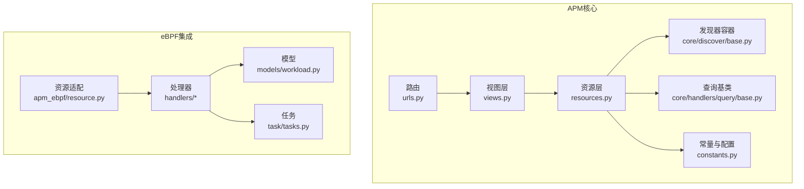
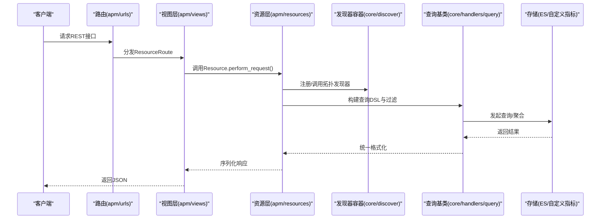
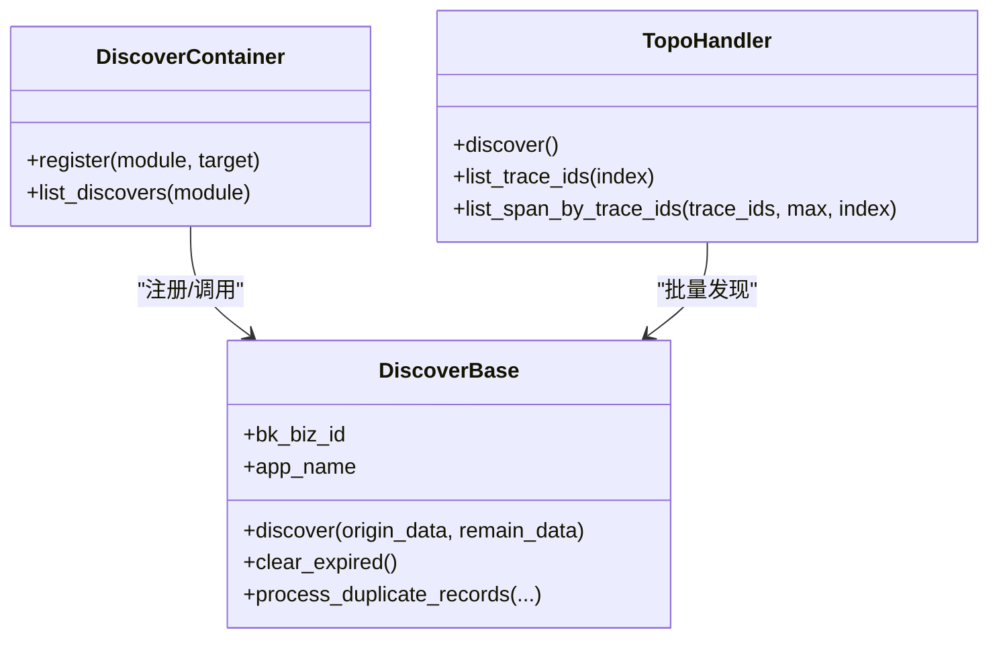
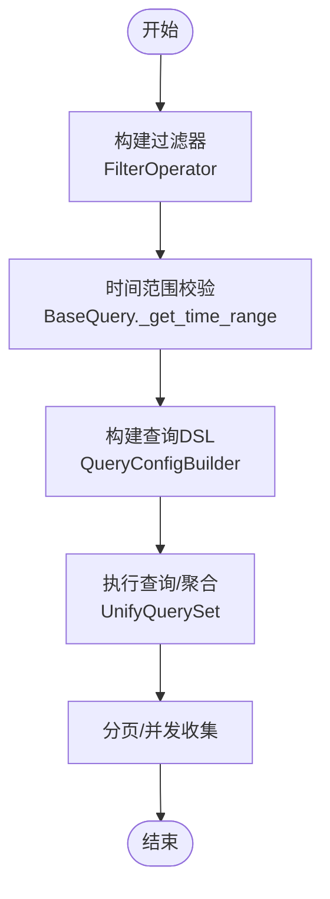
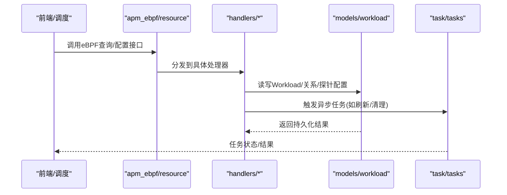
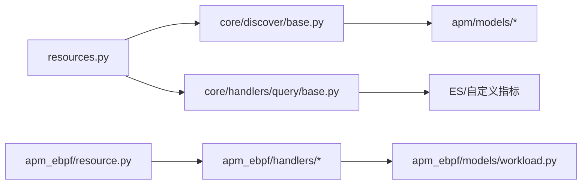

# APM全栈监控

<cite>
**本文引用的文件**
- [apps.py](file://bkmonitor/apm/apps.py)
- [constants.py](file://bkmonitor/apm/constants.py)
- [views.py](file://bkmonitor/apm/views.py)
- [urls.py](file://bkmonitor/apm/urls.py)
- [resources.py](file://bkmonitor/apm/resources.py)
- [serializers.py](file://bkmonitor/apm/serializers.py)
- [types.py](file://bkmonitor/apm/types.py)
- [core/discover/base.py](file://bkmonitor/apm/core/discover/base.py)
- [core/handlers/query/base.py](file://bkmonitor/apm/core/handlers/query/base.py)
- [apm_ebpf/handlers/deepflow.py](file://bkmonitor/apm_ebpf/handlers/deepflow.py)
- [apm_ebpf/handlers/provisioning.py](file://bkmonitor/apm_ebpf/handlers/provisioning.py)
- [apm_ebpf/handlers/relation.py](file://bkmonitor/apm_ebpf/handaders/relation.py)
- [apm_ebpf/handlers/workload.py](file://bkmonitor/apm_ebpf/handlers/workload.py)
- [apm_ebpf/resource.py](file://bkmonitor/apm_ebpf/resource.py)
- [apm_ebpf/models/workload.py](file://bkmonitor/apm_ebpf/models/workload.py)
- [apm_ebpf/task/tasks.py](file://bkmonitor/apm_ebpf/task/tasks.py)
- [apm_ebpf/migrations/0001_initial.py](file://bkmonitor/apm_ebpf/migrations/0001_initial.py)
- [apm_ebpf/migrations/0002_clusterrelation.py](file://bkmonitor/apm_ebpf/migrations/0002_clusterrelation.py)
- [apm_ebpf/migrations/0003_auto_20231207_1520.py](file://bkmonitor/apm_ebpf/migrations/0003_auto_20231207_1520.py)
- [apm_ebpf/migrations/0004_merge_20231211_1735.py](file://bkmonitor/apm_ebpf/migrations/0004_merge_20231211_1735.py)
- [apm_ebpf/migrations/0005_deepflowdashboardrecord.py](file://bkmonitor/apm_ebpf/migrations/0005_deepflowdashboardrecord.py)
- [apm_ebpf/constants.py](file://bkmonitor/apm_ebpf/constants.py)
- [apm_ebpf/admin.py](file://bkmonitor/apm_ebpf/admin.py)
- [apm_ebpf/apps.py](file://bkmonitor/apm_ebpf/apps.py)
- [apm_ebpf/__init__.py](file://bkmonitor/apm_ebpf/__init__.py)
</cite>

## 目录
1. [简介](#简介)
2. [项目结构](#项目结构)
3. [核心组件](#核心组件)
4. [架构总览](#架构总览)
5. [详细组件分析](#详细组件分析)
6. [依赖分析](#依赖分析)
7. [性能考量](#性能考量)
8. [故障排查指南](#故障排查指南)
9. [结论](#结论)
10. [附录](#附录)

## 简介
本文件面向APM全栈监控系统的技术文档，围绕链路追踪、性能指标采集与分析、Profile数据处理、拓扑发现算法、eBPF集成、分布式追踪、性能瓶颈定位与根因分析策略展开。文档同时覆盖APM数据模型、查询接口、可视化展示与告警配置，并提供典型监控场景示例与性能优化建议，帮助读者快速理解并落地实施。

## 项目结构
APM模块位于bkmonitor/apm目录下，采用“资源视图-处理器-发现器-查询代理”的分层设计；eBPF能力位于独立的apm_ebpf子模块，负责与DeepFlow等外部系统对接，实现Workload、关系与探针配置的编排与数据汇聚。

图表来源
- [views.py:70-142](file://bkmonitor/apm/views.py#L70-L142)
- [resources.py:113-800](file://bkmonitor/apm/resources.py#L113-L800)
- [urls.py:16-22](file://bkmonitor/apm/urls.py#L16-L22)
- [core/discover/base.py:138-276](file://bkmonitor/apm/core/discover/base.py#L138-L276)
- [core/handlers/query/base.py:132-388](file://bkmonitor/apm/core/handlers/query/base.py#L132-L388)
- [apm_ebpf/resource.py](file://bkmonitor/apm_ebpf/resource.py)
- [apm_ebpf/handlers/deepflow.py](file://bkmonitor/apm_ebpf/handlers/deepflow.py)
- [apm_ebpf/handlers/provisioning.py](file://bkmonitor/apm_ebpf/handlers/provisioning.py)
- [apm_ebpf/handlers/relation.py](file://bkmonitor/apm_ebpf/handlers/relation.py)
- [apm_ebpf/handlers/workload.py](file://bkmonitor/apm_ebpf/handlers/workload.py)
- [apm_ebpf/models/workload.py](file://bkmonitor/apm_ebpf/models/workload.py)

章节来源
- [apps.py:25-69](file://bkmonitor/apm/apps.py#L25-L69)
- [urls.py:16-22](file://bkmonitor/apm/urls.py#L16-L22)
- [views.py:70-142](file://bkmonitor/apm/views.py#L70-L142)

## 核心组件
- 应用初始化与发现器注册：在ready钩子中注册各类拓扑发现器（端点、主机、实例、节点、关系、远端服务关系、根端点），并按遥测数据类型（Trace/Metric/Profiling）分发。
- 资源视图与路由：通过ResourceViewSet暴露REST接口，涵盖应用管理、拓扑查询、Trace/Span查询、Profile查询、事件与字段统计等。
- 查询与过滤：统一的查询基类封装了过滤器映射、时间范围校验、字段TopK/聚合查询、分页与并发收集等能力。
- eBPF集成：提供DeepFlow对接、Workload编排、关系与探针配置等处理器，支撑容器/云原生环境下的性能剖析与网络关系识别。

章节来源
- [apps.py:30-69](file://bkmonitor/apm/apps.py#L30-L69)
- [views.py:70-142](file://bkmonitor/apm/views.py#L70-L142)
- [resources.py:113-800](file://bkmonitor/apm/resources.py#L113-L800)
- [core/handlers/query/base.py:132-388](file://bkmonitor/apm/core/handlers/query/base.py#L132-L388)

## 架构总览
APM系统由“数据接入-拓扑发现-查询代理-可视化与告警”构成闭环。数据经OpenTelemetry等采集后进入ES/自定义指标存储；拓扑发现器基于规则与字段谓词提取服务、端点、实例、关系等；查询代理屏蔽底层存储差异，提供统一的查询DSL；eBPF处理器与DeepFlow联动，补充Workload与网络关系。

图表来源
- [urls.py:16-22](file://bkmonitor/apm/urls.py#L16-L22)
- [views.py:70-142](file://bkmonitor/apm/views.py#L70-L142)
- [resources.py:113-800](file://bkmonitor/apm/resources.py#L113-L800)
- [core/discover/base.py:138-276](file://bkmonitor/apm/core/discover/base.py#L138-L276)
- [core/handlers/query/base.py:132-388](file://bkmonitor/apm/core/handlers/query/base.py#L132-L388)

## 详细组件分析

### 拓扑发现与规则引擎
- DiscoverContainer：按遥测数据类型注册发现器，支持Trace/Metric/Profiling三类。
- DiscoverBase：抽象基类，提供规则解析、字段提取、重复记录处理、过期清理、最大数量裁剪等通用能力。
- TopoHandler：基于Trace索引滚动聚合TraceId，分批拉取Span，按发现器类型选择全量或过滤后的Span集合，多线程并发执行拓扑发现。

图表来源
- [core/discover/base.py:138-276](file://bkmonitor/apm/core/discover/base.py#L138-L276)
- [apps.py:30-69](file://bkmonitor/apm/apps.py#L30-L69)

章节来源
- [core/discover/base.py:138-571](file://bkmonitor/apm/core/discover/base.py#L138-L571)
- [apps.py:30-69](file://bkmonitor/apm/apps.py#L30-L69)

### 查询与过滤（Trace/Span/指标）
- FilterOperator：将多种操作符映射为统一查询语法，支持通配符、存在性、区间、比较等。
- BaseQuery：统一时间范围、字段映射、TopK/聚合查询、分页与并发收集，屏蔽存储差异。
- 资源层接口：提供Trace/Event/字段统计/TopK/OptionValues等查询入口，配合序列化器校验输入。

图表来源
- [core/handlers/query/base.py:40-388](file://bkmonitor/apm/core/handlers/query/base.py#L40-L388)
- [resources.py:113-800](file://bkmonitor/apm/resources.py#L113-L800)
- [serializers.py:18-78](file://bkmonitor/apm/serializers.py#L18-L78)

章节来源
- [core/handlers/query/base.py:132-388](file://bkmonitor/apm/core/handlers/query/base.py#L132-L388)
- [resources.py:113-800](file://bkmonitor/apm/resources.py#L113-L800)
- [serializers.py:18-78](file://bkmonitor/apm/serializers.py#L18-L78)

### eBPF与DeepFlow集成
- DeepFlow对接：提供Workload、关系、探针配置等处理器，支持与DeepFlow Dashboard联动。
- 资源适配：统一eBPF相关接口，便于前端与任务调度。
- 模型与任务：Workload模型、任务编排与迁移脚本，保障配置持久化与版本演进。

图表来源
- [apm_ebpf/resource.py](file://bkmonitor/apm_ebpf/resource.py)
- [apm_ebpf/handlers/deepflow.py](file://bkmonitor/apm_ebpf/handlers/deepflow.py)
- [apm_ebpf/handlers/provisioning.py](file://bkmonitor/apm_ebpf/handlers/provisioning.py)
- [apm_ebpf/handlers/relation.py](file://bkmonitor/apm_ebpf/handlers/relation.py)
- [apm_ebpf/handlers/workload.py](file://bkmonitor/apm_ebpf/handlers/workload.py)
- [apm_ebpf/models/workload.py](file://bkmonitor/apm_ebpf/models/workload.py)
- [apm_ebpf/task/tasks.py](file://bkmonitor/apm_ebpf/task/tasks.py)

章节来源
- [apm_ebpf/resource.py](file://bkmonitor/apm_ebpf/resource.py)
- [apm_ebpf/handlers/deepflow.py](file://bkmonitor/apm_ebpf/handlers/deepflow.py)
- [apm_ebpf/handlers/provisioning.py](file://bkmonitor/apm_ebpf/handlers/provisioning.py)
- [apm_ebpf/handlers/relation.py](file://bkmonitor/apm_ebpf/handlers/relation.py)
- [apm_ebpf/handlers/workload.py](file://bkmonitor/apm_ebpf/handlers/workload.py)
- [apm_ebpf/models/workload.py](file://bkmonitor/apm_ebpf/models/workload.py)
- [apm_ebpf/task/tasks.py](file://bkmonitor/apm_ebpf/task/tasks.py)

### 数据模型与配置
- APM常量与枚举：包含Apdex、可见性、缓存类型、Profile查询类型、聚合方法、统计属性等。
- 应用配置：支持Apdex、采样、实例名、维度、自定义服务、License、DB配置、探针配置、慢SQL规则、返回码重定义、QPS等。
- eBPF配置：包含Workload、ClusterRelation、DashboardRecord等迁移与模型定义。

章节来源
- [constants.py:20-737](file://bkmonitor/apm/constants.py#L20-L737)
- [resources.py:353-784](file://bkmonitor/apm/resources.py#L353-L784)
- [apm_ebpf/migrations/0001_initial.py](file://bkmonitor/apm_ebpf/migrations/0001_initial.py)
- [apm_ebpf/migrations/0002_clusterrelation.py](file://bkmonitor/apm_ebpf/migrations/0002_clusterrelation.py)
- [apm_ebpf/migrations/0003_auto_20231207_1520.py](file://bkmonitor/apm_ebpf/migrations/0003_auto_20231207_1520.py)
- [apm_ebpf/migrations/0004_merge_20231211_1735.py](file://bkmonitor/apm_ebpf/migrations/0004_merge_20231211_1735.py)
- [apm_ebpf/migrations/0005_deepflowdashboardrecord.py](file://bkmonitor/apm_ebpf/migrations/0005_deepflowdashboardrecord.py)

## 依赖分析
- 组件耦合：资源层依赖发现器容器与查询基类；发现器容器依赖规则模型与数据源；查询基类依赖统一查询配置与UnifyQuerySet。
- 外部依赖：ES、自定义指标存储、DeepFlow、OpenTelemetry语义约定。
- 潜在循环：当前结构通过Resource作为胶水层，避免直接循环依赖。

图表来源
- [resources.py:113-800](file://bkmonitor/apm/resources.py#L113-L800)
- [core/discover/base.py:138-276](file://bkmonitor/apm/core/discover/base.py#L138-L276)
- [core/handlers/query/base.py:132-388](file://bkmonitor/apm/core/handlers/query/base.py#L132-L388)
- [apm_ebpf/resource.py](file://bkmonitor/apm_ebpf/resource.py)
- [apm_ebpf/handlers/workload.py](file://bkmonitor/apm_ebpf/handlers/workload.py)
- [apm_ebpf/models/workload.py](file://bkmonitor/apm_ebpf/models/workload.py)

章节来源
- [resources.py:113-800](file://bkmonitor/apm/resources.py#L113-L800)
- [core/discover/base.py:138-276](file://bkmonitor/apm/core/discover/base.py#L138-L276)
- [core/handlers/query/base.py:132-388](file://bkmonitor/apm/core/handlers/query/base.py#L132-L388)

## 性能考量
- 并发与批处理：TopoHandler使用线程池并发拉取Span并分批处理，避免单轮OOM；按索引max_result_window动态调整批次大小。
- 过滤与裁剪：按SpanKind过滤减少无效数据；定期清理过期拓扑记录与重复记录，控制存储增长。
- 查询优化：统一时间窗口与字段映射，避免跨存储复杂JOIN；TopK/聚合查询采用并发收集，降低延迟。
- 缓存策略：统一缓存键模板与过期时间，保障拓扑热点数据的时效性与一致性。

章节来源
- [core/discover/base.py:332-571](file://bkmonitor/apm/core/discover/base.py#L332-L571)
- [core/handlers/query/base.py:214-248](file://bkmonitor/apm/core/handlers/query/base.py#L214-L248)
- [constants.py:578-636](file://bkmonitor/apm/constants.py#L578-L636)

## 故障排查指南
- 拓扑发现失败：检查发现器注册与规则是否存在；确认Trace索引可用与权限；查看TopoHandler日志中的错误堆栈。
- 查询超时/结果为空：核对时间范围是否在保留期内；确认过滤条件是否过于严格；检查存储连接与索引mapping。
- eBPF配置异常：核对Workload/关系/探针配置是否正确；查看任务队列状态与迁移脚本执行情况。
- 缓存命中问题：确认缓存键模板与过期时间配置；检查缓存后端连通性。

章节来源
- [core/discover/base.py:442-468](file://bkmonitor/apm/core/discover/base.py#L442-L468)
- [core/handlers/query/base.py:294-319](file://bkmonitor/apm/core/handlers/query/base.py#L294-L319)
- [apm_ebpf/task/tasks.py](file://bkmonitor/apm_ebpf/task/tasks.py)

## 结论
APM全栈监控系统通过“规则驱动的拓扑发现+统一查询代理+eBPF深度集成”，实现了从链路追踪到性能剖析的全链路可观测。依托可扩展的发现器容器与查询基类，系统具备良好的可维护性与性能表现；结合缓存与批处理策略，满足大规模场景下的实时性与稳定性需求。

## 附录

### 接口与数据模型速览
- 应用管理：创建/删除应用、启停各模块、申请数据源、发布/删除应用配置。
- 拓扑查询：节点、实例、关系、远端服务关系、根端点等。
- Trace/Span：列表、详情、统计、字段TopK/统计信息、OptionValues。
- Profile：内置数据源、服务详情、eBPF服务列表、eBPF Profile查询。
- 事件与字段：事件查询、字段统计与图形化展示。

章节来源
- [views.py:70-142](file://bkmonitor/apm/views.py#L70-L142)
- [resources.py:113-800](file://bkmonitor/apm/resources.py#L113-L800)
- [serializers.py:18-78](file://bkmonitor/apm/serializers.py#L18-L78)