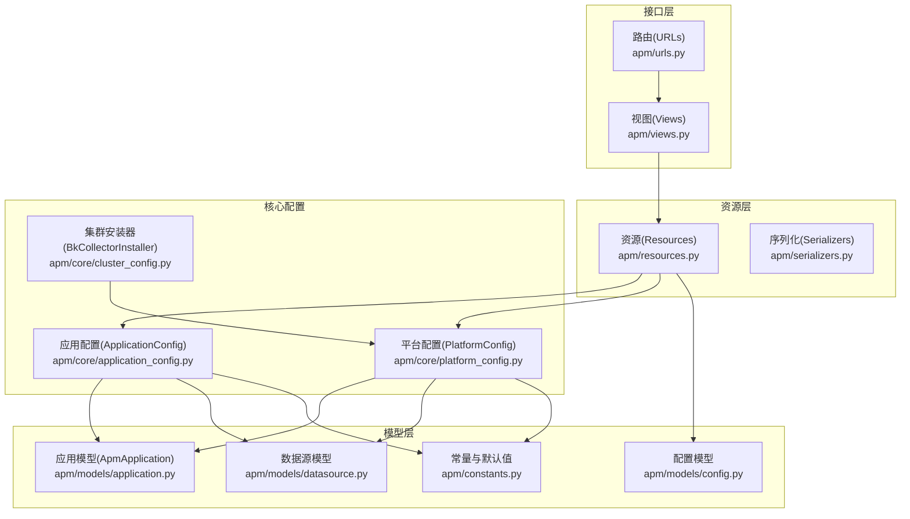
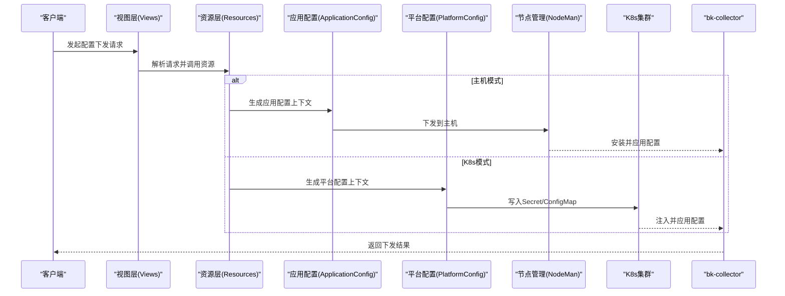
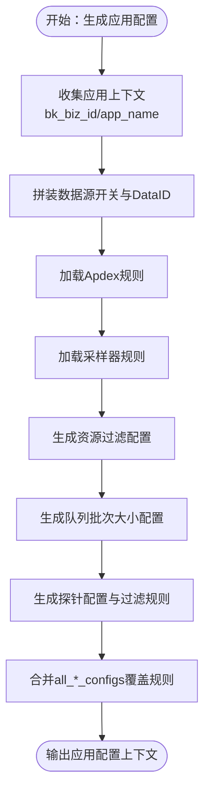
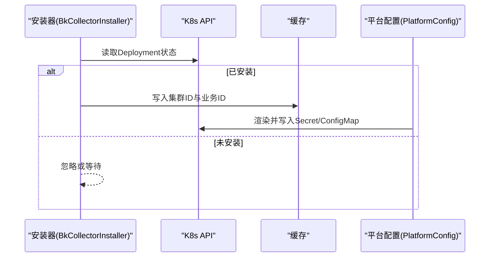
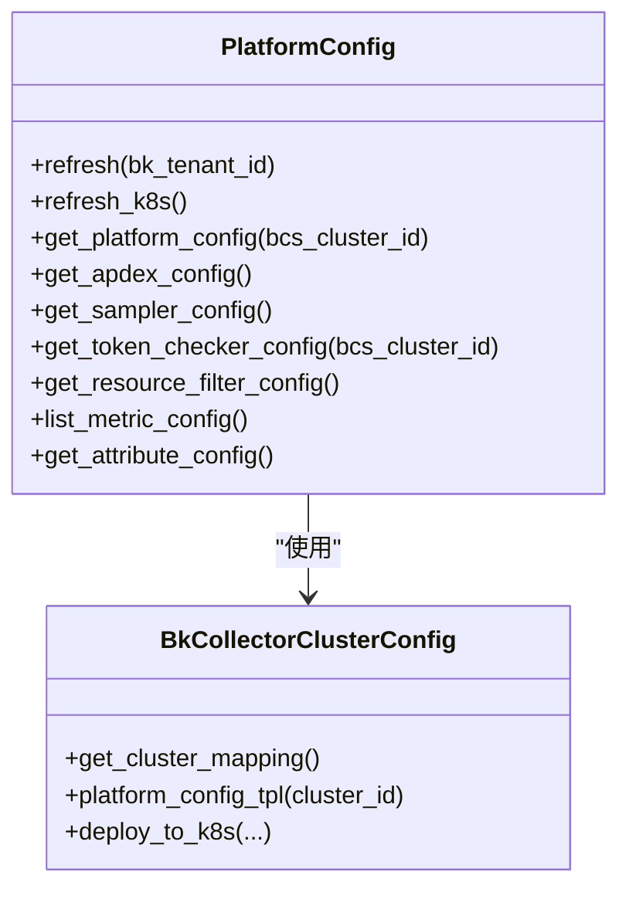
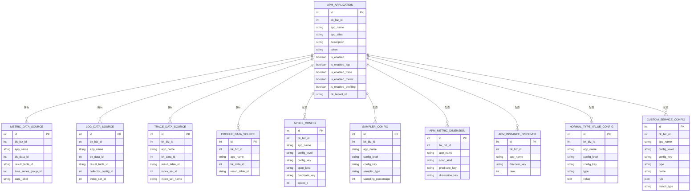
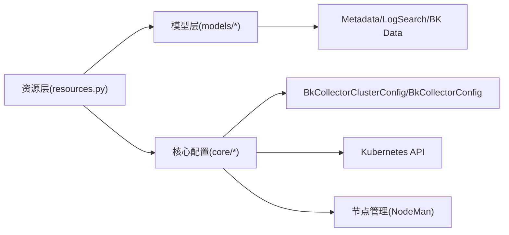

# APM核心架构

<cite>
**本文档引用的文件**
- [application_config.py](file://bkmonitor/apm/core/application_config.py)
- [cluster_config.py](file://bkmonitor/apm/core/cluster_config.py)
- [platform_config.py](file://bkmonitor/apm/core/platform_config.py)
- [application.py](file://bkmonitor/apm/models/application.py)
- [config.py](file://bkmonitor/apm/models/config.py)
- [datasource.py](file://bkmonitor/apm/models/datasource.py)
- [constants.py](file://bkmonitor/apm/constants.py)
- [views.py](file://bkmonitor/apm/views.py)
- [urls.py](file://bkmonitor/apm/urls.py)
- [resources.py](file://bkmonitor/apm/resources.py)
- [admin.py](file://bkmonitor/apm/admin.py)
</cite>

## 目录
1. [简介](#简介)
2. [项目结构](#项目结构)
3. [核心组件](#核心组件)
4. [架构总览](#架构总览)
5. [详细组件分析](#详细组件分析)
6. [依赖分析](#依赖分析)
7. [性能考虑](#性能考虑)
8. [故障排查指南](#故障排查指南)
9. [结论](#结论)
10. [附录](#附录)

## 简介
本技术文档面向APM（应用性能监控）核心架构，系统性阐述APM的整体设计、核心组件关系与数据流转机制。重点覆盖以下方面：
- 应用配置体系：应用级、服务级、实例级配置的生成与下发
- 集群配置管理：基于bk-collector的主机与K8s集群配置下发
- 平台配置：全局平台默认配置的生成与下发
- 数据模型：应用、数据源、配置规则等核心模型的设计与关系
- 集成与扩展：与监控系统的集成方式、配置管理机制与扩展点

## 项目结构
APM模块位于bkmonitor/apm目录，采用“视图-资源-核心-模型”的分层组织：
- 视图与路由：apm/views.py与apm/urls.py对外暴露REST资源接口
- 核心配置：apm/core目录包含应用配置、平台配置与集群安装器
- 模型层：apm/models目录包含应用、数据源、配置规则等模型
- 资源与序列化：apm/resources.py与apm/serializers.py定义请求/响应序列化与业务处理
- 常量与工具：apm/constants.py提供配置类型、默认值与枚举

图表来源
- [views.py:70-142](file://bkmonitor/apm/views.py#L70-L142)
- [urls.py:16-22](file://bkmonitor/apm/urls.py#L16-L22)
- [resources.py:121-200](file://bkmonitor/apm/resources.py#L121-L200)
- [application_config.py:52-243](file://bkmonitor/apm/core/application_config.py#L52-L243)
- [platform_config.py:42-123](file://bkmonitor/apm/core/platform_config.py#L42-L123)
- [cluster_config.py:22-54](file://bkmonitor/apm/core/cluster_config.py#L22-L54)
- [application.py:36-288](file://bkmonitor/apm/models/application.py#L36-L288)
- [datasource.py:56-191](file://bkmonitor/apm/models/datasource.py#L56-L191)
- [config.py:614-714](file://bkmonitor/apm/models/config.py#L614-L714)
- [constants.py:534-567](file://bkmonitor/apm/constants.py#L534-L567)

章节来源
- [views.py:70-142](file://bkmonitor/apm/views.py#L70-L142)
- [urls.py:16-22](file://bkmonitor/apm/urls.py#L16-L22)

## 核心组件
- 应用配置(ApplicationConfig)
  - 负责生成应用级配置上下文，合并Apdex、采样器、资源过滤、队列大小、探针配置等，并下发到bk-collector
  - 支持主机模式与K8s ConfigMap模式批量下发
- 平台配置(PlatformConfig)
  - 生成平台默认配置（全局Apdex、采样率、令牌校验、资源过滤、指标派生规则等）
  - 支持主机模式与K8s Secret模式下发
- 集群安装器(BkCollectorInstaller)
  - 检测K8s集群是否已安装bk-collector，维护缓存并触发后续配置下发
- 应用模型(ApmApplication)
  - 应用实体，管理数据源开关与Token生成
- 数据源模型
  - Trace/Metric/Log/Profile数据源的创建、启用/停用与结果表管理
- 配置模型
  - Apdex、采样器、自定义服务发现、指标维度、实例发现等配置的持久化与刷新
- 常量与默认值
  - 配置类型枚举、默认属性过滤、默认指标派生规则等

章节来源
- [application_config.py:52-243](file://bkmonitor/apm/core/application_config.py#L52-L243)
- [platform_config.py:42-123](file://bkmonitor/apm/core/platform_config.py#L42-L123)
- [cluster_config.py:22-54](file://bkmonitor/apm/core/cluster_config.py#L22-L54)
- [application.py:36-288](file://bkmonitor/apm/models/application.py#L36-L288)
- [datasource.py:56-191](file://bkmonitor/apm/models/datasource.py#L56-L191)
- [config.py:614-714](file://bkmonitor/apm/models/config.py#L614-L714)
- [constants.py:534-567](file://bkmonitor/apm/constants.py#L534-L567)

## 架构总览
APM架构围绕“配置生成—配置下发—数据采集—数据处理—可视化查询”闭环展开：
- 配置生成：ApplicationConfig与PlatformConfig分别生成应用与平台配置上下文
- 配置下发：通过节点管理或K8s Secret/ConfigMap下发到bk-collector
- 数据采集：bk-collector按配置采集OTLP数据（Trace/Metric/Log/Profile）
- 数据处理：在数据链路侧进行清洗、派生与聚合
- 可视化查询：通过资源接口查询Trace、Span、指标与拓扑

图表来源
- [views.py:76-123](file://bkmonitor/apm/views.py#L76-L123)
- [resources.py:121-200](file://bkmonitor/apm/resources.py#L121-L200)
- [application_config.py:58-84](file://bkmonitor/apm/core/application_config.py#L58-L84)
- [platform_config.py:52-101](file://bkmonitor/apm/core/platform_config.py#L52-L101)

## 详细组件分析

### 应用配置体系
应用配置负责将业务应用的观测需求转化为bk-collector可执行的配置，涵盖：
- 数据源开关与DataID映射
- Apdex与采样器规则
- 资源过滤与实例ID组装
- 队列批次大小与速率限制
- 探针配置与过滤规则
- 全局覆盖配置（all_app_config/all_service_configs/all_instance_configs）

图表来源
- [application_config.py:149-243](file://bkmonitor/apm/core/application_config.py#L149-L243)
- [application_config.py:282-307](file://bkmonitor/apm/core/application_config.py#L282-L307)
- [application_config.py:443-486](file://bkmonitor/apm/core/application_config.py#L443-L486)

章节来源
- [application_config.py:52-243](file://bkmonitor/apm/core/application_config.py#L52-L243)

### 集群配置管理
集群配置管理通过BkCollectorInstaller检测K8s集群是否已安装bk-collector，并将平台配置以Secret/ConfigMap形式下发：
- 检测Deployment是否存在
- 缓存集群ID与关联业务ID
- 生成平台配置上下文并渲染模板
- 下发到目标命名空间

图表来源
- [cluster_config.py:29-42](file://bkmonitor/apm/core/cluster_config.py#L29-L42)
- [platform_config.py:81-101](file://bkmonitor/apm/core/platform_config.py#L81-L101)

章节来源
- [cluster_config.py:22-54](file://bkmonitor/apm/core/cluster_config.py#L22-L54)
- [platform_config.py:72-101](file://bkmonitor/apm/core/platform_config.py#L72-L101)

### 平台配置
平台配置提供全局默认规则，包括：
- Apdex规则（覆盖所有SpanKind）
- 采样率（默认100%）
- 令牌校验（AES256，支持从应用推断DataID）
- 资源过滤（实例ID组装、默认值、丢弃敏感字段）
- 指标派生规则（bk_apm_*系列指标）
- 字段标准化（可选）

图表来源
- [platform_config.py:42-123](file://bkmonitor/apm/core/platform_config.py#L42-L123)
- [platform_config.py:102-123](file://bkmonitor/apm/core/platform_config.py#L102-L123)

章节来源
- [platform_config.py:42-123](file://bkmonitor/apm/core/platform_config.py#L42-L123)

### 数据模型设计
- 应用模型ApmApplication
  - 字段：业务ID、应用名、别名、描述、Token、功能开关、租户ID
  - 方法：启动/停止各类数据源、创建应用、生成Token
- 数据源模型
  - MetricDataSource：时序组、测量名、结果表ID、DataID
  - LogDataSource：采集配置ID、索引集ID、日志表ID
  - TraceDataSource：索引集ID、索引集名称、过滤条件、分组键
  - ProfileDataSource：Profile数据源管理
- 配置模型
  - ApdexConfig：按SpanKind与谓词键配置Apdex_t
  - SamplerConfig：随机采样类型与百分比
  - ApmMetricDimension：指标维度映射（含平台维度）
  - ApmInstanceDiscover：实例ID组装键顺序
  - NormalTypeValueConfig：类型-值配置（如队列大小、重定义规则）
  - CustomServiceConfig：自定义服务发现规则
- 常量与默认值
  - ConfigTypes：配置类型枚举
  - 默认属性过滤、默认指标派生规则、默认许可证配置

图表来源
- [application.py:36-288](file://bkmonitor/apm/models/application.py#L36-L288)
- [datasource.py:56-191](file://bkmonitor/apm/models/datasource.py#L56-L191)
- [config.py:614-714](file://bkmonitor/apm/models/config.py#L614-L714)

章节来源
- [application.py:36-288](file://bkmonitor/apm/models/application.py#L36-L288)
- [datasource.py:56-191](file://bkmonitor/apm/models/datasource.py#L56-L191)
- [config.py:614-714](file://bkmonitor/apm/models/config.py#L614-L714)
- [constants.py:534-567](file://bkmonitor/apm/constants.py#L534-L567)

### 配置管理机制与扩展点
- 配置类型与默认值
  - ConfigTypes定义了队列大小、DB慢命令、属性过滤、代码重定义、全量覆盖等配置类型
  - 默认属性过滤、平台API名称组装、许可证配置等作为平台默认值
- 全量覆盖机制
  - all_app_config、all_service_config、all_instance_config用于覆盖已有配置
  - 提供验证与合并逻辑，确保主键唯一性
- 拓扑与维度扩展
  - ApmTopoDiscoverRule与ApmMetricDimension提供分类、系统、平台、SDK规则与维度映射
  - 支持业务级与全局级规则叠加

章节来源
- [constants.py:534-567](file://bkmonitor/apm/constants.py#L534-L567)
- [application_config.py:638-688](file://bkmonitor/apm/core/application_config.py#L638-L688)
- [config.py:36-277](file://bkmonitor/apm/models/config.py#L36-L277)
- [config.py:478-553](file://bkmonitor/apm/models/config.py#L478-L553)

## 依赖分析
- 组件耦合
  - ApplicationConfig与PlatformConfig均依赖BkCollectorClusterConfig与BkCollectorConfig进行下发
  - 资源层通过ApmApplication与数据源模型协调数据源生命周期
  - 配置模型为配置生成提供数据支撑
- 外部依赖
  - 节点管理(NodeMan)：主机模式下发
  - Kubernetes API：K8s模式下发Secret/ConfigMap
  - Metadata/LogSearch/BK Data：数据源创建与结果表管理
- 循环依赖
  - 未见直接循环导入；核心配置类通过资源层间接依赖模型层

图表来源
- [resources.py:121-200](file://bkmonitor/apm/resources.py#L121-L200)
- [application_config.py:52-84](file://bkmonitor/apm/core/application_config.py#L52-L84)
- [platform_config.py:42-101](file://bkmonitor/apm/core/platform_config.py#L42-L101)
- [datasource.py:135-191](file://bkmonitor/apm/models/datasource.py#L135-L191)

章节来源
- [resources.py:121-200](file://bkmonitor/apm/resources.py#L121-L200)
- [application_config.py:52-84](file://bkmonitor/apm/core/application_config.py#L52-L84)
- [platform_config.py:42-101](file://bkmonitor/apm/core/platform_config.py#L42-L101)

## 性能考虑
- 批量下发与缓存
  - ApplicationConfig.refresh_k8s按集群分组渲染与批量下发，减少重复模板编译
  - BkCollectorInstaller使用Redis缓存记录已安装集群，降低重复检测成本
- 配置合并与覆盖
  - 使用all_*_configs进行全量覆盖，避免逐条更新带来的多次写入
- 指标派生与维度
  - 平台默认指标派生规则集中管理，减少各应用重复配置
- 存储与索引
  - Trace数据源支持热/冷存储策略与索引切分，提升查询性能与存储效率

## 故障排查指南
- 配置下发失败
  - 检查节点管理订阅是否存在与变更；确认订阅参数MD5未变化导致未更新
  - K8s模式检查Secret/ConfigMap是否存在且内容已更新
- 集群未安装bk-collector
  - 使用BkCollectorInstaller检查Deployment状态；确认缓存中是否已写入集群ID
- 数据源创建异常
  - 查看应用模型的apply_datasource流程与异常告警；核对数据链路参数
- 配置冲突
  - 检查all_*_configs覆盖逻辑与主键唯一性校验

章节来源
- [application_config.py:568-637](file://bkmonitor/apm/core/application_config.py#L568-L637)
- [platform_config.py:488-551](file://bkmonitor/apm/core/platform_config.py#L488-L551)
- [cluster_config.py:29-42](file://bkmonitor/apm/core/cluster_config.py#L29-L42)
- [application.py:140-210](file://bkmonitor/apm/models/application.py#L140-L210)

## 结论
APM核心架构通过清晰的分层与职责划分，实现了从配置生成到下发、从数据采集到处理的完整闭环。应用配置与平台配置协同工作，结合K8s与主机两种下发模式，满足多租户、多业务场景下的可观测性需求。数据模型与配置模型提供了强大的扩展能力，便于业务按需定制与演进。

## 附录
- 接口与路由
  - 应用管理与查询接口集中在ApplicationViewSet中，覆盖创建、删除、启动/停止、配置查询与发布等
  - 路由通过ResourceRouter统一注册

章节来源
- [views.py:76-123](file://bkmonitor/apm/views.py#L76-L123)
- [urls.py:16-22](file://bkmonitor/apm/urls.py#L16-L22)
- [admin.py:35-79](file://bkmonitor/apm/admin.py#L35-L79)