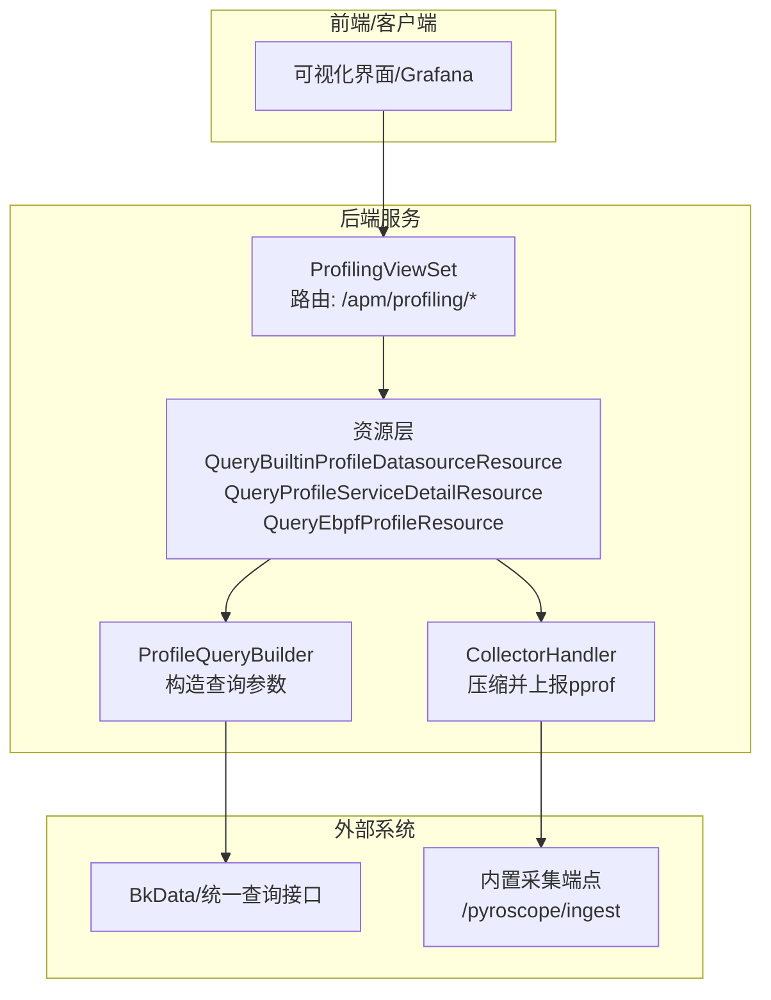
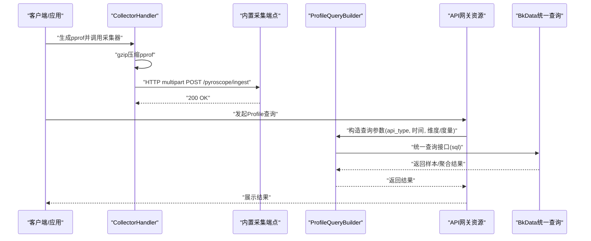
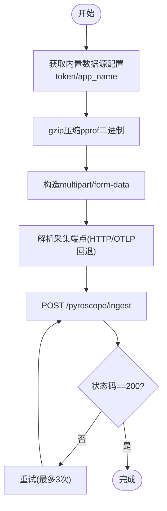
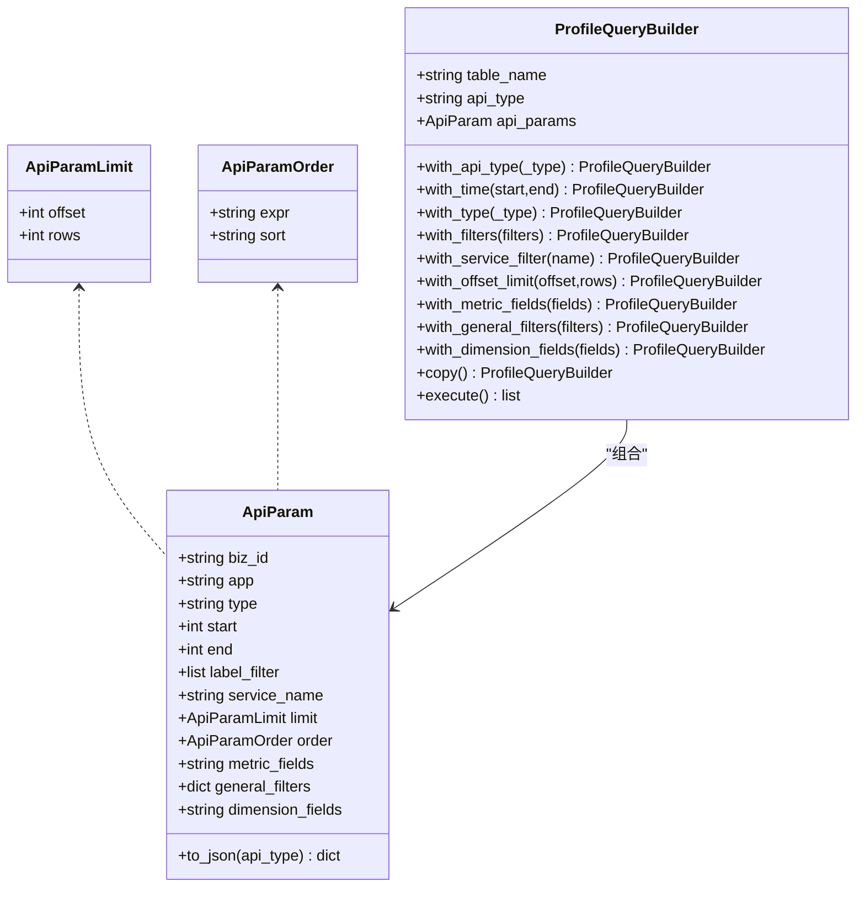
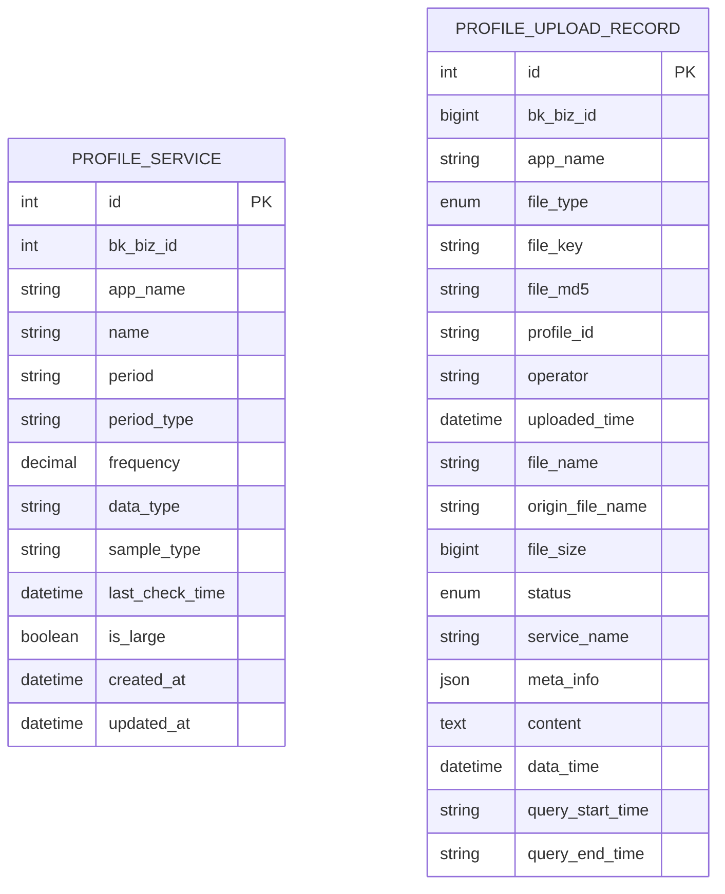
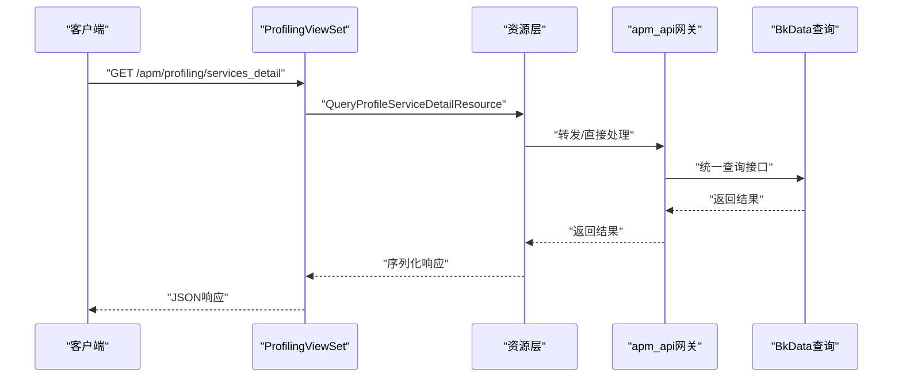
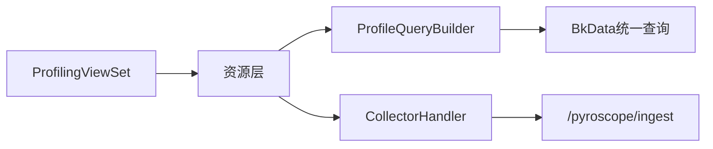

# Profile数据处理

<cite>
**本文引用的文件**
- [bkmonitor/apm/models/profile.py](file://bkmonitor/apm/models/profile.py)
- [bkmonitor/packages/apm_web/models/profile.py](file://bkmonitor/packages/apm_web/models/profile.py)
- [bkmonitor/apm/core/handlers/profile/query.py](file://bkmonitor/apm/core/handlers/profile/query.py)
- [bkmonitor/packages/apm_web/profile/collector.py](file://bkmonitor/packages/apm_web/profile/collector.py)
- [bkmonitor/packages/apm_web/profile/constants.py](file://bkmonitor/packages/apm_web/profile/constants.py)
- [bkmonitor/apm/constants.py](file://bkmonitor/apm/constants.py)
- [bkmonitor/apm/views.py](file://bkmonitor/apm/views.py)
- [bkmonitor/apm/resources.py](file://bkmonitor/apm/resources.py)
- [bkmonitor/apm/migrations/0052_add_profiledatasource_v4.py](file://bkmonitor/apm/migrations/0052_add_profiledatasource_v4.py)
- [bkmonitor/api/apm_api/default.py](file://bkmonitor/api/apm_api/default.py)
- [bkmonitor/api/bkdata/default.py](file://bkmonitor/api/bkdata/default.py)
- [bkmonitor/packages/apm_web/profile/resources.py](file://bkmonitor/packages/apm_web/profile/resources.py)
</cite>

## 目录
1. [简介](#简介)
2. [项目结构](#项目结构)
3. [核心组件](#核心组件)
4. [架构总览](#架构总览)
5. [组件详细分析](#组件详细分析)
6. [依赖关系分析](#依赖关系分析)
7. [性能考量](#性能考量)
8. [故障排查指南](#故障排查指南)
9. [结论](#结论)
10. [附录](#附录)

## 简介
本技术文档围绕蓝鲸监控平台中的Profile数据处理系统展开，系统覆盖CPU Profile、内存Profile等性能数据的采集、入库、查询与可视化分析。文档重点说明：
- Profile数据的采集与上报流程（内置数据源、压缩与传输）
- 查询接口设计与参数模型（时间范围、维度、聚合、排序与分页）
- 存储与数据源配置（含BkData链路配置）
- 聚合统计、热点分析与性能回归检测思路
- Profile与链路追踪的关联分析、根因定位策略与优化建议生成
- 实际应用场景、工具使用与结果解读方法

## 项目结构
围绕Profile能力的关键模块分布于以下子系统：
- APM后端资源与视图：负责Profile相关API路由与资源实现
- Profile查询构建器：封装查询参数与SQL包装
- 内置采集器：将pprof数据压缩并通过HTTP发送至采集端点
- 模型层：Profile服务与上传记录的数据模型
- 常量与枚举：查询类型、导出格式、阈值与默认行为
- API网关适配：对外暴露Profile查询与内置数据源查询
- Grafana/前端查询适配：提供标签与样本查询资源

图表来源
- [bkmonitor/apm/views.py:135-142](file://bkmonitor/apm/views.py#L135-L142)
- [bkmonitor/apm/resources.py:1899-1910](file://bkmonitor/apm/resources.py#L1899-L1910)
- [bkmonitor/apm/core/handlers/profile/query.py:82-172](file://bkmonitor/apm/core/handlers/profile/query.py#L82-L172)
- [bkmonitor/packages/apm_web/profile/collector.py:53-134](file://bkmonitor/packages/apm_web/profile/collector.py#L53-L134)

章节来源
- [bkmonitor/apm/views.py:135-142](file://bkmonitor/apm/views.py#L135-L142)
- [bkmonitor/apm/resources.py:1899-2084](file://bkmonitor/apm/resources.py#L1899-L2084)

## 核心组件
- Profile服务模型：记录业务、应用、服务、采样周期/频率、采样类型、是否大数据量等元信息
- 上传记录模型：记录上传文件类型、存储路径、MD5、profile ID、状态、服务名、元信息、运行信息、数据时间窗口等
- 查询参数模型：封装biz_id、app、type、时间范围、标签过滤、服务名、分页、排序、维度与度量字段
- 查询构建器：根据API类型组装查询参数，并调用统一查询接口获取样本/聚合结果
- 采集器：将pprof二进制进行gzip压缩，通过multipart/form-data上报至内置采集端点
- 常量与枚举：定义查询类型、导出格式、默认服务名、采样类型描述、查询上限、ebpf前缀等

章节来源
- [bkmonitor/apm/models/profile.py:14-30](file://bkmonitor/apm/models/profile.py#L14-L30)
- [bkmonitor/packages/apm_web/models/profile.py:26-57](file://bkmonitor/packages/apm_web/models/profile.py#L26-L57)
- [bkmonitor/apm/core/handlers/profile/query.py:23-79](file://bkmonitor/apm/core/handlers/profile/query.py#L23-L79)
- [bkmonitor/apm/core/handlers/profile/query.py:82-172](file://bkmonitor/apm/core/handlers/profile/query.py#L82-L172)
- [bkmonitor/packages/apm_web/profile/collector.py:53-134](file://bkmonitor/packages/apm_web/profile/collector.py#L53-L134)
- [bkmonitor/packages/apm_web/profile/constants.py:12-62](file://bkmonitor/packages/apm_web/profile/constants.py#L12-L62)
- [bkmonitor/apm/constants.py:638-660](file://bkmonitor/apm/constants.py#L638-L660)

## 架构总览
Profile数据处理从采集到查询的总体流程如下：
- 采集侧：应用或探针生成pprof数据，经采集器gzip压缩并通过HTTP multipart请求上报
- 入库侧：内置数据源对接BkData/统一查询接口，支持按API类型执行样本查询、列类型查询、复杂聚合查询
- 查询侧：前端/可视化通过视图与资源层发起查询，查询构建器组装参数并调用统一查询接口
- 可视化侧：提供标签与样本查询资源，支撑Grafana等外部系统接入

图表来源
- [bkmonitor/packages/apm_web/profile/collector.py:53-134](file://bkmonitor/packages/apm_web/profile/collector.py#L53-L134)
- [bkmonitor/apm/core/handlers/profile/query.py:82-172](file://bkmonitor/apm/core/handlers/profile/query.py#L82-L172)
- [bkmonitor/api/apm_api/default.py:372-387](file://bkmonitor/api/apm_api/default.py#L372-L387)
- [bkmonitor/api/bkdata/default.py:219-220](file://bkmonitor/api/bkdata/default.py#L219-L220)

## 组件详细分析

### 1) 采集与上报（内置数据源）
- 采集器职责：从内置数据源配置获取token与应用名；将pprof二进制写入gzip压缩流；构造multipart/form-data；通过环境变量获取采集端点；模拟pyroscope agent参数（名称、时间戳、采样率、单位）；最多重试3次
- 上报端点：/pyroscope/ingest；支持OTLP HTTP主机回退
- 适用场景：内置采集器与pyroscope兼容，便于统一存储与查询

图表来源
- [bkmonitor/packages/apm_web/profile/collector.py:53-134](file://bkmonitor/packages/apm_web/profile/collector.py#L53-L134)

章节来源
- [bkmonitor/packages/apm_web/profile/collector.py:53-134](file://bkmonitor/packages/apm_web/profile/collector.py#L53-L134)
- [bkmonitor/packages/apm_web/profile/constants.py:12-20](file://bkmonitor/packages/apm_web/profile/constants.py#L12-L20)

### 2) 查询接口与参数模型
- API类型枚举：服务名查询、按JSON查询样本、列类型查询、复杂聚合查询
- 查询参数模型：包含业务ID、应用名、类型、时间范围、标签过滤、服务名、分页(limit/offset)、排序(order)、维度字段、通用过滤、度量字段
- 查询构建器：支持链式设置API类型、时间范围、类型、过滤、服务名、分页、度量/维度字段；最终将参数打包为统一查询接口的SQL载体

图表来源
- [bkmonitor/apm/core/handlers/profile/query.py:23-79](file://bkmonitor/apm/core/handlers/profile/query.py#L23-L79)
- [bkmonitor/apm/core/handlers/profile/query.py:82-172](file://bkmonitor/apm/core/handlers/profile/query.py#L82-L172)

章节来源
- [bkmonitor/apm/core/handlers/profile/query.py:23-79](file://bkmonitor/apm/core/handlers/profile/query.py#L23-L79)
- [bkmonitor/apm/core/handlers/profile/query.py:82-172](file://bkmonitor/apm/core/handlers/profile/query.py#L82-L172)
- [bkmonitor/apm/constants.py:638-660](file://bkmonitor/apm/constants.py#L638-L660)

### 3) 数据模型与存储
- ProfileService模型：记录业务ID、应用名、服务名、采样周期/类型/频率、数据类型、是否大数据量、时间戳等
- ProfileUploadRecord模型：记录上传文件类型、存储路径、MD5、profile ID、操作人、上传时间、文件名、大小、状态、服务名、元信息、运行信息、数据时间窗口、查询时间窗口等
- 数据源配置扩展：新增BkData链路配置字段，便于统一查询接口对接

图表来源
- [bkmonitor/apm/models/profile.py:14-30](file://bkmonitor/apm/models/profile.py#L14-L30)
- [bkmonitor/packages/apm_web/models/profile.py:26-57](file://bkmonitor/packages/apm_web/models/profile.py#L26-L57)
- [bkmonitor/apm/migrations/0052_add_profiledatasource_v4.py:11-17](file://bkmonitor/apm/migrations/0052_add_profiledatasource_v4.py#L11-L17)

章节来源
- [bkmonitor/apm/models/profile.py:14-30](file://bkmonitor/apm/models/profile.py#L14-L30)
- [bkmonitor/packages/apm_web/models/profile.py:26-57](file://bkmonitor/packages/apm_web/models/profile.py#L26-L57)
- [bkmonitor/apm/migrations/0052_add_profiledatasource_v4.py:11-17](file://bkmonitor/apm/migrations/0052_add_profiledatasource_v4.py#L11-L17)

### 4) API与视图层
- ProfilingViewSet：提供内置Profile数据源查询、服务详情查询、ebpf服务列表与Profile查询等路由
- 资源层：内置数据源查询、Profile服务详情、ebpf Profile查询等资源实现
- API网关适配：apm_api对外暴露Profile查询资源
- Grafana查询适配：提供柱状图、标签与标签值查询资源

图表来源
- [bkmonitor/apm/views.py:135-142](file://bkmonitor/apm/views.py#L135-L142)
- [bkmonitor/apm/resources.py:2033-2084](file://bkmonitor/apm/resources.py#L2033-L2084)
- [bkmonitor/api/apm_api/default.py:372-387](file://bkmonitor/api/apm_api/default.py#L372-L387)

章节来源
- [bkmonitor/apm/views.py:135-142](file://bkmonitor/apm/views.py#L135-L142)
- [bkmonitor/apm/resources.py:1899-2084](file://bkmonitor/apm/resources.py#L1899-L2084)
- [bkmonitor/api/apm_api/default.py:372-387](file://bkmonitor/api/apm_api/default.py#L372-L387)
- [bkmonitor/packages/apm_web/profile/resources.py:230-391](file://bkmonitor/packages/apm_web/profile/resources.py#L230-L391)

## 依赖关系分析
- 组件耦合
  - ProfilingViewSet与资源层强耦合，资源层负责具体逻辑
  - 查询构建器与统一查询接口存在间接耦合（通过参数传递）
  - 采集器与内置数据源配置、环境变量存在运行时耦合
- 外部依赖
  - BkData统一查询接口：作为Profile数据查询入口
  - 内置采集端点：/pyroscope/ingest，兼容pyroscope协议
- 潜在循环依赖
  - 资源层与视图层单向依赖，无循环
- 接口契约
  - 查询参数模型与API类型枚举定义了稳定的契约边界

图表来源
- [bkmonitor/apm/views.py:135-142](file://bkmonitor/apm/views.py#L135-L142)
- [bkmonitor/apm/resources.py:1899-2084](file://bkmonitor/apm/resources.py#L1899-L2084)
- [bkmonitor/apm/core/handlers/profile/query.py:82-172](file://bkmonitor/apm/core/handlers/profile/query.py#L82-L172)
- [bkmonitor/packages/apm_web/profile/collector.py:53-134](file://bkmonitor/packages/apm_web/profile/collector.py#L53-L134)

章节来源
- [bkmonitor/apm/views.py:135-142](file://bkmonitor/apm/views.py#L135-L142)
- [bkmonitor/apm/resources.py:1899-2084](file://bkmonitor/apm/resources.py#L1899-L2084)
- [bkmonitor/apm/core/handlers/profile/query.py:82-172](file://bkmonitor/apm/core/handlers/profile/query.py#L82-L172)
- [bkmonitor/packages/apm_web/profile/collector.py:53-134](file://bkmonitor/packages/apm_web/profile/collector.py#L53-L134)

## 性能考量
- 查询上限与分页
  - 大应用与普通服务的最大查询样本数不同，避免一次性返回过多数据导致性能问题
- 压缩与传输
  - 采用gzip压缩pprof二进制，降低网络带宽占用
- 重试与稳定性
  - 上报失败最多重试3次，提升可靠性
- 聚合与维度
  - 通过维度字段与聚合查询减少数据冗余，提高查询效率

章节来源
- [bkmonitor/packages/apm_web/profile/constants.py:25-30](file://bkmonitor/packages/apm_web/profile/constants.py#L25-L30)
- [bkmonitor/packages/apm_web/profile/collector.py:102-133](file://bkmonitor/packages/apm_web/profile/collector.py#L102-L133)
- [bkmonitor/apm/core/handlers/profile/query.py:157-172](file://bkmonitor/apm/core/handlers/profile/query.py#L157-L172)

## 故障排查指南
- 采集失败
  - 检查环境变量是否正确设置采集端点；确认HTTP状态码与错误日志
  - 若多次重试仍失败，检查网络连通性与目标端点可用性
- 查询异常
  - 核对时间戳单位（秒/毫秒）转换逻辑；检查维度/度量字段拼接是否符合预期
  - 若返回空数据，确认时间窗口、标签过滤与服务名是否匹配
- 数据源配置
  - 确认内置数据源配置项（app_name、token）是否正确
  - 如需变更BkData链路配置，检查数据源V4迁移字段是否生效

章节来源
- [bkmonitor/packages/apm_web/profile/collector.py:78-86](file://bkmonitor/packages/apm_web/profile/collector.py#L78-L86)
- [bkmonitor/packages/apm_web/profile/collector.py:118-133](file://bkmonitor/packages/apm_web/profile/collector.py#L118-L133)
- [bkmonitor/apm/core/handlers/profile/query.py:98-110](file://bkmonitor/apm/core/handlers/profile/query.py#L98-L110)
- [bkmonitor/apm/migrations/0052_add_profiledatasource_v4.py:11-17](file://bkmonitor/apm/migrations/0052_add_profiledatasource_v4.py#L11-L17)

## 结论
该Profile数据处理系统以“采集-入库-查询-可视化”为主线，结合内置数据源与统一查询接口，实现了对CPU/内存等性能数据的高效采集与分析。通过明确的查询参数模型、API类型枚举与查询构建器，系统具备良好的可扩展性与可维护性。配合Grafana等外部系统，能够满足多场景下的性能分析需求。

## 附录

### A. 查询参数与API类型速览
- API类型
  - 服务名查询
  - 按JSON查询样本
  - 列类型查询
  - 复杂聚合查询
- 参数要点
  - 时间范围：支持秒/毫秒转换
  - 维度字段：默认包含type/service_name/period_type/period/sample_type
  - 度量字段：可自定义
  - 分页与排序：支持offset/rows与排序表达式

章节来源
- [bkmonitor/apm/constants.py:638-660](file://bkmonitor/apm/constants.py#L638-L660)
- [bkmonitor/apm/core/handlers/profile/query.py:50-79](file://bkmonitor/apm/core/handlers/profile/query.py#L50-L79)
- [bkmonitor/apm/core/handlers/profile/query.py:157-172](file://bkmonitor/apm/core/handlers/profile/query.py#L157-L172)

### B. 导出与格式
- 默认导出格式：pprof
- 默认服务名：default
- 默认数据类型：cpu/nanoseconds
- 支持输入类型：pprof、perf_script、jfr、doris

章节来源
- [bkmonitor/packages/apm_web/profile/constants.py:12-16](file://bkmonitor/packages/apm_web/profile/constants.py#L12-L16)
- [bkmonitor/packages/apm_web/profile/constants.py:35-44](file://bkmonitor/packages/apm_web/profile/constants.py#L35-L44)

### C. 实际应用场景与工具使用
- 场景
  - CPU热点函数定位、内存分配热点分析、eBPF采样与火焰图生成
- 工具
  - Grafana查询资源：柱状图、标签与标签值查询
  - 内置数据源查询：服务详情、ebpf服务列表与Profile查询
- 结果解读
  - 依据维度字段（如service_name、period_type、sample_type）筛选目标服务
  - 结合聚合查询识别异常峰值与趋势变化

章节来源
- [bkmonitor/packages/apm_web/profile/resources.py:230-391](file://bkmonitor/packages/apm_web/profile/resources.py#L230-L391)
- [bkmonitor/api/apm_api/default.py:372-387](file://bkmonitor/api/apm_api/default.py#L372-L387)
- [bkmonitor/apm/resources.py:2033-2084](file://bkmonitor/apm/resources.py#L2033-L2084)