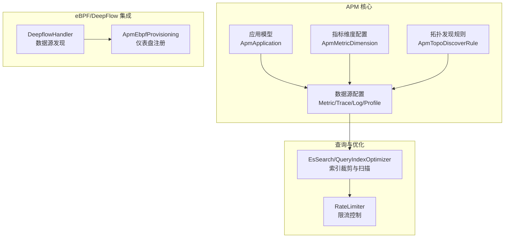
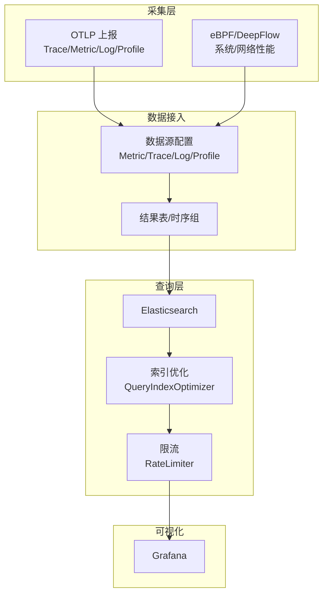
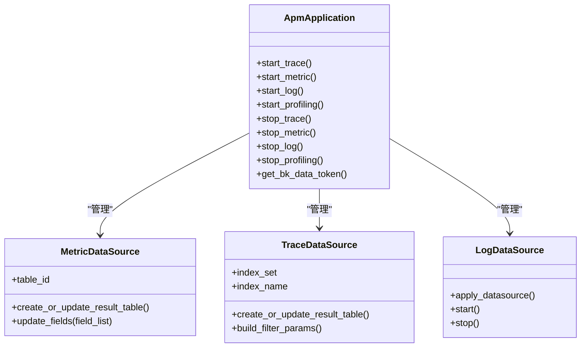
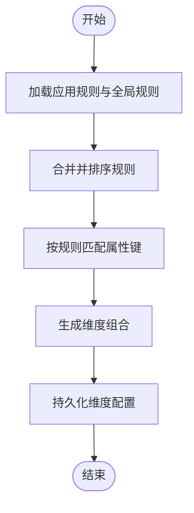
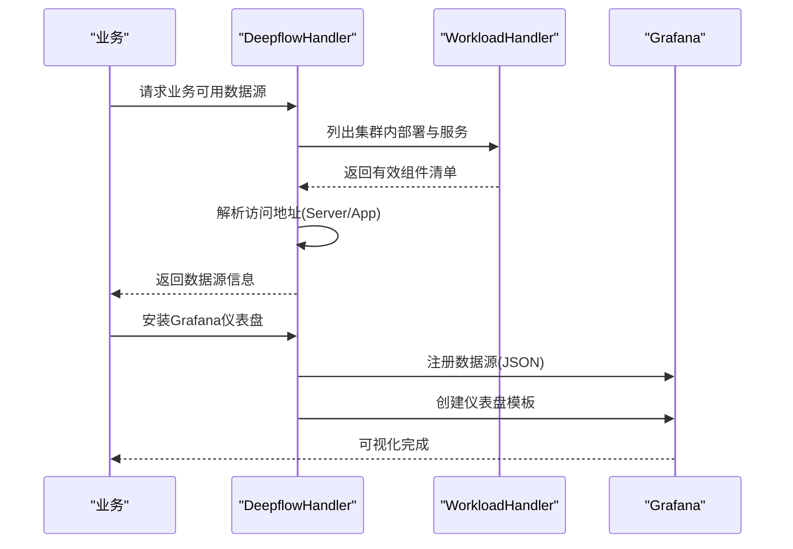
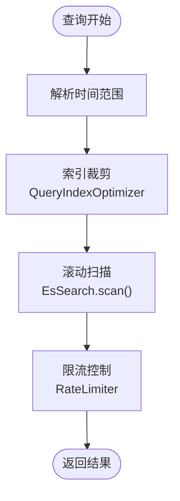
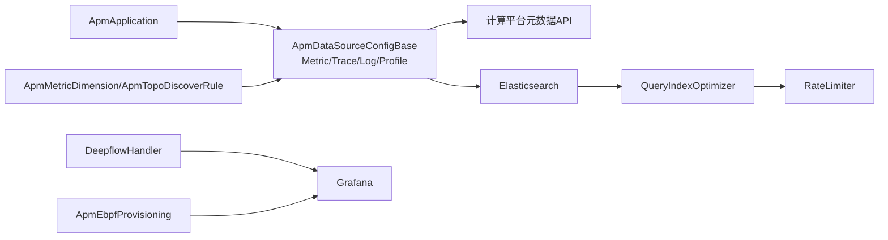

# 性能指标分析

<cite>
**本文引用的文件**
- [application.py](file://bkmonitor/apm/models/application.py)
- [config.py](file://bkmonitor/apm/models/config.py)
- [datasource.py](file://bkmonitor/apm/models/datasource.py)
- [constants.py](file://bkmonitor/apm/constants.py)
- [types.py](file://bkmonitor/apm/types.py)
- [deepflow.py](file://bkmonitor/apm_ebpf/handlers/deepflow.py)
- [provisioning.py](file://bkmonitor/apm_ebpf/handlers/provisioning.py)
- [es_search.py](file://bkmonitor/apm/utils/es_search.py)
- [time.py](file://bkmonitor/apm/utils/time.py)
</cite>

## 目录
1. [简介](#简介)
2. [项目结构](#项目结构)
3. [核心组件](#核心组件)
4. [架构总览](#架构总览)
5. [详细组件分析](#详细组件分析)
6. [依赖分析](#依赖分析)
7. [性能考量](#性能考量)
8. [故障排查指南](#故障排查指南)
9. [结论](#结论)
10. [附录](#附录)

## 简介
本文件面向蓝鲸监控平台的 APM 性能指标分析系统，围绕指标采集、计算逻辑、分析算法、eBPF 技术在性能数据采集中的应用、DeepFlow 集成方案、指标计算优化策略展开。内容涵盖性能瓶颈识别方法、异常检测算法与趋势分析技术，并解释指标数据的存储结构、查询优化与可视化展示方案，最后提供实际案例、优化建议与最佳实践。

## 项目结构
APM 子系统由“应用与数据源模型”、“配置与规则模型”、“eBPF/DeepFlow 集成”、“查询与索引优化工具”等模块构成，形成从采集、清洗、存储到查询与可视化的完整链路。

图示来源
- [application.py:36-288](file://bkmonitor/apm/models/application.py#L36-L288)
- [config.py:36-591](file://bkmonitor/apm/models/config.py#L36-L591)
- [datasource.py:192-783](file://bkmonitor/apm/models/datasource.py#L192-L783)
- [deepflow.py:127-444](file://bkmonitor/apm_ebpf/handlers/deepflow.py#L127-L444)
- [provisioning.py:25-159](file://bkmonitor/apm_ebpf/handlers/provisioning.py#L25-L159)
- [es_search.py:112-282](file://bkmonitor/apm/utils/es_search.py#L112-L282)

章节来源
- [application.py:36-288](file://bkmonitor/apm/models/application.py#L36-L288)
- [config.py:36-591](file://bkmonitor/apm/models/config.py#L36-L591)
- [datasource.py:192-783](file://bkmonitor/apm/models/datasource.py#L192-L783)
- [deepflow.py:127-444](file://bkmonitor/apm_ebpf/handlers/deepflow.py#L127-L444)
- [provisioning.py:25-159](file://bkmonitor/apm_ebpf/handlers/provisioning.py#L25-L159)
- [es_search.py:112-282](file://bkmonitor/apm/utils/es_search.py#L112-L282)

## 核心组件
- 应用与数据源管理
  - 应用模型负责应用生命周期与数据源开关；支持按需启动/停止各类数据源（Trace/Metric/Log/Profiling），并生成 Token 供上报端使用。
  - 数据源模型抽象了 Metric/Trace/Log/Profile 的创建、启用/停用、结果表与存储配置。
- 指标维度与拓扑发现
  - 指标维度配置支持基于 SpanKind 与谓词键的维度组合，覆盖 HTTP/RPC/DB/Messaging 等场景。
  - 拓扑发现规则支持按分类、系统类型、平台、SDK 等维度自动识别服务、组件与端点。
- eBPF/DeepFlow 集成
  - DeepflowHandler 负责在业务集群内发现 DeepFlow 组件，解析访问地址并注册到 Grafana。
  - ApmEbpfProvisioning 提供仪表盘模板与数据源转换，确保多用户并发场景下的稳定性。
- 查询与索引优化
  - EsSearch/QueryIndexOptimizer 在查询阶段对索引进行裁剪，减少扫描范围。
  - RateLimiter 提供并发与速率控制，避免查询风暴。

章节来源
- [application.py:36-288](file://bkmonitor/apm/models/application.py#L36-L288)
- [config.py:36-591](file://bkmonitor/apm/models/config.py#L36-L591)
- [datasource.py:192-783](file://bkmonitor/apm/models/datasource.py#L192-L783)
- [deepflow.py:127-444](file://bkmonitor/apm_ebpf/handlers/deepflow.py#L127-L444)
- [provisioning.py:25-159](file://bkmonitor/apm_ebpf/handlers/provisioning.py#L25-L159)
- [es_search.py:112-282](file://bkmonitor/apm/utils/es_search.py#L112-L282)

## 架构总览
APM 性能指标分析系统采用“采集-清洗-存储-查询-可视化”的分层架构。eBPF/DeepFlow 提供底层网络与系统性能数据，OpenTelemetry 上报 Trace/Metric/Log/Profile，系统通过数据源配置对接计算平台与存储层，查询层通过索引裁剪与限流保障性能，最终在 Grafana 展示。

图示来源
- [datasource.py:192-783](file://bkmonitor/apm/models/datasource.py#L192-L783)
- [deepflow.py:127-444](file://bkmonitor/apm_ebpf/handlers/deepflow.py#L127-L444)
- [provisioning.py:25-159](file://bkmonitor/apm_ebpf/handlers/provisioning.py#L25-L159)
- [es_search.py:112-282](file://bkmonitor/apm/utils/es_search.py#L112-L282)

## 详细组件分析

### 应用与数据源模型
- 应用模型
  - 提供应用创建、Token 生成、数据源开关管理与异步创建流程。
  - 支持 Trace/Metric/Log/Profiling 的启停与告警上报。
- 数据源模型
  - MetricDataSource：创建时序分组与结果表，支持 InfluxDB 代理集群配置。
  - TraceDataSource：创建自定义结果表，支持 ES 索引集、冷热存储、动态映射与字段配置。
  - LogDataSource：创建日志采集配置，支持 ES 存储参数与索引集管理。
  - ProfileDataSource：与数据平台对接，支持 Profiling 数据的存储与查询。

图示来源
- [application.py:36-288](file://bkmonitor/apm/models/application.py#L36-L288)
- [datasource.py:192-783](file://bkmonitor/apm/models/datasource.py#L192-L783)

章节来源
- [application.py:36-288](file://bkmonitor/apm/models/application.py#L36-L288)
- [datasource.py:192-783](file://bkmonitor/apm/models/datasource.py#L192-L783)

### 指标维度与拓扑发现
- 指标维度配置
  - 基于 SpanKind（SERVER/CLIENT/PRODUCER/CONSUMER）与谓词键（如 HTTP_METHOD、RPC_SYSTEM、DB_SYSTEM、MESSAGING_SYSTEM 等）生成维度组合。
  - 支持 TRPC 特定维度扩展，以及平台维度字段的可选配置。
- 拓扑发现规则
  - 支持按分类（HTTP/RPC/DB/Messaging/Async）、系统类型（TRPC/gRPC）、平台（K8s/Node）、SDK 等规则自动识别服务、组件与端点。
  - 提供内存缓存与全局规则合并，提升规则加载效率。

图示来源
- [config.py:36-591](file://bkmonitor/apm/models/config.py#L36-L591)

章节来源
- [config.py:36-591](file://bkmonitor/apm/models/config.py#L36-L591)

### eBPF/DeepFlow 集成与可视化
- DeepflowHandler
  - 发现业务集群内的 DeepFlow Deployment 与 Service，校验组件完整性，解析访问地址（Server/App）。
  - 支持多种集群来源与节点 IP 获取方式，保证在不同环境下稳定获取访问地址。
- ApmEbpfProvisioning
  - 将发现的数据源转换为 Grafana 数据源，批量创建仪表盘并记录已创建项，避免并发重复创建。
  - 通过模板映射与文件夹组织，实现 eBPF 专题的可视化统一管理。

图示来源
- [deepflow.py:127-444](file://bkmonitor/apm_ebpf/handlers/deepflow.py#L127-L444)
- [provisioning.py:25-159](file://bkmonitor/apm_ebpf/handlers/provisioning.py#L25-L159)

章节来源
- [deepflow.py:127-444](file://bkmonitor/apm_ebpf/handlers/deepflow.py#L127-L444)
- [provisioning.py:25-159](file://bkmonitor/apm_ebpf/handlers/provisioning.py#L25-L159)

### 查询优化与索引裁剪
- EsSearch/QueryIndexOptimizer
  - 在查询阶段根据时间范围对索引进行裁剪，仅扫描必要的索引集合，显著降低查询成本。
  - 提供 scan 包装，支持滚动扫描与错误处理，提升大规模数据扫描的稳定性。
- RateLimiter
  - 基于信号量的限流装饰器，限制单位时间内的并发请求数，避免查询风暴。

图示来源
- [es_search.py:112-282](file://bkmonitor/apm/utils/es_search.py#L112-L282)

章节来源
- [es_search.py:112-282](file://bkmonitor/apm/utils/es_search.py#L112-L282)

## 依赖分析
- 组件耦合
  - 应用模型与数据源模型强关联，应用启停直接影响数据源状态。
  - 指标维度与拓扑发现规则通过配置模型集中管理，查询层依赖这些规则进行维度提取与分类。
  - eBPF/DeepFlow 集成依赖工作负载与集群管理 API，最终通过 Grafana Provisioning 完成可视化。
- 外部依赖
  - 计算平台元数据 API：创建/修改结果表、时序分组与存储配置。
  - Elasticsearch：Trace 数据存储与查询，配合索引裁剪与扫描优化。
  - Grafana：仪表盘与数据源注册，提供可视化界面。

图示来源
- [application.py:36-288](file://bkmonitor/apm/models/application.py#L36-L288)
- [config.py:36-591](file://bkmonitor/apm/models/config.py#L36-L591)
- [datasource.py:192-783](file://bkmonitor/apm/models/datasource.py#L192-L783)
- [deepflow.py:127-444](file://bkmonitor/apm_ebpf/handlers/deepflow.py#L127-L444)
- [provisioning.py:25-159](file://bkmonitor/apm_ebpf/handlers/provisioning.py#L25-L159)
- [es_search.py:112-282](file://bkmonitor/apm/utils/es_search.py#L112-L282)

章节来源
- [application.py:36-288](file://bkmonitor/apm/models/application.py#L36-L288)
- [config.py:36-591](file://bkmonitor/apm/models/config.py#L36-L591)
- [datasource.py:192-783](file://bkmonitor/apm/models/datasource.py#L192-L783)
- [deepflow.py:127-444](file://bkmonitor/apm_ebpf/handlers/deepflow.py#L127-L444)
- [provisioning.py:25-159](file://bkmonitor/apm_ebpf/handlers/provisioning.py#L25-L159)
- [es_search.py:112-282](file://bkmonitor/apm/utils/es_search.py#L112-L282)

## 性能考量
- 指标采集
  - 通过 eBPF/DeepFlow 采集内核态与网络层性能数据，结合 OpenTelemetry 上报业务层 Trace/Metric/Log/Profile，形成端到端观测闭环。
- 存储与索引
  - Trace 数据采用 ES 存储，支持冷热分层与索引设置；Metric 数据采用时序分组与时序存储，支持 InfluxDB 代理集群。
  - QueryIndexOptimizer 根据时间范围裁剪索引，减少扫描范围；EsSearch 的滚动扫描与错误处理提升稳定性。
- 查询与并发
  - RateLimiter 控制并发与速率，避免查询风暴；内存缓存规则减少 DB 访问频率。
- 可视化
  - Grafana 仪表盘模板与数据源统一管理，避免重复创建带来的并发问题。

## 故障排查指南
- 数据源创建失败
  - 检查应用 Token 生成与数据平台 API 调用状态；确认 ES/InfluxDB 集群参数正确。
- Trace 查询范围过大
  - 明确时间范围参数，利用索引裁剪减少扫描；必要时分页或缩小时间窗口。
- Grafana 仪表盘未显示
  - 检查数据源注册状态与模板映射；确认 eBPF 集群存在有效组件。
- eBPF/DeepFlow 地址解析失败
  - 校验集群节点 IP 获取逻辑与 API 权限；确认 Service 端口与命名规范。

章节来源
- [application.py:211-214](file://bkmonitor/apm/models/application.py#L211-L214)
- [datasource.py:568-783](file://bkmonitor/apm/models/datasource.py#L568-L783)
- [deepflow.py:235-288](file://bkmonitor/apm_ebpf/handlers/deepflow.py#L235-L288)
- [provisioning.py:101-159](file://bkmonitor/apm_ebpf/handlers/provisioning.py#L101-L159)
- [es_search.py:168-282](file://bkmonitor/apm/utils/es_search.py#L168-L282)

## 结论
本系统通过 eBPF/DeepFlow 与 OpenTelemetry 的协同，实现了从系统内核到业务应用的全链路性能观测。借助指标维度与拓扑发现规则，系统能够自动识别服务与端点并生成高质量指标；通过索引裁剪、滚动扫描与限流控制，保障大规模数据查询的稳定性与性能；最终通过 Grafana 实现统一可视化。建议在生产环境中持续优化规则配置、合理设置存储与索引策略，并结合异常检测与趋势分析技术，进一步提升性能问题的定位与处置效率。

## 附录
- 实际案例
  - 场景：某业务 HTTP 接口 P95 延迟上升
  - 步骤：使用拓扑发现规则识别服务与端点，结合指标维度定位异常来源；利用索引裁剪快速缩小查询范围；通过 Grafana 仪表盘对比趋势与异常检测结果，定位到下游 DB 调用延迟升高，进一步排查慢查询与连接池配置。
- 优化建议
  - 合理设置采样率与维度组合，避免维度爆炸。
  - 定期清理冷数据与无效索引，保持查询性能。
  - 在高并发场景下启用限流与分页，避免查询风暴。
- 最佳实践
  - 优先使用谓词键进行维度筛选，减少不必要的字段分析。
  - 将 eBPF/DeepFlow 与业务指标结合，形成多维交叉验证。
  - 建立异常检测基线与阈值告警，配合趋势分析提前预警。