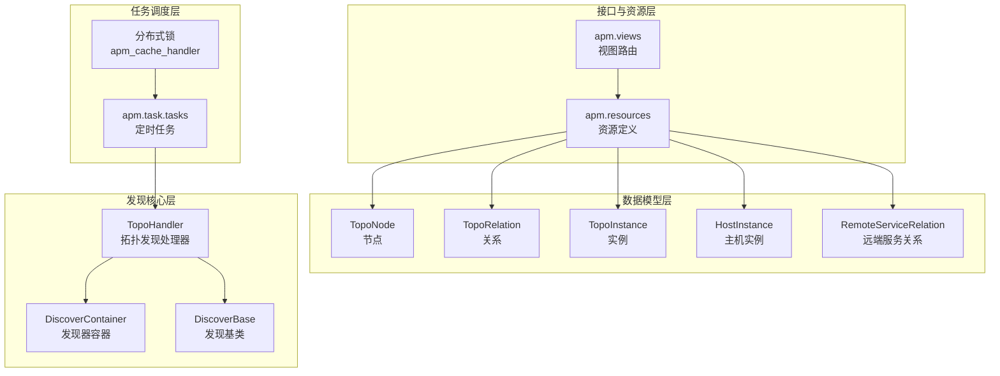
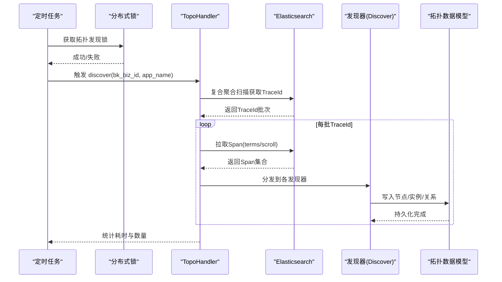
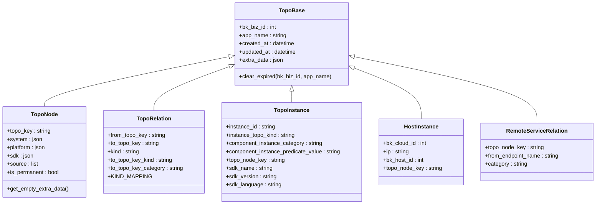
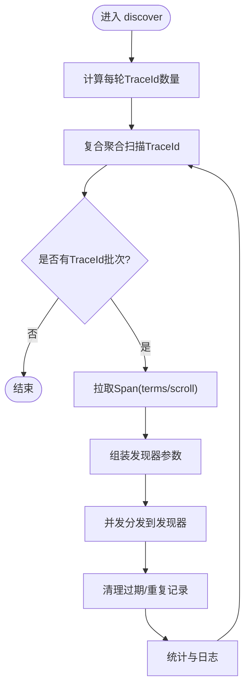
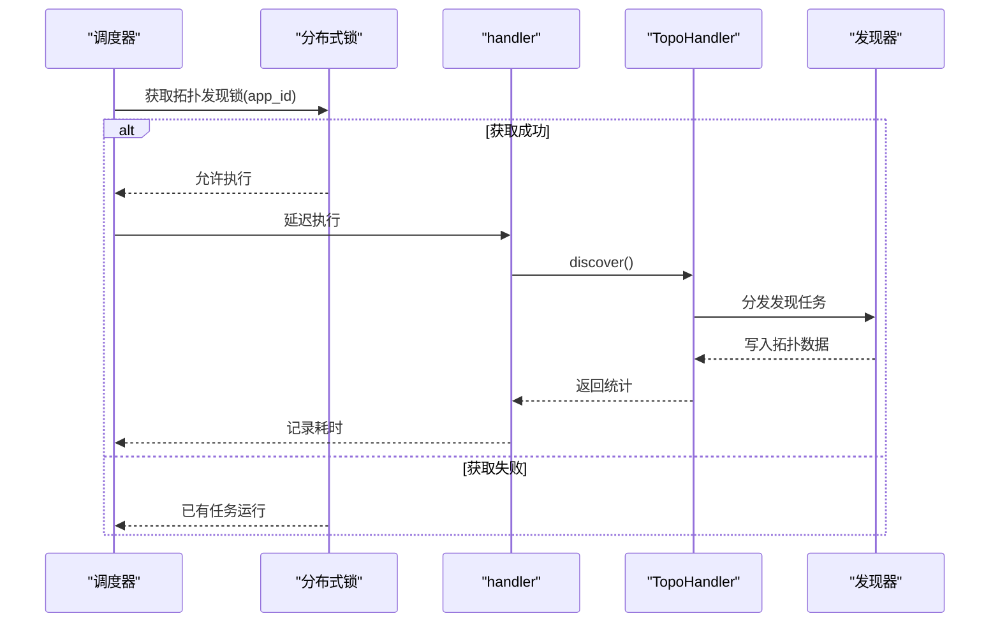
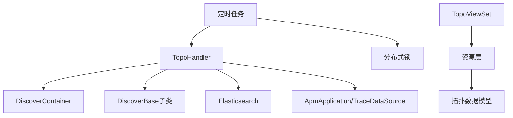

# 拓扑发现算法

<cite>
**本文引用的文件**
- [bkmonitor/apm/models/topo.py](file://bkmonitor/apm/models/topo.py)
- [bkmonitor/apm/core/discover/base.py](file://bkmonitor/apm/core/discover/base.py)
- [bkmonitor/apm/task/tasks.py](file://bkmonitor/apm/task/tasks.py)
- [bkmonitor/apm/views.py](file://bkmonitor/apm/views.py)
- [bkmonitor/apm/resources.py](file://bkmonitor/apm/resources.py)
</cite>

## 目录
1. [简介](#简介)
2. [项目结构](#项目结构)
3. [核心组件](#核心组件)
4. [架构总览](#架构总览)
5. [详细组件分析](#详细组件分析)
6. [依赖分析](#依赖分析)
7. [性能考虑](#性能考虑)
8. [故障排查指南](#故障排查指南)
9. [结论](#结论)
10. [附录](#附录)

## 简介
本技术文档围绕蓝鲸监控平台中的“服务拓扑自动发现”能力，系统阐述拓扑发现算法的原理、节点识别与关系建模方法，以及基于流量分析的服务识别、调用关系推断与拓扑图构建流程。文档还覆盖拓扑数据的增量更新、一致性保障与性能优化策略；解释拓扑发现与链路追踪（Trace）的协同工作机制、数据融合方法与可视化展示技术，并给出实际应用场景、参数调优与效果评估建议。

## 项目结构
围绕拓扑发现的关键模块分布如下：
- 数据模型层：定义拓扑节点、关系、实例等实体及其字段语义
- 发现核心层：拓扑发现处理器、规则解析、实例键生成、去重与清理
- 任务调度层：定时任务编排、分布式锁、任务切分与并发执行
- 接口与资源层：对外暴露拓扑查询接口，支撑前端可视化

**图表来源**
- [bkmonitor/apm/models/topo.py:55-143](file://bkmonitor/apm/models/topo.py#L55-L143)
- [bkmonitor/apm/core/discover/base.py:138-276](file://bkmonitor/apm/core/discover/base.py#L138-L276)
- [bkmonitor/apm/task/tasks.py:53-102](file://bkmonitor/apm/task/tasks.py#L53-L102)
- [bkmonitor/apm/views.py:126-132](file://bkmonitor/apm/views.py#L126-L132)
- [bkmonitor/apm/resources.py:43-69](file://bkmonitor/apm/resources.py#L43-L69)

**章节来源**
- [bkmonitor/apm/models/topo.py:23-143](file://bkmonitor/apm/models/topo.py#L23-L143)
- [bkmonitor/apm/core/discover/base.py:138-276](file://bkmonitor/apm/core/discover/base.py#L138-L276)
- [bkmonitor/apm/task/tasks.py:53-102](file://bkmonitor/apm/task/tasks.py#L53-L102)
- [bkmonitor/apm/views.py:126-132](file://bkmonitor/apm/views.py#L126-L132)
- [bkmonitor/apm/resources.py:43-69](file://bkmonitor/apm/resources.py#L43-L69)

## 核心组件
- 拓扑数据模型
  - 节点（TopoNode）：承载服务/组件的拓扑节点，包含业务ID、应用名、额外属性（类别、SDK、来源等）
  - 关系（TopoRelation）：节点之间的调用关系，区分同步/异步两类
  - 实例（TopoInstance）：服务实例或组件实例，携带实例标识、类型、谓词值、SDK信息
  - 主机实例（HostInstance）：主机与拓扑节点的绑定
  - 远端服务关系（RemoteServiceRelation）：跨边界服务的接口关系
- 发现器容器与基类
  - DiscoverContainer：按遥测数据类型注册与列举发现器
  - DiscoverBase：定义发现器接口、规则解析、重复记录处理、过期清理等通用逻辑
  - TopoHandler：面向Trace数据的拓扑发现编排器，负责TraceId枚举、Span拉取、并发分发与统计
- 任务与调度
  - 定时任务：拓扑发现、数据源发现、配置刷新、预计算检查等
  - 分布式锁：避免同一应用多实例并发执行导致的数据竞争
- 查询接口
  - TopoViewSet：提供拓扑节点、关系、实例、远端服务关系的查询接口

**章节来源**
- [bkmonitor/apm/models/topo.py:55-143](file://bkmonitor/apm/models/topo.py#L55-L143)
- [bkmonitor/apm/core/discover/base.py:138-276](file://bkmonitor/apm/core/discover/base.py#L138-L276)
- [bkmonitor/apm/task/tasks.py:53-102](file://bkmonitor/apm/task/tasks.py#L53-L102)
- [bkmonitor/apm/views.py:126-132](file://bkmonitor/apm/views.py#L126-L132)

## 架构总览
拓扑发现以“定时任务驱动 + 并行发现器 + ES聚合扫描”的方式工作。整体流程：
- 定时任务按业务与应用筛选目标，通过分布式锁确保幂等
- TopoHandler对Trace索引进行复合聚合扫描，提取唯一TraceId
- 将TraceId分批拉取Span，按发现器类型分发给对应发现器
- 发现器基于规则匹配与谓词判断，识别服务/组件、建立实例与关系
- 结果写入拓扑数据表，同时清理过期与重复记录，维持一致性

**图表来源**
- [bkmonitor/apm/task/tasks.py:62-102](file://bkmonitor/apm/task/tasks.py#L62-L102)
- [bkmonitor/apm/core/discover/base.py:332-571](file://bkmonitor/apm/core/discover/base.py#L332-L571)
- [bkmonitor/apm/models/topo.py:55-143](file://bkmonitor/apm/models/topo.py#L55-L143)

## 详细组件分析

### 组件A：拓扑数据模型与一致性
- 节点与实例
  - 节点包含业务ID、应用名、额外属性（类别、SDK、来源）、永久标记等
  - 实例包含实例ID、类型、谓词值、SDK信息，支持组件实例细分
- 关系建模
  - 关系类型映射：客户端/服务端为同步，生产者/消费者为异步
  - 关系目标包含目标节点类型与分类，便于后续查询与过滤
- 一致性保障
  - 过期清理：按应用绑定的Trace数据保留周期删除旧数据
  - 重复处理：按实例唯一键去重，可选择保留首条或末条并删除冗余
  - 永久节点：对关键节点可标记为永久保存，避免被清理

**图表来源**
- [bkmonitor/apm/models/topo.py:23-143](file://bkmonitor/apm/models/topo.py#L23-L143)

**章节来源**
- [bkmonitor/apm/models/topo.py:55-143](file://bkmonitor/apm/models/topo.py#L55-L143)

### 组件B：发现器容器与基类
- DiscoverContainer
  - 按遥测数据类型注册发现器，统一列举与分发
- DiscoverBase
  - 规则解析：支持多谓词键、端点键、实例键组合
  - 匹配逻辑：基于谓词存在性与扩展条件匹配规则
  - 重复处理：按实例唯一键去重，支持删除冗余与保留策略
  - 过期清理：按应用绑定的Trace保留周期清理
  - 上限控制：当记录数超过阈值时，按更新时间删除超出部分
- TopoHandler
  - TraceId枚举：复合聚合分页扫描，限制单轮最大时长
  - Span拉取：根据结果窗口动态选择直接查询或scroll滚动
  - 并发分发：线程池并发执行不同发现器，统计耗时与数量
  - 任务切分：根据索引max_result_window与批次大小动态计算每轮TraceId数量

**图表来源**
- [bkmonitor/apm/core/discover/base.py:332-571](file://bkmonitor/apm/core/discover/base.py#L332-L571)

**章节来源**
- [bkmonitor/apm/core/discover/base.py:138-276](file://bkmonitor/apm/core/discover/base.py#L138-L276)
- [bkmonitor/apm/core/discover/base.py:332-571](file://bkmonitor/apm/core/discover/base.py#L332-L571)

### 组件C：定时任务与分布式锁
- 拓扑发现定时任务
  - 新建应用在快速刷新窗口内按更短周期执行，其余应用按常规周期执行
  - 通过分布式锁避免并发冲突
- 数据源发现与配置刷新
  - 指标/日志数据源发现按时间窗口切分并行执行
  - 应用配置与平台配置定期刷新，支持K8s批量下发
- 预计算与健康检查
  - 预计算字段更新检查、Consul配置检查、BMW任务状态巡检

**图表来源**
- [bkmonitor/apm/task/tasks.py:62-102](file://bkmonitor/apm/task/tasks.py#L62-L102)
- [bkmonitor/apm/core/discover/base.py:332-571](file://bkmonitor/apm/core/discover/base.py#L332-L571)

**章节来源**
- [bkmonitor/apm/task/tasks.py:53-102](file://bkmonitor/apm/task/tasks.py#L53-L102)
- [bkmonitor/apm/task/tasks.py:120-149](file://bkmonitor/apm/task/tasks.py#L120-L149)

### 组件D：查询接口与可视化
- 路由与资源
  - TopoViewSet提供拓扑节点、关系、实例、远端服务关系的查询资源
  - 资源层封装查询代理、过滤器、统计模式等，支撑前端可视化
- 数据融合
  - 通过实例键与节点键建立实例-节点映射，结合关系表构建调用链
  - 支持按业务、应用、时间范围、维度过滤

**图表来源**
- [bkmonitor/apm/views.py:126-132](file://bkmonitor/apm/views.py#L126-L132)
- [bkmonitor/apm/resources.py:43-69](file://bkmonitor/apm/resources.py#L43-L69)

**章节来源**
- [bkmonitor/apm/views.py:126-132](file://bkmonitor/apm/views.py#L126-L132)
- [bkmonitor/apm/resources.py:43-69](file://bkmonitor/apm/resources.py#L43-L69)

## 依赖分析
- 模块耦合
  - TopoHandler依赖DiscoverContainer与DiscoverBase族类，形成“编排-发现器”解耦
  - 任务层通过分布式锁与线程池降低耦合度，提升可维护性
- 外部依赖
  - Elasticsearch：复合聚合、Scroll检索、索引设置读取
  - APM应用与数据源配置：决定保留周期、索引窗口与发现范围
- 循环依赖
  - 通过资源与视图的分层设计避免循环导入

**图表来源**
- [bkmonitor/apm/core/discover/base.py:138-276](file://bkmonitor/apm/core/discover/base.py#L138-L276)
- [bkmonitor/apm/task/tasks.py:53-102](file://bkmonitor/apm/task/tasks.py#L53-L102)
- [bkmonitor/apm/views.py:126-132](file://bkmonitor/apm/views.py#L126-L132)
- [bkmonitor/apm/resources.py:43-69](file://bkmonitor/apm/resources.py#L43-L69)

**章节来源**
- [bkmonitor/apm/core/discover/base.py:138-276](file://bkmonitor/apm/core/discover/base.py#L138-L276)
- [bkmonitor/apm/task/tasks.py:53-102](file://bkmonitor/apm/task/tasks.py#L53-L102)
- [bkmonitor/apm/views.py:126-132](file://bkmonitor/apm/views.py#L126-L132)
- [bkmonitor/apm/resources.py:43-69](file://bkmonitor/apm/resources.py#L43-L69)

## 性能考虑
- 扫描与分页
  - 复合聚合扫描限制单轮时长，避免长时间占用
  - 根据索引max_result_window动态计算每轮TraceId数量，平衡吞吐与内存
- 并发与批处理
  - 线程池并发拉取Span与执行发现器，提高整体吞吐
  - 批量写入与去重合并，减少数据库往返
- 缓存与默认值
  - 拓扑节点extra_data提供默认值，兼容不同数据源
- 清理策略
  - 过期清理与重复记录删除，保持数据规模可控
- I/O与网络
  - Scroll与terms查询结合，针对大数据量场景优化
  - 任务切分与快速刷新窗口，缩短新应用可见延迟

[本节为通用性能指导，无需特定文件引用]

## 故障排查指南
- 锁竞争与跳过
  - 若出现“已运行”提示，确认分布式锁是否释放，检查任务队列积压
- ES查询异常
  - 检查索引设置与max_result_window，确认复合聚合可用
- 规则匹配失败
  - 核对谓词键与实例键配置，确认规则类型与排序
- 数据不一致
  - 检查过期清理与重复处理逻辑，必要时手动触发清理
- 任务堆积
  - 调整快速刷新窗口与周期，或增加Worker节点

**章节来源**
- [bkmonitor/apm/task/tasks.py:62-102](file://bkmonitor/apm/task/tasks.py#L62-L102)
- [bkmonitor/apm/core/discover/base.py:233-256](file://bkmonitor/apm/core/discover/base.py#L233-L256)

## 结论
本拓扑发现方案以“规则驱动 + Trace聚合扫描 + 并行发现器”为核心，结合分布式锁与清理策略，实现了高吞吐、可扩展且一致的拓扑建模。通过与链路追踪的协同，系统能够自动识别服务与组件、推断调用关系并持续增量更新，满足复杂场景下的可观测性需求。

[本节为总结，无需特定文件引用]

## 附录

### 实际应用场景
- 新业务上线：快速识别Trace中的服务与组件，建立初始拓扑
- 调用链分析：基于关系建模定位上游依赖与下游影响面
- 可视化展示：前端通过查询接口渲染拓扑图谱，支持交互式探索

### 算法参数调优
- 快速刷新窗口与周期：新应用在窗口内按更短周期刷新，缩短可见延迟
- 批次大小与轮次：根据索引max_result_window与Span平均长度动态调整
- 并发度：依据CPU与ES负载调整线程池大小
- 过期周期：结合业务活跃度与存储成本设定

### 效果评估方法
- 覆盖率：对比规则命中率与实际服务数量
- 准确性：人工抽样验证节点/关系命名与分类
- 性能：关注任务耗时、ES查询延迟与数据库写入压力
- 可视化：评估拓扑图清晰度与交互体验

[本节为通用指导，无需特定文件引用]