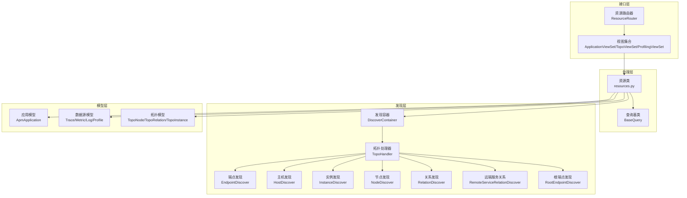
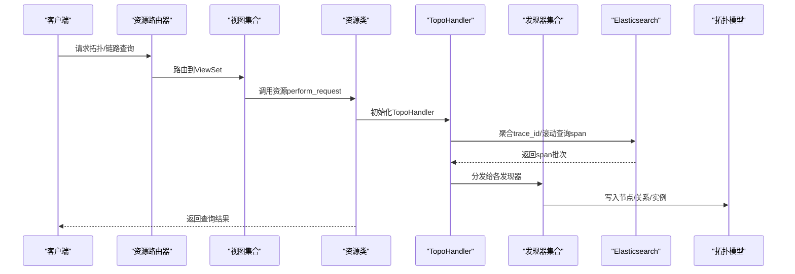
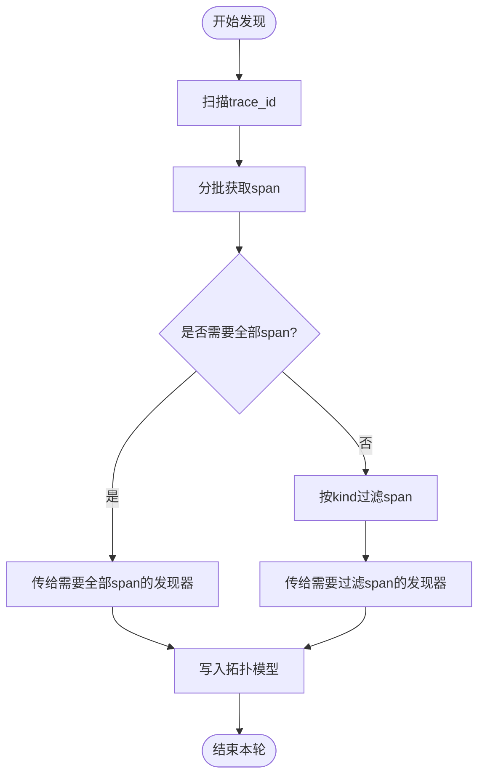
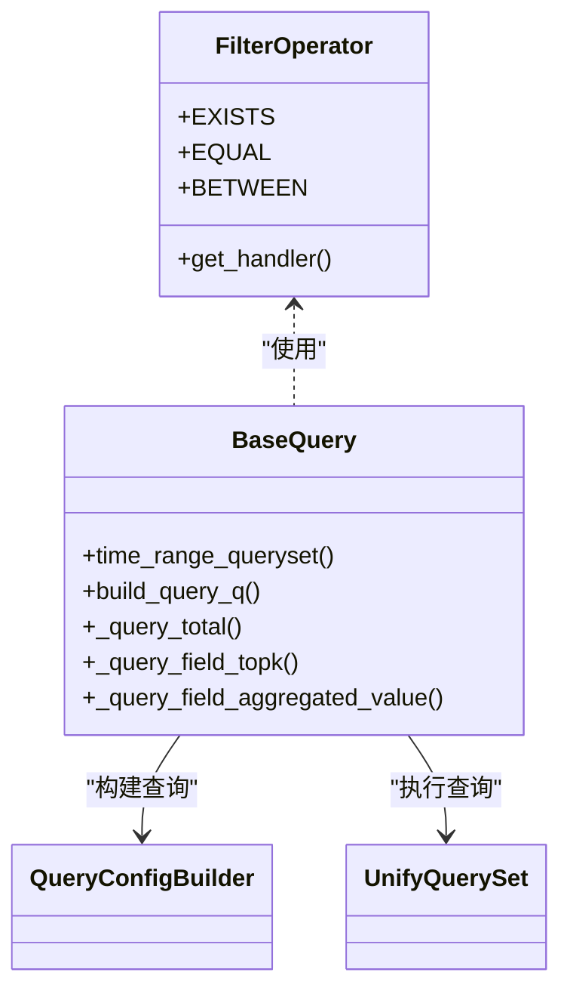
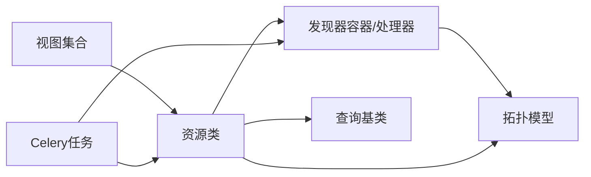

# 链路追踪系统

<cite>
**本文引用的文件**
- [bkmonitor/apm/apps.py](file://bkmonitor/apm/apps.py)
- [bkmonitor/apm/views.py](file://bkmonitor/apm/views.py)
- [bkmonitor/apm/urls.py](file://bkmonitor/apm/urls.py)
- [bkmonitor/apm/models/application.py](file://bkmonitor/apm/models/application.py)
- [bkmonitor/apm/models/topo.py](file://bkmonitor/apm/models/topo.py)
- [bkmonitor/apm/models/datasource.py](file://bkmonitor/apm/models/datasource.py)
- [bkmonitor/apm/constants.py](file://bkmonitor/apm/constants.py)
- [bkmonitor/apm/resources.py](file://bkmonitor/apm/resources.py)
- [bkmonitor/apm/core/discover/base.py](file://bkmonitor/apm/core/discover/base.py)
- [bkmonitor/apm/core/discover/endpoint.py](file://bkmonitor/apm/core/discover/endpoint.py)
- [bkmonitor/apm/core/discover/host.py](file://bkmonitor/apm/core/discover/host.py)
- [bkmonitor/apm/core/discover/instance.py](file://bkmonitor/apm/core/discover/instance.py)
- [bkmonitor/apm/core/discover/node.py](file://bkmonitor/apm/core/discover/node.py)
- [bkmonitor/apm/core/discover/relation.py](file://bkmonitor/apm/core/discover/relation.py)
- [bkmonitor/apm/core/discover/remote_service_relation.py](file://bkmonitor/apm/core/discover/remote_service_relation.py)
- [bkmonitor/apm/core/discover/root_endpoint.py](file://bkmonitor/apm/core/discover/root_endpoint.py)
- [bkmonitor/apm/core/discover/precalculation/check.py](file://bkmonitor/apm/core/discover/precalculation/check.py)
- [bkmonitor/apm/core/discover/precalculation/storage.py](file://bkmonitor/apm/core/discover/precalculation/storage.py)
- [bkmonitor/apm/core/discover/profile/service.py](file://bkmonitor/apm/core/discover/profile/service.py)
- [bkmonitor/apm/core/discover/metric/service.py](file://bkmonitor/apm/core/discover/metric/service.py)
- [bkmonitor/apm/core/handlers/query/base.py](file://bkmonitor/apm/core/handlers/query/base.py)
- [bkmonitor/apm/serializers.py](file://bkmonitor/apm/serializers.py)
- [bkmonitor/apm/task/tasks.py](file://bkmonitor/apm/task/tasks.py)
</cite>

## 目录
1. [简介](#简介)
2. [项目结构](#项目结构)
3. [核心组件](#核心组件)
4. [架构总览](#架构总览)
5. [详细组件分析](#详细组件分析)
6. [依赖分析](#依赖分析)
7. [性能考虑](#性能考虑)
8. [故障排查指南](#故障排查指南)
9. [结论](#结论)
10. [附录](#附录)

## 简介
本文件面向链路追踪系统的技术文档，围绕分布式链路追踪的实现原理、Trace与Span的概念模型、数据采集与存储、拓扑发现与关系分析、OTLP协议支持、查询接口设计、预计算与缓存策略、性能优化与实际应用场景展开。文档基于仓库中的Apm模块源码进行深入解析，并通过图示帮助读者快速理解系统架构与关键流程。

## 项目结构
Apm模块采用“资源视图-处理器-发现器-数据模型”的分层组织方式：
- 路由与视图：通过资源路由器将REST接口映射到资源类，统一处理请求与响应。
- 数据模型：封装应用、数据源、拓扑节点/关系/实例等实体。
- 发现器：按Telemetry数据类型（Trace/Metric/Profiling）进行拓扑发现与关系构建。
- 查询层：统一构建查询条件、时间范围、聚合与分页。
- 任务调度：基于Celery的定时任务，驱动拓扑发现、配置下发与预计算。

图表来源
- [bkmonitor/apm/urls.py:16-21](file://bkmonitor/apm/urls.py#L16-L21)
- [bkmonitor/apm/views.py:70-142](file://bkmonitor/apm/views.py#L70-L142)
- [bkmonitor/apm/resources.py:1-120](file://bkmonitor/apm/resources.py#L1-L120)
- [bkmonitor/apm/core/discover/base.py:138-150](file://bkmonitor/apm/core/discover/base.py#L138-L150)
- [bkmonitor/apm/models/application.py:36-131](file://bkmonitor/apm/models/application.py#L36-L131)
- [bkmonitor/apm/models/datasource.py:407-783](file://bkmonitor/apm/models/datasource.py#L407-L783)
- [bkmonitor/apm/models/topo.py:55-143](file://bkmonitor/apm/models/topo.py#L55-L143)

章节来源
- [bkmonitor/apm/urls.py:11-21](file://bkmonitor/apm/urls.py#L11-L21)
- [bkmonitor/apm/views.py:70-142](file://bkmonitor/apm/views.py#L70-L142)
- [bkmonitor/apm/resources.py:1-120](file://bkmonitor/apm/resources.py#L1-L120)

## 核心组件
- 应用与数据源
  - 应用模型负责应用生命周期管理、数据源开关与Token生成；数据源模型负责Trace/Metric/Log/Profile的创建、启用/停用与结果表配置。
- 拓扑模型
  - 节点、关系、实例与主机实例模型支撑服务拓扑的持久化与查询；提供过期清理与缓存配置。
- 发现器与容器
  - 发现容器注册各类发现器；TopoHandler按时间窗口扫描Trace索引，分批提取Span并触发发现器。
- 查询与序列化
  - 查询基类统一构建过滤条件、时间范围与聚合；序列化器定义请求参数校验与默认值。
- 任务调度
  - Celery定时任务驱动拓扑发现、配置下发、预计算与Profile发现。

章节来源
- [bkmonitor/apm/models/application.py:36-131](file://bkmonitor/apm/models/application.py#L36-L131)
- [bkmonitor/apm/models/datasource.py:407-783](file://bkmonitor/apm/models/datasource.py#L407-L783)
- [bkmonitor/apm/models/topo.py:55-143](file://bkmonitor/apm/models/topo.py#L55-L143)
- [bkmonitor/apm/core/discover/base.py:138-150](file://bkmonitor/apm/core/discover/base.py#L138-L150)
- [bkmonitor/apm/core/handlers/query/base.py:132-198](file://bkmonitor/apm/core/handlers/query/base.py#L132-L198)
- [bkmonitor/apm/serializers.py:18-78](file://bkmonitor/apm/serializers.py#L18-L78)
- [bkmonitor/apm/task/tasks.py:53-102](file://bkmonitor/apm/task/tasks.py#L53-L102)

## 架构总览
系统通过资源视图暴露REST接口，资源类负责参数校验、权限与调用查询/发现/任务模块；发现器按模块类型（Trace/Metric/Profiling）分别处理；查询层统一适配多种数据源；拓扑模型持久化发现结果；任务调度保障周期性刷新与预计算。

图表来源
- [bkmonitor/apm/views.py:70-142](file://bkmonitor/apm/views.py#L70-L142)
- [bkmonitor/apm/resources.py:1-120](file://bkmonitor/apm/resources.py#L1-L120)
- [bkmonitor/apm/core/discover/base.py:332-571](file://bkmonitor/apm/core/discover/base.py#L332-L571)

## 详细组件分析

### Trace与Span概念模型
- Trace代表一次跨服务的完整调用链，Span代表链路上的一个工作单元（如一次HTTP请求、RPC调用、数据库访问等）。系统通过OpenTelemetry语义约定映射Span属性，结合发现规则对服务、端点、实例进行归类与识别。
- 关键属性映射与过滤在数据源模型中集中定义，确保查询与发现的一致性。

章节来源
- [bkmonitor/apm/models/datasource.py:407-547](file://bkmonitor/apm/models/datasource.py#L407-L547)
- [bkmonitor/apm/constants.py:440-529](file://bkmonitor/apm/constants.py#L440-L529)

### 数据采集与存储
- Trace/Metric/Log/Profile四类数据源通过统一的配置入口创建与启用，结果表与存储集群参数在数据源模型中集中管理。
- Trace数据源采用Elasticsearch存储，支持索引集、切分大小、副本与分片配置，并提供索引名称解析与保留期读取。
- 指标数据源对接时序数据库，支持字段扩展与时间序列组配置。

章节来源
- [bkmonitor/apm/models/datasource.py:192-295](file://bkmonitor/apm/models/datasource.py#L192-L295)
- [bkmonitor/apm/models/datasource.py:407-783](file://bkmonitor/apm/models/datasource.py#L407-L783)

### OTLP协议支持
- 系统通过OpenTelemetry语义约定对Span属性进行标准化映射，支持HTTP/RPC/DB/Messaging等分类规则与端点识别。
- 日志数据源支持OTLP日志上报的自定义采集配置，保证与Trace数据一致的清洗与存储策略。

章节来源
- [bkmonitor/apm/models/datasource.py:407-547](file://bkmonitor/apm/models/datasource.py#L407-L547)
- [bkmonitor/apm/models/datasource.py:297-405](file://bkmonitor/apm/models/datasource.py#L297-L405)

### 链路发现算法与拓扑构建
- TopoHandler按固定时间窗口扫描Trace索引，使用复合聚合分页获取trace_id，再滚动查询对应Span。
- 发现器按模块类型注册到容器，TopoHandler在每轮中将Span分发给需要全部Span或过滤后Span的发现器。
- 发现器通过规则匹配（类别、系统、平台、SDK）与谓词键提取服务名、端点名与实例标识，构建节点、关系与实例。

图表来源
- [bkmonitor/apm/core/discover/base.py:332-571](file://bkmonitor/apm/core/discover/base.py#L332-L571)
- [bkmonitor/apm/apps.py:30-68](file://bkmonitor/apm/apps.py#L30-L68)

章节来源
- [bkmonitor/apm/core/discover/base.py:332-571](file://bkmonitor/apm/core/discover/base.py#L332-L571)
- [bkmonitor/apm/apps.py:30-68](file://bkmonitor/apm/apps.py#L30-L68)

### 服务拓扑与调用关系分析
- 节点模型记录服务类别、系统与SDK信息；关系模型根据SpanKind映射同步/异步关系；实例模型承载实例标识与探针信息。
- 通过缓存配置与过期清理策略，平衡实时性与存储成本。

章节来源
- [bkmonitor/apm/models/topo.py:55-143](file://bkmonitor/apm/models/topo.py#L55-L143)
- [bkmonitor/apm/constants.py:578-636](file://bkmonitor/apm/constants.py#L578-L636)

### 查询接口设计
- 资源类统一处理请求参数、构建查询条件与分页，支持字段Top-K、统计信息与图形配置。
- 查询基类提供时间范围推导、过滤器构建、聚合与分页能力，屏蔽底层存储差异。

图表来源
- [bkmonitor/apm/core/handlers/query/base.py:132-380](file://bkmonitor/apm/core/handlers/query/base.py#L132-L380)

章节来源
- [bkmonitor/apm/resources.py:1-120](file://bkmonitor/apm/resources.py#L1-L120)
- [bkmonitor/apm/core/handlers/query/base.py:132-380](file://bkmonitor/apm/core/handlers/query/base.py#L132-L380)
- [bkmonitor/apm/serializers.py:18-78](file://bkmonitor/apm/serializers.py#L18-L78)

### 预计算策略与缓存机制
- 缓存类型与过期时间集中定义，覆盖端点、主机、根端点、关系与远端服务关系等维度。
- 预计算任务通过定时任务检测与分发，确保热点字段与关系的提前计算与更新。

章节来源
- [bkmonitor/apm/constants.py:578-636](file://bkmonitor/apm/constants.py#L578-L636)
- [bkmonitor/apm/task/tasks.py:227-240](file://bkmonitor/apm/task/tasks.py#L227-L240)

### 接口与路由
- 资源路由器注册视图集合，提供应用管理、拓扑查询、Profile查询与事件/字段统计等接口。

章节来源
- [bkmonitor/apm/urls.py:11-21](file://bkmonitor/apm/urls.py#L11-L21)
- [bkmonitor/apm/views.py:70-142](file://bkmonitor/apm/views.py#L70-L142)

## 依赖分析
- 组件耦合
  - 视图与资源类解耦于具体发现器与查询实现，通过统一接口交互。
  - 发现器依赖数据源模型与规则配置，拓扑模型承担持久化职责。
- 外部依赖
  - Elasticsearch用于Trace与日志存储；时序数据库用于指标存储；计算平台用于虚拟指标与尾部采样。
- 循环依赖
  - 模块间通过资源类与任务调度进行协调，避免直接循环导入。

图表来源
- [bkmonitor/apm/views.py:70-142](file://bkmonitor/apm/views.py#L70-L142)
- [bkmonitor/apm/resources.py:1-120](file://bkmonitor/apm/resources.py#L1-L120)
- [bkmonitor/apm/core/discover/base.py:138-150](file://bkmonitor/apm/core/discover/base.py#L138-L150)
- [bkmonitor/apm/task/tasks.py:53-102](file://bkmonitor/apm/task/tasks.py#L53-L102)

章节来源
- [bkmonitor/apm/views.py:70-142](file://bkmonitor/apm/views.py#L70-L142)
- [bkmonitor/apm/resources.py:1-120](file://bkmonitor/apm/resources.py#L1-L120)
- [bkmonitor/apm/core/discover/base.py:138-150](file://bkmonitor/apm/core/discover/base.py#L138-L150)
- [bkmonitor/apm/task/tasks.py:53-102](file://bkmonitor/apm/task/tasks.py#L53-L102)

## 性能考虑
- 扫描与分页
  - TopoHandler使用复合聚合分页与滚动查询，控制每轮最大Span数量，避免内存溢出。
- 线程池与限速
  - 查询与发现过程使用线程池并发处理，同时通过限速装饰器控制ES查询频率。
- 存储与索引
  - Trace索引支持热/冷节点配置与切分策略，降低查询延迟与提升吞吐。
- 缓存与过期
  - 拓扑缓存按类型设定过期时间，结合过期清理策略减少冗余数据。

章节来源
- [bkmonitor/apm/core/discover/base.py:332-571](file://bkmonitor/apm/core/discover/base.py#L332-L571)
- [bkmonitor/apm/models/datasource.py:614-671](file://bkmonitor/apm/models/datasource.py#L614-L671)
- [bkmonitor/apm/constants.py:578-636](file://bkmonitor/apm/constants.py#L578-L636)

## 故障排查指南
- 拓扑发现失败
  - 检查TopoHandler初始化与数据源可用性；查看发现器异常日志与超时信息。
- 查询无结果或超时
  - 校验时间范围与过滤条件；确认索引名称解析与保留期配置；检查ES集群健康状态。
- 数据源创建/启用异常
  - 核对数据源配置参数与存储集群；关注事件上报与重试机制。
- 预计算任务异常
  - 检查任务状态与Consul配置更新；核对字段更新检测与分发逻辑。

章节来源
- [bkmonitor/apm/core/discover/base.py:442-468](file://bkmonitor/apm/core/discover/base.py#L442-L468)
- [bkmonitor/apm/task/tasks.py:227-240](file://bkmonitor/apm/task/tasks.py#L227-L240)
- [bkmonitor/apm/models/datasource.py:614-671](file://bkmonitor/apm/models/datasource.py#L614-L671)

## 结论
该链路追踪系统以资源视图为核心，结合统一查询与发现器容器，实现了Trace/Span的采集、拓扑发现与关系分析，并通过OTLP协议与多数据源适配满足多样化场景需求。预计算与缓存策略提升了查询性能与稳定性，Celery任务保障了周期性刷新与配置下发。建议在生产环境中持续监控ES健康与任务队列，结合业务特性优化索引与缓存策略。

## 附录
- 实际应用场景
  - 服务依赖关系可视化、端点性能分析、跨服务调用链定位、异常根因分析。
- 调试技巧
  - 使用资源类提供的字段Top-K与统计接口辅助定位问题；通过时间对齐与聚合方法验证数据质量。
- 配置要点
  - 合理设置索引切分大小与保留期；启用热/冷节点以优化成本与性能；定期清理过期拓扑数据。