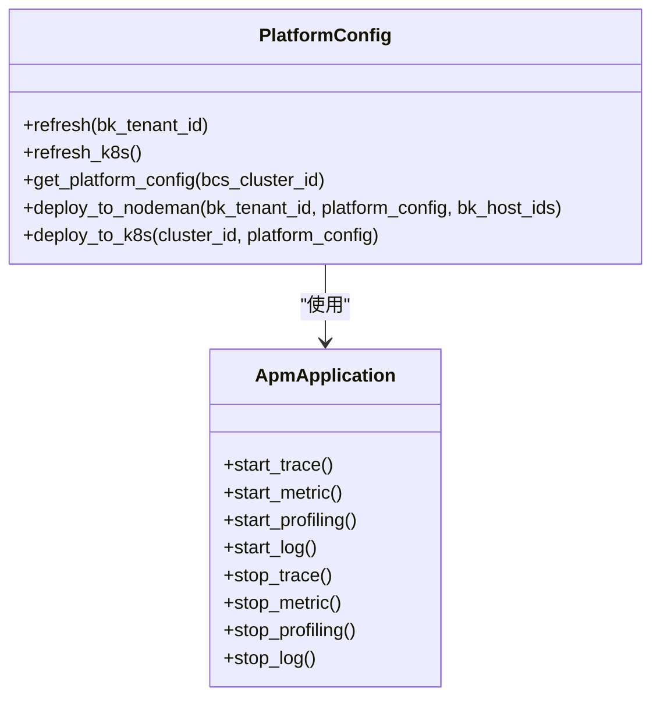
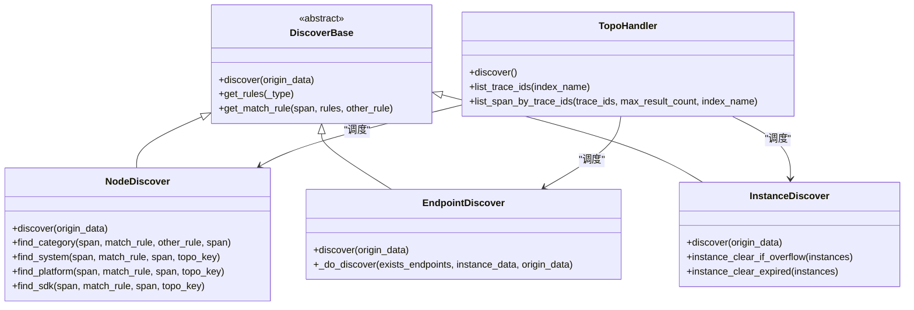
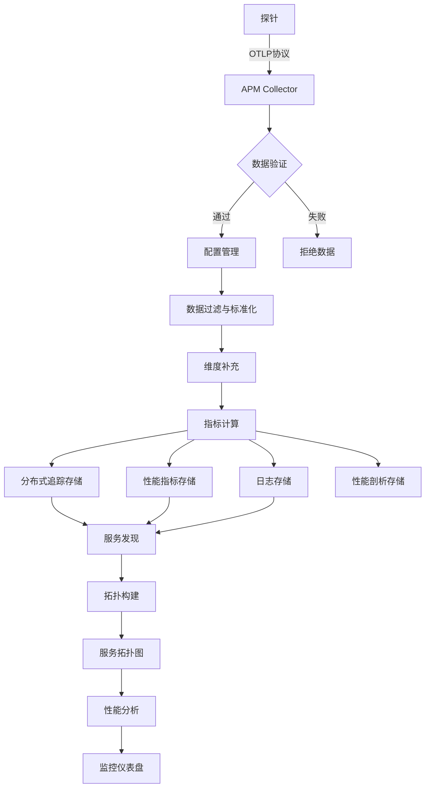

# APM监控

<cite>
**本文档引用的文件**   
- [platform_config.py](file://bkmonitor/apm/core/platform_config.py)
- [application.py](file://bkmonitor/apm/models/application.py)
- [datasource.py](file://bkmonitor/apm/models/datasource.py)
- [topo.py](file://bkmonitor/apm/models/topo.py)
- [config.py](file://bkmonitor/apm/models/config.py)
- [base.py](file://bkmonitor/apm/core/discover/base.py)
- [endpoint.py](file://bkmonitor/apm/core/discover/endpoint.py)
- [node.py](file://bkmonitor/apm/core/discover/node.py)
- [instance.py](file://bkmonitor/apm/core/discover/instance.py)
- [constants.py](file://bkmonitor/apm/constants.py)
</cite>

## 目录
1. [简介](#简介)
2. [核心数据模型](#核心数据模型)
3. [探针配置管理](#探针配置管理)
4. [数据采集与处理](#数据采集与处理)
5. [服务发现与拓扑](#服务发现与拓扑)
6. [数据流与交互图](#数据流与交互图)
7. [外部服务集成](#外部服务集成)
8. [性能分析](#性能分析)

## 简介
APM（应用性能监控）模块提供了一套完整的应用性能监控解决方案，支持分布式追踪、指标采集、日志收集和性能分析等功能。该系统通过OpenTelemetry协议接收探针上报的数据，经过配置管理、数据采集、服务发现和拓扑构建等核心组件处理，最终实现对应用性能的全面监控和分析。

**Section sources**
- [platform_config.py](file://bkmonitor/apm/core/platform_config.py#L1-L552)
- [application.py](file://bkmonitor/apm/models/application.py#L1-L343)

## 核心数据模型
APM系统的核心数据模型定义了应用、数据源和拓扑等关键实体，这些模型构成了系统的基础架构。

### 应用模型 (Application)
`ApmApplication` 模型是APM系统的核心，代表一个被监控的应用实例。该模型包含以下关键属性：
- `bk_biz_id`: 业务ID，标识应用所属的业务
- `app_name`: 应用名称，唯一标识一个应用
- `token`: 应用令牌，用于身份验证和数据上报
- `is_enabled_*`: 各类数据源的开关状态（Traces、Metrics、Logs、Profiling）

该模型提供了启停各类数据源的方法，如 `start_trace()`、`start_metric()` 等，通过这些方法可以动态控制数据采集功能。

### 数据源模型 (DataSource)
数据源模型定义了不同类型的数据存储配置，包括：
- `TraceDataSource`: 追踪数据源，负责存储分布式追踪数据
- `MetricDataSource`: 指标数据源，负责存储性能指标数据
- `LogDataSource`: 日志数据源，负责存储应用日志数据
- `ProfileDataSource`: 剖析数据源，负责存储性能剖析数据

每个数据源模型都实现了 `apply_datasource()` 方法，用于创建或更新数据源配置，并通过 `create_or_update_result_table()` 方法在后端系统中创建相应的存储表。

### 拓扑模型 (Topo)
拓扑模型用于构建应用的服务拓扑结构，主要包括：
- `TopoNode`: 拓扑节点，表示服务或组件
- `TopoRelation`: 拓扑关系，表示节点间的调用关系
- `TopoInstance`: 拓扑实例，表示具体的服务实例

这些模型共同构成了应用的服务拓扑图，支持服务依赖分析和性能瓶颈定位。

**Section sources**
- [application.py](file://bkmonitor/apm/models/application.py#L1-L343)
- [datasource.py](file://bkmonitor/apm/models/datasource.py#L1-L800)
- [topo.py](file://bkmonitor/apm/models/topo.py#L1-L137)

## 探针配置管理
探针配置管理模块负责生成和下发探针所需的配置信息，确保探针能够正确上报数据。

### 平台配置生成
`PlatformConfig` 类负责生成平台级的默认配置，这些配置通过 `get_platform_config()` 方法生成，包含以下关键组件：
- `apdex_config`: Apdex性能评分配置
- `sampler_config`: 采样率配置
- `qps_config`: QPS限流配置
- `metric_configs`: 内置指标配置

这些配置通过 `refresh()` 和 `refresh_k8s()` 方法下发到主机或K8S集群，确保探针能够获取最新的配置信息。

### 配置下发机制
配置下发支持两种模式：
1. **主机模式**: 通过节点管理将配置下发到指定主机
2. **K8S模式**: 通过Kubernetes API将配置以Secret形式注入到集群中

配置下发过程会检查现有配置是否发生变化，只有在配置变更时才会执行更新操作，避免不必要的配置刷新。

**Diagram sources **
- [platform_config.py](file://bkmonitor/apm/core/platform_config.py#L42-L552)
- [application.py](file://bkmonitor/apm/models/application.py#L36-L343)

**Section sources**
- [platform_config.py](file://bkmonitor/apm/core/platform_config.py#L42-L552)

## 数据采集与处理
数据采集与处理模块负责接收、处理和存储从探针上报的数据。

### 数据采集流程
数据采集流程始于探针通过OTLP协议上报数据，系统接收到数据后进行以下处理：
1. **身份验证**: 通过 `token_checker_config` 验证应用身份
2. **数据过滤**: 通过 `resource_filter_config` 过滤和标准化数据
3. **维度补充**: 通过 `resource_fill_dimensions_config` 补充缺失的维度信息
4. **指标计算**: 通过 `metric_configs` 计算性能指标

### 数据处理组件
`handlers` 模块中的处理器负责具体的数据处理逻辑：
- `application_hepler.py`: 提供应用相关的辅助功能，如获取默认存储配置
- `apm_cache_handler.py`: 管理缓存数据，提高查询性能
- `discover_handler.py`: 处理服务发现相关的逻辑

这些处理器协同工作，确保数据能够被正确处理和存储。

**Section sources**
- [platform_config.py](file://bkmonitor/apm/core/platform_config.py#L102-L123)
- [application_hepler.py](file://bkmonitor/apm/core/handlers/application_hepler.py#L1-L108)

## 服务发现与拓扑
服务发现与拓扑模块负责自动发现应用中的服务并构建服务拓扑图。

### 发现规则
服务发现基于预定义的规则进行，这些规则定义在 `ApmTopoDiscoverRule` 模型中，主要包括：
- **分类规则**: 根据HTTP、RPC、DB等协议类型发现服务
- **系统规则**: 根据trpc、grpc等框架类型发现服务
- **平台规则**: 根据k8s、node等部署平台发现服务
- **SDK规则**: 根据探针类型发现服务

### 拓扑构建
拓扑构建通过多个发现器协同完成：
- `NodeDiscover`: 发现服务节点
- `EndpointDiscover`: 发现接口端点
- `InstanceDiscover`: 发现服务实例
- `RelationDiscover`: 发现服务间关系

这些发现器通过 `TopoHandler` 统一调度，定期从Elasticsearch中获取最新的追踪数据，并更新拓扑信息。

**Diagram sources **
- [base.py](file://bkmonitor/apm/core/discover/base.py#L152-L502)
- [node.py](file://bkmonitor/apm/core/discover/node.py#L40-L404)
- [endpoint.py](file://bkmonitor/apm/core/discover/endpoint.py#L30-L307)
- [instance.py](file://bkmonitor/apm/core/discover/instance.py#L28-L288)

**Section sources**
- [base.py](file://bkmonitor/apm/core/discover/base.py#L152-L502)
- [node.py](file://bkmonitor/apm/core/discover/node.py#L40-L404)
- [endpoint.py](file://bkmonitor/apm/core/discover/endpoint.py#L30-L307)
- [instance.py](file://bkmonitor/apm/core/discover/instance.py#L28-L288)

## 数据流与交互图
本节描述从探针上报到数据存储的完整数据流。

**Diagram sources **
- [platform_config.py](file://bkmonitor/apm/core/platform_config.py#L102-L123)
- [datasource.py](file://bkmonitor/apm/models/datasource.py#L192-L798)

**Section sources**
- [platform_config.py](file://bkmonitor/apm/core/platform_config.py#L102-L123)
- [datasource.py](file://bkmonitor/apm/models/datasource.py#L192-L798)

## 外部服务集成
APM模块与多个外部服务集成，以实现完整的监控功能。

### BKData集成
通过 `bkdata` API与数据平台集成，主要功能包括：
- 创建和管理数据ID (Data ID)
- 创建和管理结果表 (Result Table)
- 配置数据清洗规则

### GSE集成
通过 `gse` API与GSE服务集成，主要功能包括：
- 获取主机信息
- 管理探针部署
- 监控探针状态

这些集成通过 `api/` 目录下的API客户端实现，确保与外部服务的稳定通信。

**Section sources**
- [datasource.py](file://bkmonitor/apm/models/datasource.py#L135-L167)
- [platform_config.py](file://bkmonitor/apm/core/platform_config.py#L445-L487)

## 性能分析
性能分析模块基于采集的数据提供多维度的性能洞察。

### Apdex评分
系统使用Apdex标准衡量应用性能，通过 `ApdexConfig` 模型配置Apdex T值，将响应时间分为满意、容忍和沮丧三个等级。

### 指标分析
系统自动计算多种性能指标，包括：
- `bk_apm_duration`: 请求耗时
- `bk_apm_count`: 请求计数
- `bk_apm_total`: 总请求数
- `bk_apm_duration_max/min/sum`: 耗时的最大值、最小值和总和

这些指标支持多维度分析，帮助定位性能瓶颈。

**Section sources**
- [config.py](file://bkmonitor/apm/models/config.py#L716-L732)
- [platform_config.py](file://bkmonitor/apm/core/platform_config.py#L195-L250)