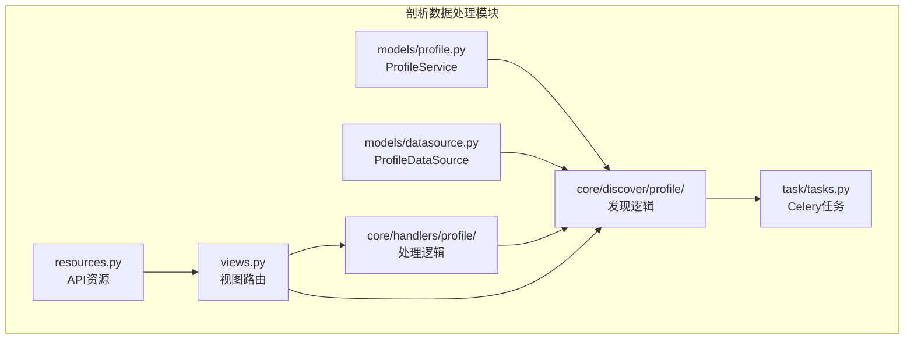
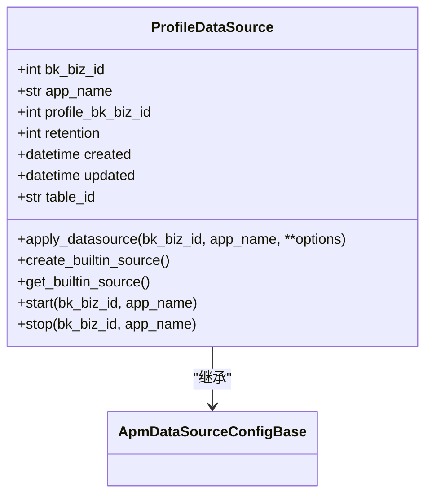
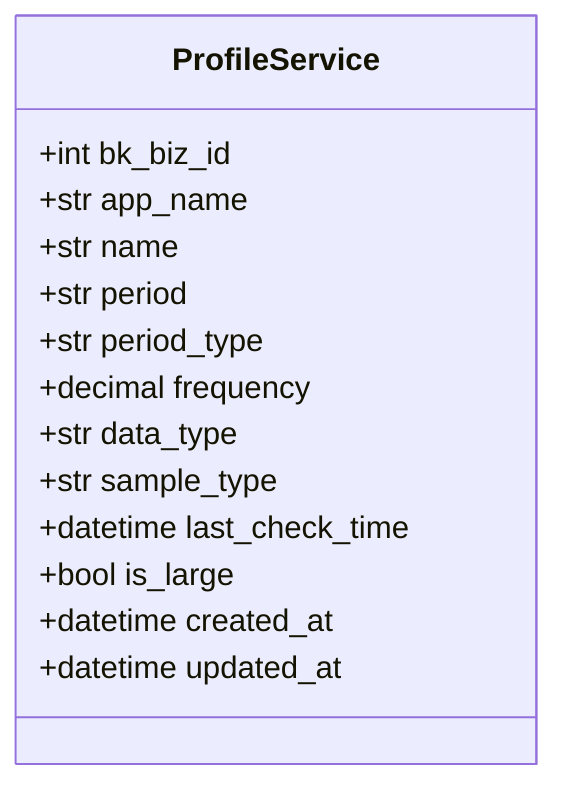
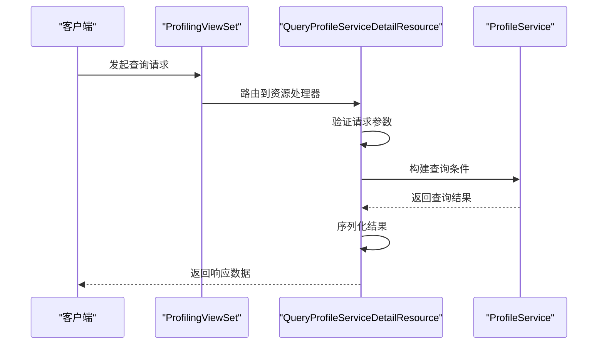
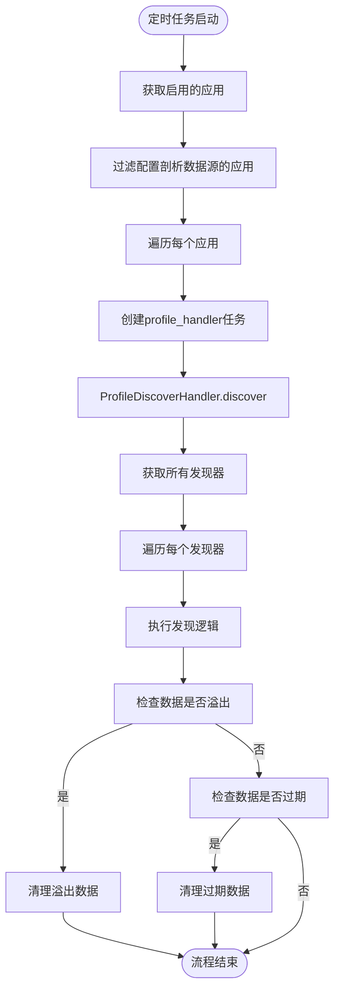
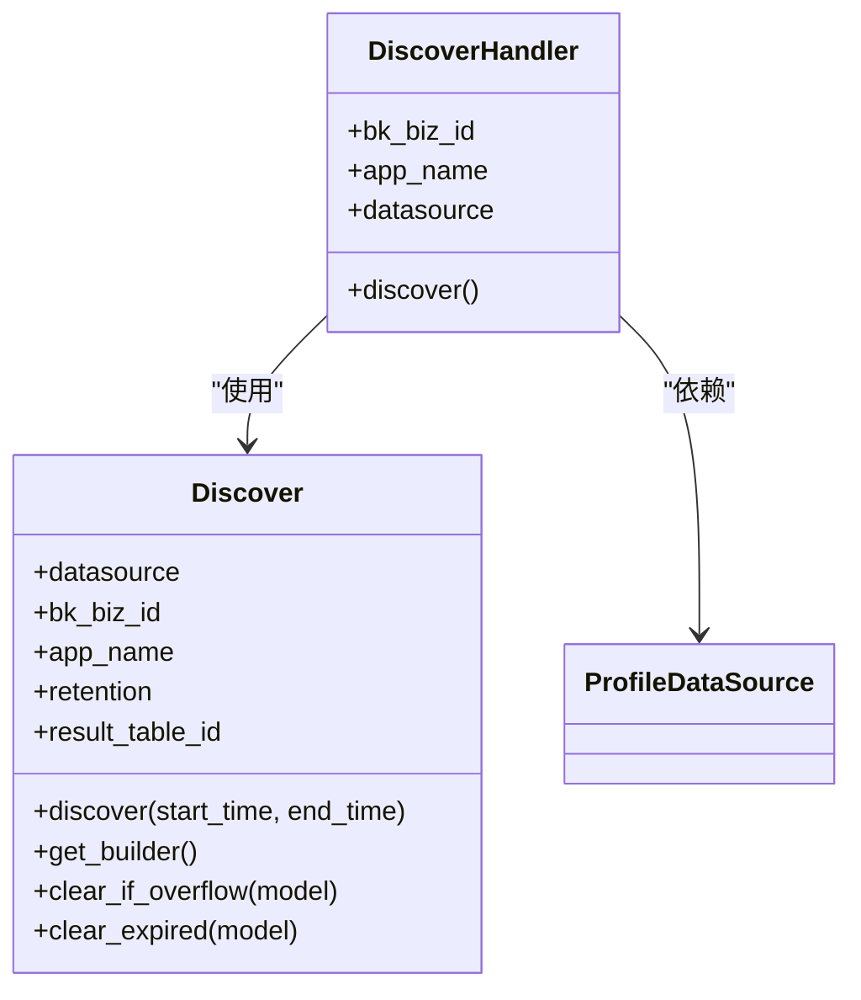
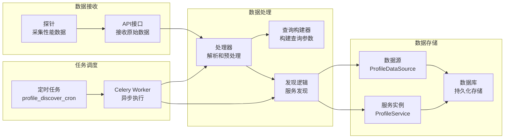

# 剖析数据处理

<cite>
**本文档引用的文件**   
- [profile.py](file://bkmonitor/apm/models/profile.py)
- [datasource.py](file://bkmonitor/apm/models/datasource.py)
- [tasks.py](file://bkmonitor/apm/task/tasks.py)
- [base.py](file://bkmonitor/apm/core/discover/profile/base.py)
- [query.py](file://bkmonitor/apm/core/handlers/profile/query.py)
- [resources.py](file://bkmonitor/apm/resources.py)
- [views.py](file://bkmonitor/apm/views.py)
</cite>

## 目录
1. [项目结构](#项目结构)
2. [核心组件](#核心组件)
3. [数据模型分析](#数据模型分析)
4. [数据处理流程](#数据处理流程)
5. [Celery任务调度](#celery任务调度)
6. [数据流图示](#数据流图示)

## 项目结构

根据项目结构，剖析数据处理功能主要分布在`bkmonitor/apm/`目录下，核心模块包括：
- `models/profile.py`：定义剖析数据相关的数据模型
- `models/datasource.py`：定义数据源配置模型
- `task/tasks.py`：包含Celery定时任务
- `core/discover/profile/`：剖析数据发现逻辑
- `core/handlers/profile/`：剖析数据处理处理器
- `resources.py`：API资源定义
- `views.py`：视图路由配置

**图示来源**
- [profile.py](file://bkmonitor/apm/models/profile.py)
- [datasource.py](file://bkmonitor/apm/models/datasource.py)
- [tasks.py](file://bkmonitor/apm/task/tasks.py)
- [base.py](file://bkmonitor/apm/core/discover/profile/base.py)
- [query.py](file://bkmonitor/apm/core/handlers/profile/query.py)
- [resources.py](file://bkmonitor/apm/resources.py)
- [views.py](file://bkmonitor/apm/views.py)

## 核心组件

剖析数据处理功能的核心组件包括数据模型、处理器、发现逻辑和定时任务。这些组件协同工作，实现从探针接收原始性能剖析数据到存储的完整流程。

**组件来源**
- [profile.py](file://bkmonitor/apm/models/profile.py#L14-L30)
- [datasource.py](file://bkmonitor/apm/models/datasource.py#L1090-L1180)
- [tasks.py](file://bkmonitor/apm/task/tasks.py#L240-L264)
- [base.py](file://bkmonitor/apm/core/discover/profile/base.py#L59-L77)

## 数据模型分析

### ProfileDataSource 数据模型

`ProfileDataSource` 模型定义了剖析数据源的配置，继承自 `ApmDataSourceConfigBase`。

**字段说明：**
- `bk_biz_id`：业务ID，用于标识数据所属的业务
- `app_name`：应用名称，标识数据来源的应用
- `profile_bk_biz_id`：剖析数据源在计算平台的业务ID
- `retention`：数据过期时间（天），控制数据存储周期
- `created`：创建时间，记录数据源创建时间戳
- `updated`：更新时间，记录数据源最后更新时间
- `table_id`：表ID，通过 `get_table_id` 方法生成，格式为 `{bk_biz_id}_{前缀}.profile_{app_name}`

**存储策略：**
- 数据源创建时，如果业务ID为负数（非业务环境），则创建在公共业务下
- 使用 `apply_datasource` 方法创建数据源，会调用计算平台API创建接入
- 数据源支持内置配置，通过 `create_builtin_source` 方法创建内置数据源
- 提供 `start` 和 `stop` 类方法来控制数据采集的启停

**图示来源**
- [datasource.py](file://bkmonitor/apm/models/datasource.py#L1090-L1180)

### ProfileService 数据模型

`ProfileService` 模型定义了剖析服务实例的信息。

**字段说明：**
- `bk_biz_id`：业务ID，标识服务所属的业务
- `app_name`：应用名称，标识服务所属的应用
- `name`：服务名称，标识具体的服务实例
- `period`：采样周期，如"1m"、"5m"等
- `period_type`：周期类型，如"minute"、"hour"等
- `frequency`：采样频率，数值类型
- `data_type`：数据类型，如"cpu"、"memory"等
- `sample_type`：采样类型，如"continuous"、"on-demand"等
- `last_check_time`：最近检查时间，用于服务健康检查
- `is_large`：是否是大数据量服务，用于优化处理策略
- `created_at`：创建时间
- `updated_at`：更新时间

**图示来源**
- [profile.py](file://bkmonitor/apm/models/profile.py#L14-L30)

## 数据处理流程

剖析数据处理流程从接收探针数据开始，经过解析、预处理，最终存储到指定的数据源。整个流程由多个组件协同完成。

### 请求处理流程

当系统接收到剖析数据查询请求时，处理流程如下：

1. 客户端通过API发起请求
2. `ProfilingViewSet` 路由到相应的资源处理器
3. `QueryProfileServiceDetailResource` 处理器接收请求
4. 根据请求参数构建查询条件
5. 调用 `ProfileService` 模型进行数据库查询
6. 序列化结果并返回给客户端

**图示来源**
- [views.py](file://bkmonitor/apm/views.py#L135-L141)
- [resources.py](file://bkmonitor/apm/resources.py#L1840-L1881)
- [profile.py](file://bkmonitor/apm/models/profile.py#L14-L30)

### 数据发现流程

剖析数据的发现流程由定时任务触发，定期从数据源发现新的剖析服务：

1. `profile_discover_cron` 定时任务启动
2. 获取所有启用的应用
3. 过滤出配置了剖析数据源的应用
4. 为每个应用创建 `profile_handler` 任务
5. `ProfileDiscoverHandler` 处理器执行发现逻辑
6. 遍历所有发现器（DiscoverContainer）执行发现
7. 清理过期和溢出的数据

**图示来源**
- [tasks.py](file://bkmonitor/apm/task/tasks.py#L250-L264)
- [base.py](file://bkmonitor/apm/core/discover/profile/base.py#L59-L77)

## Celery任务调度

剖析数据处理系统使用Celery实现周期性任务的调度，确保数据的定期采集、聚合与降采样。

### profile_discover_cron 任务

`profile_discover_cron` 是剖析数据发现的主调度任务，负责定期发现新的剖析服务。

**执行逻辑：**
1. 记录任务开始时间
2. 查询所有启用的APM应用
3. 过滤出配置了剖析数据源的应用
4. 为每个符合条件的应用调用 `profile_handler`
5. 记录任务执行日志

该任务通过 `profile_handler` Celery任务异步执行具体的发现逻辑，避免阻塞主调度线程。

### profile_handler 任务

`profile_handler` 是具体的剖析数据发现处理器，接收业务ID和应用名称作为参数。

**执行逻辑：**
1. 初始化 `ProfileDiscoverHandler` 处理器
2. 设置时间范围为最近10分钟
3. 遍历所有剖析数据发现器
4. 调用每个发现器的 `discover` 方法
5. 记录执行日志

**图示来源**
- [tasks.py](file://bkmonitor/apm/task/tasks.py#L240-L264)
- [base.py](file://bkmonitor/apm/core/discover/profile/base.py#L25-L77)

## 数据流图示

以下是剖析数据从接收到存储的完整数据流图示：

**图示来源**
- [tasks.py](file://bkmonitor/apm/task/tasks.py)
- [base.py](file://bkmonitor/apm/core/discover/profile/base.py)
- [query.py](file://bkmonitor/apm/core/handlers/profile/query.py)
- [datasource.py](file://bkmonitor/apm/models/datasource.py)
- [profile.py](file://bkmonitor/apm/models/profile.py)