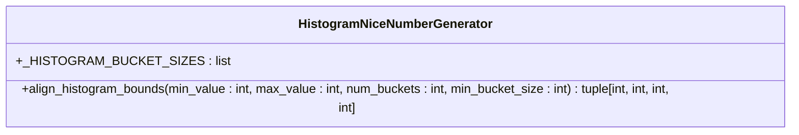
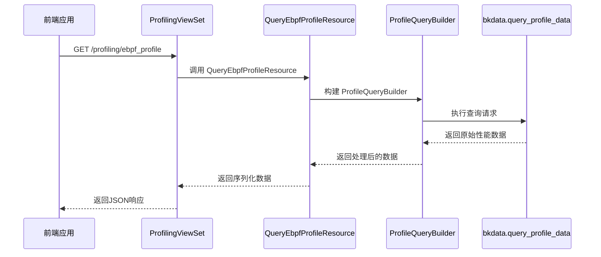
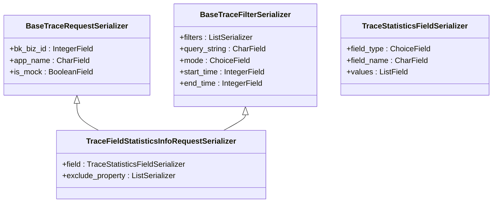

# 性能数据可视化

<cite>
**本文档引用的文件**  
- [ui_optimizations.py](file://bkmonitor/apm/utils/ui_optimizations.py)
- [views.py](file://bkmonitor/apm/views.py)
- [serializers.py](file://bkmonitor/apm/serializers.py)
- [resources.py](file://bkmonitor/apm/resources.py)
</cite>

## 目录
1. [简介](#简介)
2. [核心组件分析](#核心组件分析)
3. [性能数据优化算法](#性能数据优化算法)
4. [API视图与数据处理流程](#api视图与数据处理流程)
5. [序列化器定义](#序列化器定义)
6. [可视化案例](#可视化案例)
7. [结论](#结论)

## 简介
本文档详细描述了蓝鲸监控平台（BlueKing - Monitor）中性能数据可视化功能的实现机制。重点阐述了如何将高基数、高维度的性能剖析数据（如火焰图、调用树）通过优化算法转换为前端友好的轻量级格式，并通过API接口提供给前端进行交互式渲染。

## 核心组件分析

本文档涉及的核心组件包括：
- `utils/ui_optimizations.py`：提供性能数据的优化算法和数据转换函数
- `views.py`：定义API视图，处理前端请求
- `serializers.py`：定义API响应的数据结构
- `resources.py`：实现具体的业务逻辑和数据查询

这些组件协同工作，实现了从原始性能数据到前端可视化展示的完整流程。

**Section sources**
- [ui_optimizations.py](file://bkmonitor/apm/utils/ui_optimizations.py)
- [views.py](file://bkmonitor/apm/views.py)
- [serializers.py](file://bkmonitor/apm/serializers.py)
- [resources.py](file://bkmonitor/apm/resources.py)

## 性能数据优化算法

### HistogramNiceNumberGenerator 类
`ui_optimizations.py` 文件中的 `HistogramNiceNumberGenerator` 类提供了用于重新构建分桶大小和数量的优化算法。该类通过使用"nice number"策略，将原始的性能数据分桶转换为更易于前端展示的格式。



**Diagram sources**
- [ui_optimizations.py](file://bkmonitor/apm/utils/ui_optimizations.py#L5-L56)

#### 分桶对齐算法
`align_histogram_bounds` 方法是核心的优化函数，其主要功能包括：
1. 当最小值等于最大值时，返回包含最小桶大小的单桶区间
2. 计算目标桶大小，基于数据范围和期望的桶数量
3. 使用二分查找在预定义的"nice number"桶大小列表中找到最接近的目标大小
4. 计算左边界、右边界、实际桶大小和最终桶数量

该算法确保了生成的分桶大小符合人类直观认知（如1, 2, 5, 10, 20, 25, 40, 50等），从而提高了数据可视化的效果。

**Section sources**
- [ui_optimizations.py](file://bkmonitor/apm/utils/ui_optimizations.py#L30-L56)

## API视图与数据处理流程

### ProfilingViewSet
`views.py` 文件中的 `ProfilingViewSet` 类定义了与性能剖析相关的API端点，包括：
- `builtin_profile_datasource`：查询内置性能剖析数据源
- `services_detail`：查询性能剖析服务详情
- `ebpf_service_list`：查询eBPF服务列表
- `ebpf_profile`：查询eBPF性能剖析数据



**Diagram sources**
- [views.py](file://bkmonitor/apm/views.py#L135-L141)
- [resources.py](file://bkmonitor/apm/resources.py#L1891-L1907)
- [query.py](file://bkmonitor/apm/core/handlers/profile/query.py)

### 数据处理流程
性能数据的处理流程如下：
1. 前端发起API请求，指定业务ID、应用名称、服务名称、时间范围等参数
2. `ProfilingViewSet` 接收请求并路由到相应的资源处理器
3. `QueryEbpfProfileResource` 处理器接收参数并调用底层查询构建器
4. `ProfileQueryBuilder` 构建符合后端服务要求的查询参数
5. 调用 `bkdata.query_profile_data` 接口获取原始性能数据
6. 将原始数据转换为前端友好的格式并返回

**Section sources**
- [views.py](file://bkmonitor/apm/views.py#L135-L141)
- [resources.py](file://bkmonitor/apm/resources.py#L1891-L1907)

## 序列化器定义

### 请求序列化器
`serializers.py` 文件定义了性能数据查询的请求序列化器，主要包括：



**Diagram sources**
- [serializers.py](file://bkmonitor/apm/serializers.py#L31-L67)

### 字段统计信息请求序列化器
`TraceFieldStatisticsInfoRequestSerializer` 是用于性能数据查询的核心序列化器，它继承了基础的请求和过滤序列化器，添加了特定于性能分析的字段：

- `field`：指定要统计的字段，包含字段类型、名称和过滤值
- `exclude_property`：指定要排除的属性，用于过滤统计结果

该序列化器还包含了验证逻辑，确保时间对齐查询方法的正确设置，以及数值类型查询条件的完整性。

**Section sources**
- [serializers.py](file://bkmonitor/apm/serializers.py#L56-L77)

## 可视化案例

### 交互式火焰图实现
以下是一个从后端API获取数据并在前端渲染交互式火焰图的具体案例：

1. **前端请求**：
```javascript
// 前端调用API获取性能数据
fetch('/api/profiling/ebpf_profile', {
  method: 'POST',
  headers: {
    'Content-Type': 'application/json',
  },
  body: JSON.stringify({
    bk_biz_id: 123,
    app_name: 'my-app',
    service_name: 'web-service',
    start: 1640995200,
    end: 1641081600
  })
})
```

2. **后端处理**：
- API视图接收请求参数
- 资源处理器调用 `DeepFlowQuery.get_profile` 方法
- 查询构建器创建符合要求的查询参数
- 调用后端服务获取原始性能数据

3. **数据优化**：
- 使用 `HistogramNiceNumberGenerator` 对时间轴进行优化
- 将高基数的调用栈数据聚合为树形结构
- 应用采样策略减少数据量

4. **前端渲染**：
- 接收JSON格式的优化后数据
- 使用D3.js或类似库渲染火焰图
- 实现交互功能，如缩放、悬停查看详情、点击展开/折叠等

此案例展示了从原始性能数据到交互式可视化展示的完整流程，体现了后端优化算法和API设计的重要性。

**Section sources**
- [views.py](file://bkmonitor/apm/views.py#L135-L141)
- [resources.py](file://bkmonitor/apm/resources.py#L1891-L1907)
- [ui_optimizations.py](file://bkmonitor/apm/utils/ui_optimizations.py#L5-L56)

## 结论
本文档详细描述了蓝鲸监控平台中性能数据可视化功能的实现机制。通过 `ui_optimizations.py` 中的优化算法，系统能够将高基数、高维度的性能剖析数据转换为前端友好的轻量级格式。`views.py` 中的API视图（如 `QueryProfileView`）调用这些优化工具并返回处理后的数据，而 `serializers.py` 中的序列化器则定义了API响应的结构。这一系列组件协同工作，实现了高效的性能数据可视化，为用户提供直观、交互式的性能分析体验。