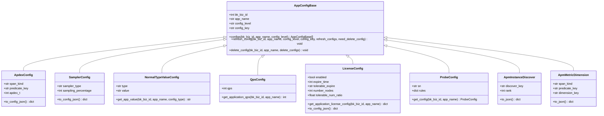
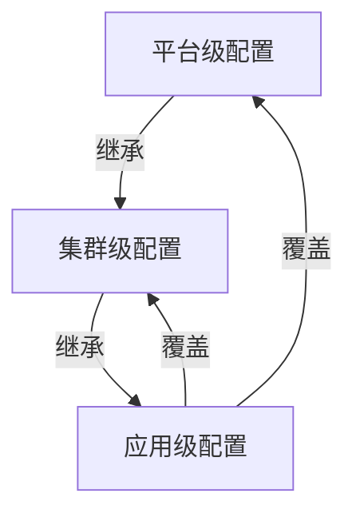
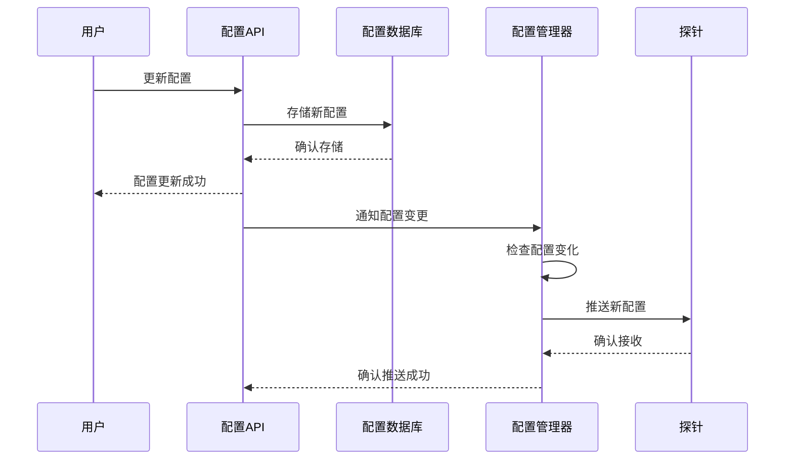
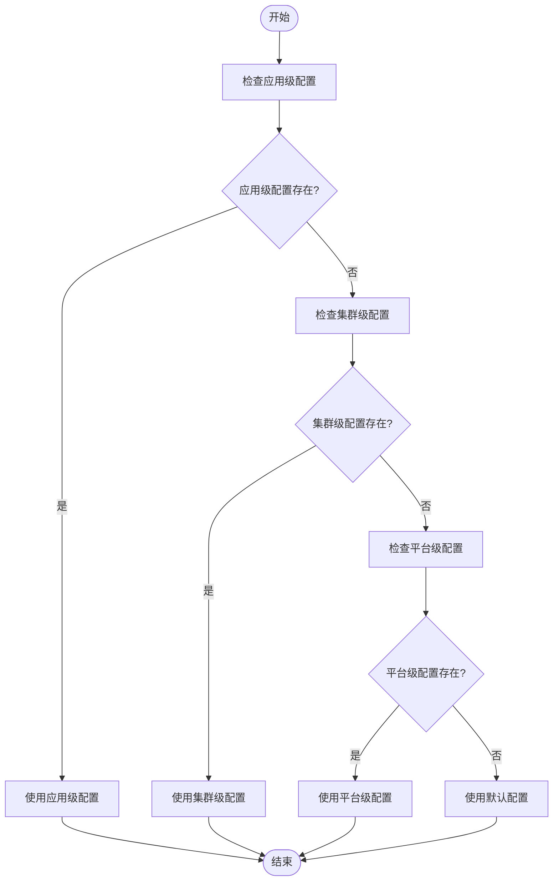
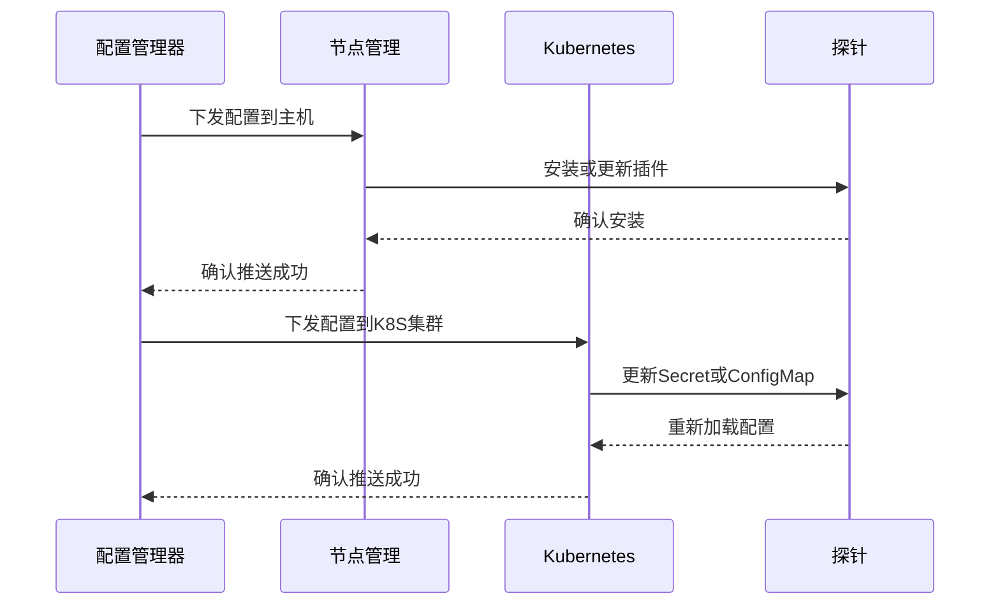

# 探针配置

<cite>
**本文档引用的文件**   
- [application_config.py](file://bkmonitor/apm/core/application_config.py)
- [cluster_config.py](file://bkmonitor/apm/core/cluster_config.py)
- [platform_config.py](file://bkmonitor/apm/core/platform_config.py)
- [config.py](file://bkmonitor/apm/models/config.py)
- [constants.py](file://bkmonitor/apm/constants.py)
</cite>

## 目录
1. [引言](#引言)
2. [配置模型与数据结构](#配置模型与数据结构)
3. [配置层次结构与继承关系](#配置层次结构与继承关系)
4. [配置动态更新机制](#配置动态更新机制)
5. [配置优先级决策流程](#配置优先级决策流程)
6. [配置推送机制](#配置推送机制)
7. [多层级配置冲突处理策略](#多层级配置冲突处理策略)
8. [总结](#总结)

## 引言

探针配置管理系统是蓝鲸监控平台（BlueKing - Monitor）中应用性能管理（APM）模块的核心组件，负责管理应用级、集群级和平台级的配置。该系统通过三个主要配置模块——`application_config.py`、`cluster_config.py`和`platform_config.py`——实现配置的分层管理、动态更新和推送。本文档详细说明这三个配置模块的层次结构、继承关系、配置模型、动态更新机制以及配置优先级的决策流程。

**Section sources**
- [application_config.py](file://bkmonitor/apm/core/application_config.py#L1-L614)
- [cluster_config.py](file://bkmonitor/apm/core/cluster_config.py#L1-L54)
- [platform_config.py](file://bkmonitor/apm/core/platform_config.py#L1-L552)

## 配置模型与数据结构

配置模型定义了应用级、集群级和平台级配置的存储和管理方式。这些配置通过`models/config.py`中的模型类进行定义和管理。

**Diagram sources **
- [config.py](file://bkmonitor/apm/models/config.py#L614-L894)

**Section sources**
- [config.py](file://bkmonitor/apm/models/config.py#L614-L894)

## 配置层次结构与继承关系

探针配置系统采用分层结构，分为应用级、集群级和平台级三个层次。每个层次的配置都有其特定的作用范围和优先级。

**Diagram sources **
- [application_config.py](file://bkmonitor/apm/core/application_config.py#L52-L614)
- [platform_config.py](file://bkmonitor/apm/core/platform_config.py#L42-L552)

**Section sources**
- [application_config.py](file://bkmonitor/apm/core/application_config.py#L52-L614)
- [platform_config.py](file://bkmonitor/apm/core/platform_config.py#L42-L552)

## 配置动态更新机制

配置动态更新机制允许在不重启探针的情况下更新配置。当配置发生变化时，系统会自动检测并更新配置。

**Diagram sources **
- [application_config.py](file://bkmonitor/apm/core/application_config.py#L58-L84)
- [platform_config.py](file://bkmonitor/apm/core/platform_config.py#L53-L70)

**Section sources**
- [application_config.py](file://bkmonitor/apm/core/application_config.py#L58-L84)
- [platform_config.py](file://bkmonitor/apm/core/platform_config.py#L53-L70)

## 配置优先级决策流程

配置优先级决策流程决定了在多层级配置冲突时，哪个配置会被最终采用。以下是配置优先级的决策流程图。

**Diagram sources **
- [application_config.py](file://bkmonitor/apm/core/application_config.py#L146-L220)
- [platform_config.py](file://bkmonitor/apm/core/platform_config.py#L103-L123)

**Section sources**
- [application_config.py](file://bkmonitor/apm/core/application_config.py#L146-L220)
- [platform_config.py](file://bkmonitor/apm/core/platform_config.py#L103-L123)

## 配置推送机制

配置推送机制负责将更新后的配置推送到各个探针实例。系统通过节点管理和Kubernetes两种方式实现配置推送。

**Diagram sources **
- [application_config.py](file://bkmonitor/apm/core/application_config.py#L545-L614)
- [platform_config.py](file://bkmonitor/apm/core/platform_config.py#L489-L552)

**Section sources**
- [application_config.py](file://bkmonitor/apm/core/application_config.py#L545-L614)
- [platform_config.py](file://bkmonitor/apm/core/platform_config.py#L489-L552)

## 多层级配置冲突处理策略

在多层级配置冲突时，系统采用以下处理策略：

1. **应用级配置优先**：当应用级配置存在时，无论集群级或平台级配置如何，都优先使用应用级配置。
2. **集群级配置次之**：当应用级配置不存在时，使用集群级配置。
3. **平台级配置作为默认**：当应用级和集群级配置都不存在时，使用平台级配置。
4. **默认配置兜底**：当所有层级的配置都不存在时，使用系统默认配置。

例如，假设某个应用的QPS限制在应用级配置中设置为1000，在集群级配置中设置为500，在平台级配置中设置为200。根据上述策略，该应用的QPS限制将被设置为1000，因为应用级配置具有最高优先级。

**Section sources**
- [application_config.py](file://bkmonitor/apm/core/application_config.py#L259-L265)
- [platform_config.py](file://bkmonitor/apm/core/platform_config.py#L196-L197)

## 总结

探针配置管理系统通过分层结构和继承关系，实现了灵活且高效的配置管理。系统支持动态更新和推送，确保配置变更能够及时生效。通过明确的优先级决策流程和冲突处理策略，保证了配置的一致性和可靠性。这些机制共同构成了一个健壮的配置管理体系，为蓝鲸监控平台的稳定运行提供了有力支持。