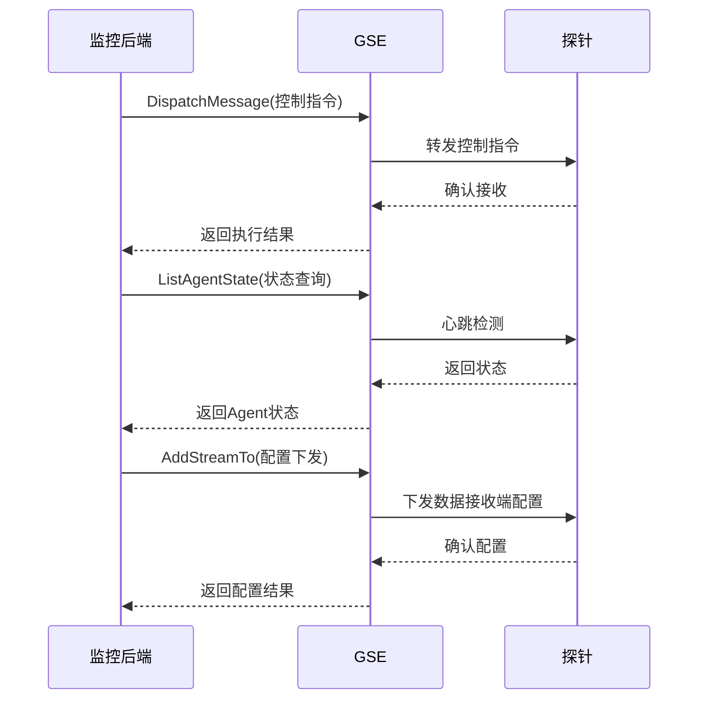

# GSE指令交互

<cite>
**本文档引用的文件**
- [default.py](file://bkmonitor/api/gse/default.py)
- [discover_handler.py](file://bkmonitor/apm/core/handlers/discover_handler.py)
- [settings.py](file://bkmonitor/settings.py)
- [application.py](file://bkmonitor/apm/models/application.py)
</cite>

## 目录
1. [引言](#引言)
2. [GSE API封装机制](#gse-api封装机制)
3. [探针动态发现与管理](#探针动态发现与管理)
4. [指令交互时序分析](#指令交互时序分析)
5. [长连接与心跳机制](#长连接与心跳机制)
6. [故障恢复策略](#故障恢复策略)
7. [总结](#总结)

## 引言
本文档详细说明了系统与通用服务引擎（GSE）之间的指令交互机制。重点阐述了`default.py`中封装的GSE API调用方式，以及`discover_handler.py`如何利用GSE接口实现探针的动态发现、版本管理和控制指令的推送。通过分析长连接维护、心跳检测和故障恢复策略，确保探针与监控后端的可靠通信。

## GSE API封装机制

`default.py`文件封装了与GSE交互的核心API，提供了进程管理、配置下发和状态查询等功能。这些API通过继承`GseBaseResource`和`GseAPIBaseResource`基类实现，采用统一的请求格式和认证机制。

核心API包括：
- **数据接收端配置**：`AddStreamTo`、`UpdateStreamTo`、`DeleteStreamTo`和`QueryStreamTo`用于管理数据接收端配置
- **路由配置**：`AddRoute`、`UpdateRoute`、`DeleteRoute`和`QueryRoute`用于管理数据路由规则
- **状态查询**：`GetAgentStatus`和`ListAgentState`用于查询Agent状态
- **消息分发**：`DispatchMessage`用于向Agent推送控制指令

API调用通过`settings.py`中的`GSE_SLOT_ID`和`GSE_SLOT_TOKEN`进行身份验证，确保通信安全。

**Section sources**
- [default.py](file://bkmonitor/api/gse/default.py#L1-L484)

## 探针动态发现与管理

`discover_handler.py`中的`DiscoverHandler`类负责探针的动态发现和管理。该类通过以下机制实现探针生命周期管理：

1. **保留期管理**：通过`get_app_retention`方法获取应用的保留期配置，用于确定探针数据的有效性
2. **实例查询**：通过`get_host_instance`方法查询主机实例信息，实现探针的动态发现
3. **时间过滤**：通过`get_retention_filter_params`和`get_retention_utc_filter_params`方法生成时间过滤参数，确保UTC时区一致性

探针管理与`application.py`中的`ApmApplication`模型紧密集成，通过`start_trace`、`start_metric`等方法实现探针的启停控制。

**Section sources**
- [discover_handler.py](file://bkmonitor/apm/core/handlers/discover_handler.py#L1-L63)
- [application.py](file://bkmonitor/apm/models/application.py#L1-L200)

## 指令交互时序分析

**Diagram sources**
- [default.py](file://bkmonitor/api/gse/default.py#L471-L483)
- [default.py](file://bkmonitor/api/gse/default.py#L462-L470)
- [default.py](file://bkmonitor/api/gse/default.py#L51-L109)

## 长连接与心跳机制

系统通过GSE维护与探针的长连接，确保实时通信。心跳机制通过以下方式实现：

1. **定期状态查询**：使用`GetAgentStatus`和`ListAgentState`API定期查询探针状态
2. **连接保持**：GSE与探针之间维持长连接，减少连接建立开销
3. **状态缓存**：使用`CacheType.GSE`缓存探针状态，提高查询效率

长连接的维护依赖于`settings.py`中的`USE_GSE_AGENT_STATUS_NEW_API`配置，该配置决定了是否使用新的GSE Agent状态接口。

**Section sources**
- [default.py](file://bkmonitor/api/gse/default.py#L414-L470)
- [settings.py](file://bkmonitor/settings.py#L650)

## 故障恢复策略

系统实现了多层次的故障恢复策略，确保探针通信的可靠性：

1. **重试机制**：在API调用失败时自动重试，确保指令最终送达
2. **状态同步**：通过定期状态查询，及时发现并处理探针异常
3. **配置回滚**：在配置下发失败时，自动回滚到上一版本配置
4. **告警通知**：在探针失联或配置失败时，触发告警通知运维人员

故障恢复策略与`application.py`中的应用管理逻辑集成，通过`send_datasource_apply_alert`方法实现异常告警。

**Section sources**
- [default.py](file://bkmonitor/api/gse/default.py#L480-L483)
- [application.py](file://bkmonitor/apm/models/application.py#L80-L81)

## 总结
本文档详细分析了系统与GSE之间的指令交互机制。通过`default.py`封装的GSE API，实现了探针的进程管理、配置下发和状态查询。`discover_handler.py`利用这些API实现了探针的动态发现和版本管理。通过长连接维护、心跳检测和故障恢复策略，确保了探针与监控后端的可靠通信。这些机制共同构成了一个稳定、高效的监控系统基础架构。