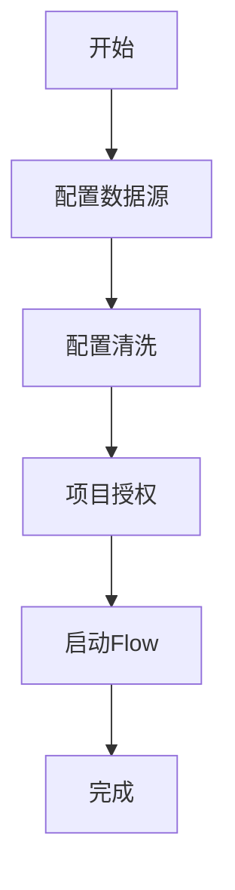
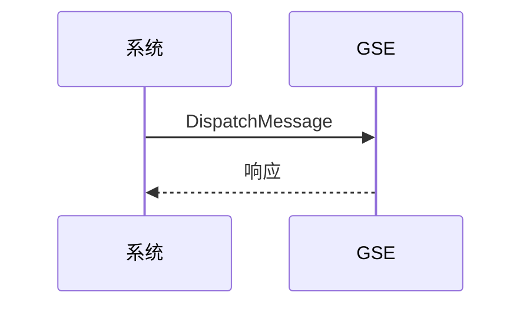
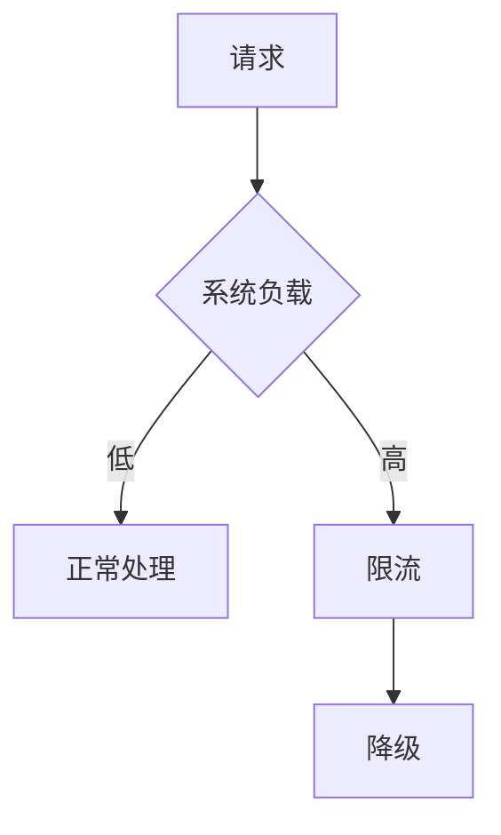

# 探针数据上报

<cite>
**本文档引用的文件**   
- [flow.py](file://bkmonitor/apm/core/handlers/bk_data/flow.py)
- [tail_sampling.py](file://bkmonitor/apm/core/handlers/bk_data/tail_sampling.py)
- [virtual_metric.py](file://bkmonitor/apm/core/handlers/bk_data/virtual_metric.py)
- [helper.py](file://bkmonitor/apm/core/handlers/bk_data/helper.py)
- [default.py](file://bkmonitor/api/bkdata/default.py)
- [default.py](file://bkmonitor/api/gse/default.py)
</cite>

## 目录
1. [简介](#简介)
2. [探针数据上报机制](#探针数据上报机制)
3. [蓝鲸数据平台写入机制](#蓝鲸数据平台写入机制)
4. [GSE通信与指令下发](#gse通信与指令下发)
5. [HTTP上报接口示例](#http上报接口示例)
6. [高并发场景下的限流与降级](#高并发场景下的限流与降级)

## 简介
本文档详细描述了APM探针数据上报机制，重点介绍`apm/core/handlers/bk_data/`目录下处理器如何接收和解析来自APM探针（如Java Agent、Node.js Agent）的性能数据，包括Trace、Metric和Log的上报协议与格式。同时说明系统如何通过`api/bkdata/`将数据写入蓝鲸数据平台，以及如何利用`api/gse/`实现与GSE（通用服务引擎）的通信，完成探针的指令下发与状态同步。

## 探针数据上报机制

探针数据上报机制主要通过`apm/core/handlers/bk_data/`目录下的处理器实现。该机制负责接收和解析来自APM探针的性能数据，包括Trace、Metric和Log。

**Section sources**
- [flow.py](file://bkmonitor/apm/core/handlers/bk_data/flow.py#L1-L412)
- [tail_sampling.py](file://bkmonitor/apm/core/handlers/bk_data/tail_sampling.py#L1-L313)
- [virtual_metric.py](file://bkmonitor/apm/core/handlers/bk_data/virtual_metric.py#L1-L222)

## 蓝鲸数据平台写入机制

系统通过`api/bkdata/`接口将数据写入蓝鲸数据平台。该机制包括数据源配置、清洗配置、项目授权和Flow启动等步骤。

**Diagram sources**
- [flow.py](file://bkmonitor/apm/core/handlers/bk_data/flow.py#L167-L178)
- [default.py](file://bkmonitor/api/bkdata/default.py#L533-L555)

**Section sources**
- [flow.py](file://bkmonitor/apm/core/handlers/bk_data/flow.py#L167-L178)
- [default.py](file://bkmonitor/api/bkdata/default.py#L533-L555)

## GSE通信与指令下发

系统利用`api/gse/`实现与GSE（通用服务引擎）的通信，完成探针的指令下发与状态同步。主要通过`DispatchMessage`接口实现消息分发。

**Diagram sources**
- [default.py](file://bkmonitor/api/gse/default.py#L471-L484)

**Section sources**
- [default.py](file://bkmonitor/api/gse/default.py#L471-L484)

## HTTP上报接口示例

HTTP上报接口支持认证、数据压缩和批量上报策略。以下为请求/响应示例：

**Diagram sources**
- [default.py](file://bkmonitor/api/bkdata/default.py#L192-L217)

## 高并发场景下的限流与降级

在高并发场景下，系统通过限流和降级方案保证稳定性。限流策略基于请求频率和系统负载，降级策略在系统压力过大时关闭非核心功能。

**Diagram sources**
- [flow.py](file://bkmonitor/apm/core/handlers/bk_data/flow.py#L337-L357)
- [tail_sampling.py](file://bkmonitor/apm/core/handlers/bk_data/tail_sampling.py#L336-L357)

**Section sources**
- [flow.py](file://bkmonitor/apm/core/handlers/bk_data/flow.py#L337-L357)
- [tail_sampling.py](file://bkmonitor/apm/core/handlers/bk_data/tail_sampling.py#L336-L357)