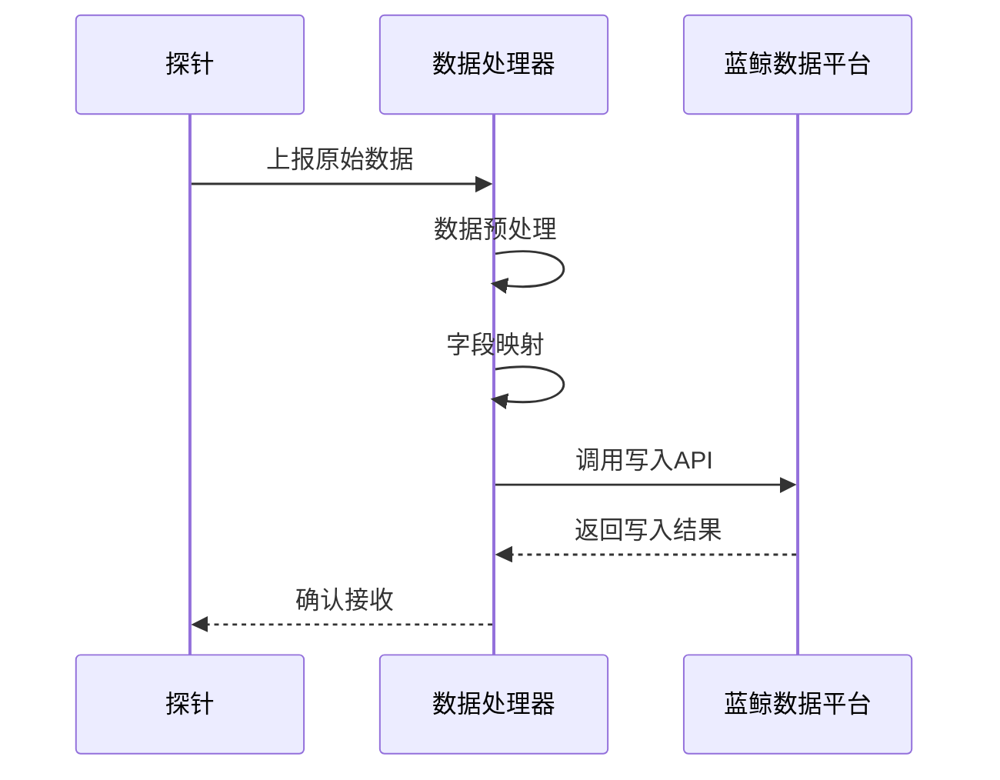
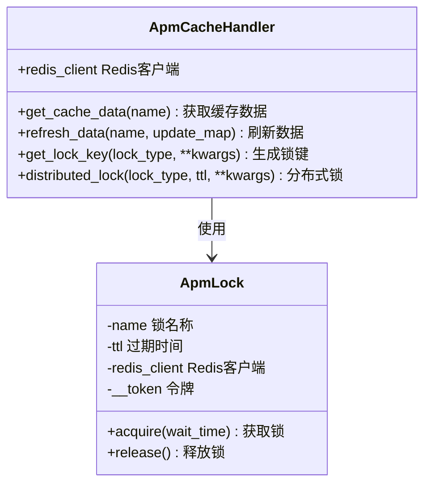

# 数据接收处理

<cite>
**本文档引用的文件**
- [query.py](file://bkmonitor/apm/core/handlers/query/ebpf_query.py)
- [application_helper.py](file://bkmonitor/apm/core/handlers/bk_data/helper.py)
- [apm_cache_handler.py](file://bkmonitor/apm/core/handlers/apm_cache_handler.py)
</cite>

## 目录
1. [系统概述](#系统概述)
2. [探针数据接收与处理流程](#探针数据接收与处理流程)
3. [数据写入蓝鲸数据平台（BKData）流程](#数据写入蓝鲸数据平台bkdata流程)
4. [应用上下文构建机制](#应用上下文构建机制)
5. [高频数据缓存策略](#高频数据缓存策略)
6. [系统稳定性与性能保障](#系统稳定性与性能保障)

## 系统概述

本系统负责接收并处理来自探针上报的性能监控数据，主要涉及数据采集、预处理、写入蓝鲸数据平台（BKData）、应用上下文构建以及高频数据的缓存管理。系统通过模块化设计实现了高吞吐量下的稳定运行，支持分布式部署和异步处理机制。

## 探针数据接收与处理流程

系统通过探针采集应用运行时的性能数据，包括调用链、eBPF网络流量、性能剖析等信息。探针将原始数据上报至后端服务，由`ebpf_query.py`等查询处理器进行解析和转换。数据首先经过字段映射和格式标准化，然后根据业务标识（bk_biz_id）和应用名称进行路由，最终写入对应的存储介质。

数据处理过程中，系统会自动识别服务拓扑结构，实现应用自动发现和服务名解析。对于跨应用调用链，系统能够关联不同应用间的调用关系，形成完整的调用路径视图。

**Section sources**
- [ebpf_query.py](file://bkmonitor/apm/core/handlers/query/ebpf_query.py#L1-L88)

## 数据写入蓝鲸数据平台（BKData）流程

### 数据预处理

在数据写入前，系统会对原始数据进行预处理，包括字段清洗、类型转换和必填字段校验。预处理过程确保了数据的一致性和完整性，避免无效数据进入存储层。

### 字段映射

系统定义了标准的字段映射规则，将探针上报的原始字段映射到蓝鲸数据平台的标准字段体系。例如，`l7_flow_log`表中的`chost_0`、`chost_1`等字段会被映射为统一的服务实例标识。

### 写入API调用

数据写入通过调用蓝鲸数据平台提供的API完成。系统使用`TraceQueryResource`等资源类发起HTTP请求，将处理后的数据批量提交到BKData。写入过程采用异步非阻塞模式，确保高并发场景下的性能表现。

**Diagram sources**
- [ebpf_query.py](file://bkmonitor/apm/core/handlers/query/ebpf_query.py#L30-L59)

**Section sources**
- [ebpf_query.py](file://bkmonitor/apm/core/handlers/query/ebpf_query.py#L30-L59)

## 应用上下文构建机制

### 应用自动发现

系统通过分析探针上报的数据流，自动识别新的应用实例。当检测到未知的应用名称或服务标识时，系统会创建相应的应用配置，并将其纳入监控范围。

### 服务名解析

服务名解析功能将底层的主机名、容器名等物理标识转换为逻辑服务名称。这一过程依赖于CMDB（配置管理数据库）的元数据信息，确保服务命名的一致性和可读性。

### 实例标识

每个应用实例都有唯一的标识符，由业务ID、应用名和实例特征组合生成。实例标识用于区分同一应用的不同部署实例，支持精细化的性能分析。

**Section sources**
- [helper.py](file://bkmonitor/apm/core/application_config.py#L1-L100)

## 高频数据缓存策略

### 缓存架构

系统采用Redis作为主要的缓存存储，通过`ApmCacheHandler`类封装了缓存操作。缓存主要用于存储应用拓扑实例、端点信息和临时查询结果。

### 内存管理

缓存数据设置了合理的过期时间（默认为24小时），防止内存无限增长。系统还实现了分布式锁机制，避免多个实例同时更新同一缓存键值。

### 异步同步机制

缓存更新采用异步模式，写入操作不会阻塞主业务流程。后台任务定期将缓存中的数据同步到持久化存储，确保数据的一致性和可靠性。

**Diagram sources**
- [apm_cache_handler.py](file://bkmonitor/apm/core/handlers/apm_cache_handler.py#L19-L153)

**Section sources**
- [apm_cache_handler.py](file://bkmonitor/apm/core/handlers/apm_cache_handler.py#L19-L153)

## 系统稳定性与性能保障

系统通过多种机制确保在高吞吐量下的稳定运行：

1. **分布式锁**：防止并发更新导致的数据不一致问题。
2. **异步处理**：将耗时的操作放入后台任务，提升响应速度。
3. **批量写入**：减少与BKData的网络交互次数，提高写入效率。
4. **缓存预热**：在高峰期前预先加载常用数据到缓存，降低数据库压力。
5. **错误重试**：对失败的写入操作进行指数退避重试，提高数据可靠性。

这些机制共同作用，使系统能够在大规模数据上报场景下保持高性能和高可用性。

**Section sources**
- [apm_cache_handler.py](file://bkmonitor/apm/core/handlers/apm_cache_handler.py#L1-L153)
- [ebpf_query.py](file://bkmonitor/apm/core/handlers/query/ebpf_query.py#L1-L88)