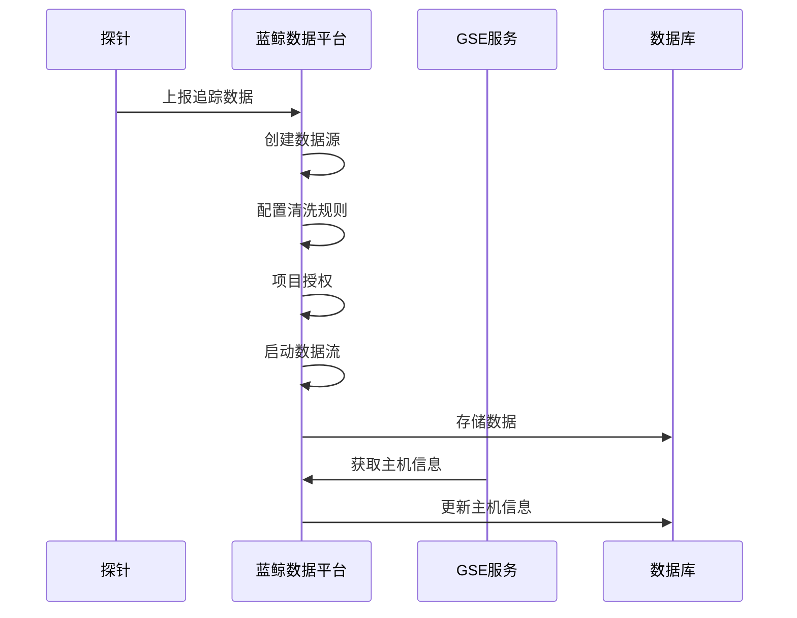

# 数据采集

<cite>
**本文档引用的文件**
- [virtual_metric.py](file://bkmonitor/apm/core/handlers/bk_data/virtual_metric.py)
- [flow.py](file://bkmonitor/apm/core/handlers/bk_data/flow.py)
- [base.py](file://bkmonitor/apm/core/handlers/query/base.py)
- [endpoint.py](file://bkmonitor/apm/core/discover/endpoint.py)
- [host.py](file://bkmonitor/apm/core/discover/host.py)
- [instance.py](file://bkmonitor/apm/core/discover/instance.py)
- [base.py](file://bkmonitor/apm/core/discover/base.py)
- [discover_handler.py](file://bkmonitor/apm/core/handlers/discover_handler.py)
- [constants.py](file://bkmonitor/apm/core/handlers/bk_data/constants.py)
- [helper.py](file://bkmonitor/apm/core/handlers/bk_data/helper.py)
- [tail_sampling.py](file://bkmonitor/apm/core/handlers/bk_data/tail_sampling.py)
- [api.py](file://bkmonitor/api/bkdata/default.py)
- [api.py](file://bkmonitor/api/gse/default.py)
</cite>

## 目录
1. [数据采集处理器职责](#数据采集处理器职责)
2. [服务发现机制](#服务发现机制)
3. [与蓝鲸数据平台和GSE服务的交互](#与蓝鲸数据平台和gse服务的交互)
4. [数据采集流程](#数据采集流程)

## 数据采集处理器职责

`apm/core/handlers/`目录下的处理器负责处理来自不同数据源的上报数据。`bk_data`子目录下的处理器主要负责与蓝鲸数据平台（BKData）的交互，包括数据源的创建、清洗配置、项目授权和数据流的启动。`query`子目录下的处理器则负责构建和执行查询，支持对日志和指标数据的检索。

`bk_data/virtual_metric.py`文件中的`VirtualMetricFlow`类负责虚拟指标的创建和管理。它通过调用蓝鲸数据平台的API来创建数据源、配置清洗规则、进行项目授权，并启动数据流。该类还处理了数据源的更新和删除操作。

`bk_data/flow.py`文件中的`ApmFlow`类是数据流处理的核心，它定义了数据流的通用处理流程，包括配置数据源、配置清洗、项目授权和启动数据流。该类还提供了错误处理和重试机制，确保数据流的稳定运行。

`query/base.py`文件中的`BaseQuery`类提供了查询构建的基础功能，支持对日志和指标数据的查询。它定义了查询的通用接口，包括时间范围查询、字段过滤和聚合查询。

**本节来源**
- [virtual_metric.py](file://bkmonitor/apm/core/handlers/bk_data/virtual_metric.py)
- [flow.py](file://bkmonitor/apm/core/handlers/bk_data/flow.py)
- [base.py](file://bkmonitor/apm/core/handlers/query/base.py)

## 服务发现机制

`apm/core/discover/`模块实现了服务发现机制，包括`endpoint`、`host`、`instance`等发现器。这些发现器负责从上报的追踪数据中提取服务、主机和实例信息，并将其存储在数据库中。

`endpoint.py`文件中的`EndpointDiscover`类负责发现和管理端点信息。它通过分析追踪数据中的`endpoint_name`、`service_name`等字段来识别端点，并处理端点的创建、更新和删除。该类还实现了数据去重和过期清理功能，确保数据库中的端点信息是最新的。

`host.py`文件中的`HostDiscover`类负责发现和管理主机信息。它通过分析追踪数据中的`ip`字段来识别主机，并尝试从CMDB中获取主机的`bk_cloud_id`和`bk_host_id`。该类还实现了主机信息的更新和创建功能。

`instance.py`文件中的`InstanceDiscover`类负责发现和管理实例信息。它通过分析追踪数据中的`instance_id`字段来识别实例，并处理实例的创建、更新和删除。该类还实现了实例信息的缓存和过期清理功能。

所有发现器都继承自`base.py`文件中的`DiscoverBase`类，该类提供了发现器的通用功能，包括规则匹配、数据过滤和错误处理。

**本节来源**
- [endpoint.py](file://bkmonitor/apm/core/discover/endpoint.py)
- [host.py](file://bkmonitor/apm/core/discover/host.py)
- [instance.py](file://bkmonitor/apm/core/discover/instance.py)
- [base.py](file://bkmonitor/apm/core/discover/base.py)

## 与蓝鲸数据平台和GSE服务的交互

系统通过`api/bkdata/`和`api/gse/`与蓝鲸数据平台和GSE服务进行交互，实现数据的拉取和上报。

`api/bkdata/default.py`文件定义了与蓝鲸数据平台的API接口，包括数据源创建、清洗配置、项目授权和数据流管理。`bk_data/virtual_metric.py`和`bk_data/flow.py`文件中的处理器通过调用这些API来实现数据的上报和处理。

`api/gse/default.py`文件定义了与GSE服务的API接口，用于获取主机信息和执行远程命令。`host.py`文件中的`HostDiscover`类通过调用GSE服务的API来获取主机的`bk_cloud_id`和`bk_host_id`。

系统还通过`discover_handler.py`文件中的`DiscoverHandler`类来协调服务发现和数据上报。该类提供了获取应用保留期、主机实例和过滤参数的功能，确保服务发现和数据上报的一致性。

**本节来源**
- [api.py](file://bkmonitor/api/bkdata/default.py)
- [api.py](file://bkmonitor/api/gse/default.py)
- [discover_handler.py](file://bkmonitor/apm/core/handlers/discover_handler.py)

## 数据采集流程

数据采集流程从探针上报数据开始，经过数据源创建、清洗配置、项目授权和数据流启动，最终将数据存储到数据库中。以下是数据采集的序列图：

**图示来源**
- [virtual_metric.py](file://bkmonitor/apm/core/handlers/bk_data/virtual_metric.py)
- [flow.py](file://bkmonitor/apm/core/handlers/bk_data/flow.py)
- [host.py](file://bkmonitor/apm/core/discover/host.py)
- [api.py](file://bkmonitor/api/bkdata/default.py)
- [api.py](file://bkmonitor/api/gse/default.py)

### 错误处理和重试机制

系统在数据采集过程中实现了完善的错误处理和重试机制。`ApmFlow`类在每个处理步骤中都包含了错误处理逻辑，如果某个步骤失败，系统会记录错误信息并抛出异常。对于可重试的错误，系统会进行多次重试，直到成功或达到最大重试次数。

`VirtualMetricFlow`类在创建和更新数据源时也实现了重试机制。如果创建数据源失败，系统会记录错误信息并抛出异常。对于清洗任务的启动，系统会检查清洗状态，如果状态不是运行中，会进行多次重试。

**本节来源**
- [flow.py](file://bkmonitor/apm/core/handlers/bk_data/flow.py)
- [virtual_metric.py](file://bkmonitor/apm/core/handlers/bk_data/virtual_metric.py)
- [constants.py](file://bkmonitor/apm/core/handlers/bk_data/constants.py)
- [helper.py](file://bkmonitor/apm/core/handlers/bk_data/helper.py)
- [tail_sampling.py](file://bkmonitor/apm/core/handlers/bk_data/tail_sampling.py)