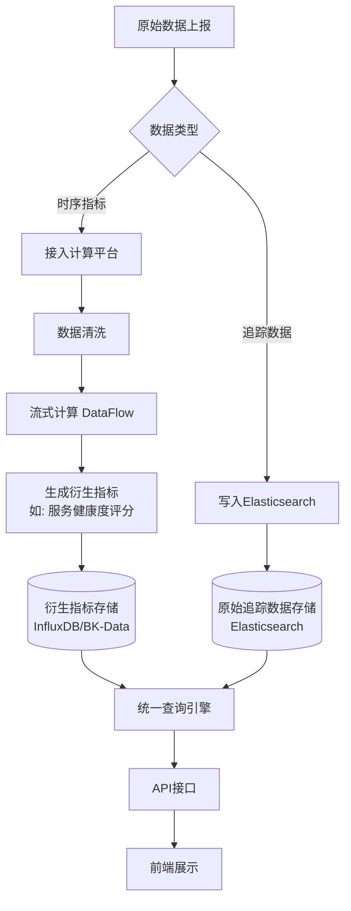

# 数据预处理

<cite>
**本文档引用的文件**   
- [virtual_metric.py](file://bkmonitor/apm/core/handlers/bk_data/virtual_metric.py)
- [base.py](file://bkmonitor/apm/core/handlers/query/base.py)
- [application_hepler.py](file://bkmonitor/apm/core/handlers/application_hepler.py)
- [constants.py](file://bkmonitor/apm/constants.py)
- [datasource.py](file://bkmonitor/apm/models/datasource.py)
</cite>

## 目录
1. [引言](#引言)
2. [虚拟指标处理器](#虚拟指标处理器)
3. [查询处理器](#查询处理器)
4. [应用拓扑辅助工具](#应用拓扑辅助工具)
5. [数据预处理流程](#数据预处理流程)
6. [性能优化建议](#性能优化建议)

## 引言
本文档详细描述了蓝鲸APM系统中数据预处理的核心流程，重点分析了`virtual_metric`和`query`处理器的工作机制，以及`application_hepler.py`在应用拓扑构建中的作用。文档旨在为开发和运维人员提供一个清晰的技术视图，理解原始采集数据如何被加工成可分析的指标。

## 虚拟指标处理器

`virtual_metric`处理器负责将基础时序指标（如`bk_apm_duration`）通过计算平台（BK-Data）的流式计算引擎（DataFlow）加工为衍生指标。其核心逻辑位于`bkmonitor/apm/core/handlers/bk_data/virtual_metric.py`。

该处理器通过`VirtualMetricFlow`类实现，其主要功能包括：
1.  **数据源接入**：通过`_create_deploy`方法调用计算平台API，为APM应用创建专属的Kafka数据源。
2.  **数据清洗**：通过`_upsert_and_start_cleans`方法配置并启动数据清洗任务。清洗规则由`constants.py`中的`databus_cleans_json_config`定义，主要功能是将原始JSON数据解析并提取到预定义的字段中。
3.  **流式计算**：通过`_create_start_flow`方法创建并启动一个DataFlow。该流程会消费清洗后的数据，并根据预设的聚合规则（如计算Apdex评分、平均响应时间等）生成新的衍生指标。
4.  **权限与配置**：通过`_auth_project`方法将生成的结果表授权给指定的计算平台项目，确保下游可以访问。

整个流程的配置信息（如`raw_data_id`、`dataflow_id`等）存储在`MetricDataSource`模型的`bk_data_virtual_metric_config`字段中，实现了配置的持久化。

**Section sources**
- [virtual_metric.py](file://bkmonitor/apm/core/handlers/bk_data/virtual_metric.py#L29-L222)
- [datasource.py](file://bkmonitor/apm/models/datasource.py#L208-L215)

## 查询处理器

`query`处理器负责实现对时序和追踪数据的聚合查询与多维度下钻分析。其核心基类`BaseQuery`位于`bkmonitor/apm/core/handlers/query/base.py`。

该处理器的主要特性包括：
1.  **统一查询构建**：利用`QueryConfigBuilder`（来自`bkmonitor.data_source.unify_query`）作为底层引擎，构建针对不同数据源（如InfluxDB、Elasticsearch）的查询语句，实现了查询逻辑与存储引擎的解耦。
2.  **灵活的过滤系统**：通过`FilterOperator`类定义了一套丰富的过滤操作符（如`equal`、`between`、`like`等），并将其映射到底层查询引擎（如ES）的查询语法。
3.  **时间范围处理**：`time_range_queryset`方法智能地处理查询时间范围，结合数据保留策略（retention）和当前时间，确保查询在有效数据范围内进行，并添加了时间填充以应对数据延迟。
4.  **聚合与下钻**：提供了`_query_field_aggregated_value`、`_query_field_topk`等方法，支持对特定字段进行聚合计算（如COUNT、AVG）和获取Top N值，从而实现多维度的下钻分析。

**Section sources**
- [base.py](file://bkmonitor/apm/core/handlers/query/base.py#L39-L388)

## 应用拓扑辅助工具

`application_hepler.py`文件中的`ApplicationHelper`类为应用的创建和存储配置提供了关键的辅助功能。

其主要职责包括：
1.  **获取默认存储集群**：`get_default_cluster_id`方法通过查询`DataLink`或调用元数据服务API，为指定业务（bk_biz_id）和应用（app_name）确定默认的Elasticsearch集群ID。它还支持基于应用名称的正则路由规则。
2.  **生成存储配置**：`get_default_storage_config`方法基于获取到的集群ID和系统默认设置，构建完整的Elasticsearch存储配置，包括分片数、副本数和数据保留天数。
3.  **创建默认应用**：`create_default_application`方法确保每个业务下都存在一个名为`default_app`的默认应用，为新接入的业务提供一个基础的监控入口。

该工具类是应用初始化和配置管理的重要组成部分，确保了应用与存储资源的正确关联。

**Section sources**
- [application_hepler.py](file://bkmonitor/apm/core/handlers/application_hepler.py#L31-L108)

## 数据预处理流程

**Diagram sources**
- [virtual_metric.py](file://bkmonitor/apm/core/handlers/bk_data/virtual_metric.py#L29-L222)
- [base.py](file://bkmonitor/apm/core/handlers/query/base.py#L39-L388)
- [datasource.py](file://bkmonitor/apm/models/datasource.py#L192-L283)

**Section sources**
- [virtual_metric.py](file://bkmonitor/apm/core/handlers/bk_data/virtual_metric.py#L29-L222)
- [base.py](file://bkmonitor/apm/core/handlers/query/base.py#L39-L388)

## 性能优化建议

1.  **清洗规则优化**：`databus_cleans_json_config`中的清洗规则应尽可能精简，只提取必要的字段，以减少计算平台的处理开销。
2.  **查询缓存**：对于高频但变化不频繁的查询结果（如应用列表、维度列表），应引入缓存机制，减少对后端存储的直接查询压力。
3.  **索引优化**：对于Elasticsearch中的追踪数据，应根据查询模式合理设计索引模板和分片策略，特别是对高频查询的维度字段建立合适的索引。
4.  **聚合粒度**：在进行长时间范围的聚合查询时，应动态调整聚合的时间间隔（interval），避免返回过多的数据点，影响前端渲染性能。
5.  **流式计算资源**：监控DataFlow的运行状态和资源消耗，根据数据量的增长及时调整Flink作业的并行度和资源配置。