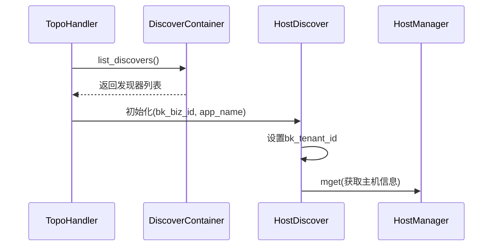
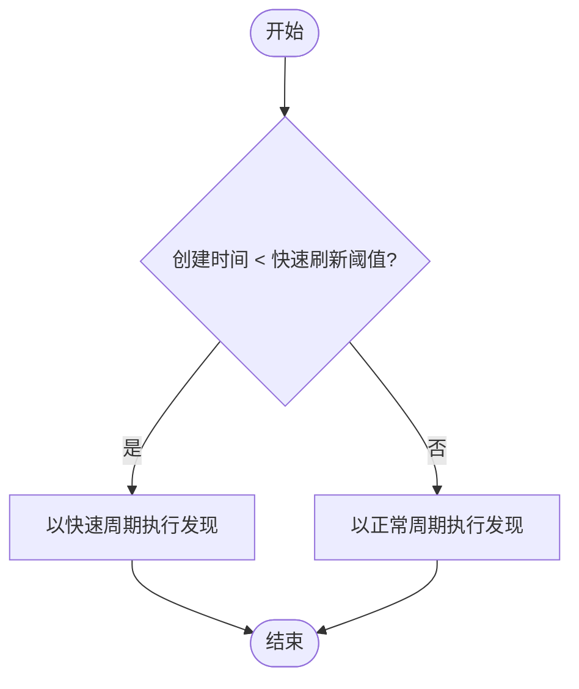
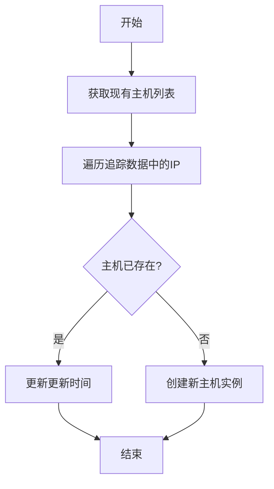
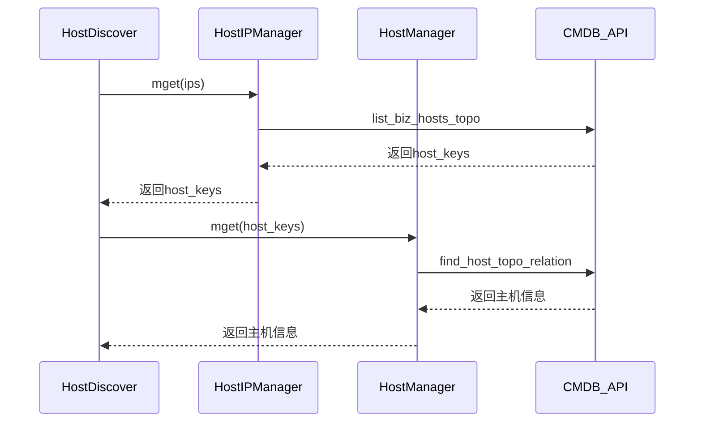
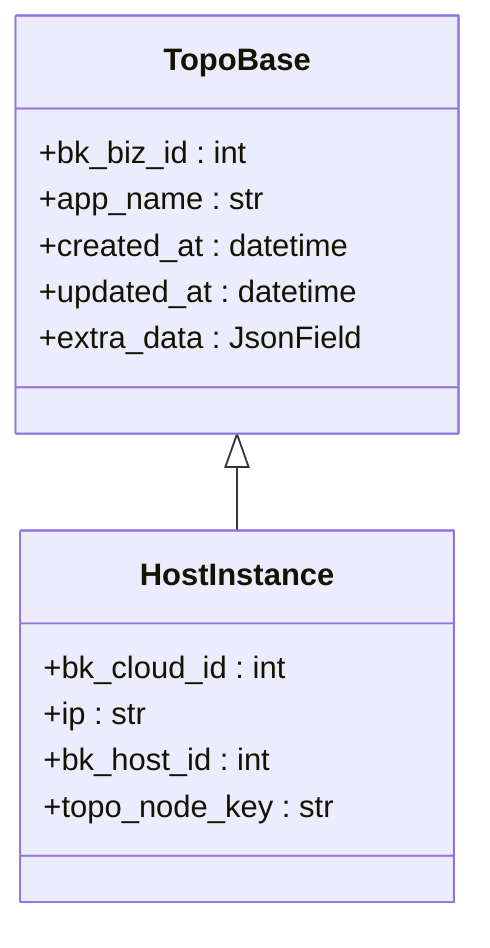

# 主机发现

<cite>
**本文档引用的文件**   
- [host.py](file://bkmonitor/apm/core/discover/host.py)
- [base.py](file://bkmonitor/apm/core/discover/base.py)
- [topo.py](file://bkmonitor/apm/models/topo.py)
- [client.py](file://bkmonitor/api/cmdb/client.py)
- [tasks.py](file://bkmonitor/apm/task/tasks.py)
</cite>

## 目录
1. [简介](#简介)
2. [核心组件](#核心组件)
3. [主机发现器初始化流程](#主机发现器初始化流程)
4. [同步周期配置](#同步周期配置)
5. [增量与全量同步策略](#增量与全量同步策略)
6. [CMDB集成与主机信息获取](#cmdb集成与主机信息获取)
7. [主机模型转换](#主机模型转换)
8. [主机状态检测机制](#主机状态检测机制)
9. [主机发现失败排查](#主机发现失败排查)
10. [性能优化建议](#性能优化建议)

## 简介
本文档详细阐述了蓝鲸监控平台中主机发现功能的实现机制。该功能通过`host.py`模块与CMDB系统深度集成，实现了对物理机和虚拟机的自动发现。文档深入分析了主机发现器的初始化流程、同步周期配置、增量与全量同步策略，以及如何通过调用`api/cmdb/`模块接口获取主机列表、业务拓扑和属性信息，并将其转换为APM系统内部的主机模型。同时，文档还描述了主机状态检测机制，包括存活探测和标签更新逻辑，并提供了主机发现失败的常见原因及排查方法，以及性能优化建议。

## 核心组件

主机发现功能的核心组件包括`HostDiscover`类，该类继承自`DiscoverBase`基类，负责实现主机发现的具体逻辑。`HostInstance`模型用于存储发现的主机实例信息，包括IP地址、云区域ID、主机ID等。`HostDiscover`类通过调用CMDB API获取主机的云区域信息，并与APM系统中的服务实例进行关联。此外，`TopoHandler`类负责协调不同类型的拓扑发现任务，包括主机发现、端点发现等。

**本节来源**
- [host.py](file://bkmonitor/apm/core/discover/host.py#L24-L104)
- [base.py](file://bkmonitor/apm/core/discover/base.py#L152-L502)
- [topo.py](file://bkmonitor/apm/models/topo.py#L126-L131)

## 主机发现器初始化流程

主机发现器的初始化流程始于`TopoHandler`类的`discover`方法。该方法首先检查数据源的有效性，然后通过`DiscoverContainer`获取所有注册的发现器，包括`HostDiscover`。在初始化`HostDiscover`实例时，会传入业务ID（bk_biz_id）和应用名称（app_name），这些信息用于后续的数据库查询和CMDB API调用。`HostDiscover`的构造函数继承自`DiscoverBase`，会自动设置`bk_tenant_id`，为多租户环境下的资源隔离提供支持。

**图表来源**
- [tasks.py](file://bkmonitor/apm/task/tasks.py#L54-L56)
- [host.py](file://bkmonitor/apm/core/discover/host.py#L24-L30)
- [base.py](file://bkmonitor/apm/core/discover/base.py#L158-L162)

**本节来源**
- [tasks.py](file://bkmonitor/apm/task/tasks.py#L54-L56)
- [host.py](file://bkmonitor/apm/core/discover/host.py#L24-L30)
- [base.py](file://bkmonitor/apm/core/discover/base.py#L158-L162)

## 同步周期配置

主机发现的同步周期由`topo_discover_cron`定时任务控制。该任务默认每10分钟执行一次，但会根据应用的创建时间动态调整。对于新创建的应用（创建时间在`APM_APPLICATION_QUICK_REFRESH_DELTA`分钟内），会以更短的周期（`APM_APPLICATION_QUICK_REFRESH_INTERVAL`分钟）进行发现，以确保新服务能快速被监控系统识别。对于已稳定运行的应用，则保持默认的10分钟周期。这种分级调度策略在保证发现及时性的同时，也避免了对系统资源的过度消耗。

**图表来源**
- [tasks.py](file://bkmonitor/apm/task/tasks.py#L60-L97)

**本节来源**
- [tasks.py](file://bkmonitor/apm/task/tasks.py#L60-L97)

## 增量与全量同步策略

主机发现采用增量同步策略。`HostDiscover`类的`discover`方法会首先调用`list_exists`方法，从数据库中查询当前已存在的主机实例，构建一个以`(bk_cloud_id, bk_host_id, ip, topo_node_key)`为键的字典。然后，遍历从追踪数据中提取的IP地址，通过`list_bk_cloud_id`方法查询这些IP对应的云区域ID和主机ID。对于在`exists_hosts`字典中找到的主机，仅更新其`updated_at`时间戳；对于未找到的主机，则创建新的`HostInstance`记录。这种方法避免了全量同步带来的性能开销，只处理发生变化的主机。

**图表来源**
- [host.py](file://bkmonitor/apm/core/discover/host.py#L39-L87)

**本节来源**
- [host.py](file://bkmonitor/apm/core/discover/host.py#L39-L87)

## CMDB集成与主机信息获取

主机发现功能通过`api/cmdb/client.py`模块与CMDB系统集成。`HostDiscover`类的`list_bk_cloud_id`方法会调用`alarm_backends.core.cache.cmdb.host.HostIPManager.mget`和`HostManager.mget`方法，这些方法底层封装了对CMDB API的调用。具体来说，会使用`ListBizHostsTopo`或`FindHostTopoRelation`等API来查询IP地址对应的主机信息，包括云区域ID（bk_cloud_id）和主机ID（bk_host_id）。这些信息对于在多云、混合云环境中准确定位主机至关重要。

**图表来源**
- [host.py](file://bkmonitor/apm/core/discover/host.py#L89-L103)
- [client.py](file://bkmonitor/api/cmdb/client.py#L266-L301)

**本节来源**
- [host.py](file://bkmonitor/apm/core/discover/host.py#L89-L103)
- [client.py](file://bkmonitor/api/cmdb/client.py#L266-L301)

## 主机模型转换

从CMDB获取的主机信息会被转换为APM系统内部的`HostInstance`模型。该模型继承自`TopoBase`，包含`bk_biz_id`、`app_name`、`created_at`、`updated_at`等基础字段，以及`bk_cloud_id`、`ip`、`bk_host_id`和`topo_node_key`等主机特有字段。在`HostDiscover`的`discover`方法中，通过`HostInstance.objects.bulk_create`批量创建新的主机实例。`topo_node_key`字段用于关联该主机所属的服务拓扑节点，实现了主机与应用服务的关联。

**图表来源**
- [topo.py](file://bkmonitor/apm/models/topo.py#L23-L131)

**本节来源**
- [topo.py](file://bkmonitor/apm/models/topo.py#L23-L131)

## 主机状态检测机制

主机状态检测主要通过更新`updated_at`时间戳来实现。当`HostDiscover`在追踪数据中发现一个已存在的主机时，会调用`HostInstance.objects.filter(id__in=need_update_instance_ids).update(updated_at=datetime.now())`来更新其最后活跃时间。这个时间戳是判断主机是否存活的关键依据。结合`clear_expired`方法，系统会定期清理超过`retention`天数未更新的主机记录，从而自动移除已下线或失联的主机。标签更新则依赖于CMDB中的最新信息，在每次发现周期中重新获取。

**本节来源**
- [host.py](file://bkmonitor/apm/core/discover/host.py#L69-L70)
- [base.py](file://bkmonitor/apm/core/discover/base.py#L232-L237)

## 主机发现失败排查

主机发现失败的常见原因及排查方法如下：

| 故障现象 | 可能原因 | 排查方法 |
| :--- | :--- | :--- |
| 无法获取主机云区域信息 | CMDB接口超时或网络不通 | 检查CMDB API的可用性，确认`BK_COMPONENT_API_URL`配置正确 |
| 主机信息不完整 | CMDB权限不足 | 确认应用使用的API密钥具有查询主机拓扑的权限 |
| 新主机无法发现 | 追踪数据中缺少`net.host.ip`属性 | 检查应用探针配置，确保正确上报了主机IP |
| 发现任务频繁失败 | 数据库连接问题 | 检查数据库连接池状态和网络延迟 |

**本节来源**
- [host.py](file://bkmonitor/apm/core/discover/host.py#L57-L65)
- [client.py](file://bkmonitor/api/cmdb/client.py#L76-L84)

## 性能优化建议

为提升主机发现功能的性能，建议采取以下优化措施：

1.  **分页查询**：在处理大规模主机列表时，应使用分页查询避免单次请求数据量过大。`HostDiscover`类中的`PAGE_LIMIT`常量（默认100）即为此目的而设。
2.  **缓存失效策略**：合理设置缓存失效时间。`HostManager`和`HostIPManager`使用了`CacheType.CC_BACKEND`和`CacheType.CC_CACHE_ALWAYS`等缓存策略，避免了对CMDB的频繁查询。
3.  **批量操作**：使用`bulk_create`和`filter(...).update()`等批量操作替代循环中的单条记录操作，显著减少数据库交互次数。
4.  **数据量控制**：通过`MAX_COUNT`常量（默认100000）限制单个应用下主机实例的最大数量，防止数据库表无限增长，并通过`clear_if_overflow`方法自动清理最旧的记录。

**本节来源**
- [host.py](file://bkmonitor/apm/core/discover/host.py#L26-L27)
- [base.py](file://bkmonitor/apm/core/discover/base.py#L225-L231)
- [client.py](file://bkmonitor/api/cmdb/client.py#L92-L93)