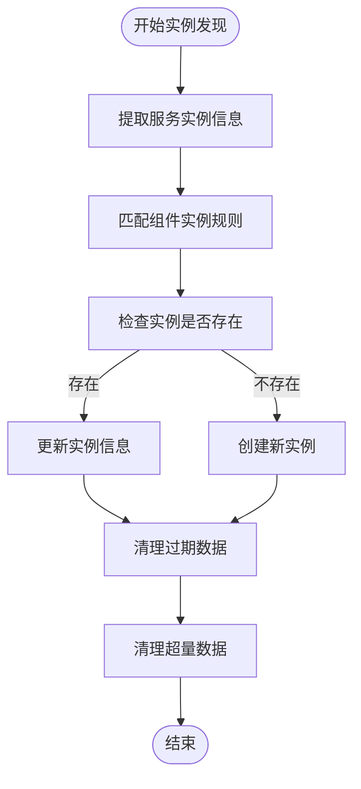
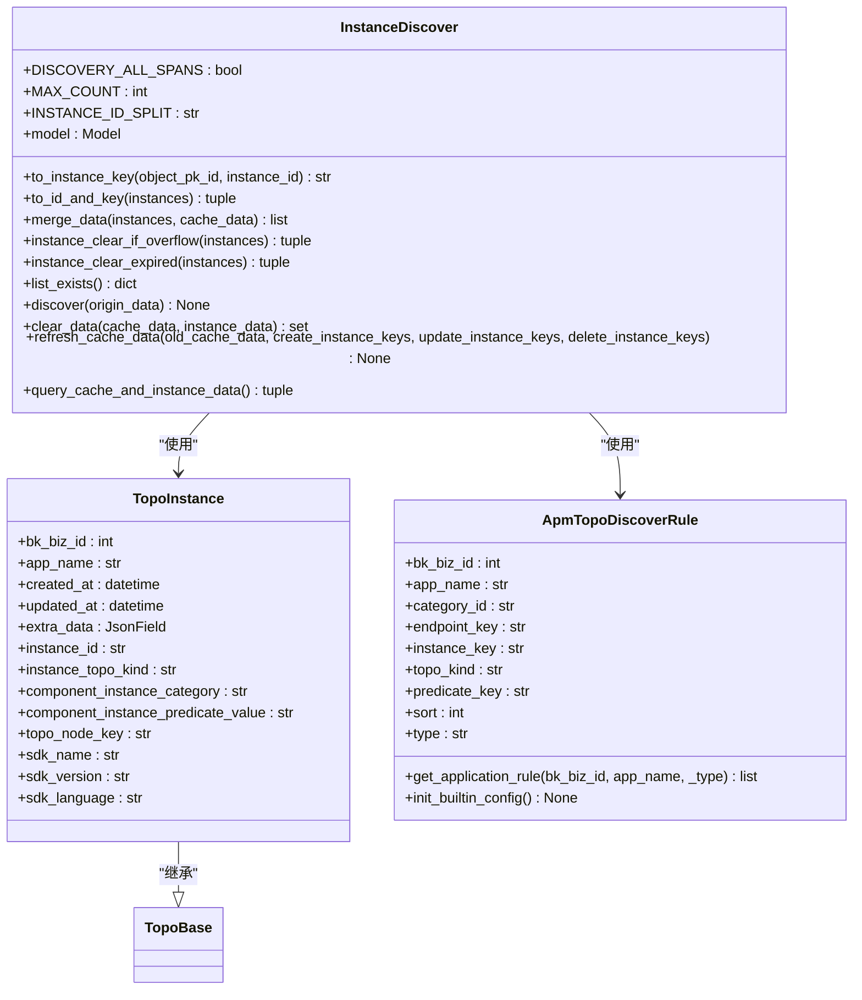
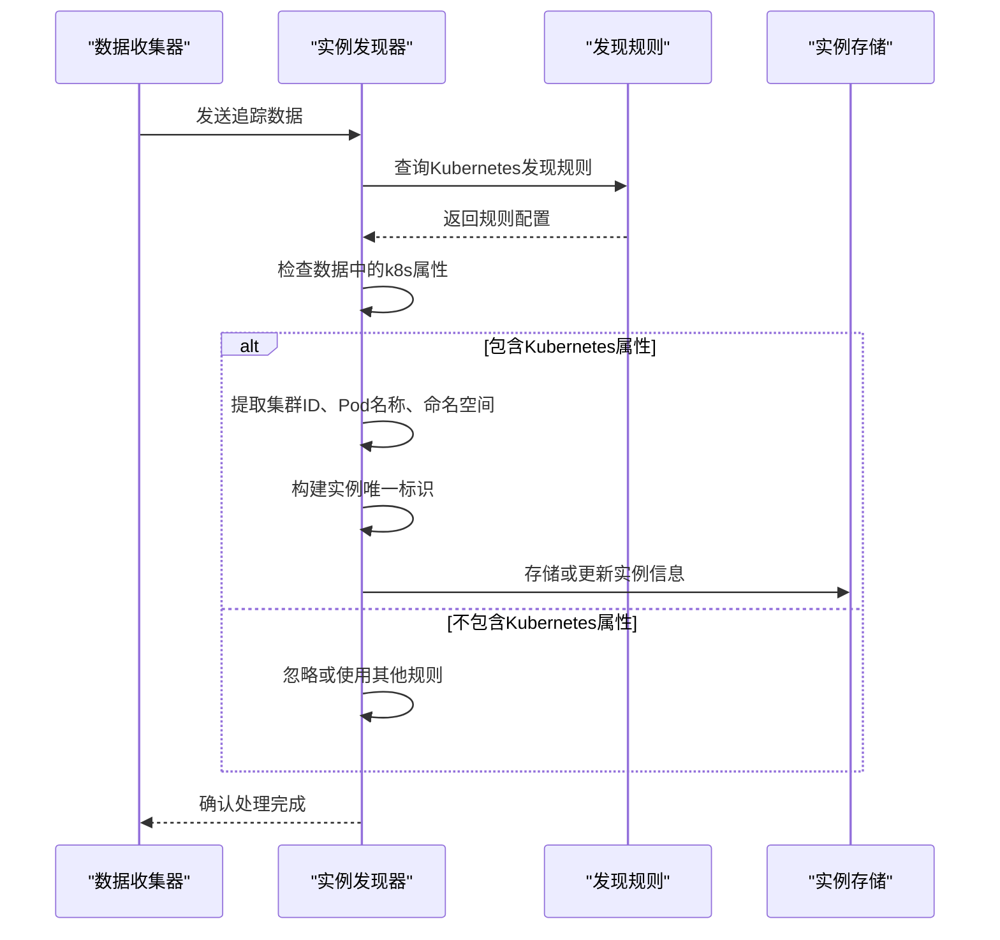
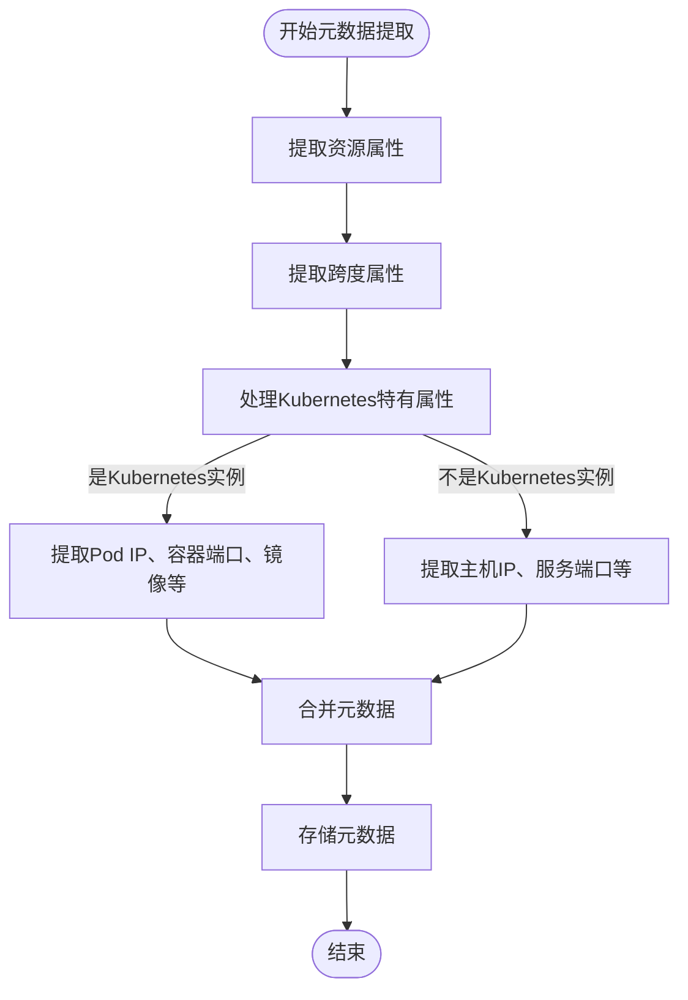
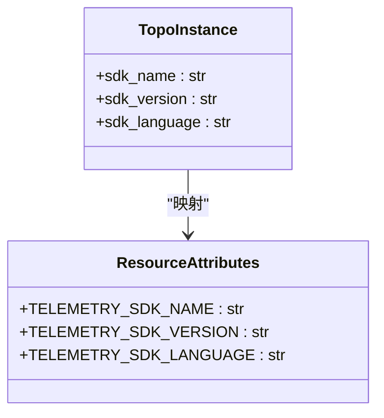
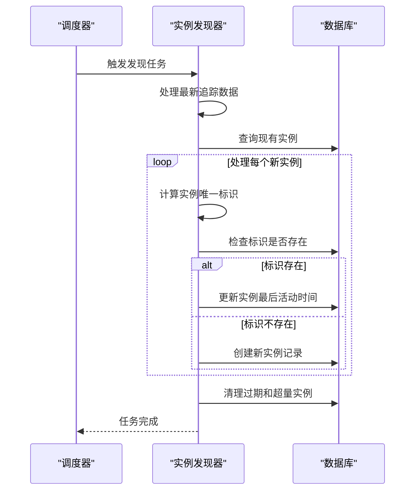
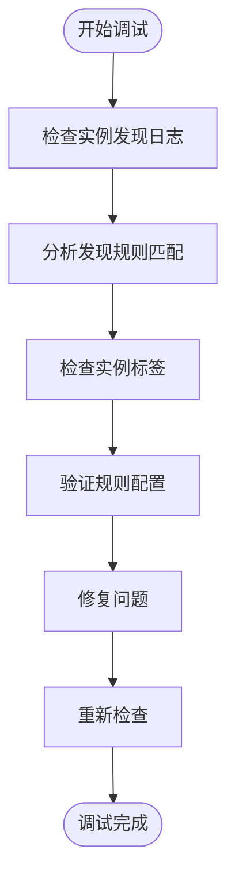

# 实例发现

<cite>
**本文档引用的文件**   
- [instance.py](file://bkmonitor/apm/core/discover/instance.py)
- [base.py](file://bkmonitor/apm/core/discover/base.py)
- [topo.py](file://bkmonitor/apm/models/topo.py)
- [config.py](file://bkmonitor/apm/models/config.py)
- [kubernetes.py](file://bkmonitor/bkmonitor/utils/kubernetes.py)
</cite>

## 目录
1. [简介](#简介)
2. [实例发现机制](#实例发现机制)
3. [核心组件分析](#核心组件分析)
4. [Kubernetes环境下的实例发现](#kubernetes环境下的实例发现)
5. [实例元数据提取](#实例元数据提取)
6. [实例与APM探针的关联](#实例与apm探针的关联)
7. [动态扩缩容处理](#动态扩缩容处理)
8. [调试与诊断](#调试与诊断)

## 简介
本系统通过OpenTelemetry协议收集应用的追踪数据，并基于这些数据自动发现和管理应用实例。实例发现功能主要通过分析追踪数据中的资源属性和跨度信息，识别出需要监控的应用实例，并将其与相应的拓扑节点关联。系统支持多种部署环境，包括Kubernetes容器编排平台和传统物理机部署，能够根据预定义的规则和标签筛选出目标实例。

**Section sources**
- [instance.py](file://bkmonitor/apm/core/discover/instance.py#L1-L288)
- [base.py](file://bkmonitor/apm/core/discover/base.py#L1-L502)

## 实例发现机制
实例发现功能的核心是`InstanceDiscover`类，它继承自`DiscoverBase`基类，负责处理追踪数据并发现新的应用实例。该机制通过监听和分析OpenTelemetry收集的跨度数据，识别出服务实例和组件实例，并将其存储在`TopoInstance`模型中。

发现过程主要包括以下几个步骤：首先，从追踪数据中提取服务实例信息，这些信息通常包含在资源属性中，如服务名称、实例ID等；其次，根据预定义的发现规则，匹配并识别出组件实例，这些规则定义了如何从跨度数据中提取组件标识；最后，将发现的实例与现有的拓扑结构进行比对，更新或创建相应的实例记录。

系统还实现了数据清理机制，包括过期数据清理和数据量超限清理。过期数据清理根据应用的保留策略，删除超过保留期限的实例数据；数据量超限清理则确保实例数据总量不超过预设的最大值，防止数据库膨胀。

**Diagram sources **
- [instance.py](file://bkmonitor/apm/core/discover/instance.py#L27-L288)
- [base.py](file://bkmonitor/apm/core/discover/base.py#L152-L502)

**Section sources**
- [instance.py](file://bkmonitor/apm/core/discover/instance.py#L27-L288)
- [base.py](file://bkmonitor/apm/core/discover/base.py#L152-L502)

## 核心组件分析
实例发现功能的核心组件包括`InstanceDiscover`、`TopoInstance`和相关的发现规则模型。`InstanceDiscover`类是实例发现的主控制器，负责协调整个发现过程。`TopoInstance`模型则用于存储发现的实例信息，包括实例ID、类型、所属拓扑节点等。

发现规则由`ApmTopoDiscoverRule`模型定义，这些规则决定了如何从追踪数据中提取实例信息。规则包括服务发现规则、组件发现规则和平台发现规则等，每种规则都有特定的匹配条件和提取逻辑。例如，Kubernetes平台的发现规则会检查资源属性中是否包含Kubernetes相关的标识，如集群ID、Pod名称等。

**Diagram sources **
- [instance.py](file://bkmonitor/apm/core/discover/instance.py#L27-L288)
- [topo.py](file://bkmonitor/apm/models/topo.py#L115-L124)
- [config.py](file://bkmonitor/apm/models/config.py#L36-L278)

**Section sources**
- [instance.py](file://bkmonitor/apm/core/discover/instance.py#L27-L288)
- [topo.py](file://bkmonitor/apm/models/topo.py#L115-L124)
- [config.py](file://bkmonitor/apm/models/config.py#L36-L278)

## Kubernetes环境下的实例发现
在Kubernetes环境中，实例发现功能通过检查追踪数据中的特定资源属性来识别Kubernetes部署的应用实例。系统使用`ApmTopoDiscoverRule`模型中的平台发现规则，特别是针对Kubernetes的规则，来匹配和发现实例。

Kubernetes发现规则主要检查三个关键属性：`k8s.bcs.cluster.id`（BCS集群ID）、`k8s.pod.name`（Pod名称）和`k8s.namespace.name`（命名空间名称）。当追踪数据中包含这些属性时，系统会将其识别为Kubernetes部署的实例，并根据这些信息构建实例的唯一标识。

**Diagram sources **
- [config.py](file://bkmonitor/apm/models/config.py#L66-L95)
- [kubernetes.py](file://bkmonitor/bkmonitor/utils/kubernetes.py#L127-L129)

**Section sources**
- [config.py](file://bkmonitor/apm/models/config.py#L66-L95)
- [kubernetes.py](file://bkmonitor/bkmonitor/utils/kubernetes.py#L127-L129)

## 实例元数据提取
实例元数据的提取是实例发现过程中的关键环节，系统从追踪数据的资源属性和跨度属性中提取各种元数据信息。这些元数据包括容器IP、端口、镜像信息和启动命令等，为后续的监控和分析提供基础数据。

元数据提取主要通过`extract_field_value`函数实现，该函数根据预定义的键路径从数据结构中提取相应的值。对于Kubernetes环境，系统会提取Pod的IP地址、容器端口、镜像名称等信息；对于其他环境，则提取相应的主机IP、服务端口等信息。

**Diagram sources **
- [base.py](file://bkmonitor/apm/core/discover/base.py#L87-L93)
- [kubernetes.py](file://bkmonitor/bkmonitor/utils/kubernetes.py#L528-L710)

**Section sources**
- [base.py](file://bkmonitor/apm/core/discover/base.py#L87-L93)
- [kubernetes.py](file://bkmonitor/bkmonitor/utils/kubernetes.py#L528-L710)

## 实例与APM探针的关联
实例与APM探针的关联是通过分析追踪数据中的SDK信息实现的。系统从资源属性中提取探针的名称、版本和语言等信息，并将其与发现的实例关联起来。这些信息对于故障排查和性能分析非常重要，可以帮助运维人员快速定位问题。

关联过程在`InstanceDiscover`类的`discover`方法中实现。当发现新的实例时，系统会从追踪数据中提取`telemetry.sdk.name`、`telemetry.sdk.version`和`telemetry.sdk.language`等属性，并将这些信息存储在`TopoInstance`模型的相应字段中。这样，每个实例都与其使用的APM探针信息关联起来。

**Diagram sources **
- [instance.py](file://bkmonitor/apm/core/discover/instance.py#L127-L240)
- [topo.py](file://bkmonitor/apm/models/topo.py#L121-L123)

**Section sources**
- [instance.py](file://bkmonitor/apm/core/discover/instance.py#L127-L240)
- [topo.py](file://bkmonitor/apm/models/topo.py#L121-L123)

## 动态扩缩容处理
系统通过定期执行实例发现任务来处理应用的动态扩缩容。当应用实例发生增加或减少时，新的追踪数据会反映这些变化，实例发现器会在下一次发现周期中识别并处理这些变化。

处理动态扩缩容的关键是实例的唯一标识和更新机制。每个实例都有一个基于其属性构建的唯一标识，当发现器处理新的追踪数据时，会检查这个标识是否已存在。如果不存在，则创建新的实例记录；如果存在，则更新其最后活动时间。通过这种方式，系统可以准确地跟踪实例的生命周期。

**Diagram sources **
- [instance.py](file://bkmonitor/apm/core/discover/instance.py#L107-L135)
- [base.py](file://bkmonitor/apm/core/discover/base.py#L225-L238)

**Section sources**
- [instance.py](file://bkmonitor/apm/core/discover/instance.py#L107-L135)
- [base.py](file://bkmonitor/apm/core/discover/base.py#L225-L238)

## 调试与诊断
实例发现功能提供了多种调试和诊断方法，帮助运维人员排查问题。主要的调试方法包括查看事件监听日志和诊断标签匹配问题。

系统在执行实例发现任务时会生成详细的日志，记录发现过程中的关键步骤和决策。这些日志可以帮助分析发现器是否正常工作，以及为什么某些实例没有被正确发现。日志中包含了规则匹配结果、实例创建和更新操作等信息。

对于标签匹配问题，系统提供了规则匹配的调试信息。当某个实例未能被正确匹配时，可以通过检查规则配置和实例属性，分析匹配失败的原因。常见的问题包括标签名称拼写错误、标签值格式不匹配等。

**Diagram sources **
- [instance.py](file://bkmonitor/apm/core/discover/instance.py#L136-L240)
- [base.py](file://bkmonitor/apm/core/discover/base.py#L218-L223)

**Section sources**
- [instance.py](file://bkmonitor/apm/core/discover/instance.py#L136-L240)
- [base.py](file://bkmonitor/apm/core/discover/base.py#L218-L223)