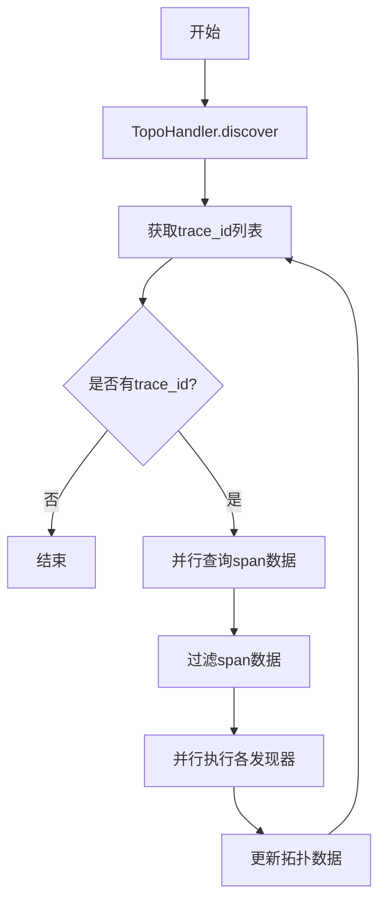
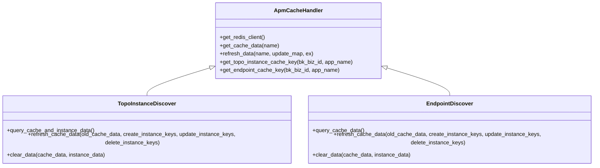
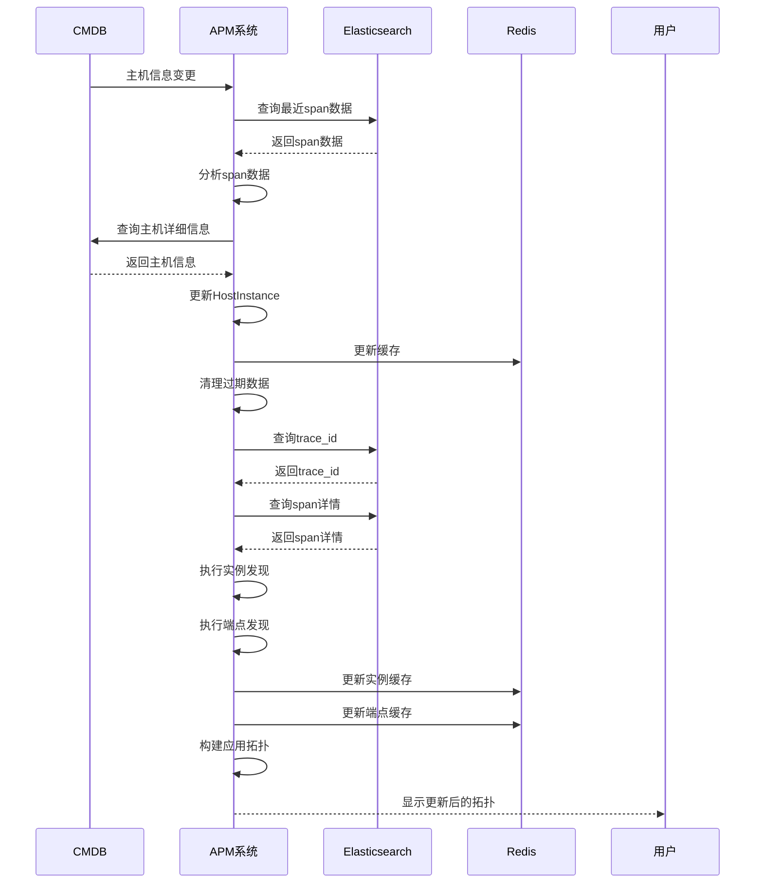

# 服务发现机制

<cite>
**本文档引用的文件**
- [host.py](file://bkmonitor/apm/core/discover/host.py)
- [instance.py](file://bkmonitor/apm/core/discover/instance.py)
- [endpoint.py](file://bkmonitor/apm/core/discover/endpoint.py)
- [base.py](file://bkmonitor/apm/core/discover/base.py)
- [topo.py](file://bkmonitor/apm/models/topo.py)
- [application.py](file://bkmonitor/apm/models/application.py)
- [apm_cache_handler.py](file://bkmonitor/apm/core/handlers/apm_cache_handler.py)
- [constants.py](file://bkmonitor/apm/constants.py)
</cite>

## 目录
1. [引言](#引言)
2. [核心发现器工作流程](#核心发现器工作流程)
3. [发现任务调度机制](#发现任务调度机制)
4. [缓存策略与数据一致性](#缓存策略与数据一致性)
5. [服务发现时序图](#服务发现时序图)

## 引言
服务发现机制是APM系统的核心组件，负责自动发现监控目标并构建应用拓扑。该机制通过三个核心发现器（host.py、instance.py、endpoint.py）实现对主机、应用实例和服务端点的自动发现。系统从CMDB同步主机信息，识别容器化环境中的应用实例，并解析分布式调用链中的服务端点，最终构建完整的应用拓扑结构。

## 核心发现器工作流程

### 主机发现器 (host.py)
主机发现器负责从CMDB同步主机信息。它通过分析OpenTelemetry SDK上报的span数据，提取`resource.net.host.ip`字段来发现主机IP。发现器首先查询已存在的主机实例，然后尝试通过IP地址获取对应的云区域ID和主机ID。对于新发现的主机，系统会创建新的HostInstance记录；对于已存在的主机，则更新其更新时间戳。该过程确保了主机信息的准确性和时效性。

**Section sources**
- [host.py](file://bkmonitor/apm/core/discover/host.py#L24-L104)

### 实例发现器 (instance.py)
实例发现器负责识别容器化环境中的应用实例。它通过分析span数据中的`resource.bk.instance.id`字段来发现服务实例，并通过预定义的拓扑发现规则来识别组件实例。发现器首先查询已存在的实例，然后根据规则匹配来确定需要更新或创建的实例。系统实现了数据量溢出和过期数据的清理机制，确保实例数据的合理规模和时效性。此外，发现器还通过Redis缓存来优化性能，减少数据库查询压力。

**Section sources**
- [instance.py](file://bkmonitor/apm/core/discover/instance.py#L28-L288)

### 端点发现器 (endpoint.py)
端点发现器负责解析分布式调用链中的服务端点。它根据发现规则中的endpoint_key从span数据中提取端点名称，并结合服务名称、分类ID等信息来识别服务接口。发现器支持普通接口和自定义服务接口的发现，能够处理peer_service等特殊字段。系统通过六元组（span_kind、category_kind_value、category_kind_key、category_id、service_name、endpoint_name）生成唯一键值，确保端点的唯一性。同时，发现器实现了重复数据清理机制，保证数据的一致性。

**Section sources**
- [endpoint.py](file://bkmonitor/apm/core/discover/endpoint.py#L30-L307)

## 发现任务调度机制
服务发现任务通过TopoHandler类进行调度管理。系统采用定时轮询与事件驱动相结合的调度机制。TopoHandler定期从Elasticsearch中获取最近10分钟内的trace_id，然后批量查询对应的span数据。任务调度考虑了ES的最大结果窗口限制，动态调整每轮处理的trace_id数量，防止查询超限。系统使用线程池并行处理多个发现器的任务，提高处理效率。对于需要处理所有span数据的发现器（如host、instance），系统会传递完整的span列表；而对于只需要特定类型span的发现器（如endpoint、relation），系统会先过滤出符合条件的span再进行处理。

**Diagram sources**
- [base.py](file://bkmonitor/apm/core/discover/base.py#L267-L502)

## 缓存策略与数据一致性
系统采用Redis缓存来优化服务发现的性能和数据一致性。每个发现器在处理数据时，会同时维护数据库和缓存中的数据。对于实例发现器和端点发现器，系统使用专门的缓存键（如APM_TOPO_INSTANCE、APM_ENDPOINT）来存储实例和端点的更新时间戳。当发现新实例或端点时，系统会同时在数据库中创建记录并在缓存中更新对应的时间戳。对于过期或溢出的数据，系统会同步清理数据库记录和缓存条目，确保数据的一致性。缓存的过期时间设置为7天，与数据保留策略相匹配。

**Diagram sources**
- [apm_cache_handler.py](file://bkmonitor/apm/core/handlers/apm_cache_handler.py#L19-L153)
- [instance.py](file://bkmonitor/apm/core/discover/instance.py#L28-L288)
- [endpoint.py](file://bkmonitor/apm/core/discover/endpoint.py#L30-L307)

## 服务发现时序图
以下时序图展示了从配置变更到拓扑更新的完整流程：

**Diagram sources**
- [host.py](file://bkmonitor/apm/core/discover/host.py#L24-L104)
- [instance.py](file://bkmonitor/apm/core/discover/instance.py#L28-L288)
- [endpoint.py](file://bkmonitor/apm/core/discover/endpoint.py#L30-L307)
- [base.py](file://bkmonitor/apm/core/discover/base.py#L267-L502)