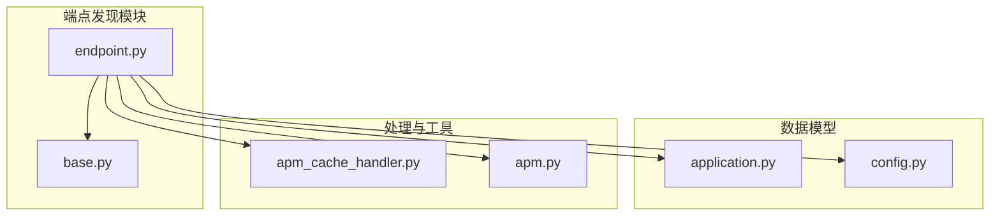
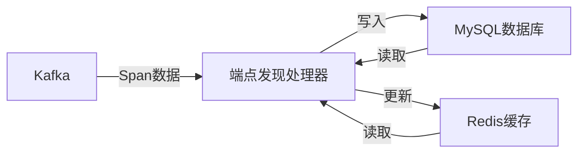
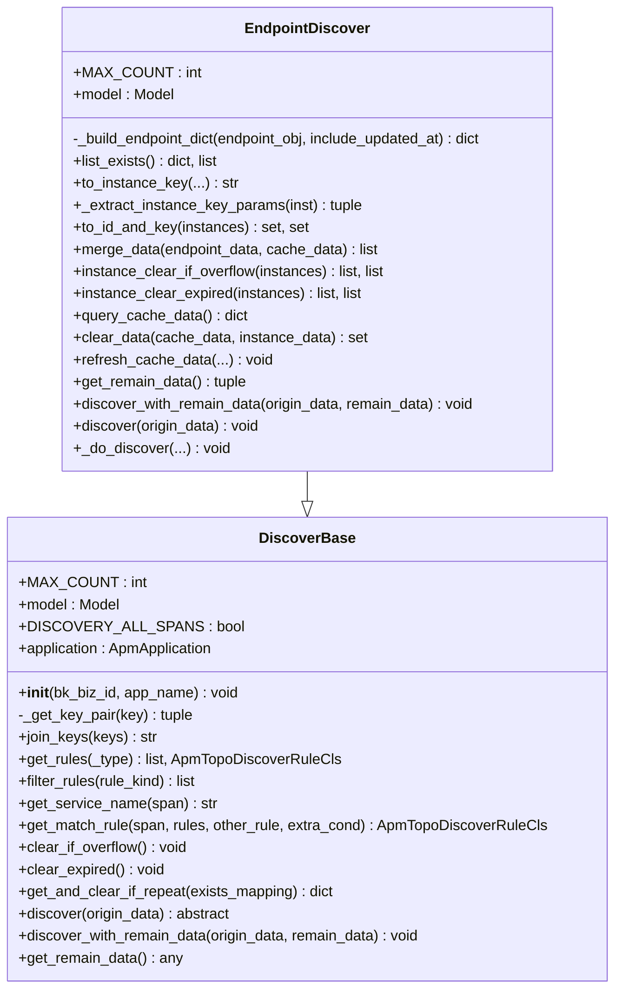
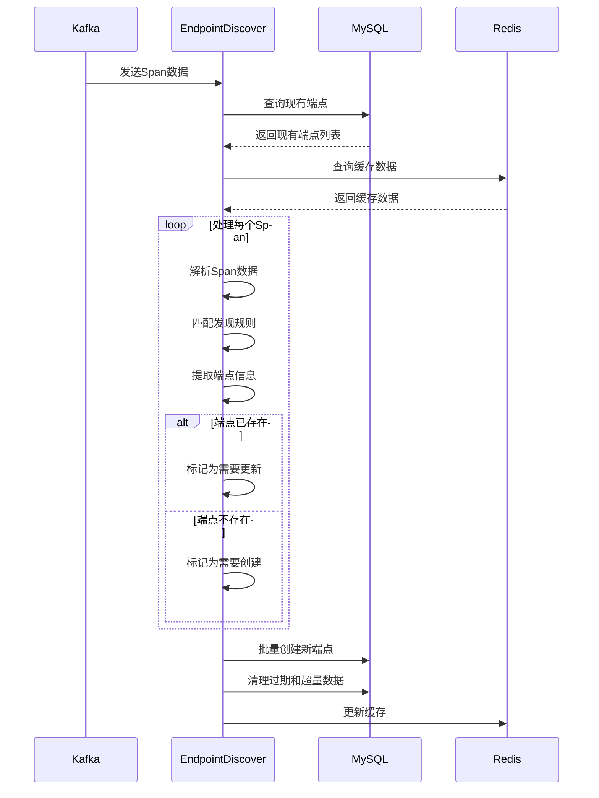
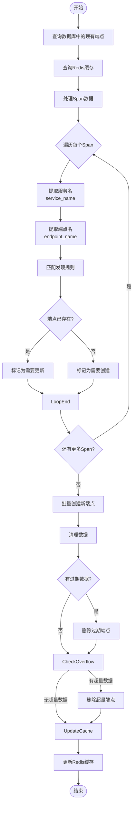
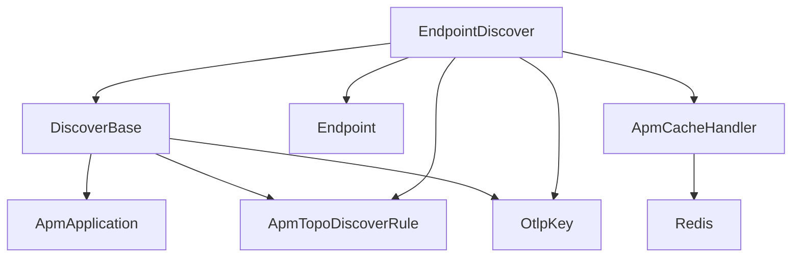

# 端点发现

<cite>
**本文档引用的文件**   
- [endpoint.py](file://bkmonitor/apm/core/discover/endpoint.py)
- [base.py](file://bkmonitor/apm/core/discover/base.py)
- [application.py](file://bkmonitor/apm/models/application.py)
- [config.py](file://bkmonitor/apm/models/config.py)
- [apm_cache_handler.py](file://bkmonitor/apm/core/handlers/apm_cache_handler.py)
- [apm.py](file://bkmonitor/constants/apm.py)
</cite>

## 目录
1. [简介](#简介)
2. [项目结构](#项目结构)
3. [核心组件](#核心组件)
4. [架构概述](#架构概述)
5. [详细组件分析](#详细组件分析)
6. [依赖分析](#依赖分析)
7. [性能考虑](#性能考虑)
8. [故障排除指南](#故障排除指南)
9. [结论](#结论)

## 简介
本文档详细阐述了蓝鲸监控平台（BlueKing - Monitor）中端点发现功能的实现机制。该功能通过分析分布式追踪数据，自动发现和管理服务端点（Endpoints），为生成调用链拓扑图提供关键数据支持。

## 项目结构
端点发现功能主要位于`bkmonitor/apm/core/discover/`目录下，其核心逻辑由`endpoint.py`模块实现。该模块依赖于`base.py`中的基类、`models`中的数据模型以及`handlers`中的缓存处理机制。

**图示来源**
- [endpoint.py](file://bkmonitor/apm/core/discover/endpoint.py#L1-L307)
- [base.py](file://bkmonitor/apm/core/discover/base.py#L1-L502)
- [application.py](file://bkmonitor/apm/models/application.py#L304-L318)
- [config.py](file://bkmonitor/apm/models/config.py#L35-L229)
- [apm_cache_handler.py](file://bkmonitor/apm/core/handlers/apm_cache_handler.py#L18-L153)

**章节来源**
- [endpoint.py](file://bkmonitor/apm/core/discover/endpoint.py#L1-L307)
- [base.py](file://bkmonitor/apm/core/discover/base.py#L1-L502)

## 核心组件
端点发现功能的核心是`EndpointDiscover`类，它继承自`DiscoverBase`基类，负责从Kafka消费的Span数据中提取服务和端点信息，并将其持久化到数据库中。该功能还利用Redis缓存来提高性能和处理数据过期。

**章节来源**
- [endpoint.py](file://bkmonitor/apm/core/discover/endpoint.py#L30-L307)
- [base.py](file://bkmonitor/apm/core/discover/base.py#L152-L265)

## 架构概述
端点发现功能的架构主要包括数据输入、处理逻辑、存储和缓存四个部分。系统从Kafka消费Span数据，经过处理后将端点信息存储到MySQL数据库，并使用Redis缓存来记录端点的最后更新时间。

**图示来源**
- [endpoint.py](file://bkmonitor/apm/core/discover/endpoint.py#L231-L307)
- [apm_cache_handler.py](file://bkmonitor/apm/core/handlers/apm_cache_handler.py#L42-L70)

## 详细组件分析

### 端点发现分析
`EndpointDiscover`类是端点发现功能的核心，它实现了从Span数据中提取端点信息的完整流程。

#### 对象导向组件

**图示来源**
- [endpoint.py](file://bkmonitor/apm/core/discover/endpoint.py#L30-L307)
- [base.py](file://bkmonitor/apm/core/discover/base.py#L152-L265)

#### 服务组件

**图示来源**
- [endpoint.py](file://bkmonitor/apm/core/discover/endpoint.py#L231-L307)
- [base.py](file://bkmonitor/apm/core/discover/base.py#L180-L224)

#### 复杂逻辑组件

**图示来源**
- [endpoint.py](file://bkmonitor/apm/core/discover/endpoint.py#L220-L307)
- [base.py](file://bkmonitor/apm/core/discover/base.py#L180-L224)

**章节来源**
- [endpoint.py](file://bkmonitor/apm/core/discover/endpoint.py#L1-L307)
- [base.py](file://bkmonitor/apm/core/discover/base.py#L1-L502)

## 依赖分析
端点发现功能依赖于多个核心组件，包括数据模型、缓存处理、常量定义和基类功能。

**图示来源**
- [endpoint.py](file://bkmonitor/apm/core/discover/endpoint.py#L18-L27)
- [base.py](file://bkmonitor/apm/core/discover/base.py#L27-L32)
- [apm_cache_handler.py](file://bkmonitor/apm/core/handlers/apm_cache_handler.py#L18-L153)

## 性能考虑
端点发现功能在设计时考虑了多项性能优化措施：
1. 使用Redis缓存来避免频繁的数据库查询
2. 实现了数据清理机制，防止数据库和缓存无限增长
3. 采用批量操作来减少数据库交互次数
4. 通过分布式锁防止并发冲突

## 故障排除指南
当端点发现功能出现问题时，可以检查以下方面：
1. Kafka数据流是否正常
2. Redis缓存是否可用
3. MySQL数据库连接是否正常
4. 发现规则配置是否正确
5. 日志中是否有相关错误信息

**章节来源**
- [endpoint.py](file://bkmonitor/apm/core/discover/endpoint.py#L291-L293)
- [apm_cache_handler.py](file://bkmonitor/apm/core/handlers/apm_cache_handler.py#L42-L49)
- [base.py](file://bkmonitor/apm/core/discover/base.py#L439-L449)

## 结论
端点发现功能是蓝鲸监控平台分布式追踪系统的核心组件之一。它通过自动化的方式从Span数据中提取服务和端点信息，为生成调用链拓扑图提供了基础数据支持。该功能设计合理，具有良好的性能和可扩展性。