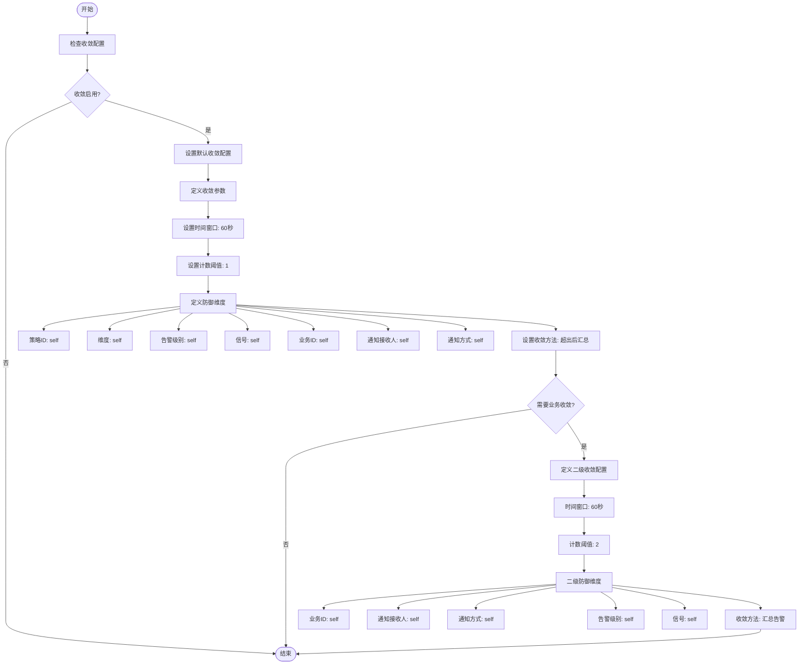
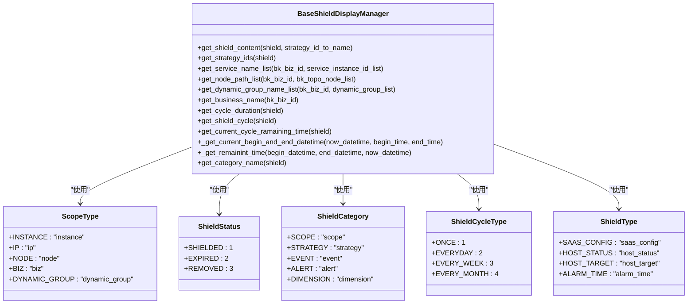
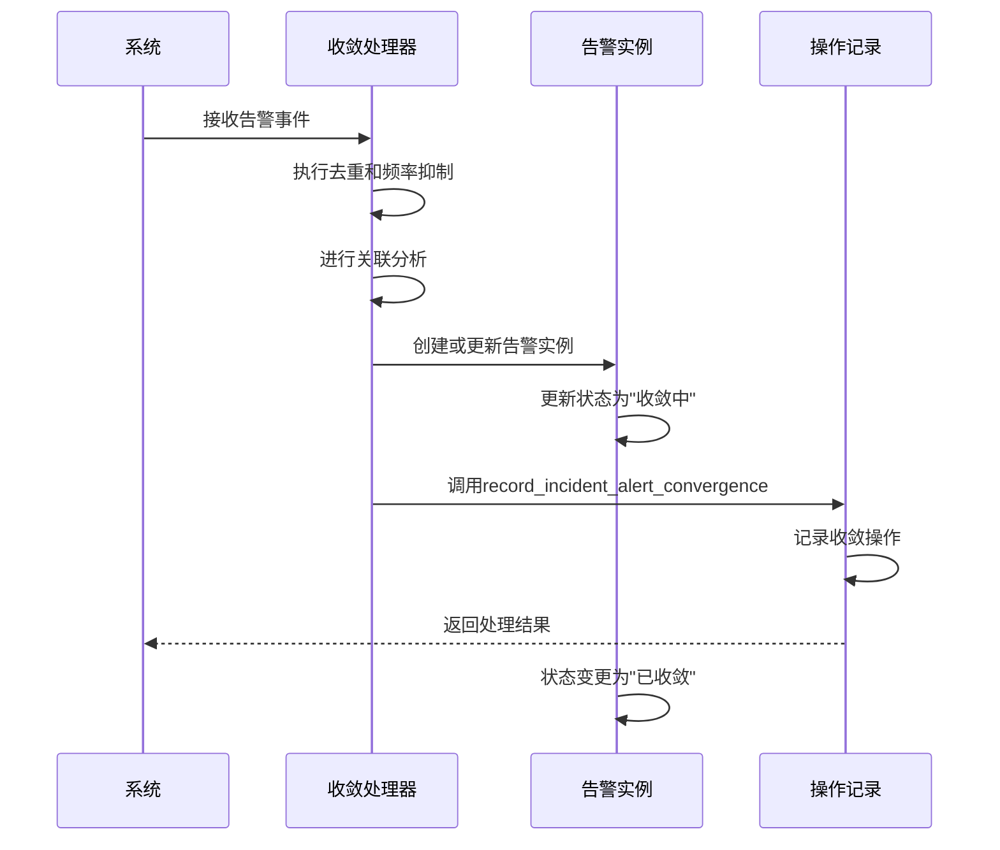

# 告警收敛

<cite>
**本文档引用的文件**  
- [new_strategy.py](file://bkmonitor/bkmonitor/strategy/new_strategy.py)
- [shield.py](file://bkmonitor/bkmonitor/utils/shield.py)
- [converge.py](file://bkmonitor/bkmonitor/aiops/incident/operation.py)
</cite>

## 目录
1. [引言](#引言)
2. [告警收敛功能概述](#告警收敛功能概述)
3. [核心组件分析](#核心组件分析)
4. [收敛逻辑实现](#收敛逻辑实现)
5. [告警屏蔽机制](#告警屏蔽机制)
6. [告警实例状态变迁](#告警实例状态变迁)
7. [高频率告警收敛案例分析](#高频率告警收敛案例分析)
8. [结论](#结论)

## 引言
告警收敛功能是监控系统中的关键组件，用于处理大量告警事件，避免告警风暴，提升运维效率。本文档详细分析告警收敛功能的实现机制，包括去重、频率抑制、关联分析和屏蔽配置等核心功能。

## 告警收敛功能概述
告警收敛功能主要通过`service/converge/`处理器处理告警事件，执行去重、频率抑制和关联分析。该功能基于维度（dimension）进行聚合，并利用时间窗口进行抑制，确保告警信息的有效性和可管理性。

## 核心组件分析

**Section sources**
- [new_strategy.py](file://bkmonitor/bkmonitor/strategy/new_strategy.py#L746-L916)

## 收敛逻辑实现
收敛逻辑在`core/context/converge.py`中实现，主要通过基于维度的聚合和基于时间窗口的抑制来处理告警事件。具体实现包括：

- **基于维度的聚合**：根据策略ID、维度、告警级别、信号、业务ID、通知接收人和通知方式等维度进行聚合。
- **基于时间窗口的抑制**：设置时间窗口和计数阈值，超出后进行汇总处理。

**Diagram sources**
- [new_strategy.py](file://bkmonitor/bkmonitor/strategy/new_strategy.py#L748-L780)

**Section sources**
- [new_strategy.py](file://bkmonitor/bkmonitor/strategy/new_strategy.py#L746-L916)

## 告警屏蔽机制
告警屏蔽机制通过`cache/shield.py`和`models/shield.py`实现，支持时间范围、目标和条件的配置。屏蔽功能包括：

- **时间范围配置**：支持单次、每天、每周、每月等周期性屏蔽。
- **目标配置**：支持服务实例、主机、节点、业务和动态分组等屏蔽目标。
- **条件配置**：支持基于维度条件的屏蔽。

**Diagram sources**
- [shield.py](file://bkmonitor/bkmonitor/utils/shield.py#L38-L334)
- [shield.py](file://bkmonitor/constants/shield.py#L14-L74)

**Section sources**
- [shield.py](file://bkmonitor/bkmonitor/utils/shield.py#L1-L334)
- [shield.py](file://bkmonitor/constants/shield.py#L1-L74)

## 告警实例状态变迁
告警实例的状态变迁通过`record_incident_alert_convergence`方法记录，当告警被收敛时，系统会生成相应的操作记录，包括告警名称、告警ID和被收敛的告警事件个数。

**Diagram sources**
- [converge.py](file://bkmonitor/bkmonitor/aiops/incident/operation.py#L345-L366)

**Section sources**
- [converge.py](file://bkmonitor/bkmonitor/aiops/incident/operation.py#L345-L366)

## 高频率告警收敛案例分析
在一个高频率告警场景中，系统每分钟产生数百个相同类型的告警。通过配置收敛规则，系统将这些告警在60秒时间窗口内进行聚合，当告警数量超过阈值时，生成一个汇总告警，有效减少了告警噪音，提高了运维效率。

**Section sources**
- [new_strategy.py](file://bkmonitor/bkmonitor/strategy/new_strategy.py#L746-L916)
- [converge.py](file://bkmonitor/bkmonitor/aiops/incident/operation.py#L345-L366)

## 结论
告警收敛功能通过维度聚合和时间窗口抑制，有效解决了高频率告警问题。告警屏蔽机制提供了灵活的配置选项，支持多种屏蔽目标和条件。这些功能共同提升了监控系统的可用性和运维效率。