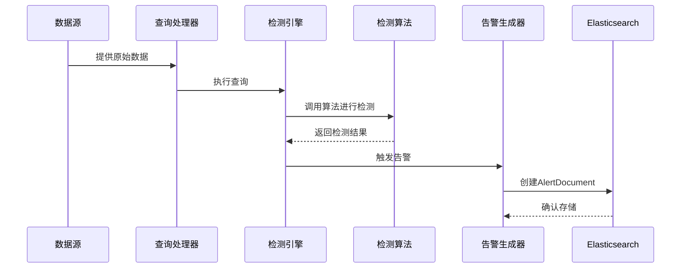
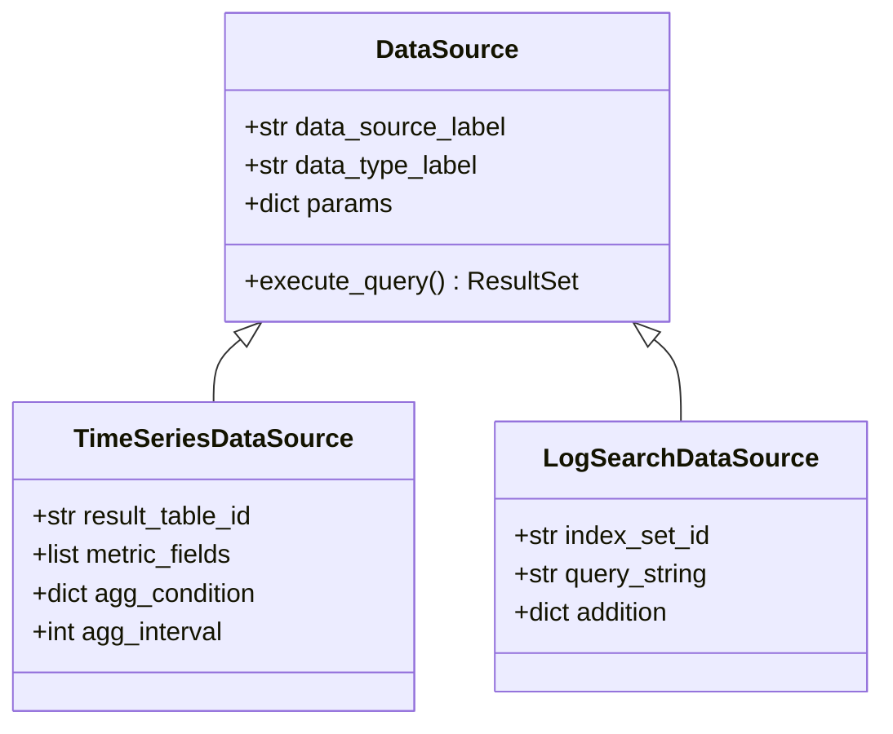
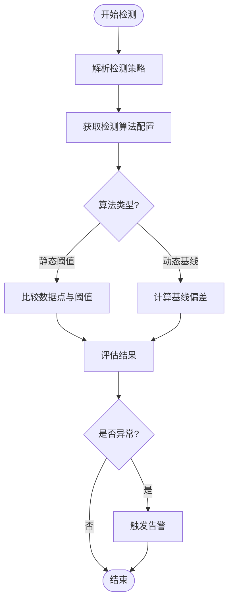
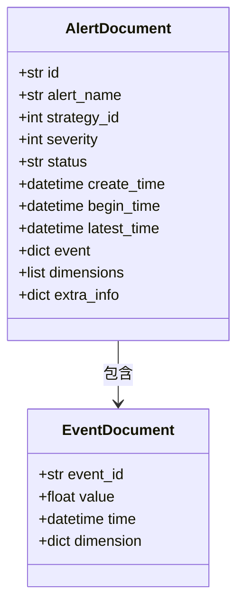
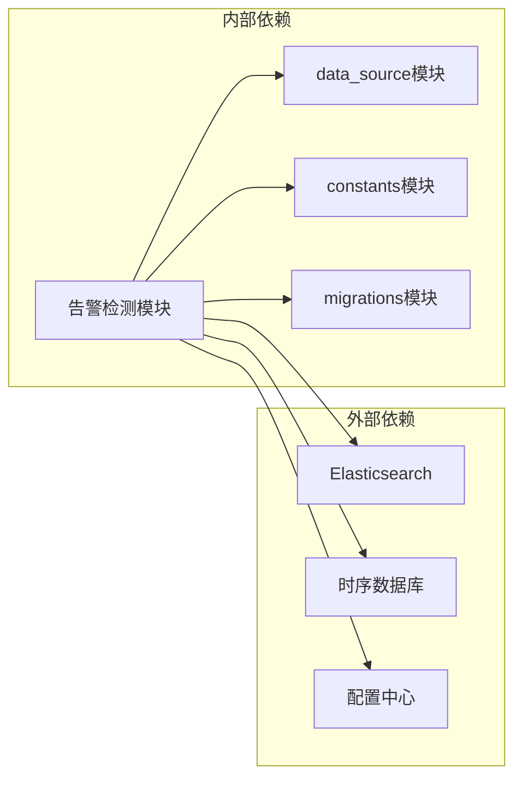

# 告警检测

<cite>
**本文档中引用的文件**  
- [alert.py](file://bkmonitor/bkmonitor/documents/alert.py)
- [alert.py](file://constants/alert.py)
- [0019_detectalgorithm_algorithm_unit.py](file://bkmonitor/bkmonitor/migrations/0019_detectalgorithm_algorithm_unit.py)
- [strategy.py](file://bkmonitor/bkmonitor/strategy/strategy.py)
- [new_strategy.py](file://bkmonitor/bkmonitor/strategy/new_strategy.py)
- [expression.py](file://bkmonitor/bkmonitor/strategy/expression.py)
- [data_source.py](file://bkmonitor/bkmonitor/data_source/models/data_structure.py)
- [handler.py](file://bkmonitor/bkmonitor/data_source/handler/time_series.py)
- [detect.py](file://bkmonitor/bkmonitor/dataflow/task/intelligent_detect.py)
- [tasks.py](file://bkmonitor/bkmonitor/documents/tasks.py)
</cite>

## 目录
1. [简介](#简介)
2. [项目结构](#项目结构)
3. [核心组件](#核心组件)
4. [架构概述](#架构概述)
5. [详细组件分析](#详细组件分析)
6. [依赖分析](#依赖分析)
7. [性能考虑](#性能考虑)
8. [故障排除指南](#故障排除指南)
9. [结论](#结论)

## 简介
本文档详细阐述了蓝鲸监控平台中的告警检测模块。重点分析了数据从采集到触发告警的完整流程，包括数据源接口、检测算法实现、异常判定逻辑以及告警事件生成机制。文档还解释了静态阈值与动态基线等不同检测算法的实现路径和配置方式，并提供了一个完整的时序图来展示从数据点到达触发告警的全过程。

## 项目结构
告警检测模块主要分布在`bkmonitor`应用下的多个子模块中。核心逻辑分散在`strategy`、`data_source`、`documents`和`migrations`等目录中。`strategy`模块负责检测策略和算法的定义与执行；`data_source`模块为检测引擎提供统一的数据查询接口；`documents`模块定义了告警和事件的文档结构；而`migrations`则记录了检测相关模型的演进过程。

```mermaid
graph TD
subgraph "告警检测模块"
DS[数据源模块<br/>data_source/]
ST[策略模块<br/>strategy/]
AL[告警文档<br/>documents/alert.py]
MIG[迁移脚本<br/>migrations/]
end
DS --> ST : 提供数据查询
ST --> AL : 生成告警
MIG --> ST : 定义模型结构
MIG --> AL : 定义文档结构
```

**Diagram sources**
- [data_source.py](file://bkmonitor/bkmonitor/data_source/models/data_structure.py)
- [strategy.py](file://bkmonitor/bkmonitor/strategy/strategy.py)
- [alert.py](file://bkmonitor/bkmonitor/documents/alert.py)
- [0019_detectalgorithm_algorithm_unit.py](file://bkmonitor/bkmonitor/migrations/0019_detectalgorithm_algorithm_unit.py)

**Section sources**
- [data_source.py](file://bkmonitor/bkmonitor/data_source/models/data_structure.py)
- [strategy.py](file://bkmonitor/bkmonitor/strategy/strategy.py)

## 核心组件
告警检测系统的核心组件包括数据源适配器、检测策略引擎、检测算法实现和告警事件生成器。数据源适配器通过统一的接口抽象不同数据源的查询方式；检测策略引擎负责解析和执行复杂的检测逻辑；检测算法实现了静态阈值、动态基线等多种异常判定方法；告警事件生成器则将检测结果转化为标准化的告警事件。

**Section sources**
- [handler.py](file://bkmonitor/bkmonitor/data_source/handler/time_series.py)
- [strategy.py](file://bkmonitor/bkmonitor/strategy/strategy.py)
- [alert.py](file://bkmonitor/bkmonitor/documents/alert.py)

## 架构概述
告警检测系统的整体架构遵循数据流驱动的设计模式。原始数据通过`data_source`模块提供的接口被`strategy`模块的检测引擎获取。检测引擎根据预设的策略调用相应的检测算法进行异常分析。一旦发现异常，系统会创建一个`AlertDocument`实例，该实例封装了告警的所有必要信息，并最终持久化到Elasticsearch中。



**Diagram sources**
- [handler.py](file://bkmonitor/bkmonitor/data_source/handler/time_series.py)
- [strategy.py](file://bkmonitor/bkmonitor/strategy/strategy.py)
- [alert.py](file://bkmonitor/bkmonitor/documents/alert.py)

## 详细组件分析

### 数据源模块分析
`data_source`模块为上层的检测引擎提供了统一的数据查询接口。它通过后端适配器（如`time_series`、`log_search`等）屏蔽了底层不同数据存储（如时序数据库、日志系统）的差异。检测引擎无需关心数据的具体来源，只需通过`data_source`提供的API即可获取所需数据。



**Diagram sources**
- [data_source.py](file://bkmonitor/bkmonitor/data_source/models/data_structure.py)
- [handler.py](file://bkmonitor/bkmonitor/data_source/handler/time_series.py)

**Section sources**
- [data_source.py](file://bkmonitor/bkmonitor/data_source/models/data_structure.py)
- [handler.py](file://bkmonitor/bkmonitor/data_source/handler/time_series.py)

### 检测策略与算法分析
检测策略由`strategy`模块管理，它定义了何时以及如何进行检测。检测算法是策略的核心，实现了具体的异常判定逻辑。系统支持多种算法，包括静态阈值和动态基线。静态阈值算法通过比较数据点与预设阈值来判断异常，而动态基线算法则基于历史数据建立正常行为模型，并检测偏离该模型的情况。



**Diagram sources**
- [strategy.py](file://bkmonitor/bkmonitor/strategy/strategy.py)
- [expression.py](file://bkmonitor/bkmonitor/strategy/expression.py)

**Section sources**
- [strategy.py](file://bkmonitor/bkmonitor/strategy/strategy.py)
- [expression.py](file://bkmonitor/bkmonitor/strategy/expression.py)

### 告警事件生成分析
当检测引擎判定为异常时，`core/alert/event.py`模块负责将检测结果转换为告警事件（AlertEvent）。`AlertDocument`类是告警事件的核心数据结构，它继承自`BaseDocument`，并定义了告警的各种属性，如告警名称、策略ID、严重程度、状态、负责人等。告警事件包含了丰富的上下文信息，便于后续的分析和处理。



**Diagram sources**
- [alert.py](file://bkmonitor/bkmonitor/documents/alert.py)

**Section sources**
- [alert.py](file://bkmonitor/bkmonitor/documents/alert.py)

## 依赖分析
告警检测模块依赖于多个内部和外部组件。内部依赖包括`data_source`模块提供的数据查询服务、`constants`模块定义的常量以及`migrations`模块定义的数据模型。外部依赖则涉及Elasticsearch用于告警存储、时序数据库用于指标查询以及配置中心用于策略管理。



**Diagram sources**
- [alert.py](file://bkmonitor/bkmonitor/documents/alert.py)
- [data_source.py](file://bkmonitor/bkmonitor/data_source/models/data_structure.py)
- [alert.py](file://constants/alert.py)
- [0019_detectalgorithm_algorithm_unit.py](file://bkmonitor/bkmonitor/migrations/0019_detectalgorithm_algorithm_unit.py)

**Section sources**
- [alert.py](file://bkmonitor/bkmonitor/documents/alert.py)
- [data_source.py](file://bkmonitor/bkmonitor/data_source/models/data_structure.py)

## 性能考虑
告警检测系统的性能关键在于数据查询效率和算法执行速度。系统通过以下方式优化性能：使用高效的索引策略加速数据查询，对检测算法进行复杂度分析以避免性能瓶颈，以及利用异步任务处理耗时操作。此外，合理的告警聚合和去重策略也能有效减少不必要的计算和存储开销。

## 故障排除指南
常见的告警检测问题包括数据源连接失败、检测算法配置错误和告警未触发等。排查时应首先检查数据源配置和网络连接，然后验证检测策略和算法参数的正确性，最后确认告警生成和存储流程是否正常。日志文件和监控指标是诊断问题的重要依据。

**Section sources**
- [alert.py](file://bkmonitor/bkmonitor/documents/alert.py)
- [strategy.py](file://bkmonitor/bkmonitor/strategy/strategy.py)

## 结论
本文档全面分析了蓝鲸监控平台的告警检测模块。该模块通过分层架构实现了高内聚、低耦合的设计，各组件职责清晰，易于维护和扩展。系统支持灵活的检测算法配置，能够满足多样化的监控需求。未来可进一步优化算法性能，并引入机器学习技术以提升异常检测的准确率。