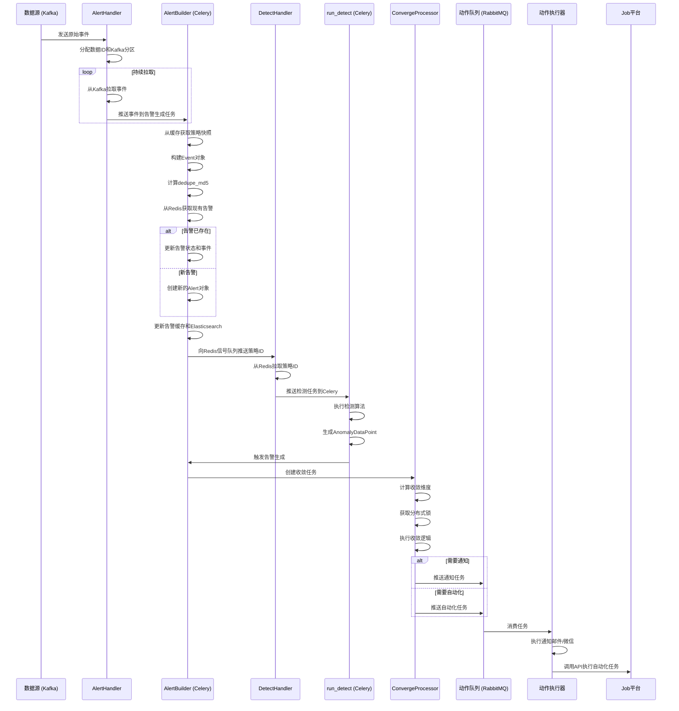

# 告警系统

<cite>
**本文档引用的文件**
- [strategy.py](file://bkmonitor/bkmonitor/strategy/strategy.py)
- [alert.py](file://bkmonitor/alarm_backends/core/alert/alert.py)
- [alarm.py](file://bkmonitor/alarm_backends/core/context/alarm.py)
- [handler.py](file://bkmonitor/alarm_backends/service/alert/handler.py)
- [core.py](file://bkmonitor/alarm_backends/service/detect/core.py)
- [processor.py](file://bkmonitor/alarm_backends/service/converge/processor.py)
- [serializers.py](file://bkmonitor/bkmonitor/strategy/serializers.py)
</cite>

## 目录
1. [引言](#引言)
2. [告警规则引擎](#告警规则引擎)
3. [告警收敛机制](#告警收敛机制)
4. [通知策略](#通知策略)
5. [告警生命周期管理](#告警生命周期管理)
6. [核心处理器职责与交互](#核心处理器职责与交互)
7. [检测结果处理与上下文管理](#检测结果处理与上下文管理)
8. [告警动作实现](#告警动作实现)
9. [告警触发到通知的完整流程](#告警触发到通知的完整流程)

## 引言
本架构文档旨在全面描述蓝鲸监控平台的告警系统设计。该系统是一个复杂、高性能的分布式系统，负责从海量监控数据中检测异常、生成告警、进行智能收敛，并通过多种渠道将告警信息通知给相关人员。文档将深入剖析其核心设计模式，包括告警规则引擎、告警收敛、通知策略和告警生命周期管理，并详细说明关键模块的内部实现与交互。

## 告警规则引擎
告警规则引擎是整个系统的核心，负责定义和执行告警的检测逻辑。其核心模型定义在 `bkmonitor/strategy/strategy.py` 文件中。

### 监控策略模型
`StrategyConfig` 类是告警规则的核心数据模型，它将一个完整的告警策略分解为多个关联的数据库模型对象，包括：
- **策略 (Strategy)**: 策略的元数据，如ID、名称、业务ID、场景和启用状态。
- **监控项 (Item)**: 定义了具体的监控指标，包括指标ID、数据源类型和监控目标。
- **查询配置 (QueryConfig)**: 定义了如何从数据源（如时序数据库、日志平台）中查询数据，包括结果表ID、聚合方法、聚合周期、聚合维度和查询条件。
- **检测算法 (DetectAlgorithm)**: 定义了判断异常的逻辑，包括算法类型（如静态阈值、同比、环比、智能检测）、算法配置、触发条件和恢复条件。
- **处理动作 (Action)**: 定义了告警触发后需要执行的动作，如发送通知或调用自动化任务。

该模型通过 `create` 和 `update` 方法实现了策略的创建和更新，确保了所有关联配置的一致性。当策略更新时，系统会自动处理如结果表拆分、CMDB层级信息补充等副作用。

### 告警规则与策略的关系
在系统中，“告警规则”通常指的是 `DetectAlgorithm` 模型中定义的检测逻辑，而“监控策略”则是一个更高层次的容器，它包含了多个监控项和检测规则。一个策略可以包含多个监控项，每个监控项又可以配置多个不同级别的检测算法。这种设计提供了极大的灵活性，允许用户在一个策略中定义复杂的、多维度的告警逻辑。

## 告警收敛机制
告警收敛是系统的关键特性，旨在解决告警风暴问题，将大量相似的告警合并为更少、更有意义的通知。

### 收敛处理器
`alarm_backends/service/converge/processor.py` 文件中的 `ConvergeProcessor` 类是收敛逻辑的核心执行者。其主要职责包括：
- **收敛条件解析**: 根据配置的收敛规则（如按告警级别、通知方式、业务维度等）生成唯一的收敛维度哈希值。
- **并发控制**: 使用Redis分布式锁 (`ACTION_CONVERGE_KEY_PROCESS_LOCK`) 来防止同一收敛维度的并发处理，确保数据一致性。
- **收敛决策**: 调用 `ConvergeManager` 和 `ConvergeFunc` 执行具体的收敛逻辑，判断是否需要将告警推入处理队列或继续等待。
- **状态管理**: 根据收敛结果更新 `ActionInstance` 或 `ConvergeInstance` 的状态（如 `CONVERGED`, `SLEEP`, `SKIPPED`）。

### 收敛类型
系统支持两种主要的收敛类型：
- **动作收敛 (ACTION)**: 针对单个处理动作（如发送邮件）的收敛，通常用于防止短时间内重复发送相同内容的通知。
- **关联收敛 (CONVERGE)**: 针对多个告警的汇总，将同一业务或场景下的多个告警合并为一个通知。

## 通知策略
通知策略定义了告警信息如何被发送给相关人员。

### 通知组模型
`bkmonitor/strategy/serializers.py` 文件中的 `NoticeGroupSerializer` 定义了通知组的数据结构。一个通知组包含：
- **通知对象 (notice_receiver)**: 可以是用户或用户组。
- **通知方式 (notice_way)**: 为不同级别的告警配置不同的通知渠道，如邮件、微信、短信、语音等。
- **通知模板**: 用于定制通知内容的模板。

### 通知实现
通知的发送是通过 `alarm_backends/service/fta_action` 模块中的 `NOTICE` 类型动作来实现的。在 `ConvergeProcessor` 的 `push_to_action_queue` 方法中，如果处理动作是通知类型，系统会将其推送到RabbitMQ队列，由专门的消费者进程执行发送。

## 告警生命周期管理
告警的生命周期从检测到异常开始，到告警恢复或关闭结束。

### 告警对象
`alarm_backends/core/alert/alert.py` 文件中的 `Alert` 类是告警生命周期的载体。它封装了告警的所有状态和行为：
- **状态管理**: 告警有 `ABNORMAL` (异常)、`RECOVERED` (已恢复) 和 `CLOSED` (已关闭) 三种状态。`update` 方法负责根据新的事件更新告警状态。
- **时间窗口**: 通过 `set_next_status` 和 `move_to_next_status` 方法实现恢复延迟和自动关闭功能。例如，一个告警可以在恢复后等待一段时间再正式关闭。
- **持久化**: `to_document` 方法将告警对象转换为Elasticsearch文档，以便存储和查询。

### 告警上下文
`alarm_backends/core/context/alarm.py` 文件中的 `Alarm` 类为告警提供了丰富的上下文信息，用于生成通知内容和展示告警详情。它提供了如 `display_dimensions` (展示维度)、`target_string` (目标字符串)、`duration_string` (持续时间) 和 `chart_image` (图表) 等属性。

## 核心处理器职责与交互
`alarm_backends/service/` 目录下的各个处理器是系统运行的“引擎”。

### Alert处理器
`alarm_backends/service/alert/processor.py` 中的 `BaseAlertProcessor` 提供了处理告警的通用方法：
- **缓存操作**: `list_alerts_content_from_cache` 从Redis中批量获取告警快照，`update_alert_cache` 将更新后的告警写回缓存。
- **持久化**: `save_alerts` 将告警信息批量写入Elasticsearch。
- **日志记录**: `save_alert_logs` 保存告警的流水日志。
- **信号发送**: `send_signal` 向关联告警模块发送信号，触发更高级别的告警处理。

### Detect处理器
`alarm_backends/service/detect/handler.py` 中的 `DetectHandler` 负责驱动检测流程：
- **任务分发**: 从Redis的 `DATA_SIGNAL_KEY` 队列中拉取待检测的策略ID。
- **智能路由**: `DetectCeleryHandler` 会检查策略是否启用了AIOPS SDK，如果是，则将任务推送到 `run_detect_with_sdk` 队列，否则推送到 `run_detect` 队列。

### Converge处理器
如前所述，`ConvergeProcessor` 负责执行收敛逻辑，是连接告警生成和告警通知的关键环节。

## 检测结果处理与上下文管理
`alarm_backends/core/` 目录下的模块提供了核心的业务逻辑。

### 检测结果处理
`alarm_backends/service/detect/core.py` 定义了数据处理的基本单元：
- **DataPoint**: 封装了从数据源获取的原始数据点，包含值、时间戳和所属监控项等信息。
- **AnomalyDataPoint**: 当 `DataPoint` 被检测器判定为异常时，会升级为 `AnomalyDataPoint`，并携带异常信息和上下文。

### 上下文管理
`alarm_backends/core/context/` 模块为各种操作提供了上下文环境。`Alarm` 类（如上所述）是其中最重要的部分，它利用 `ActionContext` 等其他上下文对象，将原始的告警数据转化为可用于通知和展示的丰富信息。

## 告警动作实现
告警动作模块实现了通知和自动化处理功能。

### 通知实现
如前所述，通知通过 `NOTICE` 类型的动作实现。系统支持多种通知方式，配置在 `NoticeGroup` 中。通知内容可以通过模板进行高度定制。

### 自动化处理
系统支持调用Job平台执行自动化任务。这通过 `alarm_backends/service/fta_action/job/` 目录下的处理器实现。当配置了Job类型的处理动作时，`ConvergeProcessor` 会将其推送到任务队列，由后台任务调用Job API执行脚本或作业。

## 告警触发到通知的完整流程

**流程图来源**
- [handler.py](file://bkmonitor/alarm_backends/service/alert/handler.py)
- [processor.py](file://bkmonitor/alarm_backends/service/converge/processor.py)
- [alert.py](file://bkmonitor/alarm_backends/core/alert/alert.py)