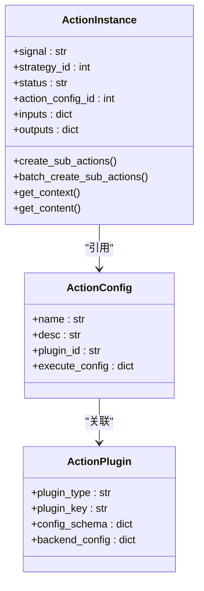
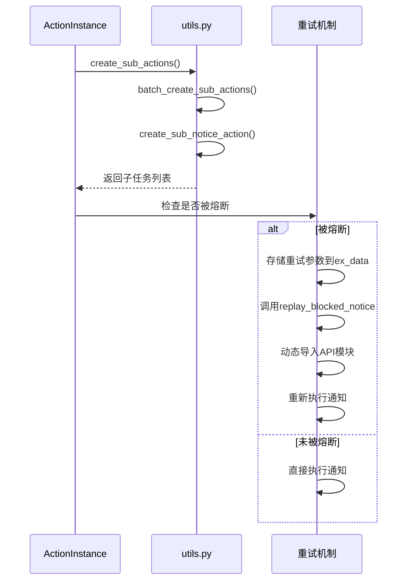
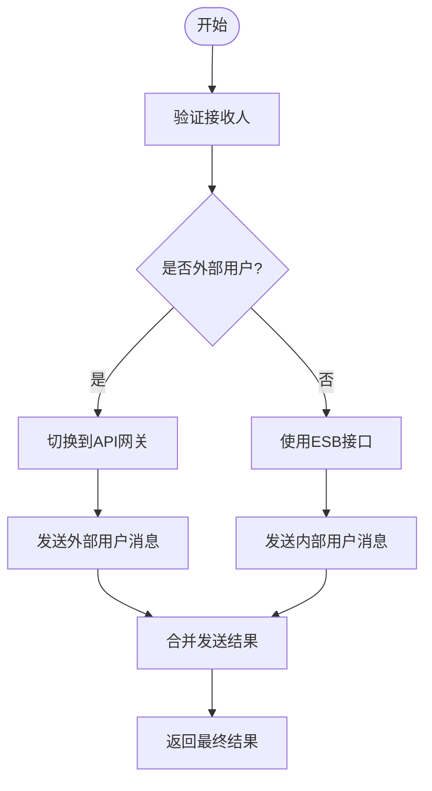
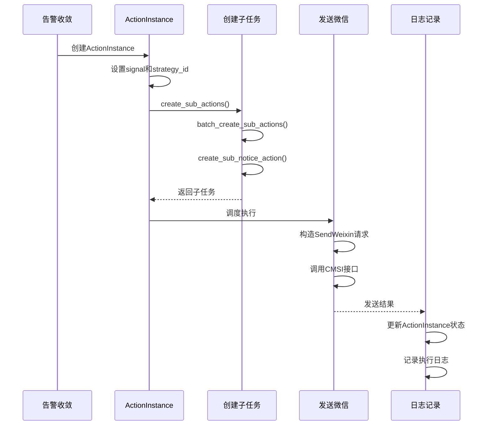

# 告警通知

<cite>
**本文档引用的文件**
- [action.py](file://bkmonitor/bkmonitor/models/fta/action.py)
- [action.py](file://bkmonitor/bkmonitor/action/utils.py)
- [converter.py](file://bkmonitor/bkmonitor/action/converter.py)
- [default.py](file://bkmonitor/api/cmsi/default.py)
- [action.py](file://bkmonitor/bkmonitor/action/duty_manage.py)
</cite>

## 目录
1. [引言](#引言)
2. [通知方式与动作执行](#通知方式与动作执行)
3. [处理器执行逻辑](#处理器执行逻辑)
4. [通知发送与重试机制](#通知发送与重试机制)
5. [多渠道消息分发](#多渠道消息分发)
6. [通知策略规则](#通知策略规则)
7. [完整告警通知流程](#完整告警通知流程)
8. [结论](#结论)

## 引言
告警通知模块是监控系统的核心组件，负责在检测到异常时及时通知相关人员。该模块通过定义灵活的通知方式和执行动作，实现了对告警事件的自动化响应。系统支持多种通知渠道，包括邮件、微信、短信等，并能根据预设策略执行相应的处理动作，如调用作业平台执行脚本。本文档将深入分析该模块的实现机制，重点阐述其核心组件的工作原理和交互流程。

## 通知方式与动作执行

告警通知模块通过`action/`目录下的组件定义通知方式和执行动作。系统支持多种通知方式，包括短信、邮件、微信、电话等，这些方式在`constants/action.py`中通过`NoticeWay`类进行定义。通知方式的配置信息存储在`ActionConfig`模型中，该模型定义了执行任务所需的参数配置。

对于执行动作，系统通过`ActionPlugin`模型定义了不同类型的插件，包括通知、HTTP回调、作业平台、标准运维等。每个插件都有对应的配置模式（config_schema），用于描述前端表单和后台执行格式。例如，作业平台插件需要配置模板ID和执行参数，而HTTP回调插件则需要配置URL、请求方法和数据格式。

当需要执行具体动作时，系统会根据`ActionConfig`中的`plugin_id`找到对应的`ActionPlugin`，然后使用`execute_config`中的参数进行实例化。这种设计实现了通知方式和执行动作的解耦，使得系统可以灵活扩展新的通知渠道和处理方式。

**Section sources**
- [action.py](file://bkmonitor/bkmonitor/models/fta/action.py#L258-L277)
- [action.py](file://bkmonitor/bkmonitor/action/utils.py#L29-L54)
- [constants/action.py](file://bkmonitor/constants/action.py#L660-L687)

## 处理器执行逻辑

`service/fta_action/`处理器是告警通知模块的核心执行引擎，它根据`ActionInstance`和`ActionConfig`模型执行具体动作。`ActionInstance`代表一个具体的执行实例，包含了执行状态、输入参数、输出结果等信息。`ActionConfig`则定义了执行动作的配置模板。

处理器的工作流程如下：首先，系统会创建一个`ActionInstance`实例，设置其`action_config_id`指向对应的`ActionConfig`。然后，根据`ActionInstance`中的`signal`（触发信号）和`strategy_id`（策略ID）确定执行条件。处理器会检查当前是否在告警时间内，以及是否满足收敛规则。

在执行过程中，处理器会根据`ActionInstance`的`inputs`参数生成上下文，并使用Jinja2模板引擎渲染通知内容。对于需要创建子任务的场景（如通知负责人和关注人），处理器会调用`create_sub_actions`方法批量创建子`ActionInstance`。每个子任务都会继承父任务的大部分属性，但会设置不同的通知方式和接收人。

**Diagram sources**
- [action.py](file://bkmonitor/bkmonitor/models/fta/action.py#L280-L337)
- [action.py](file://bkmonitor/bkmonitor/models/fta/action.py#L258-L277)

**Section sources**
- [action.py](file://bkmonitor/bkmonitor/models/fta/action.py#L280-L337)
- [action.py](file://bkmonitor/bkmonitor/models/fta/action.py#L258-L277)

## 通知发送与重试机制

`fta_action/utils.py`文件实现了通知发送的核心逻辑和重试机制。系统通过`ActionInstance`的`create_sub_actions`方法创建通知子任务，每个子任务对应一种通知方式和一组接收人。对于电话通知，系统支持串行和并行两种模式，串行模式会将多个通知请求合并为一个，以减少对用户的打扰。

重试机制主要体现在两个方面：一是HTTP回调的失败重试，二是在通知被熔断后的重新发送。对于HTTP回调，`ActionConfig`的`execute_config`中可以配置`failed_retry`参数，定义最大重试次数、重试间隔和超时时间。当回调失败时，系统会根据配置自动重试。

当通知因频繁发送被熔断时，系统会将重试参数存储在`ActionInstance`的`ex_data`字段中。通过调用`replay_blocked_notice`方法，系统可以从`ex_data`中提取重试参数，动态导入对应的API模块并重新执行通知。这种方法实现了灵活的重试策略，同时避免了硬编码的依赖。

**Diagram sources**
- [action.py](file://bkmonitor/bkmonitor/models/fta/action.py#L353-L363)
- [action.py](file://bkmonitor/bkmonitor/models/fta/action.py#L653-L724)

**Section sources**
- [action.py](file://bkmonitor/bkmonitor/models/fta/action.py#L353-L363)
- [action.py](file://bkmonitor/bkmonitor/models/fta/action.py#L653-L724)

## 多渠道消息分发

`api/cmsi/default.py`作为CMSI（消息管理服务）的接口，实现了多渠道消息分发功能。该文件定义了`CMSIBaseResource`基类和多个具体的消息发送资源，如`SendWeixin`、`SendMail`、`SendSms`等。每个资源类都继承自`APIResource`，通过RESTful API与CMSI服务进行通信。

系统通过`SendMsg`通用接口实现消息的统一发送，支持邮件、微信、短信等多种渠道。对于特殊渠道，如企业微信机器人和蓝鲸信息流，系统提供了专门的接口。在发送消息时，系统会根据`msg_type`参数选择对应的发送方式，并将消息内容进行Base64编码以支持中文字符。

消息分发流程中，系统首先会检查接收人列表，区分内部用户和外部用户。对于外部用户（邮箱以"@tai"结尾），系统会切换到API网关模式进行发送。发送成功后，系统会返回包含发送结果的响应数据，包括成功和失败的用户名列表。这种设计确保了消息能够准确送达不同类型的接收人。

**Diagram sources**
- [default.py](file://bkmonitor/api/cmsi/default.py#L291-L315)
- [default.py](file://bkmonitor/api/cmsi/default.py#L366-L453)

**Section sources**
- [default.py](file://bkmonitor/api/cmsi/default.py#L291-L315)
- [default.py](file://bkmonitor/api/cmsi/default.py#L366-L453)

## 通知策略规则

通知策略中的升级（escalation）和值班（duty）规则通过`action/duty_manage.py`和`action/utils.py`实现。升级规则允许在初始通知未得到响应时，将告警升级到更高优先级的处理组。系统通过在`ActionInstance`的`inputs`中设置`notice_type`为"upgrade"来标识升级通知，并在`options`中配置升级的用户组。

值班规则通过`DutyRule`和`DutyRuleRelation`模型实现，定义了轮值组和用户组之间的关系。系统会根据当前时间匹配对应的值班人员，并将其作为通知接收人。`get_duty_rule_user_groups`和`get_user_group_duty_rules`函数提供了双向查询接口，方便在策略执行时快速定位值班人员。

策略的执行还受到时间范围的限制，系统通过`validate_time_range`函数校验通知时间是否在允许的范围内。此外，系统支持基于规则的分派（by_rule）和仅通知（only_notice）两种模式，分别对应不同的处理逻辑。这些规则共同构成了灵活的通知策略体系，确保告警能够及时、准确地传达给相关人员。

**Section sources**
- [duty_manage.py](file://bkmonitor/bkmonitor/action/duty_manage.py)
- [utils.py](file://bkmonitor/bkmonitor/action/utils.py#L217-L257)

## 完整告警通知流程

从收敛后的告警到最终发送微信消息的完整流程如下：首先，系统检测到告警事件并进行收敛处理，生成一个`ConvergeInstance`。然后，根据关联的策略配置创建`ActionInstance`，设置其`signal`为"abnormal"，`strategy_id`为对应的策略ID。

接下来，处理器会检查`ActionInstance`的`inputs`中的`notify_item`，确认当前在告警时间内。系统根据策略配置中的用户组信息，调用`create_sub_actions`方法创建微信通知子任务。子任务的`inputs`中会包含`notice_way`为"weixin"，以及具体的接收人列表。

当子任务被调度执行时，系统会调用`api/cmsi/default.py`中的`SendWeixin`资源。该资源会构造包含标题、消息内容和接收人信息的请求数据，并通过CMSI服务发送微信消息。如果发送成功，`ActionInstance`的状态会更新为"success"，并在日志中记录发送结果；如果失败，则根据配置进行重试或标记为失败。

**Diagram sources**
- [action.py](file://bkmonitor/bkmonitor/models/fta/action.py#L353-L363)
- [default.py](file://bkmonitor/api/cmsi/default.py#L317-L364)

**Section sources**
- [action.py](file://bkmonitor/bkmonitor/models/fta/action.py#L353-L363)
- [default.py](file://bkmonitor/api/cmsi/default.py#L317-L364)

## 结论
告警通知模块通过精心设计的模型和组件，实现了灵活、可靠的通知机制。系统采用`ActionInstance`和`ActionConfig`分离的设计，既保证了配置的复用性，又确保了执行实例的独立性。多渠道消息分发接口和重试机制提高了通知的可达性和可靠性。升级和值班规则的引入，使得通知策略更加智能和人性化。整个流程从告警收敛到消息发送，各个环节紧密配合，形成了一个完整的告警响应闭环。