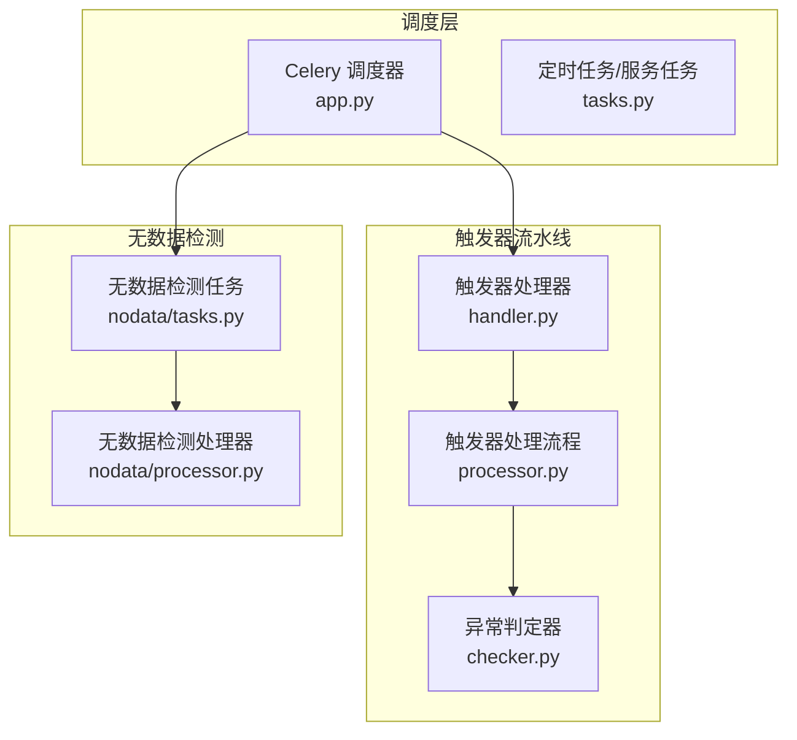
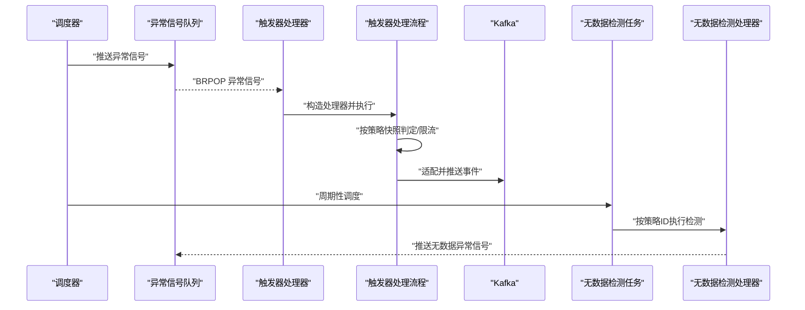
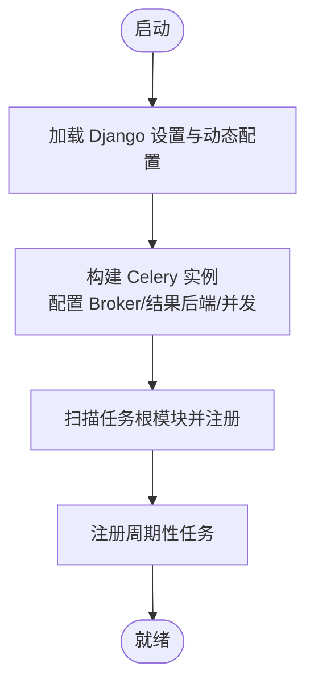
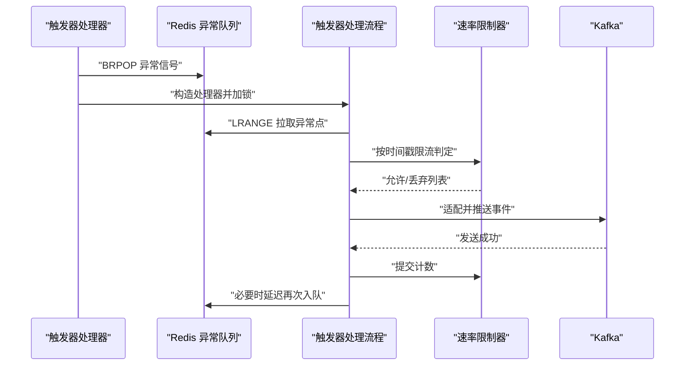
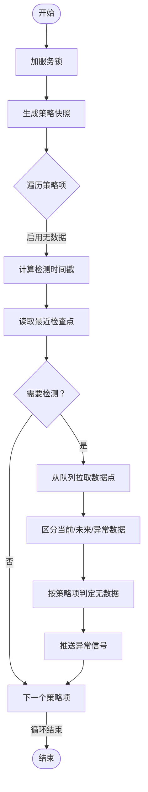
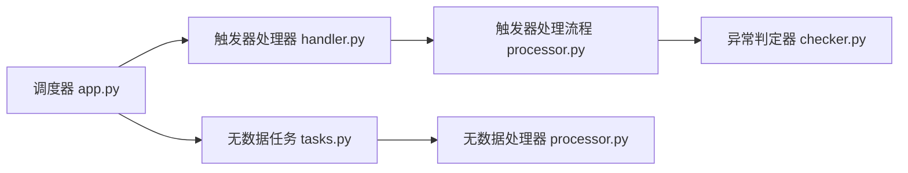

# 告警处理服务

<cite>
**本文引用的文件**
- [bkmonitor/alarm_backends/service/scheduler/app.py](file://bkmonitor/alarm_backends/service/scheduler/app.py)
- [bkmonitor/alarm_backends/service/trigger/handler.py](file://bkmonitor/alarm_backends/service/trigger/handler.py)
- [bkmonitor/alarm_backends/service/trigger/processor.py](file://bkmonitor/alarm_backends/service/trigger/processor.py)
- [bkmonitor/alarm_backends/service/nodata/processor.py](file://bkmonitor/alarm_backends/service/nodata/processor.py)
- [bkmonitor/alarm_backends/service/nodata/tasks.py](file://bkmonitor/alarm_backends/service/nodata/tasks.py)
- [bkmonitor/alarm_backends/service/README.md](file://bkmonitor/alarm_backends/service/README.md)
</cite>

## 目录
1. [简介](#简介)
2. [项目结构](#项目结构)
3. [核心组件](#核心组件)
4. [架构总览](#架构总览)
5. [组件详细分析](#组件详细分析)
6. [依赖关系分析](#依赖关系分析)
7. [性能与并发控制](#性能与并发控制)
8. [故障诊断与恢复](#故障诊断与恢复)
9. [结论](#结论)
10. [附录](#附录)

## 简介
本技术文档聚焦“告警处理服务”模块，围绕以下目标展开：
- 深入解释告警检测服务的调度机制、触发器的实现原理与无数据告警的处理逻辑
- 详述检测任务的分发策略、并发控制与负载均衡机制
- 描述告警处理流水线设计、中间状态持久化与异常情况的恢复策略
- 提供服务监控、性能指标与故障诊断方法，确保高可用与稳定性

## 项目结构
告警处理服务位于 alarm_backends/service 下，采用“功能域+流水线阶段”的组织方式：
- 调度层：基于 Celery 的调度器与任务注册
- 触发器层：从异常信号到事件生成与推送
- 无数据检测层：针对策略项的无数据告警检测
- 自监控与指标：Prometheus 指标埋点与日志

图示来源
- [bkmonitor/alarm_backends/service/scheduler/app.py:176-203](file://bkmonitor/alarm_backends/service/scheduler/app.py#L176-L203)
- [bkmonitor/alarm_backends/service/trigger/handler.py:25-75](file://bkmonitor/alarm_backends/service/trigger/handler.py#L25-L75)
- [bkmonitor/alarm_backends/service/trigger/processor.py:29-294](file://bkmonitor/alarm_backends/service/trigger/processor.py#L29-L294)
- [bkmonitor/alarm_backends/service/nodata/processor.py:31-224](file://bkmonitor/alarm_backends/service/nodata/processor.py#L31-L224)
- [bkmonitor/alarm_backends/service/nodata/tasks.py:24-47](file://bkmonitor/alarm_backends/service/nodata/tasks.py#L24-L47)

章节来源
- [bkmonitor/alarm_backends/service/README.md:1-120](file://bkmonitor/alarm_backends/service/README.md#L1-L120)

## 核心组件
- 调度器与任务注册：负责任务发现、并发与队列配置、周期性任务注册
- 触发器处理器：从异常信号队列取出信号并串行化处理，保障同策略/同指标的并发安全
- 触发器处理流程：拉取异常点、按策略快照判定、构建事件并限流后推送
- 无数据检测处理器：按策略项维度检查无数据队列，生成无数据异常并推送
- 无数据检测任务：Celery 任务封装，周期性触发无数据检测

章节来源
- [bkmonitor/alarm_backends/service/scheduler/app.py:176-203](file://bkmonitor/alarm_backends/service/scheduler/app.py#L176-L203)
- [bkmonitor/alarm_backends/service/trigger/handler.py:25-75](file://bkmonitor/alarm_backends/service/trigger/handler.py#L25-L75)
- [bkmonitor/alarm_backends/service/trigger/processor.py:29-294](file://bkmonitor/alarm_backends/service/trigger/processor.py#L29-L294)
- [bkmonitor/alarm_backends/service/nodata/processor.py:31-224](file://bkmonitor/alarm_backends/service/nodata/processor.py#L31-L224)
- [bkmonitor/alarm_backends/service/nodata/tasks.py:24-47](file://bkmonitor/alarm_backends/service/nodata/tasks.py#L24-L47)

## 架构总览
告警处理服务采用“队列驱动 + 流水线”的架构：
- 异常信号通过 Redis 队列进入触发器处理器
- 触发器处理器串行化地为每个策略/指标加锁，避免并发冲突
- 触发器处理流程按策略快照进行判定，生成事件并进行速率限制
- 无数据检测通过 Celery 定时任务扫描策略项的无数据队列，生成无数据异常

图示来源
- [bkmonitor/alarm_backends/service/trigger/handler.py:28-75](file://bkmonitor/alarm_backends/service/trigger/handler.py#L28-L75)
- [bkmonitor/alarm_backends/service/trigger/processor.py:59-294](file://bkmonitor/alarm_backends/service/trigger/processor.py#L59-L294)
- [bkmonitor/alarm_backends/service/nodata/tasks.py:24-47](file://bkmonitor/alarm_backends/service/nodata/tasks.py#L24-L47)
- [bkmonitor/alarm_backends/service/nodata/processor.py:166-224](file://bkmonitor/alarm_backends/service/nodata/processor.py#L166-L224)

## 组件详细分析

### 调度机制与任务分发
- 任务发现与自动注册：通过包扫描自动发现任务模块并注册
- 并发与队列：Celery worker 并发按 CPU 根数函数估算；默认队列名与路由键固定
- 周期性任务：提供 PeriodicTask 基类，支持将任务加入 beat_schedule
- Broker 与结果后端：支持 Sentinel 与直连两种 Redis 配置，RedBeat 锁超时配置

图示来源
- [bkmonitor/alarm_backends/service/scheduler/app.py:28-39](file://bkmonitor/alarm_backends/service/scheduler/app.py#L28-L39)
- [bkmonitor/alarm_backends/service/scheduler/app.py:176-203](file://bkmonitor/alarm_backends/service/scheduler/app.py#L176-L203)
- [bkmonitor/alarm_backends/service/scheduler/app.py:220-250](file://bkmonitor/alarm_backends/service/scheduler/app.py#L220-L250)

章节来源
- [bkmonitor/alarm_backends/service/scheduler/app.py:42-94](file://bkmonitor/alarm_backends/service/scheduler/app.py#L42-L94)
- [bkmonitor/alarm_backends/service/scheduler/app.py:96-173](file://bkmonitor/alarm_backends/service/scheduler/app.py#L96-L173)
- [bkmonitor/alarm_backends/service/scheduler/app.py:184-203](file://bkmonitor/alarm_backends/service/scheduler/app.py#L184-L203)
- [bkmonitor/alarm_backends/service/scheduler/app.py:220-250](file://bkmonitor/alarm_backends/service/scheduler/app.py#L220-L250)

### 触发器实现原理
- 信号消费：从异常信号队列 BRPOP 取出信号，解析 strategy_id/item_id
- 并发控制：按策略/指标粒度加服务锁，避免重复处理
- 处理流程：
  - 拉取异常点：从 Redis 列表拉取并翻转，按旧到新顺序处理
  - 限流策略：按（策略ID、指标ID、数据时间戳）维度限流，Redis MGET/MSET 控制额度
  - 事件适配与推送：将事件适配为 Kafka 消息并发送，成功后提交计数
  - 拉取未尽：若达到最大处理量，延迟再次入队继续处理

图示来源
- [bkmonitor/alarm_backends/service/trigger/handler.py:28-75](file://bkmonitor/alarm_backends/service/trigger/handler.py#L28-L75)
- [bkmonitor/alarm_backends/service/trigger/processor.py:59-294](file://bkmonitor/alarm_backends/service/trigger/processor.py#L59-L294)

章节来源
- [bkmonitor/alarm_backends/service/trigger/handler.py:25-75](file://bkmonitor/alarm_backends/service/trigger/handler.py#L25-L75)
- [bkmonitor/alarm_backends/service/trigger/processor.py:29-294](file://bkmonitor/alarm_backends/service/trigger/processor.py#L29-L294)

### 无数据告警处理逻辑
- 无数据队列：每个策略项维护一个无数据记录队列
- 拉取与清洗：按检测时间窗口从队列拉取数据点，剔除未来时间点，保留当前窗口内与最早未来窗口内的数据
- 检测与推送：调用策略项的无数据检测逻辑，生成异常并推送
- 去重与幂等：基于最近检查点缓存字段去重，避免重复检测
- 令牌桶限流：对处于流控的策略项跳过检测，降低抖动

图示来源
- [bkmonitor/alarm_backends/service/nodata/processor.py:166-224](file://bkmonitor/alarm_backends/service/nodata/processor.py#L166-L224)

章节来源
- [bkmonitor/alarm_backends/service/nodata/processor.py:31-224](file://bkmonitor/alarm_backends/service/nodata/processor.py#L31-L224)
- [bkmonitor/alarm_backends/service/nodata/tasks.py:24-47](file://bkmonitor/alarm_backends/service/nodata/tasks.py#L24-L47)

## 依赖关系分析
- 触发器处理器依赖 Redis 队列与服务锁，保障并发安全
- 触发器处理流程依赖策略快照与异常判定器，最终适配并推送事件
- 无数据检测依赖 Redis 队列、服务锁与最近检查点缓存，结合令牌桶限流
- 调度器提供统一的任务并发与队列配置，支持 Sentinel 与直连两种后端

图示来源
- [bkmonitor/alarm_backends/service/scheduler/app.py:176-203](file://bkmonitor/alarm_backends/service/scheduler/app.py#L176-L203)
- [bkmonitor/alarm_backends/service/trigger/handler.py:25-75](file://bkmonitor/alarm_backends/service/trigger/handler.py#L25-L75)
- [bkmonitor/alarm_backends/service/trigger/processor.py:29-294](file://bkmonitor/alarm_backends/service/trigger/processor.py#L29-L294)
- [bkmonitor/alarm_backends/service/nodata/tasks.py:24-47](file://bkmonitor/alarm_backends/service/nodata/tasks.py#L24-L47)
- [bkmonitor/alarm_backends/service/nodata/processor.py:31-224](file://bkmonitor/alarm_backends/service/nodata/processor.py#L31-L224)

章节来源
- [bkmonitor/alarm_backends/service/scheduler/app.py:176-203](file://bkmonitor/alarm_backends/service/scheduler/app.py#L176-L203)

## 性能与并发控制
- 并发与队列
  - worker 并发按 CPU 根数函数估算，避免过度占用
  - 默认队列名与路由键固定，便于隔离与扩展
- 速率限制
  - 触发器按（策略ID、指标ID、数据时间戳）维度限流，Redis MGET/MSET 控制额度
  - 超阈值丢弃并上报指标，fail-open 保证稳定性
- 令牌桶限流
  - 无数据检测对处于流控的策略项跳过检测，降低抖动
- 拉取未尽与延迟重试
  - 触发器单次处理达到上限时，延迟再次入队，确保全量处理
- 指标与可观测性
  - 处理耗时、事件推送量、延迟、超大批次溢出、限流丢弃等指标全面覆盖

章节来源
- [bkmonitor/alarm_backends/service/scheduler/app.py:42-94](file://bkmonitor/alarm_backends/service/scheduler/app.py#L42-L94)
- [bkmonitor/alarm_backends/service/trigger/processor.py:23-25](file://bkmonitor/alarm_backends/service/trigger/processor.py#L23-L25)
- [bkmonitor/alarm_backends/service/trigger/processor.py:83-165](file://bkmonitor/alarm_backends/service/trigger/processor.py#L83-L165)
- [bkmonitor/alarm_backends/service/trigger/processor.py:167-181](file://bkmonitor/alarm_backends/service/trigger/processor.py#L167-L181)
- [bkmonitor/alarm_backends/service/trigger/processor.py:68-73](file://bkmonitor/alarm_backends/service/trigger/processor.py#L68-L73)
- [bkmonitor/alarm_backends/service/nodata/processor.py:177-183](file://bkmonitor/alarm_backends/service/nodata/processor.py#L177-L183)

## 故障诊断与恢复
- 锁竞争与重试
  - 获取服务锁失败时延迟重试，避免瞬时拥塞放大
- 异常捕获与指标上报
  - 处理过程异常被捕获并上报状态指标，便于定位
- 限流与丢弃
  - 速率限制触发时记录丢弃明细，辅助容量规划
- 最近检查点去重
  - 无数据检测基于缓存字段去重，避免重复处理
- 指标与日志
  - 全链路指标与关键路径日志，便于快速定位瓶颈与异常

章节来源
- [bkmonitor/alarm_backends/service/trigger/handler.py:54-60](file://bkmonitor/alarm_backends/service/trigger/handler.py#L54-L60)
- [bkmonitor/alarm_backends/service/trigger/handler.py:61-67](file://bkmonitor/alarm_backends/service/trigger/handler.py#L61-L67)
- [bkmonitor/alarm_backends/service/trigger/processor.py:147-165](file://bkmonitor/alarm_backends/service/trigger/processor.py#L147-L165)
- [bkmonitor/alarm_backends/service/nodata/processor.py:205-211](file://bkmonitor/alarm_backends/service/nodata/processor.py#L205-L211)

## 结论
告警处理服务通过“队列驱动 + 流水线 + 限流 + 去重 + 指标”的组合，实现了高吞吐、低抖动、可恢复的告警处理能力。调度层提供稳定的并发与队列配置，触发器层保障并发安全与速率控制，无数据检测层通过去重与限流避免误报与拥塞。配套的指标与日志为运维提供了完整的可观测性支撑。

## 附录
- 服务监控建议
  - 关注处理耗时、事件推送量、延迟、限流丢弃、超大批次溢出等指标
  - 结合日志级别与采样策略，定位异常与瓶颈
- 性能优化建议
  - 根据业务峰值调整 worker 并发与队列数量
  - 合理设置速率限制阈值与 TTL，平衡吞吐与实时性
  - 对热点策略项引入令牌桶限流，避免突发流量冲击